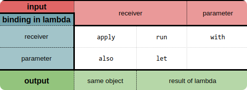

# Funciones de alcance (scope functions)

Kotlin proporciona un conjunto de funciones que ayudan a aclarar un poco más el código y hacen la programación unpoco mas divertiadas. Estas funciones se llaman scope functions.

> **Scope functions:** el propósito de estas funciones es ejecutar un bloque de código dentro del contexto de un objeto.

La librería estándar actualmente cuenta con las siguientes funciones de alcance: `let`, `run`, `with`, `apply` y `also`.

## ¿Cómo usarlas?

Hay dos elementos que las diferencian:

1. Cómo accedemos al objeto referenciado dentro del scope:
   - Para las funciones `let` y `also` accedemos mediante el `it`.
   - Para `run`, `with` y `apply` utilizamos `this`.
2. Qué valor retorna:
   - `apply` y `also` devuelven el objeto como tal, tras ejecutar el bloque de código.
   - `let`, `run` y `with` devuelven el valor de retorno del lambda que reciben, es decir, retorna el valor de nuestra última sentencia ejecutada en ese lambda.

Por otra parte tambien podemos hacer la siguiente distinción entre ellas:



- **Input**: 
  - input receiver, recibe el objeto mediante llamada a funciones de extension: `apply`, `run`, `also`, `let`. 
  - input parameter, recibe el objeto como parámetro: `with`

- **Binding in lambda** 
  - Receiver `this`: El mismo objeto es quien recibe la llamada de las funciones `apply`, `run`, `with`
  - Parameter `it`: `also`, `let`. En este caso, nos permite llamar a una referencia pasándole `it` como argumento, por ejemplo ::println

- **Output**
  - El mismo objeto: `apply`, `also`.
  - El resultado de la lambda: `run`, `let`, `with`. `run` y `with son lo mismo, salvo que `run es una función de extensión.

Podemos ver la definición de cada una de estas funciones a continuación:

```kotlin
//with
inline fun <T, R> with(receiver: T, block: T.() -> R): R {
    return receiver.block()
}

//also
inline fun <T> T.also(block: (T) -> Unit): T {
    block(this)
    return this
}

//apply
inline fun <T> T.apply(block: T.() -> Unit): T {
    block()
    return this
}

//let
inline fun <T, R> T.let(block: (T) -> R): R {
    return block(this)
}

//run
inline fun <T, R> T.run(block: T.() -> R): R {
    return block()
}
```

Y ejemplos de uso de cada uno de ellas.

```kotlin

//with
val r: R = with(T()) { this.foo(); this.toR() }

//also
val t: T = T().also { it.foo() }

//apply
val t: T = T().apply { this.foo() }

//let
val r: R = T().let { it.foo(); it.toR() }

//run
val r: R = T().run { this.foo(); this.toR() }

```

## ¿Cuándo usarlas?

Si bien todas realizan la misma función, lo que cambia, además de lo previamente mencionado, es el contexto, y es ahí donde debemos distinguir qué función conviene utilizar.

### let

```kotlin
// `let` implementation without contract
inline fun <T, R> T.let(block: (T) -> R): R = block(this)
```

`let`, por ejemplo, se suele utilizar en dos situaciones distintas, cuando queremos ejecutar un bloque de código solo con valores no nulos o para invocar una o más funciones con resultados en cadena. Unos ejemplos sencillos serían:

```kotlin
val str: String? = "Hello"   
val value = str?.let { 
   "$it world"
}
println(value)

~ Hello world
```

```kotlin
val numbers = mutableListOf("one", "two", "three", "four", "five")
numbers.map { it.length }.filter { it > 3 }.let {
println(it)
}

~ [5, 4, 4]
```

### run

```kotlin
// `run` implementation without contract
inline fun <R> run(block: () -> R): R = block()

// `run` implementation without contract
inline fun <T, R> T.run(block: T.() -> R): R = block()
```

El `run` se suele utilizar cuando inicializamos una variable seguido de una interacción con la misma.
Tiene la particularidad de que no siempre es necesario utilizar el `this` para referenciar al objeto dentro del scope, como en el siguiente ejemplo:

```kotlin
fun request(status: String): String = "Result for request '$status'"
val result = service.run {
  status = 200
  query("$status")
}
print(result)

~ Result for query '200'
```

### apply

```kotlin
// `apply` implementation without contract
inline fun <T> T.apply(block: T.() -> Unit): T {
    block()
    return this
}
```

En el caso del `apply`, es común utilizarlo para la inicialización de objetos.
Se lee como: *aplicar las siguientes asignaciones al objeto.*

```kotlin
val user = User("Lucas").apply {
  age = 26
  country = "Argentina"
  address = "Avenida Siempre Viva 742"
}
print(user)

~ Person(name=Lucas, age=26, country=Argentina, address=Avenida Siempre Viva 742)
```

### also

```kotlin
// `also` implementation without contract
inline fun <T> T.also(block: (T) -> Unit): T {
    block(this)
    return this
}
```

`also`, tiene un buen uso cuando realizamos algunas acciones que no están estrictamente relacionadas con el objeto en sí, pero que lo utilizan como argumento.
Se lee como: *y además, realiza lo siguiente.*

```kotlin
getResults(fooParam).also {
   Log.v(TAG, "It's greater than ${it}")
}
```

### with

```kotlin
// `with` implementation without contract
inline fun <T, R> with(receiver: T, block: T.() -> R): R =
    receiver.block()
```

`with`, a diferencia de las demás funciones, pasa al objeto como parámetro en vez de ser el objeto quién llame a la función. Se suele utilizar en contextos donde no necesitamos obtener un resultado en sí mismo, sino que queremos aplicar una operación con/sobre el objeto.
Se lee como: *con este objeto, hacemos lo siguiente.*

```kotlin
val numbers = mutableListOf("one", "two", "three")
val firstAndLast = with(numbers) {
    "The first element is ${first()}," +
    " the last element is ${last()}"
}
print(firstAndLast)

~ The first element is one, the last element is three
```

## ¿Cómo estas funciones nos podrían ayudar a dar claridad a nuestro código?

Bueno, pongamos un ejemplo más cercano a la realidad para verlo con mejor perspectiva. Supongamos que tenemos la siguiente función, que sirve para actualizar una vista en Android.
```kotlin
fun bind(fooDTO: FooDTO?) {
    if (fooDTO != null) {
      if (fooDTO.title != null) {
        tv_title.text = fooDTO.title
      } else {
        container_title.visibility = GONE
      }
      if (fooDTO.listFoo != null) {
        fooDTO.listFoo.forEach { objectList ->
            if (objectList != null && objectList.text != null) {
              itemView.text = objectList.text
              container_body.addView(itemView)
            }
        }
      } else {
        container_body.visibility = GONE
      }
    }
}
```

¿Bastante engorroso a simple vista no?
Ahora cambiemos los *if-else* por **scope functions.** Nos quedaría algo como:
```kotlin
fun bind(fooDTO: FooDTO?) {
    fooDTO?.let {
        it.title?.let { tv_title.text = it }
        :? run { container_title.visibility = GONE }

        it.listFoo?.forEach { objectList ->
            objectList?.text?.run {
                itemView.text = this
                container_body.addView(itemView)
            }
        } :? run { container_body.visibility = GONE }
    }
}
```

Obviamente cada una de las funciones elegidas pueden ser discutidas, en cuanto a si es el `run` o el `apply` el que debería usar, por dar un ejemplo, pero creo que podemos coincidir en que, la estructura completa del método *(función en Kotlin)* y la coherencia del código, es mucho más acertada que en la versión anterior.

## Otras funciones
Existen otras dos funciones que son muy útiles, pero que no entran en el espectro de las  **scope functions** , que son `takeIf` y `takeUnless`. Estas funciones nos permiten ejecutar acciones dependiendo del estado del objeto. Si la condición se cumple, retorna el objeto y sino devuelve `null`.
```kotlin
val positiveNumber = number.takeIf { it >= 0 }
val negativeNumber = number.takeUnless { it >= 0 }
```

Si combinamos las diferentes funciones, junto con el operador de nullabilidad `?.`, podemos notar cómo el código va tomando un formato más natural.

```kotlin
fooDTO?.let {
    it.title?.takeIf { it.isNotEmpty() }?.apply { tv_title?.text = this }
        ?: run { tv_title?.visibility = GONE }

    it.subtitle?.takeIf { it.isNotEmpty() }?.apply { tv_subtitle?.text = this }
        ?: run { tv_subtitle?.visibility = GONE }
}
```

Como se indica en la [documentación oficial](https://kotlinlang.org/docs/reference/scope-functions.html):

> Las funciones de alcance no introducen nuevas capacidades técnicas, pero pueden hacer que su código sea más conciso y legible.

## Fuente

* [Funciones de alcance (scope functions)](https://medium.com/droid-latam/kotlin-traducido-funciones-de-alcance-scope-functions-b5b21b656392)
* [Kotlin Scoping Functions apply vs. with, let, also, and run](https://medium.com/@fatihcoskun/kotlin-scoping-functions-apply-vs-with-let-also-run-816e4efb75f5)
* [Scope Functions - kt.academy](https://kt.academy/article/fk-scope-functions)
* [Resumen de scope functions](https://docs.google.com/spreadsheets/d/1P2gMRuu36pSDW4fdwE-fLN9fcA_ZboIU2Q5VtgixBNo/edit#gid=0)
