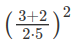
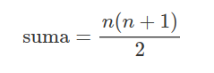

## P1.2 - Ejercicios


#### **Ejercicio 1.2.1**

Escribe un programa que pida el nombre del usuario para luego darle la bienvenida.

```
Escribe tu nombre: Juan
Hola, Juan.
```

#### **Ejercicio 1.2.2**

Escribe un programa para pedirle al usuario las horas de trabajo y el precio por hora y calcule el importe total del servicio.

```
Horas de trabajo: 6
Coste por hora: 10
Importe total: 60
```

#### **Ejercicio 1.2.3**

Suponiendo que se han ejecutado las siguientes sentencias de asignación:

```
ancho = 17
alto = 12.0
```

Para cada una de las expresiones siguientes, intenta adivinar el valor de la expresión y su tipo sin ejecutarlas en  el intérprete:

```
1. ancho / 2
2. ancho // 2
3. alto / 3
4. 1 + 2 * 5
```
Cuando termines comprueba con el intérprete si has acertado.

#### **Ejercicio 1.2.4**

Escribe un programa que le pida al usuario una temperatura en grados Celsius, la convierta a grados Fahrenheit e imprima por pantalla la temperatura convertida.

#### **Ejercicio 1.2.5**

Escribe un programa que pida el importe sin IVA de un artículo y el tipo de IVA a aplicar y calcule e imprima por pantalla el precio final del artículo.

#### **Ejercicio 1.2.6**

Escribe un programa que pida el importe final de un artículo y calcule e imprima por pantalla el IVA que se ha pagado y el importe sin IVA (suponiendo que se ha aplicado un tipo de IVA del 10%).

#### **Ejercicio 1.2.7**

Escribe un programa que solicite tres números al usuario y calcule e imprima por pantalla su suma.

#### **Ejercicio 1.2.8**

Escribir el programa del ejercicio 1.7 usando solamente dos variables diferentes.

#### **Ejercicio 1.2.9**

¿Es posible escribir el programa del ejercicio 1.7 sin usar variables? Inténtalo.


#### **Ejercicio 1.2.10**
Escribir un programa que muestre por pantalla el resultado de la siguiente operación aritmética




#### **Ejercicio 1.2.11**

Escribir un programa que lea un entero positivo, n, introducido por el usuario y después muestre en pantalla la suma de todos los enteros desde 1 hasta n. La suma de los n primeros enteros positivos puede ser calculada de la siguiente forma:




#### **Ejercicio 1.2.12**

Escribir un programa que pida al usuario su peso (en kg) y estatura (en metros), calcule el índice de masa corporal y lo almacene en una variable, y muestre por pantalla la frase Tu índice de masa corporal es <imc> donde <imc> es el índice de masa corporal calculado redondeado con dos decimales.


#### **Ejercicio 1.2.13**

Escribir un programa que pida al usuario dos números enteros y muestre por pantalla los siguienteS: "la división de `n` entre `m` da un cociente `c` y un resto `r`", donde `n` y `m` son los números introducidos por el usuario, y `c` y `r` son el cociente y el resto de la división entera respectivamente.


#### **Ejercicio 1.2.14**

Una juguetería tiene mucho éxito en dos de sus productos: payasos y muñecas. Suele hacer venta por correo y la empresa de logística les cobra por peso de cada paquete así que deben calcular el peso de los payasos y muñecas que saldrán en cada paquete a demanda. Cada payaso pesa 112 g y cada muñeca 75 g. Escribir un programa que lea el número de payasos y muñecas vendidos en el último pedido y calcule el peso total del paquete que será enviado.


#### **Ejercicio 1.2.15**

Imagina que acabas de abrir una nueva cuenta de ahorros que te ofrece el 4% de interés al año. Estos ahorros debido a intereses, que no se cobran hasta finales de año, se te añaden al balance final de tu cuenta de ahorros. Escribir un programa que comience leyendo la cantidad de dinero depositada en la cuenta de ahorros, introducida por el usuario. Después el programa debe calcular y mostrar por pantalla la cantidad de ahorros tras el primer, segundo y tercer años. Redondear cada cantidad a dos decimales.

```Calcula el interés: capital * (1 + interes)```

#### **Ejercicio 1.2.16**

Una panadería vende barras de pan a 3.49€ cada una. El pan que no es el día tiene un descuento del 60%. Escribir un programa que comience leyendo el número de barras vendidas que no son del día. Después el programa debe mostrar el precio habitual de una barra de pan (establecido en el programa como una constante), el descuento que se le hace por no ser fresca y el coste final total de todas las barras no frescas.


#### **Ejercicio 1.2.17**
Escribir un programa que pregunte el nombre del usuario en la consola y un número entero e imprima por pantalla en líneas distintas el nombre del usuario tantas veces como el número introducido.


#### **Ejercicio 1.2.18**
Escribir un programa que pregunte el nombre completo del usuario en la consola y después muestre por pantalla el nombre completo del usuario tres veces, una con todas las letras minúsculas, otra con todas las letras mayúsculas y otra solo con la primera letra del nombre y de los apellidos en mayúscula. El usuario puede introducir su nombre combinando mayúsculas y minúsculas como quiera.


#### **Ejercicio 1.2.19**
Escribir un programa que pregunte el nombre del usuario en la consola y después de que el usuario lo introduzca muestre por pantalla "`NOMBRE` tiene `n` letras.", donde `NOMBRE` es el nombre de usuario en mayúsculas y `n` es el número de letras que tienen el nombre.


#### **Ejercicio 1.2.20**
Los teléfonos de una empresa tienen el siguiente formato prefijo-número-extension donde el prefijo es el código del país +34, y la extensión tiene dos dígitos (por ejemplo +34-913724710-56). Escribir un programa que pregunte por un número de teléfono con este formato y muestre por pantalla el número de teléfono sin el prefijo y la extensión.


#### **Ejercicio 1.2.21**
Escribir un programa que pida al usuario que introduzca una frase en la consola y muestre por pantalla la frase invertida.


#### **Ejercicio 1.2.22**
Escribir un programa que pida al usuario que introduzca una frase en la consola y una vocal, y después muestre por pantalla la misma frase pero con la vocal introducida en mayúscula.


#### **Ejercicio 1.2.23**
Escribir un programa que pregunte el correo electrónico del usuario en la consola y muestre por pantalla otro correo electrónico con el mismo nombre (la parte delante de la arroba @) pero con dominio ceu.es.


#### **Ejercicio 1.2.24**
Escribir un programa que pregunte por consola el precio de un producto en euros con dos decimales y muestre por pantalla el número de euros y el número de céntimos del precio introducido.


#### **Ejercicio 1.2.25**
Escribir un programa que pregunte al usuario la fecha de su nacimiento en formato dd/mm/aaaa y muestra por pantalla, el día, el mes y el año. Adaptar el programa anterior para que también funcione cuando el día o el mes se introduzcan con un solo carácter.


#### **Ejercicio 1.2.26**
Escribir un programa que pregunte por consola por los productos de una cesta de la compra, separados por comas, y muestre por pantalla cada uno de los productos en una línea distinta.


#### **Ejercicio 1.2.27**
Escribir un programa que pregunte el nombre el un producto, su precio y un número de unidades y muestre por pantalla una cadena con el nombre del producto seguido de su precio unitario con 6 dígitos enteros y 2 decimales, el número de unidades con tres dígitos y el coste total con 8 dígitos enteros y 2 decimales.


