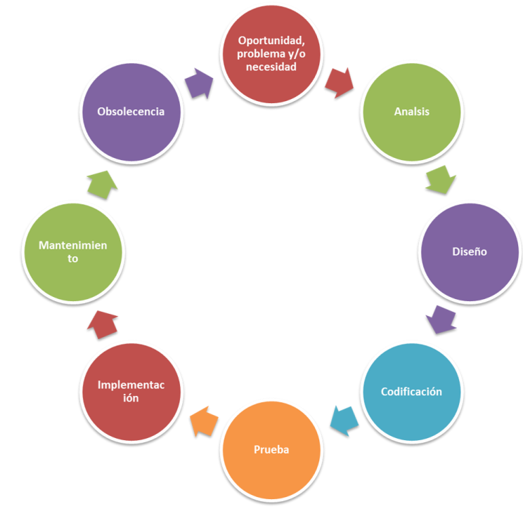
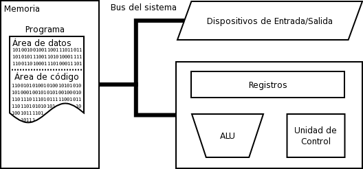
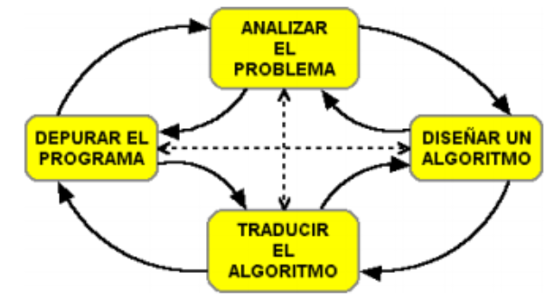
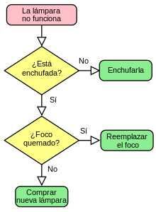

## 1.1. Un programa informático

Un programa informático es un conjunto de instrucciones que permiten a un dispositivo, como un ordenador, realizar tareas específicas. Estas instrucciones están escritas en un lenguaje de programación y traducidas a lenguaje de máquina para que el hardware pueda ejecutarlas. Los programas se desarrollan para resolver problemas o automatizar procesos, siguiendo un ciclo que incluye la planificación, codificación, prueba y mantenimiento. A lo largo del proceso de programación, se utilizan herramientas y entornos que facilitan la creación y gestión del software

### 1. La programación
* [Definición](https://es.wikipedia.org/wiki/Programaci%C3%B3n): Es el **proceso** por el cual se desarrolla un **programa**, haciendo uso de herramientas, entre otras: un **lenguajes de programación** mediante el que se indican las instrucciones al dispositivo y un **traductor** que sea capaz de *traducirlo* al lenguaje máquina. Este lenguaje máquina lo *entiende* el microprocesador del dispositivo (ordenador, móvil, tablet,...)
* El **Ciclo de vida** para el desarrollo de un programa es: Entender el problema, Recopilar requisitos, Planificar, Diseñar, Programar, Probar, Desplegar, Mantener.

<center></center>

### 2. Ordenador (o cualquier otro dispositivo)
* **Máquina** electrónica, analógica o digital, dotada de una memoria y de métodos de tratamiento de la información, capaz de resolver problemas matemáticos y lógicos mediante la utilización de programas informáticos.
* Un ordenador **ejecuta programas**, que son un conjunto de instrucciones representadas mediante un lenguaje de programación y datos que se ejecutan de forma secuencial y que a partir de unos datos de entrada producen una salida. Para ejecutar esos programas el ordenador sigue esta estructura básica:

<center></center>

### 3. ¿Qué es un programa o software?
El **software**, de acuerdo con el IEEE: “es el conjunto de los programas de cómputo, procedimientos, reglas, documentación y datos asociados, que forman parte de las operaciones de un sistema de computación”.

Dicho en otras palabras, son todos los programas o aplicaciones incluidas en un dispositivo y que le permiten realizar tareas específicas.

El software le da instrucciones al hardware de la forma como debe realizar una tarea, por esta razón, todos los programas que usamos en un dispositivo son software, por ejemplo:

* Navegador web como Google Chrome o Mozilla Firefox.
* Sistemas operativos como Windows, Mac OS, Linux, Android, entre otros.
* Antivirus.
* Aplicaciones de ofimática como Microsoft Word.
* Sistemas empresariales como un BPMS, ERP, CRM, entre otros.

#### 3.1. Tipos de software
* **De sistema** (Sistema operativo, drivers -controladores-)
* **De aplicación** (Suite ofimática, Navegador, Edición de imagen, ...)
* **De desarrollo** (Editores, compiladores, interpretes, ...)

> Los drivers son los controladores de dispositivos.

### 4. Relación Hardware-Software  
  
La relación entre el **software** y el **hardware** se pueden describir de la siguiente forma:  
  
* **Disco duro**: almacena de forma permanente los archivos ejecutables y los archivos de datos.  
* **Memoria RAM**: almacena de forma temporal el código binario de los archivos ejecutables y los archivos de datos necesarios.  
* **CPU**: lee y ejecuta instrucciones almacenadas en memoria RAM, así como los datos necesarios.  
* **E/S**: estos dispositivos recogen nuevos datos desde la entrada, muestran los resultados, leen/guardan a disco, etc.  
  
  
> El disco duro se considera un periférico de E/S (Entrada/Salida).

> La CPU se llama también UCP (en inglés), procesador o microprocesador.

### 5. Algoritmos
Como decíamos, la programación es el proceso que se utiliza para la creación de programas que se ejecutan en dispositivos con capacidad de cómputo. Estos programas son creados para satisfacer unas necesidades o resolver problemas.

Para que este proceso tenga éxito, se ha de analizar el problema que se quiere satisfacer y describir cada paso que se va a realizar, es decir, se ha de diseñar el algoritmo (secuencia de pasos) que se va a seguir para llegar a la solución.

**Algoritmo**: En términos de programación, un algoritmo es una secuencia de pasos lógicos que permiten solucionar un problema.

Una vez se tenga el algoritmo, se podrá pasar a su codificación, es decir, escribir ese algoritmo a código fuente mediante un lenguaje de programación y por último se generará el programa que se ejecutará en el ordenador para poder depurarse antes de darlo por finalizado.

<center>  </center>


#### 5.1 Características de los algoritmos   
   
Según *Joyanes* en su libro “Fundamentos de la programación”, las características que debe tener cualquier algoritmo son:   
   
* **Preciso**: se debe indicar el orden de realización de cada paso.   
* **Definido**: si se sigue un algoritmo dos veces con las mismas entradas, se debe obtener el mismo resultado.   
* **Finito**: todo algoritmo debe terminar en algún momento.   
   

> Las algoritmos son **independientes del lenguaje en el que se implementan** y del dispositivo en el que se ejecutan. 
> Aprender a programar, no es aprender un lenguaje de programación, si no realizar algoritmos correctos que resuelvan un problema.

#### 5.2 Pseudocodigo y diagramas de flujo

El **pseudocódigo** se puede considerar como un lenguaje intermedio entre el lenguaje humano y el lenguaje de programación y las palabras reservadas de este. También permite la representación de las estructuras de control y la asignación de manera muy fácil.

Supongamos que queremos resolver un problema, sobre "*como realizar el mantenimiento de una lámpara*".


```  

Si la lampara funciona entonces
    fin. # (1)
Si no
    Si la lampara NO está enchufada entonces
        Enchufarla.
    Si el foco está quemado entonces
        Reemplazar el foco.
    Si sigue sin funcionar entonces
        Comprar nueva lámpara.
fin. # (1)      

``` 

1.  :man_raising_hand: Con la palabra `fin`, __finaliza__ el programa.

Los **diagramas de flujo** son representaciones gráficas de la secuencia de operaciones que se realizan dentro de un algoritmo.
Se representan mediante un conjunto de formas unidas por flechas. Para indicar el inicio del diagrama, se representa en un óvalo la palabra “inicio”. Una secuencia de operaciones se representan mediante una secuencia (lo más detallada posible) de rectángulos de arriba-abajo o derecha-izquierda. Un rombo representa una operación condicional con dos posibles caminos a seguir.

<center></center>

**¿Podrías mejorar el algoritmo anterior?**

### 6. Lenguajes de programación
Un **lenguaje de programación** es un lenguaje formal que especifica una serie de instrucciones que pueden ser usadas para generar diversos tipos de datos, controlar el flujo de ejecución y representar datos. Los lenguajes de programación permiten a los programadores especificar de manera precisa las instrucciones que un ordenador debe seguir para llevar a cabo una tarea.

Este punto se estudiará de forma general en el módulo de entornos de desarrollo y particularmente (kotlin y python) en en las siguientes unidades.

- [TIOBE](https://www.tiobe.com/tiobe-index/)
- [Encuesta stackoverflow](https://insights.stackoverflow.com/survey/2021#overview)
- ¿Que lenguajes de programación conoces?
- ¿Tienes alguna preferencia?
- ¿Cuál crees que se adapta mejor a:
    * [multiplataforma](https://kotlinlang.org/docs/mpp-intro.html)?
    * [desarrollo web](https://keepcoding.io/blog/lenguajes-desarrollo-web/)?
