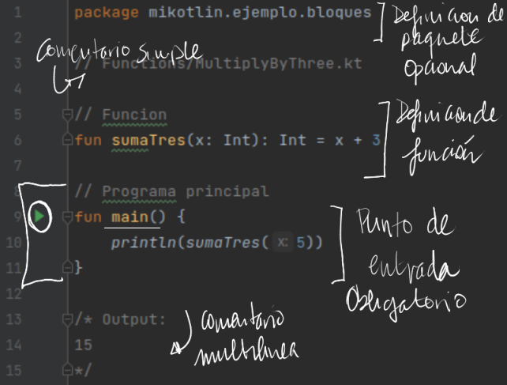

## Bloques básicos

Los programas están compuestos por un conjunto de bloques


* [Main, punto de entrada](https://kotlinlang.org/docs/basic-syntax.html#program-entry-point ): Inicio del flujo de ejecución de un programa
* [Paquetes e import](https://kotlinlang.org/docs/basic-syntax.html#package-definition-and-imports): Agrupa clases, e incorpora clases para su uso, respectivamente
* [Funciones](https://kotlinlang.org/docs/basic-syntax.html#functions): Bloques de código con nombre que pueden ser reutilizados

## Python

### Introducción a Python: Características del lenguaje

Python es un lenguaje de programación de alto nivel. Las principales características de Python son las siguientes:

* **Es multiparadigma** , ya que soporta la programación imperativa, programación orientada a objetos y funcional.
* **Es multiplataforma** : Se puede encontrar un intérprete de Python para los principales sistemas operativos:  *Windows* , *Linux* y  *Mac OS* . Además, se puede reutilizar el mismo código en cada una de las plataformas.
* **Es dinámicamente tipado** : Es decir, el tipo de las variables se decide en tiempo de ejecución.
* **Es fuertemente tipado:** No se puede usar una variable en un contexto fuera de su tipo. Si se quisiera, habría que hacer una conversión de tipos.
* **Es interpretado** : El código no se compila a lenguaje máquina.

> El hecho de que Python sea **interpretado** quiere decir que **hace falta un intérprete** que permita ejecutar un programa o script escrito en Python sin necesidad de compilarlo.

### El intérprete de Python

Cuando instalas Python correctamente (en cualquier sistema operativo) ocurren, entre otras, dos cosas: se añade el comando `python` (o `python3`, en caso de que instales la versión 3.x de Python) al path y se instala el intérprete de Python correspondiente.

En el intérprete de Python podemos escribir expresiones e instrucciones que este interpretará y ejecutará.

Puedes probar, por ejemplo, a escribir `2 + 3`. El resultado debe ser el siguiente:

```py
>>>2 + 3
5
```

O ejecutar la instrucción `print('¡Hola mundo!')`:

```py
>>>print('¡Hola mundo!')

¡Hola mundo!
```

Para salir del intérprete basta con ejecutar la instrucción `quit()`.

No obstante, aunque esta forma de escribir código puede ser útil para aprender y en casos muy puntuales, no es la habitual a la hora de escribir un programa o script en Python.

### Primer programa en Python

Normalmente, los programas en Python se escriben en archivos con la extensión `.py`. Estos archivos se pasan al intérprete de Python para que los interprete y ejecute.

Vamos a verlo con un ejemplo. Crea con un editor de texto un fichero llamado `suma.py` con el siguiente contenido:

```py
suma = 2 + 3
print(suma)

```

A continuación abre un terminal, sitúate en el directorio en el que creaste el archivo `suma.py` y ejecuta lo siguiente:

`$ python3 suma.py`

En el terminal verás que aparece el número `5` como resultado de ejecutar el programa anterior. ¿Qué ha ocurrido aquí? Básicamente que el intérprete de Python ha leído y ejecutado las líneas de código que hemos escrito en el fichero `suma.py`.

Esta es la manera más común de crear y ejecutar programas en Python.

## Operadores, expresiones y sentencias en Python

Para introducirse en cualquier lenguajes es importante saber la diferencia entre operador, expresión y sentencia, ya que son las formas básicas que componen la estructura de cualquier programa.

### Operador

Un **operador** es un carácter o conjunto de caracteres que actúa sobre una, dos o más **variables** y/o **literales** para llevar a cabo una **operación** con un **resultado** determinado. Veremos la definición de variable y literales en los siguientes puntos.

Ejemplos de operadores comunes son los operadores aritméticos `+` (suma), `-` (resta) o `*` (producto), aunque en Python existen otros operadores.

#### Orden de las operaciones

Cuando en una expresión aparece más de un operador, el orden de evaluación depende de las  *reglas de precedencia* . Para los operadores matemáticos, Python sigue las convenciones matemáticas. El acrónimo *PEMDSR* resulta útil para recordar esas reglas:

* Los *P*aréntesis tienen el nivel superior de precedencia, y pueden usarse para forzar a que una expresión sea evaluada en el orden que se quiera. Dado que las expresiones entre paréntesis son evaluadas primero, `2 * (3-1)` es 4, y `(1+1)**(5-2)` es 8. Se pueden usar también paréntesis para hacer una expresión más sencilla de leer, incluso si el resultado de la misma no varía por ello, como en `(minuto * 100) / 60`.
* La *E*xponenciación (elevar un número a una potencia) tiene el siguiente nivel más alto de precedencia, de modo que `2**1+1` es 3, no 4, y `3*1**3` es 3, no 27.
* La *M*ultiplicación y la *D*ivisión tienen la misma precedencia, que es superior a la de la *S*uma y la *R*esta, que también tienen entre si el mismo nivel de precedencia. Así que `2*3-1` es 5, no 4, y `6+4/2` es 8, no 5.
* Los operadores con igual precedencia son evaluados de izquierda a derecha. Así que la expresión `5-3-1` es 1 y no 3, ya que `5-3` se evalúa antes, y después se resta `1` de `2`.

En caso de duda, añade siempre paréntesis a tus expresiones para asegurarte de que las operaciones se realizan en el orden que tú quieres.

#### Operaciones con cadenas

El operador `+` funciona con las cadenas, pero no realiza una suma en el sentido matemático. En vez de eso, realiza una  *concatenación* , que quiere decir que une ambas cadenas, enlazando el final de la primera con el principio de la segunda. Por ejemplo:

```py

>>> primero = 10
>>> segundo = 15
>>> print(primero+segundo)
25
>>> primero = '100'
>>> segundo = '150'
>>> print(primero + segundo)
100150

```

La salida de este programa es `100150`.

El operador `*` también trabaja con cadenas multiplicando el contenido de una cadena por un entero. Por ejemplo:

```py

>>> primero = 'Test '
>>> second = 3
>>> print(primero * second)
Test Test Test

```

### Expresión

Una expresión es una unidad de código que **devuelve un valor** y está formada por una combinación de operandos (variables y literales) y operadores. Los siguientes son ejemplos de expresiones (cada línea es una expresión diferente):

```py

5 + 2           # Suma del número 5 y el número 2
a < 10            # Compara si el valor de la variable a es menor que 10
b is None       # Compara si la identidad de la variable b es None
3 * (200 - c)   # Resta a 200 el valor de c y lo multiplica por 3

```

### Sentencia

Por su parte, una sentencia o declaración es una instrucción que define una acción. Una sentencia puede estar formada por una o varias expresiones, aunque no siempre es así.

En definitiva, las sentencias son las instrucciones que componen nuestro programa y determinan su comportamiento.

Ejemplos de sentencias son la asignación `=` o las instrucciones `if`, `if ... else ...`, `for` o `while` entre otras.

> Una sentencia está delimitada por el carácter `Enter (\n)`.

#### Sentencias de más de una línea

Normalmente, las sentencias ocupan una sola línea. Por ejemplo:

```py

a = 2 + 3 #Asigna a la variable <a> el resultado de 2 + 3

```

Sin embargo, aquellas sentencias que son muy largas pueden ocupar más de una línea ([la guía de estilo PEP 8](https://www.python.org/dev/peps/pep-0008/), recomienda una longitud de línea máxima de 72 caracteres).

Para dividir una sentencia en varias líneas se utiliza el carácter `\`. Por ejemplo:

```py

a = 2 + 3 + 5 + \
7 + 9 + 4 + \
6

```

Además de la separación explícita (la que se realiza con el carácter `\`), en Python la continuación de línea es implícita siempre y cuando la expresión vaya dentro de los caracteres `()`, `[]` y `{}`.

Por ejemplo, podemos inicializar una lista del siguiente modo:

```py

a = [1, 2, 7,
3, 8, 4,
9]

```

No te preocupes si no sabes lo que es una lista o no entiendes lo que hace el ejemplo anterior. Lo importante es que comprendas que lo anterior es una sentencia multi-línea ya que está comprendida entre los caracteres `[]`.

#### Bloques de código (Indentación)

Lo último que veremos sobre sentencias en esta introducción a Python es cómo se pueden agrupar en bloques de código.

Un bloque de código es un grupo de sentencias relacionadas bien delimitadas. A diferencia de otros lenguajes como JAVA o C, en los que se usan los caracteres `{}` para definir un bloque de código, en Python se usa la indentación o sangrado.

El sangrado o indentación consiste en mover un bloque de texto hacia la derecha insertando espacios o tabuladores al principio de la línea, dejando un margen a la izquierda.

> Esta es una de las principales características de Python.

Un bloque comienza con un nuevo sangrado y acaba con la primera línea cuyo sangrado sea menor. De nuevo, la guía de estilo de Python recomienda usar los espacios en lugar de las tabulaciones para realizar el sangrado. Yo suelo utilizar 4 espacios.

> Configura tu IDE de desarrollo para que use los espacios en lugar de los tabuladores para el sangrado. Establece el número de espacios a 4 ó 2.

Veamos todo esto con un ejemplo:

```py

  def suma_numeros(numeros):   # Bloque 1
    suma = 0                   # Bloque 2
    for n in numeros:          # Bloque 2
      suma += n                # Bloque 3
      print(suma)              # Bloque 3
    return suma                # Bloque 2

```

Como te decía en la sección anterior, no hace falta todavía que entiendas lo que hace el ejemplo. Simplemente debes comprender que en la línea 1 se define la función `suma_numeros`. El cuerpo de esta función está definido por el grupo de sentencias que pertenecen al bloque 2 y 3. A su vez, la sentencia `for` define las acciones a realizar dentro de la misma en el conjunto de sentencias que pertenecen al bloque 3.

## Variables, literales y tipos

### Variables

Una de las características más potentes de un lenguaje de programación es la capacidad de manipular *variables*. Una variable es un nombre que se refiere a un valor.

Una *sentencia de asignación* crea variables nuevas y las da valores:

```py

>>> mensaje = 'Y ahora algo completamente diferente'
>>> n = 17
>>> pi = 3.1415926535897931

```

Este ejemplo hace tres asignaciones. La primera asigna una cadena a una variable nueva llamada `mensaje`; la segunda asigna el entero `17` a `n`; la tercera asigna el valor (aproximado) de *π* a `pi`.

Para mostrar el valor de una variable, se puede usar la sentencia print:

```py

>>> print(n)
17
>>> print(pi)
3.141592653589793

```

El tipo de una variable es el tipo del valor al que se refiere.

```py

>>> type(mensaje)
<class 'str'>
>>> type(n)
<class 'int'>
>>> type(pi)
<class 'float'>

```

### Valores (literales) y tipos

Un *valor o literal* es una de las cosas básicas que utiliza un programa, como una letra o un número. Hasta ahora hemos visto valores o literales como `1`, `2`, y `'¡Hola, mundo!'`

Esos valores pertenecen a *tipos* diferentes: `2` es un entero (int), y `'¡Hola, mundo!'` es una *cadena* (string), que recibe ese nombre porque contiene una “cadena” de letras. Tú (y el intérprete) podéis identificar las cadenas porque van encerradas entre comillas.

La sentencia `print` también funciona con enteros. Vamos a usar el comando `python` para iniciar el intérprete.

```py

$python
>>>print(4)
4

```

Si no estás seguro de qué tipo de valor estás manejando, el intérprete te lo puede decir.

```py

>>>type('¡Hola, mundo!')
<class 'str'>
>>>type(17)
<class 'int'>

```

No es sorprendente que las cadenas pertenezcan al tipo `str` y los enteros pertenezcan al tipo `int`. De manera menos obvia, los números con un punto decimal pertenecen a un tipo llamado `float`, porque estos números se representan en un formato llamado *punto flotante*.

```py

>>>type(3.2)
>>><class 'float'>

```

¿Qué ocurre con valores como `17` y `3.2`? Parecen números, pero van entre comillas como las cadenas.

```py

>>>type('17')
<class 'str'>
>>>type('3.2')
<class 'str'>

```

Pues son cadenas.

Cuando escribes un entero grande, puede que te sientas tentado a usar comas o puntos para separarlo en grupos de tres dígitos, como en `1,000,000`. Eso no es un entero válido en Python, pero en cambio sí que resulta válido algo como:

```py

>>> print(1,000,000)
1 0 0 # Imprime 3 numeros

```

Bien, ha funcionado. ¡Pero eso no era lo que esperábamos!. Python interpreta `1,000,000` como una secuencia de enteros separados por comas, así que lo imprime con espacios en medio.

Éste es el primer ejemplo que hemos visto de un error semántico: el código funciona sin producir ningún mensaje de error, pero no hace su trabajo “correctamente”.

## Petición de información al usuario

A veces necesitaremos que sea el usuario quien nos proporcione el valor para una variable, a través del teclado. Python proporciona una función interna llamada `input` que recibe la entrada desde el teclado. Cuando se llama a esa función, el programa se detiene y espera a que el usuario escriba algo. Cuando el usuario pulsa `Retorno` o `Intro`, el programa continúa y `input` devuelve como **una cadena** aquello que el usuario escribió.

```py

>>>entrada = input()
Cualquier cosa ridícula
>>>print(entrada)
Cualquier cosa ridícula

```

Antes de recibir cualquier dato desde el usuario, es buena idea escribir un mensaje explicándole qué debe introducir. Se puede pasar una cadena a `input`, que será mostrada al usuario antes de que el programa se detenga para recibir su entrada:

```py

>>>nombre = input('¿Cómo te llamas?\n')
¿Cómo te llamas?
Chuck
>>>print(nombre)
Chuck

```

La secuencia `\n` al final del mensaje representa un  *newline* , que es un carácter especial que provoca un salto de línea. Por eso la entrada del usuario aparece debajo de nuestro mensaje.

Si esperas que el usuario escriba un entero, puedes intentar convertir el valor de retorno a `int` usando la función `int()`:

```py

>>> prompt = '¿Cual es la velocidad de vuelo de una golondrina sin carga?\n'
>>> velocidad = input(prompt)
¿Cual es la velocidad de vuelo de una golondrina sin carga?
17
>>> int(velocidad)
17
>>> int(velocidad) + 5
22

```

Pero si el usuario escribe algo que no sea una cadena de dígitos, obtendrás un error:

```py

>>>velocidad = input(prompt)
¿Cual es la velocidad de vuelo de una golondrina sin carga?
¿Te refieres a una golondrina africana o a una europea?
>>>int(velocidad)
ValueError: invalid literal for int()

```

Veremos cómo controlar este tipo de errores más adelante.

## Comentarios en Python

Como cualquier otro lenguaje de programación, Python permite escribir comentarios en el código. Para añadir un comentario a tu código simplemente comienza una línea con el carácter `#`:

```py

# Esta línea es un comentario**
a = 5
# Resultado de multiplicar a por 2
print(a * 2)

```

> Los comentarios son ignorados por el intérprete de Python. Solo tienen sentido para los programadores.

### Comentarios de varias líneas

Para escribir comentarios que ocupan varias líneas, simplemente escribe cada una de las líneas anteponiendo el carácter `#`:

```py

# Este comentario ocupa
# 2 líneas

```

### Docstrings

Los docstrings son un tipo de comentarios especiales que se usan para documentar un módulo, función, clase o método. En realidad son la primera sentencia de cada uno de ellos y se encierran entre tres comillas simples o dobles.

Los docstrings son utilizados para generar la documentación de un programa. Además, suelen utilizarlos los entornos de desarrollo para mostrar la documentación al programador de forma fácil e intuitiva.

```py

def suma(a, b):
  """Esta función devuelve la suma de los parámetros a y b"""
  return a + b
  
```

## Palabras reservadas de Python

Python tiene una serie de palabras clave  **reservadas** , por tanto, **no pueden usarse como nombres de variables, funciones, etc.**

Estas palabras clave se utilizan para definir la sintaxis y estructura del lenguaje Python.

La lista de palabras reservadas es la siguiente:

`and`, `as`, `assert`, `break`, `class`, `continue`, `def`, `del`, `elif`, `else`, `except`, `False`, `finally`, `for`, `from`, `global`, `if`, `import`, `in`, `is`, `lambda`, `None`, `nonlocal`, `not`, `or`, `pass`, `raise`, `return`, `True`, `try`, `yield`, `while` y `with`

## Constantes en Python

A diferencia de otros lenguajes,  **en Python no existen las constantes** .

Entendemos como *constante* una variable que una vez asignado un valor, este no se puede modificar. Es decir, que a la variable no se le puede asignar ningún otro valor una vez asignado el primero.

Se puede simular este comportamiento, siempre desde el punto de vista del programador y atendiendo a convenciones propias, pero no podemos cambiar la naturaleza mutable de las variables.

No obstante, sí que es cierto que el propio Python define una serie de valores constantes en su propio namespace. Los más importantes son:

* **False:** El valor *false* del tipo `bool`.
* **True:** El valor *true* del tipo `bool`.
* **None:** El valor del tipo `NoneType`. Generalmente `None` se utiliza para representar la ausencia de valor de una variable.

## Convenciones de nombres en Python

A la hora de nombrar una variable, una función, un módulo, una clase, etc. en Python, siempre se siguen las siguientes reglas y recomendaciones:

* Un identificador puede ser cualquier combinación de letras (mayúsculas y minúsculas), números y el carácter guión bajo (`_`).
* Un identificador no puede comenzar por un número.
* A excepción de los nombres de clases, es una convención que todos los identificadores se escriban en minúsculas, separando las palabras con el guión bajo. Ejemplos: `contador`, `suma_enteros`.
* Es una convención que los nombres de clases sigan la notación  *Camel Case*, es decir, todas las letras en minúscula a excepción del primer carácter de cada palabra, que se escribe en mayúscula. Ejemplos: `Coche`, `VehiculoMotorizado`.
* No se pueden usar como identificadores las palabras reservadas.
* Como recomendación, usa identificadores que sean expresivos. Por ejemplo, `contador` es mejor que simplemente `c`.
* Python diferencia entre mayúsculas y minúsculas, de manera que `variable_1` y `Variable_1` son dos identificadores totalmente diferentes.

## Depuración

En este punto, el error de sintaxis que es más probable que cometas será intentar utilizar nombres de variables no válidos, como `class` y `yield`, que son palabras clave, o `odd~job` y `US$`, que contienen caracteres no válidos.

Si pones un espacio en un nombre de variable, Python cree que se trata de dos operandos sin ningún operador:

```py

>>> bad name = 5
SyntaxError: invalid syntax

```

```py

>>> month = 09
  File "<stdin>", line 1
    month = 09
             ^
SyntaxError: invalid token

```

Para la mayoría de errores de sintaxis, los mensajes de error no ayudan mucho. Los mensajes más comunes son `SyntaxError: invalid syntax` y `SyntaxError: invalid token`, ninguno de los cuales resulta muy informativo.

El runtime error (error en tiempo de ejecución) que es más probable que obtengas es un “use before def” (uso antes de definir); que significa que estás intentando usar una variable antes de que le hayas asignado un valor. Eso puede ocurrir si escribes mal el nombre de la variable:

```py

>>> principal = 327.68
>>> interest = principle * rate
NameError: name 'principle' is not defined

```

Los nombres de las variables son sensibles a mayúsculas, así que `LaTeX` no es lo mismo que `latex`.

En este punto, la causa más probable de un error semántico es el orden de las operaciones. Por ejemplo, para evaluar **$\frac{1}{2 \pi}$**, puedes sentirte tentado a escribir

```py

>>> 1.0 / 2.0 * pi

```

Pero la división se evalúa antes, ¡así que obtendrás  *π* **/2**, que no es lo mismo! No hay forma de que Python sepa qué es lo que querías escribir exactamente, así que en este caso no obtienes un mensaje de error; simplemente obtienes una respuesta incorrecta.

## Operadores

Ya hablamos sobre los operadores, los operadores son símbolos reservados por el propio lenguaje que se utilizan para llevar a cabo operaciones sobre uno, dos o más elementos llamados operandos. Los operandos pueden ser variables, literales, el valor devuelto por una expresión o el valor devuelto por una función.

El ejemplo más típico que siempre viene a la mente es el operador suma, `+`, que se utiliza para obtener la suma aritmética de dos valores:

```py

>>>9 + 1 # 9 y 1 son los operandos
10 # 10 es el resultado

```

### Operador de concatenación de cadenas de caracteres

Una de las operaciones más básicas cuando se trabaja con cadenas de caracteres es la concatenación. Esto consiste en unir dos cadenas en una sola, siendo el resultado un nuevo  *string* .

La forma más simple de concatenar dos cadenas en Python es utilizando el operador de concatenación `+`:

```py

>>> hola = 'Hola'
>>> python = 'Pythonista'
>>> hola_python = hola + ' ' + python  # concatenamos 3 strings
>>> print(hola_python)
Hola Pythonista

```

### Operadores lógicos o booleanos

A la hora de operar con valores booleanos, tenemos a nuestra disposición los operadores `and`, `or` y `not`.

>️ **IMPORTANTE: **Las operaciones `and`, `or` y `not` realmente no devuelven `True` o `False`, sino que devuelven uno de los operandos como veremos en el cuadro de abajo.

A continuación te muestro cómo funcionan los operadores booleanos (en orden de preferencia ascendente):


| Operación | Resultado                                                                  | Descripción                                                   |
| ------------ | ---------------------------------------------------------------------------- | ---------------------------------------------------------------- |
| `a or b`   | Si`a` se evalúa a falso, entonces devuelve `b`, si no devuelve `a`        | Solo se evalúa el segundo operando si el primero es falso     |
| `a and b`  | Si`a` se evalúa a falso, entonces devuelve `a`, si no devuelve `b`        | Solo se evalúa el segundo operando si el primero es verdadero |
| `not a`    | Si`a` se evalúa a falso, entonces devuelve `True`, si no devuelve `False` | Tiene menos prioridad que otros operadores no booleanos        |

Ejemplos:

```py

>>> x = True
>>> y = False
>>> x or y
True
>>> x and y
False
>>> not x
False
>>> x = 0
>>> y = 10
>>> x or y
10
>>> x and y
0
>>> not x
True

```

### Operadores de comparación

Los operadores de comparación se utilizan, como su nombre indica, para comparar dos o más valores. El resultado de estos operadores siempre es `True` o `False`.


| Operador | Descripción                                                                                                              |
| ---------- | --------------------------------------------------------------------------------------------------------------------------- |
| >        | Mayor que.`True` si el operando de la izquierda es estrictamente mayor que el de la derecha; `False` en caso contrario.   |
| >=       | Mayor o igual que.`True` si el operando de la izquierda es mayor o igual que el de la derecha; `False` en caso contrario. |
| <        | Menor que.`True` si el operando de la izquierda es estrictamente menor que el de la derecha; `False` en caso contrario.   |
| <=       | Menor o igual que.`True` si el operando de la izquierda es menor o igual que el de la derecha; `False` en caso contrario. |
| ==       | Igual.`True` si el operando de la izquierda es igual que el de la derecha; `False` en caso contrario.                     |
| !=       | Distinto.`True` si los operandos son distintos; `False` en caso contrario.                                                |

Ejemplos:

```py

>>> x = 9
>>> y = 1
>>> x < y
False
>>> x > y
True
>>> x == y
False

```

#### Consideraciones sobre los operadores de comparación

Los objetos de diferentes tipos, excepto los tipos numéricos, nunca se comparan igual. El operador `==` siempre está definido, pero para algunos tipos de objetos (por ejemplo, objetos de clase) es equivalente a [is](https://j2logo.com/python/tutorial/operadores-en-python/#operadores-identidad).

Las instancias no idénticas de una clase normalmente se comparan como no iguales a menos que la clase defina el método `__eq__()`.

Las instancias de una clase no se pueden ordenar con respecto a otras instancias de la misma clase u otros tipos de objeto, a menos que la clase defina los métodos `__lt__()`, `__gt__()`.

Los operadores de comparación se pueden concatenar. Ejemplo:

```py

# Las comparaciones siguientes son idénticas
>>> x = 9
>>> 1 < x and x < 20
True
>>> 1 < x < 20
True

```

### Operadores aritméticos en Python

En cuanto a los operadores aritméticos, estos permiten realizar las diferentes operaciones aritméticas del álgebra: suma, resta, producto, división, … Estos operadores Python son de los más utilizados. El listado completo es el siguiente:


| Operador | Descripción                                                                                                                   |
| ---------- | -------------------------------------------------------------------------------------------------------------------------------- |
| +        | Suma dos operandos.                                                                                                            |
| –       | Resta al operando de la izquierda el valor del operando de la derecha. Utilizado sobre un único operando, le cambia el signo. |
| *        | Producto/Multiplicación de dos operandos.                                                                                     |
| /        | Divide el operando de la izquierda por el de la derecha (el resultado siempre es un`float`).                                   |
| %        | Operador módulo. Obtiene el resto de dividir el operando de la izquierda por el de la derecha.                                |
| //       | Obtiene el cociente entero de dividir el operando de la izquierda por el de la derecha.                                        |
| **       | Potencia. El resultado es el operando de la izquierda elevado a la potencia del operando de la derecha.                        |

Ejemplos:

```py

>>> x = 7
>>> y = 2
>>> x + y  # Suma
9
>>> x - y  # Resta
5
>>> x * y  # Producto
14
>>> x / y  # División
3.5
>>> x % y  # Resto
1
>>> x // y  # Cociente
3
>>> x ** y  # Potencia
49

```


### Operadores a nivel de bits

Los operadores a nivel de bits actúan sobre los operandos como si fueran una cadena de dígitos binarios. Como su nombre indica, actúan sobre los operandos bit a bit. Son los siguientes:


| Operación | Descripción                             |
| ------------ | ------------------------------------------ |
| x | y      | or bit a bit de x e y.                   |
| x ^ y      | or exclusivo bit a bit de x e y.         |
| x & y      | and bit a bit de x e y.                  |
| x << n     | Desplaza x n bits a la izquierda.        |
| x >> n     | Desplaza x n bits a la derecha.          |
| ~x         | not x. Obtiene los bits de x invertidos. |

Supongamos que tenemos el entero 2 (en bits es 00010) y el entero 7 (00111). El resultado de aplicar las operaciones anteriores es:

```py

>>> x = 2
>>> y = 7
>>> x | y
7
>>> x ^ y
5
>>> x & y
2
>>> x << 1
4
>>> x >> 1
1
>>> ~x
-3

```


### Operadores de asignación

El operador de asignación se utiliza para asignar un valor a una variable. Como te he mencionado en otras secciones, este operador es el signo `=`.

Además del operador de asignación, existen otros operadores de asignación compuestos que realizan una operación básica sobre la variable a la que se le asigna el valor.

Por ejemplo, `x += 1` es lo mismo que `x = x + 1`. Los operadores compuestos realizan la operación que hay antes del signo igual, tomando como operandos la propia variable y el valor a la derecha del signo igual.

A continuación, aparece la lista de todos los operadores de asignación compuestos:


| Operador | Ejemplo | Equivalencia |
| ---------- | --------- | -------------- |
| +=       | x += 2  | x = x + 2    |
| -=       | x -= 2  | x = x – 2   |
| *=       | x *= 2  | x = x * 2    |
| /=       | x /= 2  | x = x / 2    |
| %=       | x %= 2  | x = x % 2    |
| //=      | x //= 2 | x = x // 2   |
| **=      | x **= 2 | x = x ** 2   |
| &=       | x &= 2  | x = x & 2    |
|          | =       | x            |
| ^=       | x ^= 2  | x = x ^ 2    |
| >>=      | x >>= 2 | x = x >> 2   |
| <<=      | x <<= 2 | x = x << 2   |

### Operadores de pertenencia

Los operadores de pertenencia se utilizan para comprobar si un valor o variable se encuentran en una secuencia (`list`, `tuple`, `dict`, `set` o `str`).

Todavía no hemos visto estos tipos, pero son operadores muy utilizados.


| Operador | Descripción                                                                         |
| ---------- | -------------------------------------------------------------------------------------- |
| in       | Devuelve True si el valor se encuentra en una secuencia; False en caso contrario.    |
| not in   | Devuelve True si el valor no se encuentra en una secuencia; False en caso contrario. |

A continuación vemos unos ejemplos que son muy intuitivos:

```py

>>> lista = [1, 3, 2, 7, 9, 8, 6]
>>> 4 in lista
False
>>> 3 in lista
True
>>> 4 not in lista
True

```

### Operadores de identidad

Por último, los operadores de identidad se utilizan para comprobar si dos variables son, o no, el mismo objeto.


| Operador | Descripción                                                                                   |
| ---------- | ------------------------------------------------------------------------------------------------ |
| is       | Devuelve True si ambos operandos hacen referencia al mismo objeto; False en caso contrario.    |
| is not   | Devuelve True si ambos operandos no hacen referencia al mismo objeto; False en caso contrario. |

>️ **Recuerda:** Para conocer la identidad de un objeto se usa la función `id()`.

Ejemplos:


```py

>>> x = 4
>>> y = 2
>>> lista = [1, 5]
>>> x is lista
False
>>> x is y
False
>>> x is 4
True

```

### Prioridad de los operadores en Python

Como ya dijimos, al igual que ocurre en las matemáticas, los operadores en Python tienen un orden de prioridad. Este orden es el siguiente, de menos prioritario a más prioritario: asignación; operadores booleanos; operadores de comparación, identidad y pertenencia; a nivel de bits y finalmente los aritméticos (con el mismo orden de prioridad que en las matemáticas).

Este orden de prioridad se puede alterar con el uso de los paréntesis `()`:

```py

>>> x = 5
>>> y = 2
>>> z = x + 3 * y  # El producto tiene prioridad sobre la suma
>>> z
11
>>> z = (x + 3) * y  # Los paréntesis tienen prioridad
>>> z
16

```

## Fuente

* [Pagina de Juan Jose Lozano Gomez sobre Python](https://j2logo.com/)
* [Python for Everybody](https://www.py4e.com/book)
