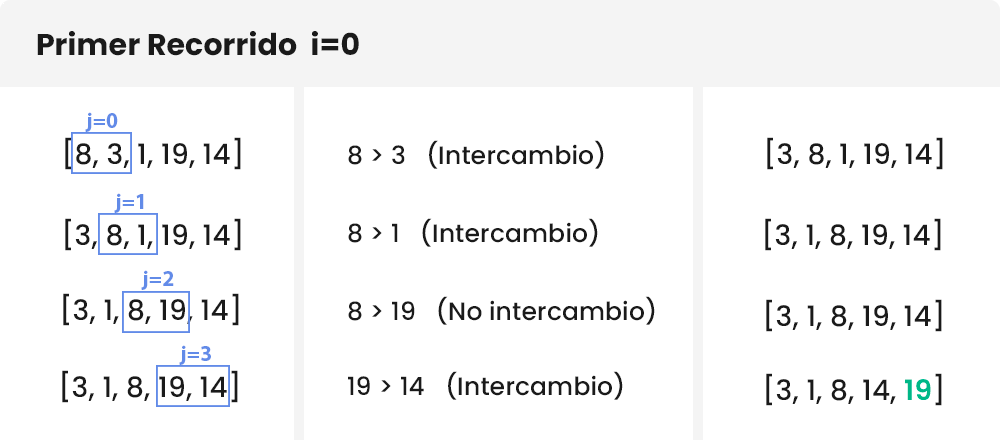
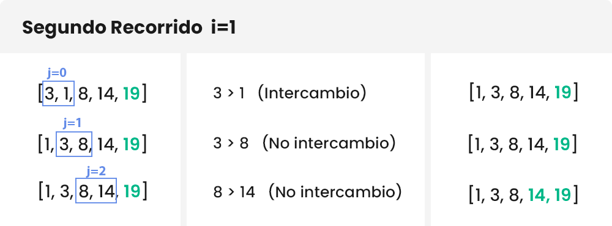
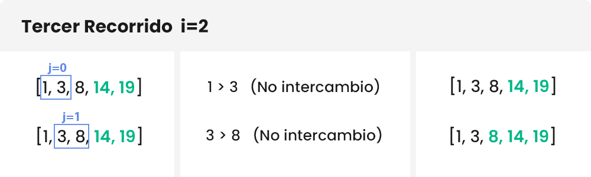
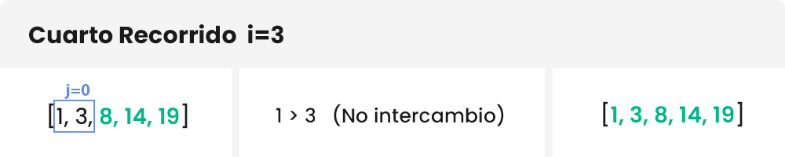

## P2.4 - Ejercicio.

### El algoritmo burbuja

El algoritmo burbuja te permite ordenar valores de un array. Funciona revisando cada elemento con el elemanto adyacente. Si ambos elementos no están ordenados, se procede a intercambiarlos, si por el contrario los elementos ya estaban ordenados se dejan tal como estaban. Este proceso sigue para cada elemento del arreglo hasta que quede completamente ordenado.


Ahora, vamos a entender como podemos programar este algoritmo.

#### Entendiendo el proceso
Vamos a ordenar la lista `a` de longitud `n=5`:

```Python
a = [8, 3, 1, 19, 14]
```

El algoritmo burbuja se compone de 2 bucles, uno dentro del otro. Llamaremos “bucle hijo” al que se encuentra dentro del otro bucle, es decir del “bucle padre”. Estos nombres son solo para que entiendas.

El “bucle padre” realizará el número de iteraciones necesarias para ordenar la lista (las iteraciones necesarias son n-1 veces) y el “bucle hijo” se encargará de comparar cada elemento con su adyacente y ordenarlos.

Si deseamos ordenar la lista `a`, el padre y el hijo comenzarán recorriendo n-1 veces (es decir, 4 veces), teniendo en cuenta, que cuando el padre realice una iteración, el número de iteraciones del hijo se irá reduciendo: comienza con n-1-0 iteraciones, luego n-1-1 iteraciones, luego n-1-2 iteraciones…

#### Un ejemplo gráfico
Parece muy complicado, ¿cierto? Analicemos esto gráficamente.

En los siguientes gráficos, el bucle padre tiene índice "i" y el bucle hijo tiene el índice "j", y recuerda, iniciaremos ambos bucles desde la posición 0 hasta el 3 (casi siempre los bucles inician desde el cero). Si te das cuenta 0, 1, 2 y 3 son igualmente los 4 recorridos que buscamos.

Pasemos al primer recorrido:


**Primer recorrido del bucle padre `i=0`**: el bucle hijo con índice `j` recorre desde 0 a 3 `(n-1)`. Como se puede apreciar, cada elemento es comparado con su adyacente. Si están ordenados correctamente se pasa a comparar con el siguiente elemento, y si no están ordenados se realiza un intercambio.



**Segundo recorrido del bucle padre `i=1`**: El bucle hijo con índice `j` reduce su rango, ahora va desde 0 a 2 `(n-1-1)` y ya no se evalúa el último elemento (el 19, de color verde) porque ya esta ordenado. Además, en este recorrido se realiza solamente un intercambio y la lista queda completamente ordenada. Luego agregamos al 14 a la lista de elementos ordenados.



**Tercer recorrido del bucle padre `i=2`**: El bucle hijo con índice `j` sigue reduciendo su rango, con valores desde 0 a 1 `(n-1-2)`, porque los últimos elementos ya no se evalúan (porque están ordenados) y se van acumulando.

En este punto ya no existen intercambios, pero el algoritmo va a recorrer hasta i=n-1. No importa si la lista esta ordenada o no. En nuestro caso realizará un “Cuarto Recorrido”, el cual es innecesario. Por este motivo existe una variación de este algoritmo que evita que se hagan recorridos extra una vez que la lista ya este ordenada (en este artículo te enseñaré a implementar el original y la variación).


**Cuarto recorrido del bucle padre `i=3`**: El bucle hijo con índice `j` solo toma el valor de 0 `(n-1-3)`. Verifica que estén ordenados correctamente y el bucle padre llega al final de su recorrido.

### Práctica

Ahora que ya sabemos como funciona el algoritmo de burbuja, pasemos a la práctica. Implementación en Python y utiliza el debugger para asegurarte que funciona adecuadamente y entiendes su funcionamiento.

