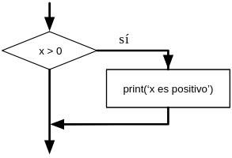
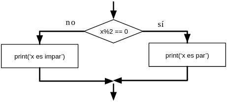
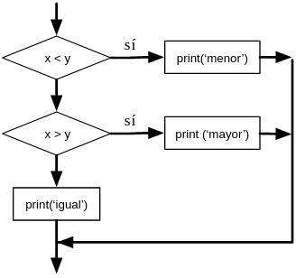
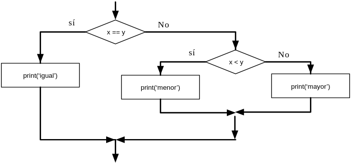

## 2.1. Sentencias Condicionales

Las *sentencias condicionales* nos permiten comprobar si una o más condiciones son verdaderas o falsas, y ejecutar diferentes bloques de código en función de los resultados. En Python, las sentencias condicionales se realizan con las palabras clave `if`, `elif` y `else`. 

Estas sentencias se repiten en muchos lenguajes de programación, pero la sintaxis puede variar ligeramente. A lo largo de esta unidad, veremos cómo funcionan las sentencias condicionales en Python y cómo podemos utilizarlas para controlar el flujo de ejecución de nuestros programas.

### 1. Expresiones booleanas

Una *expresión booleana* es aquella que puede ser verdadera (`True`) o falsa (`False`). Los ejemplos siguientes usan el operador `==`, que compara dos operandos y devuelve `True` si son iguales y `False` en caso contrario:

```python
>>> 5 == 5
True
>>> 5 == 6
False
```

`True` y `False` son valores especiales que pertenecen al tipo `bool (booleano)`; no son cadenas:

```python
>>> type(True)
<class 'bool'>
>>> type(False)
<class 'bool'>
```

El operador `==` es uno de los  *operadores de comparación* ; los demás son:

```
x != y               # x es distinto de y
x > y                # x es mayor que y
x < y                # x es menor que y
x >= y               # x es mayor o igual que y
x <= y               # x es menor o igual que y
x is y               # x es lo mismo que y
x is not y           # x no es lo mismo que y
```

A pesar de que estas operaciones probablemente te resulten familiares, los símbolos en Python son diferentes de los símbolos matemáticos que se usan para realizar las mismas operaciones. Un error muy común es usar sólo un símbolo igual (`=`) en vez del símbolo de doble igualdad (`==`). Recuerda que `=` es un operador de asignación, y `==` es un operador de comparación. No existe algo como `=<` o `=>`.

### 2. Operadores lógicos

Existen tres  *operadores lógicos* : `and (y)`, `or (o)`, y `not (no)`. El significado semántico de estas operaciones es similar a su significado en inglés. Por ejemplo,

- `x > 0 and x < 10` es verdadero sólo cuando `x` es mayor que 0 *y* menor que 10.

- `n%2 == 0 or n%3 == 0` es verdadero si *cualquiera* de las condiciones es verdadera, es decir, si el número es divisible por 2 *o* por 3.

Finalmente, el operador `not` niega una expresión booleana, de modo que `not (x > y)` es verdadero si `x > y` es falso; es decir, si `x` es menor o igual que `y`.

Estrictamente hablando, los operandos de los operadores lógicos deberían ser expresiones booleanas, pero Python no es muy estricto. Cualquier número distinto de cero se interpreta como “verdadero.”

```python
>>> 17 and True
True
```

Esta flexibilidad puede ser útil, pero existen ciertas sutilezas en ese tipo de uso que pueden resultar confusas. Es posible que prefieras evitar usarlo de este modo hasta que estés bien seguro de lo que estás haciendo.

### 3. Ejecución condicional

Para poder escribir programas útiles, casi siempre vamos a necesitar la capacidad de comprobar condiciones y cambiar el comportamiento del programa de acuerdo a ellas. Las `sentencias condicionales` nos proporcionan esa capacidad. La forma más sencilla es la sentencia `if`:

```python
if x > 0 :
    print('x es positivo')
```

La expresión booleana después de la sentencia `if` recibe el nombre de  *condición* . La sentencia `if` se finaliza con un carácter de dos-puntos (:) y la(s) línea(s) que van detrás de la sentencia if van indentadas[^1^](https://es.py4e.com/html3/03-conditional#fn1) (es decir, llevan una tabulación o varios espacios en blanco al principio).

<figure markdown>
  
  <figcaption>Lógica del IF</figcaption>
</figure>

Si la condición lógica es verdadera, la sentencia indentada será ejecutada. Si la condición es falsa, la sentencia indentada será omitida.

La sentencia `if` tiene la misma estructura que la definición de funciones o los bucles `for`[^2^](https://es.py4e.com/html3/03-conditional#fn2). La sentencia consiste en una línea de encabezado que termina con el carácter dos-puntos (:) seguido por un bloque indentado. Las sentencias de este tipo reciben el nombre de  *sentencias compuestas* , porque se extienden a lo largo de varias líneas.

No hay límite en el número de sentencias que pueden aparecer en el cuerpo, pero debe haber al menos una. Ocasionalmente, puede resultar útil tener un cuerpo sin sentencias (normalmente como emplazamiento reservado para código que no se ha escrito aún). En ese caso, se puede usar la sentencia `pass`, que no hace nada.

```python
if x < 0 :
    pass          # ¡necesito gestionar los valores negativos!
```

Si introduces una sentencia `if` en el intérprete de Python, el prompt cambiará su aspecto habitual por puntos suspensivos, para indicar que estás en medio de un bloque de sentencias, como se muestra a continuación:

```
>>> x = 3
>>> if x < 10:
...    print('Pequeño')
...
Pequeño
>>>
```

Al usar el intérprete de Python, debe dejar una línea en blanco al final de un bloque, de lo contrario Python devolverá un error:

```python
>>> x = 3
>>> if x < 10:
...    print('Pequeño')
... print('Hecho')
  File "<stdin>", line 3
    print('Hecho')
        ^
SyntaxError: invalid syntax
```

No es necesaria una línea en blanco al final de un bloque de instrucciones al escribir y ejecutar un script, pero puede mejorar la legibilidad de su código.

### 4. Ejecución alternativa

La segunda forma de la sentencia `if` es la  *ejecución alternativa* , en la cual existen dos posibilidades y la condición determina cual de ellas será ejecutada. La sintaxis es similar a ésta:

```python
if x%2 == 0 :
    print('x es par')
else :
    print('x es impar')
```

Si al dividir `x` por 2 obtenemos como resto 0, entonces sabemos que `x` es par, y el programa muestra un mensaje a tal efecto. Si esa condición es falsa, se ejecuta el segundo conjunto de sentencias.

<figure markdown>
  
  <figcaption>Lógica del IF-then-Else</figcaption>
</figure>

Dado que la condición debe ser obligatoriamente verdadera o falsa, solamente una de las alternativas será ejecutada. Las alternativas reciben el nombre de  *ramas* , dado que se trata de ramificaciones en el flujo de la ejecución.

### 5. Condicionales encadenados

Algunas veces hay más de dos posibilidades, de modo que necesitamos más de dos ramas. Una forma de expresar una operación como ésa es usar un  *condicional encadenado* :

```python
if x < y:
    print('x es menor que y')
elif x > y:
    print('x es mayor que y')
else:
    print('x e y son iguales')
```

`elif` es una abreviatura para “else if”. En este caso también será ejecutada únicamente una de las ramas.

<figure markdown>
  
  <figcaption>Lógica del IF-then-Elif</figcaption>
</figure>


No hay un límite para el número de sentencias `elif`. Si hay una clausula `else`, debe ir al final, pero tampoco es obligatorio que ésta exista.

```python
if choice == 'a':
    print('Respuesta incorrecta')
elif choice == 'b':
    print('Respuesta correcta')
elif choice == 'c':
    print('Casi, pero no es correcto')
```

Cada condición es comprobada en orden. Si la primera es falsa, se comprueba la siguiente y así con las demás. Si una de ellas es verdadera, se ejecuta la rama correspondiente, y la sentencia termina. Incluso si hay más de una condición que sea verdadera, sólo se ejecuta la primera que se encuentra.

### 6. Condicionales anidados

Un condicional puede también estar anidado dentro de otro. Podríamos haber escrito el ejemplo anterior de las tres ramas de este modo:

```python
if x == y:
    print('x e y son iguales')
else:
    if x < y:
        print('x es menor que y')
    else:
        print('x es mayor que y')
```

El condicional exterior contiene dos ramas. La primera rama ejecuta una sentencia simple. La segunda contiene otra sentencia `if`, que tiene a su vez sus propias dos ramas. Esas dos ramas son ambas sentencias simples, pero podrían haber sido sentencias condicionales también.

<figure markdown>
  
  <figcaption>Lógica del IF anidados</figcaption>
</figure>


A pesar de que el indentado de las sentencias hace que la estructura esté clara, los *condicionales anidados* pueden volverse difíciles de leer rápidamente. En general, es buena idea evitarlos si se puede.

Los operadores lógicos a menudo proporcionan un modo de simplificar las sentencias condicionales anidadas. Por ejemplo, el código siguiente puede ser reescrito usando un único condicional:

```python
if 0 < x:
    if x < 10:
        print('x es un número positivo con un sólo dígito')
```

La sentencia `print` se ejecuta solamente si se cumplen las dos condiciones anteriores, así que en realidad podemos conseguir el mismo efecto con el operador `and`:

```python
if 0 < x and x < 10:
    print('x es un número positivo con un sólo dígito.')
```

### 7. Evaluación en cortocircuito de expresiones lógicas

Cuando Python está procesando una expresión lógica, como `x >= 2 and (x/y) > 2`, evalúa la expresión de izquierda a derecha. Debido a la definición de `and`, si `x` es menor de 2, la expresión `x >= 2` resulta ser `falsa`, de modo que la expresión completa ya va a resultar `falsa`, independientemente de si `(x/y) > 2` se evalúa como `verdadera` o `falsa`.

Cuando Python detecta que no se gana nada evaluando el resto de una expresión lógica, detiene su evaluación y no realiza el cálculo del resto de la expresión. Cuando la evaluación de una expresión lógica se detiene debido a que ya se conoce el valor final, eso es conocido como *cortocircuitar* la evaluación.

A pesar de que esto pueda parecer hilar demasiado fino, el funcionamiento en cortocircuito nos descubre una ingeniosa técnica conocida como  *patrón guardián* . Examina la siguiente secuencia de código en el intérprete de Python:

```python
>>> x = 6
>>> y = 2
>>> x >= 2 and (x/y) > 2
True
>>> x = 1
>>> y = 0
>>> x >= 2 and (x/y) > 2
False
>>> x = 6
>>> y = 0
>>> x >= 2 and (x/y) > 2
Traceback (most recent call last):
  File "<stdin>", line 1, in <module>
ZeroDivisionError: division by zero
>>>
```

La tercera operación ha fallado porque Python intentó evaluar `(x/y)` e `y` era cero, lo cual provoca un runtime error (error en tiempo de ejecución). Pero el segundo ejemplo *no* falló, porque la primera parte de la expresión `x >= 2` fue evaluada como `falsa`, así que `(x/y)` no llegó a ejecutarse debido a la regla del  *cortocircuito* , y no se produjo ningún error.

Es posible construir las expresiones lógicas colocando estratégicamente una evaluación como *guardián* justo antes de la evaluación que podría causar un error, como se muestra a continuación:

```python
>>> x = 1
>>> y = 0
>>> x >= 2 and y != 0 and (x/y) > 2
False
>>> x = 6
>>> y = 0
>>> x >= 2 and y != 0 and (x/y) > 2
False
>>> x >= 2 and (x/y) > 2 and y != 0
Traceback (most recent call last):
  File "<stdin>", line 1, in <module>
ZeroDivisionError: division by zero
>>>
```

En la primera expresión lógica, `x >= 2` es `falsa`, así que la evaluación se detiene en el `and`. En la segunda expresión lógica, `x >= 2` es `verdadera`, pero `y != 0` es `falsa`, de modo que nunca se alcanza `(x/y)`.

En la tercera expresión lógica, el `y != 0` va *después* del cálculo de `(x/y)`, de modo que la expresión falla con un error.

En la segunda expresión, se dice que `y != 0` actúa como *guardián* para garantizar que sólo se ejecute `(x/y)` en el caso de que `y` no sea cero.

### 8. Depuración

Los “traceback” que Python muestra cuando se produce un error contienen un montón de información, pero pueden resultar abrumadores. Las partes más útiles normalmente son:

* Qué tipo de error se ha producido, y    
* Dónde ha ocurrido.

Los errores de sintaxis (syntax errors), normalmente son fáciles de localizar, pero a veces tienen trampa. Los errores debido a espacios en blanco pueden ser complicados, ya que los espacios y las tabulaciones son invisibles, y solemos ignorarlos.

```python
>>> x = 5
>>>  y = 6
  File "<stdin>", line 1
    y = 6
    ^
IndentationError: unexpected indent
```

En este ejemplo, el problema es que la segunda línea está indentada por un espacio. Pero el mensaje de error apunta a `y`, lo cual resulta engañoso. En general, los mensajes de error indican dónde se ha descubierto el problema, pero el error real podría estar en el código previo, a veces en alguna línea anterior.

Ocurre lo mismo con los errores en tiempo de ejecución (runtime errors). Supón que estás tratando de calcular una relación señal-ruido en decibelios. La fórmula es SNR*~db~=10log ~10~ ( P~senal~ / P ~ruido~ ). En Python, podrías escribir algo como esto:

```python
import math
int_senal = 9
int_ruido = 10
relacion = int_senal / int_ruido
decibelios = 10 * math.log10(relacion)
print(decibelios)

# Código: https://es.py4e.com/code3/snr.py
```

Pero cuando lo haces funcionar, obtienes un mensaje de error[^3^](https://es.py4e.com/html3/03-conditional#fn3):

```python
    Traceback (most recent call last):
      File "snr.py", line 5, in ?
        decibelios = 10 * math.log10(relacion)
    OverflowError: math range error
```

El mensaje de error apunta a la línea 5, pero no hay nada incorrecto en ese línea. Para encontrar el error real, puede resultar útil mostrar en pantalla el valor de `relacion`, que resulta ser 0. El problema está en la línea 4, ya que al dividir dos enteros se realiza una división entera. La solución es representar la intensidad de la señal y la intensidad del ruido con valores en punto flotante.

En general, los mensajes de error te dicen dónde se ha descubierto el problema, pero a menudo no es ahí exactamente donde se ha producido.

## Fuente
* [Pagina de Juan Jose Lozano Gomez sobre Python](https://j2logo.com/)
* [Aprende con Alf](https://aprendeconalf.es/)
* [Python para todos](https://es.py4e.com/)
