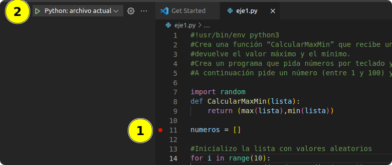
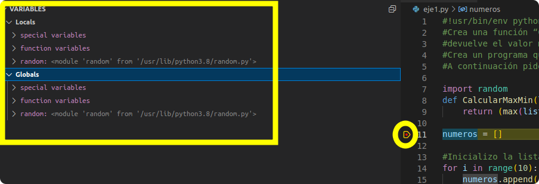
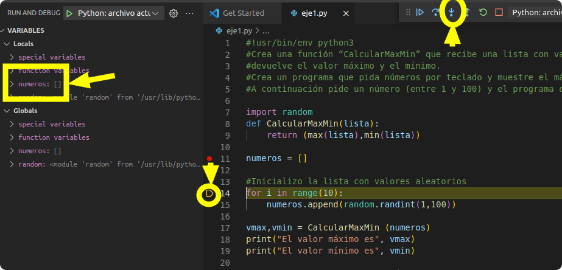
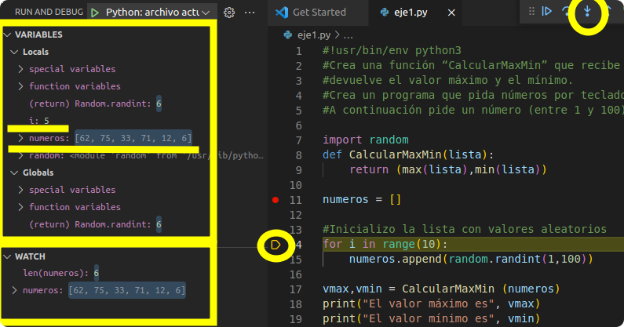
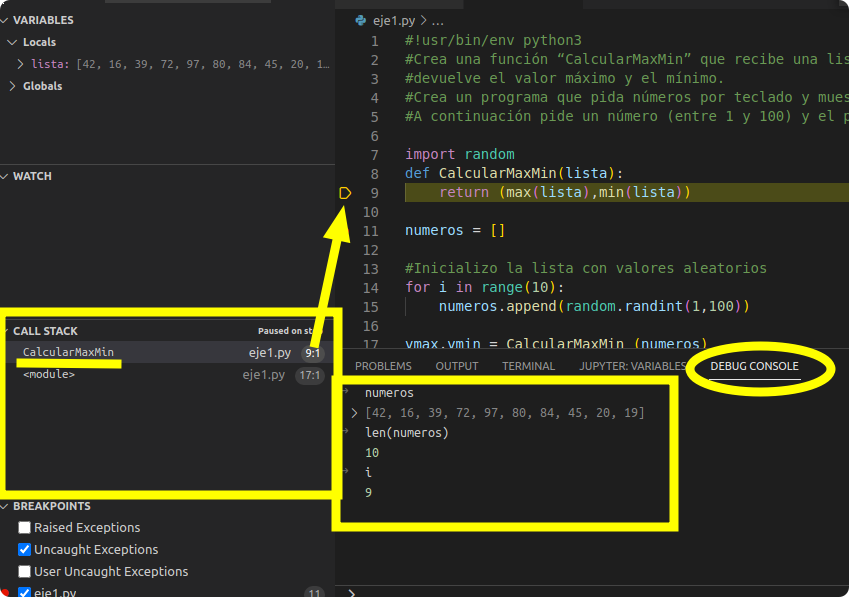

## Depurar (Debug) un programa

### ¿Qué es hacer debug o depurar?
En ocasiones, cuando realizamos un programa, el resultado obtenido no es el esperado, es decir, hemos cometido algún error de cálculo, el cual hace que el programa funcione pero no lo haga correctamente. En estas ocasiones es muy importante depurar el programa.

En la depuración lo que hacemos es ejecutar el programa **paso a paso**, así podemos ver las instrucciones que se están ejecutando, además de poder ver los valores que van tomando las variables. Esto nos sirve de ayuda para ver las variables, los valores que van tomando, las instrucciones que se están ejecutando y así poder ver dónde hemos cometido un error.

Para depurar, podemos usar las herramientas que viene en los entornos de desarrollo integrados/editores, como Visual Code, o usar herramientas que vienen con el interprete de Python, como [Pdb](https://realpython.com/python-debugging-pdb/)

A continuación veremos un ejemplo del uso de Visual Code 
### Ejemplo de uso de Visual Code
En Visual Code, el editor de texto que vamos a utilizar, para poder depurar un programa en Python se necesita instalar el plugin correspondiente.

Una vez instalado este plugin, vamos a la opción **Debug**, que se encuentra en la columna izquierda de Visual Code, así podemos empezar a depurar nuestro programa.

Si el programa a depurar es muy grande, tal vez no nos interese realizar la traza desde el principio, por lo que podemos indicar en qué instrucción empezar la depuración. De esta forma creamos un **breakpoint** o un punto de ruptura, con el que conseguimos que cuando la ejecución llegue a esa instrucción, se pare y empiece a hacer la depuración.

>  Un breakpoint (o punto de ruptura o punto de parada) es el mecanismo que nos va a permitir detener el flujo de ejecución de un programa en una instrucción en concreto.

En este ejemplo vamos a depurar este programa:

```Python
	#!usr/bin/env python3
	#Crea una función “CalcularMaxMin” que recibe una lista con valores numéricos y
	#devuelve el valor máximo y el mínimo. Crea un programa que pida números por
	#teclado y muestre el máximo y el mínimo, utilizando la función anterior.
	#A continuación pide un número (entre 1 y 100) y el programa debe decir si está en la lista
	import random
	def CalcularMaxMin(lista):
		return (max(lista),min(lista))

	
	numeros = []
	#Inicializo la lista con valores aleatorios
	for i in range(0..10):
	numeros.append(random.randint(1,1000))
	vmax,vmin = CalcularMaxMin (numeros)
	print(“El valor máximo es “,vmax)
	print(“El valor mínimo es “,vmin)

	numero = int(input(“Dime un número del 1 al 100:”))
	while numero > 0 or numero < 100:
	print(“El número debe estar entre 1 y 100”)
	numero = int(input(“Dime un número del 1 al 100:”))

	if numero in numero:
	print(“El número está en la lista”)
	elsa:
	print(“El número no está en la lista”)		
```
> Nota: El programa no es correcto. Corrige los errores antes de hacerlo funcionar. Una vez funcione, tendrás que depurarlo para que funcione de acuerdo a lo que se pide.

Marcamos un breakpoint en la línea número 11 y pulsamos el botón **Start debugging** para comenzar la depuración.

  

Podemos ver que el programa resalta en color la próxima instrucción que se va a ejecutar. Al mismo tiempo observamos que en la parte superior izquierda nos muestra los valores de las variables con las que estamos trabajando. (En el apartado **Variables: locals y globals**)



A continuación ejecutamos la siguiente instrucción, pulsando la opción **Step Into** o la tecla **F11**, observamos que se ha creado la variable `numeros` se ha creado y es una lista vacía.

> Step into: Ejecuta una sentencia y en el caso de ser la llamada a una función, entra dentro de esta para depurarla paso a paso. 


Seguimos ejecutando la depuración con la tecla **F11** y vemos que el programa entra en un bucle y se van añadiendo números aleatorios a la lista. En el apartado de **Variables** vemos que la variable `numeros` va cambiando, y también su longitud, lo que podemos también en el apartado **Watch**, si añadimos una expresión, por ejemplo: `len(numeros)` o solo `numeros`



Como podemos comprobar es una forma muy sencilla de ver qué instrucciones se están ejecutando, además de poder ver en cualquier momento los valores de las variables.

En cualquier momento podemos ir a la **consola de depuración**, seleccionando en **Debug Console**. Esta consola se abre en la parte inferior de la pantalla, y en la que podemos ejecutar instrucciones Python en el entorno de nuestro programa, es decir, con el valor de las variables y tal como en ese momento está ejecutado. 



Por ejemplo podemos lanzar las ejecuciones de las sentencias `len(numeros)` o solo `numeros`.

Si en la consola de depuración escribimos la variable numeros, nos muestra el valor actual de la misma.

También podemos hacer instrucciones más complicada, por ejemplo, podemos comprobar si el número 1 está en la variable `numeros`, escribiendo `1 in numeros`.

Si continuamos ejecutando el programa, la instrucción for va a tener diez iteraciones, y cuando termine pasamos a la ejecución de una función en la línea 8.

Si estamos seguros que dicha función se ejecuta sin problemas y no necesitemos depurarla, podemos pulsar la opción **Step Over** o pulsar la tecla **F10**, y en ese caso se ejecuta la función pero sin entrar dentro de esta para depurar paso a paso.

> Step over: Ejecuta una sentencia y en el caso de ser la llamada a una función, no entra dentro de esta para depurarla.

Si realmente queremos ver cómo se ejecuta esa función, pulsamos **F11** y la ejecución iría la función, calcularía el máximo y el mínimo de la lista y nos devolvería esos valores.

Por último, en el apartado **Calla Stack** podremos ver la pila de llamadas que se ha hecho en nuestro programa, pudiendo hacer un seguimiento de qué función ha llamado a qué otra función.

Esta práctica es muy recomendable para todo el que esté comenzando a programar, para localizar los posibles errores de programación que se hayan cometido, y además para aprender cómo se ejecutan las instrucciones dentro de nuestro programa.


## Fuente

* [Como depurar, Open Webinars](https://openwebinars.net/blog/como-hacer-debug-con-python/)
* [Depurar con Pdb](https://realpython.com/python-debugging-pdb/)
