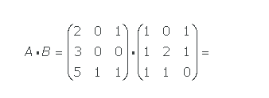

## P3.1 - Ejercicios

#### **Ejercicio 3.1.1**

Escribir un programa que almacene las asignaturas de un curso (por ejemplo Matemáticas, Física, Química, Historia y Lengua) en una lista y la muestre por pantalla.

<!--
[Solución](https://colab.research.google.com/github/asalber/aprendeconalf/blob/master/content/es/docencia/python/ejercicios/soluciones/listas-tuplas/ejercicio1.ipynb)
-->

#### **Ejercicio 3.1.2**

Escribir un programa que almacene las asignaturas de un curso (por ejemplo Matemáticas, Física, Química, Historia y Lengua) en una lista y la muestre por pantalla el mensaje `Yo estudio <asignatura>`, donde `<asignatura>` sobre cada una de las asignaturas de la lista.

<!--

[Solución](https://colab.research.google.com/github/asalber/aprendeconalf/blob/master/content/es/docencia/python/ejercicios/soluciones/listas-tuplas/ejercicio2.ipynb)
-->

#### **Ejercicio 3.1.3**

Escribir un programa que almacene las asignaturas de un curso (por ejemplo Matemáticas, Física, Química, Historia y Lengua) en una lista, pregunte al usuario la nota que ha sacado en cada asignatura, y después las muestre por pantalla con el mensaje `En <asignatura> has sacado <nota>` donde `<asignatura>` es cada una des las asignaturas de la lista y `<nota>` cada una de las correspondientes notas introducidas por el usuario.

<!--

[Solución](https://colab.research.google.com/github/asalber/aprendeconalf/blob/master/content/es/docencia/python/ejercicios/soluciones/listas-tuplas/ejercicio3.ipynb)
-->

#### **Ejercicio 3.1.4**

Escribir un programa que pregunte al usuario los números ganadores de la lotería primitiva, los almacene en una lista y los muestre por pantalla ordenados de menor a mayor.

<!--

[Solución](https://colab.research.google.com/github/asalber/aprendeconalf/blob/master/content/es/docencia/python/ejercicios/soluciones/listas-tuplas/ejercicio4.ipynb)
-->

#### **Ejercicio 3.1.5**

Escribir un programa que almacene en una lista los números del 1 al 10 y los muestre por pantalla en orden inverso separados por comas.

<!--

[Solución](https://colab.research.google.com/github/asalber/aprendeconalf/blob/master/content/es/docencia/python/ejercicios/soluciones/listas-tuplas/ejercicio5.ipynb)
-->

#### **Ejercicio 3.1.6**

Escribir un programa que almacene las asignaturas de un curso (por ejemplo Matemáticas, Física, Química, Historia y Lengua) en una lista, pregunte al usuario la nota que ha sacado en cada asignatura y elimine de la lista las asignaturas aprobadas. Al final el programa debe mostrar por pantalla las asignaturas que el usuario tiene que repetir.

<!--
[Solución](https://colab.research.google.com/github/asalber/aprendeconalf/blob/master/content/es/docencia/python/ejercicios/soluciones/listas-tuplas/ejercicio6.ipynb)
-->

#### **Ejercicio 3.1.7**

Escribir un programa que almacene el abecedario en una lista, elimine de la lista las letras que ocupen posiciones múltiplos de 3, y muestre por pantalla la lista resultante.

<!--
[Solución](https://colab.research.google.com/github/asalber/aprendeconalf/blob/master/content/es/docencia/python/ejercicios/soluciones/listas-tuplas/ejercicio7.ipynb)
-->

#### **Ejercicio 3.1.8**

Escribir un programa que pida al usuario una palabra y muestre por pantalla si es un palíndromo.

<!--
[Solución](https://colab.research.google.com/github/asalber/aprendeconalf/blob/master/content/es/docencia/python/ejercicios/soluciones/listas-tuplas/ejercicio8.ipynb)
-->

#### **Ejercicio 3.1.9**

Escribir un programa que pida al usuario una palabra y muestre por pantalla el número de veces que contiene cada vocal.

<!--
[Solución](https://colab.research.google.com/github/asalber/aprendeconalf/blob/master/content/es/docencia/python/ejercicios/soluciones/listas-tuplas/ejercicio9.ipynb)
-->

#### **Ejercicio 3.1.10**

Escribir un programa que almacene en una lista los siguientes precios: `50, 75, 46, 22, 80, 65, 8` y muestre por pantalla el menor y el mayor de los precios.

<!--
[Solución](https://colab.research.google.com/github/asalber/aprendeconalf/blob/master/content/es/docencia/python/ejercicios/soluciones/listas-tuplas/ejercicio10.ipynb)
-->

#### **Ejercicio 3.1.11**

Escribir un programa que almacene los vectores `(1,2,3)` y `(-1,0,2)` en dos listas y muestre por pantalla su producto escalar.

<!--
[Solución](https://colab.research.google.com/github/asalber/aprendeconalf/blob/master/content/es/docencia/python/ejercicios/soluciones/listas-tuplas/ejercicio11.ipynb)
-->

#### **Ejercicio 3.1.12**

Escribir un programa que almacene las matrices 

matriz 2x3
```
A=  
 1, 2, 3
 4, 5, 6
``` 

matriz 3x2
```
B=  
−1, 0    
 0, 1
 1, 1
``` 

en una lista y muestre por pantalla su producto. El resultado debe ser una matriz de 2x2.

Nota: Para representar matrices mediante listas usar listas anidadas, representando cada vector fila en una lista.

Prueba ahora con estas matrices


El resultado debe ser una matriz de 3x3.

<!--

[Solución](https://colab.research.google.com/github/asalber/aprendeconalf/blob/master/content/es/docencia/python/ejercicios/soluciones/listas-tuplas/ejercicio12.ipynb)
-->

#### **Ejercicio 3.1.13**

Escribir un programa que pregunte por una muestra de números, separados por comas, los guarde en una lista y muestre por pantalla su media y desviación típica.

<!--
[Solución](https://colab.research.google.com/github/asalber/aprendeconalf/blob/master/content/es/docencia/python/ejercicios/soluciones/listas-tuplas/ejercicio13.ipynb)

-->
