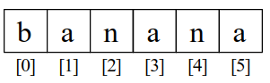

## 3.0 Cadenas

Las cadenas son una secuencia de caracteres. En Python, las cadenas son objetos y tienen métodos asociados. En esta unidad vamos a ver cómo trabajar con cadenas en Python.

### 1. Acceso a los caracteres de una cadena

En Python, las cadenas son secuencias de caracteres. Puedes acceder a los caracteres de una cadena utilizando el operador de indexación `[]`. Por ejemplo, si tienes una cadena `fruta` y quieres acceder al segundo carácter de la cadena, puedes hacerlo de la siguiente manera:

```Python

```Python
>>> fruta = 'banana'
>>> letra = fruta[1]
```

La segunda sentencia extrae el carácter en la posición del índice 1 de la variable `fruta` y la asigna a la variable `letra`.

La expresión que hay dentro de los corchetes es llamada *índice*. El índice indica qué carácter de la secuencia quieres (de ahí el nombre).

Pero podrías no obtener lo que esperas:

```Python
>>> print(letra)
a
```

Para la mayoría de las personas, la primer letra de “banana” es “b”, no “a”. Pero en Python, el índice es un desfase desde el inicio de la cadena, y el desfase de la primera letra es cero.

```Python
>>> letra = fruta[0]
>>> print(letra)
b
```

Así que “b” es la letra 0 (“cero”) de “banana”, “a” es la letra con índice 1, y “n” es la que tiene índice 2, etc.



#### 1.1. Indices de Cadenas

Puedes usar cualquier expresión, incluyendo variables y operadores, como un índice, pero el valor del índice tiene que ser un entero. De otro modo obtendrás:

```Python
>>> letra = fruta[1.5]
TypeError: string indices must be integers
```

#### 1.2. Rebanado (slicing) de una cadena

Un segmento de una cadena es llamado *rebanado*. Seleccionar un rebanado es similar a seleccionar un carácter:

```Python
>>> s = 'Monty Python'
>>> print(s[0:5])
Monty
>>> print(s[6:12])
Python
```

El operador `[n:m]` retorna la parte de la cadena desde el “n-ésimo” carácter hasta el “m-ésimo” carácter, **incluyendo el primero pero excluyendo el último**.

Si omites el primer índice (antes de los dos puntos), el rebanado comienza desde el inicio de la cadena. Si omites el segundo índice, el rebanado va hasta el final de la cadena:

```Python
>>> fruta = 'banana'
>>> fruta[:3]
'ban'
>>> fruta[3:]
'ana'
```

Si el primer índice es mayor que o igual que el segundo, el resultado es una *cadena vacía*, representado por dos comillas:

```Python
>>> fruta = 'banana'
>>> fruta[3:3]
''
```

Una cadena vacía no contiene caracteres y tiene un tamaño de 0, pero fuera de esto es lo mismo que cualquier otra cadena.

#### 1.3. Las cadenas son inmutables

Puede ser tentador utilizar el operador [] en el lado izquierdo de una asignación, con la intención de cambiar un carácter en una cadena. Por ejemplo:

```Python
>>> saludo = 'Hola, mundo!'
>>> saludo[0] = 'J'
TypeError: 'str' object does not support item assignment
```

El “objeto” en este caso es la cadena y el “ítem” es el carácter que tratamos de asignar. Por ahora, un *objeto* es la misma cosa que un valor, pero vamos a redefinir esa definición después. Un *ítem* es uno de los valores en una secuencia.

La razón por la cual ocurre el error es que las cadenas son *inmutables*, lo cual significa que no puedes modificar una cadena existente. Lo mejor que puedes hacer es crear una nueva cadena que sea una variación de la original:

```Python
>>> saludo = 'Hola, mundo!'
>>> nuevo_saludo = 'J' + saludo[1:]
>>> print(nuevo_saludo)
Jola, mundo!
```

Este ejemplo concatena una nueva letra a una parte de `saludo`. Esto no tiene efecto sobre la cadena original.


### 2. Operando con cadenas

Las cadenas en Python soportan operadores como `+`, `*`, `==` e `in`. Métodos como `len` para obtener la longitud , métopdos 

#### 2.1. Multiplicando `*` y concatenando de cadenas `+`
En general, no puedes realizar operaciones matemáticas con cadenas, incluso si los caracteres parecen números. El siguiente código es incorrecto:

```Python   
>>> fruta = 'banana'
>>> 'n' + 1
TypeError: Can't convert 'int' object to str implicitly
```

El error que obtienes es un `TypeError`, que significa que estás intentando operar con tipos incompatibles. En este caso, estás intentando sumar un carácter a un número.

Pero puedes realizar otras operaciones con cadenas, como la concatenación:

```Python
    
>>> fruta = 'banana'
>>> prefijo = 'an'
>>> prefijo + fruta
'ananana'
```

También puedes multiplicar una cadena por un número entero:

```Python
>>> prefijo = 'an'
>>> prefijo * 3
'ananan'
```

#### 2.2. Obtener el tamaño de una cadena usando `len`

`len` es una función nativa que devuelve el número de caracteres en una cadena:

```Python
>>> fruta = 'banana'
>>> len(fruta)
6
```

Para obtener la última letra de una cadena, podrías estar tentado a probar algo como esto:

```Python
>>> tamaño = len(fruta)
>>> ultima = fruta[tamaño]
IndexError: string index out of range
```

La razón de que haya un `IndexError` es que ahí no hay ninguna letra en “banana” con el índice 6. Puesto que empezamos a contar desde cero, las seis letras están enumeradas desde 0 hasta 5. Para obtener el último carácter, tienes que restar 1 a `length`:

```Python
>>> ultima = fruta[tamaño-1]
>>> print(ultima)
a
```

Alternativamente, puedes usar índices negativos, los cuales cuentan hacia atrás desde el final de la cadena. La expresión `fruta[-1]` devuelve la última letra, `fruta[-2]` la penúltima letra, y así sucesivamente.

> **IMPORTANTE**: En las secuencias, el índice empieza en la posición `0` y termina en la posición `len() - 1`

#### 2.3. El operador `in`

La palabra `in` es un operador booleano que toma dos cadenas y regresa `True` si la primera cadena aparece como una subcadena de la segunda:

```Python
>>> 'a' in 'banana'
True
>>> 'semilla' in 'banana'
False
```

#### 2.4. Comparación de cadenas `==`, `>`, `<`...

Los operadores de comparación funcionan en cadenas. Para ver si dos cadenas son iguales:

```Python
if palabra == 'banana':
    print('Muy bien, bananas.')
```

Otras operaciones de comparación son útiles para poner palabras en orden alfabético:

```Python
if palabra < 'banana':
    print('Tu palabra, ' + palabra + ', está antes de banana.')
elif palabra > 'banana':
    print('Tu palabra, ' + palabra + ', está después de banana.')
else:
    print('Muy bien, bananas.')
```

Python no maneja letras mayúsculas y minúsculas de la misma forma que la gente lo hace. Todas **las letras mayúsculas van antes que todas las letras minúsculas**, por ejemplo:

```Python
Tu palabra, Piña, está antes que banana.
```

Una forma común de manejar este problema es convertir cadenas a un formato estándar, como todas a minúsculas, antes de llevar a cabo la comparación.

#### 2.5. El operador de formato `%`

El *operador de formato* `%` nos permite construir cadenas, reemplazando partes de las cadenas con datos almacenados en variables. Cuando lo aplicamos a enteros, `%` es el operador módulo. Pero cuando es aplicado a una cadena, `%` es el operador de formato.

El primer operando es la *cadena a formatear*, la cual contiene una o más *secuencias de formato* que especifican cómo el segundo operando es formateado. El resultado es una cadena.

Por ejemplo, la secuencia de formato `%d` significa que el segundo operando debería ser formateado como un entero (“d” significa “decimal”):

```Python
>>> camellos = 42
>>> '%d' % camellos
'42'
```

El resultado es la cadena ‘42’, el cual no debe ser confundido con el valor entero 42.

Una secuencia de formato puede aparecer en cualquier lugar en la cadena, así que puedes meter un valor en una frase:

```Python
>>> camellos = 42
>>> 'Yo he visto %d camellos.' % camellos
'Yo he visto 42 camellos.'
```

Si hay más de una secuencia de formato en la cadena, el segundo argumento tiene que ser una tupla. Cada secuencia de formato es relacionada con un elemento de la tupla, en orden.

El siguiente ejemplo usa `%d` para formatear un entero, `%g` para formatear un número de punto flotante (no preguntes por qué), y `%s` para formatear una cadena:

```Python
>>> 'En %d años yo he visto %g %s.' % (3, 0.1, 'camellos')
'En 3 años yo he visto 0.1 camellos.'
```

El número de elementos en la tupla debe coincidir con el número de secuencias de formato en la cadena. El tipo de los elementos también debe coincidir con la secuencia de formato:

```Python
>>> '%d %d %d' % (1, 2)
TypeError: not enough arguments for format string
>>> '%d' % 'dolares'
TypeError: %d format: a number is required, not str
```

En el primer ejemplo, no hay suficientes elementos; en el segundo, el elemento es de un tipo incorrecto.

El operador de formato es poderoso, pero puede ser difícil de usar. Puedes leer más al respecto en

[https://docs.python.org/library/stdtypes.html#printf-style-string-formatting](https://docs.python.org/library/stdtypes.html#printf-style-string-formatting).


### 3. Iteradores: Recorriendo una cadena mediante un bucle

Muchos de los cálculos requieren procesar una cadena carácter por carácter. Frecuentemente empiezan desde el inicio, seleccionando cada carácter presente, haciendo algo con él, y continuando hasta el final. Este patrón de procesamiento es llamado un *iterador*. Una manera de escribir un iterador es con un bucle `while`:

```Python
indice = 0
while indice < len(fruta):
    letra = fruta[indice]
    print(letra)
    indice = indice + 1
```

Este bucle recorre la cadena e imprime cada letra en una línea cada una. La condición del bucle es `indice < len(fruta)`, así que cuando `indice` es igual al tamaño de la cadena, la condición es falsa, y el código del bucle no se ejecuta. El último carácter accedido es el que tiene el índice `len(fruta)-1`, el cual es el último carácter en la cadena.

Otra forma de escribir un iterador es con un bucle `for`:

```Python
for caracter in fruta:
    print(caracter)
```

Cada vez que iteramos el bucle, el siguiente carácter en la cadena es asignado a la variable `caracter`. El ciclo continúa hasta que no quedan caracteres.

#### 3.1. Iterando y contando

El siguiente programa cuenta el número de veces que la letra “a” aparece en una cadena:

```Python
palabra = 'banana'
contador = 0
for letra in palabra:
    if letra == 'a':
        contador = contador + 1
print(contador)
```

Este programa demuestra otro patrón de computación llamado *contador*. La variable `contador` es inicializada a 0 y después se incrementa cada vez que una “a” es encontrada. Cuando el bucle termina, `contador` contiene el resultado: el número total de a’s.


### 5. Métodos de cadenas

Los cadenas son un ejemplo de *objetos* en Python. Un objeto contiene tanto datos (el valor de la cadena misma) como *métodos*, los cuales son efectivamente funciones que están implementadas dentro del objeto y que están disponibles para cualquier *instancia* del objeto.

Python tiene una función llamada `dir` la cual lista los métodos disponibles para un objeto. La función `type` muestra el tipo de un objeto y la función `dir` muestra los métodos disponibles.

```Python
>>> cosa = 'Hola mundo'
>>> type(cosa)
<class 'str'>
>>> dir(cosa)
['capitalize', 'casefold', 'center', 'count', 'encode',
'endswith', 'expandtabs', 'find', 'format', 'format_map',
'index', 'isalnum', 'isalpha', 'isdecimal', 'isdigit',
'isidentifier', 'islower', 'isnumeric', 'isprintable',
'isspace', 'istitle', 'isupper', 'join', 'ljust', 'lower',
'lstrip', 'maketrans', 'partition', 'replace', 'rfind',
'rindex', 'rjust', 'rpartition', 'rsplit', 'rstrip',
'split', 'splitlines', 'startswith', 'strip', 'swapcase',
'title', 'translate', 'upper', 'zfill']
>>> help(str.capitalize)
Help on method_descriptor:

capitalize(...)
    S.capitalize() -> str

    Return a capitalized version of S, i.e. make the first character have upper case and the rest lower case.
>>>
```

Llamar a un *método* es similar a llamar una función (esta toma argumentos y devuelve un valor) pero la sintaxis es diferente. Llamamos a un método uniendo el nombre del método al de la variable, usando un punto como delimitador.
Aunque la función `dir` lista los métodos y puedes usar la función `help` para obtener una breve documentación de un método, una mejor fuente de documentación para los métodos de cadenas se puede encontrar en [Métodos en inglés](https://docs.python.org/library/stdtypes.html#string-methods) y
[Métodos en castellano](https://docs.python.org/es/3/library/stdtypes.html#string-methods)

Por ejemplo, el método `upper` toma una cadena y devuelve una nueva cadena con todas las letras en mayúscula:

En vez de la sintaxis de función `upper(palabra)`, éste utiliza la sintaxis de método `palabra.upper()`.

```Python
>>> palabra = 'banana'
>>> nueva_palabra = palabra.upper()
>>> print(nueva_palabra)
BANANA
```

Esta forma de notación con punto especifica el nombre del método, `upper`, y el nombre de la cadena al que se le aplicará el método, `palabra`. Los paréntesis vacíos indican que el método no toma argumentos.

Una llamada a un método es conocida como una *invocación*; en este caso, diríamos que estamos invocando `upper` en `palabra`.

Por ejemplo, existe un método de cadena llamado `find` que busca la posición de una cadena dentro de otra:

```Python
>>> palabra = 'banana'
>>> indice = palabra.find('a')
>>> print(indice)
1
```

En este ejemplo, invocamos `find` en `palabra` y pasamos la letra que estamos buscando como un parámetro.

El método `find` puede encontrar subcadenas así como caracteres:

```Python
>>> palabra.find('na')
2
```

También puede tomar como un segundo argumento el índice desde donde debe empezar:

```Python
>>> palabra.find('na', 3)
4
```

Una tarea común es eliminar los espacios en blanco (espacios, tabs, o nuevas líneas) en el inicio y el final de una cadena usando el método `strip`:

```Python
>>> linea = '  Aquí vamos  '
>>> linea.strip()
'Aquí vamos'
```

Algunos métodos como `startswith` devuelven valores booleanos.

```Python
>>> linea = 'Que tengas un buen día'
>>> linea.startswith('Que')
True
>>> linea.startswith('q')
False
```

Puedes notar que `startswith` requiere que el formato (mayúsculas y minúsculas) coincida, de modo que a veces tendremos que tomar la línea y cambiarla completamente a minúsculas antes de hacer la verificación, utilizando el método `lower`.

```Python
>>> linea = 'Que tengas un buen día'
>>> linea.startswith('q')
False
>>> linea.lower()
'que tengas un buen día'
>>> linea.lower().startswith('q')
True
```

En el último ejemplo, el método `lower` es llamado y después usamos `startswith` para ver si la cadena resultante en minúsculas comienza con la letra “q”. Siempre y cuando seamos cuidadosos con el orden, podemos hacer múltiples llamadas a métodos en una sola expresión.

Es recomendable tener la ayuda cerca y consultar los métodos disponibles y su funcionamiento, siempre actualizado a las últimas versiones. No obstante aqui hay una lista no exahustiva de métodos:

#### 5.1. string.capitalize()

El método capitalize() devuelve una copia de la cadena con su primera letra en mayúscula.
Ejemplo:

```python

>>> texto = "mi diario python"
>>> texto.capitalize()
'Mi diario python'
```

#### 5.2. string.endswith(sufijo)

El método endswith() devuelve True si la cadena termina con el sufijo especificado.
Ejemplo:

```python
>>> texto = "mi diario python"
>>> texto.endswith("python")
True
>>> texto.endswith("thon")
True
>>> texto.endswith("py")
False
```

#### 5.3. string.expandtabs(tamaño_de_tab=8)

El método expandtabs devuelva una copia de la cadena en la que todos los caracteres de las pestañas se reemplazan por uno o más espacios, según la columna actual y el tamaño de la pestaña. Para expandir la cadena, la columna actual se establece en cero y la cadena se examina carácter por carácter. Si el carácter es una pestaña ( `t`), se insertan uno o más caracteres de espacio en el resultado hasta que la columna actual sea igual a la siguiente posición de la pestaña.
Ejemplo:

```python
>>> texto = "mitdiariotpython"
>>> texto.expandtabs(4)
'mi  diario  python'
```

#### string.find(sub)

Devuelve el índice más bajo de la cadena en la subcadena *sub* se encuentra dentro de la rebanada `s[start:end]`. Devuelve -1 si no se encuentra el sub.
Ejemplo:

```python
>>> texto = "mi diario python"
>>> texto.find("mi")
0
>>> texto.find("m")
0
>>> texto.find("i")
1
>>> texto.find("python")
10
>>> texto.find("py")
10
>>> texto.find("p y")
-1
```

#### 5.4. string.format()

Nos permite realizar una operación de formato de cadena. La cadena en la que se llama a este método puede contener texto literal o campos de reemplazo delimitados por llaves `{}`. Cada campo de reemplazo contiene el índice numérico de un argumento posicional o el nombre de un argumento de palabra clave. Devuelve una copia de la cadena donde cada campo de reemplazo se reemplaza con el valor de la cadena del argumento correspondiente.
Ejemplo:

```python
>>> "La suma de 1 + 2 es {0}".format(1+2)
'La suma de 1 + 2 es 3'
```

#### 5.6. string.index(sub)

El método index es muy similar al método find. Con la diferencia de que cuando no se encuentra la subcadena, index lanza un ValueError.

```python
>>> texto = "mi diario python"
>>> texto.index("mi")
0
>>> texto.index("PYTHON")
Traceback (most recent call last):
  File "<stdin>", line 1, in <module>
ValueError: substring not found
>>>
```

#### 5.7. string.isalpha()

Devuelve verdadero si todos los caracteres de la cadena son alfanuméricos y hay al menos un carácter, de lo contrario es falso.
Ejemplo:

```python
>>> texto = "mi diario python"
>>> texto.isalpha()
False
>>> "midiariopython".isalpha()
True
```

> Si te preguntas ¿por que “mi diario python” a lanzado False?. Es porque los espacios no son un carácter alfanumérico.

#### 5.8. string.isdigit()

El método isdigit() devuelve True si todos los caracteres de la cadena son dígitos.
Ejemplo:

```python
>>> texto = "mi diario python"
>>> digitos = "12345"
>>> texto.isdigit()
False
>>> digitos.isdigit()
True
```

#### 5.9. string.isspace()

El método isspace() devuelve True si solo hay caracteres de espacio en blanco.
Ejemplo:

```python
>>> " ".isspace()
True
>>> "  a".isspace()
False
```

#### string.lower()

El método lower devuelve una copia de la cadena con todos sus caracteres en minúsculas.
Ejemplo:

```python
>>> "Hola Mundo".lower()
'hola mundo'
>>> "PYTHON".lower()
'python'
```

#### 5.10. string.upper()

El método upper() devuelve la una copia de la cadena con todos su caracteres en mayúsculas.
Ejemplo:

```python
>>> texto = "mi diario python"
>>> texto.upper()
'MI DIARIO PYTHON'
```

#### 5.11. string.lstrip(chars)

El método lstrip devuelve una copia de la cadena con los caracteres iniciales eliminados. El argumento *chars* es una cadena que especifica el conjunto de caracteres que se eliminarán.
Ejemplo:

```python
>>> web = "www.pythondiario.com"
>>> web.lstrip("w.")
'pythondiario.com'
>>>
```


#### 5.12. string.replace(string_viejo, string_nuevo)

El método replace() devuelve una copia de la cadena con la subcadena vieja remplazada por una nueva. Veamos un ejemplo para entenderlo mejor:

```python
>>> cadena = "Hola Mundo"
>>> cadena.replace("Mundo", "Internet")
'Hola Internet'
```

#### 5.13. string.partition(char)

El método partition() divide la cadena en la primera aparición de char y devuelve una tupla que contiene la parte anterior a char, el mismo char, y la parte posterior de char. Suena un poco confuso, veamos un ejemplo:

```python
>>> cadena = "Hola Mundo"
>>> cadena.partition("la")
('Ho', 'la', ' Internet')
```

#### 5.14. string.title()

El método title() devuelve una copia de la cadena donde las palabras comienzan con una letra mayúscula. Veamos un ejemplo:

```python
>>> cadena = "mi diario python"
>>> cadena.title()
'Mi Diario Python'
```

#### 5.15. string.swapcase()

El método swapcase() devuelve una copia de la cadena con los caracteres en mayúsculas convertidos en minúsculas y viceversa.

Ejemplo:

```python
>>> cadena = "Mi Diario Python"
>>> cadena.swapcase()
'mI dIARIO pYTHON'
```

#### 5.16. string.startswith(prefijo)

El método startswith() devuelve True si la cadena comienza con el prefijo, de lo contrario devuelve False.
Ejemplo:

```python
>>> cadena = "Mi Diario Python"
>>> cadena.startswith("Mi")
True'
```

#### 5.17. string.split(sep)

El método split() devuelve una lista de las palabras en la cadena, utilizando a sep como la cadena delimitadora.
Ejemplo:

```python
>>> cadena = "Luis,Jose,Maria,Sofia,Miguel"
>>> cadena.split(",")
['Luis', 'Jose', 'Maria', 'Sofia', 'Miguel']
```

#### 5.18. string.zfill(ancho)

El método zfill() devuelve una copia de la cadena que se rellena con 0 dígitos ASCII para hacer una cadena de *ancho* de longitud .
Ejemplo:

```python
>>> "356".zfill(6)
'000356'
```


### 6. Analizando cadenas

Frecuentemente, queremos examinar una cadena para encontrar una subcadena. Por ejemplo, si se nos presentaran una seria de líneas con el siguiente formato:

`From stephen.marquard@uct.ac.za Sat Jan  5 09:14:16 2008`

y quisiéramos obtener únicamente la segunda parte de la dirección de correo (esto es, `uct.ac.za`) de cada línea, podemos hacer esto utilizando el método `find` y una parte de la cadena.

Primero tenemos que encontrar la posición de la arroba en la cadena. Después, tenemos que encontrar la posición del primer espacio *después* de la arroba. Y después partiremos la cadena para extraer la porción de la cadena que estamos buscando.

```Python
>>> dato = 'From stephen.marquard@uct.ac.za Sat Jan  5 09:14:16 2008'
>>> arrobapos = dato.find('@')
>>> print(arrobapos)
21
>>> espos = dato.find(' ',arrobapos)
>>> print(espos)
31
>>> direccion = dato[arrobapos+1:espos]
>>> print(direccion)
uct.ac.za
>>>
```

Utilizamos una versión del método `find` que nos permite especificar la posición en la cadena desde donde queremos que `find` comience a buscar. Cuando recortamos una parte de una cadena, extraemos los caracteres desde “uno después de la arroba hasta,  *pero no incluyendo* , el carácter de espacio”.

La documentación del método `find` está disponible en

[Métodos en castellano](https://docs.python.org/es/3/library/stdtypes.html#string-methods).


### 7. Depuración

Una habilidad que debes desarrollar cuando programas es siempre preguntarte a ti mismo, “¿Qué podría fallar aquí?” o alternativamente, “¿Qué cosa ilógica podría hacer un usuario para hacer fallar nuestro (aparentemente) perfecto programa?”

Por ejemplo, observa el programa que utilizamos para demostrar el bucle `while` en el apartado de iteraciones:

```Python
linea = input('> ')
while linea != 'fin':
    if linea[0] != '#' :
        print(linea)
    linea = input('> ')
print('¡Terminado!')

# Código: https://es.py4e.com/code3/copytildone2.py
```

Mira lo que pasa cuando el usuario introduce una línea vacía como entrada:

```Python
> hola a todos
hola a todos
> # no imprimas esto
> ¡imprime esto!
¡imprime esto!
>
Traceback (most recent call last):
  File "copytildone.py", line 3, in <module>
    if linea[0] != '#' :
IndexError: string index out of range
```

El código funciona bien hasta que se presenta una línea vacía. En ese momento no hay un carácter cero, por lo que obtenemos una traza de error (traceback). Existen dos soluciones a esto para convertir la línea tres en “segura”, incluso si la línea está vacía.

Una posibilidad es simplemente usar el método `startswith` que devuelve `False` si la cadena está vacía.

```Python
if linea.startswith('#'):
```

Otra forma segura es escribir una sentencia `if` utilizando el patrón *guardián* y asegurarse que la segunda expresión lógica es evaluada sólo cuando hay al menos un carácter en la cadena:

```Python
if len(linea) > 0 and linea[0] != '#':
```


## Fuente

* [Página de Juan Jose Lozano Gomez sobre Python](https://j2logo.com/)
* [Python para todos](https://es.py4e.com/)
* [Ejemplos con métodos de String](https://pythondiario.com/2019/02/metodos-string-en-python-con-ejemplos.html)
* [Estructuras de datos](https://blog.soyhenry.com/que-es-una-estructura-de-datos-en-programacion/)
* [Aprende con Alf](ttps://aprendeconalf.es)
