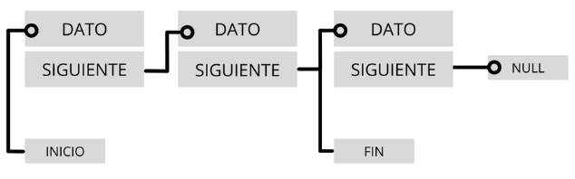
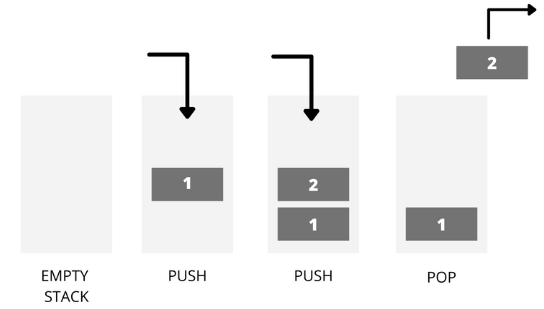
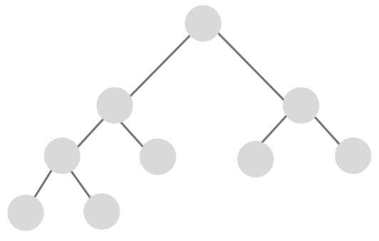

## Listas

### Estructuras de datos

Las **estructuras de datos en programación** son un modo de representar información en una computadora, aunque además, cuentan con un comportamiento interno. ¿Qué significa? Que se rige por determinadas reglas/restricciones que han sido dadas por la forma en que está construida internamente.

¿Por qué es importante conocerlas? Cuando inicias en el mundo de la programación y te metes de lleno en el mundo de [**JavaScript**](https://blog.soyhenry.com/que-es-javascript-y-para-que-sirve/), las **estructuras de datos** son fundamentales. Conocer sobre listas, árboles y grafos te permitirá organizar mejor la información y crear código más eficiente. Además, es clave para mejorar tus habilidades técnicas y enfrentarte con éxito a cada challenge en tus futuras entrevistas laborales.

#### ¿Para qué sirven las estructuras de datos?

En el ámbito de la informática, las **estructuras de datos** son aquellas que nos permiten, como desarrolladores, organizar la información de manera eficiente, y en definitiva diseñar la solución correcta para un determinado problema.

Ya sean las más utilizadas comúnmente -como las  **variables** ,  **arrays** , **conjuntos **o  **clases** - o las diseñadas para un propósito específico - **árboles** ,  **grafos** ,  **tablas** , etc.-, una **estructura de datos **nos permite trabajar en un algo nivel de abstracción almacenando información para luego acceder a ella, modificarla y manipularla.

#### ¿Cuáles son los tipos de estructuras de datos?

Primero, debemos diferenciar entre **estructura de dato estática** y **estructura de dato dinámica**

Las **estructuras de datos estáticas** son aquellas en las que el tamaño ocupado en memoria se define antes de que el programa se ejecute y no puede modificarse dicho tamaño durante la ejecución del programa, mientras que una **estructura de datos dinámica** es aquella en la que el tamaño ocupado en memoria puede modificarse durante la ejecución del programa.

Cada tipo de estructura dependerá del tipo de aplicación que se requiera. Una típica dentro de las **estructuras de datos estáticas** son los **arrays**:

##### Arrays

¿Qué es un array en programación? Un **array **es un tipo de **dato estructurado** que permite almacenar un conjunto de datos homogéneo y ordenado, es decir, todos ellos del mismo tipo y relacionados. Su condición de  *homogéneo* , indica que sus elementos están compuestos por el mismo tipo de dato, y su condición de *ordenado *hace que se pueda identificar del primer al último elemento que lo compone.

##### Estructura de datos dinámicas

Por otro lado, vimos que en programación existen  **estructuras de datos dinámicas** , es decir, una colección de elementos -nodos- que normalmente se utilizan para dejar asentados registros. A diferencia de un **array** que contiene espacio para almacenar un número fijo de elementos, una **estructura dinámica de datos** se amplía y contrae durante la ejecución del programa. Veamos algunos casos:

##### Estructura de datos lineales

Las **estructuras de datos lineales ** son aquellas en las que los elementos ocupan lugares sucesivos en la estructura y cada uno de ellos tiene un único sucesor y un único predecesor, es decir, sus elementos están ubicados uno al lado del otro relacionados en forma lineal.

Hay tres tipos de **estructuras de datos lineales**:

* Listas enlazadas
* Pilas
* Colas

**Listas enlazadas**

En las **estructuras de datos**, las listas enlazadas se construyen con elementos que están ubicados en una secuencia. Aquí, cada elemento se conecta con el siguiente a través de un enlace que contiene la posición del siguiente elemento. De este modo, teniendo la referencia del principio de la lista podemos acceder a todos los elementos de la misma.


Lista simplemente enlazada.

**Pila**

La pila es un tipo especial de **lista lineal** dentro de las **estructuras de datos dinámicas **que permite almacenar y recuperar datos, siendo el modo de acceso a sus elementos de tipo LIFO (del inglés  *Last In, First Out* , es decir,  *último en entrar, primero en salir* ). ¿Cómo funciona? A través de dos operaciones básicas: apilar (push), que coloca un objeto en la pila, y su operación inversa, desapilar (pop), que retira el último elemento apilado.



##### Estructura de datos no lineales

Las  **estructuras de datos no lineales** , también llamadas multienlazadas, son aquellas en las que cada elemento puede estar enlazado a cualquier otro componente. Es decir, cada elemento puede tener varios sucesores o varios predecesores.

Existen dos tipos:

* Árboles
* Grafos

**Árboles**

En **estructura de datos**, los árboles consisten en una **estructura no lineal **que se utiliza para representar datos con una relación jerárquica en la que cada elemento tiene un único antecesor y puede tener varios sucesores.

Los mismos se encuentran clasificados en: **árbol general**, un árbol donde cada elemento puede tener un número ilimitado de sub árboles y **árboles binarios**, que son una estructura de datos homogénea, dinámica y no lineal en donde a cada elemento le pueden seguir como máximo dos nodos.



**Grafos**

Otro tipo de **no lineal** de **estructura de datos en programación**, son los  **grafos**. Se trata de una estructura matemática formada por un conjunto de puntos —una estructura de datos— y un conjunto de líneas, cada una de las cuales une un punto a otro. Los puntos se llaman nodos o vértices del grafo y las líneas se llaman aristas o arcos.


Ya sabes, las estructuras de datos en programación son un aspecto clave para conocer. Nos permiten mejorar nuestro código y habilidades técnicas, y en definitiva, resolver de manera eficiente problemas complejos.

### Qué es una lista

Las listas en Python son un tipo  **contenedor**, compuesto, que **se usan para almacenar conjuntos de elementos relacionados** del mismo tipo o de tipos distintos.

Junto a las clases  `tuple`, `range` y `str`, **son uno de los tipos de secuencia en Python**, con la particularidad de que son *mutables*. Esto último quiere decir que su contenido se puede modificar después de haber sido creada.

Para crear una lista en Python, simplemente hay que encerrar una secuencia de elementos separados por comas entre paréntesis cuadrados `[]`.

Por ejemplo, para crear una lista con los números del 1 al 10 se haría del siguiente modo:

```python
>>> numeros = [1, 2, 3, 4, 5, 6, 7, 8, 9, 10]
```

Como te decía, las listas pueden almacenar elementos de distinto tipo. La siguiente lista también es válida:

```python
>>> elementos = [3, 'a', 8, 7.2, 'hola']
```

Incluso pueden contener otros elementos compuestos, como objetos u otras listas:

```python
>>> lista = [1, ['a', 'e', 'i', 'o', 'u'], 8.9, 'hola']
```

Las listas también se pueden crear usando el constructor de la clase, `list(iterable)`. En este caso, el constructor crea una lista cuyos elementos son los mismos y están en el mismo orden que los ítems del iterable. El objeto *iterable* puede ser o una secuencia, un contenedor que soporte la iteración o un objeto iterador.

Por ejemplo, el tipo *str* también es un tipo secuencia. Si pasamos un string al constructor `list()` creará una lista cuyos elementos son cada uno de los caracteres de la cadena:

```python
>>> vocales = list('aeiou')
>>> vocales
>>> ['a', 'e', 'i', 'o', 'u']
```

Termino esta sección mostrando dos alternativas de crear una lista vacía:

```python
>>> lista_1 = []  # Opción 1
>>> lista_2 = list()  # Opción 2
```

#### Cómo acceder a los elementos de una lista en Python

Para acceder a un elemento de una lista se utilizan los índices.  **Un índice es un número entero que indica la posición de un elemento en una lista** . El primer elemento de una lista siempre comienza en el índice 0.

Por ejemplo, en una lista con 4 elementos, los índices de cada uno de los ítems serían 0, 1, 2 y 3.

```python
>>> lista = ['a', 'b', 'd', 'i', 'j']
>>> lista[0]  # Primer elemento de la lista. Índice 0
>>> 'a'
>>> lista[3]  # Cuarto elemento de la lista. Índice 3
>>> 'i'
```

Si se intenta acceder a un índice que está fuera del rango de la lista, el intérprete lanzará la excepción `IndexError`. De igual modo, si se utiliza un índice que no es un número entero, se lanzará la excepción `TypeError`:

```python
>>> lista = [1, 2, 3]  # Los índices válidos son 0, 1 y 2
>>> lista[8]
>>> Traceback (most recent call last):
>>> File "<input>", line 1, in <module>
>>> IndexError: list index out of range
>>> lista[1.0]
>>> Traceback (most recent call last):
>>> File "<input>", line 1, in <module>
>>> TypeError: list indices must be integers or slices, not float
```

Como hemos visto, las listas pueden contener otros elementos de tipo secuencia de forma anidada. Por ejemplo, una lista que uno de sus ítems es otra lista. Del mismo modo, se puede acceder a los elementos de estos tipos usando índices compuestos o anidados:

```python
>>> lista = ['a', ['d', 'b'], 'z']
>>> lista[1][1]  # lista[1] hace referencia a la lista anidada
>>> 'b'
```

##### Acceso a los elementos usando un índice negativo

En Python está permitido usar índices negativos para acceder a los elementos de una secuencia. En este caso, el índice -1 hace referencia al último elemento de la secuencia, el -2 al penúltimo y así, sucesivamente:

```python
>>> vocales = ['a', 'e', 'i', 'o', 'u']
>>> vocales[-1]
>>> 'u'
>>> vocales[-4]
>>> 'e'
```

##### Acceso a un subconjunto de elementos

También es posible acceder a un subconjunto de elementos de una lista utilizando rangos en los índices. Esto es usando el operador `[:]`:

```python
>>> vocales = ['a', 'e', 'i', 'o', 'u']
>>> vocales[2:3]  # Elementos desde el índice 2 hasta el índice 3-1
>>> ['i']
>>> vocales[2:4]  # Elementos desde el 2 hasta el índice 4-1
>>> ['i', 'o']
>>> vocales[:]  # Todos los elementos
>>> ['a', 'e', 'i', 'o', 'u']
>>> vocales[1:]  # Elementos desde el índice 1
>>> ['e', 'i', 'o', 'u']
>>> vocales[:3]  # Elementos hasta el índice 3-1
>>> ['a', 'e', 'i']
```

También es posible acceder a los elementos de una lista indicando un paso con el operador `[::]`:

```python
>>> letras = ['a', 'b', 'c', 'd', 'e', 'f', 'g', 'h', 'i', 'j', 'k']
>>> letras[::2]  # Acceso a los elementos de 2 en 2
>>> ['a', 'c', 'e', 'g', 'i', 'k']
>>> letras[1:5:2]  # Elementos del índice 1 al 4 de 2 en 2
>>> ['b', 'd']
>>> letras[1:6:3]  # Elementos del índice 1 al 5 de 3 en 3
>>> ['b', 'e']
```

#### for list Python – Recorrer una lista

Ya hemos visto que se puede usar el bucle [for en Python](https://j2logo.com/bucle-for-en-python/) para recorrer los elementos de una secuencia. En nuestro caso, para recorrer una lista en Python utilizaríamos la siguiente estructura:

```python
>>> colores = ['azul', 'blanco', 'negro']
>>> for color in colores:
>>> print(color)
>>> azul
>>> blanco
>>> negro
```

#### Añadir elementos a una lista en Python

Tal y como te he adelantado, las listas son secuencias mutables, es decir, sus elementos pueden ser modificados (se pueden añadir nuevos ítems, actualizar o eliminar).

Para añadir un nuevo elemento a una lista se utiliza el método `append()` y para añadir varios elementos, el método `extend()`:

```python
>>> vocales = ['a']
>>> vocales.append('e')  # Añade un elemento
>>> vocales
>>> ['a', 'e']
>>> vocales.extend(['i', 'o', 'u'])  # Añade un grupo de elementos
>>> vocales
>>> ['a', 'e', 'i', 'o', 'u']
```

También es posible utilizar el operador de concatenación `+` para unir dos listas en una sola. El resultado es una nueva lista con los elementos de ambas:

```python
>>> lista_1 = [1, 2, 3]
>>> lista_2 = [4, 5, 6]
>>> nueva_lista = lista_1 + lista_2
>>> nueva_lista
>>> [1, 2, 3, 4, 5, 6]
```

Por otro lado, el operador `*` repite el contenido de una lista `n` veces:

```python
>>> numeros = [1, 2, 3]
>>> numeros *= 3
>>> numeros
>>> [1, 2, 3, 1, 2, 3, 1, 2, 3]
```

Y para terminar esta sección, indicarte que también es posible añadir un elemento en una posición concreta de una lista con el método `insert(índice, elemento)`. Los elementos cuyo índice sea mayor a `índice` se desplazan una posición a la derecha:

```python
>>> vocales = ['a', 'e', 'u']
>>> vocales.insert(2, 'i')
>>> vocales
>>> ['a', 'e', 'i', 'u']
```

#### Modificar elementos de una lista

Es posible modificar un elemento de una lista en Python con el operador de asignación `=`. Para ello, lo único que necesitas conocer es el índice del elemento que quieres modificar o el rango de índices:

```python
>>> vocales = ['o', 'o', 'o', 'o', 'u']

# Actualiza el elemento del índice 0
>>> vocales[0] = 'a'
>>> vocales
>>> ['a', 'o', 'o', 'o', 'u']

# Actualiza los elementos entre las posiciones 1 y 2
>>> vocales[1:3] = ['e', 'i']
>>> vocales
>>> ['a', 'e', 'i', 'o', 'u']
```

#### Eliminar un elemento de una lista en Python

En Python se puede eliminar un elemento de una lista de varias formas.

Con la sentencia `del` se puede eliminar un elemento a partir de su índice:

```python
# Elimina el elemento del índice 1
>>> vocales = ['a', 'e', 'i', 'o', 'u']
>>> del vocales[1]
>>> vocales
>>> ['a', 'i', 'o', 'u']

# Elimina los elementos con índices 2 y 3
>>> vocales = ['a', 'e', 'i', 'o', 'u']
>>> del vocales[2:4]
>>> vocales
>>> ['a', 'e', 'u']

##### Elimina todos los elementos
>>> del vocales[:]
>>> vocales
>>> []
```

Además de la sentencia `del`, podemos usar los métodos `remove()` y `pop([i])`. `remove()` elimina la primera ocurrencia que se encuentre del elemento en una lista. Por su parte, `pop([i])` obtiene el elemento cuyo índice sea igual a `i` y lo elimina de la lista. Si no se especifica ningún índice, recupera y elimina el último elemento.

```python
>>> letras = ['a', 'b', 'k', 'a', 'v']

# Elimina la primera ocurrencia del carácter a
>>> letras.remove('a')
>>> letras
>>> ['b', 'k', 'a', 'v']

# Obtiene y elimina el último elemento
>>> letras.pop()
>>> 'v'
>>> letras
>>> ['b', 'k', 'a']
```

Finalmente, es posible eliminar todos los elementos de una lista a través del método `clear()`:

```python
>>> letras = ['a', 'b', 'c']
>>> letras.clear()
>>> letras
>>> []
```

El código anterior sería equivalente a `del letras[:]`.

#### Longitud (len) de una lista en Python

Como cualquier tipo secuencia, para conocer la longitud de una lista en Python se hace uso de la función `len()`. Esta función devuelve el número de elementos de una lista:

```python
>>> vocales = ['a', 'e', 'i', 'o', 'u']
>>>
>>> len(vocales)
>>> 5

```

#### Cómo saber si un elemento está en una lista en Python

Ya adelanté en el tutorial sobre [operadores en Python](https://j2logo.com/python/tutorial/operadores-en-python/), que para saber si un elemento está contenido en una lista, se utiliza el operador de pertenencia `in`:

```python
>>> vocales = ['a', 'e', 'i', 'o', 'u']
>>> if 'a' in vocales:
>>> ...     print('Sí')
>>> ...
>>> Sí
>>> if 'b' not in vocales:
>>> ...     print('No')
>>> ...
>>> No

```

#### sort list Python – Ordenar una lista en Python

Las listas son secuencias ordenadas. Esto quiere decir que sus elementos siempre se devuelven en el mismo orden en que fueron añadidos.

No obstante, es posible ordenar los elementos de una lista con el método `sort()`. El método `sort()` ordena los elementos de la lista utilizando únicamente el operador `<` y modifica la lista actual (no se obtiene una nueva lista):

```python
# Lista desordenada de números enteros
>>> numeros = [3, 2, 6, 1, 7, 4]


# Identidad del objeto numeros
>>> id(numeros)
>>> 4475439216

# Se llama al método sort() para ordenar los elementos de la lista
>>> numeros.sort()
>>> numeros
>>> [1, 2, 3, 4, 6, 7]

# Se comprueba que la identidad del objeto numeros es la misma
>>> id(numeros)
>>> 4475439216

```

#### Listado de métodos de la clase list

Termino este tutorial mostrando la lista completa de métodos de la clase list. Algunos de ellos ya se han mencionado en las secciones anteriores.


| Método                    | Descripción                                                                                                                              |
| ---------------------------- | ------------------------------------------------------------------------------------------------------------------------------------------- |
| `append()`                 | Añade un nuevo elemento al final de la lista.                                                                                            |
| `extend()`                 | Añade un grupo de elementos (iterables) al final de la lista.                                                                            |
| `insert(indice, elemento)` | Inserta un elemento en una posición concreta de la lista.                                                                                |
| `remove(elemento)`         | Elimina la primera ocurrencia del elemento en la lista.                                                                                   |
| `pop([i])`                 | Obtiene y elimina el elemento de la lista en la posición i. Si no se especifica, obtiene y elimina el último elemento.                  |
| `clear()`                  | Borra todos los elementos de la lista.                                                                                                    |
| `index(elemento)`          | Obtiene el índice de la primera ocurrencia del elemento en la lista. Si el elemento no se encuentra, se lanza la excepción`ValueError`. |
| `count(elemento)`          | Devuelve el número de ocurrencias del elemento en la lista.                                                                              |
| `sort()`                   | Ordena los elementos de la lista utilizando el operador`<`.                                                                               |
| `reverse()`                | Obtiene los elementos de la lista en orden inverso.                                                                                       |
| `copy()`                   | Devuelve una copia poco profunda de la lista.                                                                                             |

#### Copia de listas

Existen dos formas de copiar listas:

* **Copia por referencia** `l1 = l2`: Asocia a la variable `l1` la misma lista que tiene asociada la variable `l2`, es decir, ambas variables apuntan a la misma dirección de memoria. Cualquier cambio que hagamos a través de `l1` o `l2` afectará a la misma lista.
* **Copia por valor** `l1 = list(l2)`: Crea una copia de la lista asociada a `l2` en una dirección de memoria diferente y se la asocia a `l1`. Las variables apuntan a direcciones de memoria diferentes que contienen los mismos datos. Cualquier cambio que hagamos a través de `l1` no afectará a la lista de `l2` y viceversa.

```python
>>> a = [1, 2, 3]
>>> # copia por referencia
>>> b = a
>>> b
[1, 2, 3]
>>> b.remove(2)
>>> b
[1, 3]
>>> a
[1, 3]
```

```python
>>> a = [1, 2, 3]
>>> # copia por referencia
>>> b = list(a)
>>> b
[1, 2, 3]
>>> b.remove(2)
>>> b
[1, 3]
>>> a
[1, 2, 3]
```

## Depuración

El uso descuidado de listas (y otros objetos mutables) puede llevar a largas horas de depuración. Aquí están algunos de los errores más comunes y las formas de evitarlos:

1. No olvides que la mayoría de métodos de listas modifican el argumento y regresan `None`. Esto es lo opuesto a los métodos de cadenas, que regresan una nueva cadena y dejan la original sin modificar.
   
   Si estás acostumbrado a escribir código de cadenas como este:

   ```Python
   palabra = palabra.strip()
   ```

   Estás propenso a escribir código de listas como este:

   ```Python
   t = t.sort()           # ¡EQUIVOCADO!
   ```

   Debido a que `sort` regresa `None`, la siguiente operación que hagas con `t` es probable que falle.

   Antes de usar métodos y operadores de listas, deberías leer la documentación cuidadosamente y después probarlos en modo interactivo. Los métodos y operadores que las listas comparten con otras secuencias (como cadenas) están documentados en:

   [docs.python.org/library/stdtypes.html#common-sequence-operations](https://docs.python.org/library/stdtypes.html#common-sequence-operations)

   Los métodos y operadores que solamente aplican a secuencias mutables están documentados en:

   [docs.python.org/library/stdtypes.html#mutable-sequence-types](https://docs.python.org/library/stdtypes.html#mutable-sequence-types)
2. Elige un estilo y apégate a él.
   Parte del problema con listas es que hay demasiadas formas de hacer las cosas. Por ejemplo, para remover un elemento de una lista, puedes utilizar `pop`, `remove`, `del`, o incluso una asignación por rebanado.
   Para agregar un elemento, puedes utilizar el método `append` o el operador `+`. Pero no olvides que esos también son correctos:

   ```Python
   t.append(x)
   t = t + [x]
   ```

   Y esos son incorrectos:

   ```Python
   t.append([x])          # ¡EQUIVOCADO!
   t = t.append(x)        # ¡EQUIVOCADO!
   t + [x]                # ¡EQUIVOCADO!
   t = t + x              # ¡EQUIVOCADO!
   ```

   Prueba cada uno de esos ejemplos en modo interactivo para asegurarte que entiendes lo que hacen. Nota que solamente la última provoca un error en tiempo de ejecución (runtime error); los otros tres son válidos, pero hacen la función equivocada.
3. Hacer copias para evitar alias.
   Si quieres utilizar un método como `sort` que modifica el argumento, pero necesitas mantener la lista original también, puedes hacer una copia.

   ```Python
   orig = t[:]
   t.sort()
   ```

   En este ejemplo podrías también usar la función interna `sorted`, la cual regresa una lista nueva y ordenada, y deja la original sin modificar. ¡Pero en ese caso deberías evitar usar `sorted` como un nombre de variable!
4. Listas, `split`, y archivos
   Cuando leemos y analizamos archivos, hay muchas oportunidades de encontrar entradas que pueden hacer fallar a nuestro programa, así que es una buena idea revisar el patrón *guardián* cuando escribimos programas que leen a través de un archivo y buscan una “aguja en un pajar”.
   Vamos a revisar nuestro programa que busca por el día de la semana en las líneas que contienen “from” en el archivo":

   ```Python
   From stephen.marquard@uct.ac.za Sat Jan  5 09:14:16 2008
   ```

   Puesto que estamos dividiendo esta línea en palabras, podríamos apañarnos con el uso de `startswith` y simplemente buscar la primera palabra de la línea para determinar si estamos interesados en esa línea o no. Podemos saltarnos las líneas que no tienen “From” como  primer palabra, tal como sigue:

   ```Python
   manejador = open('mbox-short.txt')
   for linea in manejador:
       palabras = linea.split()
       if palabras[0] != 'From' : continue # Hay otra forma, evita continue
       print(palabras[2])
   ```

   Esto se ve mucho más simple y ni siquiera necesitamos hacer `rstrip` para borrar el salto de línea al final del archivo. Pero, ¿es mejor?

   ```Python
   python search8.py
   Sat
   Traceback (most recent call last):
     File "search8.py", line 5, in <module>
       if palabras[0] != 'From' : continue
   IndexError: list index out of range
   ```

   De alguna manera funciona y vemos el día de la primera línea (Sat), pero luego el programa falla con un error. ¿Qué fue lo que falló? ¿Qué datos estropearon e hicieron fallar a nuestro elegante, inteligente, y muy Pythónico programa?

   Puedes mirar el código por un largo tiempo y tratar de resolverlo o preguntar a alguien más, pero el método más rápido e inteligente es agregar una sentencia `print`. El mejor lugar para agregar la sentencia `print` es justo antes de la línea donde el programa falló, e imprimir los datos que parece que causan la falla.

   Ahora bien, este método podría generar muchas líneas de salida, pero al menos tendrás inmediatamente alguna pista de cuál es el problema. Así que agregamos un print a la variable `palabras` justo antes de la línea cinco. Incluso podemos agregar un prefijo “Depuración:” a la línea de modo que mantenemos nuestra salida regular separada de la salida de mensajes de depuración.

   ```Python
   for linea in manejador:
       palabras = line.split()
       print('Depuración:', palabras)
       if palabras[0] != 'From' : continue
       print(palabras[2])
   ```

   Cuando ejecutamos el programa, se generan muchos mensajes de salida en la pantalla, pero al final, vemos nuestra salida de depuración y el mensaje de error, de modo que sabemos qué sucedió justo antes del error.

   ```Pyton
   Depuración: ['X-DSPAM-Confidence:', '0.8475']
   Depuración: ['X-DSPAM-Probability:', '0.0000']
   Depuración: []
   Traceback (most recent call last):
     File "search9.py", line 6, in <module>
       if palabras[0] != 'From' : continue
   IndexError: list index out of range
   ```

   Cada línea de depuración imprime la lista de palabras que obtuvimos cuando la función `split` dividió la línea en palabras. Cuando el programa falla, la lista de palabras está vacía `[]`. Si abrimos el archivo en un editor de texto y miramos el archivo, en ese punto se ve lo siguiente:

   ```Pyton
   X-DSPAM-Result: Innocent
   X-DSPAM-Processed: Sat Jan  5 09:14:16 2008
   X-DSPAM-Confidence: 0.8475
   X-DSPAM-Probability: 0.0000

   Details: http://source.sakaiproject.org/viewsvn/?view=rev&rev=39772
   ```

   ¡El error ocurre cuando nuestro programa encuentra una línea vacía! Por supuesto, hay “cero palabras” en una lista vacía. ¿Por qué no pensamos en eso cuando estábamos escribiendo el código? Cuando el código busca la primera palabra (`palabras[0]`) para revisar si coincide con “From”, obtenemos un error “index out of range” (índice fuera de rango).

   Este es, por supuesto, el lugar perfecto para agregar algo de *código guardián* para evitar revisar si la primera palabra no existe. Hay muchas maneras de proteger este código; vamos a optar por revisar el número de palabras que tenemos antes de mirar la primera palabra:

   ```Pyton
   manejador = open('mbox-short.txt')
   contador = 0
   for linea in manejador:
       palabras = linea.split()
       # print 'Depuración:', palabras
       if len(palabras) == 0 : continue
       if palabras[0] != 'From' : continue
       print(palabras[2])
   ```

   Posteriormente comentaremos la sentencia de depuración en vez de borrarla, en caso de que nuestra modificación falle y tengamos que depurar de nuevo. Luego, agregamos una sentencia guardián que revisa si tenemos cero palabras, y si así fuera, saltaremos a la siguiente línea en el archivo.

   Podemos pensar en las dos sentencias `continue` (seguro que encuetnras otra forma que no sea con `continue`) que se usan para solo procesar las líneas que son “interesantes” en nuestro proceso. Una línea que no tenga palabras “no es interesante” para nosotros así que saltamos a la siguiente línea. Una línea que no tenga “From” como su primera palabra tampoco nos interesa así que la saltamos.

   El programa modificado se ejecuta con éxito, así que quizás es correcto. Nuestra sentencia guardián se asegura de que `palabras[0]` nunca falle, pero quizá no sea suficiente. Cuando estamos programando, siempre debemos pensar, “¿qué podría salir mal?”

## Fuente
* [Pagina de Juan Jose Lozano Gomez sobre Python](https://j2logo.com/)
* [Estructuras de datos](https://blog.soyhenry.com/que-es-una-estructura-de-datos-en-programacion/)
* [Python para todos](https://es.py4e.com/)
* [Aprende con Alf](ttps://aprendeconalf.es)

