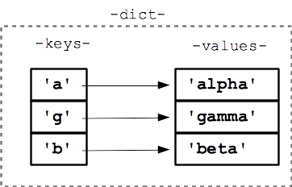

## 3.3. Diccionarios   

Los diccionarios son una estructura de datos que permite almacenar un conjunto de pares clave-valor. Cada clave es única y está asociada a un valor. Los diccionarios son una estructura de datos muy utilizada en Python y en otros lenguajes de programación. En este apartado vamos a ver cómo se crean y se utilizan los diccionarios en Python.

### 1. Introducción

La clase `dict` de Python es un tipo mapa que asocia claves a valores. A diferencia de los tipos secuenciales `list`, `tuple`, `range` o `str`, que son indexados por un índice numérico, los diccionarios son indexados por claves. Estas claves siempre deben ser de un tipo inmutable, concretamente un tipo *hashable*.

> 🎯 **NOTA:** Un objeto es *hashable* si tiene un valor de *hash* que no cambia durante todo su ciclo de vida. En principio, los objetos que son instancias de clases definidas por el usuario son *hashables*. También lo son la mayoría de tipos inmutables definidos por Python (`int`,`float` o `str`).

Piensa siempre en un diccionario como un contenedor de pares *clave*: *valor*, en el que la clave puede ser de cualquier tipo hashable y es única en el diccionario que la contiene. Generalmente, se suelen usar como claves los tipos `int` y `str` aunque, como se ha comentado, cualquier tipo *hashable* puede ser una clave.

> **Ten cuenta que no todo los objetos pueden ser clave, solo los hashables**

<figure markdown>
  
  <figcaption>Estructura de datos: Diccionario</figcaption>
</figure>


**Las principales operaciones** que se suelen realizar con diccionarios **son almacenar un valor asociado a una clave y recuperar un valor a partir de una clave**. Esta es la esencia de los diccionarios y es aquí donde son realmente importantes. **En un diccionario, el acceso a un elemento a partir de una clave es una operación realmente rápida, eficaz y que consume pocos recursos** si lo comparamos con cómo lo haríamos con otros tipos de datos.

Otras características a resaltar de los diccionarios:

* **Es un tipo mutable**: su contenido se puede modificar después de haber sido creado.
* **Es un tipo ordenado**: en el sentido de que preserva el orden en que se insertan los pares *clave: valor*.
* **Es un tipo dinámico**: no es necesario declarar el tamaño del diccionario antes de usarlo.
* **Es un tipo heterogéneo**: las claves y los valores pueden ser de cualquier tipo y mezclarse en un mismo diccionario.

### 2. Trabajar con diccionarios en Python
Los diccionarios en Python son un tipo de datos muy versátil y potente. Se pueden crear, modificar y eliminar elementos de un diccionario, así como acceder a sus elementos de distintas formas. A continuación, se describen las operaciones más comunes que se pueden realizar con diccionarios en Python.

#### 2.1. Cómo crear un diccionario

En Python hay varias formas de crear un diccionario. Las veremos todas a continuación.

La más simple es encerrar una secuencia de pares *clave: valor* separados por comas entre llaves `{}`

```Python
>>> d = {1: 'hola', 89: 'Pythonista', 'a': 'b', 'c': 27}
```

En el diccionario anterior, los enteros `1` y `89` y las cadenas `'a'` y `'c'` son las claves. Como ves, se pueden mezclar claves y valores de distinto tipo sin problema.

Para crear un **diccionario vacío**:     
* Asigna a una variable el valor `{}`.      
* Usar el constructor de la clase `dict()`, aunque este constructor se puede de varias maneras:         
    * **Sin parámetros** . Esto creará un diccionario vacío.     
    * Con pares *clave: valor* encerrados entre llaves.      
    * **Con argumentos con nombre**. El nombre del argumento será la clave en el diccionario. En este caso, las claves solo pueden ser identificadores válidos y mantienen el orden en el que se indican. No se podría, por ejemplo, tener números enteros como claves. Para utilizar los números enteros como claves, se debe usar otra forma de crear los diccionarios.      
   * **Pasando un iterable**. En este caso, cada elemento del iterable debe ser también un iterable con solo dos elementos. El primero se toma como clave del diccionario y el segundo como valor. Si la clave aparece varias veces, el valor que prevalece es el último.       

Veamos un ejemplo con todo lo anterior. Vamos a crear el mismo diccionario de todos los modos que te he explicado:

```Python
# 1. Pares clave: valor encerrados entre llaves
>>> d = {'uno': 1, 'dos': 2, 'tres': 3}
>>> d
{'uno': 1, 'dos': 2, 'tres': 3}

# 2. Argumentos con nombre
>>> d2 = dict(uno=1, dos=2, tres=3)
>>> d2
{'uno': 1, 'dos': 2, 'tres': 3}

# 3. Pares clave: valor encerrados entre llaves
>>> d3 = dict({'uno': 1, 'dos': 2, 'tres': 3})
>>> d3
{'uno': 1, 'dos': 2, 'tres': 3}

# 4. Iterable que contiene iterables con dos elementos
>>> d4 = dict([('uno', 1), ('dos', 2), ('tres', 3)])
>>> d4
{'uno': 1, 'dos': 2, 'tres': 3}

# 5. Diccionario vacío
>>> d5 = {}
>>> d5
{}

# 6. Diccionario vacío usando el constructor
>>> d6 = dict()
>>> d6
{}
```

#### 2.2. Cómo acceder a los elementos de un diccionario en Python

Acceder a un elemento de un diccionario es una de las principales operaciones por las que existe este tipo de dato. El acceso a un valor se realiza mediante indexación de la clave. Para ello, simplemente encierra entre corchetes la clave del elemento `d[clave]`. En caso de que la clave no exista, se lanzará la excepción `KeyError`.

```Python
>>> d = {'uno': 1, 'dos': 2, 'tres': 3}
>>> d['dos']
2
>>> d[4]
Traceback (most recent call last):
File "<input>", line 1, in <module>
KeyError: 4
> 
```

La clase `dict` también ofrece el método `get(clave [, valor por defecto])`. Este método devuelve el valor correspondiente a la clave `clave`. En caso de que la clave no exista **no lanza ningún error**, sino que devuelve el segundo argumento `valor por defecto`. Si no se proporciona este argumento, se devuelve el valor `None`.

```Python
>>> d = {'uno': 1, 'dos': 2, 'tres': 3}
>>> d.get('uno')
1

# Devuelve 4 como valor por defecto si no encuentra la clave
>>> d.get('cuatro', 4)
4

# Devuelve None como valor por defecto si no encuentra la clave
>>> a = d.get('cuatro')
>>> a
>>> type(a)
<class 'NoneType'>
```

#### 2.3. Añadir elementos a un diccionario en Python

Como hemos comentado, la clase `dict` es mutable, por lo que se pueden añadir, modificar y/o eliminar elementos después de haber creado un objeto de este tipo.

Para añadir un nuevo elemento a un diccionario existente, se usa el operador de asignación `=`. A la izquierda del operador aparece el objeto diccionario con la nueva clave entre corchetes `[]` y a la derecha el valor que se asocia a dicha clave.

```Python
>>> d = {'uno': 1, 'dos': 2}
>>> d
{'uno': 1, 'dos': 2}
# Añade un nuevo elemento al diccionario
>>> d['tres'] = 3
>>> d
{'uno': 1, 'dos': 2, 'tres': 3}
```

> 🎯 **NOTA:** Si la clave ya existe en el diccionario, se actualiza su valor.

También existe el método `setdefault(clave[, valor])`. Este método devuelve el valor de la clave si ya existe y, en caso contrario, le asigna el valor que se pasa como segundo argumento. Si no se especifica este segundo argumento, por defecto es `None`.

```Python
>>> d = {'uno': 1, 'dos': 2}
>>> d.setdefault('uno', 1.0)
1
>>> d.setdefault('tres', 3)
3
>>> d.setdefault('cuatro')
>>> d
{'uno': 1, 'dos': 2, 'tres': 3, 'cuatro': None}
```

#### 2.4. Modificar elementos de un diccionario

En el apartado anterior hemos visto que para actualizar el valor asociado a una clave, simplemente se asigna un nuevo valor a dicha clave del diccionario.

```Python
>>> d = {'uno': 1, 'dos': 2}
>>> d
{'uno': 1, 'dos': 2}
>>> d['uno'] = 1.0
>>> d
{'uno': 1.0, 'dos': 2}
```

#### 2.5. Eliminar un elemento de un diccionario en Python

En Python existen diversos modos de eliminar un elemento de un diccionario. Son los siguientes:

* `pop(clave [, valor por defecto])`: Si la `clave` está en el diccionario, elimina el elemento y devuelve su valor; si no, devuelve el `valor por defecto`. Si no se proporciona el `valor por defecto` y la `clave` no está en el diccionario, se lanza la excepción `KeyError`.
* `popitem()`: Elimina el último par *clave: valor* del diccionario y lo devuelve. Si el diccionario está vacío se lanza la excepción `KeyError`. (**NOTA:** En versiones anteriores a Python 3.7, se elimina/devuelve un par aleatorio, no se garantiza que sea el último).
* `del d[clave]`: Elimina el par *clave: valor*. Si no existe la clave, se lanza la excepción `KeyError`.
* `clear()`: Borra todos los pares *clave: valor* del diccionario.

```Python
>>> d = {'uno': 1, 'dos': 2, 'tres': 3, 'cuatro': 4, 'cinco': 5}

# Elimina un elemento con pop()
>>> d.pop('uno')
1
>>> d
{'dos': 2, 'tres': 3, 'cuatro': 4, 'cinco': 5}

# Trata de eliminar una clave con pop() que no existe
>>> d.pop(6)
Traceback (most recent call last):
File "<input>", line 1, in <module>
KeyError: 6

# Elimina un elemento con popitem()
>>> d.popitem()
('cinco', 5)
>>> d
{'dos': 2, 'tres': 3, 'cuatro': 4}

# Elimina un elemento con del
>>> del d['tres']
>>> d
{'dos': 2, 'cuatro': 4}

# Trata de eliminar una clave con del que no existe
>>> del d['seis']
Traceback (most recent call last):
File "<input>", line 1, in <module>
KeyError: 'seis'

# Borra todos los elementos del diccionario
>>> d.clear()
>>> d
{}
```
### 3. Patrones de uso de diccionarios en Python
Python es un lenguaje muy versátil y flexible que permite utilizar los diccionarios de muchas formas. A continuación, se describen algunos de los patrones de uso más comunes de los diccionarios en Python.

#### 3.1. Número de elementos (len) de un diccionario en Python

Al igual que sucede con otros tipos contenedores, se puede usar la función de Python `len()` para obtener el número de elementos de un diccionario.

```Python
>>> d = {'uno': 1, 'dos': 2, 'tres': 3}
>>> len(d)
3
```
#### 3.2. Recorrer un diccionario - for dict Python

Hay varias formas de recorrer los elementos de un diccionario: recorrer solo las claves, solo los valores o recorrer a la vez las claves y los valores. Puedes ver aquí [cómo usar el bucle for para recorrer un diccionario](https://j2logo.com/bucle-for-en-python/#for-diccionarios).

```Python
>>> d = {'uno': 1, 'dos': 2, 'tres': 3}
>>> for e in d:
...     print(e)
... 
uno
dos
tres

# Recorrer las claves del diccionario
>>> for k in d.keys():
...     print(k)
...   
uno
dos
tres

# Recorrer los valores del diccionario
>>> for v in d.values():
...     print(v)
...   
1
2
3

# Recorrer los pares clave valor
>>> for i in d.items():
...     print(i)
...   
('uno', 1)
('dos', 2)
('tres', 3)
```


#### 3.3. Comprobar si un elemento está en un diccionario en Python

Al operar con diccionarios, se puede usar el operador de pertenencia `in` para comprobar si una clave está contenida, o no, en un diccionario. Esto resulta útil, por ejemplo, para asegurarnos de que una clave existe antes de intentar eliminarla.

```Python
>>> print('uno' in d)
True
>>> print(1 in d)
False
>>> print(1 not in d)
True
# Intenta eliminar la clave 1 si existe
>>> if 1 in d:
...     del d[1]
...   
>>> d
{'uno': 1, 'dos': 2, 'tres': 3}
```

#### 3.4. Comparar si dos diccionarios son iguales

En Python se puede utilizar el operador de igualdad `==` para comparar si dos diccionarios son iguales.  **Dos diccionarios son iguales si contienen el mismo conjunto de pares *clave: valor*** , independientemente del orden que tengan.

Otro tipo de comparaciones entre diccionarios no están permitidas. Si se intenta, el intérprete lanzará la excepción `TypeError`.

```Python
>>> d1 = {'uno': 1, 'dos': 2}
>>> d2 = {'dos': 2, 'uno': 1}
>>> d3 = {'uno': 1}
>>> print(d1 == d2)
True
>>> print(d1 == d3)
False
>>> print(d1 > d2)
Traceback (most recent call last):
File "<input>", line 1, in <module>
TypeError: '>' not supported between instances of 'dict' and 'dict'
```

#### 3.5. Diccionarios anidados en Python

Un diccionario puede contener un valor de cualquier tipo, entre ellos, otro diccionario. Este hecho se conoce como diccionarios anidados.

Para acceder al valor de una de las claves de un diccionario interno, se usa el operador de indexación anidada `[clave1][clave2]...`

Veámoslo con un ejemplo:

```Python
>>> d = {'d1': {'k1': 1, 'k2': 2}, 'd2': {'k1': 3, 'k4': 4}}
>>> d['d1']['k1']
1
>>> d['d2']['k1']
3
>>> d['d2']['k4']
4
>>> d['d3']['k4']
Traceback (most recent call last):
File "<input>", line 1, in <module>
KeyError: 'd3'
```

#### 3.6. Obtener una lista con las claves de un diccionario

En ocasiones, es necesario tener almacenado en una lista las claves de un diccionario. Para ello, simplemente pasa el diccionario como argumento del constructor `list()`. Esto devolverá las claves del diccionario en una lista.

```Python
>>> d = {'uno': 1, 'dos': 2, 'tres': 3}
>>> list(d)
['uno', 'dos', 'tres']
```

#### 3.7. Objetos vista de un diccionario

La clase *dict* implementa tres métodos muy particulares, dado que devuelven un tipo de dato, *iterable*, conocido como *objetos vista*. Estos objetos ofrecen una vista de las claves y valores contenidos en el diccionario y si el diccionario se modifica, dichos objetos se actualizan al instante.

Los métodos son los siguientes:

* `keys()`: Devuelve una vista de las claves del diccionario.
* `values()`: Devuelve una vista de los valores del diccionario.
* `items()`: Devuelve una vista de pares *(clave, valor)* del diccionario.

```Python
>>> d = {'uno': 1, 'dos': 2, 'tres': 3}
# d.keys() es diferente a list(d), aunque ambos
# contengan las claves del diccionario
# d.keys() es de tipo dict_keys y list(d) es de tipo list
>>> v = d.keys()
>>> type(v)
<class 'dict_keys'>
>>> v
dict_keys(['uno', 'dos', 'tres'])

>>> l = list(d)
>>> type(l)
<class 'list'>
>>> l
['uno', 'dos', 'tres']

>>> v = d.values()
>>> type(v)
<class 'dict_values'>
>>> v
dict_values([1, 2, 3])

>>> v = d.items()
>>> type(v)
<class 'dict_items'>
>>> v
dict_items([('uno', 1), ('dos', 2), ('tres', 3)])
```

### 4. Listado de métodos de la clase dict

Finalmente, enumeramos 0el listado de los principales métodos de la clase *dict*. Algunos de ellos ya los hemos visto durante la unidad:


| Método                      | Descripción                                                                                                                                                                                                                                    |
| ------------------------------ | ------------------------------------------------------------------------------------------------------------------------------------------------------------------------------------------------------------------------------------------------- |
| `clear()`                    | Elimina todos los elementos del diccionario.                                                                                                                                                                                                    |
| `copy()`                     | Devuelve una copia poco profunda del diccionario.                                                                                                                                                                                               |
| `get(clave[, valor])`        | Devuelve el valor de la`clave`. Si no existe, devuelve el valor `valor` si se indica y si no, `None`.                                                                                                                                           |
| `items()`                    | Devuelve una vista de los pares*clave: valor* del diccionario.                                                                                                                                                                                  |
| `keys()`                     | Devuelve una vista de las claves del diccionario.                                                                                                                                                                                               |
| `pop(clave[, valor])`        | Devuelve el valor del elemento cuya clave es`clave` y elimina el elemento del diccionario. Si la clave no se encuentra, devuelve `valor` si se proporciona. Si la clave no se encuentra y no se indica `valor`, lanza la excepción `KeyError`. |
| `popitem()`                  | Devuelve un par*(clave, valor)* aleatorio del diccionario. Si el diccionario está vacío, lanza la excepción`KeyError`.                                                                                                                       |
| `setdefault(clave[, valor])` | Si la`clave` está en el diccionario, devuelve su valor. Si no lo está, inserta la `clave` con el valor `valor` y lo devuelve (si no se especifica `valor`, por defecto es `None`).                                                            |
| `update(iterable)`           | Actualiza el diccionario con los pares*clave: valor* del `iterable`.                                                                                                                                                                            |
| `values()`                   | Devuelve una vista de los valores del diccionario.                                                                                                                                                                                              |


### 5. Depuración

Conforme trabajes con conjuntos de datos más grandes puede ser complicado depurar imprimiendo y revisando los datos a mano. Aquí hay algunas sugerencias para depurar grandes conjuntos de datos:

* Reducir la entrada: Si es posible, trata de reducir el tamaño del conjunto de datos. Por ejemplo, si el programa lee un archivo de texto, comienza solamente con las primeras 10 líneas, o con el ejemplo más pequeño que puedas encontrar. Puedes ya sea editar los archivos directamente, o (mejor) modificar el programa para que solamente lea las primeras `n` número de líneas.

   Si hay un error, puedes reducir `n` al valor más pequeño que produce el error, y después incrementarlo gradualmente conforme vayas encontrando y corrigiendo errores.

* Revisar extractos y tipos: En lugar de imprimir y revisar el conjunto de datos completo, considera imprimir extractos de los datos: por ejemplo, el número de elementos en un diccionario o el total de una lista de números.
  
  Una causa común de errores en tiempo de ejecución es un valor que no es el tipo correcto. Para depurar este tipo de error, generalmente es suficiente con imprimir el tipo de un valor.

* Escribe auto-verificaciones: Algunas veces puedes escribir código para revisar errores automáticamente. Por ejemplo, si estás calculando el promedio de una lista de números, podrías verificar que el resultado no sea más grande que el elemento más grande de la lista o que sea menor que el elemento más pequeño de la lista. Esto es llamado “prueba de sanidad” porque detecta resultados que son “completamente ilógicos”.

  Otro tipo de prueba compara los resultados de dos diferentes cálculos para ver si son consistentes. Esto es conocido como “prueba de consistencia”.

Imprimir una salida ordenada: Dar un formato a los mensajes de depuración puede facilitar encontrar un error. 

De nuevo, el tiempo que inviertas haciendo una buena estructura puede reducir el tiempo que inviertas en depurar.


## Fuente
* [Pagina de Juan Jose Lozano Gomez sobre Python](https://j2logo.com/)
* [Estructuras de datos](https://blog.soyhenry.com/que-es-una-estructura-de-datos-en-programacion/)
* [Python para todos](https://es.py4e.com/)
* [Dicionarios y Hash](https://jarroba.com/resumibles-hashables-en-python/)
* [Aprende con Alf](https://aprendeconalf.es/)

  
