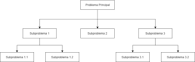
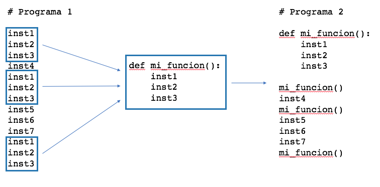
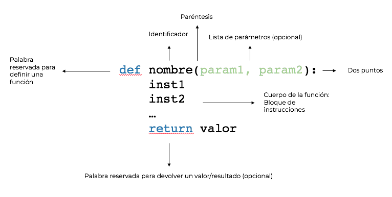

## 3.5. Modularizar un programa.

La modularización de un programa es una técnica de programación que consiste en dividir un programa en partes más pequeñas y manejables. Cada una de estas partes se denomina módulo y se encarga de realizar una tarea específica. La modularización de un programa tiene varias ventajas:    

- Facilita la comprensión del programa.     
- Facilita la depuración del programa.    
- Facilita la reutilización del código.   
- Facilita la colaboración entre programadores.    
- Facilita la realización de pruebas unitarias y otro tipo.    

Las funciones son una de las herramientas que nos permiten modularizar un programa.


### 1. Modularizar un programa con funciones

Diseñar un programa desde cero y dividirlo en funciones requiere estrategias claras. Aquí tienes una guía práctica para planificar y dividir un programa en funciones desde el principio

#### 1.1. Comprende el problema
Antes de escribir código, asegúrate de entender completamente el problema que estás resolviendo.

- **Lee** el enunciado del problema con atención.   
- **Identifica** lo que el programa debe hacer: entradas, salidas y pasos intermedios.    
- **Haz preguntas** si algo no está claro.    

**Ejemplo:**
Diseña un programa que gestione una lista de tareas pendientes. El usuario debe poder:    

1. Añadir tareas.    
2. Ver todas las tareas.   
3. Marcar tareas como completadas.    

**Preguntas clave**:    

- ¿Cómo se almacenarán las tareas?    
- ¿Se debe guardar esta lista entre ejecuciones?    
- ¿Qué ocurre si el usuario intenta completar una tarea que no existe?    

#### 1.2. Divide el problema en partes (Divide y vencerás)
Divide el problema principal en subtareas o pasos más pequeños. Cada subtarea puede convertirse en una función.

**Ejemplo:**    
Para el problema de la lista de tareas, las subtareas podrían ser:     

1. Mostrar un menú con opciones.    
2. Añadir una tarea a la lista.   
3. Mostrar la lista de tareas.   
4. Marcar una tarea como completada.    


#### 1.3. Define la estructura del programa
Crea un esquema básico que describa qué hace cada parte del programa. Este esquema es como un "borrador" del programa.

**Ejemplo:**
```plaintext
1. Mostrar el menú de opciones.
2. Según la opción elegida:
   a. Añadir una tarea.
   b. Mostrar todas las tareas.
   c. Marcar una tarea como completada.
   d. Salir del programa.
```

#### 1.4. Escribe pseudocódigo
El pseudocódigo te ayuda a planificar sin preocuparte por los detalles de la sintaxis.

**Ejemplo:**
```plaintext
Mientras el programa no haya terminado:
    Mostrar menú
    Leer opción del usuario
    Si la opción es "Añadir tarea":
        Pedir la descripción de la tarea
        Añadir tarea a la lista
    Si la opción es "Ver tareas":
        Mostrar todas las tareas
    Si la opción es "Completar tarea":
        Pedir número de la tarea
        Marcar tarea como completada
    Si la opción es "Salir":
        Terminar el programa
```


#### 1.5. Identifica las funciones necesarias

Para cada paso del pseudocódigo, identifica qué funciones serán necesarias. Pregúntate:    

- **¿Qué tareas son independientes?**      
- **¿Qué código se repite?**    
- **¿Puedo separar la entrada, procesamiento y salida?**    
- **¿Cada función tiene una responsabilidad clara?**    

Y para cada funcion:    

- **¿Qué tarea realiza esta función?**       
- **¿Qué datos necesita esta función?** (parámetros)        
- **¿Qué devuelve esta función?** (resultado)      

**Ejemplo:**
Funciones necesarias inicialmente:

1. `mostrar_menu()`: Muestra el menú de opciones al usuario.    
2. `opcion_añadir_tarea(lista_tareas)`: Añade una tarea a la lista.   
3. `opcion_mostrar_tareas(lista_tareas)`: Muestra todas las tareas.    
4. `opcion_completar_tarea(lista_tareas)`: Marca una tarea como completada.   

En un análisis posterior puedes analizar que hace cada función para separar las funciones que interactuan con el usuario de las que realizan operaciones sobre los datos.

Funciones auxilares de entrada y salida, interactúan con el usuario.    

1. `mostrar_menu`    
2. `pedir_opcion`    
3. `pedir_descripcion`    
4. `pedir_indice`    
5. `mostrar_tareas`     
6. `mostrar_mensaje`     

Funciones que realizan operaciones sobre los datos.    

1. `añadir_tarea`    
2. `eliminar_tarea`     
3. `completar_tarea`    
4. `listar_tareas`    

Es posible que tengas que realizar varias iteraciones para identificar todas las funciones necesarias.

#### 1.6. Esquema de funciones
Organiza las funciones según su propósito:    

1. **Funciones principales**: Coordinan el flujo general del programa.     
2. **Funciones auxiliares**: Realizan tareas específicas dentro de las funciones principales.     

**Ejemplo:**     

1. Las funciones opcion_añadir_tarea, opcion_mostrar_tareas, opcion_completar_tarea y opcion_mostrar_tareas son funciones principales, guía el flujo del programa.    
2. Las funciones añadir_tarea, eliminar_tarea, completar_tarea y listar_tareas son funciones auxiliares, son funciones auxiliares que realizan operaciones específicas sobre los datos.     
3. Las funciones mostrar_menu, pedir_opcion, pedir_descripcion, pedir_indice, mostrar_tareas y mostrar_mensaje son funciones auxilares de entrada y salida, interactúan con el usuario.     


#### 1.7. Implementa una función a la vez
Empieza escribiendo las funciones más simples y ve construyendo desde ahí. Esto ayuda a evitar errores grandes y facilita las pruebas.


#### 1.8. Ejemplo completo: Lista de tareas

**Estructura básica**    

1. **Operaciones sobre la estructura de datos**: Funciones que trabajan exclusivamente con los datos (añadir, eliminar, cambiar el estado de una tarea, etc.).     
2. **Entrada y salida**: Funciones que se encargan de interactuar con el usuario (mostrar menús, recibir entradas y mostrar resultados).     
3. **Controlador**: Coordina las operaciones entre la E/S y las funciones que manipulan los datos.    

**Código estructurado**

```python
# --- Operaciones sobre la estructura de datos ---
def añadir_tarea(lista_tareas, descripcion):
    """
    Añade una tarea a la lista de tareas.
    """
    lista_tareas.append({"tarea": descripcion, "completada": False})

def eliminar_tarea(lista_tareas, indice):
    """
    Elimina una tarea de la lista por su índice.
    """
    if 0 <= indice < len(lista_tareas):
        lista_tareas.pop(indice)
        return True
    return False

def completar_tarea(lista_tareas, indice):
    """
    Cambia el estado de una tarea a 'completada'.
    """
    if 0 <= indice < len(lista_tareas):
        lista_tareas[indice]["completada"] = True
        return True
    return False

def listar_tareas(lista_tareas):
    """
    Devuelve una lista formateada de las tareas con su estado.
    """
    return [
        f"{i + 1}. {tarea['tarea']} [{'Completada' if tarea['completada'] else 'Pendiente'}]"
        for i, tarea in enumerate(lista_tareas)
    ]

# --- Funciones de entrada y salida ---
def mostrar_menu():
    """
    Muestra el menú de opciones al usuario.
    """
    print("\nOpciones:")
    print("1. Añadir tarea")
    print("2. Ver tareas")
    print("3. Completar tarea")
    print("4. Eliminar tarea")
    print("5. Salir")

def pedir_opcion():
    """
    Solicita al usuario una opción del menú.
    """
    try:
        return int(input("Elige una opción: "))
    except ValueError:
        return -1

def pedir_descripcion():
    """
    Solicita al usuario una descripción para una nueva tarea.
    """
    return input("Escribe la nueva tarea: ")

def pedir_indice():
    """
    Solicita al usuario el índice de una tarea.
    """
    try:
        return int(input("Introduce el número de la tarea: ")) - 1
    except ValueError:
        return -1

def mostrar_tareas(lista_tareas):
    """
    Muestra la lista de tareas en la consola.
    """
    print("\nLista de tareas:")
    if not lista_tareas:
        print("No hay tareas pendientes.")
    else:
        for tarea in listar_tareas(lista_tareas):
            print(tarea)

def mostrar_mensaje(mensaje):
    """
    Muestra un mensaje al usuario.
    """
    print(mensaje)

def opcion_añadir_tarea(lista_tareas):
    """
    Solicita una descripción y añade una tarea a la lista.
    """
    descripcion = pedir_descripcion()
    añadir_tarea(lista_tareas, descripcion)
    mostrar_mensaje("Tarea añadida con éxito.")

    
def opcion_completar_tarea(lista_tareas):
    """
    Solicita un índice y marca una tarea como completada.
    """
    mostrar_tareas(lista_tareas)
    indice = pedir_indice()
    if completar_tarea(lista_tareas, indice):
      mostrar_mensaje("Tarea completada con éxito.")
    else:
      mostrar_mensaje("Índice inválido. Inténtalo de nuevo.")

def opcion_mostrar_tareas(lista_tareas):
    """
    Muestra la lista de tareas.
    """
    mostrar_tareas(lista_tareas)
        
        
        
def opcion_eliminar_tarea(lista_tareas):
    """
    Solicita un índice y elimina una tarea de la lista.
    """
    mostrar_tareas(lista_tareas)
    indice = pedir_indice()
    if eliminar_tarea(lista_tareas, indice):
      mostrar_mensaje("Tarea eliminada con éxito.")
    else:
      mostrar_mensaje("Índice inválido. Inténtalo de nuevo.")

        
# --- Controlador principal ---
def programa_principal():
    """
    Función principal que coordina el flujo del programa.
    """
    lista_tareas = []
    while True:
        mostrar_menu()
        opcion = pedir_opcion()

        if opcion == 1:  # Añadir tarea
            opcion_añadir_tarea(lista_tareas)          
        
        elif opcion == 2:  # Ver tareas
            opcion_mostrar_tareas(lista_tareas)

        elif opcion == 3:  # Completar tarea
            opcion_completar_tarea(lista_tareas)

        elif opcion == 4:  # Eliminar tarea
            opcion_eliminar_tarea(lista_tareas)

        elif opcion == 5:  # Salir
            mostrar_mensaje("Saliendo del programa. ¡Adiós!")

        else:
            mostrar_mensaje("Opción no válida. Inténtalo de nuevo.")

# --- Ejecutar el programa ---
programa_principal()
```


##### 1.8.1. Puntos clave de la solución

1. **Separación de responsabilidades**:    

    - **Operaciones sobre datos**: Son funciones puras que no dependen de la interacción con el usuario. Ejemplo: `añadir_tarea`, `eliminar_tarea`, `completar_tarea`.    
    - **Entrada y salida**: Se encargan exclusivamente de interactuar con el usuario. Ejemplo: `mostrar_menu`, `mostrar_tareas`, `pedir_opcion`.
    - **Controlador principal**: Coordina la lógica del programa conectando la E/S con las operaciones sobre los datos: `opción_añadir_tarea`, `opción_mostrar_tareas`, `opción_completar_tarea`, `opción_eliminar_tarea`.

2. **Reutilización de código**:    

    - Las funciones de entrada y salida pueden usarse en otros contextos. Por ejemplo, `opción_mostrar_tareas` podría conectarse a una interfaz gráfica en lugar de imprimir en consola.

3. **Facilidad para pruebas**:    

    - Las operaciones sobre datos son independientes de la E/S, lo que facilita probarlas unitariamente.    


#### 1.9. Estrategias adicionales

##### 1.9.1. Usa diagramas de flujo
Dibujar un diagrama de flujo puede ayudarte a visualizar cómo fluye el programa entre las funciones.

##### 1.9.2. Empieza simple
Crea primero una versión básica del programa. Luego, añade funciones y complejidad de manera incremental.

##### 1.9.3. De arriba a abajo: top-down
Empieza por la función principal y luego desglosa en funciones más pequeñas. Esto te ayuda a mantener el enfoque en el objetivo principal del programa. 




##### 1.9.4. De abajo a arriba: bottom-up
Si tienes problemas para dividir el programa en funciones, empieza por las funciones más pequeñas y luego agrúpalas en funciones más grandes. 


##### 1.9.5. Piensa en términos de "entrada-proceso-salida"
Para cada función:
- **Entrada**: ¿Qué datos necesita?
- **Proceso**: ¿Qué hace con esos datos?
- **Salida**: ¿Qué resultado produce?


### 2. Funciones

Las funciones en cualquier lenguaje de programación, son estructuras esenciales de código. Una función es un grupo de instrucciones que constituyen una unidad lógica del programa y resuelven un problema muy concreto.

#### 2.1. Qué son las funciones en Python

Las funciones en Python constituyen unidades lógicas de un programa y tienen un doble objetivo:

* Dividir y organizar el código en partes más sencillas.
* Encapsular el código que se repite a lo largo de un programa para ser reutilizado.

Python ya define de serie un conjunto de funciones que podemos utilizar directamente en nuestras aplicaciones. Algunas de ellas ya las has utilizado. Por ejemplo, la función `len()`, que obtiene el número de elementos de un objeto contenedor como una lista, una tupla, un diccionario o un conjunto. También hemos visto la función `print()`, que muestra por consola un texto.

Puedes encontrar una lista de funciones predefinidas en Python [aquí](https://docs.python.org/es/3/library/functions.html)

Sin embargo, tú como programador, puedes definir tus propias funciones para estructurar el código de manera que sea más legible y para reutilizar aquellas partes que se repiten a lo largo de una aplicación. Esto es una tarea fundamental a medida que va creciendo el número de líneas de un programa.

La idea la puedes observar en la siguiente imagen:


En principio, un programa es una secuencia ordenada de instrucciones que se ejecutan una a continuación de la otra. Sin embargo, cuando se utilizan funciones, puedes agrupar parte de esas instrucciones como una unidad más pequeña que ejecuta dichas instrucciones y suele devolver un resultado.

En el siguiente apartado te muestro cómo definir una función en Python.

#### 2.2. Cómo definir una función en Python

La siguiente imagen muestra el esquema de una función en Python:



Para definir una función en Python:

* Se utiliza la palabra reservada `def`.
* A continuación viene el nombre o identificador de la función que es el que se utiliza para invocarla.
* Después del nombre hay que incluir los paréntesis y una lista opcional de parámetros.
* Por último, la cabecera o definición de la función termina con dos puntos.

Tras los dos puntos se incluye el cuerpo de la función (con un sangrado mayor, generalmente cuatro espacios) que no es más que el conjunto de instrucciones que se encapsulan en dicha función y que le dan significado.

En último lugar y de manera opcional, se añade la instrucción con la palabra reservada `return` para devolver un resultado.

> ❗**NOTA:** Cuando la primera instrucción de una función es un `string` encerrado entre tres comillas simples `'''` o dobles `"""`, a dicha instrucción se le conoce como `docstring`. El `docstring` es una cadena que se utiliza para documentar la función, es decir, indicar qué hace dicha función.

#### 2.3. Cómo usar o llamar a una función

Para usar o invocar a una función, simplemente hay que escribir su nombre como si de una instrucción más se tratara. Eso sí, pasando los argumentos necesarios según los parámetros que defina la función.

Veámoslo con un ejemplo. Vamos a crear una función que muestra por pantalla el resultado de multiplicar un número por cinco:

```Python
def multiplica_por_5(numero):
    print(f'{numero} * 5 = {numero * 5}')


print('Comienzo del programa')
multiplica_por_5(7)
print('Siguiente')
multiplica_por_5(113)
print('Fin')
```

La función `multiplica_por_5()` define un parámetro llamado numero que es el que se utiliza para multiplicar por 5. El resultado del programa anterior sería el siguiente:

```Python
Comienzo del programa
7 * 5 = 35
Siguiente
113 * 5 = 565
Fin
```

Como puedes observar, el programa comienza su ejecución en la *línea 4* y va ejecutando las instrucciones una a una de manera ordenada. Cuando se encuentra el nombre de la función `multiplica_por_5()`, el flujo de ejecución pasa a la primera instrucción de la función. Cuando se llega a la última instrucción de la función, el flujo del programa sigue por la instrucción que hay a continuación de la llamada de la función.

> ❗**IMPORTANTE:** Diferencia entre ***parámetro*** y  ***argumento*** . La función `multiplica_por_5()` define un *parámetro* llamado `numero`. Sin embargo, cuando desde el código se invoca a la función, por ejemplo, `multiplica_por_5(7)`, se dice que se llama a multiplica por cinco con el *argumento* `7`.

#### 2.4. Sentencia return

Se indicaba anteriormente que cuando acaba la última instrucción de una función, el flujo del programa continúa por la instrucción que sigue a la llamada de dicha función. Hay una excepción: usar la sentencia `return`. `return` hace que termine la ejecución de la función cuando aparece y el programa continúa por su flujo normal.

Además, `return` se puede utilizar para devolver un valor.

La sentencia `return` es opcional, puede devolver, o no, un valor y es posible que aparezca más de una vez dentro de una misma función.

A continuación hay varios ejemplos:

##### 2.4.1. return que no devuelve ningún valor

La siguiente función muestra por pantalla el cuadrado de un número solo si este es par:

```Python
>>> def cuadrado_de_par(numero):
...     if not numero % 2 == 0:
...         return
...     else:
...         print(numero ** 2)
...
>>> cuadrado_de_par(8)
64
>>> cuadrado_de_par(3)
```

##### 2.4.2. En Python una función siempre devuelve un valor

Python, a diferencia de otros lenguajes de programación, no tiene procedimientos. Un procedimiento sería como una función pero que no devuelve ningún valor.

¿Por qué no tiene procedimientos si hemos vistos ejemplos de funciones que no retornan ningún valor? Porque Python, internamente, devuelve por defecto el valor `None` cuando en una función no aparece la sentencia `return` o esta no devuelve nada.

```Python
>>> def saludo(nombre):
...     print(f'Hola {nombre}')
...
>>> print(saludo('j2logo'))
Hola j2logo
None
```

Como puedes ver en el ejemplo anterior, el `print` que envuelve a la función `saludo()` muestra `None`.

##### 2.4.3. Varios return en una misma función

La función es_par() devuelve True si un número es par y False en caso contrario:

```Python
>>> def es_par(numero):
...     if numero % 2 == 0:
...         return True
...     else:
...         return False
...
>>> es_par(2)
True
>>> es_par(5)
False
```

##### 2.4.4. Devolver más de un valor con return en Python

En Python, es posible devolver más de un valor con una sola sentencia `return`. Por defecto, con `return` se puede devolver una tupla de valores. Un ejemplo sería la siguiente función `cuadrado_y_cubo()` que devuelve el cuadrado y el cubo de un número:

```Python
>>> def cuadrado_y_cubo(numero):
...     return numero ** 2, numero ** 3
...
>>> cuad, cubo = cuadrado_y_cubo(4)
>>> cuad
16
>>> cubo
64
```

Sin embargo, se puede usar otra técnica devolviendo los diferentes resultados/valores en una lista. Por ejemplo, la función `tabla_del()` que se muestra a continuación hace esto:

```Python
>>> def tabla_del(numero):
...     resultados = []
...     for i in range(11):
...         resultados.append(numero * i)
...     return resultados
...
>>> res = tabla_del(3)
>>> res
[0, 3, 6, 9, 12, 15, 18, 21, 24, 27, 30]
```


#### 2.5. Parámetros de las funciones en Python

Una función puede definir, opcionalmente, una secuencia de parámetros con los que invocarla. ¿Cómo se asignan en Python los valores a los parámetros? ¿Se puede modificar el valor de una variable dentro de una función?

Antes de contestar a estas dos preguntas, tenemos que conocer los conceptos de programación *paso por valor* y  *paso por referencia*:    

* **Paso por valor:** Un lenguaje de programación que utiliza paso por valor de los argumentos, lo que realmente hace es copiar el valor de las variables en los respectivos parámetros. Cualquier modificación del valor del parámetro, no afecta a la variable externa correspondiente.     
* **Paso por referencia:** Un lenguaje de programación que utiliza paso por referencia, lo que realmente hace es copiar en los parámetros la dirección de memoria de las variables que se usan como argumento. Esto implica que realmente hagan referencia al mismo objeto/elemento y cualquier modificación del valor en el parámetro afectará a la variable externa correspondiente.     

Muchos lenguajes de programación usan a la vez paso por valor y por referencia en función del tipo de la variable. Por ejemplo, paso por valor para los tipos simples: entero, float, … y paso por referencia para los objetos.

Sin embargo, en Python todo es un objeto. Entonces, ¿cómo se pasan los argumentos en Python, por valor o por referencia? Lo que ocurre en Python realmente es que se pasa por valor la referencia del objeto  ¿Qué implicaciones tiene esto? Básicamente que si el tipo que se pasa como argumento es inmutable, cualquier modificación en el valor del parámetro no afectará a la variable externa pero, si es mutable (como una lista o diccionario), sí se verá afectado por las
modificaciones. **Así que, ¡¡¡cuidado!!!**

Una vez aclarado este tema, a continuación encontrarás unos tutoriales muy, muy interesantes para que sigas profundizando sobre los tipos de parámetros en Python:

* [Tipos de parámetros](https://j2logo.com/tipo-parametros-funcion-python/)
* [*args y **kwargs. Número de parámetros indefinido](https://j2logo.com/args-y-kwargs-en-python/)

Aquí tienes un resumen:

##### 2.5.1.  *args y **kwargs en Python

En Python, `*args` y `**kwargs` permiten que una función acepte un número variable de argumentos, lo que proporciona
flexibilidad en la cantidad y tipo de argumentos que se pueden pasar.

###### Uso de *args

`*args` permite pasar una lista de argumentos de longitud variable sin palabras clave. Por ejemplo:

```python
def sumar(*args):
    return sum(args)  # sum es una función incorporada de Python


print(sumar(3, 5, 10, 15))  # Imprime 33
```

###### Uso de **kwargs

`**kwargs` permite pasar un diccionario de longitud variable de argumentos con palabras clave. Por ejemplo:

```python
def describir_persona(**kwargs):
    for clave, valor in kwargs.items():
        print(f"{clave}: {valor}")


describir_persona(nombre="John", edad=25, ciudad="Nueva York")  
```

###### Ejemplos de Funciones con *args y **kwargs

**Ejemplo de *args para sumar números**

```python
def sum(*args):
    value = 0
    for n in args:
        value += n
    return value
```

**Ejemplo de **kwargs para filtrar datos**

```python
def filtrar(**kwargs):
    condiciones = " AND ".join([f"{k}='{v}'" for k, v in kwargs.items()])
    return f"SELECT * FROM clientes WHERE {condiciones};"
```

###### El Orden Importa

Cuando se usan juntos, `*args` y `**kwargs` deben usarse en ese orden específico en la definición de la función.

```python
def ejemplo(arg1, arg2, *args, **kwargs):
    pass
```

###### *args y **kwargs como Argumentos

También puedes desempaquetar argumentos en la llamada a una función:

**Usando *args para Desempaquetar una Lista o Tupla**

```python
def resultado(x, y, op):
    if op == '+':
        return x + y
    elif op == '-':
        return x - y


a = (1, 2, '+')
print(resultado(*a))  # Imprime 3
```

**Usando **kwargs para Desempaquetar un Diccionario**

```python
a = {"op": "+", "x": 2, "y": 5}
print(resultado(**a))  # Imprime 7
```

###### Resumiendo

- Usa `*args` cuando quieras pasar un número indefinido de argumentos no clave a una función.
- Usa `**kwargs` cuando quieras pasar un número indefinido de argumentos clave a una función.
- `*args` recoge los argumentos adicionales en una tupla.
- `**kwargs` recoge los argumentos clave adicionales en un diccionario.
- Asegúrate de que `*args` y `**kwargs` se usan al final y en ese orden cuando se combinan en la definición de la
  función.

##### 2.5.2. Parametros opcionales

En Python, es posible definir parámetros opcionales en una función, los cuales tienen valores predeterminados y toman esos valores si no se les pasa ningún valor específico al invocar la función. Esto permite que una función sea más flexible en su uso.

Ejemplo de una función con parámetros opcionales:

```python
def saludo(nombre, mensaje="encantado de saludarte"):
    print("Hola {}, {}".format(nombre, mensaje))
```

En este ejemplo, el parámetro `nombre` es obligatorio, mientras que el parámetro `mensaje` es opcional y tiene un valor predeterminado de "encantado de saludarte". Si no se proporciona un valor para `mensaje`, se utilizará el valor por defecto.

También es importante tener en cuenta que una vez que se define un parámetro opcional, todos los parámetros a su derecha también deben ser opcionales. Esto significa que los parámetros obligatorios no pueden seguir a los parámetros opcionales en la definición de la función.

Por ejemplo, la siguiente definición de función sería incorrecta:

```python
def saludo(mensaje="encantado de saludarte", nombre):
    # Código de la función
```

Este código generaría un error de sintaxis porque un parámetro obligatorio (`nombre`) sigue a un parámetro opcional (`mensaje`) en la definición de la función, lo cual no está permitido en Python.

Por tanto, los parámetros opcionales son útiles para proporcionar valores predeterminados en una función y permiten que esta sea más versátil al manejar diferentes situaciones de llamada.

#### 2.6. Ámbito y ciclo de vida de las variables

En cualquier lenguaje de programación de alto nivel, toda variable está definida dentro de un  ***ámbito*** . Esto es, los sitios en los que la variable tiene sentido y dónde se puede utilizar.

Los parámetros y variables definidos dentro de una función tienen un ámbito *local*, local a la propia función. Por tanto, estos parámetros y variables no pueden ser utilizados fuera de la función porque no serían reconocidos.

El *ciclo de vida* de una variable determina el tiempo en que una variable permanece en memoria. Una variable dentro de una función existe en memoria durante el tiempo en que está ejecutándose dicha función. Una vez que termina su ejecución, sus variables y parámetros desaparecen de memoria y, por tanto, no pueden ser referenciados.

```Python
>>> def saludo(nombre):
...     x = 10
...     print(f'Hola {nombre}')
...
>>> saludo('Alumno')
Hola Alumno
>>> print(x)
Traceback (most recent call last):
  File "<input>", line 1, in <module>
NameError: name 'x' is not defined
```

Como ves, en el ejemplo anterior, al tratar de mostrar por pantalla el valor de la variable `x`, el intérprete mostrará un error.

El siguiente ejemplo es diferente:

```Python
>>> def muestra_x():
...     x = 10
...     print(f'x vale {x}')
...
>>> x = 20
>>> muestra_x()
x vale 10
>>> print(x)
20
```

Lo que sucede en este ejemplo es que dentro de la función `muestra_x()` se está creando una nueva variable `x` que, precisamente, tiene el mismo nombre que la variable definida fuera de la función. Por tanto, `x` dentro de la función tiene el valor `10`, pero una vez que la función termina, `x` hace referencia a la variable definida fuera, cuyo valor es `20`.

Las variables definidas fuera de una función tienen un ámbito conocido como *global* y son visibles dentro de las funciones, dónde solo se puede **consultar** su valor.

```Python
>>> y = 20
>>> def muestra_x():
...     x = 10
...     print(f'x vale {x}')
...     print(f'y vale {y}')
...
>>> muestra_x()
x vale 10
y vale 20
```

Para modificar dentro de una función una variable definida fuera de la misma, hay que usar la palabra reservada `global` para declarar la variable dentro de la función.

```Python
>>> y = 20
>>> x = 3
>>> def muestra_x():
...     global x
...     x += 1
...     print(f'x vale {x}')
...     print(f'y vale {y}')
...
>>> muestra_x()
x vale 4
y vale 20
```

## Fuente

* [Página de Juan Jose Lozano Gomez sobre Python](https://j2logo.com/)
* [Estructuras de datos](https://blog.soyhenry.com/que-es-una-estructura-de-datos-en-programacion/)
* [Python para todos](https://es.py4e.com/)
* [Aprende con Alf](ttps://aprendeconalf.es)
* [Tipos mutables e inmutables](https://jarroba.com/mutables-e-inmutables/)
