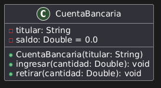
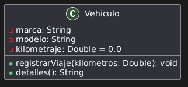
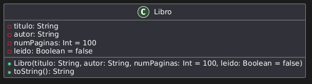
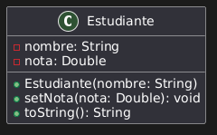
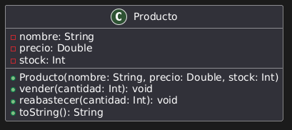

# Ejercicios de introducción a la programación orientada a objetos   

## Ejercicio 1: Clase Cuenta Bancaria.

Crea una clase CuentaBancaria con las propiedades:
   - titular (de tipo String).
   - saldo (de tipo Double).

La clase debe tener:
   1. Un constructor que inicialice el titular con el saldo en 0 por defecto.
   2. Métodos para:
   - Ingresar dinero (ingresar).
   - Retirar dinero (retirar). Este método debe lanzar una excepción si se intenta retirar más dinero del que hay en la cuenta.

A tener en cuenta:
   1. El saldo no podrá ser modificado directamente desde fuera de la clase. Solo será posible su cambio mediante los métodos ingresar y retirar.
   2. Los métodos ingresar y retirar debe mostrar un mensaje con el saldo final después de la operación.
   3. No será posible retirar más dinero del saldo actual, ni ingresar cantidades negativas o 0. Deberá generar una excepción si ocurre esta situación.

En el programa principal:
   - Crea una cuenta bancaria con un titular.
   - Realiza un ingreso de 100.0 y un retiro de 50.0.
   - Intenta realizar un retiro que supere el saldo y captura la excepción.

### Diseño:
Aquí tienes el diagrama UML para la clase **CuentaBancaria** que implementa las especificaciones del ejercicio:     

#### Contenido del Diagrama:     
1. **Clase**: `CuentaBancaria`     
   - **Atributos**:     
      - `titular: String`: El nombre del titular.     
      - `saldo: Double = 0.0`: El saldo de la cuenta, inicializado a 0.     
   - **Métodos**:     
      - `CuentaBancaria(titular: String)`: Constructor que inicializa la cuenta con un titular y saldo en 0.     
      - `ingresar(cantidad: Double): void`: Método para ingresar dinero.     
      - `retirar(cantidad: Double): void`: Método para retirar dinero.     

#### Características del diseño:     
- Los atributos son privados (`-`) para asegurar el encapsulamiento.     
- Los métodos públicos (`+`) controlan las operaciones sobre el saldo.     

## Ejercicio 2: Clase Vehículo

Crea una clase Vehiculo con las propiedades:
   - marca.
   - modelo.
   - kilometraje.

La clase debe tener:
   1. Métodos para registrar un viaje que aumente el kilometraje.
   2. Un método detalles que devuelva una descripción del vehículo o modificar el método toString.

En el programa principal:
   - Crea un vehículo, registra un viaje de 100 km y muestra sus detalles.

### Diseño:     
Aquí tienes el diagrama UML para la clase **Vehículo** que implementa las especificaciones del ejercicio:     

#### Contenido del Diagrama:     
1. **Clase**: `Vehiculo`     
   - **Atributos**:     
      - `marca: String`: Marca del vehículo.     
      - `modelo: String`: Modelo del vehículo.     
      - `kilometraje: Double = 0.0`: Kilometraje inicializado a 0.     
   - **Métodos**:     
      - `registrarViaje(kilometros: Double): void`: Método para aumentar el kilometraje.     
      - `detalles(): String`: Método para obtener una descripción detallada del vehículo.     

#### Características del diseño:     
- Los atributos son privados (`-`) para proteger la información.     
- Los métodos públicos (`+`) permiten operar y acceder a la información del vehículo.     

## Ejercicio 3: Clase Libro

Crea una clase Libro con las propiedades:
   - titulo (de tipo String).
   - autor (de tipo String).
   - numPaginas (de tipo Int).
   - leido (de tipo Boolean, inicializado en false).

La clase debe:
   1. Sobrescribir el método toString para mostrar: "Libro: [titulo] por [autor], Páginas: [numPaginas], Leído: [Sí/No]".
   2. Incluir un constructor secundario que inicialice numPaginas y leido con valores predeterminados.

A tener en cuenta:
   1. las propiedades titulo, autor y numPaginas serán propiedades inmutables.
   2. titulo y autor no pueden ser cadenas vacías.
   3. numPaginas debe ser un valor positivo, no superior a 5000.
   4. Por defecto un libro tiene 100 páginas si no se especifica al inicializarlo.

En el programa principal:
   - Crea dos libros, marca uno como leído e imprime el valor de cada libro.
   - Crea un libro con titulo vacío que muestre el mensaje de error correspondiente (acuérdate de capturar las excepciones).

### Diseño:
Aquí tienes el diagrama UML para la clase **Libro** que implementa las especificaciones del ejercicio:     

#### Contenido del Diagrama:     
1. **Clase**: `Libro`     
   - **Atributos**:     
      - `titulo: String`: El título del libro.   
      - `autor: String`: El autor del libro.   
      - `numPaginas: Int = 100`: Número de páginas con valor predeterminado de 100.    
      - `leido: Boolean = false`: Indica si el libro ha sido leído, inicializado en `false`.         
   - **Métodos**:     
      - `Libro(titulo: String, autor: String, numPaginas: Int = 100, leido: Boolean = false)`: Constructor que permite inicializar el libro.    
      - `toString(): String`: Sobrescribe el método `toString` para proporcionar una descripción del libro.    

#### Características del diseño:
- Las propiedades son privadas (`-`) para mantener su encapsulación.    
- Se permite un constructor secundario que inicializa valores predeterminados para `numPaginas` y `leido`.    

## Ejercicio 4: Clase Estudiante

Crea una clase Estudiante con las propiedades:
   - nombre
   - nota

La clase debe:
   1. Modificar el setter de nota para asegurarse de que esté en el rango 0-10.
   2. Sobrescribir el método toString para mostrar: "Estudiante: [nombre], Nota: [nota]".

A tener en cuenta:
   1. El nombre del estudiante no se podrá modificar una vez inicializado un objeto de tipo Estudiante.
   2. La propiedad nombre no puede ser tampoco visible desde fuera de la clase Estudiante.

En el programa principal:
   - Crea varios estudiantes, intenta asignarles notas fuera del rango y muestra sus detalles.

### Diseño:
Aquí tienes el diagrama UML para la clase **Estudiante**, implementando las especificaciones del ejercicio 4:     

     

#### Contenido del Diagrama:     
1. **Clase**: `Estudiante`     
   - **Atributos**:     
      - `nombre: String`: Nombre del estudiante, inmutable y no visible externamente.     
      - `nota: Double`: Nota del estudiante, ajustable dentro del rango 0-10 mediante un método.     

   - **Métodos**:     
      - `Estudiante(nombre: String)`: Constructor que inicializa el nombre del estudiante.     
      - `setNota(nota: Double): void`: Establece la nota validando que esté entre 0 y 10.     
      - `toString(): String`: Devuelve una descripción en el formato: `Estudiante: [nombre], Nota: [nota]`.     

#### Características del diseño:
- Las propiedades son privadas (`-`) para mantener su encapsulación. Sin embargo existen los métodos getter y setter, adaptados para la propiedad `nota` según las especificaciones.     
- El constructor estaría disponible para inicializar el nombre del estudiante.     

## Ejercicio 5: Clase Producto

Crea una clase Producto con las propiedades:
   - nombre
   - precio
   - stock

La clase debe:
   1. Utilizar un bloque init para asegurarse de que el precio y el stock sean positivos.     
   2. Sobrescribir el método toString para mostrar: "Producto: [nombre], Precio: [precio]€, Stock: [stock]".     
   3. Métodos vender y readastecer, que actualizarán el stock. Realizar los controles que veáis adecuados.     
   4. Las propiedades precio y stock no pueden ser modificadas directamente desde fuera de la clase Producto.     

En el programa principal:     
   - Crea varios productos, usa sus métodos y muestra sus detalles.     

### Diseño:
Aquí tienes el diagrama UML para la clase **Producto**, implementando las especificaciones del ejercicio 5:     

#### Contenido del Diagrama:     
1. **Clase**: `Atributos`     
   - **Atributos**:     
      - `nombre: String`: Nombre del producto.     
      - `precio: Double`: Precio del producto, validado para ser positivo mediante un bloque `init`.     
      - `stock: Int`: Cantidad de stock disponible, validada para ser positiva mediante un bloque `init`.     
   - **Métodos**:     
      - `Producto(nombre: String, precio: Double, stock: Int)`: Constructor que inicializa el producto y valida los atributos.     
      - `vender(cantidad: Int): void`: Reduce el stock si hay suficiente cantidad disponible.     
      - `reabastecer(cantidad: Int): void`: Incrementa el stock del producto.     
      - `toString(): String`: Devuelve una descripción en el formato: `Producto: [nombre], Precio: [precio]€, Stock: [stock]`.     

#### Características del diseño:
- Las propiedades son privadas (`-`) para mantener su encapsulación. Sin embargo, se han definido métodos para operar con ellas.    
- El constructor inicializa el producto y valida los atributos.    

