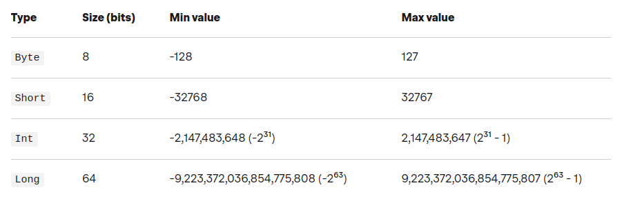
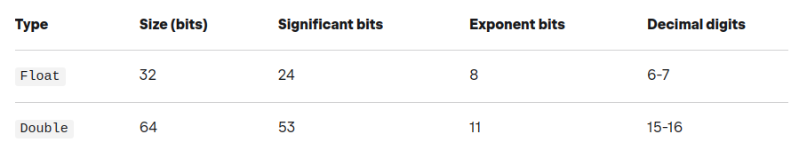
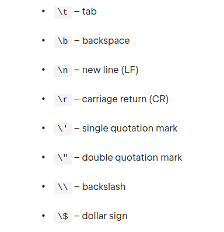

# Apuntes de [Kotlin]

Kotlin es un lenguaje de programación de código abierto de tipo estático que se dirige a JVM, Android, JavaScript y Native. Está desarrollado por JetBrains. El proyecto se inició en 2010 y fue de código abierto desde muy temprano. El primer lanzamiento oficial 1.0 fue en febrero de 2016.

## Características

Un lenguaje de programación se diseña generalmente con un propósito específico en mente. Este propósito puede ser cualquier cosa, desde servir a un entorno específico (por ejemplo, la web) hasta un determinado paradigma (por ejemplo, la programación funcional). En el caso de **Kotlin** el objetivo es construir un lenguaje productivo y pragmático, que tenga todas las características que un desarrollador necesita y que sea fácil de usar.

Kotlin fue diseñado inicialmente para trabajar con otros lenguajes de JVM, pero ahora ha evolucionado para ser mucho más: también funciona en el navegador y como una aplicación nativa.

Kotlin es multiparadigma, con soporte para paradigmas de programación orientada a objetos, procedimentales y funcionales, sin forzar el uso de ninguno de ellos. Por ejemplo, a diferencia de Java, puede definir funciones de nivel superior, sin tener que declararlas dentro de una clase.

* 100% interoperable con Java.
* 100% compatible con Java 6..., por lo que puede crear aplicaciones para la mayoría de los dispositivos Android.
* Se ejecuta en la JVM, puede transpilarse (traducirse) a JavaScript e incluso puede ejecutarse de forma nativa, con interoperabilidad con las bibliotecas C y Objective-C (macOs e iOS).
* No hay necesidad de terminar las frases con punto y coma `;`. Los bloques de código están delimitados por corchetes `{ }`.
* Soporte de primera clase para valores constantes y colecciones inmutables (ideal para programación paralela y funcional).
* Las funciones pueden ser elementos de nivel superior (es decir, no hay necesidad de poner todo dentro de una clase).
* Las funciones son ciudadanos de primera clase: pueden transmitirse como cualquier otro tipo y utilizarse como argumento de las funciones. Lambda (es decir, funciones anónimas) son muy compatibles con la biblioteca estándar.
* No hay una palabra clave `static`, sino que hay mejores alternativas.
* Clases de datos son clases especiales diseñadas para contener datos.
* Todo es una expresión: `if`, `for`, etc... Todos pueden devolver valores.
* La expresión `when` es como un interruptor con superpoderes.

Más información:

[https://kotlinlang.org/docs/reference/comparison-to-java.html](https://kotlinlang.org/docs/reference/comparison-to-java.html)
[https://kotlinlang.org/docs/reference/server-overview.html](https://kotlinlang.org/docs/reference/server-overview.html)
[https://kotlinlang.org/docs/reference/evolution/kotlin-evolution.html](https://kotlinlang.org/docs/reference/evolution/kotlin-evolution.html)

## Kotlin en línea de comandos

* Instalar el compilador desde línea de comandos desde [aquí](https://kotlinlang.org/docs/command-line.html)
* Compilar la aplicación usando el compilador de Kotlin: `$ kotlinc name.kt -include-runtime -d name.jar`
* Ejecutar el programa: `$ java -jar name.jar`
* Ejecutar la consola 'REPL': `$ kotlinc-jvm`
* Usar la línea de comandos para ejecutar scripts (.kts): `$ kotlinc -script name.kts [params]`
* Compilar una biblioteca sin la 'runtime' para ser usada en otros programas: `$ kotlinc name.kt -d name.jar`
* Ejecutar binarios producidos por el compilador de Kotlin: `$ kotlin -classpath name.jar HelloKt (HelloKt is the main class name inside the file named name.kt)`

Más información:
[https://kotlinlang.org/docs/command-line.html](https://kotlinlang.org/docs/command-line.html)

## Sintaxis básica

El punto de entrada en un programa escrito en Kotlin (y en Java) es la función `main(args: Array<String>)`. Esta función recibe un array que contiene los argumentos de la línea de comandos.

```kotlin
fun main(args: Array<String>) {
    println("Hello World!")
}
```

Aunque a partir de la versión `1.3` puedes declarar `main` sin ningún parámetro.

```kotlin
fun main() {
    println("Hello World!")
}
```

Las funciones y variables en Kotlin pueden declararse en un **"nivel superior"**, es decir, no necesitan estar dentro de una clase, por tanto, directamente dentro de un paquete.

Si un archivo Kotlin contiene una sola clase (potencialmente con declaraciones de nivel superior relacionadas), su nombre debe ser el mismo que el nombre de la clase, con la extensión '.kt'. Si un archivo contiene varias clases, o solo declaraciones de nivel superior, el nombre debe describir lo que contiene el archivo en formato _'UpperCamelCase'_ (e.g. `ProcessDeclarations.kt`)

Kotlin sigue las convenciones de nomenclatura de Java. Los nombres de los paquetes se escriben siempre en minúsculas y sin guiones bajos (e.g. `org.example.myproject`)

Los nombres de las clases y los objetos se escriben en _'UpperCamelCase'_:

```kotlin
open class DeclarationProcessor { ... }

object EmptyDeclarationProcessor : DeclarationProcessor() { ... }
```

Los nombres de funciones, propiedades y variables locales en _'lowerCamelCase'_:

```kotlin
fun processDeclarations() { ... }

var declarationCount = ...
```

Los nombres de las constantes (propiedades marcadas con `const`) deben usar nombres en mayúsculas y separados por un guión bajo:

```kotlin
const val MAX_COUNT = 8
val USER_NAME_FIELD = "UserName"
```

### Variables y tipos básicos

[https://kotlinlang.org/docs/basic-types.html#basic-types](https://kotlinlang.org/docs/basic-types.html#basic-types)

En Kotlin, **todo es un objeto** en el sentido de que podemos llamar funciones y propiedades de miembro en cualquier variable. Algunos de los tipos como los números, los caracteres o los booleanos pueden tener una representación interna especial que se representa como valores primitivos en tiempo de ejecución, pero para el usuario se comportan como clases ordinarias.

La declaración de valores se realiza utilizando `var` o `val`:

* Los **valores constantes** se declaran como `val` y son inmutables o _'read-only'_, es decir, que no se pueden reasignar.
* Las **variables** se declaran como `var` y son mutables, por lo que se le pueden asignar un nuevo valor pero únicamente del mismo tipo declarado.

La recomendación es crear valores constantes inmutables, que son más seguras en entornos _'multithreading'_ ya que no se pueden modificar y utilizar las variables mutables cuando sea necesario.

Este soporte de primera clase para los valores constantes es importante por una razón: la programación funcional. En la programación funcional, el uso de los valores constantes permiten algunas optimizaciones que aumentan el rendimiento. Por ejemplo, los cálculos pueden ser paralelos ya que existe una garantía de que el valor no cambiará entre dos ejecuciones paralelas, dado que no puede cambiar.

```kotlin
val fooVal = 10     // val es inmutable y no podrá ser reutilizada

val otherVal
otherVal = "My Value"   // Podemos declarar la variable 'val' en una línea y asignarle valor posteriormente. Sigue siendo una sola asignación.

var fooVar = 10
fooVar = 20     // Se le puede asignar un nuevo valor pero únicamente del mismo tipo.
```

En la mayoría de los casos, Kotlin puede determinar o inferir cuál es el tipo de una variable, por lo que no tenemos que especificarla explícitamente. Cuando la variable **no se inicialice deberemos indicar explícitamente el tipo de la variable** ya que Kotlin no puede inferir el tipo si no se inicializa.

```kotlin
val foo: Int = 7
val bar = 10    // Kotlin infiere automáticamente el tipo
val hello: String   // Si no se inicializa hay que especificar el tipo
```

#### Numbers

[https://kotlinlang.org/docs/numbers.html](https://kotlinlang.org/docs/numbers.html)

Kotlin proporciona los tipos `Byte`, `Short`, `Int` y `Long` para enteros.



Y los tipos `Float` y `Double` para números en coma flotante:



```kotlin
val double: Double = 64.0   // 64 bits
val float: Float = 32.0F // or 32f (32 bits)

val long: Long = 64L    // 64 bits
val int: Int = 32       // 32 bits
val short: Short = 16   // 16 bits

val byte: Byte = 8      // 8 bits
val hexadecimal: Int = 0x16
val binary: Int = 0b101
val char: Char = 'a'
```

Todas las variables inicializadas con un entero no deben exceder el tamaño máximo de `Int` ya que Kotlin infiere el tipo `Int` si no se especifica explícitamente el tipo o se añade el apéndice 'L' al valor. En el caso de números en coma flotante, Kotlin infiere el tipo `Double` si no se indica el tipo explícitamente o se marca el valor en coma flotante con el apéndice 'F'.

```kotlin
val a = 1   // Kotlin infiere el tipo 'Int'
val b = 1L  // Kotlin infiere el tipo 'Long'

val c = 3.14    // Kotlin infiere el tipo 'Double'
val d = 2.7123F  // Kotlin infiere el tipo 'Float'
```

A diferencia de Java, en Kotlin **todos los tipos son objetos** y por tanto no hay _'wrappers'_ u objetos envoltorio tipo `Integer`, `Double`, etc...

Los guiones bajos se pueden utilizar para hacer que los números grandes sean más legibles:

```kotlin
val million = 1_000_000
```

La conversión debe ser invocada explícitamente. Hay conversiones desde un tipo al resto de tipos:

* `toByte()`: Byte
* `toShort()`: Short
* `toInt()`: Int
* `toLong()`: Long
* `toFloat()`: Float
* `toDouble()`: Double
* `toChar()`: Char

```kotlin
val otherLong = int.toLong()
val direct = 25.toLong()
```

#### Characters

[https://kotlinlang.org/docs/characters.html](https://kotlinlang.org/docs/characters.html)

Los caracteres no son números en Kotlin, a diferencia de Java. En Kotlin los caracteres se representan con el tipo `Char`:

Los literales de carácter se escriben con comillas simples como por ejemplo `'a'`. Los caracteres especiales se escapan con la barra invertida `'\'`. Están soportadas las siguientes secuencias de escape: `\t`, `\b`, `\n`, `\r`, `\'`, `\"`, `\\`, `\$`.   


Podemos convertir de forma explícitia un carácter en un número de tipo `Int`:

```kotlin
fun decimalDigitValue(c: Char): Int {
    if (c !in '0'..'9')
        throw IllegalArgumentException("Out of range")
    return c.toInt() - '0'.toInt() // Explicit conversions to numbers
}
```

#### Booleanos

El tipo `Boolean` representa objetos booleanos que pueden tener dos valores:`true` y `false`.

`Boolean` tiene un tipo nulable `Boolean?` que también acepta valores `null`.

Las operaciones que pueden ser con booleanos son:

* `||` – disyunción (lógica *O*)
* `&&` – conjunción (lógica *Y*)
* `!` – negación (lógica *NO*)

`||` y `&&` trabajan con evaluación perezosa,es decir, no evalúa todos los operandos al lado de las operaciones. Evaluan el primero, y el segundo solo si es necesario.

```kotlin
val myTrue: Booleano =  verdadero
val myFalse: Booleano =  falso
val boolNull: Booleano?  = nulo
println(myTrue || myFalse)
println(myTrue && myFalse)
println(!myTrue)
```

#### Strings

[https://kotlinlang.org/docs/strings.html](https://kotlinlang.org/docs/strings.html)

Las cadenas son **secuencias de caracteres inmutables** y se representan con el tipo `String` de manera similar a Java. Las cadenas se crean usando las comillas dobles. El escapado de caracteres se hace con una barra invertida `'\'`.

```kotlin
val fooString = "My String Is Here!"
val barString = "Printing on a new line?\nNo Problem!"
val bazString = "Do you want to add a tab?\tNo Problem!"
println(fooString)
println(barString)
println(bazString)
println("John Doe"[2]) // => h
println("John Doe".startsWith("J")) // => true
```

Se puede acceder a los elementos de una cadena como si fuera un array (e.g. `s[i]`) e iterar con un bucle tipo `for`:

```kotlin
for (c in str) {
    println(c)
}
```

Se puede utilizar el operador `+` para concatenar cadenas entre sí y con valores de otro tipo siempre y cuando uno de los elementos de la expresión sea una cadena:

```kotlin
val s = "abc" + 1
println(s + "def")
```

Una cadena sin formato o _'raw string'_ está delimitada por una comilla triple ("""). Las cadenas sin formato pueden contener nuevas líneas y cualquier otro carácter. Estas cadenas sin formato también tiene soporte para las _'string templates'_:

```kotlin
val fooRawString = """
fun helloWorld(val name : String) {
    println("Hello, world!")
}
val hello = $who
val result = ${2 + 2}
"""
```

Con la función `trimMargin()` podemos eliminar los espacios en blanco:

```kotlin
val text = """
    |Tell me and I forget.
    |Teach me and I remember.
    |Involve me and I learn.
    |(Benjamin Franklin)
    """.trimMargin()
```

##### String templates

[https://kotlinlang.org/docs/strings.html#string-templates](https://kotlinlang.org/docs/strings.html#string-templates)

Un literal de cadena puede contener expresiones de plantilla o _'template expressions'_, que son fragmentos de código que será evaluado y cuyo resultado será concatenado en la cadena. Son una forma simple y efectiva de incrustar valores, variables o incluso expresiones dentro de una cadena.

Una expresión de plantilla comienza con un signo de dólar (`$`) y consisten en un nombre de una variable (por ejemplo `$i`) o en una expresión (como por ejemplo `${name.length}`) en cuyo caso se utilizan llaves (`{}`):

```kotlin
val name = "John Doe"
println("$name has ${name.length} characters") // => John Doe has 8 characters

val age = 40
println("You are ${if (age > 60) "old" else "young"}") // => You are young
```

Las plantillas son compatibles tanto dentro de cadenas sin procesar como dentro de cadenas escapadas. En caso de necesitar representar el literal del dólar en una cadena sin escapar se utiliza esta sintaxis:

```kotlin
val price = """
${'$'}9.99
"""
```

#### Arrays

[https://kotlinlang.org/docs/arrays.html](https://kotlinlang.org/docs/arrays.html)

Una matriz está representada por la clase `Array` y es **invariante**, por lo que, por ejemplo, no se puede asignar un `Array<String>` a un tipo de variable `Array<Any>`.

En Kotlin, podemos crear una matriz de elementos del mismo tipo o de distinto tipo utilizando la función de biblioteca `arrayOf()` y pasándole los elementos a añadir:

```kotlin
val cardNames = arrayOf("Jack", "Queen", "King", 3, false)
println(cardNames[1])   // => Queen
```

Podemos forzar la creación de arrays del mismo tipo. De esta forma el compilador comprobará el tipo de los elementos que se añaden y evitará que se añadan elementos de tipos no válidos:

```kotlin
val myArray = arrayOf<Int>(1, 2, 3, 4)
println(myArray.contentToString()) // => [1, 2, 3, 4]
```

La biblioteca estándar de Kotlin provee funciones para crear arrays de tipos primitivos como `intArrayOf()`, `longArrayOf()`, `charArrayOf()`, `doubleArrayOf()`, etc... Cada una de estas funciones devuelven una instancia de su equivalente en Kotlin como `IntArray`, `LongArray`, `CharArray`, `DoubleArray`, etc...:

```kotlin
val cards = intArrayOf(10, 11, 12) // IntArray
println("${cards[1]}") // => 11
```

Para mejorar la eficiencia y rendimiento del código, cuando se utilicen tipos primitivos hay que utilizar las funciones `intArrayOf()`, `longArrayOf()`, etc.. en vez de `arrayOf()` para así evitar el coste asociado a las operaciones de _'boxing'/'unboxing'_.

Alternativamente, podemos crear una matriz a partir de un tamaño inicial y una función, que se utiliza para generar cada elemento usando el constructor `Array()`:

```kotlin
val allCards = Array(12, { i -> i + 1 })
println("${allCards.first()} - ${allCards.last()}") // => 1 - 12
```

Iterando sobre la matriz con `indices`:

```kotlin
for (index in cardNames.indices) {
    println("Element $index is ${cardNames[index]}")
}
```

Otra forma posible de iterar es usando la función `withIndex()`:

```kotlin
for ((index, value) in cardNames.withIndex()) {
    println("$index - $value")
}
```

### Packages

[https://kotlinlang.org/docs/packages.html](https://kotlinlang.org/docs/packages.html)

La palabra clave `package` funciona de la misma manera que en Java. El nombre del paquete se usa para construir el **"Fully Qualified Name"** (FQN) de una clase, objeto, interfaz o función.

Todo el contenido (como clases y funciones) de un fichero fuente están contenidos en el paquete declarado. Los nombres de los paquetes se escriben en minúscula y sin guiones bajos:

```kotlin
package com.example.kotlin

class MyClass { /*...*/ }

fun saySomething(): String { /*...*/  }
```

En el ejemplo, el FQN de la clase será `com.example.kotlin.MyClass`.

Dado que podemos tener _'top-level functions'_ como la función `saySomething()` del ejemplo, el FQN de esta función será `com.example.kotlin.saySomething`.

Si no se especifica un paquete, el contenido del fichero fuente pertenece al paquete **'default'**.

### Imports

[https://kotlinlang.org/docs/packages.html#imports](https://kotlinlang.org/docs/packages.html#imports)

En Kotlin, usamos la declaración de importación para permitir que el compilador localice las clases e interfaces, propiedades, enumeraciones, funciones y objetos que se importarán.

En Java, por otro lado, solo está permitido importar clases o interfaces.

```kotlin
// 'Bar' esta disponible en el código
import foo.Bar

// Si existe cierta ambigüedad podemos usar la palabra clave 'as'
import foo.Bar
import bar.Bar as bBar

// Todo el contenido de 'foo' está disponible
import foo.*
```

Por defecto, al igual que en Java, el compilador importa de forma implícita una serie de paquetes y por tanto están disponibles de forma automática:

* [kotlin.*](https://kotlinlang.org/api/latest/jvm/stdlib/kotlin/index.html)
* [kotlin.annotation.*](https://kotlinlang.org/api/latest/jvm/stdlib/kotlin.annotation/index.html)
* [kotlin.collections.*](https://kotlinlang.org/api/latest/jvm/stdlib/kotlin.collections/index.html)
* [kotlin.comparisons.*](https://kotlinlang.org/api/latest/jvm/stdlib/kotlin.comparisons/index.html)
* [kotlin.io.*](https://kotlinlang.org/api/latest/jvm/stdlib/kotlin.io/index.html)
* [kotlin.ranges.*](https://kotlinlang.org/api/latest/jvm/stdlib/kotlin.ranges/index.html)
* [kotlin.sequences.*](https://kotlinlang.org/api/latest/jvm/stdlib/kotlin.sequences/index.html)
* [kotlin.text.*](https://kotlinlang.org/api/latest/jvm/stdlib/kotlin.text/index.html)

Additional packages are imported depending on the target platform:

* JVM:
  * java.lang.*
  * [kotlin.jvm.*](https://kotlinlang.org/api/latest/jvm/stdlib/kotlin.jvm/index.html)
* JS:
  * [kotlin.js.*](https://kotlinlang.org/api/latest/jvm/stdlib/kotlin.js/index.html)

### Comentarios

```kotlin
// Single-line comments start with //

/*
Multi-line comments look like this.
*/
```

### Control de flujo y bucles

[https://kotlinlang.org/docs/control-flow.html#control-flow-if-when-for-while](https://kotlinlang.org/docs/control-flow.html#control-flow-if-when-for-while)

Kotlin tiene 4 construcciones de control de flujo: `if`, `when`, `for` y `while`.  `if` y `when` son expresiones, por lo que devuelven un valor; `for` y `when` son declaraciones, por lo que no devuelven un valor. `if` y `when` también se pueden utilizar como sentencias, es decir, se pueden utilizar de forma autónoma y sin devolver un valor.

Un bucle `for` puede usarse con cualquier elemento que proporcione un iterador como rangos, colecciones, etc...:

```kotlin
for (c in "hello") {
    println(c)
}

for (i in 1..3) {
    println(i)
}

for (i in 6 downTo 0 step 2) {
    println(i)
}
```

Los bucles `while` y `do-while` funcionan de la misma manera que en otros lenguajes:

```kotlin
while (x > 0) {
    x--
}

do {
    val y = retrieveData()
} while (y != null) // y is visible here!
```

La instrucción `if` y `if..else` funciona igual que en Java. Además, en Kotlin los bloques `if` se pueden utilizar como una expresión que devuelve un valor. Por este motivo el operador ternario _'condition ? then: else'_ no es necesario en Kotlin:

```kotlin
// Traditional usage
var max = a
if (a < b) max = b

// With else
var max: Int
if (a > b) {
    max = a
} else {
    max = b
}

// As expression
val max = if (a > b) a else b

// With blocks
// returns a or 5
var top = if (a > 5) {
    println("a is greater than 5")
    a
} else {
    println("5 is greater than a")
    5
}
```

Los bloques `when` se pueden usar como una alternativa a las cadenas `if-else-if` o en substitución de los `switch`. Si no se proporciona ningún argumento, las condiciones de la rama son simplemente expresiones booleanas, y una rama se ejecuta cuando su condición es verdadera:

```kotlin
when {
    x.isOdd() -> print("x is odd")
    x.isEven() -> print("x is even")
    else -> print("x is funny")
}
```

La instrucción `when` se puede usar con un argumento. Si ninguna de las opciones coincide con el argumento, se ejecuta la opción del bloque `else`:

```kotlin
when (x) {
    1 -> print("x == 1")
    2 -> print("x == 2")
    else -> {
        println("none of the above") // Nótese el uso de llaves para delimitar el bloque de código
    }
}
```

La instrucción `when` se puede utilizar como una expresión que devuelve un valor. En este caso el bloque `else` es **obligatorio**. De hecho, la única excepción a esta regla es si el compilador puede garantizar que siempre devuelve un valor. Por lo tanto, si las ramas normales cubren todos los valores posibles, entonces no hay necesidad de una rama `else`:

```kotlin
val result = when (i) {
    0, 21 -> "0 or 21"
    in 1..20 -> "in the range 1 to 20"
    else -> "none of the above"
}
println(result)

val check = true
val result = when(check) {   // All results are covered
    true -> println("it's true")
    false -> println("it's false")
}
```

Se pueden utilizar expresiones arbitrarias, y no solo constantes, como condiciones en los bloques:

```kotlin
when (x) {
    parseInt(s) -> print("s encodes x")
    else -> print("s does not encode x")
}
```

Si muchos casos deben manejarse de la misma manera, las condiciones de la rama pueden combinarse con una coma:

```kotlin
when (x) {
    0, 1 -> print("x == 0 or x == 1")
    else -> print("otherwise")
}
```

También podemos verificar si un valor está dentro `in` o no está dentro `!in` de un rango o una colección:

```kotlin
when (x) {
    in 1..10 -> print("x is in the range")
    in validNumbers -> print("x is valid")
    !in 10..20 -> print("x is outside the range")
    else -> print("none of the above")
}
```

## Funciones

[https://kotlinlang.org/docs/functions.html](https://kotlinlang.org/docs/functions.html)

Las funciones se declaran usando la palabra clave `'fun'`. Los nombres de las funciones empiezan con minúscula. Los parámetros de la función se especifican entre paréntesis después del nombre de la función y tienen la forma `'name: type'`. El **tipo de cada parámetro debe especificarse explícitamente** y no puede omitirse.

```kotlin
fun powerOf(number: Int, exponent: Int) { ... }
```

Los parámetros de la función pueden tener opcionalmente un valor por defecto, que se utilizará en caso de se omita el argumento al invocar la función. El tipo de retorno de la función, si es necesario, se especifica después de los parámetros:

```kotlin
fun hello(name: String = "world"): String { // valor por defecto
    return "Hello, $name!"
}

hello("foo") // => Hello, foo!
hello(name = "bar") // => Hello, bar!
hello() // => Hello, world!

fun bye(bye: String = "Bye", name: String): String {
    return "$bye, $name!!"
}

bye(name = "John", bye = "Good bye") // => Good bye, John!!
bye(name = "John") // => Bye, John!!
```

Si un parámetro por defecto precede a un parámetro sin valor predeterminado, el valor por defecto solo se puede usar llamando a la función con argumentos con nombre:

```kotlin
fun foo(bar: Int = 0, baz: Int) { ... }

foo(baz = 1) // The default value bar = 0 is used
```

Dado que Java no admite valores de parámetros por defecto en los métodos, deberá especificar todos los valores de parámetros explícitamente cuando llame a una función de Kotlin desde Java. Kotlin nos proporciona la funcionalidad para facilitar las llamadas de Java al anotar la función Kotlin con `'@JvmOverloads'`. Esta anotación le indicará al compilador de Kotlin que genere las funciones sobrecargadas de Java para nosotros.

```kotlin
@JvmOverloads
fun calCircumference(radius: Double, pi: Double = Math.PI): Double = (2 * pi) * radius

// En Java
double calCircumference(double radius, double pi);
double calCircumference(double radius);
```

Cuando una función no devuelve ningún valor significativo, su tipo de devolución por defecto es `Unit`. En ese caso indicar el tipo de retorno es opcional. El tipo `Unit` es un objeto en Kotlin que es similar a los tipos `void` en Java y C.

```kotlin
fun hello(name: String): Unit {
   print("Hello $name")
}

fun sayHello(name: String) { // compila ya que el compilador infiere el tipo 'Unit'
   print("Hello $name")
}
```

Los parámetros con nombre permiten código más legible al nombrar los parámetros que se pasan a una función cuando se invoca. Una vez que se utiliza un nombre en un parámetro, el resto de parámetros también deben asignarse con nombre:

```kotlin
fun area(width: Int, height: Int): Int {
    return width * height
}

area(10, 12)
area(width = 10, height = 12) // código más legible
area(height = 12, width = 10) // podemos cambiar el orden
area(10, height = 12) // argumento por posición y argumentos con nombre
area(width = 10, 12) // ¡incorrecto! no se permiten argumentos con nombre antes de argumentos por posición

fun bar(k: Int, m: Long = 1L, j: Boolean = true) = println("$k - $m - $j")

// Una vez que un parámetro ha sido nombrado, todos los siguientes parámetros deben ser nombrados
bar(10) // => Se omiten los parámentros por defecto
bar(15, 30L)
bar(20, 2L, true)
bar(m = 30L, j = false, k = 10)
bar(k = 10, m = 20L, j = true)
bar(5, m = 2L, j = true)
bar(6, 1L, j = true)
```

Cuando se invoca una función con argumentos posicionales y con nombre, todos los argumentos posicionales deben colocarse antes del primero argumento con nombre. Por ejemplo, la llamada `f(1, y = 2)` está permitida, pero `f(x = 1, 2)` no está permitida.

Para pasar un número variable de argumentos a una función podemos usar la palabra clave `'vararg'` delante del nombre de una variable. Por tanto la función aceptará una lista de parámetros separados por comas que el compilador envolverá en una array. Por tanto, dentro de la función accederemos a los parámetros mediante la notación de array.

Este tipo de parámetros se puede combinar con otros parámetros. Normalmente el parámetro `'vararg'` será el último de la lista. Si hay otros parámetros después de `'vararg'`, deberán usarse parámetros con nombre:

```kotlin
fun varargExample(vararg names: Int) {
    println("Argument has ${names.size} elements")
}
varargExample() // => Argument has 0 elements
varargExample(1) // => Argument has 1 elements
varargExample(1, 2, 3) // => Argument has 3 elements


fun car(vararg model: String, year: Int) {}
car("Audi", "A6", year = 2005) // parámetros con nombre después de 'vararg'
```

Para utilizar un array para suministrar un número variable de argumentos se utiliza el operador `'*'` también llamado _'spread operator'_ delante del nombre de la variable del array:

```kotlin
val intArray = intArrayOf(1, 2, 3, 4)
val array = Array(5, { i -> i + 1 })
varargExample(*intArray) // => Argument has 4 elements
varargExample(*array.toIntArray()) // => Argument has 5 elements
```

Cuando una función consiste en una sola expresión, se pueden omitir los paréntesis. El cuerpo se especifica después de un símbolo `'='`:

```kotlin
fun odd(x: Int): Boolean = x % 2 == 1
```

Declarar explícitamente el tipo de retorno de una función cuando es una expresión es opcional cuando puede ser inferido por el compilador o cuando el tipo de retorno es `'Unit'`. Cuando el cuerpo de una función es un bloque hay que especificar el tipo de retorno ya que el compilador no puede inferirlo:

```kotlin
fun even(x: Int) = x % 2 == 0  // Optional

fun printHello(name: String?) { // 'Unit'
    if (name != null)
        println("Hello ${name}")
    else
        println("Hi there!")
    // `return Unit` or `return` is optional
}
```

A veces queremos devolver múltiples valores desde una función. Una forma es usar el tipo `'Pair'` de Kotlin. Esta estructura incluye dos valores a los que luego se puede acceder. Este tipo de Kotlin puede aceptar cualquier tipo que suministre a su constructor. Y, lo que es más, los dos tipos ni siquiera necesitan ser iguales. Kotlin también provee el tipo `'Triple'` que retorna tres valores:

```kotlin
fun getNumbers(num: Int): Pair<Int?, Int?> {
    require(num > 0, { "Error: num is less than 0" })
    return Pair(num, num * 2)
}

val(num, num2) = getNumbers(10) // destructuring
```

En Kotlin, podemos hacer que la creación de una instancia _'Pair'_ sea más compacta y legible utilizando la función _'to'_, que es una función _'infix'_ en lugar del constructor de _'Pair'_.

```kotlin
val nigeriaCallingCodePair = 234 to "Nigeria"
val nigeriaCallingCodePair2 = Pair(234, "Nigeria") // Same as above
```

### Extension functions

Las *__'extension functions'__* son una forma de agregar nuevas funcionalidades a una clase sin tener que heredar de dicha clase. Esto es similar a los métodos de extensión de C#. Una función de extensión se declara fuera de la clase que quiere extender. En otras palabras, también es una _'top-level function'_. Junto con las funciones de extensión, Kotlin también admite propiedades de extensión.

Para crear una _'extension function'_, debe prefijar el nombre de la clase que está extendiendo antes del nombre de la función. El nombre de la clase o el tipo en el que se define la extensión se denomina **tipo de receptor**, y el **objeto receptor** es la instancia de clase o el valor concreto sobre el que se llama a la función de extensión.

```kotlin
fun String.remove(c: Char): String {  // 'String' es el tipo receptor
    return this.filter { it != c }     // 'this' corresponde al objeto receptor
}

println("Hello, world!".remove('l')) // => Heo, word!  // "Hello World" es el objeto receptor
```

En caso de que una _'extension function'_ tenga la misma firma (mismo nombre y misma lista de parámetros) que una función miembro, es decir, una función de la clase, el compilador invocará antes la función miembro que la función de extensión aunque no se generará ningún error de compilación:

```kotlin
class C {
    fun foo() { println("member") }
}

fun C.foo() {
    println("extension")
}

fun C.foo(i: Int) {
    println("extension & overrided")
}

C().foo() // => member
C().foo(5) // => extension & overrided
```

### Top-level functions

**Las funciones de nivel superior son funciones que se definen fuera de cualquier clase, objeto o interfaz**. Esto significa que son funciones a las que llama directamente, sin la necesidad de crear ningún objeto o llamar a ninguna clase. Dado que Java no soporta este tipo de funciones el compilador de Kotlin genera una clase con métodos estáticos. Este tipo de funciones son especialmente útiles para crear funciones de utilidad o de ayuda.

```kotlin
// Code defined inside a file called 'UserUtils.kt'
@file:JvmName("UserUtils")
package com.example.project.utils

fun checkUserStatus(): String {
    return "online"
}
```

### High-Order Functions

Las funciones en Kotlin son de primera clase, lo que significa que pueden ser almacenadas en variables y estructuras de datos, pasadas como argumentos y devueltas desde otras funciones de orden superior. Puede operar con funciones de cualquier manera que sea posible para otros valores no funcionales.

Para facilitar esto, Kotlin, como lenguaje de programación estáticamente tipado, utiliza una familia de tipos de función para representar funciones y proporciona un conjunto de construcciones de lenguaje especializadas, tales como expresiones lambda.

Una _'high-order function'_ o **función de orden superior** es una función que puede tomar funciones como parámetros y/o devolver una función como tipo de retorno.

```kotlin
// Función con dos parámetros, el segundo de ellos es una función
fun foo(str: String, fn: (String) -> String): Unit {
    val applied = fn(str)
    println(applied)
}
foo("Hello", { it.reversed() }) // => olleH

// Esta función de orden superior devuelve una función
fun isPositive(n: Int): (Int) -> Boolean {
    return { n > 0 } // return a function. Instead 'return value' we have 'return { function }'
}

// Esta función de orden superior devuelve una función de forma más compacta
fun modulo(k: Int): (Int) -> Boolean = { it % k == 0 }
// fun modulo(k: Int): (Int) -> Boolean = { n:Int -> n % k == 0 } //igual que la definición de arriba.  

val evens = listOf(1, 2, 3, 4, 5, 6).filter(modulo(2)) // => [2, 4, 6]

// Asignar la función a una variable
val isEven: (Int) -> Boolean = modulo(2)

listOf(1, 2, 3, 4).filter(isEven) // => [2, 4]
listOf(5, 6, 7, 8).filter(isEven) // => [6, 8]
```

### Functions types & Lambdas

Un tipo función es un tipo que consta de una firma de función, es decir, dos paréntesis que contiene la lista de parámetros (que son opcionales) y un tipo de retorno. Ambas partes están separadas por el operador `'->'`.

Cuando se define un tipo función, siempre se debe indicar explícitamente el tipo de retorno. Cuando se declaran funciones normales que devuelven `Unit`, se puede omitir el tipo de retorno ya que el compilador lo infiere, pero no se puede omitir en los tipos función. Además, debe poner los paréntesis para los parámetros, incluso cuando el tipo función no acepta ningún parámetro.

```kotlin
fun executor(action:() -> Unit) {
    action()
}

// 'action' es el nombre del parámetro y su tipo es '() -> Unit' que es una función.
// Por tanto el tipo de 'action' es un tipo función.
```

* Ejemplo de un tipo función que no toma parámetros y devuelve 'Unit': `() -> Unit`
* Ejemplo de un tipo función que no toma parámetros y devuelve un String: `() -> String`
* Ejemplo de un tipo función que toma un String y no devuelve nada: `(String) -> Unit`
* Ejemplo de un tipo función que toma dos parámetros y no devuelve nada: `(String, Float) -> Unit`

Debido a que un tipo función es solo un tipo, significa que puede asignar una función a una variable, puede pasarla como un argumento a otra función o puede devolverla desde una función tal y como suceden en las _`high-order functions'_:

```kotlin
val saySomething: (String) -> Unit = { x -> println(x) }
saySomething("Good morning") // => Good morning
```

Una forma de instanciar una función tipo es usando el operador `'::'`. También podemos usar este operardor para pasar un tipo función como parámetro de otra función especificando su nombre con el operador y sin utilizar los paréntesis:

```kotlin
fun businessEmail(s: String): Boolean {
    return s.contains("@") && s.contains("business.com")
}
isAnEmail(::businessEmail) // Invocar una 'high-order function' pasándole otra función por su nombre

fun tell(text: String) {
    println(text)
}

var saySomething: (String) -> Unit // La variable 'saySomething' es una variable de tipo función
saySomething = ::tell // instanciar el tipo función y asignarlo a la variable 'saySomething'

saySomething("Hello") //=> Hello
```

En particular, una **lambda es una función literal**: una función anónima que no se declara pero se usa directamente como una expresión.

Básicamente, una lambda es un bloque de código que se puede pasar como cualquier otro literal (por ejemplo, simplemente como una cadena literal `"una cadena"`). La combinación de estas características permite a Kotlin soportar la programación funcional básica.

En el ejemplo una variable 'sum' de tipo función y a la que le asignamos directamente una función _'lambda'_ con dos parámetros:

```kotlin
// Asignando una función 'lambda'
val sum: (Int, Int) -> Int = { x, y -> x + y }
sum(10, 20) // => 30

// Equivalente usando el operador '::'
fun operation(x: Int, y: Int): Int {
    return x + y
}
val sum: (Int, Int) -> Int = ::operation
sum(10, 20) // => 30
```

En Kotlin, por convención si una función _'lambda'_ tiene solo un parámetro, su declaración puede omitirse (junto con ->). El nombre del único parámetro será `'it'`.

```kotlin
val isNegative: (Int) -> Boolean = { it < 0 } // este literal es del tipo '(it: Int) -> Boolean'
isNegative(-5) // => true
```

Otra convención es que si el último parámetro de una función acepta una función, una expresión 'lambda' que es pasada como el argumento correspondiente se puede colocar **fuera de los paréntesis**:

```kotlin
// lambda expression inside parentheses
val upperCaseLetters = "Hello World".filter({ it.isUpperCase() })

// lambda outside parentheses
val lowerCaseLetters = "Hello World".filter { it.isLowerCase() }

println("$upperCaseLetters - $lowerCaseLetters") // => HW - elloorld
```

El siguiente ejemplo tenemos una función de orden superior que acepta una función lambda `{ (String) -> Boolean }` como parámetro. Se expresa como "acepta una función 'from String to Boolean'":

```kotlin
// El parámetro 'email' podemos usarlo como una función que acepta una cadena y devuelve un booleano.
fun isAnEmail(email: (String) -> Boolean) {
    email("myemail@example.com")
}
isAnEmail({ s: String -> s.contains("@") }) // forma completa
isAnEmail { s: String -> s.contains("@") } // Los paréntesis son opcionales
isAnEmail { it.contains("@") } // Uso de 'it'
```

Para parámetros no utilizados se utiliza el operador `'_'`:

```kotlin
val unusedSecondParam: (String, Int) -> Boolean = { s, _ ->
    s.length > 10
}
unusedSecondParam("Hello World", 0) // 0 is unused
```

### Anonymous functions

Una función anónima se parece mucho a una declaración de función normal, excepto que se omite su nombre. Su cuerpo puede ser una expresión o un bloque:

```kotlin
// Función anónima cuyo cuerpo es una expresión
fun(x: Int, y: Int): Int = x + y

// Función anónima con bloque
fun(x: Int, y: Int): Int {
    return x + y
}
```

El tipo de los parámetros de una función anónima pueden omitirse si se pueden inferir por el contexto:

```kotlin
ints.filter(fun(item) = item > 0)
```

La inferencia de tipo de retorno para funciones anónimas funciona igual que para las funciones normales: el tipo de retorno se deduce automáticamente para funciones anónimas con un cuerpo de expresión y debe especificarse explícitamente (o se supone que es `'Unit'`) para funciones anónimas con un cuerpo de bloque.

### Closures

Un *__'closure'__* es una función que tiene acceso a variables y parámetros que se definen en un ámbito externo. A diferencia de Java, las variables 'capturadas' pueden ser modificadas.

```kotlin
fun printFilteredNamesByLength(length: Int) {
    val names = arrayListOf("Adam", "Andrew", "Chike", "Kechi")
    val filterResult = names.filter {
        it.length == length     // 'length' se define fuera del ámbito de la lambda
    }
    println(filterResult)
}
```

### Local or Nested Functions

Para llevar más lejos la modularización de programas, Kotlin nos proporciona funciones locales, también conocidas como funciones anidadas o _'nested functions'_. **Una función local es una función que se declara dentro de otra función**.

Podemos hacer que nuestras funciones locales sean más concisas al no pasarles parámetros explícitamente. Esto es posible porque las funciones locales tienen acceso a todos los parámetros y variables de la función de cierre.

```kotlin
fun printCircumferenceAndArea(radius: Double): Unit {

    fun calCircumference(radius: Double): Double = (2 * Math.PI) * radius
    val circumference = "%.2f".format(calCircumference(radius))

    fun calArea(radius: Double): Double = (Math.PI) * Math.pow(radius, 2.0)
    val area = "%.2f".format(calArea(radius))

    print("The circle circumference of $radius radius is $circumference and area is $area")
}
```

### Infix Functions

Las funciones marcadas con la palabra clave `'infix'` se pueden llamar usando la notación _'infix'_ (omitiendo el punto y los paréntesis para la llamada). Estas funciones deben cumplir los siguientes requisitos:

* Tienen que ser miembros de una clase o funciones de extensión
* Deben tener un solo parámetro
* Este parámetro no será `'vararg'` ni tener valor por defecto

Para invocar una función `'infix'` en Kotlin no necesitamos usar la notación de puntos ni los paréntesis. Hay que tener en cuenta que las funciones `'infix'` siempre requieren que se especifiquen tanto el receptor como el parámetro. Cuando se invoca un método en el receptor actual, como por ejemplo dentro de la clase, se necesita usar explicitamente la notación `'this'`. A diferencia de las llamadas a métodos regulares, no se puede omitir.

```kotlin
class Student {
    var kotlinScore = 0.0

    infix fun addKotlinScore(score: Double): Unit {
        this.kotlinScore = kotlinScore + score
    }

    fun build() {
        this addKotlinScore 95.0   // Correcto
        addKotlinScore(95.0)       // Correcto
        addKotlinScore 95.0        // Incorrectp: hay que especificar el receptor ('this')
    }
}

val student = Student()
student addKotlinScore 95.00 // Invocando la función usando la notación 'infix'
student.addKotlinScore(95) // Invocando la función con notación normal
```

### Inline functions

El compilador de Kotlin crea una clase anónima en versiones anteriores de Java cuando creamos o utilizamos expresiones lambda. Esto genera una sobrecarga, además de la carga de memoria que se genera cuando en una función lambda hace uso de variables de fuera de su entorno como en las _'closures'_.

Para evitar esta sobrecarga tenemos el modificador `'inline'` para las funciones. Una _'High-Order function'_ con el modificador `'inline'` se integrará durante la compilación del código. En otras palabras, el compilador copiará la 'lambda' (o función literal) y también el cuerpo de la función de orden superior y los pegará en el sitio de la llamada.

Con este mecanismo, nuestro código se ha optimizado significativamente, no más creación de clases anónimas o asignaciones de memoria extra. Por otro lado el uso de `'inline'` hace que el compilador genere ficheros bytecode más grandes. Por esta razón, se recomienda encarecidamente que solo se incluyan funciones de orden superior más pequeñas que acepten lambda como parámetros.

---

## Reference

* [https://kotlinlang.org/docs/reference/](https://kotlinlang.org/docs/reference/)
* [https://code.tutsplus.com/series/kotlin-from-scratch--cms-1209](https://code.tutsplus.com/series/kotlin-from-scratch--cms-1209)
* [https://www.packtpub.com/application-development/programming-kotlin](https://www.packtpub.com/application-development/programming-kotlin)
* [https://learnxinyminutes.com/docs/kotlin/](https://learnxinyminutes.com/docs/kotlin/)
* [https://gist.github.com/dodyg/5823184](https://gist.github.com/dodyg/5823184)
* [https://gist.github.com/dodyg/5616605](https://gist.github.com/dodyg/5616605)
* [https://github.com/Zhuinden/guide-to-kotlin](https://github.com/Zhuinden/guide-to-kotlin)
* [https://superkotlin.com/kotlin-mega-tutorial/](https://superkotlin.com/kotlin-mega-tutorial/)
* [https://revilofe.github.io/IESRA-DAM-Prog/#/](https://revilofe.github.io/IESRA-DAM-Prog/#/)

## Fuente

* [Apuntes de kotlin](https://github.com/alxgcrz/_kotlin_)
* [Kotlinlang](https://kotlinlang.org)

## Presentación

* [Presentación de la unidad](https://revilofe.github.io/slides/section1-pr/PR-U4.1.-kotlin.html)

## License

[](http://creativecommons.org/licenses/by-sa/4.0/)
Esta obra está bajo una [licencia de Creative Commons Reconocimiento-Compartir Igual 4.0 Internacional](http://creativecommons.org/licenses/by-sa/4.0/).
