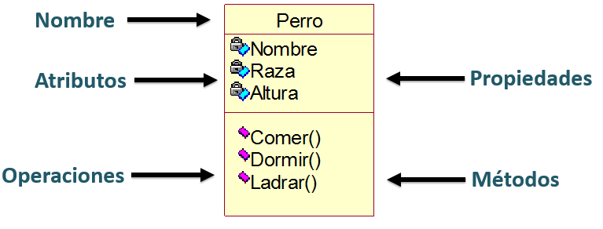

# Programación orientada a objetos

## 1. Características

La Programación Orientada a Objetos (POO) viene a cambiar la forma de programar. Los objetos se utilizan como metáfora para emular las entidades reales del negocio a modelar.

Está basada en varias técnicas como: abstracción, polimorfismo, encapsulamiento, herencia y cohesión/acoplamiento.

1. **Abstracción**: La abstracción implica enfocarse en las características esenciales de un objeto, ignorando las menos importantes o accidentales. En POO, esto se traduce en la creación de clases que representan entidades abstractas con atributos y métodos relevantes.
   Ejemplo en Kotlin:

   ```kotlin
   abstract class Vehiculo(val marca: String, val modelo: String) {
       abstract fun acelerar()
       abstract fun frenar()
   }
   ```
   Aquí, `Vehiculo` es una clase abstracta que define la abstracción de un vehículo con características comunes como marca y modelo, y acciones como acelerar y frenar.

   Las clases abstractas no pueden ser instanciadas directamente; ***se utilizan como base para otras clases***.
   
3. **Polimorfismo**: El polimorfismo permite que objetos de diferentes clases sean tratados como objetos de una clase común. Esto se logra a través de la herencia y la implementación de interfaces.
   Ejemplo en Kotlin:

   ```kotlin
   class Coche(marca: String, modelo: String) : Vehiculo(marca, modelo) {
       override fun acelerar() {
           println("Coche acelerando")
       }

       override fun frenar() {
           println("Coche frenando")
       }
   }
   ```
   `Coche` es una clase que hereda de `Vehiculo` y proporciona su propia implementación de los métodos acelerar y frenar.   

4. **Encapsulamiento**: El encapsulamiento implica restringir el acceso directo a algunos componentes de un objeto y proteger la integridad del objeto exponiendo solo lo que es necesario. 
   Ejemplo en Kotlin:

   ```kotlin
   class CuentaBancaria(private var saldo: Double) {
       fun depositar(monto: Double) {
           if (monto > 0) {
               saldo += monto
           }
       }

       fun consultarSaldo(): Double {
           return saldo
       }
   }
   ```
   Aquí, el saldo de `CuentaBancaria` está encapsulado. Se manipula únicamente a través de métodos como `depositar`.   

5. **Herencia**: La herencia es un mecanismo mediante el cual una nueva clase adquiere las propiedades y comportamientos de otra clase. Esto ayuda en la reutilización de código.
   Ejemplo en Kotlin:

   ```kotlin
   open class Animal(val nombre: String) {
       open fun sonido() {
           println("El animal hace un sonido")
       }
   }

   class Perro(nombre: String) : Animal(nombre) {
       override fun sonido() {
           println("El perro ladra")
       }
   }
   ```
   `Perro` hereda de `Animal` y sobrescribe el método `sonido`.   

6. **Cohesión/Acoplamiento**: La cohesión se refiere a qué tan estrechamente relacionadas están las tareas realizadas por una clase. El acoplamiento se refiere a cómo de interdependientes son las clases entre sí. La alta cohesión y el bajo acoplamiento son ideales en POO para facilitar la mantenibilidad y la escalabilidad.

   * **Alta cohesión**: Una clase `Calculadora` que realiza operaciones matemáticas.
   * **Bajo acoplamiento**: `Calculadora` utiliza una interfaz `OperacionesMatematicas` para interactuar con otras clases, lo que reduce su dependencia directa.

Estos conceptos son fundamentales en POO y ayudan a crear software bien estructurado, mantenible y escalable.

## 2. Clases y objetos/instancias

En la programación orientada a objetos (POO), los conceptos fundamentales son las clases y los objetos. Estos conceptos son esenciales para entender cómo la POO modela el mundo real y soluciona problemas de forma eficiente y organizada.

### 2.1 Conceptos

- Las **clases** son una plantilla para la creación de objetos de datos según un modelo predefinido.   
- Los **objetos** son una instancia de la clase, es decir una concreción. Es un ejemplo de esa clase.   

Ej:

- Clases: Persona, Animal, Coche
- Objetos/Instancias: Juan, Perro, Seat Ibiza

Las clases tienen los siguientes componentes:

- **Atributos/campos**: también llamadas variables de instancia, contienen la información de los futuros objetos. Normalmente privadas al objeto. Los atributos son otros objetos que cualifican al objeto y se acceden a través del . y el nombre del atributo.
- **Métodos**: tambien llamados métodos de instancia, implementan la funcionalidad o comportamiento asociado al objeto, son funciones. Se acceden a estors métodos a través del . y el nombre del método. Estos métodos pueden acceder a las variables de instancia de la clase directamente.
  Cuando se desea realizar una acción sobre un objeto, se dice que se le manda un **mensaje** invocando a un método que realizará la acción.
- **Constructores**: son métodos especiales que se utilizan para inicializar los objetos. Se llaman automáticamente cuando se crea un objeto de la clase. Además van acompañados de un bloque de inicialización.

Los objetos tienen los siguientes componentes:

- **Identidad**: Los identifica del resto de objetos de la misma clase.
- **Comportamiento**: Relacionado con su funcionalidad, determina las operaciones que se pueden realizar y con las que responde a los mensajes.
- **Estado**: Conjunto de atributos y sus valores en un momento determinado.

### 2.2 Creando clase

#### 2.2.1 Constructores

Un **constructor** es un método especial que se utiliza para inicializar los objetos. Se llama automáticamente cuando se crea un objeto de la clase.

En Kotlin, una clase puede tener tanto un constructor primario como uno o más constructores secundarios. Si la clase tiene un constructor primario, el secundario debe delegar en el constructor primario, ya sea directamente o indirectamente usando la palabra clave `this`. 
Todos los constructores son públicos por defecto, lo que significa que son visibles donde sea visible la clase.

##### 2.2.1.1 Constructor Primario
Se declara en el encabezado de la clase y es el más comúnmente utilizado. Por ejemplo:

```kotlin 
class Persona(val nombre: String, val edad: Int)
```  
Aquí, `Persona` tiene un constructor primario con dos parámetros: `nombre` y `edad`. Si no hay anotaciones ni modificadores de visibilidad, la palabra clave `constructor` es opcional y se puede omitir.   

##### 2.2.1.2 Constructor Secundario
Se declara dentro del cuerpo de la clase y se utiliza para proporcionar funcionalidades adicionales o para permitir diferentes formas de instanciar un objeto.
```kotlin
class Persona(val nombre: String) {
  var edad: Int = 0

  constructor(nombre: String, edad: Int) : this(nombre) {
      this.edad = edad
  }
}
```
En el ejemplo anterior,  `Persona` tiene un constructor primario que solo toma un `nombre`, y un constructor secundario que toma tanto un `nombre` como una `edad`. Presta atención a como el constructor secundario delega en el constructor primario usando la palabra clave `this`.

##### 2.2.1.3 Constructor vacío
Si no se proporciona ningún constructor, Kotlin crea un constructor vacío por defecto. Por ejemplo:
  ```kotlin
    class Persona
  ```

#### 2.2.2 Definición de las variables de instancia en el constructor
Por otra parte, las propiedades o variables de instancia pueden definirse en el constructor principal o en el cuerpo de la clase. En el ejemplo anterior, `nombre` es una propiedad definida en el constructor principal, mientras que `edad` es una propiedad definida en el cuerpo de la clase.

##### 2.2.2.1 Definición en el Constructor
Al usar `val` o `var` en el constructor principal, Kotlin genera automáticamente métodos getter y setter.

  * `val`: Solo se crea un método getter, ya que `val` define una propiedad de solo lectura.   
  * `var`: Se crean tanto getter como setter, permitiendo lectura y escritura.   

Ejemplo:
```kotlin
class Persona(val nombre: String, var edad: Int)
```

##### 2.2.2.2 Definición Personalizada en el Cuerpo de la Clase
Puedes personalizar cómo se accede y modifica una propiedad mediante la definición explícita de los métodos getter y setter.

Ejemplo:
```kotlin
class Persona(nombreInicial: String, edadInicial: Int) {
var nombre: String = nombreInicial
    get() = field.toUpperCase() // Personaliza el getter
    set(value) {
        field = value.capitalize()
    }

var edad: Int = edadInicial
    private set // Solo getter público, setter privado
}
```
Aquí, `nombre` tiene un getter personalizado que devuelve el nombre en mayúsculas y un setter que capitaliza el valor asignado. `edad` tiene un setter privado, lo que significa que solo puede modificarse dentro de la clase `Persona`.

#### 2.2.3 Bloques de inicialización

Los bloques de inicialización complementan los constructores primarios. Se utilizan para ejecutar código de inicialización que se requiere para todas las instancias de la clase, independientemente del constructor utilizado.

Los **Bloques de Inicialización `init`** se utilizan junto con el constructor primario. El código en estos bloques se ejecuta cada vez que se crea una instancia de la clase, y puede haber más de uno.

Dentro de los bloques `init` puedes usar la palabra `required` para validar las propiedades o parámetros. También puedes usar los parámetros del constructor primario en los bloques `init` y en los inicializadores de las propiedades en el cuerpo de la clase:

```kotlin
class Persona(val nombre: String, val edad: Int) {
  val nombreEnMayusculas = nombre.toUpperCase()
  init {
      require(nombre.trim().length > 0) { "Argumento nombre inválido." }
      require(edad >= 0 && edad < 150) { "Argumento edad inválido." }
      println("Se ha creado una nueva Persona llamada $nombre")
  }
}
```

Una buena práctica es conocer el orden de ejecución de cada bloque.

```kotlin
class InitOrderDemo(name: String) {
    val firstProperty = "First property: $name"
    init {   
        println("First initializer block that prints ${name}")
    }

    val secondProperty = "Second property: ${name.length}"
    init{   
        println("Second initializer block that prints ${name.length}")
    }
}
```


### 2.3 Atributos vs propiedades

Mientras que un atributo es simplemente una variable dentro de una clase, una propiedad en Kotlin es una interfaz más sofisticada para acceder y modificar estos atributos, ofreciendo control adicional y encapsulamiento.

* **Atributos**: Son las variables definidas dentro de una clase. Por ejemplo, en una clase `Coche`, un atributo podría ser `marca`:

  ```kotlin
  class Coche {
      private var marca: String = "Toyota" // Atributo, con acceso tanto en lectura como en escritura privada.
  }
  ```
  Aquí, `marca` es un atributo de la clase `Coche`. Es privado, lo que significa que solo puede accederse dentro de la clase `Coche`.

* **Propiedades**: En Kotlin, una propiedad combina un atributo con sus métodos getter y setter. Estos métodos controlan el acceso y la actualización del atributo. Por ejemplo:

  ```kotlin
  class Coche {
      var marca: String = "Toyota"
          private set // Solo se puede consultar. El setter es privado

      val info: String
          get() = "Coche de marca $marca" // Getter personalizado, muestra una cadena con la marca.
  }
  ```
  Aquí, `marca` es una propiedad. Tiene un setter privado, lo que significa que no puedes cambiar `marca` desde fuera de la clase `Coche`. `info` es una propiedad de solo lectura con un getter personalizado que devuelve una cadena que incluye el valor de `marca`.

### 2.4 Ejemplos de clases y objetos personalizados

Vamos a crear ejemplos para las clases `Persona`, `Animal`, y `Coche`, así como para sus objetos o instancias específicas. Cada clase incluirá atributos (o campos) y métodos, y mostraré cómo se crean y utilizan las instancias de estas clases.

1. **Clase `Persona`**:   
   

   - Atributos: nombre, edad
   - Métodos: presentarse

     ```kotlin

     class Persona(private val nombre: String, private val edad: Int) {
         fun presentarse() {
             println("Hola, mi nombre es $nombre y tengo $edad años.")
         }
     }

     // Creando una instancia
     val juan = Persona("Juan", 30)
     juan.presentarse() // "Hola, mi nombre es Juan y tengo 30 años."
     ```

     ten en cuenta que es lo mismo que lo siguiente:

     ```kotlin
     //Definiendo la clase
     class Persona(nombreInicial: String, edadInicial: Int) {
     private var nombre: String = nombreInicial
     private var edad: Int = edadInicial

         fun presentarse() {
             println("Hola, mi nombre es $nombre y tengo $edad años.")
         }
     }

     // Uso de la clase para crear una instancia
     val juan = Persona("Juan", 30)
     juan.presentarse() // "Hola, mi nombre es Juan y tengo 30 años."
     ```   
   
2. **Clase `Animal`**:
   
   
   - Atributos: especie, nombre
   - Métodos: emitirSonido

   ```kotlin
   //Definiendo la clase
   class Animal(private val especie: String, private val nombre: String) {
       fun emitirSonido() {
           println("Soy un $especie y me llamo $nombre. ¡Hago un sonido característico!")
       }
   }

   // Uso de la clase para crear una instancia
   val perro = Animal("perro", "Firulais")
   perro.emitirSonido() // Soy un perro y me llamo Firulais. ¡Hago un sonido característico!
   ```   

3. **Clase `Coche`**:
   
   
   - Atributos: marca, modelo
   - Métodos: describir


   ```kotlin
   //Definiendo la clase
   class Coche(private val marca: String, private val modelo: String) {
       fun describir(prefijo:String  = "") { 
          println(prefijo+"Soy un coche de la marca $marca y modelo $modelo.")
       }
   }

   // Uso de la clase para crear una instancia
   val seatIbiza = Coche("Seat", "Ibiza")
   seatIbiza.describir() // Soy un coche de la marca Seat y modelo Ibiza.
   ```

En cada una de estas clases, los atributos son privados, encapsulando así la información dentro de la clase. Los métodos `presentarse`, `emitirSonido`, y `describir` permiten interactuar con estas clases, mostrando cómo los objetos (instancias) pueden usar sus métodos para realizar acciones específicas.

Crear instancias como `juan`, `perro`, y `seatIbiza` de sus respectivas clases demuestra cómo las clases sirven como plantillas para crear objetos específicos con estados y comportamientos definidos.

> Presta atención al `private` delante de los atributos de las clases. Esto es una buena práctica para encapsular los atributos y que no puedan ser modificados desde fuera de la clase.

Un ejemplo de representación de una clase `Perro` con tres atributos y 3 métodos.




### 2.5 Atributos y métodos estáticos (companion object)

Los métodos y atributos estáticos son elementos de una clase que pertenecen a la clase misma, en lugar de a instancias individuales de esa clase. En Kotlin, estos se manejan principalmente a través de `companion objects`. Las características clave incluyen:

1. **Atributos Estáticos**: Son variables asociadas con la clase en su conjunto. Por ejemplo, un contador de cuántas instancias de una clase se han creado.
2. **Métodos Estáticos**: Son funciones asociadas con la clase, no con instancias individuales. Puedes llamar a estos métodos sin crear un objeto de la clase.

Los `companion objects` en Kotlin proporcionan una manera elegante de trabajar con propiedades y métodos que son comunes a todas las instancias de una clase, o que deben ser accesibles sin necesidad de crear una instancia de dicha clase, ademas pueden usarse para otras funciones importantes:

1. **Almacenar Propiedades y Métodos Estáticos**: A diferencia de Java, Kotlin no tiene campos o métodos estáticos. Los `companion objects` proporcionan una funcionalidad similar, permitiendo definir propiedades y métodos que pertenecen a la clase en sí, y no a una instancia específica.
2. **Inicialización de Clase**: Pueden usarse para ejecutar código que prepare recursos necesarios para la clase antes de que se creen instancias.
3. **Patrones de Diseño**: Son útiles en la implementación de patrones de diseño como Singleton, Factory, entre otros.
4. **Interfaces**: Un `companion object` puede implementar interfaces, permitiendo que una clase tenga métodos estáticos que forman parte de una interfaz.

Un buen ejemplo para demostrar un `companion object` en Kotlin, usando una de las clases anteriores, podría ser en la clase `Animal`. Imagina que queremos llevar un registro del número total de animales creados. Esto es un dato que no pertenece a un solo animal, sino a la clase `Animal` en su conjunto. Podemos usar un `companion object` para esto:

```Kotlin
class Animal(private val especie: String, private val nombre: String) {
    companion object {
        private var contador = 0

        fun getTotalAnimales(): Int {
            return contador
        }
    }

    init {
        contador++
    }

    fun emitirSonido() {
        println("Soy un $especie y me llamo $nombre. ¡Hago un sonido característico!")
    }
}
```

En este ejemplo, cada vez que se crea un nuevo `Animal`, el contador en el `companion object` se incrementa. Esto nos permite llevar un seguimiento de cuántos objetos `Animal` se han creado. El método `getTotalAnimales` es estático y se puede llamar sin una instancia de `Animal`, lo que es útil para obtener información a nivel de clase.

También, como ejemplo del uso de `companion object`, podríamos añadir a la clase `Coche` que defina si los coches tienen el volante a la derecha o a la izquierda. Esto puede depender de un valor estático como el país para el cual se crea el coche. Aquí te muestro cómo:

```Kotlin
class Coche(private val marca: String, private val modelo: String) {
    companion object {
        var volanteALaDerecha: Boolean = true // Por defecto, para países con conducción a la izquierda

        fun configurarConduccion(esConduccionALaDerecha: Boolean) {
            volanteALaDerecha = esConduccionALaDerecha
        }
    }

    fun describir() {
        val ladoVolante = if (volanteALaDerecha) "derecha" else "izquierda"
        println("Soy un coche de la marca $marca y modelo $modelo. Tengo el volante a la $ladoVolante.")
    }
}
```

Con este enfoque, puedes cambiar la configuración del volante para todos los coches según el país, utilizando el método `configurarConduccion` del `companion object`.

### 2.6 Ejemplos de clases y objetos propios del lenguaje

En Kotlin, todo es un objeto en el sentido de que podemos hacer uso de los métodos y atributos en cualquier del objeto. Por ejemplo, `Int` es una clase y `1` es un objeto de la clase `Int`.

[Aqui](https://kotlinlang.org/api/latest/jvm/stdlib/alltypes/) tienes las clases predefinidas de Kotlin. Un ejemplo común y sencillo en muchos lenguajes de programación orientada a objetos es la clase `String`. Esta clase es utilizada para representar cadenas de texto y ya viene definida en la mayoría de los lenguajes de programación modernos, incluyendo Java, Python, C#, Kotlin, entre otros.

#### 2.6.1. Clase: String

* **Clase `String`**: Esta clase es una plantilla predefinida en el lenguaje de programación para representar secuencias de caracteres (texto). Tiene varios métodos que permiten manipular o consultar la cadena de texto, como `length()`, `toUpperCase()`, `substring()`, etc.

#### 2.6.2. Objeto/Instancia: Cadena de Texto

* **Objeto `String`**: Un objeto de la clase `String` es una instancia específica, es decir, una cadena de texto concreta. Por ejemplo, `"Hola Mundo"` es un objeto de la clase `String`.

#### 2.6.3. Ejemplo en kotlin:

```Kotlin
val saludo = String("Hola Mundo") // Creando un objeto de la clase String. Tambien se puede usar "Hola Mundo".
val longitud = saludo.length // Utilizando una propiedad de la clase String
println("Longitud del saludo: $longitud") // Mostrando la longitud de la cadena
```

En este ejemplo:

- `saludo` es un objeto de la clase `String`.
- Utilizamos la propiedad `length` de la clase `String` para obtener la longitud de la cadena de texto.
- Imprimimos la longitud del objeto `saludo`.

Este ejemplo demuestra cómo se define un objeto `String` en Kotlin y cómo se puede interactuar con él utilizando las propiedades y métodos definidos en la clase `String`. La clase proporciona la estructura y los métodos para manipular cadenas de texto, mientras que el objeto `saludo` es una instancia específica con su propio valor (`"Hola Mundo"`).

## 3. Programa simple en programación orientada a objetos

La creación de programas es exactamente igual que hasta ahora. La diferencia es que ahora vamos a crear clases y objetos.

Vamos a desarrollar un programa simple en Kotlin que demuestra la programación orientada a objetos (POO). Este programa simulará un sistema de gestión comunitario donde:

- Se crean personas.
- Estas personas pueden adoptar animales.
- También pueden registrar sus vehículos.
- Finalmente, el programa mostrará un resumen de las personas con sus animales adoptados y vehículos registrados.

Utilizaremos clases para representar personas, animales y coches, demostrando conceptos clave de POO como la encapsulación, la instanciación de objetos y la interacción entre diferentes objetos.

Para desarrollar un programa simple en Kotlin haciendo uso de POO que haga lo que hemos comentado anteriormente, sigue estos pasos:

1. **Definir Clases**: Empieza explicando cómo se definen las clases en Kotlin. Cada clase (`Persona`, `Animal`, `Coche`) encapsula datos (atributos) y comportamientos (métodos).
2. **Crear Instancias**: Muestra cómo crear instancias de estas clases usando sus constructores. Por ejemplo, `val juan = Persona("Juan", 30)`.
3. **Usar Métodos y Propiedades**: Explica cómo acceder y utilizar métodos y propiedades de los objetos. Por ejemplo, `juan.presentarse()` llama al método `presentarse` del objeto `juan`.
4. **Estructuras de Datos**: Introduce el uso de estructuras de datos como listas y mapas para almacenar y organizar objetos.
5. **Iteración y Acción**: Muestra cómo iterar sobre estas estructuras (con `forEach`, por ejemplo) y realizar acciones, como imprimir información.
6. **Interacción entre Objetos**: Demuestra cómo diferentes objetos interactúan, como en el mapeo de personas con sus animales y vehículos.

Este enfoque proporciona una visión clara y estructurada de cómo se construyen y se utilizan objetos en un programa Kotlin, destacando los principios de la POO.

```kotlin
import com.sun.xml.internal.fastinfoset.util.PrefixArray

/**
 * Clase Persona representa a un individuo con un nombre y una edad.
 * @param nombre Nombre de la persona.
 * @param edad Edad de la persona.
 */
class Persona(private val nombre: String, private val edad: Int) {
   /**
    * Método para que la persona se presente.
    */
   fun presentarse() {
      println("Hola, mi nombre es $nombre y tengo $edad años.")
   }
}

/**
 * Clase Animal representa a un animal con una especie y un nombre.
 * @param especie Especie del animal.
 * @param nombre Nombre del animal.
 */
class Animal(private val especie: String, private val nombre: String) {
   /**
    * Método para que el animal emita su sonido característico.
    */
   fun emitirSonido() {
      println("Soy un $especie y me llamo $nombre. ¡Hago un sonido característico!")
   }
}

/**
 * Clase Coche representa un vehículo con marca y modelo.
 * @param marca Marca del coche.
 * @param modelo Modelo del coche.
 */
class Coche(private val marca: String, private val modelo: String) {
   /**
    * Método para describir el coche.
    */
   fun describir(prefijo:String  = "") {
      println(prefijo+"Soy un coche de la marca $marca y modelo $modelo.")
   }
}

fun main() {
   // Registro de personas
   val juan = Persona("Juan", 30)
   val maria = Persona("Maria", 25)

   // Adopción de animales
   val perro = Animal("perro", "Firulais")
   val gato = Animal("gato", "Misu")
   val animalesAdoptados = mapOf(juan to perro, maria to gato)

   // Registro de vehículos
   val cocheJuan = Coche("Seat", "Ibiza")
   val cocheMaria = Coche("Ford", "Fiesta")
   val vehiculos = mapOf(juan to cocheJuan, maria to cocheMaria)

   // Mostrar información
   animalesAdoptados.forEach { (persona, animal) ->
      persona.presentarse()
      println("He adoptado un ${animal.especie} llamado ${animal.nombre}.")
      vehiculos[persona]?.describir("=>")
   }
}

```


## 4. Reference

* [https://kotlinlang.org/docs/reference/](https://kotlinlang.org/docs/reference/)
* [https://code.tutsplus.com/series/kotlin-from-scratch--cms-1209](https://code.tutsplus.com/series/kotlin-from-scratch--cms-1209)
* [https://www.packtpub.com/application-development/programming-kotlin](https://www.packtpub.com/application-development/programming-kotlin)
* [https://learnxinyminutes.com/docs/kotlin/](https://learnxinyminutes.com/docs/kotlin/)
* [https://gist.github.com/dodyg/5823184](https://gist.github.com/dodyg/5823184)
* [https://gist.github.com/dodyg/5616605](https://gist.github.com/dodyg/5616605)
* [https://github.com/Zhuinden/guide-to-kotlin](https://github.com/Zhuinden/guide-to-kotlin)
* [https://superkotlin.com/kotlin-mega-tutorial/](https://superkotlin.com/kotlin-mega-tutorial/)

## 5. Fuente

* [Apuntes de kotlin](https://github.com/alxgcrz/_kotlin_)
* [Kotlinlang](https://kotlinlang.org)

