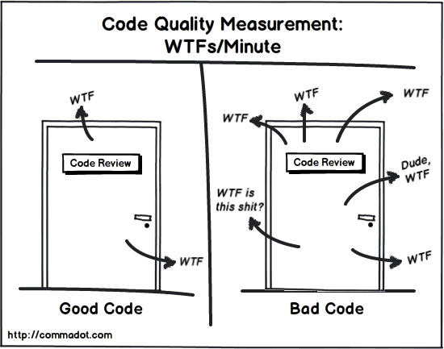

## 1. SOLID.

SOLID es el acrónimo que acuñó *Michael Feathers*, basándose en los principios de la programación orientada a objetos que *Robert C. Martin* había recopilado en el año 2000 en su paper *"Design Principles and Design Patterns"*.

Ocho años más tarde, el tío Bob siguió compendiando consejos y buenas prácticas de desarrollo y se convirtió en el padre del código limpio con su célebre libro *"Clean Code"*.

Entre los objetivos de tener en cuenta estos 5 principios a la hora de escribir código encontramos:

   - Crear un software eficaz: que cumpla con su cometido y que sea robusto y estable.

   - Escribir un código limpio y flexible ante los cambios: que se pueda modificar fácilmente según necesidad, que sea reutilizable y mantenible.

   - Permitir escalabilidad: que acepte ser ampliado con nuevas funcionalidades de manera ágil.

En este sentido la aplicación de los principios SOLID está muy relacionada con la comprensión y el uso de patrones de diseño, que nos permitirán mantener una alta cohesión y, por tanto, un bajo acoplamiento de software. En definitiva, desarrollar un software de calidad.

El acoplamiento se refiere al grado de interdependencia que tienen dos unidades de software entre sí, entendiendo por unidades de software: clases, subtipos, métodos, módulos, funciones, bibliotecas, etc.

Si dos unidades de software son completamente independientes la una de la otra, decimos que están ***desacopladas***.

La cohesión de software es el grado en que elementos diferentes de un sistema permanecen unidos para alcanzar un mejor resultado que si trabajaran por separado. Se refiere a la forma en que podemos agrupar diversas unidades de software para crear una unidad mayor.

Los principios SOLID son eso: principios, es decir, ***buenas prácticas*** que pueden ayudar a escribir un mejor código... ***más limpio***, ***mantenible*** y ***escalable***.

Como indica el propio *Robert C. Martin* en su artículo *“Getting a SOLID start”* no se trata de reglas, ni leyes, ni verdades absolutas, sino más bien soluciones de sentido común a problemas comunes. Son heurísticos, basados en la experiencia: *“se ha observado que funcionan en muchos casos; pero no hay pruebas de que siempre funcionen, ni de que siempre se deban seguir.”*

Dice el tío Bob, que SOLID nos ayuda a categorizar lo que es un buen o mal código y es innegable que un código limpio tenderá más a salir airoso del *“control de calidad de código”* ***WTFs/Minute***. Consejo: cuando estés revisando un código, lleva la cuenta de cuántas veces por minuto sale de tu boca un ***WTF?***.



## 2. Principios de SOLID.

Los principios SOLID son un conjunto de cinco principios de diseño orientado a objetos introducidos por *Robert C. Martin*. Estos principios son fundamentales para escribir software limpio, mantenible y escalable.

Los 5 principios SOLID son:

### 2.1. **S** - **Principio de Responsabilidad Única** *("**S**ingle Responsibility Principle" - SRP)*
   
**Definición**: Un módulo o clase debe tener solo una razón para cambiar, lo que significa que debe tener solo una tarea o responsabilidad.

Este principio establece que cada módulo o clase debe tener responsabilidad sobre una sola parte de la funcionalidad proporcionada por el software y esta responsabilidad debe estar encapsulada en su totalidad por la clase. Todos sus servicios deben estar estrechamente alineados con esa responsabilidad.

**Ejemplo**: Considera un módulo de sistema de gestión de pedidos que gestiona tanto los pedidos de los clientes como la logística de los mismos. Según el SRP, debemos dividir este módulo en dos clases: una para gestionar los pedidos y otra para manejar la logística.

```kotlin
// Antes: Violación del SRP
class OrderManager {
   fun processOrder(order: Order) {
       // procesa el pedido
   }
   fun calculateShippingCosts(order: Order) {
       // calcula los costes de envío
   }
}

// Después: Aplicando el SRP
class OrderProcessor {
   fun processOrder(order: Order) {
       // procesa el pedido
   }
}

class ShippingCalculator {
   fun calculateShippingCosts(order: Order) {
       // calcula los costes de envío
   }
}
```

### 2.2. **O** - **Principio de Abierto/Cerrado** *("**O**pen/Closed Principle" - OCP)*

**Definición**: Las entidades de software (clases, módulos, funciones, etc.) deben estar abiertas para la extensión, pero cerradas para la modificación. Es decir, se debe poder extender el comportamiento de la entidad pero sin modificar su código fuente.

**Ejemplo**: Implementar un sistema de descuentos donde nuevos tipos de descuento puedan ser añadidos sin cambiar el código existente.

```kotlin
interface Discount {
   fun applyDiscount(amount: Double): Double
}

class ChristmasDiscount : Discount {
   override fun applyDiscount(amount: Double): Double {
       return amount * 0.90 // 10% de descuento
   }
}

class NewYearDiscount : Discount {
   override fun applyDiscount(amount: Double): Double {
       return amount * 0.85 // 15% de descuento
   }
}

// La clase Checkout no necesita ser modificada para añadir nuevos tipos de descuentos
class Checkout(private val discount: Discount) {
   fun calculatePrice(originalAmount: Double): Double {
       return discount.applyDiscount(originalAmount)
   }
}
```

### 2.3. **L** - **Principio de Substitución de Liskov** *("**L**iskov Substitution Principle" - LSP)*

**Definición**: Los objetos de una superclase deben poder ser reemplazados con objetos de sus subclases sin afectar la correctitud del programa.

Este principo puede definirse como: «cada clase que hereda de otra puede usarse como su padre sin necesidad de conocer las diferencias entre ellas».

**Ejemplo**: Extender la funcionalidad de una clase de vehículo asegurando que las subclases puedan sustituir a la superclase.

```kotlin
open class Vehicle {
   open fun startEngine(): Boolean {
       // lógica para arrancar el motor
       return true
   }
}

class ElectricCar : Vehicle() {
   override fun startEngine(): Boolean {
       // lógica específica para arrancar un motor eléctrico
       return true
   }
}

fun startVehicle(vehicle: Vehicle) {
   if (vehicle.startEngine()) {
       println("Vehículo arrancado.")
   } else {
       println("Falló al arrancar el vehículo.")
   }
}
```

### 2.4. **I** - **Principio de Segregación de la Interfaz** *("**I**nterface Segregation Principle" - ISP)*

**Definición**: Los clientes no deben ser forzados a depender de interfaces que no utilizan.

Este principio establece que los clientes de un programa dado sólo deberían conocer aquellos métodos del programa que realmente usan, y no aquellos que no necesitan usar.

**Ejemplo**: Dividir una interfaz grande en interfaces más pequeñas y específicas.

```kotlin
// Antes: Violación del ISP
interface Worker {
   fun work()
   fun eat()
}

// Después: Aplicando el ISP
interface Workable {
   fun work()
}

interface Eatable {
   fun eat()
}

class HumanWorker : Workable, Eatable {
   override fun work() {
       // trabajar
   }
   override fun eat() {
       // comer
   }
}

class RobotWorker : Workable {
   override fun work() {
       // trabajar
   }
}
```   

### 2.5. **D** - **Principio de Inversión de Dependencias** *("**D**ependency Inversion Principle" - DIP)*

**Definición**: Este principio consta de dos partes:

* Módulos de alto nivel no deben depender de módulos de bajo nivel. Ambos deben depender de abstracciones.
* Las abstracciones no deberían depender de detalles. Los detalles debieran depender de abstracciones.

El principio de inversión de dependencia establece que nuestras clases deben depender de interfaces o clases abstractas en lugar de clases y funciones concretas.

En su artículo (2000), el tío Bob resume este principio de la siguiente manera:

`"Si el OCP establece el objetivo de la arquitectura OO, el DIP establece el mecanismo principal"`

**Ejemplo**: Usar una interfaz para desacoplar la lógica de notificación de la implementación concreta de envío de mensajes.

```kotlin
// Código que no cumple DIP...
// NotificationService depende directamente de la implementación concreta EmailSender en lugar de depender de una abstracción.
// Esto hace que NotificationService esté directamente acoplado a EmailSender, lo que reduce la flexibilidad y la capacidad de
// extender el código.

class EmailSender {
    fun sendMessage(message: String) {
        println("Enviando email: $message")
    }
}

class NotificationService {
    private val sender = EmailSender()
    
    fun notifyUser(message: String) {
        sender.sendMessage(message)
    }
}
```

```kotlin
// Solución para cumplir DIP...

interface MessageSender {
  fun sendMessage(message: String)
}

class EmailSender : MessageSender {
  override fun sendMessage(message: String) {
      println("Enviando email: $message")
  }
}

class NotificationService(private val sender: MessageSender) {
  fun notifyUser(message: String) {
      sender.sendMessage(message)
  }
}
```

En este ejemplo, `NotificationService` depende de la abstracción `MessageSender`, no de su implementación concreta, cumpliendo con el DIP. Esto permite cambiar fácilmente la forma en que se envían 
las notificaciones (por ejemplo, a SMS) sin modificar `NotificationService`.

Si en un futuro quisiéramos ampliar la funcionalidad y enviar notificaciones a través de SMS o RRSS, tendríamos que modificar NotificationService directamente, lo cual va en contra del principio DIP.

Para realizar este cambio en ambas versiones de la aplicación tendríamos que realizar lo siguiente:

```kotlin
// Versión que viola DIP...
// La ampliación de la funcionalidad nos obligaría a modificar la clase NotificationService

class EmailSender {
    fun sendMessage(message: String) {
        println("Enviando email: $message")
    }
}

class SmsSender {
    fun sendMessage(message: String) {
        println("Enviando SMS: $message")
    }
}

class SocialMediaSender {
    fun sendMessage(message: String) {
        println("Publicando en redes sociales: $message")
    }
}

class NotificationService {
    private val emailSender = EmailSender()
    private val smsSender = SmsSender()
    private val socialMediaSender = SocialMediaSender()
    
    fun notifyUserByEmail(message: String) {
        emailSender.sendMessage(message)
    }
    
    fun notifyUserBySms(message: String) {
        smsSender.sendMessage(message)
    }
    
    fun notifyUserOnSocialMedia(message: String) {
        socialMediaSender.sendMessage(message)
    }
}
```

Sin embargo, nuestra nueva versión que si cumple DIP es más flexible y no tan dependiente, lo cuál es una ventaja a la hora de escalar el código y ampliar funcionalidades.

```kotlin
// Definimos la interfaz de abstracción
interface MessageSender {
    fun sendMessage(message: String)
}

// Implementación para enviar emails
class EmailSender : MessageSender {
    override fun sendMessage(message: String) {
        println("Enviando email: $message")
    }
}

// Implementación para enviar SMS
class SmsSender : MessageSender {
    override fun sendMessage(message: String) {
        println("Enviando SMS: $message")
    }
}

// Implementación para publicar en redes sociales
class SocialMediaSender : MessageSender {
    override fun sendMessage(message: String) {
        println("Publicando en redes sociales: $message")
    }
}

// Servicio de notificación que depende de la abstracción, no de la implementación
class NotificationService(private val sender: MessageSender) {
    fun notifyUser(message: String) {
        sender.sendMessage(message)
    }
}
```

Para usar NotificationService con diferentes métodos de envío de mensajes en la versión que sigue el DIP, crearíamos una instancia de NotificationService pasando el sender específico
(por ejemplo, EmailSender, SmsSender, o SocialMediaSender) en el momento de la creación. 

Esto permite cambiar el método de envío de mensajes sin necesidad de modificar el código de NotificationService, manteniendo las dependencias desacopladas y facilitando la extensión y 
mantenimiento del sistema.
