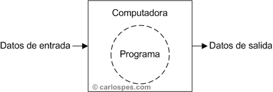
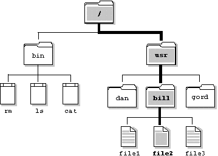
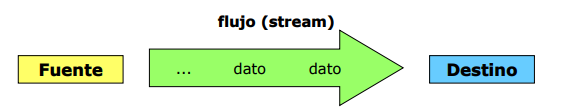
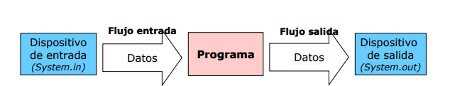
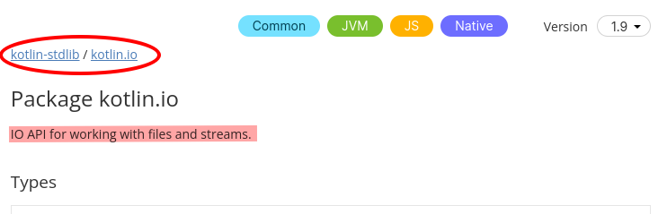

## 7.1 Sistema de archivos

La principal función de una aplicación informática es la manipulación y transformación de datos. Estos datos pueden representar cosas muy diferentes según el contexto del programa: notas de estudiantes, una recopilación de temperaturas, las fechas de un calendario, etc. Las posibilidades son ilimitadas. Todas estas tareas de manipulación y transformación se llevan a cabo normalmente mediante el almacenamiento de los datos en variables, dentro de la memoria del ordenador, por lo que se pueden aplicar operaciones, ya sea mediante operadores o la invocación de métodos.

Desgraciadamente, todas estas variables solo tienen vigencia mientras el programa se está ejecutando. **Una vez el programa finaliza, los datos que contienen desaparecen**. Esto no es problema para programas que siempre tratan los mismos datos, que pueden tomar la forma de literales dentro del programa. O cuando el número de datos a tratar es pequeño y se puede preguntar al usuario. Ahora bien, imagínate tener que introducir las notas de todos los estudiantes cada vez que se ejecuta el programa para gestionarlas. No tiene ningún sentido. Por tanto, en algunos casos, aparece la necesidad de poder registrar los datos en algún soporte de memoria externa, para que se mantengan de manera persistente entre diferentes ejecuciones del programa, o incluso si se apaga el ordenador.

La manera más sencilla de lograr este objetivo es almacenar la información aprovechando **el sistema de archivos** que ofrece el sistema operativo. Mediante este mecanismo, es posible tener los datos en un formato fácil de manejar e independiente del soporte real, ya sea un soporte magnético como un disco duro, una memoria de estado sólido, como un lápiz de memoria USB, un soporte óptico, cinta, etc.

En esta unidad se explican distintas clases de **Kotlin** que nos permiten crear, leer, escribir y eliminar desde distintas fuentes, tanto entrada/salida estándar como ficheros y directorios. También se introduce la serialización de objetos como mecanismo de gran utilidad para almacenar objetos en ficheros para luego recuperarlos en tiempo de ejecución.

### 1. Gestión de archivos

Entre las funciones de un sistema operativo está la de ofrecer mecanismos genéricos para gestionar sistemas de archivos.
Normalmente, dentro de un sistema operativo moderno (o ya no tanto moderno), se espera disponer de algún tipo de interfaz o explorador para poder gestionar archivos, ya sea gráficamente o usando una línea de comandos de texto. Si bien la forma en que los datos se guardan realmente en los dispositivos físicos de almacenamiento de datos puede ser muy diferente según cada tipo (magnético, óptico, etc.), la manera de gestionar el sistema de archivos suele ser muy similar en la inmensa mayoría de los casos: una estructura jerárquica con **carpetas** y **ficheros**.

Ahora bien, en realidad, la capacidad de operar con el sistema de archivos no es exclusiva de la interfaz ofrecida por el sistema operativo. Muchos lenguajes de programación proporcionan bibliotecas que permiten acceder directamente a los mecanismos internos que ofrece el sistema, por lo que es posible crear código fuente desde el que, con las instrucciones adecuadas, se pueden realizar operaciones típicas de un explorador de archivos. De hecho, las interfaces como un explorador de archivos son un programa como cualquier otro, el cual, usando precisamente estas librerías, permite que el usuario gestione archivos fácilmente. Pero es habitual encontrar otras aplicaciones con su propia interfaz para gestionar archivos, aunque solo sea para poder seleccionar qué hay que cargar o guardar en un momento dado: editores de texto, compresores, reproductores de música, etc.

#### 1.1. Flujos

En Kotlin, heredado de Java, se define la abstracción de stream (flujo) para tratar la comunicación de información entre el programa y el exterior.

Las características principales:    

  - Entre una fuente y un destino fluye una secuencia de datos.
  - Los flujos actúan como interfaz con el dispositivo o clase asociada. Es decir, todo se trata como un flujo de datos.
  - Las operaciones que se realizan son independientes del tipo de datos y del dispositivo: `Open, Close, Read, Write`.
  - El uso de flujos proporciona mayor flexibilidad (p.e. redirección, combinación)
  - El uso de flujos proporciona mayor diversidad de dispositivos (ficheros, entrada/salida estándar: teclado y pantalla, sockets en red, …). Todo se maneja como un flujo de datos.
  - El uso de flujos proporciona modos de acceso: secuencial, aleatorio.
  - El uso de flujos proporciona intercambio de información en diferentes formatos: caracteres de texto, binario, objetos.

#### 1.2. Entrada/Salida estándar   

Como en los sistemas Unix, existen 3 interfaces básicas para leer/escribir información:

* Entrada estándar - habitualmente el teclado   
* Salida estándar - habitualmente la consola   
* Salida de error - habitualmente la consola   

En Java se accede a la E/S estándar a través de campos estáticos de la clase `java.lang.System`

* `System.in` implementa la entrada estándar    
* `System.out` implementa la salida estándar    
* `System.err` implementa la salida de error    

#### 1.3. APIs para el manejo de flujos de datos

Kotlin no es ninguna excepción, y ofrece este tipo de biblioteca en forma del conjunto de clases dentro del [`Package kotlin.io`](https://kotlinlang.org/api/latest/jvm/stdlib/kotlin.io/) (IO API for working with files and streams). En java, lo podemos encontrar en *`package java.io`*.   

Mediante la invocación de los métodos adecuados definidos en estas clases es posible llevar a cabo prácticamente cualquier tarea sobre el sistema de archivos.

## Fuente
* [Entra y salida](https://www.fdi.ucm.es/profesor/jpavon/poo/2.13.EntradaySalida.pdf)
