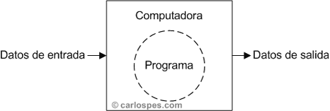
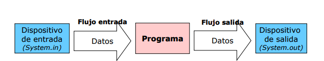
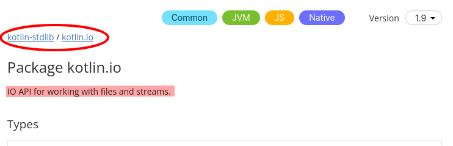

## 7.1 Sistemas de archivos

La mayor parte de los programas trabajan con datos: notas, pedidos, usuarios, imágenes, registros de actividad o configuraciones. Mientras el programa se está ejecutando, esos datos suelen vivir en memoria. El problema aparece cuando la aplicación termina: **lo que estaba en memoria se pierde**.

Por eso, dentro del resultado de aprendizaje 5, este tema es especialmente importante. Nos ayuda a comprender **qué posibilidades de entrada/salida ofrece el lenguaje y qué librerías podemos usar** para leer, escribir y conservar información. Además, sienta la base para los criterios relacionados con el uso de **ficheros** para almacenar y recuperar datos.

> El tema está relacionado con el resultado de aprendizaje 5.   


!!! abstract "Qué vas a aprender en este apartado"
    - Diferenciar memoria temporal y almacenamiento persistente.
    - Identificar ficheros, directorios, rutas y metadatos básicos.
    - Entender qué es un flujo de entrada/salida.
    - Reconocer las APIs principales de Kotlin y Java para trabajar con E/S.

<figure markdown>

<figcaption>Un programa procesa datos en memoria, pero necesita mecanismos de entrada/salida para conservarlos o compartirlos.</figcaption>
</figure>

### 1. ¿Por qué necesitamos almacenar datos?

Una variable permite guardar información mientras el programa está en ejecución, pero no sirve para conservarla de una sesión a otra. Si cerramos la aplicación, los datos desaparecen. Esto no supone un problema cuando:

- los datos son fijos y ya están escritos en el código;
- el programa trabaja con muy poca información;
- o el usuario puede volver a introducirla sin esfuerzo.

Sin embargo, en la mayoría de aplicaciones reales eso no es suficiente. Imagina cualquiera de estos casos:

- una app que guarda las notas del alumnado;
- un programa que registra incidencias;
- una aplicación que lee una configuración al arrancar;
- un sistema que exporta resultados a un informe de texto.

En todos esos ejemplos necesitamos **persistencia**, es decir, que la información permanezca disponible aunque el programa termine o incluso aunque el ordenador se apague.

!!! note "Idea clave"
    La memoria es rápida, pero temporal. Los ficheros permiten conservar la información en un soporte persistente.

### 2. ¿Qué es un sistema de archivos?

El sistema operativo ofrece un mecanismo para organizar y localizar la información almacenada en discos, memorias SSD, unidades USB y otros soportes. Ese mecanismo es el **sistema de archivos**.

Desde el punto de vista del usuario y del programador, normalmente se organiza como una estructura jerárquica formada por:

- **directorios o carpetas**, que agrupan información;
- **ficheros o archivos**, que contienen datos;
- **rutas**, que indican dónde está cada elemento.

<figure markdown>

<figcaption>Los sistemas de archivos suelen representarse como una jerarquía de carpetas y ficheros.</figcaption>
</figure>

Gracias a esta organización, un programa puede crear, localizar, leer, modificar, copiar o borrar información sin necesitar conocer cómo se almacena físicamente en el dispositivo.

#### 2.1. Conceptos básicos

- **Fichero**: unidad de información almacenada. Puede contener texto, imágenes, audio, datos binarios u objetos serializados.
- **Directorio**: contenedor que permite organizar otros directorios y ficheros.
- **Ruta**: secuencia que identifica la localización de un fichero o directorio dentro del sistema.
- **Directorio de trabajo**: carpeta desde la que se ejecuta el programa o proyecto y que sirve de referencia para muchas rutas relativas.
- **Metadatos**: información asociada al fichero, como nombre, tamaño, fecha de modificación o permisos.

!!! info "Ojo con las extensiones"
    La extensión de un fichero, como `.txt` o `.jpg`, ayuda a identificarlo, pero no garantiza por sí sola su contenido real. Es una convención útil, no una prueba absoluta.

#### 2.2. Rutas absolutas y relativas

Una **ruta absoluta** indica la localización completa desde la raíz del sistema de archivos:

- Windows: `C:\Usuarios\ana\documentos\notas.txt`
- Linux/macOS: `/home/ana/documentos/notas.txt`

Una **ruta relativa** parte del directorio de trabajo actual:

- `datos/notas.txt`
- `./config/app.properties`

En proyectos de desarrollo, las rutas relativas suelen ser más cómodas porque hacen el código más portable. Si escribes una ruta absoluta que solo existe en tu ordenador, probablemente fallará en el equipo de otra persona.

!!! tip "Buena práctica"
    Evita, salvo que sea imprescindible, las rutas absolutas escritas a mano dentro del código fuente.

### 3. Ficheros, directorios y tipos de acceso

No todos los datos se tratan igual. Antes de programar operaciones de entrada/salida conviene distinguir varias ideas:

#### 3.1. Ficheros de texto y ficheros binarios

- **Ficheros de texto**: almacenan caracteres y suelen poder abrirse con un editor de texto. Son útiles para configuraciones, CSV, logs o informes.
- **Ficheros binarios**: almacenan la información en formato no legible directamente a simple vista. Son habituales en imágenes, audio, vídeo, ejecutables o datos serializados.

Esta diferencia importa porque cambia la forma de leer y escribir la información. No se trabaja igual con una línea de texto que con una secuencia de bytes.

#### 3.2. Acceso secuencial y acceso aleatorio

- **Acceso secuencial**: los datos se procesan en orden, de principio a fin.
- **Acceso aleatorio**: el programa puede ir directamente a una posición concreta del fichero.

En esta unidad veremos primero los casos más habituales y sencillos, que suelen ser los secuenciales.

### 4. ¿Qué es un flujo de entrada/salida?

Cuando un programa se comunica con el exterior, normalmente lo hace mediante un **flujo** o *stream*. Un flujo es una abstracción que representa el paso de datos desde una **fuente** hasta un **destino**.

<figure markdown>

<figcaption>Los flujos permiten tratar de forma uniforme la comunicación entre el programa y distintos orígenes o destinos de datos.</figcaption>
</figure>

Algunas ideas importantes sobre los flujos:

- entre una fuente y un destino circula una secuencia de datos;
- el programa no necesita tratar cada dispositivo físico de forma completamente distinta;
- muchas operaciones se repiten: abrir, leer, escribir y cerrar;
- un mismo modelo sirve para teclado, pantalla, ficheros, red o memoria.

Podemos trabajar con flujos de:

- **caracteres**, cuando tratamos texto;
- **bytes**, cuando trabajamos con datos binarios;
- **objetos**, cuando serializamos y recuperamos estructuras completas.

!!! definition "Definición"
    Un flujo de entrada/salida es una abstracción que permite leer o escribir datos de forma secuencial entre un programa y una fuente o destino externo.

### 5. Entrada estándar, salida estándar y salida de error

Antes de trabajar con ficheros, conviene recordar que un programa también se comunica con la consola. En los sistemas tipo Unix, y también en la mayoría de entornos actuales, existen tres canales básicos:

<figure markdown>

<figcaption>Canales básicos de entrada/salida que aparecen en programas de consola.</figcaption>
</figure>

- **Entrada estándar**: normalmente el teclado.
- **Salida estándar**: normalmente la consola.
- **Salida de error**: canal específico para mensajes de error.

En la plataforma JVM estos canales se representan mediante:

- `System.in`
- `System.out`
- `System.err`

En Kotlin, además, solemos usar funciones de más alto nivel como `print()`, `println()`, `readln()` o `readlnOrNull()` para interactuar con la consola de forma más cómoda.

```kotlin
fun main() {
    print("Introduce tu nombre: ")
    val nombre = readln()
    println("Hola, $nombre")
}
```

Este ejemplo no trabaja todavía con ficheros, pero sí muestra una operación de entrada/salida: el programa **lee** desde teclado y **escribe** en pantalla.

### 6. APIs que usaremos en la unidad

Kotlin, al ejecutarse sobre la JVM, puede combinar utilidades propias con librerías de Java. En esta unidad nos moveremos principalmente entre estas tres familias:

#### 6.1. `kotlin.io`

Incluye funciones y extensiones de alto nivel para tareas frecuentes, por ejemplo:

- lectura desde consola con `readln()` y `readlnOrNull()`;
- lectura de texto con `readText()` o `readLines()`;
- escritura sencilla con `writeText()` y `appendText()`.

#### 6.2. `java.io`

Es la API clásica de Java para trabajar con ficheros y flujos. Aquí aparece, por ejemplo, la clase `File`, junto con lectores, escritores y flujos de bytes.

#### 6.3. `java.nio.file`

Es la API más moderna de Java para rutas y operaciones sobre el sistema de archivos. Destacan `Path` y `Files`, muy útiles cuando necesitamos trabajar con rutas de forma más robusta.

<figure markdown>

<figcaption>Kotlin aporta utilidades de alto nivel y, además, puede aprovechar las APIs de Java para trabajar con E/S.</figcaption>
</figure>

!!! question "¿Qué veremos después?"
    - En `7.2` nos centraremos en la consola y el teclado.
    - En `7.3` estudiaremos la clase `File`.
    - En `7.4` trabajaremos con lectura y escritura de ficheros.

### 7. De la teoría a la práctica

Observa este ejemplo sencillo:

```kotlin
import java.io.File

fun main() {
    print("Escribe una incidencia: ")
    val incidencia = readln()

    File("incidencias.txt").appendText("$incidencia\n")
    println("Incidencia guardada")
}
```

Este programa combina varias ideas del tema:

- usa la **entrada estándar** para leer desde teclado;
- usa la **salida estándar** para informar al usuario;
- utiliza un **fichero** para conservar información;
- y emplea librerías del lenguaje para realizar operaciones de E/S.

Es justo el tipo de base conceptual que exige el RA5: reconocer posibilidades de entrada/salida y aplicar librerías adecuadas según la necesidad.

### 8. Buenas prácticas iniciales

Antes de profundizar en clases y métodos concretos, conviene quedarse con estas recomendaciones:

- utiliza rutas relativas cuando trabajes dentro de un proyecto;
- diferencia claramente texto y binario;
- valida la entrada del usuario antes de guardarla;
- no des por hecho que un fichero existe;
- maneja errores de lectura y escritura con cuidado;
- usa funciones de alto nivel cuando simplifiquen el código sin ocultarte lo importante.

!!! warning "Error frecuente"
    Confundir “tener una ruta” con “tener el fichero”. Que una ruta exista como texto no significa que el fichero exista realmente en el sistema.

### 9. Resumen

En este apartado has visto que:

- la memoria del programa no basta cuando necesitamos persistencia;
- el sistema de archivos organiza la información mediante ficheros, carpetas y rutas;
- la entrada/salida se modela mediante flujos;
- consola, teclado y ficheros forman parte del mismo problema general de E/S;
- Kotlin y Java ofrecen librerías específicas para trabajar con estas situaciones.

Con esta base ya podemos entrar en detalle en las herramientas concretas que usaremos para leer, escribir y gestionar información en nuestros programas.

## Fuentes y referencias

- [Kotlin Docs - Read standard input](https://kotlinlang.org/docs/read-standard-input.html)
- [Kotlin Stdlib - Package `kotlin.io`](https://kotlinlang.org/api/core/kotlin-stdlib/kotlin.io/)
- [Oracle Java SE - `java.io.File`](https://docs.oracle.com/en/java/javase/21/docs/api/java.base/java/io/File.html)
- [Oracle Java SE - `java.nio.file.Path`](https://docs.oracle.com/en/java/javase/21/docs/api/java.base/java/nio/file/Path.html)
- [Apuntes de entrada y salida - UCM](https://www.fdi.ucm.es/profesor/jpavon/poo/2.13.EntradaySalida.pdf)

## Presentación

- [PR-U7.1 - Sistema de archivos](https://revilofe.github.io/slides/section1-pr/PR-U7.1.-SistemaArchivos.html)
