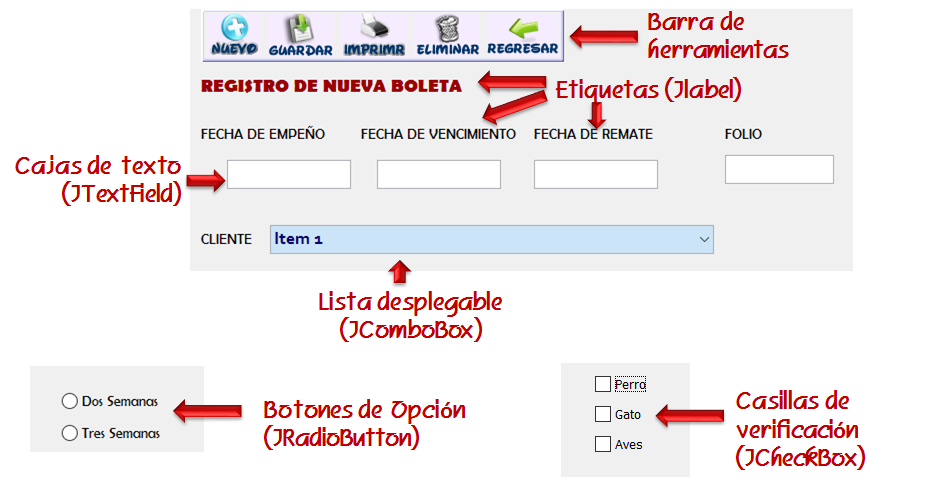
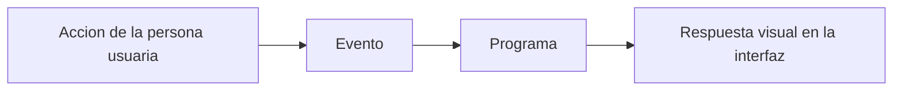

## 7.5 Interfaces gráficas de usuario

Hasta ahora, en esta unidad, hemos trabajado la entrada y salida a través de
la consola y los ficheros. Eso nos ha permitido entender cómo un programa lee
datos, los procesa y devuelve un resultado. El siguiente paso es estudiar qué
ocurre cuando esa interacción ya no se hace escribiendo comandos, sino usando
elementos visuales.

Ahí aparecen las **interfaces gráficas de usuario** o **GUI** (*Graphical User
Interface*). Antes de programarlas, conviene entender qué problema resuelven,
qué elementos suelen contener y qué principios hacen que una interfaz sea útil
en lugar de confusa.

| Código | Descripción |
|--------|-------------|
| RA5 | Realiza operaciones de entrada y salida de información, utilizando procedimientos específicos del lenguaje y librerías de clases. |
| CE f | Se han utilizado las herramientas del entorno de desarrollo para crear interfaces gráficas de usuario simples. |
| CE g | Se han programado controladores de eventos. |
| CE h | Se han escrito programas que utilicen interfaces gráficas para la entrada y salida de información. |

!!! abstract "Qué vas a aprender en este tema"
    - Distinguir una interfaz de consola de una interfaz gráfica.
    - Reconocer los elementos más habituales de una GUI.
    - Entender qué criterios hacen que una interfaz sea usable.
    - Relacionar las GUI con la entrada, la salida y los eventos.
    - Preparar el terreno para trabajar después con Jetpack Compose.

### 1. De la consola a la interfaz gráfica

En una aplicación de consola, la comunicación con la persona usuaria se hace
normalmente mediante texto: el programa muestra mensajes, pide datos y espera
una respuesta. Este modelo sigue siendo muy útil, sobre todo para scripts,
herramientas técnicas o automatización.

Sin embargo, muchas aplicaciones reales necesitan una interacción más directa e
intuitiva. En vez de escribir instrucciones, la persona usuaria pulsa botones,
rellena campos, selecciona opciones o navega por menús. Ese cambio de canal es
precisamente lo que introduce una GUI.

| Aspecto | CLI | GUI |
|--------|-----|-----|
| Entrada habitual | Teclado | Ratón, teclado, pantalla táctil |
| Salida habitual | Texto | Texto, iconos, botones, ventanas, imágenes |
| Curva de aprendizaje | Mayor si hay muchos comandos | Suele ser más amigable |
| Uso frecuente | Scripts, terminal, administración | Aplicaciones móviles, web y escritorio |

!!! note "Idea clave"
    Una GUI no sustituye siempre a una CLI. Son dos formas distintas de interacción, y cada una es más adecuada según el contexto.

### 2. Qué problema resuelve una GUI

El objetivo real de una interfaz gráfica no es decorar un programa. Su función
es **hacer comprensible la interacción**.

Una buena GUI ayuda a responder preguntas como estas:

- qué puede hacer la aplicación;
- qué estoy viendo ahora;
- qué pasará si pulso aquí;
- si algo falla, cómo me doy cuenta;
- cómo vuelvo atrás o corrijo un dato.

Dicho de forma sencilla, una GUI útil reduce fricción. Hace que la persona
usuaria tenga menos que recordar, menos que interpretar y menos que adivinar.

### 3. Elementos habituales de una interfaz gráfica

Aunque cada plataforma tenga su propio estilo, la mayoría de interfaces se
construyen con piezas parecidas. En muchas bibliotecas estas piezas se llaman
**componentes** o **widgets**.

Los elementos más comunes son:

- etiquetas de texto;
- botones;
- campos de entrada;
- casillas de verificación;
- listas;
- iconos;
- menús;
- barras de navegación;
- paneles o contenedores.

<figure markdown>

<figcaption>Ejemplo general de elementos frecuentes en una interfaz gráfica.</figcaption>
</figure>

### 4. Qué hace que una interfaz sea buena

Una interfaz puede ser técnicamente correcta y, aun así, resultar incómoda o
confusa. Por eso, al hablar de GUI no basta con pensar en “poner controles en
pantalla”. También hay que pensar en **usabilidad**.

Una interfaz suele funcionar bien cuando cumple estas ideas:

- **claridad**: cada elemento debe tener un propósito reconocible;
- **consistencia**: acciones parecidas deben comportarse de forma parecida;
- **retroalimentación**: el sistema debe indicar qué ha ocurrido;
- **eficiencia**: las tareas habituales deben requerir pocos pasos;
- **accesibilidad**: el contenido debe poder entenderse y utilizarse con facilidad.

#### 4.1. Errores frecuentes al diseñar una GUI

Muchos problemas de interfaz no aparecen por grandes fallos técnicos, sino por
decisiones pequeñas que se van acumulando:

- exceso de información en la misma pantalla;
- nombres poco claros en botones o menús;
- uso inconsistente de colores o iconos;
- falta de mensajes de error o confirmación;
- contraste insuficiente;
- distribución desordenada de los elementos.

En la práctica, esto significa que una aplicación puede “funcionar” y seguir
siendo difícil de usar.

### 5. GUI y eventos

En una interfaz gráfica casi todo gira alrededor de los **eventos**. Un evento
es una acción que ocurre en la interfaz y que el programa debe atender.

Ejemplos típicos:

- pulsar un botón;
- escribir en un campo;
- seleccionar un elemento de una lista;
- cerrar una ventana;
- cambiar de pantalla.

Desde el punto de vista de programación, esto conecta directamente con la idea
de **entrada y salida** que ya conoces:

- la entrada ya no llega solo por consola, también llega como eventos;
- la salida ya no se imprime solo con texto, también se representa en pantalla.

### 6. Dónde encontramos interfaces gráficas

Las GUI aparecen en contextos muy distintos:

- **aplicaciones móviles**, como las de Android o iOS;
- **aplicaciones de escritorio**, como editores, lanzadores o gestores;
- **aplicaciones web**, donde la interfaz se representa en el navegador;
- **sistemas embebidos**, paneles y dispositivos especializados;
- **videojuegos**, donde la interfaz forma parte de la experiencia de uso.

Lo importante no es memorizar plataformas, sino entender que en todos los
casos se repite la misma idea: la interfaz representa el estado actual del
programa y reacciona a lo que hace la persona usuaria.

### 7. Qué necesitamos antes de programar una GUI

Antes de construir interfaces conviene tener claras tres ideas:

1. qué información voy a mostrar;
2. qué acciones podrá realizar la persona usuaria;
3. qué eventos deben producir cambios en la pantalla.

Si no puedes responder a esas tres preguntas, es fácil terminar construyendo
interfaces desordenadas o difíciles de mantener.

!!! tip "Preparación mental para el siguiente bloque"
    En los próximos apartados de la unidad ya no nos centraremos solo en “qué es una GUI”, sino en cómo programarla con Kotlin usando Jetpack Compose.

### 8. Conclusión

La idea más importante de este tema es que una interfaz gráfica no es un adorno
del programa. Es la capa mediante la que la persona usuaria entiende qué puede
hacer la aplicación, introduce datos y recibe respuesta.

Por eso, antes incluso de hablar de código, hay que tener claras tres cosas:
**componentes, eventos y usabilidad**. Con esa base, ya tiene sentido entrar en
una herramienta concreta para construir interfaces. En nuestro caso, esa
herramienta será **Jetpack Compose**.

### 9. Siguiente paso

En [7.5.1 Jetpack Compose: introducción y primeros componentes](/prog/unidad7/7.5.1)
veremos cómo se trasladan estas ideas al código Kotlin en Android.
