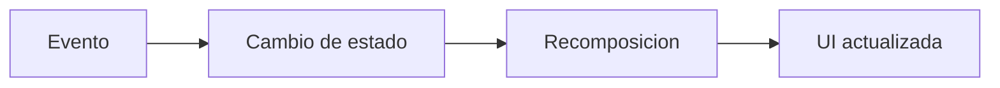
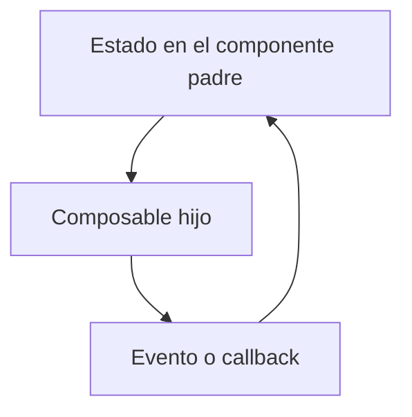

## 7.5.2 Jetpack Compose: estado, eventos y maquetación

En [7.5.1 Jetpack Compose: introducción y primeros componentes](/prog/unidad7/7.5.1)
hemos visto cómo se define una interfaz con composables, cómo se carga con
`setContent` y qué papel juegan componentes como `Text`, `Button`, `Row` o
`Column`.

Ahora toca el paso más importante: hacer que la interfaz **responda** a lo que
hace la persona usuaria. Para eso necesitamos entender dos ideas: **evento** y
**estado**.

| Código | Descripción |
|--------|-------------|
| RA5 | Realiza operaciones de entrada y salida de información, utilizando procedimientos específicos del lenguaje y librerías de clases. |
| CE f | Se han utilizado las herramientas del entorno de desarrollo para crear interfaces gráficas de usuario simples. |
| CE g | Se han programado controladores de eventos. |
| CE h | Se han escrito programas que utilicen interfaces gráficas para la entrada y salida de información. |

!!! abstract "Qué vas a aprender en este tema"
    - Qué es el estado en una interfaz Compose.
    - Cómo se conecta un evento con un cambio visual en pantalla.
    - Cómo leer el patrón `remember { mutableStateOf(...) }`.
    - Cómo estructurar formularios sencillos con Compose.
    - Qué significa flujo de datos unidireccional.

### 1. La idea central: la interfaz depende del estado

Si tuvieras que quedarte solo con una idea de Compose, debería ser esta:

**la interfaz es una representación del estado actual de la aplicación**.

El estado puede ser, por ejemplo:

- el texto escrito en un campo;
- el número de veces que se ha pulsado un botón;
- si un elemento está marcado o no;
- el mensaje que debe mostrarse en pantalla;
- la lista de elementos visibles en una vista.

Cuando el estado cambia, la interfaz debe reflejar ese cambio.



### 2. Cómo leer `remember { mutableStateOf(...) }`

En muchos ejemplos de Compose aparece este patrón:

```kotlin
var contador by remember { mutableStateOf(0) }
```

Si se ve por primera vez, puede parecer demasiado críptico. Conviene leerlo por
partes:

- `mutableStateOf(0)` crea un valor observable que puede cambiar;
- `remember { ... }` conserva ese valor entre recomposiciones;
- `by` permite usar la variable de forma más cómoda, sin escribir `.value`.

Dicho de forma sencilla, esta línea significa:

> “Guarda un dato que la interfaz va a observar y que puede cambiar durante la vida de la pantalla”.

!!! note "Qué debes entender aquí"
    No hace falta memorizar de golpe la mecánica interna. Lo importante en este punto es reconocer que el estado es un dato que la UI observa para decidir qué mostrar.

### 3. Un ejemplo mínimo: contador con feedback visual

Antes vimos botones con `println()`, pero didácticamente eso devuelve al modelo
de consola. En una GUI tiene más sentido que la respuesta del evento se vea en
la propia pantalla.

```kotlin
@Composable
fun ContadorSimple() {
    var contador by remember { mutableStateOf(0) }

    Column(modifier = Modifier.padding(16.dp)) {
        Text(text = "Has pulsado $contador veces")

        Button(onClick = { contador++ }) {
            Text("Incrementar")
        }
    }
}
```

Este ejemplo enseña mucho más de lo que parece:

1. hay un estado, `contador`;
2. la interfaz muestra ese estado;
3. el botón genera un evento con `onClick`;
4. el evento cambia el estado;
5. la UI se actualiza.

### 4. Campos de texto y actualización inmediata

Una interfaz no solo responde a clics. También puede reaccionar cuando la
persona usuaria escribe.

```kotlin
@Composable
fun EditorNombre() {
    var nombre by remember { mutableStateOf("") }

    Column(modifier = Modifier.padding(16.dp)) {
        TextField(
            value = nombre,
            onValueChange = { nombre = it },
            label = { Text("Nombre") }
        )

        Text(text = "Hola, $nombre")
    }
}
```

Aquí, cada vez que cambia el contenido del `TextField`, cambia también el
estado `nombre`, y la interfaz vuelve a representarse con el nuevo valor.

### 5. Formularios sencillos

Una de las primeras aplicaciones reales de Compose en clase suele ser la
creación de un pequeño formulario.

```kotlin
@Composable
fun FormularioSaludo() {
    var nombre by remember { mutableStateOf("") }
    var mensaje by remember { mutableStateOf("Escribe tu nombre") }

    Column(
        modifier = Modifier
            .fillMaxWidth()
            .padding(16.dp)
    ) {
        Text(
            text = "Ejemplo de formulario",
            style = MaterialTheme.typography.titleMedium
        )

        Spacer(modifier = Modifier.size(12.dp))

        TextField(
            value = nombre,
            onValueChange = { nombre = it },
            label = { Text("Nombre") },
            modifier = Modifier.fillMaxWidth()
        )

        Spacer(modifier = Modifier.size(12.dp))

        Button(
            onClick = {
                mensaje = if (nombre.isBlank()) {
                    "Debes introducir un nombre"
                } else {
                    "Hola, $nombre"
                }
            }
        ) {
            Text("Mostrar saludo")
        }

        Spacer(modifier = Modifier.size(12.dp))
        Text(text = mensaje)
    }
}
```

#### 5.1. Qué enseña realmente este ejemplo

Este formulario sirve para trabajar al mismo tiempo:

- entrada de datos;
- validación básica;
- botones con eventos;
- actualización visible del resultado;
- organización de componentes en vertical.

Desde el punto de vista docente, es un ejemplo especialmente útil porque
permite ver todo el flujo completo en una pantalla pequeña.

### 6. Flujo de datos unidireccional

En Compose conviene mantener una regla mental muy simple:

- los **datos bajan** hacia los componentes;
- los **eventos suben** mediante funciones o callbacks.



Este patrón hace que la interfaz sea más fácil de entender y de mantener,
porque deja más clara la responsabilidad de cada componente.

### 7. `State Hoisting`: subir el estado al componente padre

Cuando una pantalla empieza a crecer, no conviene que cada componente hijo
gestione su propio estado sin criterio. En muchos casos, resulta más limpio que
el estado viva en el componente padre y que los hijos solo reciban:

- el valor que deben mostrar;
- la función que deben invocar cuando ese valor cambie.

A esta técnica se la conoce como **State Hoisting**.

Dicho de forma sencilla:

- el componente padre **posee el estado**;
- el componente hijo **muestra el valor**;
- el componente hijo **eleva el evento** cuando algo cambia.

#### 7.1. Patrón general

Un componente hijo que aplica `State Hoisting` suele tener una forma parecida a
esta:

```kotlin
@Composable
fun CampoNombre(
    nombre: String,
    onNombreChange: (String) -> Unit
) {
    TextField(
        value = nombre,
        onValueChange = onNombreChange,
        label = { Text("Nombre") }
    )
}
```

Aquí el componente `CampoNombre`:

- no crea el estado;
- no usa `remember`;
- no decide dónde se guarda el dato;
- solo pinta el valor y notifica el cambio.

#### 7.2. Ejemplo completo con padre e hijo

```kotlin
@Composable
fun PantallaAlumno() {
    var nombre by remember { mutableStateOf("") }

    Column(modifier = Modifier.padding(16.dp)) {
        CampoNombre(
            nombre = nombre,
            onNombreChange = { nombre = it }
        )

        Spacer(modifier = Modifier.size(12.dp))
        Text(text = "Alumno actual: $nombre")
    }
}

@Composable
fun CampoNombre(
    nombre: String,
    onNombreChange: (String) -> Unit
) {
    TextField(
        value = nombre,
        onValueChange = onNombreChange,
        label = { Text("Nombre") }
    )
}
```

En este ejemplo:

1. `PantallaAlumno` guarda el estado `nombre`;
2. `CampoNombre` recibe ese valor;
3. cuando la persona usuaria escribe, el hijo llama a `onNombreChange`;
4. el padre actualiza el estado;
5. la interfaz se recompone.

#### 7.3. Por qué merece la pena usarlo

`State Hoisting` aporta ventajas muy prácticas:

- hace los componentes hijos más reutilizables;
- deja más clara la responsabilidad de cada bloque;
- evita duplicar estados sin necesidad;
- facilita probar y mantener la interfaz;
- encaja de forma natural con el flujo de datos unidireccional.

!!! tip "Regla útil"
    Si un componente hijo solo necesita mostrar un valor y avisar cuando cambia, normalmente es buen candidato para aplicar `State Hoisting`.

### 8. Maquetación básica de pantallas

Además de manejar estado, debemos saber colocar bien los elementos en pantalla.
Para eso seguimos usando `Column`, `Row` y `Box`, pero ahora con una intención
más clara.

#### 8.1. `Column`

Sirve para apilar contenido en vertical. Es ideal para formularios y bloques de
información.

```kotlin
@Composable
fun PanelVertical() {
    Column(modifier = Modifier.padding(16.dp)) {
        Text("Datos del alumno")
        TextField(value = "", onValueChange = {})
        Button(onClick = {}) { Text("Guardar") }
    }
}
```

#### 8.2. `Row`

Sirve para colocar elementos en horizontal. Es muy habitual en barras de
acciones, parejas de botones o distribución de controles.

```kotlin
@Composable
fun AccionesFila() {
    Row(modifier = Modifier.padding(16.dp)) {
        Button(onClick = {}) {
            Text("Aceptar")
        }
        Spacer(modifier = Modifier.size(8.dp))
        Button(onClick = {}) {
            Text("Cancelar")
        }
    }
}
```

#### 8.3. `Box`

`Box` es un contenedor más libre. Puede usarse para superponer elementos o para
alinearlos dentro de una misma región.

```kotlin
@Composable
fun CajaCentrada() {
    Box(
        modifier = Modifier.size(120.dp),
        contentAlignment = Alignment.Center
    ) {
        Text("Centro")
    }
}
```

Aquí sí estamos centrando el contenido de forma explícita con
`contentAlignment = Alignment.Center`. Esta precisión es importante para no dar
la falsa impresión de que `Box` centra automáticamente.

### 9. Listas con `LazyColumn`

Cuando hay varios elementos repetidos, Compose ofrece componentes perezosos como
`LazyColumn`, que resultan más adecuados que construir manualmente cada bloque.

```kotlin
@Composable
fun ListaModulos() {
    val modulos = listOf("Programacion", "Bases de datos", "Entornos")

    LazyColumn {
        items(modulos) { modulo ->
            Text(
                text = modulo,
                modifier = Modifier.padding(12.dp)
            )
        }
    }
}
```

Este tipo de componente se usa mucho en:

- catálogos;
- menús;
- mensajes;
- historiales;
- listas de tareas.

### 10. Buenas prácticas al empezar

Cuando se empieza con Compose, hay varios errores muy repetidos. Merece la pena
prevenirlos desde el principio:

- crear composables demasiado grandes;
- mezclar lógica de negocio con la lógica visual;
- no distinguir qué dato cambia y cuál es fijo;
- actualizar cosas “a mano” en vez de pensar en términos de estado;
- construir pantallas sin una estructura clara.

Estas pautas conectan directamente con errores que ya hemos señalado en temas
anteriores de interfaz:

- si no nombras bien los controles, la UI se vuelve confusa;
- si no organizas el contenido, la pantalla se vuelve difícil de usar;
- si no controlas el estado, el comportamiento de la aplicación se vuelve
  difícil de mantener.

!!! warning "Regla práctica"
    Si una pantalla te cuesta explicar con claridad qué estado maneja y qué eventos la modifican, probablemente todavía no está bien diseñada.

### 11. Meta operativa del tema

Al acabar este apartado deberías poder:

- crear una pantalla simple con varios componentes;
- capturar un evento de botón o de escritura;
- guardar un estado local sencillo;
- decidir cuándo conviene subir ese estado al componente padre;
- mostrar en pantalla un resultado que cambie al interactuar.

### 12. Mini actividad guiada

Construye una pantalla que permita:

1. escribir un nombre;
2. pulsar un botón `Validar`;
3. mostrar uno de estos dos mensajes:
   `Debes escribir un nombre` o `Nombre correcto`.

Objetivos de la actividad:

- usar `TextField`;
- manejar `onValueChange`;
- reaccionar a `onClick`;
- actualizar el contenido con una variable de estado.

Si quieres subir un poco el nivel, separa el `TextField` en un composable hijo y
aplica `State Hoisting`.

### 13. Conclusión

Jetpack Compose cobra sentido de verdad cuando entiendes que la interfaz no se
modifica “a golpes”, sino que se vuelve a representar a partir del estado. Por
eso el patrón fundamental no es solo “crear botones”, sino enlazar
**componentes, eventos y estado** de forma coherente.

Si manejas esa idea, ya puedes construir pantallas pequeñas pero completas:
leer datos, reaccionar a acciones y mostrar resultados visuales de forma clara.
