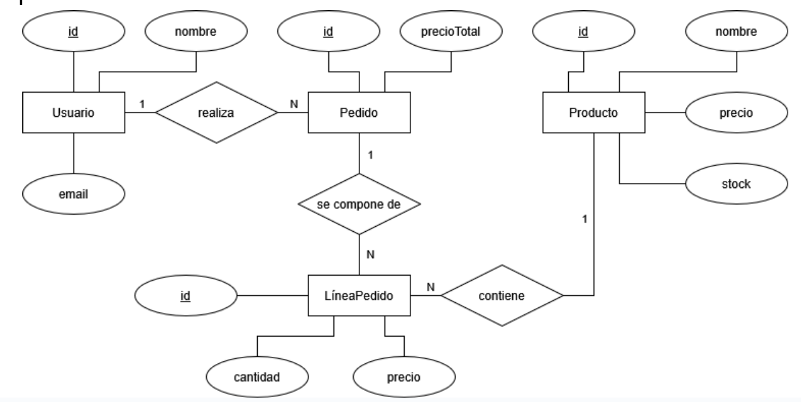

## P6.1 - Actividades con Bases de Datos H2

#### **Ejercicio 1: Instalación, configuración y conexión con H2**

1. Instala la base de datos H2 en tu entorno de desarrollo.
2. Configura la base de datos para que funcione en modo fichero.
3. Cambia el PATH de la base de datos. Usa por ejemplo: `./data/tienda`.
4. Crea un programa en Kotlin para establecer conexión con H2, asegurando el uso de `try-catch` para manejar errores correctamente.

#### **Ejercicio 2: Creación de tablas e inserciones con manejo de errores**

##### Modelo Entidad-Relación: 

##### Código SQL para crear las tablas:

```sql
CREATE TABLE Usuario (
  id INT AUTO_INCREMENT PRIMARY KEY,
  nombre VARCHAR(255) NOT NULL,
  email VARCHAR(255) UNIQUE
);

CREATE TABLE Producto (
  id INT AUTO_INCREMENT PRIMARY KEY,
  nombre VARCHAR(255) NOT NULL,
  precio DECIMAL NOT NULL,
  stock INT NOT NULL
);

CREATE TABLE Pedido (
  id INT AUTO_INCREMENT PRIMARY KEY,
  precioTotal DECIMAL NOT NULL,
  idUsuario INT,
  FOREIGN KEY (idUsuario) REFERENCES Usuario(id)
);

CREATE TABLE LineaPedido (
  id INT AUTO_INCREMENT PRIMARY KEY,
  cantidad INT NOT NULL,
  precio DECIMAL NOT NULL,
  idPedido INT,
  idProducto INT,
  FOREIGN KEY (idPedido) REFERENCES Pedido(id),
  FOREIGN KEY (idProducto) REFERENCES Producto(id)
);
```

##### Inserciones a realizar desde Kotlin:

> Pista: los id son autoincrementales, por lo que no hace falta incluirlos en la inserción. Se asignan automáticamente.

**Usuarios**


| nombre             | email            |
| ------------------ | ---------------- |
| Facundo Pérez     | facuper@mail.com |
| Ataulfo Rodríguez | ataurod@mail.com |
| Cornelio Ramírez  | Cornram@mail.com |

**Productos**


| nombre     | precio (€) | stock |
| ---------- | ----------- | ----- |
| Ventilador | 10          | 2     |
| Abanico    | 150         | 47    |
| Estufa     | 24.99       | 1     |

**Pedidos**


| idUsuario | precioTotal (€) |
| --------- | ---------------- |
| 2         | 160              |
| 1         | 20               |
| 2         | 150              |

**Líneas de pedido**


| idPedido | idProducto | cantidad | precio (€) |
| -------- | ---------- | -------- | ----------- |
| 1        | 1          | 1        | 10          |
| 1        | 2          | 1        | 150         |
| 2        | 1          | 2        | 20          |
| 3        | 2          | 1        | 150         |

#### **Ejercicio 3: Consultas con manejo de errores**

1. Mostrar todas las líneas de pedido del pedido con ID = 1.
2. Mostrar la suma del importe total de los pedidos realizados por el usuario «Ataulfo Rodríguez».
3. Mostrar los nombres de los usuarios que hayan comprado un «Abanico».

#### **Ejercicio 4: Eliminaciones con manejo de errores**

1. Elimina al usuario "Cornelio Ramírez".
2. Elimina el producto con un precio de 24,99 €.
3. Elimina el pedido con id igual a 4, asegurándote de eliminar primero sus líneas de pedido si existieran.

#### **Ejercicio 5: Modificaciones con manejo de errores**

1. Modifica el precio del producto «Abanico» para ponerlo en oferta (por ejemplo, 120 €).
2. Modifica la línea de pedido con id = 3:
   - Cambia el producto a "Abanico" (id = 2)
   - Cambia el precio al doble del precio actual del "Abanico".

#### **Ejercicio 6: Pool de conexiones con HikariCP**

1. Crea un programa en Kotlin usando HikariCP para insertar el siguiente usuario:


| nombre             | email            |
| ------------------ | ---------------- |
| Reinaldo Girúndez | reingir@mail.com |

2. Realiza una consulta que muestre los pedidos realizados por "Facundo Pérez".
