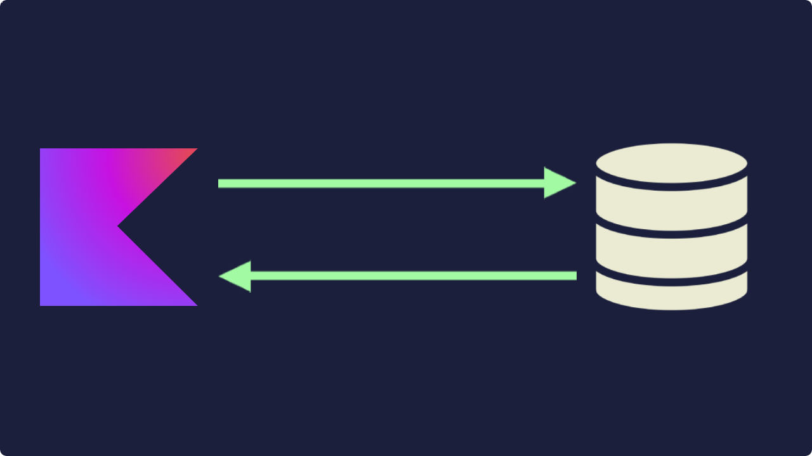
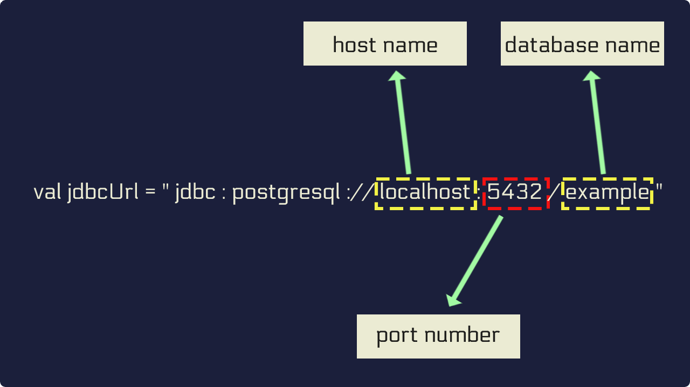

# Cómo acceder a una base de datos con Kotlin usando JDBC: los fundamentos

## 1. Aprenda cómo se accede a las bases de datos a bajo nivel usando JDBC



Acceder a las bases de datos es una tarea común en el desarrollo de aplicaciones. Todas las aplicaciones del lado del servidor acceden a las bases de datos de una forma u otra. En lo que respecta a Kotlin, hereda un rico conjunto de bibliotecas del mundo Java, gracias a la interoperabilidad. Estas bibliotecas brindan características deslumbrantes como ORM, SQL con seguridad de tipos, etc.

Sin embargo, si estás haciendo esto por primera vez, es posible que todas las bibliotecas sofisticadas no tengan mucho sentido ahora mismo. Para ponerlo en marcha, haremos una introducción a JDBC.

En este punto, trabajaremos sobre:

1. ¿Qué es JDBC? ¿Y cómo usarlo con Kotlin?
2. ¿Qué es una URL de JDBC?
3. Cómo establecer una conexión con una base de datos y ejecutar consultas SQL.
4. ¿Qué es la agrupación de conexiones y cómo implementarla con **HikariCP**?

### 1.1. **¿Qué es JDBC?**

JDBC significa **Conectividad de base de datos Java**. Es una biblioteca de bajo nivel que proporciona funcionalidad para interactuar con una base de datos. Para usar JDBC no tienes que depender de ninguna biblioteca de terceros. Viene incluido con todos los JDK que existen.

### 1.2. ¿Cómo usar JDBC con Kotlin?

Los pasos para trabajar con JDBC son los siguientes:

* **Paso 1:** Prepara una tabla en tu base de datos
* **Paso 2:** Encuentre el controlador JDBC de su base de datos y agréguelo a su proyecto
* **Paso 3:** Establecer una conexión mediante una URL de JDBC
* **Paso 4:** Escribir y ejecutar consultas SQL

#### 1.2.1. Prepara una tabla

Vamos a crear una tabla llamada `users` y llenarla con algunos datos. En el ejemplo usaremos PostgreSQL, pero puedes utilizar la base de datos que sea más de tu agrado.

crear una tabla

```SQL
-- SERIAL is similar to INTEGER AUTOINCREMENT
CREATE TABLE  users (id SERIAL PRIMARY KEY, name VARCHAR(20));
view rawjdbc.sql hosted with ❤ by GitHub
```

llenarlo con datos

```SQL
INSERT INTO users (name) VALUES
  ('Kohli'),
  ('Rohit'),
  ('Bumrah'),
  ('Dhawan');
```

Ahora el resultado de una consulta `SELECT * FROM users` se parece a esto.

```
SELECT * FROM users;

 id |  name  
----+--------
  1 | Kohli
  2 | Rohit
  3 | Bumrah
  4 | Dhawan
(4 rows)
```

#### 1.2.2. Agregue el controlador JDBC a su proyecto

Para acceder a estos datos desde su código Kotlin, debe incluir el controlador JDBC de su base de datos como una dependencia de Gradle. Usaremos el DBMS PostgreSQL. Si no está usando PostgreSQL, deberás encontrar el controlador JDBC de la base de datos que estás utilizando. Una simple búsqueda en Google sería suficiente.

```kotlin
dependencies {
  implementation("org.postgresql:postgresql:42.3.1")
}
```

Ahora, veremos cómo recuperar los datos de la base de datos.

#### 1.2.3 Establecer una conexión de base de datos a través de una URL de JDBC

Para crear una conexión a la base de datos, necesitaremos una URL de JDBC como la siguiente:

```kotlin
fun main(){
    val jdbcUrl = "jdbc:postgresql://localhost:5432/example"
}
```

Como se puede ver, la URL de JDBC consta de tres componentes principales. A continuación vemos una versión desglosada de una URL de JDBC

1. El `host name` = `localhost`
2. El `port number` = `5432`
3. El `database name` = `example`



Para crear una conexión, usa el método `DriverManager.getConnection`, pasando la URl y el login y password para conectar a la base de datos.

```kotlin
import java.sql.DriverManager

// the model class
data class User(val id: Int, val name: String)

fun main(){

    val jdbcUrl = "jdbc:postgresql://localhost:5432/example"

    // get the connection
    val connection = DriverManager
        .getConnection(jdbcUrl, "postgres", "postgres")
}
```

Como comentábamos:

1. el primer argumento del método `DriverManager.getConnection` es la `URL JDBC`.
2. el segundo argumento es el `username` de la base de datos.
3. el último argumento es el `password`de ese usuario en particular.

El método `DriverManager.getConnection` devolverá un objeto `Connection`. Podremos verificar si la conexión es válida o no usando el método `isValid()` del objeto `Connection`.

```kotlin
import java.sql.DriverManager

// the model class
data class User(val id: Int, val name: String)

fun main(){

    val jdbcUrl = "jdbc:postgresql://localhost:5432/example"

    // get the connection
    val connection = DriverManager
        .getConnection(jdbcUrl, "postgres", "postgres")

    // prints true if the connection is valid
    println(connection.isValid(0))
}
```

#### 1.2.4. Escribir y ejecutar consultas SQL

Antes de ejecutar las consultas, tendremos que creear las clases que almacenarán los resultados.

##### Crear una clase para el modelo

Primero, cree una clase modelo para representar los datos que estamos a punto de recibir de la base de datos.

```kotlin
// create a model class
data class User(val id: Int, val name: String)
```

##### Escribir y ejecutar consultas SQL

Ahora, puedes escribir y ejecutar consultas SQL usando la conexión. Pero como JDBC es una biblioteca de bajo nivel, todo debe hacerse a mano.

Para ejecutar una consulta `SELECT` usando la conexión necesitas:

1. Preparar una sentencia SQL: `Statement`
2. Ejecutar la `Statement`, que devolverá un objeto `ResultSet`
3. Iterar a través de `ResultSet`y recuperar valores con métodos como `getInt`o`getString`

Considera el siguiente ejemplo:

```kotlin
import java.sql.DriverManager

// the model class
data class User(val id: Int, val name: String)

fun main(){

    val jdbcUrl = "jdbc:postgresql://localhost:5432/example"

    // get the connection
    val connection = DriverManager
        .getConnection(jdbcUrl, "postgres", "postgres")

    // prints true if the connection is valid
    println(connection.isValid(0))

    // the query is only prepared not executed
    val query = connection.prepareStatement("SELECT * FROM users")

    // the query is executed and results are fetched
    val result = query.executeQuery()

    // an empty list for holding the results
    val users = mutableListOf<User>()

    while(result.next()){

        // getting the value of the id column
        val id = result.getInt("id")

        // getting the value of the name column
        val name = result.getString("name")

        /*
        constructing a User object and
        putting data into the list
         */
        users.add(User(id, name))
    }
    /*
    [User(id=1, name=Kohli), User(id=2, name=Rohit),
    User(id=3, name=Bumrah), User(id=4, name=Dhawan)]
     */
    println(users)
}
```

## 2. ¿Qué es una agrupación de conexiones (connection pooling)?

No se puede realizar una introducción a las bases de datos sin hablar de la agrupación de conexiones o pool de conexiones.

Imagínate que estás escribiendo una aplicación del lado del servidor. Cada vez que un usuario necesita acceder a la base de datos, abrirá una nueva conexión de base de datos para obtener datos. Esto es ineficiente porque abrir una conexión a la base de datos es una tarea costosa y no debe hacerse una y otra vez. Este es exactamente el problema que puede resolver el pool de conexiones.

Al utilizar un pool de conexiones, puedes abrir múltiples conexiones que estarán activas durante la vida útil de la aplicación. Estas conexiones se encapsularán en un archivo `DataSource`. Siempre que necesites acceder a la base de datos, en lugar de crear una nueva conexión, le pedirás al `DataSource` una conexión. El `DataSource` te cederá una conexión desde el pool de conexiones. Cuando termines la operación sobre la base de datos, la conexión retornará al pool de conexiones y volverá a estar disponible para su uso.

La mayoría de las bibliotecas y marcos de trabajo que te facilitan la conexión a las base de datos ya traen consigo una API adecuada para solucionar este problema. **HikariCP** es una de las mejores bibliotecas que satisface este problema. Por defecto, utiliza 10 conexiones como límite máximo, y es fácilmente modificable. Si quieres obtener más información sobre la configuración del tamaño del pool, consulta esta guía: [**Sobre la modificación del tamaño del pool**](https://github.com/brettwooldridge/HikariCP/wiki/About-Pool-Sizing) .

Veamos un ejemplo rápido de agrupación de conexiones usando HikariCP.

Comienza agregando la dependencia a tu archivo `build.gradle.kts`.

```kotlin
dependencies {
    implementation ("com.zaxxer:HikariCP:5.0.0")
}
```

Para inicializar un `DataSource` realiza los siguientes pasos:

1. Crea un objeto dataSource con el método `HikariDataSource()`
2. Establece en el objeto dataSource la URL de JDBC
3. Establece en el objeto dataSource el nombre de usuario
4. Establece en el objeto dataSource la contraseña
5. Obtén la conexión de la `DataSource`
6. Usa la conexión de la manera que hemos visto.

Aquí hay un ejemplo de los pasos anteriores:

```kotlin
fun main(){
  
    // create a dataSource
    val dataSource = HikariDataSource()

    // set the jdbcUrl
    dataSource.jdbcUrl = "jdbc:postgresql://localhost:5432/example"

    // set the username
    dataSource.username = "postgres"

    // set the password
    dataSource.password = "postgres"

    println(dataSource.maximumPoolSize)

    // get a connection
    val connection = dataSource.connection

    // the query is only prepared not executed
    val query = connection.prepareStatement("SELECT * FROM users")

    // the query is executed and results are fetched
    val result = query.executeQuery()

    // an empty list for holding the results
    val users = mutableListOf<User>()

    while (result.next()) {

        // getting the value of the id column
        val id = result.getInt("id")

        // getting the value of the name column
        val name = result.getString("name")

        /*
        constructing a User object and
        putting data into the list
         */
        users.add(User(id, name))
    }
  
    /*
    [User(id=1, name=Kohli), User(id=2, name=Rohit),
    User(id=3, name=Bumrah), User(id=4, name=Dhawan)]
     */
    println(users)

}
```

**Nota:** Hay varias formas de inicializar un `DataSource` con `HikariCP`. Lee la [**sección de inicialización**](https://gist.github.com/nilTheDev/c681d54b8c6e85369e3249a40ecf03e5) del archivo README del [**Repositorio HikariCP Github**](https://github.com/brettwooldridge/HikariCP) .

## 3. ¿Por qué necesitamos abstracción adicional sobre JDBC?

Como has podido comprobar si has intentado adaptarlo a alguna consultar de una tabla que tu tengas, acceder a las bases de datos haciendo uso de `JDBC` puro puede convertirse rápidamente en una tarea engorrosa. El proceso es propenso a errores y se requiere mucho trabajo pesado y disciplina por parte del desarrollador. Aquí es donde las bibliotecas y los marcos de trabajo son útiles.

Cuando se trata de bibliotecas y marcos de trabajo para acceder a bases de datos, hay una variedad de opciones para elegir. Puede optar por usar un **ORM** completo como **Hibernate**, o puede usar algo de bajo nivel como **JDBI**. **JDBI** proporciona una capa de abstracción sobre JDBC. También hay algunas bibliotecas Kotlin-first. La más popular es la biblioteca **Exposed** de Jetbrains, que veremos más adelante. **Exposed** viene en dos sabores. Un *lenguaje específico del dominio*, (en inglés domain-specific language, DSL) con seguridad de tipos que hace de envoltorio a SQL y una capa liguera en la que se facilita la implementación de *objetos de acceso a datos* (en inglés data access objects, DAO).

Para obtener una descripción general completa de todas las bibliotecas de bases de datos en el mundo de Java, puedes leer el artículo siguiente: [**Java y bases de datos: una descripción general de las bibliotecas y las API por Marco Behler**](https://www.marcobehler.com/guides/java-databases)

## 4. Conclusiones

1. Puedes acceder a una base de datos a través de la biblioteca de bajo nivel JDBC, que viene incluido con todos los JDK que existen. Entonces, no hay necesidad de otra dependencia.
2. Para conectarse con una base de datos en particular, necesita el controlador JDBC para esa base de datos en particular.
3. Todas las bibliotecas para bases de datos en el mundo JVM están construidas sobre JDBC.
4. Mientras trabaja en un proyecto real, debes utilizar algún mecanismo que te facilite el uso de un pool de conexiones. La agrupación de conexiones le permite mantener viva una pequeña cantidad de conexiones de bases de datos, en lugar de crear una conexión nueva cada vez, (re)utiliza una conexión del pool.
5. HikariCP es una buena opción para usar un pool de conexiones. Por defecto, utiliza 10 conexiones como límite máximo. Y es fácilmente modificable.

Independientemente de la biblioteca que uses, ahora tienes una comprensión básica de lo que sucede debajo del capó mientras consulta su base de datos desde la capa de aplicación.

## 5. Bibliografía

- [El articulo original](https://levelup.gitconnected.com/how-to-access-database-with-kotlin-6b86f6680cd7)
- [El repositorio original](https://github.com/nilTheDev/jdbc-article)

