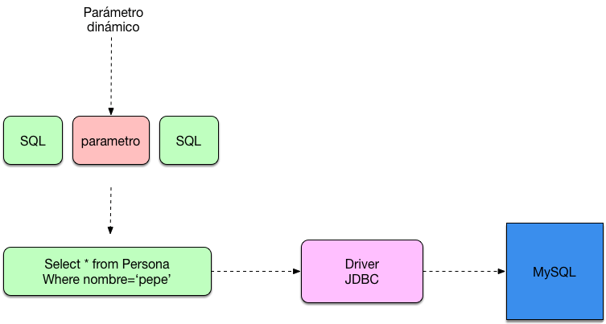
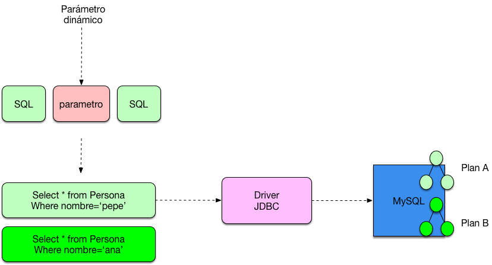
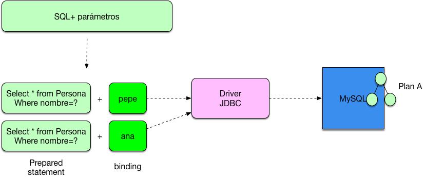

# JDBC Prepared Statement y su manejo

El uso de **JDBC Prepared Statement** es hoy en día prácticamente obligatorio. Aún así hay muchas veces que nos olvidamos de de como usarlos ya que son los frameworks de persistencia **los que los utilizan de forma transparente por  nosotros.** Aún así hay situaciones en las cuales nos podemos encontrar con la necesidad de hacer uso de ellos de forma directa. **¿Cómo funcionan exactamente los JDBC Prepared Statement ?**

## Utilizando JDBC Prepared Statement

Lo primero que tenemos que entender es cual es la diferencia  **entre un Statement de JDBC y un Prepared Statement** . Cuando nosotros construimos una consulta normal de JDBC utilizamos un Statement, este Statement o sentencia lo que se encarga es de definir una consulta SQL a ejecutar contra el motor de la base de datos.

```Kotlin
Connection conexion = DriverManager.getConnection("jdbc:mysql://localhost/prueba", "root","root");
Statement sentencia = conexion.createStatement();
String nombre="pepe";
String consulta = "select * from Persona where nombre='"+nombre+"'";
ResultSet rs=sentencia.executeQuery(consulta);
```

En este caso estamos construyendo una sentencia y aportando  **un parámetro a la consulta de forma dinámica** . Esto básicamente se convierte en una consulta SQL que nosotros ejecutamos vía el driver JDBC contra la base de datos.



Muchas veces se nos olvida que para cada consulta SQL que construimos contra la base de datos se construye un plan de ejecución en el que la base de datos decide como esa consulta se ejecuta.



A dos consultas diferentes **se crean dos planes de ejecución diferentes** aunque ambas consultas sean realmente muy similares y únicamente entre e**n juego el valor del parámetro que las pasamos**. Para solventar este problema existen **los JDBC Prepared statement**. Estas estructuras permiten mantener **las consultas neutras** sin tener en cuenta los parámetros que se las pasa ya que realiza un binding de ellos



De esta forma cuando la base de datos genera un hash para el plan de ejecución ambas consultas, la que consulta por pepe y la que consulta por ana devuelven **el mismo hash y comparten el plan de ejecución**. Vamos a ver esto en código:
```Kotlin
String consulta = "select * from Persona where nombre = ? ";
Connection conexion= DriverManager.getConnection("jdbc:mysql://localhost/prueba", "root", "root");
PreparedStatement sentencia= conexion.prepareStatement(consulta);
sentencia.setString(1, "pepe");
ResultSet rs = sentencia.executeQuery();
```

No solo nos estaremos ahorrando la construcción de planes de ejecución sino que también de la misma manera estamos evitando que nos inyecten SQL **ya que al parametrizar la consulta el API de JDBC nos protege contra este tipo de ataques.** Normalmente el uso de consultas parametrizadas mejora el rendimiento entre un 20 y un 30 % a nivel de base de datos.

### JDBC Prepared Statement y Logs

Hay situaciones en las que necesitamos realizar un log de la consulta SQL , al tratarse de una sentencia preparada solemos hacer un log del String algo como por ejemplo

```Kotlin
String consulta = "select * from Persona where nombre = ? ";
log(consulta);
```

Esto a veces puede ser un problema ya que perdemos los parámetros que se pasan . Sin embargo muchos drivers soportan el log de la propia consulta SQL con los parámetros ya aplicados realizando un log de la propia sentencia


```Kotlin
String consulta = "select * from Persona where nombre = ? ";
        PreparedStatement ps = con.prepareStatement(consulta);
        ps.setString(1, nombre);
        log(ps);

```

Tengámoslo en cuenta, en este caso podremos ver salir por la consola algo del siguiente estilo:
```Kotlin
com.mysql.jdbc.JDBC42PreparedStatement@67424e82: select * from Persona where nombre=’juan’
```
El parámetro aparece.