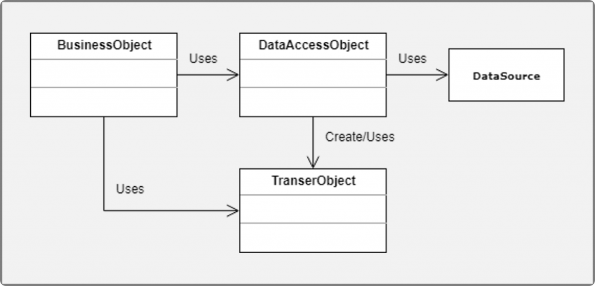
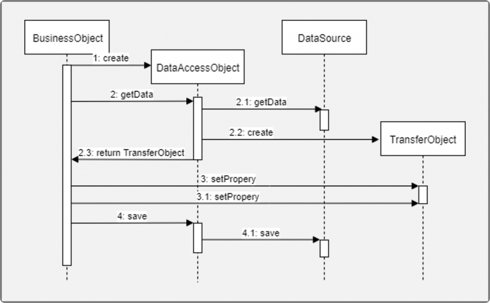
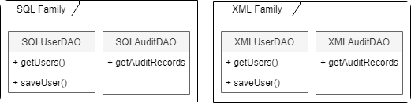
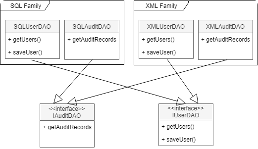
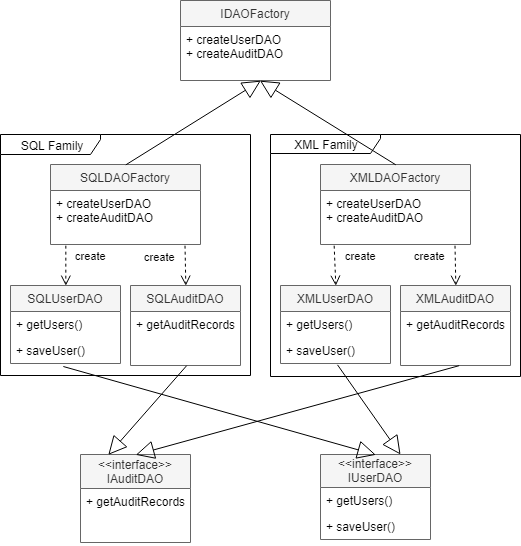
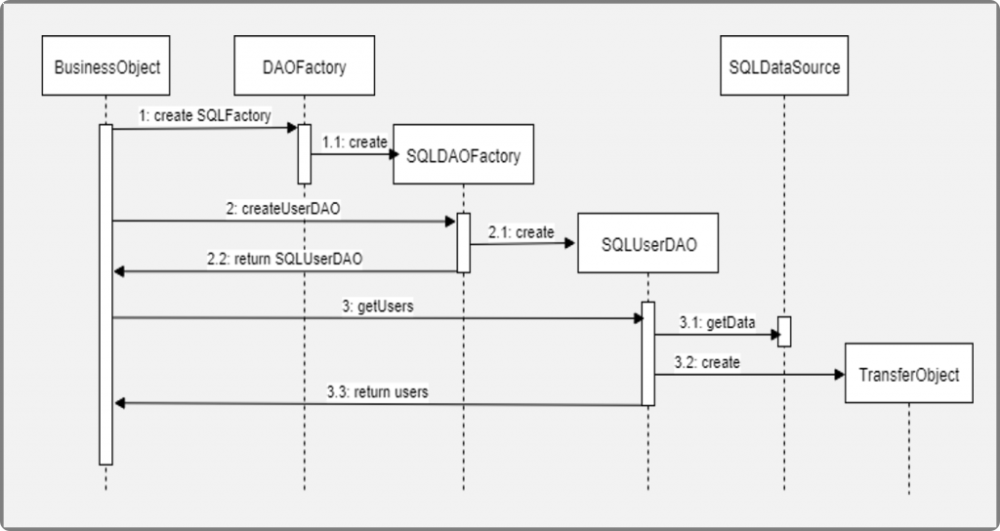

## Data Access Object (DAO) Pattern

Prácticamente todas las aplicaciones de hoy en día, requiere acceso al menos a una fuente de datos, dichas fuentes son por lo general base de datos relacionales, por lo que muchas veces no tenemos problema en acceder a los datos, sin embargo, hay ocasiones en las que necesitamos tener más de una fuente de datos o la fuente de datos que tenemos puede variar, lo que nos obligaría a refactorizar gran parte del código. Para esto, tenemos el patrón Arquitectónico Data Access Object (DAO), el cual permite separar la lógica de acceso a datos de los Bussines Objects u Objetos de negocios, de tal forma que el DAO encapsula toda la lógica de acceso de datos al resto de la aplicación.

### Problemática

Una de las grandes problemáticas al momento de acceder a los datos, es que **la implementación y formato de la información puede variar según la fuente de los datos**. Implementar la lógica de acceso a datos en la capa de lógica de negocio puedes ser un gran problema, pues tendríamos que lidiar con la lógica de negocio en sí, más la implementación para acceder a los datos, adicional, si tenemos múltiples fuentes de datos o estas pueden variar, tendríamos que implementar las diferentes lógicas para acceder las diferentes fuentes de datos, como podrían ser: bases de datos relacionales, No SQL, XML, archivos planos, Webservices, etc).

### Solución

Dado lo anterior, **el patrón DAO propone separar por completo la lógica de negocio de la lógica para acceder a los datos**, de esta forma, el DAO proporcionará los métodos necesarios para insertar, actualizar, borrar y consultar la información; por otra parte, la capa de negocio solo se preocupa por lógica de negocio y utiliza el DAO para interactuar con la fuente de datos.

Los compones que conforman el patrón son:

* *`BusinessObject`* : representa un objeto con la lógica de negocio.
* *`DataAccessObject`* : representa una capa de acceso a datos que oculta la fuente y los detalles técnicos para recuperar los datos.
* *`TransferObject`* : este es un objeto plano que implementa el patrón [Data Transfer Object (DTO)](https://www.oscarblancarteblog.com/2018/11/30/data-transfer-object-dto-patron-diseno/), el cual sirve para transmitir la información entre el DAO y el Business Service.
* *`DataSource`* : representa de forma abstracta la fuente de datos, la cual puede ser una base de datos, Webservices, LDAP, archivos de texto, etc.

El siguiente diagrama muestra mejor la forma en que funciona el patrón, pues muestra de forma secuencial la forma en que se ejecutaría el patrón.

El diagrama se interpreta de la siguiente manera:

1. El `BusinessObject` creo u obtiene una referencia al  `DataAccessObject` .
2. El `BusinessObject` solicita información al `DataAccessObject`
    * El `DataAccessObject` solicita la información al `DataSource`
    * El `DataAccessObject` crea una instancia del TransferObject con los datos recuperados del `DataSource`
    * El `DataAccessObject` response con el `TransferObject` creado en los pasos anteriores.
3. El `BusinessObject` actualiza algún valor del `TransferObject`
    * Más actualizaciones
4. El `BusinessObject` solicita el guardado de los datos actualizados al  `DataAccessObject` .
    * El `DataAccessObject` guarda los datos en el  `DataSource` .

Como hemos podido ver, el `BusinessService` no se preocupa de donde vengan los datos ni cómo deben de ser guardados en el `DataSource`, el solo se preocupa por conocer el `TransferObject`. Un error común al implementar este patrón es no utilizar `TransferObject` y en su lugar, regresar los objetos que regresan las mismas API’s de las fuentes de datos, ya que esto obliga al `BusinessService` tener una dependencia con estas librerías, además, si la fuente de datos cambia, también cambiarán estas clases, lo que provocaría una afectación directa al `BusinessService`.

> Hace unos días escribir sobre el patrón [Data Transfer Object (DTO)](https://www.oscarblancarteblog.com/2018/11/30/data-transfer-object-dto-patron-diseno/) por si quieres profundizar en el tema.

### DAO y el patrón Abstract Factory

Hasta este punto solo hemos analizado como trabajaríamos si solo tuviéramos una fuente de datos, sin embargo, existe ocasiones donde requerimos obtener datos de más de una fuente, y es allí donde entra el patrón de diseño [Abstract Factory](https://reactiveprogramming.io/books/design-patterns/es/catalog/abstract-factory)

Mediante el patrón Abstract Factory podemos definir una serie de familias de clases que permitan conectarnos a las diferentes fuentes de datos. Para esto, examinaremos un sistema de autenticación de usuarios, el cual puede leer los usuarios en una base de datos o sobre un XML, adicional, el sistema generara registros de login que podrán ser utilizados para auditorias.

Lo primero sería implementar las clases para acceder de las dos fuentes:

En la imagen anterior podemos apreciar dos familias de clases, con las cuales podemos obtener los Usuarios y los registros de auditoria, sin embargo, estas clases por separado no ayudan mucho, pues no implementan una misma interface que permita la variación entre ellas, por lo que el siguiente paso es crear estas interfaces:

En este punto, los DAO ya implementan una interfaz común, lo que permite intercambiar la implementación sin afectar al Business Object. Sin embargo, ahora solo falta resolver la forma en que el Business Service obtendrá la familiar de interfaces, es por ello que deberemos crear un Factory para cada familia de interfaces:

En esta nueva configuración, podemos ver que tenemos un Factory para cada familia, y los dos factorys implementan una interfaz en común, adicional, tenemos la interface `IDAOFactory` necesaria para que el factory de cada familia implementen una interface en común.

Analicemos como quedaría la secuencia de ejecución

1. El `BusinessObject` solicita la creación de un `DAOFactory` para SQL
    * El `DAOFactory` crea una instancia de la clase *SQLDAOFactory *y la retorna
2. El `BusinessObject` solicita al `SQLDAOFactory` la creación del `SQLUserDAO` para interactuar con los usuarios.
    * El `SQLDAOFactory` crea una nueva instancia del `SQLUserDAO`
    * El `SQLDAOFactory` retorna la instancia creada del `SQLUserDAO`
3. El `BusinessObject` solicita el listado de todos los usuarios registrados al `SQLUserDAO`
    * El `SQLUserDAO` recupera los usuarios del *SQLDataSource*
    * El `SQLUserDAO` crea un `TransferObject` con los datos recuperados del paso anterior.
    * El `SQLUserDAO` retorna el `TransferObject` creado en el paso anterior.

Adicional a los pasos que hemos listado aquí, podríamos solicitar al `SQLDAOFactory` la creación del `SQLAuditDAO` o incluso, solicitar al `DAOFactory` la creación del `XMLFactory` para interactuar con la fuente de datos en XML.

### Conclusiones

El patrón DAO es sin lugar a duda, unos de los más utilizados en la actualidad, ya que es fácil de implementar y proporciona claros beneficios, incluso, si solo tenemos una fuente de datos y esta no cambia, pues permite separar por completo la lógica de acceso a datos en una capa separada y así solo nos preocupamos por la lógica de negocio sin preocuparnos de donde viene los datos o los detalles técnicos para consultarlos o actualizarlos.

## Fuente y Bibliografía

- [Patrón de diseño DTO](https://www.oscarblancarteblog.com/2018/11/30/data-transfer-object-dto-patron-diseno/)
- [Patrón de diseño Abstract Factory](https://reactiveprogramming.io/books/design-patterns/es/catalog/abstract-factory)
