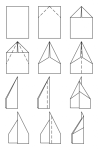
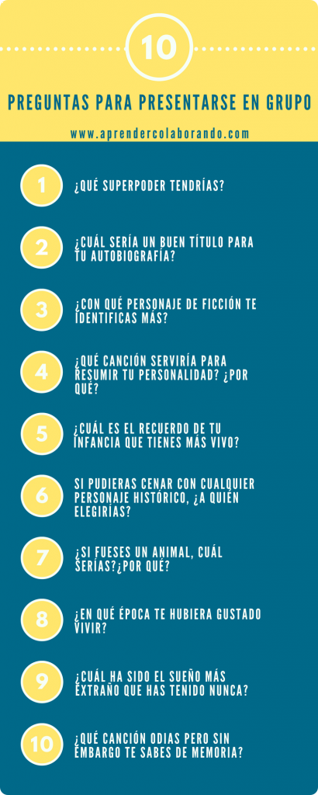

##Dinámica icebreakers

¿Cómo podemos lograr que un grupo se conozca mejor y favorecer un buen ambiente? ¿Cómo podemos experimentarlo mediante algunas técnicas de rompehielos? Los rompehielos (icebreakers) son técnicas muy utilizadas y que consisten básicamente en fomentar un buen ambiente de un grupo que comparte o va a compartir un espacio común. Los hay de muchos tipos y con cientos de variantes que pueden ser introducidas a su vez en diferentes contextos profesionales, educativos o lúdicos. En nuestro caso vamos a implementar una mezcla entre La entrevista y Los aviones de papel.

###PASOS A SEGUIR:

* **Entregar a cada participante un hoja de papel y un rotulador** .
* Pedirles que debajo del papel **escriban sus nombres y varias cuestiones** con las instrucciones que se considere oportuno para el grupo o contexto donde se lleva a cabo.
* Después les pedimos **que hagan un avión de papel** a su gusto. Si no saben podemos mostrarles un modelo sencillo con este:

<figure markdown>
   
  <figcaption>Un avión sencillo</figcaption>
</figure>

* Es importante que una vez realizados,  **lancen los aviones todos a la vez** . Una vez caigan cada uno  **recogerlos y volverlos a lanzar para que se mezclen por la sala** . Así durante un ratito. Aquí se genera un ambiente divertido. ¡Retornamos a la infancia!
* Después de este periodo de tiempo, **pedimos que cada uno coja uno (que no sea el suyo)** y como escribieron el nombre deben  **buscar al dueño de ese avión y hacerle las preguntas** .
* Después de haber recogido las respuestas a las preguntas,  **cada participante debe de anotar esta información en [Mural](https://app.mural.co/invitation/mural/incidentes7894/1664180837364?sender=u2b8bed871fe2bdf5376d3015&key=e0f691d7-c10e-44cc-958d-dc2b70607b3e), sin dejar datos que puedan identificar a la persona.
* El Facilitador (o personas aleatorias del grupo) iran leyendo y presentando los profiles, y entre todos se intentarán asignar a los participantes. Las personas que participaron en la entrevista deberán votar a otros candidatos.
* Finalmente habrá otra ronda en la que se iran descubriendo finalmente la persona de la que se habla en el profile.

###PREGUNTAS
Es importante hacer hincapié y hacerles valorar que se puede ir desde preguntas más clásicas: ¿Qué has estudiado? ¿Cuánto tiempo llevas estudiando aquí? o ¿Cuál es tu experiencias profesional?. Otras tal vez más personales como: ¿Cuáles son tus aficiones? ¿Cuántos hijos tienes? ¿Cuál es tu plato favorito? ¿Dónde te gustan pasar las vacaciones?. Hasta otras más divertidas para pasar de un territorio más informativo y de conocimiento a un territorio más distendido. ¿Qué te llevarías a una isla desierta? Si te reencarnaras en un animal ¿Cuál te gustaría ser? Si pudieras ser un personaje de ficción ¿Quién te gustaría ser?.

Una buena recomendación podría ser: 3 básicas y personales, 4 profesionales y 3 más divertidas.

<figure markdown>
  
  <figcaption>Ejemplo de preguntas.</figcaption>
</figure>

###TIEMPOS

* 5 minutos para poner el nombre, pensar las preguntas y escribirlas en el folio.
* 3 minutos para hacer el avión.
* 3 minutos para lanzar el avión varias veces y conformar las parejas.
* 15 minutos por entrevista, anotando los resultados.
* 5 minutos presentación de profiles y asignación de candidatos.
* 3 por identificación de profile.

###MATERIAL

* Una hoja de papel por persona.
* Un rotulador por persona.

###CONSEJOS Y ANOTACIONES
Este rompehielos  **no es ninguna competición**, nadie gana ni pierde. **La idea de esta actividad es conocerse mejor de forma divertida** y las instrucciones para las preguntas dependen de donde se quiera poner el foco de la actividad de cara a la actividad general que se va a llevar a cabo.

## FUENTES
* https://www.aprendercolaborando.com/3-rompehielos-para-conocerse/
