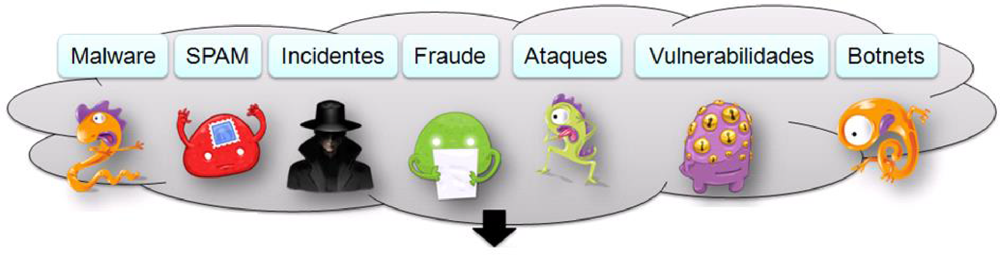
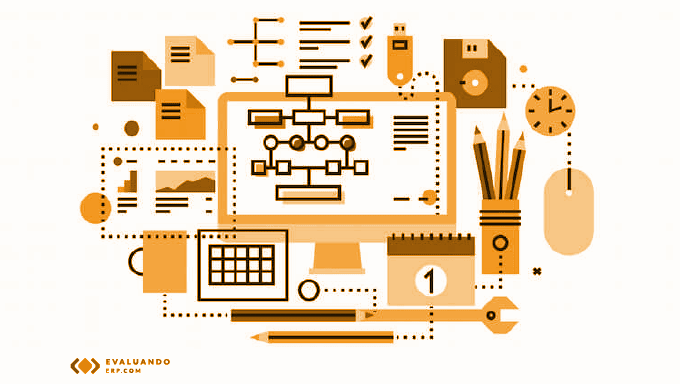
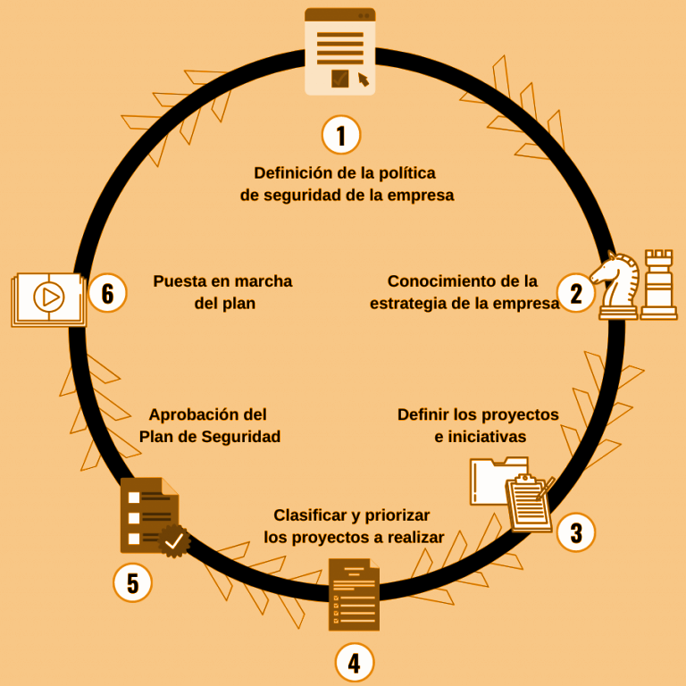
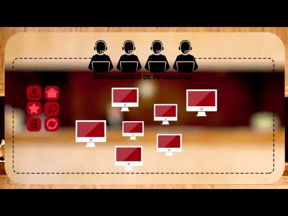

## 1.1.1. Principios generales

Antes de comenzar a trabajar en la ciberseguridad de una organización, es importante tener en cuenta los principios generales que rigen la seguridad de la información. Estos principios son la base sobre la que se construye cualquier estrategia de ciberseguridad y deben ser conocidos y apoyados por la dirección de la organización.

<figure markdown>
  
  <figcaption>Principios generales</figcaption>
</figure>

### 1. Cibserseguridad de sistemas informáticos

La ciberseguridad es un campo complejo que abarca una amplia gama de temas y tecnologías. Antes de profundizar en los detalles, es importante comprender algunos conceptos básicos que son fundamentales para entender la ciberseguridad.

#### 1.1. Ciberseguridad

Imagina que la ciberseguridad es como poner cerraduras, alarmas y cámaras en una casa. Su objetivo es proteger todo lo que hay dentro y evitar que alguien no autorizado entre, dañe o robe algo. En el mundo digital, la ciberseguridad **protege nuestros ordenadores, teléfonos, redes y la información que almacenamos en ellos de ataques, robos de datos o virus**.

Ejemplo práctico: Cuando configuras una contraseña en tu correo electrónico, estás usando ciberseguridad para proteger tu información personal.

#### 1.2. Ciberdefensa

Si la ciberseguridad es poner cerraduras en la casa, la ciberdefensa sería contratar a un guardia de seguridad para vigilar y estar preparado por si alguien intenta entrar. La ciberdefensa se enfoca en **responder a ataques que ya están ocurriendo o evitar que vuelvan a suceder**. Incluye monitorear las redes, detectar comportamientos sospechosos y reaccionar rápidamente.

Ejemplo práctico: Si una empresa detecta un ataque en su sistema, la ciberdefensa entra en acción para detenerlo, buscar de dónde vino y mejorar la seguridad para que no vuelva a pasar.

la ciberseguridad y la ciberdefensa son dos caras de la misma moneda. La ciberseguridad se enfoca en prevenir ataques, mientras que la ciberdefensa se enfoca en responder a ellos. Ambas son esenciales para proteger los sistemas de información de una organización.

#### 1.3. Sistemas de información

Los sistemas de información son el conjunto de datos, procesos, personas y tecnologías que gestionan y manejan la información en una organización. Se enfocan en cómo se organiza, almacena, procesa y usa la información para apoyar la toma de decisiones y las operaciones.

Los sistemas de información incluyen:

* **Datos**: Información almacenada, como registros de empleados, ventas, o datos financieros.
* **Procesos**: Procedimientos que determinan cómo se recolecta, organiza y utiliza esa información.
* **Personas**: Usuarios que interactúan con los sistemas para obtener y procesar la información.
* **Tecnología**: Los sistemas informáticos (hardware y software) que permiten gestionar los datos.

Ejemplos:

* Un sistema de gestión de inventario que controla las existencias en un almacén.
* Un sistema de nómina en una empresa, que gestiona los pagos a los empleados.
* Un CRM (Customer Relationship Management), que almacena datos sobre los clientes y ayuda a las empresas a gestionar sus interacciones.

Proteger los sistemas de información implica proteger no solo el hardware y software (que forman parte de los sistemas informáticos), sino también la información y los procesos que los utilizan. Esto incluye:

* **Confidencialidad de los datos**: Proteger la información sensible para que solo quienes estén autorizados puedan acceder.
* **Integridad de los datos**: Asegurar que la información no sea alterada sin permiso.
* **Disponibilidad**: Garantizar que los sistemas estén operativos cuando los usuarios los necesiten.

<figure markdown>
  
  <figcaption>Sistema de información</figcaption>
</figure>

Si bien los sistemas informáticos no tiene por que contener elementos informáticos, en la actualidad se hace difícil imaginarse esta situación. Se tratará la seguridad de los sistemas de información en general, y los sistemas informáticos en particular.

#### 1.4. Sistema informático

Los sistemas informáticos se refieren al hardware y software que permiten procesar, almacenar y transmitir información. Incluyen todos los dispositivos físicos y los programas que gestionan datos.

Los sistemas de información incluyen:

* **Hardware**: Computadoras, servidores, dispositivos móviles, routers, etc.
* **Software**: Sistemas operativos, aplicaciones, programas, bases de datos.

Ejemplos:

* Tu computadora personal, con su sistema operativo (Windows, Linux, macOS) y los programas que usas (Microsoft Word, Google Chrome).
* Un servidor en una empresa que procesa y almacena los datos de los empleados.
* El router que utilizas para conectarte a Internet.

Proteger los sistemas informáticos significa garantizar que el hardware (dispositivos) y el software (programas) estén seguros y funcionen correctamente. Esto incluye:

* Actualización de software.
* Mantenimiento de hardware.
* Uso de antivirus y firewalls para evitar que el hardware y software sean comprometidos.

<figure markdown>
  
  <figcaption>Sistema informático</figcaption>
</figure>

**Analogía para visualizarlo mejor**:

* Sistemas informáticos son como los vehículos en una flota de autos de una empresa (los autos, motores, llantas, etc.). Se trata de la tecnología física y los programas que permiten el funcionamiento.
* Sistemas de información son como todo el sistema de logística de la empresa que usa esos vehículos. Incluyen los autos (sistemas informáticos), pero también el proceso de entrega, los conductores (personas), y la información de cada paquete o envío (datos). En este caso, proteger los sistemas de información no solo significa cuidar los vehículos, sino también asegurar que los paquetes lleguen a tiempo, sin daños, y que los conductores sigan los procedimientos correctos.
*

**Ejemplo práctico**:

* Sistema informático: La red de computadoras en una empresa, junto con los servidores que ejecutan el sistema operativo y los programas de software.
    * Ciberseguridad: Asegurar que los servidores y computadoras estén protegidos frente a malware, actualizados y funcionando correctamente.
* Sistema de información: El sistema que gestiona las ventas en esa misma empresa, incluyendo las bases de datos que almacenan las transacciones, los procesos que generan reportes financieros, y los empleados que analizan esos datos para tomar decisiones.
    * Ciberseguridad: Proteger no solo los servidores y computadoras, sino también la información sensible de los clientes, la confidencialidad de los registros de ventas, y la integridad de los reportes financieros para que no sean alterados sin autorización.

### 2. Seguridad vs fiabilidad

La frase “La seguridad total es imposible de conseguir, por tanto hablaremos más de fiabilidad” nos ayuda a entender una verdad clave en ciberseguridad y en la gestión de sistemas: la seguridad perfecta no existe. Vamos a desglosarla paso a paso y explicar por qué la fiabilidad se convierte en un enfoque más realista.

#### 2.1. Imposibilidad de la seguridad total

* La seguridad total es inalcanzable porque siempre habrá nuevas amenazas, errores humanos y vulnerabilidades desconocidas. Por más que una empresa implemente controles, firewalls, políticas y medidas avanzadas, siempre existe el riesgo de que algo no salga como se esperaba.
* Los sistemas informáticos y de información son complejos y dinámicos: constantemente se introducen nuevos componentes, actualizaciones y tecnologías que pueden abrir nuevas brechas. Además, los atacantes también están en evolución constante, encontrando nuevas formas de vulnerar los sistemas.
* Ejemplo en la vida real: Piensa en una casa. Aunque pongas puertas blindadas, cámaras de seguridad, y alarmas, siempre puede haber un ladrón que descubra una nueva forma de entrar o que se aproveche de un pequeño descuido, como una ventana abierta por error. Lo mismo sucede en ciberseguridad: siempre hay un margen de vulnerabilidad.

#### 2.2. El enfoque en la fiabilidad

* Dado que la seguridad perfecta no es posible, se pone mayor énfasis en la fiabilidad. En lugar de intentar lograr una protección 100% segura, el objetivo es hacer que los sistemas sean confiables y resilientes. Esto significa que, si ocurre un incidente o un fallo, los sistemas puedan seguir funcionando, recuperarse rápidamente, y los daños se minimicen.
* Fiabilidad no significa que los sistemas sean invulnerables, sino que son capaces de funcionar correctamente incluso en situaciones de fallo o ataque. La fiabilidad se basa en conceptos como:
    * **Alta disponibilidad**: Asegurar que los sistemas estén disponibles para los usuarios, incluso ante fallos.
    * **Resiliencia**: Capacidad del sistema de recuperarse después de un incidente (por ejemplo, un ataque cibernético o un fallo técnico).
    * **Tolerancia a fallos**: Los sistemas están diseñados de manera que puedan seguir funcionando o minimizar el impacto ante un fallo de componentes.

#### 2.3. Cómo se conectan seguridad y fiabilidad en esta frase

Al aceptar que la seguridad total es inalcanzable, las organizaciones se enfocan en cómo hacer que los sistemas sean más confiables. Esto significa que, en lugar de poner todos los esfuerzos en proteger el sistema contra absolutamente todas las amenazas posibles (lo cual no es realista), se trabaja para minimizar las consecuencias de los incidentes y mantener los sistemas operativos y estables.

Por ejemplo, en lugar de intentar detener todos los ciberataques, una empresa podría invertir en sistemas de respaldo, planes de recuperación y tolerancia a fallos para asegurar que, si un ataque compromete un servidor, los datos se puedan recuperar rápidamente y los sistemas vuelvan a estar en línea sin interrupciones significativas.

#### 2.4. Por qué enfocarse en la fiabilidad es más realista

La fiabilidad es un enfoque más realista y efectivo que la seguridad total. Algunas razones por las que se prefiere la fiabilidad sobre la seguridad perfecta son:

* **Adaptación al cambio**: Los sistemas pueden seguir operando de manera confiable a pesar de los fallos o ataques, adaptándose a nuevos problemas sin colapsar.
* **Minimización del impacto**: Si ocurre una vulneración de seguridad, la organización no se queda paralizada; los sistemas son capaces de recuperarse rápidamente. Esto minimiza las pérdidas y reduce el tiempo de inactividad.
* **Protección ante lo inesperado**: Nadie puede prever todas las amenazas futuras. En lugar de intentar anticiparlas todas, se asegura que los sistemas puedan seguir funcionando de manera predecible y estable a pesar de los desafíos.
* **Costos y recursos**: Intentar alcanzar una seguridad perfecta sería muy costoso y agotador. En cambio, mejorar la fiabilidad suele ser una inversión más equilibrada que ofrece mayores beneficios en términos de continuidad operativa.

Ejemplo práctico en ciberseguridad:

Imagina una pequeña empresa que almacena datos importantes en sus servidores. En lugar de invertir en una seguridad "perfecta" (lo que implicaría un gasto altísimo en tecnologías de punta, personal especializado, y auditorías constantes), la empresa decide focalizarse en la fiabilidad:

* Respaldo diario de datos: Si alguien logra vulnerar el sistema y borra o cifra la información, se puede restaurar rápidamente desde el último respaldo.
* Redundancia de sistemas: Si un servidor falla, otro toma su lugar para asegurar la continuidad.
* Monitoreo constante: Si hay un ataque, se detecta rápidamente y se toman acciones antes de que el daño sea irreparable.

Este enfoque permite que, aunque haya un incidente de seguridad (lo que es inevitable a largo plazo), los sistemas puedan seguir funcionando y las operaciones no se detengan por completo.

> La clave es asegurar la continuidad del negocio, no la seguridad perfecta.

### 3. Los principios generales de la ciberseguridad

Los principios generales de la ciberseguridad son los pilares sobre los que se construye cualquier estrategia de protección de la información. Estos principios son universales y aplicables a cualquier organización, independientemente de su tamaño o sector. Algunos de los principios más importantes son los siguientes

#### 3.1. Triada CIA

* Confidencialidad: Solo las personas autorizadas pueden acceder a la información.
* Integridad: La información debe mantenerse exacta y completa, sin modificaciones no autorizadas.
* Disponibilidad: La información y los sistemas deben estar disponibles cuando se necesiten.

Ejemplo práctico integrando CIA: Imagina que trabajas en una empresa financiera y tienes acceso a información sobre las cuentas de los clientes:

1. Confidencialidad: Solo tú, como empleado autorizado, puedes acceder a esos datos financieros. Para protegerlos, los sistemas utilizan cifrado y contraseñas seguras.
2. Integridad: Los registros de las cuentas no deben ser alterados sin permiso. Si alguien intenta modificar los datos sin autorización, el sistema detectará el cambio y activará alertas para corregirlo. También se usan copias de seguridad para asegurar que los datos originales pueden ser restaurados.
3. Disponibilidad: Cuando los clientes intenten acceder a su cuenta bancaria en línea, el sistema debe estar activo y funcional, permitiéndoles realizar transacciones en cualquier momento sin interrupciones.

<figure markdown>
  
  <figcaption>Triada CIA</figcaption>
</figure>

##### 3.1.1 Confidencialidad (Confidentiality)

La confidencialidad asegura que solo las personas o sistemas autorizados puedan acceder a la información sensible. Esto protege la información de accesos no autorizados.

* Objetivo: Evitar que personas no autorizadas accedan, lean o vean datos privados o confidenciales.
* Ejemplos:
    * Cifrado de datos: Cuando envías un mensaje cifrado, solo el receptor autorizado puede leerlo.
    * Contraseñas seguras: Solo los usuarios que conocen la contraseña correcta pueden acceder a una cuenta o sistema.
    * Autenticación multifactor (MFA): Requiere más de un método de verificación (por ejemplo, una contraseña y un código en el móvil) para acceder a una cuenta.
* Analogía: Imagina que tienes un diario privado con un candado. Solo tú tienes la llave, por lo que nadie más puede leer tus escritos. Esto es confidencialidad: proteger tu información para que solo quienes tengan acceso autorizado puedan verla.

<figure markdown>
  
  <figcaption>Confidencialidad</figcaption>
</figure>

##### 3.1.2. Integridad (Integrity)

La integridad garantiza que los datos no sean alterados o modificados de manera no autorizada o accidental. Asegura que la información se mantenga exacta y completa desde su creación hasta su destino.

* Objetivo: Proteger los datos de modificaciones no autorizadas o daños, ya sea intencionales (como ataques) o accidentales.
* Ejemplos:
    * Firmas digitales: Se utilizan para asegurar que los documentos o archivos no han sido alterados durante su transmisión.
    * Controles de acceso: Solo personas autorizadas pueden modificar los datos en una base de datos.
    * Hashing: Utilizar algoritmos de hash para asegurar que un archivo o mensaje no ha sido modificado. Si el contenido cambia, el hash también cambiará, lo que indicaría que la integridad se ha comprometido.
* Analogía: Es como enviar una carta sellada. Si la carta llega con el sello roto, sabes que alguien ha abierto la carta o modificado su contenido. La integridad asegura que la carta (o los datos) llegue tal como fue enviada, sin que nadie la haya alterado en el camino.

<figure markdown>
  
  <figcaption>Integridad</figcaption>
</figure>

##### 3.1.3. Disponibilidad (Availability)

La disponibilidad asegura que los sistemas y datos estén accesibles y operativos cuando los usuarios autorizados los necesiten. Esto implica que los sistemas deben funcionar de manera continua y estar disponibles para su uso.

* Objetivo: Garantizar que la información y los recursos estén siempre accesibles en el momento en que sean requeridos.
* Ejemplos:
    * Redundancia de sistemas: Tener servidores duplicados (o en la nube) para que si uno falla, otro lo reemplace automáticamente.
    * Planes de recuperación ante desastres: En caso de que ocurra un incidente (como un incendio o un ataque), el sistema puede ser restaurado y volver a estar operativo rápidamente.
    * Mantenimiento regular: Actualizar y hacer mantenimiento a los sistemas para prevenir fallos y evitar que se caigan en momentos críticos.
* Analogía: Piensa en un cajero automático que necesitas usar. La disponibilidad significa que el cajero esté funcionando cuando llegues, sin interrupciones. Si está fuera de servicio cuando lo necesitas, se compromete la disponibilidad.

<figure markdown>
  
  <figcaption>Disponibilidad</figcaption>
</figure>

#### 3.2. Otros principios

Existen principios adicionales que complementan el enfoque de seguridad de la información y que son igualmente importantes en muchos contextos, como son: fiabilidad, autenticidad y no repudio. Vamos a explicarlos de manera didáctica para que quede todo claro.

##### 3.2.1. Fiabilidad (Reliability)

La fiabilidad garantiza que el sistema funcione de manera correcta y predecible, de acuerdo con lo que se espera de él, sin errores o fallos inesperados.

* En seguridad de la información: La fiabilidad implica que tanto los sistemas como los datos pueden ser usados sin problemas, y que el sistema es capaz de funcionar correctamente incluso bajo condiciones de estrés o cuando hay fallos.
* Ejemplo:
    * Piensa en un sistema bancario: si haces una transferencia, esperas que el sistema funcione correctamente y que el dinero llegue a su destino sin errores. Si el sistema tiene problemas y las transacciones fallan o los datos se pierden, no sería confiable.
    * En ciberseguridad, un sistema confiable evita interrupciones inesperadas y asegura que las operaciones se realicen según lo previsto.

##### 3.2.2. Autenticidad (Authenticity)

La autenticidad asegura que la información o el usuario es quien dice ser, y que la información no ha sido manipulada por nadie más durante su transmisión o almacenamiento.

* En seguridad de la información: Garantiza que tanto los datos como las identidades sean verificables. Un mensaje o documento es auténtico si proviene de una fuente confiable, y los sistemas de autenticación aseguran que los usuarios son quienes dicen ser (por ejemplo, usando contraseñas, biometría, o certificados digitales).
* Ejemplo:
    * Cuando accedes a tu cuenta de correo electrónico, el sistema te autentica usando tu usuario y contraseña. Esto asegura que tú eres el verdadero dueño de la cuenta.
    * Si recibes un mensaje firmado digitalmente, la firma asegura la autenticidad del remitente, de modo que puedes estar seguro de que el mensaje viene de quien dice ser y no ha sido alterado.

##### 3.2.3. No repudio (Non-repudiation)

El no repudio significa que ninguna de las partes involucradas en una comunicación o transacción puede negar que esa acción ocurrió. En otras palabras, el emisor no puede negar que envió un mensaje, ni el receptor puede negar que lo recibió.

* En seguridad de la información: Se utiliza para garantizar la responsabilidad en las transacciones digitales. Técnicas como las firmas digitales y los logs (registros de eventos) se utilizan para asegurar que las personas no puedan negar haber realizado una acción determinada.
* Ejemplo:
    * Si firmas un contrato digitalmente, el sistema garantiza que no puedas negar haber firmado dicho contrato en el futuro. La firma digital proporciona evidencia de que tú (el remitente) lo hiciste, y esta evidencia puede ser verificada.
    * En una transacción bancaria en línea, el no repudio asegura que si transfieres dinero a alguien, no puedas negar que hiciste esa transacción, y el banco puede probarlo si fuera necesario.

#### 3.3. Ejemplo práctico integrando todo

Imagina que estás comprando algo en línea:

1. Confidencialidad: Tu información de pago (como el número de tu tarjeta de crédito) está cifrada para que nadie más la vea.
2. Integridad: El pedido que haces no puede ser modificado por nadie durante su procesamiento. Lo que envías al vendedor es lo que llega.
3. Disponibilidad: El sistema de pago y la tienda en línea deben estar disponibles para que puedas hacer la compra cuando lo necesites.
4. Fiabilidad: El sistema de pago funciona correctamente y tu transacción se realiza sin problemas.
5. Autenticidad: Sabes que estás comprando en la tienda legítima (gracias a la autenticación del sitio web), y ellos pueden verificar que el pago proviene de ti.
6. No repudio: Después de la compra, ni tú puedes negar haber hecho la transacción, ni la tienda puede negar que recibió tu pago, gracias a los registros y las firmas digitales.

La **ciberseguridad** se basa en estos principios fundamentales para garantizar la **protección** y **confiabilidad** de los sistemas y la información. Además de la **triada CIA** (Confidencialidad, Integridad y Disponibilidad), los principios de **fiabilidad**, **autenticidad** y **no repudio** amplían la seguridad y aseguran que los sistemas sean **confiables**, que los datos y personas sean **verificables** y que todas las acciones sean **responsables**.

### 4. Decálogo de la ciberseguridad

Este Decálogo de Ciberseguridad ofrece 10 principios clave que cubren tanto la prevención de amenazas como la **protección activa** de los datos y sistemas. Aplicando estas medidas, puedes reducir considerablemente el riesgo de sufrir ciberataques y mantener seguros los activos digitales de tu organización.

#### 4.1. Cultura de la ciberseguridad y concienciación del empleado

La cultura de ciberseguridad es vital en cualquier organización. No solo se trata de instalar herramientas de protección, sino también de educar a los empleados para que sepan cómo actuar frente a posibles amenazas.

* Relación con CIA: Este principio refuerza todos los aspectos de la triada (Confidencialidad, Integridad y Disponibilidad), ya que empleados bien capacitados son menos propensos a cometer errores que comprometan la seguridad. La concienciación previene el acceso no autorizado (confidencialidad), el manejo incorrecto de datos (integridad), y garantiza que los sistemas se usen de manera segura (disponibilidad).    
* Ejemplo: Si un empleado recibe un correo sospechoso, debe saber que no debe abrir los enlaces ni descargar archivos hasta que confirme que es legítimo. La formación es clave para que todos en la organización contribuyan a la seguridad.

#### 4.2. No abrir enlaces ni descargar archivos sospechosos

Nunca debemos abrir enlaces ni descargar archivos adjuntos de correos electrónicos que nos parezcan sospechosos. Este tipo de correos puede contener malware o llevarnos a sitios fraudulentos.

* Relación con CIA: Este principio refuerza la confidencialidad y integridad.    
     1. Confidencialidad: Al evitar hacer clic en enlaces sospechosos o descargar archivos potencialmente maliciosos, se protege la información sensible de caer en manos equivocadas.    
     2. Integridad: Impide la descarga de malware que podría modificar o corromper los datos.    
* Ejemplo: Si recibes un correo que parece raro, aunque parezca que viene de un amigo o compañero, es mejor verificar antes de hacer clic o descargar algo. Los ciberataques, como el phishing, suelen empezar con un correo aparentemente inocente.

#### 4.3. Usar software de seguridad

Siempre debemos usar software de seguridad como antivirus, cortafuegos (firewalls), y herramientas antimalware. Estas herramientas ayudan a detectar y bloquear amenazas antes de que lleguen a nuestros sistemas.

* Relación con CIA: Apoya los tres principios de la CIA
     1. Confidencialidad: El uso de antivirus y cortafuegos ayuda a bloquear accesos no autorizados a los datos.    
     2. Integridad: Los antivirus evitan que el malware modifique o dañe archivos y sistemas.    
     3. Disponibilidad: Mantener los sistemas libres de amenazas asegura que los recursos estén disponibles para su uso cuando sea necesario.   
* Ejemplo: Tener un antivirus actualizado nos protege de virus conocidos, mientras que un cortafuegos limita el acceso no autorizado a tu red. También es útil tener herramientas de borrado seguro para eliminar completamente archivos confidenciales.**

#### 4.4. Limitar la superficie de exposición a amenazas

No es suficiente solo implementar medidas de seguridad, también debemos reducir la cantidad de servicios expuestos al mínimo necesario. Cuantos más servicios tengamos abiertos en nuestra red, más oportunidades tienen los atacantes de encontrar una brecha.

* Relación con CIA: Refuerza la disponibilidad y la confidencialidad.
     1. Confidencialidad: Limitar los servicios y accesos minimiza el riesgo de que los atacantes accedan a información confidencial.
     2. Disponibilidad: Al reducir la cantidad de servicios innecesarios, se minimiza el riesgo de ataques que puedan comprometer la operatividad de los sistemas.    
* Ejemplo: Si tienes un servidor que ofrece varios servicios, desactiva aquellos que no uses o que no sean necesarios para la operación diaria. Esto reduce el número de "puertas" que los atacantes pueden intentar abrir.

#### 4.5. Cifrar la información sensible

Toda la información sensible o confidencial debe estar cifrada. Esto significa que, incluso si alguien accede a los datos sin permiso, no podrá leerlos sin la clave para descifrarlos.

* Relación con CIA: Directamente relacionado con la confidencialidad.
     1. Confidencialidad: El cifrado asegura que, aunque alguien acceda a los datos, no podrá entenderlos sin la clave correcta. Protege la información frente a accesos no autorizados.    
* Ejemplo: Cuando enviamos datos personales o financieros por Internet, deben estar cifrados para que, si son interceptados, no puedan ser leídos. Usar cifrado es esencial para proteger la privacidad de la información.**

#### 4.6. Borrado seguro de información

Cuando ya no necesitas un archivo o cuando vas a deshacerte de un dispositivo, debes asegurarte de que los datos se eliminen completamente. Un simple "borrado" puede dejar rastros de información que un atacante podría recuperar.

* Relación con CIA: Refuerza la confidencialidad y la integridad.
     1. Confidencialidad: El borrado seguro evita que los datos sensibles que ya no son necesarios puedan ser recuperados por personas no autorizadas.
     2. Integridad: Garantiza que los datos eliminados no puedan ser restaurados o manipulados indebidamente.    
* Ejemplo: Antes de vender o desechar un ordenador o teléfono, debes usar una herramienta de borrado seguro que sobrescriba los datos varias veces, para que no puedan recuperarse.

#### 4.7. Realizar copias de seguridad periódicas

Las copias de seguridad son esenciales para proteger tus datos contra fallos o ataques, como el ransomware. Las copias deben ser frecuentes y seguras, y es importante asegurarse de que no estás respaldando también malware accidentalmente.

* Relación con CIA: Este principio se relaciona principalmente con la disponibilidad y también con la integridad.   
     1. Disponibilidad: Las copias de seguridad permiten recuperar los sistemas rápidamente después de un fallo o ataque, asegurando que la información esté siempre disponible.
     2. Integridad: Las copias de seguridad periódicas aseguran que se pueda restaurar la información tal como estaba en el momento de la copia, preservando su exactitud.    
* Ejemplo: Imagina que tu empresa es víctima de un ataque que borra o cifra todos los archivos. Sin copias de seguridad, podrías perderlo todo. Si tienes una copia reciente, puedes recuperar los datos rápidamente y minimizar el impacto.**

#### 4.8. Mantener actualizados los sistemas y aplicaciones

Mantener el sistema operativo y las aplicaciones actualizadas es crucial para evitar vulnerabilidades. Las actualizaciones suelen incluir parches de seguridad que corrigen errores que los atacantes podrían explotar.

* Relación con CIA: Apoya los tres principios.   
     1. Confidencialidad: Mantener el software actualizado cierra vulnerabilidades que los atacantes podrían usar para acceder a datos sensibles.    
     2. Integridad: Evita que malware o exploits dañen o alteren los datos al aprovechar fallos no corregidos.    
      3. Disponibilidad: Las actualizaciones de seguridad evitan que los sistemas sean comprometidos, lo que puede llevar a interrupciones en el servicio.    
* Ejemplo: Si estás usando una versión desactualizada de una aplicación, los hackers podrían aprovechar una vulnerabilidad conocida. Al actualizarla, cierras esa puerta y proteges tu sistema.

#### 4.9. Revisar regularmente la configuración de seguridad

Es importante revisar y ajustar regularmente la configuración de seguridad de los sistemas y las aplicaciones. Esto incluye revisar los permisos y las opciones de seguridad para asegurarse de que están configuradas correctamente y de acuerdo con las mejores prácticas.

* Relación con CIA: Apoya la confidencialidad, integridad y disponibilidad.      
     1. Confidencialidad: Revisar la configuración de seguridad asegura que los permisos y accesos estén correctamente establecidos, evitando accesos no autorizados.    
     2. Integridad: Una configuración revisada y adecuada previene cambios o manipulaciones no deseadas en los sistemas.    
     3. Disponibilidad: Mantener la configuración de seguridad actualizada evita que el sistema sea vulnerable a fallos o ataques que podrían causar interrupciones.    
* Ejemplo: Revisar los permisos de las aplicaciones para asegurarse de que no tienen más acceso del necesario. Una aplicación que no necesita acceder a tu ubicación o contactos no debería tener ese permiso. También es bueno revisar los ajustes de seguridad de tus redes y sistemas para asegurarte de que están actualizados y ajustados a las últimas amenazas.

### 5. Activos, vulnerabilidades, amenazas y riesgos

En ciberseguridad, es fundamental comprender los conceptos de activos, vulnerabilidades, amenazas y riesgos. Estos elementos son la base para identificar y proteger los sistemas y datos de una organización.

Hasta ahora, hemos hablado de los principios generales de ciberseguridad, conocidos como Confidencialidad, Integridad y Disponibilidad (CIA), junto con otros principios clave como la fiabilidad, la autenticidad y el no repudio. Estos pilares son fundamentales para garantizar que nuestros sistemas y datos estén bien protegidos, accesibles solo para personas autorizadas, y disponibles cuando los necesitamos.

Sin embargo, para proteger de manera efectiva la información y los sistemas, también debemos ser capaces de entender los peligros a los que nos enfrentamos y cómo esas amenazas pueden comprometer la seguridad. Aquí es donde entran en juego tres conceptos cruciales: amenaza, vulnerabilidad y riesgo.

Estos conceptos nos permiten ver cómo y por qué los sistemas pueden fallar o ser atacados, y nos ayudan a identificar los puntos débiles en nuestra infraestructura que podrían ser aprovechados por actores malintencionados. Ahora que entendemos los principios que debemos proteger, el siguiente paso es analizar qué factores pueden poner en peligro esos principios y cómo podemos enfrentarlos.

Amenaza, vulnerabilidad y riesgo: Las piezas clave del rompecabezas de la seguridad

1. **Amenaza**:
     * Una amenaza es cualquier evento o acción que tiene el potencial de causar daño a nuestros sistemas de información o comprometer la confidencialidad, integridad o disponibilidad de los datos. Las amenazas pueden provenir de factores externos como ataques cibernéticos (hackers, malware) o de factores internos como errores humanos o fallos de software. Por ejemplo, un ataque de phishing es una amenaza diseñada para engañar a los usuarios y obtener información confidencial.
2. **Vulnerabilidad**:
     * Las vulnerabilidades son las debilidades o fallos que existen en nuestros sistemas y que pueden ser explotados por una amenaza. Estas vulnerabilidades pueden encontrarse en software desactualizado, configuraciones incorrectas o incluso en la falta de concienciación de los usuarios. Si no se corrigen, las vulnerabilidades dejan nuestras infraestructuras expuestas a las amenazas, como una puerta abierta que facilita el acceso a un atacante.

3. **Riesgo**:
     * El riesgo es la combinación de una amenaza que intenta aprovechar una vulnerabilidad. Se puede definir como la probabilidad de que una amenaza tenga éxito y cause un impacto negativo en el sistema. La gestión del riesgo implica identificar las vulnerabilidades y amenazas para minimizar el daño potencial. Por ejemplo, si un sistema crítico está desactualizado (vulnerabilidad) y sabemos que los atacantes buscan activamente explotar esa falla (amenaza), el riesgo de un ataque es elevado.

Estos tres conceptos son fundamentales porque nos permiten anticipar los problemas y tomar medidas antes de que un incidente ocurra. Ahora, vamos a explorar cada uno de ellos en detalle y cómo se interrelacionan para ayudarnos a proteger mejor nuestros sistemas.

#### 5.1. Activos

Antes de hablar de amenazas, vulnerabilidades y riesgos, es esencial que primero entendamos qué son los activos en el contexto de la ciberseguridad. Los activos son todos los elementos valiosos para una organización que deben ser protegidos, ya que un ataque o incidente podría afectar su funcionamiento, productividad o incluso la reputación de la empresa.

##### 5.1.1. ¿Qué es un activo?

Un activo es cualquier recurso o bien que tiene valor para la empresa. En el ámbito de la ciberseguridad, se refiere a cualquier cosa que pueda afectar la seguridad o el funcionamiento de los sistemas de información si se viera comprometido. Los activos pueden ser tangibles (como equipos o edificios) o intangibles (como datos o software), y su protección es el objetivo principal de la ciberseguridad.

##### 5.1.2. Ejemplo práctico

Imagina que trabajas en una empresa que gestiona datos financieros. Los activos más importantes de esa empresa serían:

* Los datos financieros de los clientes.
* Las aplicaciones que gestionan esos datos.
* Los servidores donde se almacenan.

Cada uno de estos activos necesita ser protegido porque su pérdida o daño podría afectar gravemente a la empresa.

##### 5.1.3. Tipos de activos

Para hacer más fácil su gestión y protección, los activos se clasifican en diferentes categorías según su naturaleza:

1. Datos: Son todos los datos e información que maneja la empresa en cualquier formato (digital, físico, en la nube, etc.). Estos datos pueden ser personales, financieros, de clientes, operacionales y más.   
    * Ejemplos:
        * Bases de datos de clientes o ventas.
        * Documentación importante como contratos, manuales, normativas o informes.
    * Importancia: La confidencialidad y integridad de los datos son esenciales, ya que su pérdida o alteración puede dañar gravemente la empresa.

2. Aplicaciones: Son los programas y software que utiliza la organización para gestionar y operar su negocio. Incluyen tanto aplicaciones comerciales como sistemas personalizados desarrollados específicamente para la empresa.
    * Ejemplos:
        * Sistemas SCADA (usados en procesos industriales).
        * Software operativo como sistemas operativos, firmware, aplicaciones de gestión de usuarios o recursos (ERP, CRM).
    * Importancia: La disponibilidad y seguridad de las aplicaciones son clave para garantizar que los sistemas y procesos funcionen sin interrupciones.

3. Hardware industrial: Se refiere a los equipos físicos que son necesarios para el funcionamiento de la empresa, especialmente en industrias o sectores que dependen de tecnología avanzada.
    * Ejemplos:
        * PLC (Controladores Lógicos Programables), que automatizan procesos industriales.
        * Servidores y terminales remotas en fábricas.
        * Dispositivos móviles usados para gestionar procesos.
    * Importancia: El hardware es crítico para las operaciones diarias, y si falla, puede causar pérdidas operativas significativas.

4. Red: Son los dispositivos y equipos que permiten la conectividad y comunicación entre los sistemas, usuarios y procesos.
    * Ejemplos:
        * Routers, switches y firewalls que mantienen la red segura y operativa.
        * Pasarelas que permiten la conexión entre diferentes sistemas.
    * Importancia: La disponibilidad y seguridad de las redes son fundamentales para que los sistemas de la empresa se mantengan conectados y puedan compartir información de manera eficiente y segura.

5. Tecnología: Son otros equipos tecnológicos necesarios para el funcionamiento empresarial. Son más generales que el hardware industrial, pero siguen siendo críticos para la gestión diaria.
    * Ejemplos:
         * Servidores que alojan los sistemas y aplicaciones empresariales.
         * Teléfonos, impresoras y routers.
    * Importancia: La disponibilidad de estos equipos es vital para la operatividad y la comunicación interna y externa de la empresa.

6. Personal: El personal es un activo clave, ya que son quienes manejan los sistemas y toman decisiones sobre la información y los procesos de la empresa.
    * Ejemplos:
        * Plantilla propia de la organización.
        * Personal subcontratado o de mantenimiento.
    * Importancia: La concienciación y capacitación en ciberseguridad del personal son fundamentales para evitar errores humanos, que muchas veces son la principal causa de vulnerabilidades.

7. Instalaciones: Son los lugares físicos donde la organización aloja sus sistemas y operaciones.
    * Ejemplos:
        * Edificios, oficinas, instalaciones eléctricas.
        * Centros de datos y servidores físicos.
    * Importancia: Las instalaciones deben estar protegidas físicamente para evitar acceso no autorizado o daños físicos, como incendios o robos.

8. Equipamiento auxiliar: Son los equipos de soporte que ayudan a mantener el funcionamiento de los sistemas de información, aunque no son parte del núcleo principal de operación.
    * Ejemplos:
        * Equipos de destrucción de datos, climatización o SAI (Sistemas de  Alimentación Ininterrumpida) que mantienen los servidores funcionando incluso en caso de fallos eléctricos.
    * Importancia: Aseguran que los sistemas críticos sigan operando bajo condiciones adversas o en situaciones de emergencia.

<figure markdown>
  
  <figcaption>Activos</figcaption>
</figure>

##### 5.1.4. ¿Por qué es importante clasificar los activos?

Clasificar los activos es un paso fundamental en la gestión de la ciberseguridad, ya que permite identificar y priorizar los activos más críticos para la organización. Al clasificar los activos, podemos:

1. Priorizar la protección: No todos los activos son iguales. Algunos, como los datos confidenciales de los clientes o los servidores críticos, requieren más protección que otros.   
2. Gestionar los riesgos: Al identificar qué activos son los más valiosos o vulnerables, podemos entender mejor qué amenazas podrían afectarlos y cómo mitigar esos riesgos.   
3. Facilitar la respuesta: En caso de un incidente de seguridad, saber qué activos se han visto comprometidos permite actuar con rapidez y minimizar el impacto.

Ahora que hemos entendido qué son los activos y cómo clasificarlos, podemos avanzar a entender las amenazas, vulnerabilidades y riesgos que pueden afectar estos activos.

**

**

--
--

---

---

#### Activos

Activo: cualquier recurso de la empresa necesario para desempeñar las actividades diarias y cuya no disponibilidad o deterioro supone un agravio o coste\.

Intenta definirlas

#### Vulnerabilidad vs Amenaza

La diferencia entre vulnerabilidad y amenaza es muy interesante\, aunque son términos que se confunden a menudo\.

Intenta definirlas

Las  _vulnerabilidades_  son las condiciones y características propias de los sistemas de una organización\, de los  _activos_ \, que la hacen susceptible a las  _amenazas_ \.

Las amenazas atentan contra la seguridad\, por tanto\,   __se incumplirán los principios generales de la seguridad de la __    __organización__  \.

__Problema__ : si existe una vulnerabilidad\, siempre existirá alguien que intentará explotarla\, es decir\, sacar provecho de su existencia\.

¿ejemplos de vulnerabilida?

__Vulnerabilidad propia del sistema__

#### Vulnerabilidad

Una __ vulnerabilidad __ es una debilidad o fallo en un sistema de información que pone en riesgo la seguridad de la información pudiendo permitir que un atacante pueda comprometer la  __integridad__ \,  __disponibilidad__  o  __confidencialidad__  de la misma\, por lo que es necesario encontrarlas y eliminarlas lo antes posible\.

No nos olvidemos de la:

Autenticidad

Fiabilidad

No repudio

Vulnerabilidades en TCP/IP en Microsoft

__Número total de vulnerabilidades: 56__

__11 __  __críticas__

__43 altas__

__2 medias__

#### Amenaza

__Amenaza: __ toda acción que aprovecha una vulnerabilidad para atentar contra la seguridad de un sistema de información\. Es decir\, que podría tener un potencial efecto negativo sobre algún elemento de nuestros sistemas\. Desde el punto de vista de una organización pueden ser tanto internas como externas\.

* Amenaza: naturaleza de a lo que afecta:
  * Lógica
  * Física
* Amenaza: como interfiere
  * Interrupción
  * Interceptación
  * Modificación
  * Fabricación

#### Riesgo

El riesgo es la probabilidad de que se produzca un incidente de seguridad\, materializandose una amenaza y causando pérdidas o daños\.

El riesgo depende entonces de los siguientes factores:  __la probabilidad de que la __  _amenaza_  __ se materialice aprovechando una __  _vulnerabilidad_  __ y produciendo un daño o impacto__ \. El producto de estos factores representa el riesgo existirá alguien que intentará explotarla\, es decir\, sacar provecho de su existencia\.

PROBABILIDAD DE QUE OCURRA

__El riesgo  es la probabilidad de que una amenaza se materialice por el impacto que provocaría la explotación de una vulnerabilidad\.__

Podemos  _identificar_  los  __activos críticos__  de los sistemas de información que pueden suponer un  __riesgo__ \, realizando un  _análisis_  de riesgos

__Este análisis nos llevará a obtener una imagen rigurosa de los riesgos a los que se encuentra expuesta una organización\. __

#### Medidas de seguridad

El  __tratamiento__  del riesgo \(control\) supone unos claros beneficios para la «salud» de la ciberseguridad\.

De esta manera mantendremos protegida nuestra información confidencial frente a la mayoría de amenazas y vulnerabilidades detectadas \(o no\)\, evitando robos y fugas de información\.

Con el  _análisis_  del riesgo averiguamos  __la magnitud y la gravedad de las consecuencias del riesgo__  a la que está expuesta la organización\.

Para ello tendremos que definir un  _umbral_  que determine los riesgos asumibles de los que no lo son\.

En función de la relevancia de los riegos podremos optar por:

__Evitar__  el riesgo eliminando su causa\, por ejemplo\, cuando sea viable optar por no implementar una actividad o proceso que pudiera implicar un riesgo\.

Adoptar  _medidas_  que  __mitiguen__  el impacto o la probabilidad del riesgo a través de la implementación y monitorización de controles\.

Compartir o  __transferir__  el riesgo con terceros a través de seguros\, contratos etc\.

__Aceptar__  la existencia del riesgo y monitorizarlo\.

A los procedimientos utilizados para reducir los riesgos o minimizar su impacto se les denomina __ “mecanismos o medidas de seguridad”\.__

Se dividen en tres grandes grupos:

Controles preventivos : eliminan o reducen la posibilidad de que las amenazas lleguen a materializarse\. Por ejemplo: un firewall o un sistema de autenticación\.

Medidas de reacción y recuperación:  reducen el impacto en caso de haberse materializado las amenazas\.

A los procedimientos utilizados para reducir los riesgos o minimizar su impacto se les denomina  __“mecanismos o medidas de seguridad”\.__

Se dividen en tres grandes grupos:

Controles de detección : permiten detectar un suceso no deseado\. Por ejemplo un IDS \(Sistema de Detección de Intrusos\)

Mecanismos o medidas de seguridad\, ejemplos:

Disponer de dispositivos redundantes \(duplicado\) para poder sustituirlo en caso de un problema\.

Recuperar un sistema al estado más próximo previo a la ocurrencia de una amenaza\.

Realizar un backup\, o copia de seguridad de nuestros datos\.

Entonces ¿ __Cómo__  __ realizamos este __  __análisis__  que nos permita  __identificar las Medidas de Seguridad __ de un sistema?

Fase 1:  __Definir el alcance del análisis__ \. Es decir\, si nos centramos en un servicio\, departamento y actividades o alguno en concreto\.

Fase 2:  __Identificar qué activos__  de qué sistema\, departamento\, servicio\, etc participarán en el estudio y su valoración\.

Fase 3: Identificar las  __medidas de seguridad existentes__ \, es decir\. Si no hay\, entonces hay puntos débiles\.

¿Cómo actuamos para solventar las principales riesgos de un sistema?

Fase 4:  __Descubrir los puntos débiles o vulnerabilidades__  que afectan a los activos\.

Fase 5: Valorar las  __posibles amenazas __ que pueden afectar a los activos\.

Fase 6: Obtener __ el riesgo para cada activo/amenaza__ \, valorar la probabilidad y el impacto sobre el negocio que produciría un ataque\.\.

¿Cómo actuamos para solventar las principales riesgos de un sistema?

Fase 7: Establecer los  __objetivos de seguridad de la organización__ \. El umbral por encima del cual la organización tomará medidas\.

Fase 8:  __Seleccionar las medidas de protección__  posibles\.

#### Todo junto

#### ÍNDICE

* ¿Que es la Ciberseguridad?
  * Sistema de información e informático
* Principios generales
  * Confidencialidad
  * Integridad
  * Disponibilidad
  * Otros
* A que nos enfrentamos
  * Activos
  * Vulnerabilidad
  * Amenaza
  * Riesgos
  * Medidas de seguridad
  * Todo junto
* __¿Qué hacer?__
  * __Plan director__

#### Seguridad informática

Mediante la  __seguridad informática__ \, se definirán las normas\, procedimientos\, métodos y técnicas destinados a conseguir un  _sistema de información seguro y confiable_ :

#### Planes, políticas, normativas

Un  __Plan Director de Seguridad__  consiste en la definición y priorización de un conjunto de proyectos en materia de seguridad de la información con el objetivo de  _reducir los _  _riesgos_  a los que está expuesta la organización hasta unos niveles aceptables\.

__Plan director__

_[Plan Director de Seguridad | INCIBE](https://www.incibe.es/protege-tu-empresa/que-te-interesa/plan-director-seguridad)_

_[Plan Director de Seguridad ¿Cómo implantarlo en tu empresa?](https://ayudaleyprotecciondatos.es/2020/10/30/plan-director-de-seguridad/)_

__Políticas__

_[Políticas de seguridad para la pyme | INCIBE](https://www.incibe.es/protege-tu-empresa/herramientas/politicas)_

_[Anexo 5 \- ISO 27001](https://www.iso27000.es/iso27002_5.html)_

_[Conoce tus riesgos](https://www.incibe.es/protege-tu-empresa/conoces-tus-riesgos)_

#### Sistema de gestion de seguridad de la información

Un  _Sistema de Gestión de la Seguridad de la Información_  \( __SGSI__ \)  _\(en inglés: Information Security Management System\, ISMS\)_  es\, como el nombre lo sugiere\, un conjunto de políticas de administración de la información\. El término es utilizado principalmente por la  __ISO/IEC 27001__ \,1 aunque no es la única normativa que utiliza este término o concepto\.

Un SGSI es para una organización el diseño\, implantación\, mantenimiento de un conjunto de procesos para gestionar eficientemente la accesibilidad de la información\, buscando asegurar la confidencialidad\, integridad y disponibilidad de los activos de información minimizando a la vez los riesgos de seguridad de la información\.

