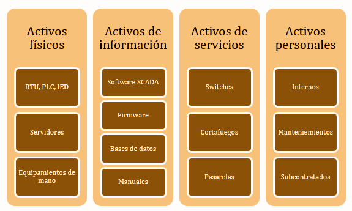

## 1.1.1. Principios generales

Antes de comenzar a trabajar en la ciberseguridad de una organización, es importante tener en cuenta los **principios generales** que rigen la seguridad de la información. Estos principios son la base sobre la que se construye cualquier estrategia de ciberseguridad y deben ser conocidos y apoyados por la dirección de la organización.

<figure markdown>
  
  <figcaption>Principios generales</figcaption>
</figure>

### 1. Cibserseguridad de sistemas informáticos

La ciberseguridad es un campo complejo que abarca una amplia gama de temas y tecnologías. Antes de profundizar en los detalles, es importante comprender algunos conceptos básicos que son fundamentales para entender la ciberseguridad.

#### 1.1. Ciberseguridad

Imagina que la ciberseguridad es como poner cerraduras, alarmas y cámaras en una casa. Su objetivo es **proteger** todo lo que hay dentro y evitar que alguien no autorizado entre, dañe o robe algo. En el mundo digital, la ciberseguridad **protege nuestros ordenadores, teléfonos, redes y la información que almacenamos en ellos de ataques, robos de datos o virus**.

Ejemplo: Cuando configuras una contraseña en tu correo electrónico, estás usando ciberseguridad para proteger tu información personal.

#### 1.2. Ciberdefensa

Si la ciberseguridad es poner cerraduras en la casa, la ciberdefensa sería contratar a un guardia de seguridad para **vigilar** y estar preparado por si alguien intenta entrar. La ciberdefensa se enfoca en **responder a ataques que ya están ocurriendo o evitar que vuelvan a suceder**. Incluye monitorear las redes, detectar comportamientos sospechosos y reaccionar rápidamente.

Ejemplo: Si una empresa detecta un ataque en su sistema, la ciberdefensa entra en acción para detenerlo, buscar de dónde vino y mejorar la seguridad para que no vuelva a pasar.

La ciberseguridad y la ciberdefensa son dos caras de la misma moneda. La ciberseguridad se enfoca en prevenir ataques, mientras que la ciberdefensa se enfoca en responder a ellos. Ambas son necesarios para proteger los sistemas de información de una organización.

#### 1.3. Sistemas de información

Los sistemas de información son el conjunto de datos, procesos, personas y tecnologías que gestionan y manejan la información en una organización. Se enfocan en cómo se organiza, almacena, procesa y usa la información para apoyar la toma de decisiones y las operaciones.

Los sistemas de información incluyen:

* **Datos**: Información almacenada, como registros de empleados, ventas, o datos financieros.
* **Procesos**: Procedimientos que determinan cómo se recolecta, organiza y utiliza esa información.
* **Personas**: Usuarios que interactúan con los sistemas para obtener y procesar la información.
* **Tecnología**: Los sistemas informáticos (hardware y software) que permiten gestionar los datos.

Ejemplos de sistemas de información pueden ser:

* Un sistema de gestión de inventario que controla las existencias en un almacén.
* Un sistema de nóminas en una empresa, que gestiona los pagos a los empleados.
* Un CRM (Customer Relationship Management), que almacena datos sobre los clientes y ayuda a las empresas a gestionar sus interacciones.

Proteger los sistemas de información implica proteger no solo el hardware y software (que forman parte de los sistemas informáticos), sino también la información y los procesos que los utilizan. Esto incluye:

* **Confidencialidad de los datos**: Proteger la información sensible para que solo quienes estén autorizados puedan acceder.
* **Integridad de los datos**: Asegurar que la información no sea alterada sin permiso.
* **Disponibilidad**: Garantizar que los sistemas estén operativos cuando los usuarios los necesiten.

<figure markdown>
  
  <figcaption>Sistema de información</figcaption>
</figure>

Si bien **los sistemas de información no tiene por qué contener elementos informáticos**, por ejemplo, los sistemas de información no informáticos pueden incluir, por ejemplo:

* Archivos en papel almacenados en un archivo físico.
* Procesos manuales para gestionar la información, como formularios en papel.
* Personas que manejan la información sin el uso de tecnología digital.
* Sistemas de comunicación no digitales, como el correo postal.
* Sistemas de control manuales, como registros escritos a mano.

En la actualidad se hace difícil imaginarse esta situación. Por tanto, la ciberseguridad de los sistemas de información abarca tanto la protección de los componentes digitales (sistemas informáticos) como la protección de los procesos, datos y personas que interactúan con esos sistemas.

#### 1.4. Sistema informático

Los sistemas informáticos se refieren al hardware y software que permiten procesar, almacenar y transmitir información. Incluyen todos los dispositivos físicos y los programas que gestionan datos.

Los sistemas de información incluyen:

* **Hardware**: Ordenadores personales, servidores, dispositivos móviles, electrónica de red, etc.
* **Software**: Sistemas operativos, aplicaciones, programas, bases de datos.

Ejemplos:

* Tu ordenador personal, con su sistema operativo (Windows, Linux, macOS) y las aplicaciones que usas (Microsoft Word, Google Chrome).
* Un servidor en una empresa que procesa y almacena los datos de los empleados.
* El router que utilizas para conectarte a Internet.

Proteger los sistemas informáticos significa garantizar que el hardware (dispositivos) y el software (programas y aplicaciones) estén seguros y funcionen correctamente. Esto incluye:

* Actualización de software.
* Mantenimiento de hardware.
* Uso de antivirus y firewalls para evitar que el hardware y software sean comprometidos.
* Asegurar que solo usuarios autorizados puedan acceder a los sistemas.
* Proteger el acceso físico a los dispositivos.
* Etc.

<figure markdown>
  
  <figcaption>Sistema informático</figcaption>
</figure>

**Analogía para visualizarlo mejor**:

* Los sistemas informáticos son como los vehículos en una flota de autos de una empresa (los autos, motores, llantas, etc.). Se trata de la tecnología física y los programas que permiten el funcionamiento.
* Los sistemas de información son como todo el sistema de logística de la empresa que usa esos vehículos. Incluyen los autos (sistemas informáticos), pero también el proceso de entrega, los conductores (personas), y la información de cada paquete o envío (datos). En este caso, proteger los sistemas de información no solo significa cuidar los vehículos, sino también asegurar que los paquetes lleguen a tiempo, sin daños, y que los conductores sigan los procedimientos correctos.

**Ejemplo:**:

* Sistema informático: La red de computadoras en una empresa, junto con los servidores que ejecutan el sistema operativo y los programas de software.
  * Ciberseguridad: Asegurar que los servidores y computadoras estén protegidos frente a malware, actualizados y funcionando correctamente.
* Sistema de información: El sistema que gestiona las ventas en esa misma empresa, incluyendo las bases de datos que almacenan las transacciones, los procesos que generan reportes financieros, y los empleados que analizan esos datos para tomar decisiones.
  * Ciberseguridad: Proteger no solo los servidores y computadoras, sino también la información sensible de los clientes, la confidencialidad de los registros de ventas, y la integridad de los reportes financieros para que no sean alterados sin autorización.

### 2. Seguridad vs fiabilidad

La frase “La seguridad total es imposible de conseguir, por tanto hablaremos más de fiabilidad” nos ayuda a entender una verdad clave en ciberseguridad y en la gestión de sistemas: **la seguridad perfecta no existe**. Vamos a desglosarla paso a paso y explicar por qué la fiabilidad se convierte en un enfoque más realista.

#### 2.1. Imposibilidad de la seguridad total

* La seguridad total es inalcanzable porque siempre habrá nuevas amenazas, errores humanos y vulnerabilidades desconocidas. Por más que una empresa implemente controles, firewalls, políticas y medidas avanzadas, siempre existe el riesgo de que algo no salga como se esperaba.
* Los sistemas informáticos y de información son complejos y dinámicos: constantemente se introducen nuevos componentes, actualizaciones y tecnologías que pueden abrir nuevas brechas. Además, los atacantes también están en evolución constante, encontrando nuevas formas de vulnerar los sistemas.

**Ejemplo:** Piensa en una casa. Aunque pongas puertas blindadas, cámaras de seguridad, y alarmas, siempre puede haber un ladrón que descubra una nueva forma de entrar o que se aproveche de un pequeño descuido, como una ventana abierta por error. Lo mismo sucede en ciberseguridad: siempre hay un margen de vulnerabilidad.

#### 2.2. El enfoque en la fiabilidad

* Dado que la seguridad perfecta no es posible, se pone mayor énfasis en la fiabilidad. En lugar de intentar lograr una protección 100% segura, el objetivo es hacer que los sistemas sean **confiables** y **resilientes**. Esto significa que, si ocurre un incidente o un fallo, los sistemas puedan seguir funcionando, recuperarse rápidamente, y los daños se minimicen.
* Fiabilidad no significa que los sistemas sean invulnerables, sino que son capaces de funcionar correctamente incluso en situaciones de fallo o ataque. La fiabilidad se basa en conceptos como:

  * **Alta disponibilidad**: Asegurar que los sistemas estén disponibles para los usuarios, incluso ante fallos. Hay blip corto y vuelve solo
  * **Resiliencia**: Capacidad del sistema de recuperarse después de un incidente (por ejemplo, un ataque cibernético o un fallo técnico). Hay parada y recuperas con DR/backups.
  * **Tolerancia a fallos**: Los sistemas están diseñados de manera que puedan seguir funcionando o minimizar el impacto ante un fallo de componentes. (No hay corte, ante componente conocido que falle).

#### 2.3. Cómo se conectan seguridad y fiabilidad en esta frase

Al aceptar que la seguridad total es inalcanzable, las organizaciones se enfocan en cómo hacer que los sistemas sean más confiables. Esto significa que, en lugar de poner todos los esfuerzos en proteger el sistema contra absolutamente todas las amenazas posibles (lo cual no es realista), se trabaja para minimizar las consecuencias de los incidentes y mantener los sistemas operativos y estables.

Por ejemplo, en lugar de intentar detener todos los ciberataques, una empresa podría invertir en sistemas de respaldo, planes de recuperación y tolerancia a fallos para asegurar que, si un ataque compromete un servidor, los datos se puedan recuperar rápidamente y los sistemas vuelvan a estar en línea sin interrupciones significativas.

#### 2.4. Por qué enfocarse en la fiabilidad es más realista

La fiabilidad es un enfoque más realista y efectivo que la seguridad total. Algunas razones por las que se prefiere la fiabilidad sobre la seguridad perfecta son:

* **Adaptación al cambio**: Los sistemas pueden seguir operando de manera confiable a pesar de los fallos o ataques, adaptándose a nuevos problemas sin colapsar.
* **Minimización del impacto**: Si ocurre una vulneración de seguridad, la organización no se queda paralizada; los sistemas son capaces de recuperarse rápidamente. Esto minimiza las pérdidas y reduce el tiempo de inactividad.
* **Protección ante lo inesperado**: Nadie puede prever todas las amenazas futuras. En lugar de intentar anticiparlas todas, se asegura que los sistemas puedan seguir funcionando de manera predecible y estable a pesar de los desafíos.
* **Costos y recursos**: Intentar alcanzar una seguridad perfecta sería muy costoso y agotador. En cambio, mejorar la fiabilidad suele ser una inversión más equilibrada que ofrece mayores beneficios en términos de continuidad operativa.

Ejemplo:

Imagina una pequeña empresa que almacena datos importantes en sus servidores. En lugar de invertir en una seguridad "perfecta" (lo que implicaría un gasto altísimo en tecnologías de punta, personal especializado, y auditorías constantes), la empresa decide focalizarse en la fiabilidad:

* Respaldo diario de datos: Si alguien logra vulnerar el sistema y borra o cifra la información, se puede restaurar rápidamente desde el último respaldo.
* Redundancia de sistemas: Si un servidor falla, otro toma su lugar para asegurar la continuidad.
* Monitoreo constante: Si hay un ataque, se detecta rápidamente y se toman acciones antes de que el daño sea irreparable.

Este enfoque permite que, aunque haya un incidente de seguridad (lo que es inevitable a largo plazo), los sistemas puedan seguir funcionando y las operaciones no se detengan por completo.

> La clave es asegurar la continuidad del negocio, no la seguridad perfecta.

### 3. Los principios generales de la ciberseguridad

Los **principios generales de la ciberseguridad** son los pilares sobre los que se construye cualquier estrategia de protección de la información. Estos principios son universales y aplicables a cualquier organización, independientemente de su tamaño o sector. Algunos de los principios más importantes son los siguientes

#### 3.1. Triada CIA

* Confidencialidad: Solo las personas autorizadas pueden acceder a la información.
* Integridad: La información debe mantenerse exacta y completa, sin modificaciones no autorizadas.
* Disponibilidad: La información y los sistemas deben estar disponibles cuando se necesiten.

Ejemplo integrando CIA: Imagina que trabajas en una empresa financiera y tienes acceso a información sobre las cuentas de los clientes:

1. Confidencialidad: Solo tú, como empleado autorizado, puedes acceder a esos datos financieros. Para protegerlos, los sistemas utilizan cifrado y contraseñas seguras.
2. Integridad: Los registros de las cuentas no deben ser alterados sin permiso. Si alguien intenta modificar los datos sin autorización, el sistema detectará el cambio y activará alertas para corregirlo. También se usan copias de seguridad para asegurar que los datos originales pueden ser restaurados.
3. Disponibilidad: Cuando los clientes intenten acceder a su cuenta bancaria en línea, el sistema debe estar activo y funcional, permitiéndoles realizar transacciones en cualquier momento sin interrupciones.

<figure markdown>
  
  <figcaption>Triada CIA</figcaption>
</figure>

##### 3.1.1 Confidencialidad (Confidentiality)

La confidencialidad asegura que solo las personas o sistemas autorizados puedan acceder a la información sensible. Esto protege la información de accesos no autorizados.

* Objetivo: Evitar que personas no autorizadas accedan, lean o vean datos privados o confidenciales.
* Ejemplos:
    * Cifrado de datos: Cuando envías un mensaje cifrado, solo el receptor autorizado puede leerlo.
    * Contraseñas seguras: Solo los usuarios que conocen la contraseña correcta pueden acceder a una cuenta o sistema.
    * Autenticación multifactor (MFA): Requiere más de un método de verificación (por ejemplo, una contraseña y un código en el móvil) para acceder a una cuenta.
* Analogía: Imagina que tienes un diario privado con un candado. Solo tú tienes la llave, por lo que nadie más puede leer tus escritos. Esto es confidencialidad: proteger tu información para que solo quienes tengan acceso autorizado puedan verla.

<figure markdown>
  
  <figcaption>Confidencialidad</figcaption>
</figure>

##### 3.1.2. Integridad (Integrity)

La integridad garantiza que los datos no sean alterados o modificados de manera no autorizada o accidental. Asegura que la información se mantenga exacta y completa desde su creación hasta su destino.

* Objetivo: Proteger los datos de modificaciones no autorizadas o daños, ya sea intencionales (como ataques) o accidentales.
* Ejemplos:
    * Firmas digitales: Se utilizan para asegurar que los documentos o archivos no han sido alterados durante su transmisión.
    * Controles de acceso: Solo personas autorizadas pueden modificar los datos en una base de datos.
    * Hashing: Utilizar algoritmos de hash para asegurar que un archivo o mensaje no ha sido modificado. Si el contenido cambia, el hash también cambiará, lo que indicaría que la integridad se ha comprometido.
* Analogía: Es como enviar una carta sellada. Si la carta llega con el sello roto, sabes que alguien ha abierto la carta o modificado su contenido. La integridad asegura que la carta (o los datos) llegue tal como fue enviada, sin que nadie la haya alterado en el camino.

<figure markdown>
  
  <figcaption>Integridad</figcaption>
</figure>

##### 3.1.3. Disponibilidad (Availability)

La disponibilidad asegura que los sistemas y datos estén accesibles y operativos cuando los usuarios autorizados los necesiten. Esto implica que los sistemas deben funcionar de manera continua y estar disponibles para su uso.

* Objetivo: Garantizar que la información y los recursos estén siempre accesibles en el momento en que sean requeridos.
* Ejemplos:
    * Redundancia de sistemas: Tener servidores duplicados (o en la nube) para que si uno falla, otro lo reemplace automáticamente.
    * Planes de recuperación ante desastres: En caso de que ocurra un incidente (como un incendio o un ataque), el sistema puede ser restaurado y volver a estar operativo rápidamente.
    * Mantenimiento regular: Actualizar y hacer mantenimiento a los sistemas para prevenir fallos y evitar que se caigan en momentos críticos.
* Analogía: Piensa en un cajero automático que necesitas usar. La disponibilidad significa que el cajero esté funcionando cuando llegues, sin interrupciones. Si está fuera de servicio cuando lo necesitas, se compromete la disponibilidad.

<figure markdown>
  
  <figcaption>Disponibilidad</figcaption>
</figure>

#### 3.2. Otros principios

Existen principios adicionales que complementan el enfoque de seguridad de la información y que son igualmente importantes en muchos contextos, como son: fiabilidad, autenticidad y no repudio. Vamos a comentarlos a continuación:

##### 3.2.1. Fiabilidad (Reliability)

La fiabilidad garantiza que el sistema funcione de manera correcta y predecible, de acuerdo con lo que se espera de él, sin errores o fallos inesperados.

* En seguridad de la información: La fiabilidad implica que tanto los sistemas como los datos pueden ser usados sin problemas, y que el sistema es capaz de funcionar correctamente incluso bajo condiciones de estrés o cuando hay fallos.
* Ejemplo:
    * Piensa en un sistema bancario: si haces una transferencia, esperas que el sistema funcione correctamente y que el dinero llegue a su destino sin errores. Si el sistema tiene problemas y las transacciones fallan o los datos se pierden, no sería confiable.
    * En ciberseguridad, un sistema confiable evita interrupciones inesperadas y asegura que las operaciones se realicen según lo previsto.

##### 3.2.2. Autenticidad (Authenticity)

La autenticidad asegura que la información o el usuario es quien dice ser, y que la información no ha sido manipulada por nadie más durante su transmisión o almacenamiento.

* En seguridad de la información: Garantiza que tanto los datos como las identidades sean verificables. Un mensaje o documento es auténtico si proviene de una fuente confiable, y los sistemas de autenticación aseguran que los usuarios son quienes dicen ser (por ejemplo, usando contraseñas, biometría, o certificados digitales).
* Ejemplo:
    * Cuando accedes a tu cuenta de correo electrónico, el sistema te autentica usando tu usuario y contraseña. Esto asegura que tú eres el verdadero dueño de la cuenta.
    * Si recibes un mensaje firmado digitalmente, la firma asegura la autenticidad del remitente, de modo que puedes estar seguro de que el mensaje viene de quien dice ser y no ha sido alterado.

##### 3.2.3. No repudio (Non-repudiation)

El no repudio significa que ninguna de las partes involucradas en una comunicación o transacción puede negar que esa acción ocurrió. En otras palabras, el emisor no puede negar que envió un mensaje, ni el receptor puede negar que lo recibió.

* En seguridad de la información: Se utiliza para garantizar la responsabilidad en las transacciones digitales. Técnicas como las firmas digitales y los logs (registros de eventos) se utilizan para asegurar que las personas no puedan negar haber realizado una acción determinada.
* Ejemplo:
    * Si firmas un contrato digitalmente, el sistema garantiza que no puedas negar haber firmado dicho contrato en el futuro. La firma digital proporciona evidencia de que tú (el remitente) lo hiciste, y esta evidencia puede ser verificada.   
    * En una transacción bancaria en línea, el no repudio asegura que si transfieres dinero a alguien, no puedas negar que hiciste esa transacción, y el banco puede probarlo si fuera necesario.

#### 3.3. Ejemplo integrando todo

Imagina que estás comprando algo en línea:

1. Confidencialidad: Tu información de pago (como el número de tu tarjeta de crédito) está cifrada para que nadie más la vea.
2. Integridad: El pedido que haces no puede ser modificado por nadie durante su procesamiento. Lo que envías al vendedor es lo que llega.
3. Disponibilidad: El sistema de pago y la tienda en línea deben estar disponibles para que puedas hacer la compra cuando lo necesites.
4. Fiabilidad: El sistema de pago funciona correctamente y tu transacción se realiza sin problemas.
5. Autenticidad: Sabes que estás comprando en la tienda legítima (gracias a la autenticación del sitio web), y ellos pueden verificar que el pago proviene de ti.
6. No repudio: Después de la compra, ni tú puedes negar haber hecho la transacción, ni la tienda puede negar que recibió tu pago, gracias a los registros y las firmas digitales.

La **ciberseguridad** se basa en estos principios fundamentales para garantizar la **protección** y **confiabilidad** de los sistemas y la información. Además de la **triada CIA** (Confidencialidad, Integridad y Disponibilidad), los principios de **fiabilidad**, **autenticidad** y **no repudio** amplían la seguridad y aseguran que los sistemas sean **confiables**, que los datos y personas sean **verificables** y que todas las acciones sean **responsables**.

### 4. Decálogo de la ciberseguridad

Este Decálogo de Ciberseguridad ofrece 10 principios clave que cubren tanto la prevención de amenazas como la **protección activa** de los datos y sistemas. Aplicando estas medidas, puedes reducir considerablemente el riesgo de sufrir ciberataques y mantener seguros los activos digitales de tu organización.

#### 4.1. Cultura de la ciberseguridad y concienciación del empleado

La cultura de ciberseguridad es vital en cualquier organización. No solo se trata de instalar herramientas de protección, sino también de educar a los empleados para que sepan cómo actuar frente a posibles amenazas.

* Relación con CIA: Este principio refuerza todos los aspectos de la triada (Confidencialidad, Integridad y Disponibilidad), ya que empleados bien capacitados son menos propensos a cometer errores que comprometan la seguridad. La concienciación previene el acceso no autorizado (confidencialidad), el manejo incorrecto de datos (integridad), y garantiza que los sistemas se usen de manera segura (disponibilidad).
* Ejemplo: Si un empleado recibe un correo sospechoso, debe saber que no debe abrir los enlaces ni descargar archivos hasta que confirme que es legítimo. La formación es clave para que todos en la organización contribuyan a la seguridad.

#### 4.2. No abrir enlaces ni descargar archivos sospechosos

Nunca debemos abrir enlaces ni descargar archivos adjuntos de correos electrónicos que nos parezcan sospechosos. Este tipo de correos puede contener malware o llevarnos a sitios fraudulentos.

* Relación con CIA: Este principio refuerza la confidencialidad y integridad.  

    1. Confidencialidad: Al evitar hacer clic en enlaces sospechosos o descargar archivos potencialmente maliciosos, se protege la información sensible de caer en manos equivocadas.
    2. Integridad: Impide la descarga de malware que podría modificar o corromper los datos.

* Ejemplo: Si recibes un correo que parece raro, aunque parezca que viene de un amigo o compañero, es mejor verificar antes de hacer clic o descargar algo. Los ciberataques, como el phishing, suelen empezar con un correo aparentemente inocente.

#### 4.3. Usar software de seguridad

Siempre debemos usar software de seguridad como antivirus, cortafuegos (firewalls), y herramientas antimalware. Estas herramientas ayudan a detectar y bloquear amenazas antes de que lleguen a nuestros sistemas.

* Relación con CIA: Apoya los tres principios de la CIA

    1. Confidencialidad: El uso de antivirus y cortafuegos ayuda a bloquear accesos no autorizados a los datos.
    2. Integridad: Los antivirus evitan que el malware modifique o dañe archivos y sistemas.
    3. Disponibilidad: Mantener los sistemas libres de amenazas asegura que los recursos estén disponibles para su uso cuando sea necesario.

* Ejemplo: Tener un antivirus actualizado nos protege de virus conocidos, mientras que un cortafuegos limita el acceso no autorizado a tu red. También es útil tener herramientas de borrado seguro para eliminar completamente archivos confidenciales.**

#### 4.4. Limitar la superficie de exposición a amenazas

No es suficiente solo implementar medidas de seguridad, también debemos reducir la cantidad de servicios expuestos al mínimo necesario. Cuantos más servicios tengamos abiertos en nuestra red, más oportunidades tienen los atacantes de encontrar una brecha.

* Relación con CIA: Refuerza la disponibilidad y la confidencialidad.

    1. Confidencialidad: Limitar los servicios y accesos minimiza el riesgo de que los atacantes accedan a información confidencial.
    2. Disponibilidad: Al reducir la cantidad de servicios innecesarios, se minimiza el riesgo de ataques que puedan comprometer la operatividad de los sistemas.

* Ejemplo: Si tienes un servidor que ofrece varios servicios, desactiva aquellos que no uses o que no sean necesarios para la operación diaria. Esto reduce el número de "puertas" que los atacantes pueden intentar abrir.

#### 4.5. Cifrar la información sensible

Toda la información sensible o confidencial debe estar cifrada. Esto significa que, incluso si alguien accede a los datos sin permiso, no podrá leerlos sin la clave para descifrarlos.

* Relación con CIA: Directamente relacionado con la confidencialidad.
  1. Confidencialidad: El cifrado asegura que, aunque alguien acceda a los datos, no podrá entenderlos sin la clave correcta. Protege la información frente a accesos no autorizados.
* Ejemplo: Cuando enviamos datos personales o financieros por Internet, deben estar cifrados para que, si son interceptados, no puedan ser leídos. Usar cifrado es esencial para proteger la privacidad de la información.**

#### 4.6. Borrado seguro de información

Cuando ya no necesitas un archivo o cuando vas a deshacerte de un dispositivo, debes asegurarte de que los datos se eliminen completamente. Un simple "borrado" puede dejar rastros de información que un atacante podría recuperar.

* Relación con CIA: Refuerza la confidencialidad y la integridad.

    1. Confidencialidad: El borrado seguro evita que los datos sensibles que ya no son necesarios puedan ser recuperados por personas no autorizadas.
    2. Integridad: Garantiza que los datos eliminados no puedan ser restaurados o manipulados indebidamente.

* Ejemplo: Antes de vender o desechar un ordenador o teléfono, debes usar una herramienta de borrado seguro que sobrescriba los datos varias veces, para que no puedan recuperarse.

#### 4.7. Realizar copias de seguridad periódicas

Las copias de seguridad son esenciales para proteger tus datos contra fallos o ataques, como el ransomware. Las copias deben ser frecuentes y seguras, y es importante asegurarse de que no estás respaldando también malware accidentalmente.

* Relación con CIA: Este principio se relaciona principalmente con la disponibilidad y también con la integridad.

    1. Disponibilidad: Las copias de seguridad permiten recuperar los sistemas rápidamente después de un fallo o ataque, asegurando que la información esté siempre disponible.
    2. Integridad: Las copias de seguridad periódicas aseguran que se pueda restaurar la información tal como estaba en el momento de la copia, preservando su exactitud.

* Ejemplo: Imagina que tu empresa es víctima de un ataque que borra o cifra todos los archivos. Sin copias de seguridad, podrías perderlo todo. Si tienes una copia reciente, puedes recuperar los datos rápidamente y minimizar el impacto.**

#### 4.8. Mantener actualizados los sistemas y aplicaciones

Mantener el sistema operativo y las aplicaciones actualizadas es crucial para evitar vulnerabilidades. Las actualizaciones suelen incluir parches de seguridad que corrigen errores que los atacantes podrían explotar.

* Relación con CIA: Apoya los tres principios.

     1. Confidencialidad: Mantener el software actualizado cierra vulnerabilidades que los atacantes podrían usar para acceder a datos sensibles.
     2. Integridad: Evita que malware o exploits dañen o alteren los datos al aprovechar fallos no corregidos.
     3. Disponibilidad: Las actualizaciones de seguridad evitan que los sistemas sean comprometidos, lo que puede llevar a interrupciones en el servicio.

* Ejemplo: Si estás usando una versión desactualizada de una aplicación, los hackers podrían aprovechar una vulnerabilidad conocida. Al actualizarla, cierras esa puerta y proteges tu sistema.

#### 4.9. Revisar regularmente la configuración de seguridad

Es importante revisar y ajustar regularmente la configuración de seguridad de los sistemas y las aplicaciones. Esto incluye revisar los permisos y las opciones de seguridad para asegurarse de que están configuradas correctamente y de acuerdo con las mejores prácticas.

* Relación con CIA: Apoya la confidencialidad, integridad y disponibilidad.

    1. Confidencialidad: Revisar la configuración de seguridad asegura que los permisos y accesos estén correctamente establecidos, evitando accesos no autorizados.
    2. Integridad: Una configuración revisada y adecuada previene cambios o manipulaciones no deseadas en los sistemas.
    3. Disponibilidad: Mantener la configuración de seguridad actualizada evita que el sistema sea vulnerable a fallos o ataques que podrían causar interrupciones.

* Ejemplo: Revisar los permisos de las aplicaciones para asegurarse de que no tienen más acceso del necesario. Una aplicación que no necesita acceder a tu ubicación o contactos no debería tener ese permiso. También es bueno revisar los ajustes de seguridad de tus redes y sistemas para asegurarte de que están actualizados y ajustados a las últimas amenazas.

### 5. Activos, vulnerabilidades, amenazas y riesgos

En ciberseguridad, es fundamental comprender los conceptos de activos, vulnerabilidades, amenazas y riesgos. Estos elementos son la base para identificar y proteger los sistemas y datos de una organización.

Hasta ahora, hemos hablado de los principios generales de ciberseguridad, conocidos como Confidencialidad, Integridad y Disponibilidad (CIA), junto con otros principios clave como la fiabilidad, la autenticidad y el no repudio. Estos pilares son fundamentales para garantizar que nuestros sistemas y datos estén bien protegidos, accesibles solo para personas autorizadas, y disponibles cuando los necesitamos.

Sin embargo, para proteger de manera efectiva la información y los sistemas, también debemos ser capaces de entender los peligros a los que nos enfrentamos y cómo esas amenazas pueden comprometer la seguridad. Aquí es donde entran en juego tres conceptos cruciales: amenaza, vulnerabilidad y riesgo.

Estos conceptos nos permiten ver cómo y por qué los sistemas pueden fallar o ser atacados, y nos ayudan a identificar los puntos débiles en nuestra infraestructura que podrían ser aprovechados por actores malintencionados. Ahora que entendemos los principios que debemos proteger, el siguiente paso es analizar qué factores pueden poner en peligro esos principios y cómo podemos enfrentarlos.

Amenaza, vulnerabilidad y riesgo: Las piezas clave del rompecabezas de la seguridad

1. **Amenaza**:

    * Una amenaza es cualquier evento o acción que tiene el potencial de causar daño a nuestros sistemas de información o comprometer la confidencialidad, integridad o disponibilidad de los datos. Las amenazas pueden provenir de factores externos como ataques cibernéticos (hackers, malware) o de factores internos como errores humanos o fallos de software. Por ejemplo, un ataque de phishing es una amenaza diseñada para engañar a los usuarios y obtener información confidencial.

2. **Vulnerabilidad**:

    * Las vulnerabilidades son las debilidades o fallos que existen en nuestros sistemas y que pueden ser explotados por una amenaza. Estas vulnerabilidades pueden encontrarse en software desactualizado, configuraciones incorrectas o incluso en la falta de concienciación de los usuarios. Si no se corrigen, las vulnerabilidades dejan nuestras infraestructuras expuestas a las amenazas, como una puerta abierta que facilita el acceso a un atacante.

3. **Riesgo**:

    * El riesgo es la combinación de una amenaza que intenta aprovechar una vulnerabilidad. Se puede definir como la probabilidad de que una amenaza tenga éxito y cause un impacto negativo en el sistema. La gestión del riesgo implica identificar las vulnerabilidades y amenazas para minimizar el daño potencial. Por ejemplo, si un sistema crítico está desactualizado (vulnerabilidad) y sabemos que los atacantes buscan activamente explotar esa falla (amenaza), el riesgo de un ataque es elevado.

Estos tres conceptos son fundamentales porque nos permiten anticipar los problemas y tomar medidas antes de que un incidente ocurra. Ahora, vamos a explorar cada uno de ellos en detalle y cómo se interrelacionan para ayudarnos a proteger mejor nuestros sistemas.

#### 5.1. Activos

Antes de hablar de amenazas, vulnerabilidades y riesgos, es esencial que primero entendamos qué son los activos en el contexto de la ciberseguridad. Los activos son todos los elementos valiosos para una organización que deben ser protegidos, ya que un ataque o incidente podría afectar su funcionamiento, productividad o incluso la reputación de la empresa.

##### 5.1.1. ¿Qué es un activo?

Un activo es cualquier recurso o bien que tiene valor para la empresa. En el ámbito de la ciberseguridad, se refiere a cualquier cosa que pueda afectar la seguridad o el funcionamiento de los sistemas de información si se viera comprometido. Los activos pueden ser tangibles (como equipos o edificios) o intangibles (como datos o software), y su protección es el objetivo principal de la ciberseguridad.

##### 5.1.2. Ejemplo

Imagina que trabajas en una empresa que gestiona datos financieros. Los activos más importantes de esa empresa serían:

* Los datos financieros de los clientes.
* Las aplicaciones que gestionan esos datos.
* Los servidores donde se almacenan.

Cada uno de estos activos necesita ser protegido porque su pérdida o daño podría afectar gravemente a la empresa.

##### 5.1.3. Tipos de activos

Para hacer más fácil su gestión y protección, los activos se clasifican en diferentes categorías según su naturaleza:

1. **Datos:** Son todos los datos e información que maneja la empresa en cualquier formato (digital, físico, en la nube, etc.). Estos datos pueden ser personales, financieros, de clientes, operacionales y más.

    * Ejemplos:
        * Bases de datos de clientes o ventas.
        * Documentación importante como contratos, manuales, normativas o informes.
    * Importancia: La confidencialidad e integridad de los datos es vital, ya que su pérdida o alteración puede tener consecuencias legales, 
    financieras y de reputación para la empresa.

2. **Aplicaciones:** Son los programas y software que utiliza la organización para gestionar y operar su negocio. Incluyen tanto aplicaciones comerciales como sistemas personalizados desarrollados específicamente para la empresa.

   * Ejemplos:
       * Sistemas SCADA (usados en procesos industriales).
       * Software operativo como sistemas operativos, firmware, aplicaciones de gestión de usuarios o recursos (ERP, CRM).
   * Importancia: La disponibilidad y seguridad de las aplicaciones son clave para garantizar que los sistemas y procesos funcionen sin interrupciones, y que los datos se manejen de manera segura.

3. Hardware industrial: Se refiere a los equipos físicos que son necesarios para el funcionamiento de la empresa, especialmente en industrias o sectores que dependen de tecnología avanzada.

   * Ejemplos:
       * PLC (Controladores Lógicos Programables), que automatizan procesos industriales.
       * Servidores y terminales remotas en fábricas.
       * Dispositivos móviles usados para gestionar procesos.
   * Importancia: El hardware es crítico para las operaciones diarias, y si falla, puede causar pérdidas operativas significativas o incluso riesgos de seguridad.

4. **Red:** Son los dispositivos y equipos que permiten la conectividad y comunicación entre los sistemas, usuarios y procesos.

   * Ejemplos:
     * Routers, switches y firewalls que mantienen la red segura y operativa.
     * Pasarelas que permiten la conexión entre diferentes sistemas.
   * Importancia: La disponibilidad y seguridad de las redes son fundamentales para que los sistemas de la empresa se mantengan conectados y puedan compartir información de manera eficiente y segura.
5. **Tecnología:** Son otros equipos tecnológicos necesarios para el funcionamiento empresarial. Son más generales que el hardware industrial, pero siguen siendo críticos para la gestión diaria.

   * Ejemplos:
       * Servidores que alojan los sistemas y aplicaciones empresariales.
       * Teléfonos, impresoras y routers.
   * Importancia: La disponibilidad de estos equipos es vital para la operatividad y la comunicación interna y externa de la empresa.

6. Personal: El personal es un activo clave, ya que son quienes manejan los sistemas y toman decisiones sobre la información y los procesos de la empresa.

   * Ejemplos:
       * Plantilla propia de la organización.
       * Personal subcontratado o de mantenimiento.
   * Importancia: La concienciación y capacitación en ciberseguridad del personal son fundamentales para evitar errores humanos, que muchas veces son la principal causa de vulnerabilidades.

7. **Instalaciones:** Son los lugares físicos donde la organización aloja sus sistemas y operaciones.

   * Ejemplos:
       * Edificios, oficinas, instalaciones eléctricas.
       * Centros de datos y servidores físicos.
   * Importancia: Las instalaciones deben estar protegidas físicamente para evitar acceso no autorizado o daños físicos, como incendios o robos.

8. **Equipamiento auxiliar:** Son los equipos de soporte que ayudan a mantener el funcionamiento de los sistemas de información, aunque no son parte del núcleo principal de operación.

   * Ejemplos:
       * Equipos de destrucción de datos, climatización o SAI (Sistemas de  Alimentación Ininterrumpida) que mantienen los servidores funcionando incluso en caso de fallos eléctricos.
   * Importancia: Aseguran que los sistemas críticos sigan operando bajo condiciones adversas o en situaciones de emergencia.

<figure markdown>
  
  <figcaption>Activos</figcaption>
</figure>

##### 5.1.4. ¿Por qué es importante clasificar los activos?

Clasificar los activos es un paso fundamental en la gestión de la ciberseguridad, ya que permite identificar y priorizar los activos más críticos para la organización. Al clasificar los activos, podemos:

1. Priorizar la protección: No todos los activos son iguales. Algunos, como los datos confidenciales de los clientes o los servidores críticos, requieren más protección que otros.
2. Gestionar los riesgos: Al identificar qué activos son los más valiosos o vulnerables, podemos entender mejor qué amenazas podrían afectarlos y cómo mitigar esos riesgos.
3. Facilitar la respuesta: En caso de un incidente de seguridad, saber qué activos se han visto comprometidos permite actuar con rapidez y minimizar el impacto.

Ahora que hemos entendido qué son los activos y cómo clasificarlos, podemos avanzar a entender las amenazas, vulnerabilidades y riesgos que pueden afectar estos activos.


#### 5.2. Vulnerabilidades

Una **vulnerabilidad** es una debilidad, debido a fallos técnicos, errores humanos o deficiencias en los procedimientos, de los sistemas de información que pone en riesgo la seguridad de la información, pudiendo permitir que un atacante comprometa la **integridad**, **disponibilidad** o **confidencialidad** de la misma. También puede afectar a otros principios como la **autenticidad**, **fiabilidad** y **no repudio**.

Las vulnerabilidades son las condiciones y características propias de los sistemas de una organización, de los **activos**, que la hacen susceptible a las **amenazas**.

Ejemplo:
Imagina que en tu casa y te das cuenta de que una puerta no tiene cerradura. Esa puerta sin cerradura es una vulnerabilidad: un punto débil que podría ser aprovechado por un ladrón (Amenaza) para entrar a tu casa.

<figure markdown>
  
  <figcaption>Vulnerabilidad</figcaption>
</figure>

Esto, llevado a nuestro entorno, podría ser, por ejemplo, un sistema informático con software desactualizado que no tiene los parches de seguridad más recientes. Este software vulnerable deja la puerta abierta para que los atacantes aprovechen los errores en el programa.

##### 5.2.1. Características de las vulnerabilidades

Las vulnerabilidades pueden ser:

* **Propias del sistema**: Fallos en el diseño o implementación del software o hardware.
* **De configuración**: Errores en la configuración de sistemas o aplicaciones.
* **Humanas**: Falta de formación, errores de usuarios o malas prácticas.
* **Físicas**: Deficiencias en la protección física de los equipos o instalaciones.

##### 5.2.2. Ejemplos de vulnerabilidades

**Ejemplo 1: Vulnerabilidad de software desactualizado**

Imagina que tu empresa utiliza un servidor web con una versión antigua de software que tiene un fallo de seguridad conocido. Esta vulnerabilidad podría permitir que un atacante acceda al sistema sin autorización.

* **Activo afectado**: Servidor web (Hardware industrial / Tecnología)
* **Vulnerabilidad**: Software no actualizado con parches de seguridad
* **Principio comprometido**: Confidencialidad, Integridad

**Ejemplo 2: Contraseñas débiles**

En una empresa, varios empleados utilizan contraseñas simples como "123456" o "password" para acceder a sistemas críticos.

* **Activo afectado**: Datos de la empresa, sistemas de autenticación (Aplicaciones)
* **Vulnerabilidad**: Políticas de contraseñas débiles, falta de formación del personal
* **Principio comprometido**: Confidencialidad, Autenticidad

**Ejemplo 3: Falta de cifrado en comunicaciones**

Una aplicación móvil envía datos sensibles de clientes sin cifrar a través de Internet.

* **Activo afectado**: Datos de clientes (Datos)
* **Vulnerabilidad**: Ausencia de cifrado en las comunicaciones
* **Principio comprometido**: Confidencialidad

**Ejemplo 4: Acceso físico no controlado**

Un centro de datos no tiene control de acceso adecuado y cualquier empleado puede entrar sin identificarse.

* **Activo afectado**: Servidores, sistemas de almacenamiento (Instalaciones, Tecnología)
* **Vulnerabilidad**: Falta de controles de acceso físico
* **Principio comprometido**: Disponibilidad, Integridad

##### 5.2.3. La importancia de gestionar las vulnerabilidades

**Problema fundamental**: Si existe una vulnerabilidad, siempre existirá alguien que intentará explotarla, es decir, sacar provecho de su existencia.

Por eso es necesario:

1. **Identificar** las vulnerabilidades mediante auditorías y análisis.
2. **Evaluar** su gravedad e impacto potencial.
3. **Priorizar** su corrección según el riesgo.
4. **Implementar** medidas correctivas (parches, actualizaciones, configuraciones).
5. **Verificar** que las medidas son efectivas.
6. **Monitorizar** continuamente para detectar nuevas vulnerabilidades.

##### 5.2.4. CVE - Common Vulnerabilities and Exposures

El concepto de **Vulnerabilidades y Exposiciones Comunes** (en inglés, **Common Vulnerabilities and Exposures**, abreviado como **CVE**) se refiere a un **sistema de identificación y seguimiento** de **vulnerabilidades de seguridad** en software y hardware conocidos. Es una base de datos pública que se utiliza en ciberseguridad para **catalogar** y **documentar** fallos de seguridad, permitiendo a los usuarios y administradores estar al tanto de los problemas que pueden afectar sus sistemas y cómo **mitigarlos**.

###### 5.2.4.1 ¿Qué es el CVE y para qué se utiliza?

* **CVE** es una **lista estándar** de vulnerabilidades conocidas. Cada vulnerabilidad registrada recibe un número único llamado **CVE-ID** (por ejemplo, CVE-2024-XXXX), que la identifica a nivel global.
* Cada entrada CVE incluye:
    
    * Un **número de identificación** (**CVE-ID**).
    * Una **descripción breve** de la vulnerabilidad (qué es y cómo afecta a los sistemas).
    * Las **versiones de software o hardware** que están afectadas.
    * Si existe, una **posible solución** (parche, actualización) o **recomendaciones** para mitigar el riesgo, como configuraciones de seguridad.
    * **Referencias adicionales**, como publicaciones o foros, donde se puede ver más información o ejemplos de cómo explotar la vulnerabilidad.

###### 5.2.4.2 ¿Cómo funciona?

1. **Identificación de una vulnerabilidad**: Cuando se descubre una nueva vulnerabilidad en un sistema (por ejemplo, en Windows, Linux, o cualquier software), los investigadores de seguridad informan de esa vulnerabilidad a través del sistema CVE.
2. **Asignación de un CVE-ID**: A la vulnerabilidad se le asigna un **CVE-ID único** para que pueda ser rastreada y reconocida por todos.
3. **Descripción y solución**: La entrada CVE incluirá una descripción de la vulnerabilidad y, en algunos casos, detalles sobre qué versiones de software están afectadas y cómo mitigar o resolver el problema, ya sea con un **parche** o con **configuraciones de seguridad** alternativas.
4. **Enlace a NVD**: Muchas veces, la información CVE enlaza a la base de datos del **NIST (National Vulnerability Database)**, que proporciona **detalles más completos** sobre la vulnerabilidad, como su **puntuación de gravedad** (**CVSS**) y análisis más profundo de su impacto.

**Ejemplo simulado:**

* **CVE-2024-XXXX** podría referirse a una vulnerabilidad en un popular sistema operativo. Al consultar la entrada en la base de datos CVE, podrías ver:
    
    * **Descripción**: "Vulnerabilidad en la gestión de memoria de la versión X de Windows que permite la ejecución remota de código".
    * **Sistemas afectados**: "Windows versión 10.0.19042 y anteriores".
    * **Solución**: "Actualizar a la versión parcheada 10.0.19043 o superior".
    * **Referencias**: Enlaces a blogs y foros donde expertos discuten el impacto de esta vulnerabilidad o cómo fue explotada.


**Ejemplo real: Vulnerabilidades en TCP/IP en Microsoft**

<figure markdown>
  
  <figcaption>Vulnerabilidades TCP/IP Microsoft</figcaption>
</figure>

En un análisis de seguridad de Microsoft:

* **Número total de vulnerabilidades detectadas**: 56
* **11 críticas**: Requieren acción inmediata
* **43 altas**: Deben tratarse prioritariamente
* **2 medias**: Pueden planificarse en el tiempo

###### 5.2.4.3 ¿Por qué es importante?
El sistema CVE actualmente es importante en el campo de la ciberseguridad por varias razones:

* CVE permite que tanto **profesionales de la ciberseguridad**, **administradores de sistemas** como **empresas** puedan mantenerse informados sobre las **vulnerabilidades activas** en sus sistemas y tomar las medidas necesarias para **reducir riesgos**.
* Es un **lenguaje común** en ciberseguridad: gracias al sistema CVE, todos los expertos del mundo pueden referirse a una vulnerabilidad específica con el mismo número y tener acceso a la misma información.
* Las organizaciones pueden **priorizar** qué vulnerabilidades corregir primero, basándose en su gravedad y en los datos proporcionados.


###### 5.2.4.4 Conde consultar
En estos enlaces puedes consultar vulnerabilidades registradas CVE:

* [Incibe Cert](https://www.incibe-cert.es/alerta-temprana/vulnerabilidades)
* [CCN Cert](https://www.ccn-cert.cni.es/seguridad-al-dia/avisos-ccn-cert.html)


#### 5.3. Amenazas

Una **amenaza** es toda acción que aprovecha una vulnerabilidad para atentar contra la seguridad de un sistema de información. Es decir, que podría tener un potencial efecto negativo sobre algún elemento de nuestros sistemas. Desde el punto de vista de una organización pueden ser tanto **internas** como **externas**. Las internas provienen de dentro de la organización (empleados, contratistas), mientras que las externas vienen de fuera (hackers, competidores).

<figure markdown>
  
  <figcaption>Amenazas</figcaption>
</figure>

Las amenazas atentan contra la seguridad, por tanto, **se incumplirán los principios generales de la seguridad de la organización** (Confidencialidad, Integridad, Disponibilidad, Autenticidad, Fiabilidad, No repudio).


##### 5.3.1. Clasificación de amenazas

Las amenazas se pueden clasificar según diferentes criterios:

###### 5.3.1.1 Según su naturaleza (a qué afectan) 

**Amenazas lógicas:** Las amenazas lógicas están relacionadas con el **software** y los **procesos digitales** que afectan el correcto funcionamiento de los sistemas. Estas amenazas pueden ser **intencionadas**, como los **ataques de hackers**, o **accidentales**, como los errores de software. Las más comunes incluyen:

1. **Malware:** 

    * **Definición**: Son programas maliciosos creados para **dañar** sistemas, **robar información** o causar **mal funcionamiento**.
    * **Tipos comunes de malware**:
   
        * **Bugs**: Errores en el código que causan fallos en el sistema.
        * **Caballos de Troya**: Programas que parecen inofensivos pero que, una vez dentro del sistema, permiten a los atacantes **tomar el control** o robar datos.
        * **Virus**: Se **replican** y se propagan entre los archivos y sistemas, causando daños.
        * **Gusanos**: Parecidos a los virus, pero pueden propagarse por redes sin necesidad de interactuar con los archivos.
        * **Spyware**: Programas que **espían** las actividades del usuario, robando datos sensibles.
        * **Backdoors**: Puertas traseras que permiten el acceso al sistema sin que el usuario lo sepa.
        * **Cookies**: Aunque no todas son maliciosas, algunas pueden ser usadas para **rastrear** el comportamiento del usuario sin su conocimiento.
 
    * Ejemplo: Un **virus** que infecta un sistema y corrompe archivos o un **gusano** que se propaga por la red, consumiendo recursos hasta que los servidores colapsan.

2. **Ingeniería social**

    * **Definición**: Técnicas que los atacantes utilizan para **engañar a las personas** y hacer que revelen **información confidencial**, como contraseñas o datos personales.
    * Ejemplo: Un correo electrónico de **phishing** que parece venir del banco, pidiéndote que ingreses tu usuario y contraseña. Si caes en la trampa, los atacantes pueden acceder a tu cuenta bancaria.

3. **Ataques de denegación de servicio (DoS)**

    * **Definición**: Estos ataques buscan **sobrecargar un sistema** con muchas solicitudes simultáneas, de modo que los servicios o páginas web queden **inaccesibles** para los usuarios legítimos.
    * Ejemplo: Un ataque DoS en un servidor web puede hacer que una tienda en línea esté fuera de servicio durante horas, causando **pérdida de ventas**.

**Amenazas físicas:** Las amenazas físicas son aquellas que afectan a los **equipos físicos** (servidores, computadoras, dispositivos móviles) o al **entorno físico** donde se encuentran los sistemas de información. Estas amenazas pueden ser **accidentales** o **intencionadas** y suelen tener un impacto directo en el hardware y las infraestructuras tecnológicas. Algunas pueden ser:

1. **Robos, sabotajes y acceso no autorizado**

    * **Definición**: Estas amenazas incluyen el **robo de equipos**, el **sabotaje intencionado** de sistemas o el acceso físico de personas no autorizadas a las instalaciones críticas.
    * Ejemplo: Alguien sin autorización entra a la sala de servidores y **desconecta un equipo** o **roba** dispositivos que contienen datos importantes.

2. **Desastres naturales (incendios, inundaciones, terremotos)**

    * **Definición**: Los **desastres naturales** pueden dañar físicamente los sistemas, causando **pérdida de datos** y **caídas** en los servicios.
    * **Ejemplo**: Una inundación en la sala donde se encuentran los servidores de una empresa destruye equipos, causando la **pérdida de información** y la interrupción de los servicios.

3. **Errores humanos**

    * **Definición**: Son acciones **no intencionadas** de las personas que causan daños a los sistemas, como borrar archivos accidentalmente, apagar sistemas críticos o mal configurar un software.
    * **Ejemplo**: Un empleado borra por error archivos importantes en un servidor, sin tener una copia de seguridad.

4. **Fallos de suministro eléctrico**

    * **Definición**: La **pérdida de electricidad** puede hacer que los sistemas se apaguen de manera repentina, provocando **pérdida de datos** o incluso daños a los equipos.
    * **Ejemplo**: Un corte de luz durante el proceso de actualización de un servidor puede causar una **corrupción en el software** o la pérdida de datos.

5. **Calidad del aire (humedad, temperatura)**

    * **Definición**: El **entorno físico** donde operan los sistemas de información, como la **temperatura** o la **humedad**, puede afectar negativamente al hardware, provocando fallos o incluso incendios si no se controla adecuadamente.
    * **Ejemplo**: Un servidor que está en una sala sin ventilación adecuada se **sobrecalienta**, lo que puede provocar su **apagado repentino** o daño permanente.

###### 5.3.1.2 Según como interfieren
Según la forma en que interfieren con los activos, las amenazas pueden clasificarse en:

1. **Interrupción**: La amenaza hace que un activo del sistema se pierda, quede no disponible o inutilizable

    * Ejemplo: Ataque DDoS que hace caer un servidor web

2. **Interceptación**: Un elemento no autorizado consigue acceso a un activo

    * Ejemplo: Escucha de comunicaciones no cifradas (sniffing)

3. **Modificación**: Un elemento no autorizado no solo accede, sino que modifica el activo

    * Ejemplo: Alteración de registros en una base de datos

4. **Fabricación**: Un elemento no autorizado crea objetos falsos en el sistema

    * Ejemplo: Inserción de transacciones fraudulentas en un sistema bancario

<figure markdown>
  
  <figcaption>Cómo interfieren las amenazas</figcaption>
</figure>

##### 5.3.2. Ejemplos detallados de amenazas

**Ejemplo 1: Ataque de Phishing (Amenaza lógica - Interceptación)**

Un empleado recibe un correo electrónico que aparenta ser del departamento de IT solicitando sus credenciales para "actualizar el sistema".

* **Activo objetivo**: Credenciales de acceso (Datos)
* **Vulnerabilidad explotada**: Falta de formación en ciberseguridad del personal
* **Tipo de amenaza**: Lógica, externa, interceptación
* **Principios comprometidos**: Confidencialidad, Autenticidad
* **Impacto**: El atacante obtiene acceso no autorizado a sistemas internos

**Ejemplo 2: Ransomware (Amenaza lógica - Modificación/Interrupción)**

Un malware cifra todos los archivos de los servidores de la empresa y exige un rescate para descifrarlos.

* **Activo objetivo**: Datos corporativos, servidores (Datos, Tecnología)
* **Vulnerabilidad explotada**: Falta de actualizaciones de seguridad, ausencia de copias de seguridad
* **Tipo de amenaza**: Lógica, externa, modificación e interrupción
* **Principios comprometidos**: Disponibilidad, Integridad
* **Impacto**: Pérdida de acceso a información crítica, paralización de operaciones

**Ejemplo 3: Empleado descontento (Amenaza física/lógica - Modificación)**

Un empleado con acceso a sistemas críticos decide modificar datos antes de abandonar la empresa.

* **Activo objetivo**: Base de datos de clientes (Datos)
* **Vulnerabilidad explotada**: Falta de control de accesos basado en roles, ausencia de auditorías
* **Tipo de amenaza**: Lógica, interna, modificación
* **Principios comprometidos**: Integridad, No repudio
* **Impacto**: Datos corruptos, pérdida de confianza, problemas legales

**Ejemplo 4: Corte de energía prolongado (Amenaza física - Interrupción)**

Un apagón eléctrico en la zona donde está el centro de datos deja sin servicio los sistemas durante horas.

* **Activo objetivo**: Servidores, sistemas críticos (Tecnología, Instalaciones)
* **Vulnerabilidad explotada**: Ausencia de sistemas SAI adecuados, falta de redundancia
* **Tipo de amenaza**: Física, externa, interrupción
* **Principios comprometidos**: Disponibilidad
* **Impacto**: Pérdida de servicio, posible pérdida de datos no guardados

**Ejemplo 5: Ataque Man-in-the-Middle (Amenaza lógica - Interceptación)**

Un atacante se coloca entre un usuario y un servidor interceptando toda la comunicación.

* **Activo objetivo**: Comunicaciones, datos en tránsito (Red, Datos)
* **Vulnerabilidad explotada**: Falta de cifrado, redes WiFi inseguras
* **Tipo de amenaza**: Lógica, externa, interceptación
* **Principios comprometidos**: Confidencialidad, Integridad
* **Impacto**: Robo de credenciales, captura de información sensible

**Ejemplo 6: SQL Injection (Amenaza lógica - Modificación/Interceptación)**

Un atacante introduce código SQL malicioso en un formulario web para acceder o modificar la base de datos.

* **Activo objetivo**: Base de datos de aplicación web (Aplicaciones, Datos)
* **Vulnerabilidad explotada**: Falta de validación de entradas en la aplicación
* **Tipo de amenaza**: Lógica, externa, interceptación y modificación
* **Principios comprometidos**: Confidencialidad, Integridad, Autenticidad
* **Impacto**: Acceso no autorizado a información, modificación de registros

##### 5.3.3. Amenazas internas vs externas

Es importante distinguir entre amenazas que provienen del interior de la organización y las que vienen del exterior:

**Amenazas externas:**

* Hackers y ciberdelincuentes
* Competencia desleal
* Grupos organizados de ciberdelincuencia
* Estados y grupos con motivaciones políticas

**Amenazas internas:**

* Empleados descontentos o negligentes
* Personal sin formación adecuada
* Ex-empleados con acceso no revocado
* Proveedores o contratistas con acceso

##### 5.3.3. Amenazas vs vulnerabilidades

Es clave distinguir entre **amenazas** y **vulnerabilidades**, ya que aunque están relacionadas, son conceptos diferentes:

* **Amenaza**: Es **externa** al sistema, es el evento o agente que puede causar daño o explotar una vulnerabilidad. Es como el **ladrón** que busca entrar a una casa.
* **Vulnerabilidad**: Es **interna** al sistema, es la **debilidad o fallo** que puede ser aprovechado por una amenaza. Sería como la **puerta mal cerrada** que permite que el ladrón entre.

Las vulnerabilidades son los puntos débiles en un sistema, mientras que las amenazas son los factores que intentan explotar esas debilidades. **Ejemplo**: Si un sistema no tiene parches de seguridad (vulnerabilidad), un hacker (amenaza) puede aprovechar esta debilidad para causar daño.

Una **amenaza** es cualquier evento o acción potencialmente **perjudicial** que puede comprometer la seguridad de los **sistemas informáticos**, el **hardware**, el **software**, los **datos** o las **instalaciones** de una organización. Las amenazas pueden ser **naturales**, **humanas**, **intencionadas** o **accidentales**, pero todas tienen el potencial de causar **daño**.

**Tipos de amenazas más relevantes y por qué lo son:**

1. **Acceso a la red o al sistema de información por personas no autorizadas**

    * **Por qué es una amenaza**: Este tipo de acceso permite que personas no autorizadas **roben, alteren o destruyan** información sensible. Los intrusos pueden dañar la **confidencialidad** y la **integridad** de los datos.
    * **Distinción con vulnerabilidad**: La amenaza es la **persona no autorizada** que intenta acceder. La vulnerabilidad podría ser la falta de **control de acceso** o **contraseñas débiles** que facilitan el acceso no autorizado.

2. **Malware que afecta a la información (virus, ransomware)**

    * **Por qué es una amenaza**: **Malware** es un tipo de software malicioso que puede infectar sistemas para **robar datos, destruir archivos o encriptarlos** para pedir un rescate (ransomware). Puede afectar la **disponibilidad** y **confidencialidad** de la información.
    * **Distinción con vulnerabilidad**: El malware es la **amenaza**. La vulnerabilidad podría ser un **sistema desactualizado** o sin un **antivirus** que permita al malware infectar el sistema.

3. **Ingeniería social**

    * **Por qué es una amenaza**: La **ingeniería social** es una técnica mediante la cual los atacantes manipulan a las personas para que **revelen información confidencial**, como contraseñas o datos financieros. No atacan directamente al sistema, sino que **engañan** a los empleados para que cometan errores.
    * **Distinción con vulnerabilidad**: La amenaza es el **ataque de ingeniería social** (por ejemplo, phishing). La vulnerabilidad es la **falta de formación** o **concienciación** del personal sobre cómo detectar estos ataques.

4. **Desastre natural (incendio, inundación, rayo)**

    * **Por qué es una amenaza**: Los **desastres naturales** pueden destruir instalaciones, dañar servidores y hardware, y causar **pérdida de datos**. Pueden afectar la **disponibilidad** del sistema y la **integridad** de la información si los datos se pierden.
    * **Distinción con vulnerabilidad**: La amenaza es el **incendio o inundación**. La vulnerabilidad sería la falta de medidas de protección, como **copias de seguridad externas**, **sistemas antiincendios** o un **plan de recuperación ante desastres**.

5. **Interrupción de procesos de negocio**

    * **Por qué es una amenaza**: Cualquier evento que provoque la **interrupción de las operaciones normales** de una empresa, como la caída de un servidor crítico o un fallo en el sistema, puede afectar gravemente a la productividad y los ingresos.
    * **Distinción con vulnerabilidad**: La amenaza es la **interrupción** (por ejemplo, un corte de energía). La vulnerabilidad sería no tener un **sistema de respaldo** o **fuentes de alimentación ininterrumpidas** (SAI) para mantener los sistemas funcionando.

6. **Espionaje industrial**

    * **Por qué es una amenaza**: El **espionaje industrial** ocurre cuando competidores o actores maliciosos roban **información confidencial** de una empresa para obtener ventaja competitiva. Esto puede incluir el robo de **propiedad intelectual**, **planes estratégicos** o **tecnología**.
    * **Distinción con vulnerabilidad**: La amenaza es el **espía** que roba la información. La vulnerabilidad podría ser una **mala gestión de accesos**, **falta de cifrado** o **permisos excesivos**.

7. **Fuga de información**

    * **Por qué es una amenaza**: La **fuga de información** ocurre cuando **datos sensibles** (como información personal o financiera) son expuestos o robados. Esto puede causar daño a la reputación de la empresa y pérdida de confianza de los clientes.
    * **Distinción con vulnerabilidad**: La amenaza es la **fuga de información**. La vulnerabilidad podría ser la **falta de cifrado**, **mala gestión de permisos**, o el **uso de contraseñas débiles** que facilitan la exposición de los datos.

8. **Fallo de enlaces de comunicación**

    * **Por qué es una amenaza**: Si fallan los **enlaces de comunicación** (por ejemplo, el enlace entre la red y los servidores), los sistemas no podrán transmitir datos, lo que puede provocar la **interrupción** de los servicios y una caída en la **disponibilidad**.
    * **Distinción con vulnerabilidad**: La amenaza es el **fallo en las comunicaciones**. La vulnerabilidad sería no tener **redundancia** en los enlaces de comunicación o **planes de contingencia** para restaurar el servicio rápidamente.

9. **Código malicioso (virus, troyanos, spyware)**

    * **Por qué es una amenaza**: Los **virus, troyanos** o **spyware** son tipos de código malicioso diseñados para **robar datos, espiar actividades o dañar sistemas**. Estos ataques pueden comprometer la **confidencialidad** y la **integridad** de la información.
    * **Distinción con vulnerabilidad**: El código malicioso es la amenaza. La vulnerabilidad sería un sistema sin **protección antivirus**, **filtros de correo** o **prácticas de seguridad**, como descargar archivos no confiables.

10. **Instalación y uso no autorizado de software**

    * **Por qué es una amenaza**: El uso de software sin licencia o no autorizado puede ser riesgoso porque puede **contener malware**, ser vulnerable a ataques o no tener soporte para actualizaciones de seguridad. Además, puede implicar **sanciones legales** para la organización.
    * **Distinción con vulnerabilidad**: La amenaza es el **uso del software no autorizado**. La vulnerabilidad es no tener políticas de **control y revisión** de software en la empresa para prevenir la instalación y uso de programas inseguros.


#### 5.4. Riesgos

Aunque hablaremos de los riesgos más adelante, hacemos una pequeña introdución. El **riesgo** es la probabilidad de que se produzca un incidente de seguridad, materializándose una amenaza y causando pérdidas o daños.

> El riesgo es la **probabilidad de que una amenaza se materialice** por el **impacto que provocaría la explotación de una vulnerabilidad**.
<figure markdown>
  
  <figcaption>Componentes del riesgo</figcaption>
</figure>


##### 5.4.1. Componentes del riesgo

El riesgo depende de los siguientes factores:

Donde:

* **Probabilidad**: La probabilidad de que la amenaza se materialice aprovechando una vulnerabilidad.
* **Impacto**: Es la magnitud del daño que causaría si la amenaza se materializa.


```
RIESGO = PROBABILIDAD de que la amenaza se materialice × IMPACTO del daño causado
```

<figure markdown>
  
  <figcaption>Probabilidad de que ocurra</figcaption>
</figure>

##### 5.4.2. Análisis de riesgos

Para gestionar los riesgos de manera efectiva, es fundamental realizar un **análisis de riesgos**. Este proceso nos permite **identificar**, **evaluar** y **priorizar** los riesgos asociados a los activos de una organización. En el siguiente punto veremos cómo llevar a cabo este análisis.


De forma breve, podriamos **identificar** los **activos críticos** de los sistemas de información que pueden suponer un **riesgo**, y realizar sobre ellos un **análisis** de riesgos.

**Este análisis nos llevará a obtener una imagen rigurosa de los riesgos a los que se encuentra expuesta una organización.**

Con el **análisis** del riesgo averiguamos **la magnitud y la gravedad de las consecuencias del riesgo** a la que está expuesta la organización.

Una vez tenemos identificados los riesgos, tendremos que definir un **umbral** que determine los riesgos asumibles de los que no lo son.

##### 5.4.3. Ejemplos de evaluación de riesgos

**Ejemplo 1: Servidor web sin actualizar**

* **Activo**: Servidor web de comercio electrónico
* **Vulnerabilidad**: Software con vulnerabilidades conocidas (sin parches)
* **Amenaza**: Ataque de explotación remota por hackers
* **Probabilidad**: Alta (vulnerabilidad pública, herramientas disponibles)
* **Impacto**: Crítico (robo de datos de tarjetas, pérdida económica, daño reputacional)
* **RIESGO**: **MUY ALTO** → Requiere acción inmediata

**Ejemplo 2: Falta de copias de seguridad**

* **Activo**: Base de datos de clientes
* **Vulnerabilidad**: Ausencia de backups automatizados
* **Amenaza**: Fallo de hardware, ransomware
* **Probabilidad**: Media (puede ocurrir en cualquier momento)
* **Impacto**: Crítico (pérdida total de datos, imposibilidad de recuperación)
* **RIESGO**: **ALTO** → Debe implementarse solución urgente

**Ejemplo 3: Acceso WiFi de invitados sin segmentación**

* **Activo**: Red corporativa interna
* **Vulnerabilidad**: WiFi de invitados en la misma red que sistemas críticos
* **Amenaza**: Acceso no autorizado a recursos internos
* **Probabilidad**: Media (requiere conocimientos técnicos)
* **Impacto**: Alto (acceso a información sensible)
* **RIESGO**: **MEDIO-ALTO** → Planificar segmentación de red

**Ejemplo 4: Contraseñas en post-it**

* **Activo**: Credenciales de acceso a sistemas
* **Vulnerabilidad**: Contraseñas escritas en notas físicas
* **Amenaza**: Robo de contraseñas por personal de limpieza o visitantes
* **Probabilidad**: Baja (requiere acceso físico)
* **Impacto**: Medio (acceso limitado a un usuario)
* **RIESGO**: **MEDIO** → Formación en buenas prácticas

**Ejemplo 5: Sistema legacy crítico sin soporte**

* **Activo**: Sistema de control industrial SCADA
* **Vulnerabilidad**: Sistema operativo Windows XP sin actualizaciones
* **Amenaza**: Malware especializado (ej: Stuxnet, WannaCry)
* **Probabilidad**: Media (sistemas industriales objetivo creciente)
* **Impacto**: Crítico (paralización de producción)
* **RIESGO**: **ALTO** → Aislamiento de red + plan de migración

##### 5.4.4. Matriz de riesgos

Una herramienta común para visualizar los riesgos es la matriz de probabilidad e impacto:


| Probabilidad/Impacto | Bajo  | Medio | Alto     | Crítico |
| -------------------- | ----- | ----- | -------- | -------- |
| **Muy Alta**         | Medio | Alto  | Muy Alto | Crítico |
| **Alta**             | Medio | Alto  | Alto     | Muy Alto |
| **Media**            | Bajo  | Medio | Alto     | Alto     |
| **Baja**             | Bajo  | Bajo  | Medio    | Alto     |
| **Muy Baja**         | Bajo  | Bajo  | Bajo     | Medio    |

##### 5.4.5. Tratamiento del riesgo

En función de la relevancia de los riesgos podremos optar por diferentes estrategias:

**1. EVITAR el riesgo**

Eliminando su causa. Por ejemplo, cuando sea viable optar por no implementar una actividad o proceso que pudiera implicar un riesgo.

* **Ejemplo**: Una empresa decide no ofrecer servicios de almacenamiento en la nube para evitar los riesgos asociados con el manejo de datos de terceros.

**2. MITIGAR el riesgo**

Adoptar medidas que **mitiguen** el impacto o la probabilidad del riesgo a través de la implementación y monitorización de controles.

* **Ejemplo**: Instalar un firewall y sistemas de detección de intrusos para reducir la probabilidad de ataques exitosos.

**3. TRANSFERIR el riesgo**

Compartir o **transferir** el riesgo con terceros a través de seguros, contratos, etc.

* **Ejemplo**: Contratar un seguro de ciberseguridad que cubra las pérdidas en caso de un ataque de ransomware.

**4. ACEPTAR el riesgo**

**Aceptar** la existencia del riesgo y monitorizarlo (cuando el coste de mitigación supera el impacto potencial).

* **Ejemplo**: Una pequeña empresa acepta el riesgo de no tener redundancia en un sistema no crítico porque el coste del sistema duplicado es muy alto en relación al impacto.

**Ejemplo de tratamiento de riesgo:**

Una empresa de retail, que opera una tienda online, se prepara para un periodo de rebajas importante. Identifica el siguiente riesgo: 

* **Activo**: Página web de comercio electrónico
* **Amenaza**: Ataque DDoS durante periodo de rebajas
* **Vulnerabilidad**: Infraestructura actual sin protección DDoS
* **RIESGO**: Ataque DDoS que deje inaccesible la web durante las rebajas
* **Probabilidad**: Media
* **Impacto**: Alto (pérdida de ventas estimada: 50.000€/día)
* **Evaluación inicial**: Riesgo ALTO

**Opciones de tratamiento:**

1. **EVITAR**: Cerrar la tienda online (no viable, es el negocio principal)
2. **MITIGAR**:

    - Contratar servicio CDN con protección DDoS (coste: 2.000€/mes)
    - Implementar sistemas de balanceo de carga (coste: 5.000€ inicial)
    - Reduce probabilidad a Baja y el impacto a Medio
    - **Riesgo residual**: MEDIO-BAJO

3. **TRANSFERIR**:

    - Contratar seguro que cubra pérdidas por indisponibilidad (coste: 1.500€/mes)
    - Riesgo permanece pero impacto económico se comparte

4. **ACEPTAR**: No hacer nada y asumir las pérdidas si ocurre

**Decisión**: La empresa decide MITIGAR (opción 2) porque el coste de las medidas (2.000€/mes) es significativamente menor que la pérdida potencial (50.000€/día).

#### 5.5. Medidas de seguridad

El **tratamiento** del riesgo (control) supone unos claros beneficios para la «salud» de la ciberseguridad.

De esta manera mantendremos protegida nuestra información confidencial frente a la mayoría de amenazas y vulnerabilidades detectadas (o no), evitando robos y fugas de información.

<figure markdown>
  
  <figcaption>Protección de información</figcaption>
</figure>


A los procedimientos utilizados para reducir los riesgos o minimizar su impacto se les denomina **"mecanismos o medidas de seguridad"**.

##### 5.5.1. Tipos de medidas de seguridad

Se dividen en tres grandes grupos:

**1. Controles preventivos**

Eliminan o reducen la posibilidad de que las amenazas lleguen a materializarse.

* **Ejemplos**:

    * **Firewall**: Bloquea accesos no autorizados desde Internet
    * **Sistema de autenticación multifactor (MFA)**: Requiere múltiples formas de verificación
    * **Cifrado de datos**: Protege la información en reposo y en tránsito
    * **Políticas de contraseñas fuertes**: Requiere complejidad y renovación periódica
    * **Segmentación de red**: Separa sistemas críticos de otros menos seguros
    * **Formación de empleados**: Previene errores humanos y ataques de ingeniería social

**2. Controles de detección**

Permiten detectar un suceso no deseado cuando está ocurriendo o ha ocurrido.

* **Ejemplos**:

    * **IDS (Sistema de Detección de Intrusos)**: Detecta intentos de acceso no autorizado
    * **SIEM (Security Information and Event Management)**: Correlaciona eventos de seguridad
    * **Monitorización de logs**: Registra y analiza actividades sospechosas
    * **Sistemas de detección de malware**: Identifica software malicioso
    * **Auditorías de seguridad**: Revisiones periódicas de controles
    * **Alertas de accesos anómalos**: Notifica comportamientos inusuales

**3. Medidas de reacción y recuperación**

Reducen el impacto en caso de haberse materializado las amenazas.

* **Ejemplos**:

    * **Backups o copias de seguridad**: Permiten restaurar datos perdidos
    * **Plan de Continuidad de Negocio (BCP)**: Mantiene operaciones críticas
    * **Plan de Recuperación ante Desastres (DRP)**: Restaura sistemas tras incidentes graves
    * **Dispositivos redundantes**: Equipos duplicados para sustitución inmediata
    * **Equipo de Respuesta a Incidentes (CSIRT)**: Gestiona y resuelve incidentes de seguridad
    * **Sistemas de respaldo automático (failover)**: Cambian a sistemas alternativos automáticamente

##### 5.5.2. Ejemplos de implementación de medidas

**Caso práctico 1: Empresa de desarrollo de software**

**Situación**: Riesgo de robo de código fuente

**Medidas implementadas**:

* **Preventivas**:

    * Control de acceso basado en roles (solo desarrolladores acceden al repositorio)
    * Autenticación de dos factores para acceso al repositorio
    * Cifrado de datos en repositorios
  
* **Detectivas**:

    * Monitorización de descargas masivas de código
    * Logs de acceso al repositorio con alertas automáticas
    * Auditorías trimestrales de permisos
  
* **Reacción/Recuperación**:

    * Backups diarios del repositorio
    * Procedimiento de revocación inmediata de accesos
    * Seguro de ciberseguridad que cubre pérdidas por robo de IP

**Caso práctico 2: Hospital con datos médicos**

**Situación**: Riesgo de exposición de datos de pacientes (RGPD)

**Medidas implementadas**:

* **Preventivas**:

    * Cifrado de bases de datos
    * VPN obligatoria para acceso remoto
    * Formación anual en protección de datos para todo el personal
    * Políticas estrictas de manejo de información sensible
  
* **Detectivas**:

    * Sistema DLP (Data Loss Prevention) que detecta transferencias no autorizadas
    * Monitorización de accesos a historiales médicos
    * Alertas ante accesos desde ubicaciones inusuales
  
* **Reacción/Recuperación**:

    * Plan de respuesta a brechas de datos conforme a RGPD
    * Backups cifrados cada 4 horas
    * Sistema de notificación a pacientes afectados
    * Equipo legal especializado en protección de datos

##### 5.5.3. Proceso de análisis y selección de medidas de seguridad

Para identificar e implementar las medidas de seguridad adecuadas, debemos seguir un proceso sistemático:

**Fase 1: Definir el alcance del análisis**

Es decir, si nos centramos en un servicio, departamento y actividades o alguno en concreto.

* **Ejemplo**: Analizar la seguridad del departamento de recursos humanos y su sistema de gestión de nóminas.

**Fase 2: Identificar qué activos participarán en el estudio**

De qué sistema, departamento, servicio, etc. y realizar su valoración.

* **Ejemplo**:

    * Base de datos de empleados (Valor: Crítico)
    * Software de nóminas (Valor: Alto)
    * Servidores donde se alojan (Valor: Alto)
    * Documentos de contratos (Valor: Medio)

**Fase 3: Identificar las medidas de seguridad existentes**

Es decir, qué controles ya están implementados. Si no hay, entonces hay puntos débiles.

* **Ejemplo**:

    * ✓ Existe firewall perimetral
    * ✗ No hay cifrado de base de datos
    * ✓ Existe control de acceso con usuario/contraseña
    * ✗ No hay autenticación multifactor
    * ✗ No se realizan backups regularmente
  
**Fase 4: Descubrir los puntos débiles o vulnerabilidades**

Que afectan a los activos.

* **Ejemplo**:

    * Base de datos sin cifrar → Exposición de datos en caso de acceso no autorizado
    * Falta de MFA → Facilita accesos con contraseñas robadas
    * Sin backups → Imposibilidad de recuperar datos tras ransomware

**Fase 5: Valorar las posibles amenazas**

Que pueden afectar a los activos.

* **Ejemplo**:

    * Ataque de ransomware (Probabilidad: Media, Impacto: Crítico)
    * Robo de credenciales por phishing (Probabilidad: Alta, Impacto: Alto)
    * Empleado con acceso no autorizado (Probabilidad: Baja, Impacto: Alto)

**Fase 6: Obtener el riesgo para cada activo/amenaza**

Valorar la probabilidad y el impacto sobre el negocio que produciría un ataque.

* **Ejemplo**:

    * Riesgo 1: Ransomware en BD de empleados = Media × Crítico = **RIESGO ALTO**
    * Riesgo 2: Phishing para robo de credenciales = Alta × Alto = **RIESGO MUY ALTO**
    * Riesgo 3: Acceso no autorizado interno = Baja × Alto = **RIESGO MEDIO**

**Fase 7: Establecer los objetivos de seguridad de la organización**

El umbral por encima del cual la organización tomará medidas.

* **Ejemplo**: La organización decide que todo riesgo ALTO o superior debe ser tratado con medidas activas, mientras que los MEDIOS se monitorizan.

**Fase 8: Seleccionar las medidas de protección posibles**

Basándose en el análisis anterior y los recursos disponibles.

* **Ejemplo de plan de acción**:

    * **Inmediato** (Riesgo Muy Alto):

        * Implementar MFA en todos los accesos
        * Programa de formación anti-phishing

    * **Corto plazo** (Riesgo Alto):
  
        * Cifrado de base de datos
        * Sistema de backups automatizado diario
  
    * **Medio plazo** (Riesgo Medio):

        * Implementar SIEM para detección de anomalías
        * Auditorías trimestrales de accesos


#### 5.6. Visión integrada: activos, vulnerabilidades, amenazas, riesgos y medidas

Ahora que hemos visto cada concepto por separado, es fundamental entender cómo se relacionan entre sí en un sistema integrado de ciberseguridad.

##### 5.6.1. La cadena de la seguridad

La seguridad se puede entender como una cadena de elementos interrelacionados:

<figure markdown>
  
  <figcaption>Relación entre conceptos clave de ciberseguridad</figcaption>
</figure>


##### 5.6.2. Ejemplo integrado completo

**Contexto**: Una cadena de supermercados con sistema de pago con tarjeta

**1. ACTIVO**:

* Base de datos con información de transacciones de tarjetas de crédito
* Valor: Crítico (datos financieros de clientes, regulación PCI-DSS)

**2. VULNERABILIDAD**:

* El sistema de punto de venta (TPV) no está segmentado del resto de la red
* Software del TPV tiene una versión antigua con vulnerabilidades conocidas
* El personal no está formado en seguridad

**3. AMENAZA**:

* Ataque dirigido para instalar malware en los TPV que capture datos de tarjetas
* Ataque de ingeniería social a empleados para acceder a la red interna
* Conexión de dispositivos USB infectados en los TPV

**4. ANÁLISIS DE RIESGO**:

* **Probabilidad**: Alta (objetivo atractivo para ciberdelincuentes, vulnerabilidades conocidas)
* **Impacto**: Crítico (pérdida masiva de datos financieros, multas millonarias, pérdida de confianza, cierre de negocio)
* **RIESGO TOTAL**: MUY ALTO

**5. MEDIDAS DE SEGURIDAD IMPLEMENTADAS**:

**Preventivas**:

* Segmentación de red (TPV en VLAN aislada)
* Actualización de software de TPV a última versión
* Desactivación de puertos USB en TPV
* Whitelist de aplicaciones (solo software autorizado puede ejecutarse)
* Formación trimestral del personal en ciberseguridad
* Cifrado punto a punto (P2PE) de datos de tarjetas

**Detectivas**:

* IDS/IPS monitorizando tráfico de red de TPV
* Logs centralizados de todos los TPV
* Auditorías mensuales de seguridad
* Sistema de detección de anomalías en transacciones

**Reacción/Recuperación**:

* Plan de respuesta a incidentes PCI-DSS
* Seguro de ciberseguridad con cobertura específica
* Backups cifrados de configuraciones de TPV
* Equipo de respuesta 24/7

**6. RESULTADO**:

* **Riesgo residual**: BAJO (bajo control y monitorización continua)
* **Coste anual de medidas**: 150.000€
* **Pérdida potencial evitada**: Varios millones de euros + reputación

##### 5.6.3. Otro ejemplo: Pequeña empresa de consultoría

**Contexto**: Empresa de 20 empleados que maneja información confidencial de clientes

**1. ACTIVOS**:

* Informes y documentos de consultoría (Valor: Alto)
* Correos electrónicos con clientes (Valor: Alto)
* Portátiles de empleados (Valor: Medio)

**2. VULNERABILIDADES**:

* Empleados trabajan desde casa con redes WiFi domésticas
* No hay política de contraseñas
* Documentos compartidos en servicios cloud sin cifrar
* Falta de copias de seguridad

**3. AMENAZAS**:

* Intercepción de comunicaciones en WiFi público
* Pérdida o robo de portátiles
* Ransomware
* Acceso no autorizado a archivos compartidos

**4. RIESGOS IDENTIFICADOS**:

* Riesgo 1: Pérdida de datos por ransomware → ALTO
* Riesgo 2: Robo de portátil con datos sin cifrar → MEDIO-ALTO
* Riesgo 3: Intercepción de emails → MEDIO
* Riesgo 4: Acceso no autorizado a cloud → MEDIO

**5. MEDIDAS (presupuesto limitado)**:

**Preventivas** (prioridad alta, bajo coste):

* VPN corporativa obligatoria para todos
* Política de contraseñas + gestor de contraseñas corporativo
* Cifrado de disco completo en todos los portátiles
* Autenticación de dos factores en servicios cloud
* Formación básica en ciberseguridad (online)

**Detectivas** (prioridad media):

* Antivirus con EDR en todos los equipos
* Monitorización de accesos anómalos en cloud

**Reacción/Recuperación** (esencial):

* Backups automáticos diarios a cloud cifrado
* Plan básico de respuesta a incidentes
* Contrato con empresa especializada para soporte en emergencias

**6. INVERSIÓN Y RESULTADOS**:

* **Coste inicial**: 5.000€ (licencias + formación)
* **Coste mensual**: 800€ (servicios VPN, cloud, antivirus EDR)
* **Riesgo residual**: MEDIO-BAJO
* **Tiempo de implementación**: 2 meses

#### 5.7. Conclusión de la sección

Entender la relación entre activos, vulnerabilidades, amenazas, riesgos y medidas de seguridad es fundamental para construir una estrategia de ciberseguridad efectiva. Estos conceptos forman la base sobre la que se construyen:

* **Plan Director de Seguridad**: Estrategia a largo plazo de la organización
* **Análisis de Riesgos**: Evaluación continua de amenazas y vulnerabilidades
* **Políticas de Seguridad**: Normativas y procedimientos de la organización

En las siguientes secciones profundizaremos en cómo estos conceptos se aplican de forma práctica en el Plan Director de Seguridad y el Análisis de Riesgos.
