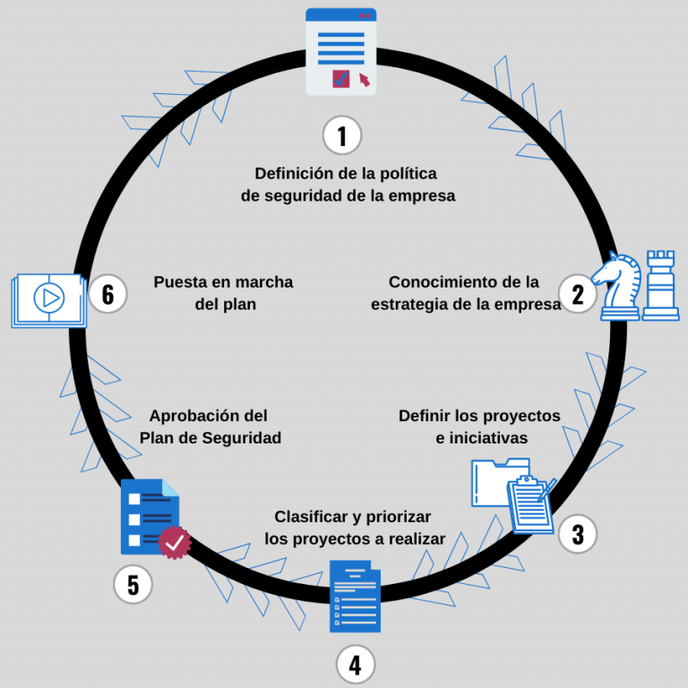
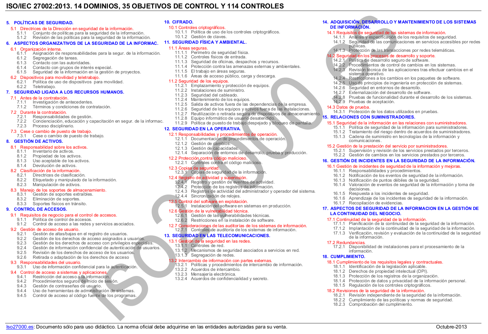
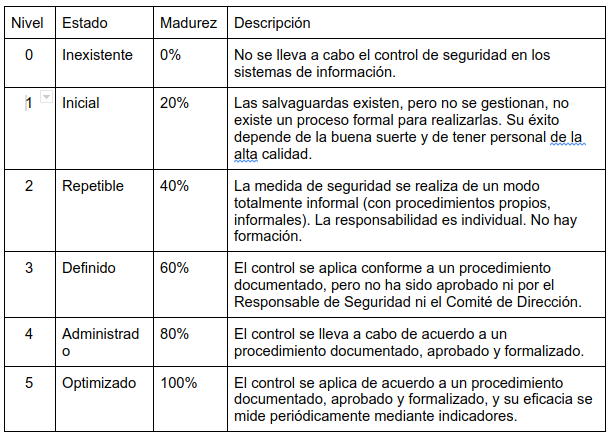
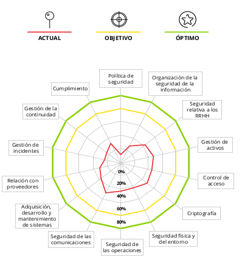
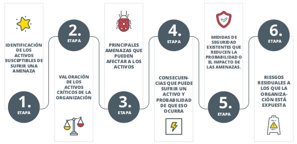
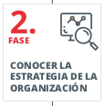
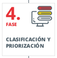
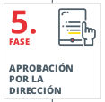
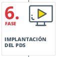
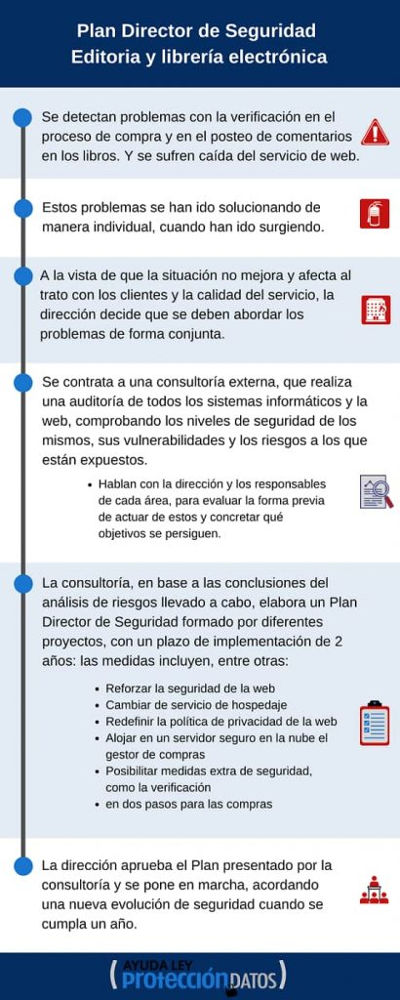

## 2.1. Plan director de seguridad

El Plan Director de Seguridad (PDS) es la hoja de ruta que organiza de manera ordenada
las actuaciones de ciberseguridad que una empresa necesita para proteger la continuidad
del negocio. En este tema aprenderemos a diseñarlo paso a paso siguiendo la guía de
INCIBE, incorporando ejemplos reales y conectando cada fase con el análisis de riesgos
estudiado en la unidad. El objetivo es que, al finalizar, podáis
trabajar en la elaboración de un PDS adaptándolo a cualquier organización.

### 1. Introducción: la necesidad de planificar la seguridad

La digitalización ha convertido la información en un activo imprescindible: facturación,
relación con clientes y proveedores, stock, datos personales o propiedad intelectual
dependen de sistemas y redes. Cuando esos sistemas fallan, el negocio se detiene.
Por eso, proteger la información es proteger la empresa. Pensemos en estas situaciones:

- Un rasonware cifra los datos, paraliza la red y nadie sabe a quién avisar ni cómo recuperar los datos.
- Un empleado descontento filtra datos sensibles a la competencia.
- Se pierde un disco duro externo con informes financieros sin cifrar.
- La web de comercio electrónico sufre un ataque de denegación de servicio y queda fuera de línea en plena campaña.
- Un servidor de correo deja de funcionar durante un día por falta de mantenimiento.

En todos estos casos aparecen preguntas inquietantes: ¿hay copias de seguridad fiables?
¿se habían identificado los riesgos? ¿contamos con personal preparado para reaccionar?
Si las respuestas son dudosas, es el momento de diseñar un Plan Director de Seguridad.

### 2. Concepto y objetivos del Plan Director de Seguridad

Un PDS es un documento que establece un conjunto estructurado de políticas, objetivos, controles y procedimientos de seguridad que una organización debe implementar para proteger sus activos digitales y físicos. Este plan se basa en una evaluación de la situación actual de seguridad, la identificación de riesgos y el establecimiento de medidas concretas para mitigar dichos riesgos de acuerdo con la estrategia de negocio.

!!! note "Nota"
    EL PDS consiste en definir y priorizar un conjunto de proyectos de seguridad de la información con el fin de reducir los riesgos a niveles aceptables.

El PDS permite a la organización:

* Definir y priorizar objetivos de seguridad alineados con su misión y visión.
* Identificar amenazas y vulnerabilidades en sus sistemas y procesos.
* Planificar acciones correctivas y preventivas a través de proyectos y medidas específicas.
* Alinear sus estrategias de seguridad con normativas y estándares internacionales, como ISO 27001, RGPD, PCI-DSS, entre otros.

Para que sea eficaz, el PDS:

1. Debe **alinearse con la estrategia** general y tecnológica de la empresa.
2. Requiere un **alcance claro** (qué procesos, departamentos o sistemas están incluidos).
3. Tiene que **asignar responsabilidades** tanto a personal interno como a proveedores.
4. Necesita la **aprobación explícita de la dirección** para asegurar recursos y legitimidad.
5. Debe **contemplar obligaciones legales** (RGPD, ENS, PCI-DSS...) y buenas prácticas.

El PDS no es un documento estático. Tras completar un ciclo, se revisa y vuelve a empezar
para incorporar cambios en la organización, nuevas amenazas o lecciones aprendidas.

### 3. Visión general del ciclo del PDS

El ciclo propuesto por INCIBE comprende seis fases, que abordaremos en detalle:

1. **Conocer la situación** actual de la organización.
2. **Entender la estrategia** de la organización.
3. **Definir proyectos** e iniciativas.o MAGERIT v3,
4. Clasificar y **priorizar los proyectos**.
5. **Obtener la aprobación** de la dirección.
6. **Poner en marcha** el plan y establecer la mejora continua.

Cada fase se apoya en la anterior. Si la fotografía inicial es deficiente, las decisiones
posteriores quedarán desalineadas y el plan perderá credibilidad.

<figure markdown>
  
  <figcaption>Fases de PDS</figcaption>
</figure>

Una cosa a tener en cuenta al terminar el ciclo es que el PDS es un proceso iterativo. La
última fase consiste en volver a la primera para iniciar un nuevo ciclo, aprovechando
la experiencia adquirida y adaptándose a los cambios en el entorno.

### 4. Fase 1. Conocer la situación actual de la organización

En estas primeras etapas se recopila información para entender cómo se gestiona la seguridad
actualmente. Intentamos obtener una imagen clara y detallada del estado de seguridad, identificando las prácticas,
controles y medidas existentes y determinando su eficacia. Conocer la situación actual nos permite entender tanto las
fortalezas como las vulnerabilidades en seguridad, y establece una base sólida para definir estrategias, priorizar recursos y planificar mejoras.

Esta fase recoge la mayor parte del trabajo. Se trata de obtener una visión honesta y
documentada del **estado de la seguridad en aspectos organizativos, técnicos, físicos y
legales**. La dirección debe respaldarla para garantizar que los departamentos colaboren.

#### 4.1. Actividades previas

Durante el análisis de la situación actual, es importante realizar ciertas actividades preliminares que nos ayudarán a establecer un marco adecuado para el desarrollo del Plan Director de Seguridad. Estas actividades previas aseguran que el alcance y las responsabilidades estén claros, y que la organización esté preparada para un análisis profundo y estructurado. A continuación, exploraremos cada una de estas actividades.

##### 4.1.1. Definir el alcance

Definir el alcance consiste en definir qué partes de la organización serán analizadas y protegidas en el PDS. Esto incluye departamentos, activos (recursos de valor como datos, sistemas y procesos) y los procesos que se consideran críticos para el negocio.

Podemos centrarnos en toda la empresa o iniciar el plan en un área crítica (por ejemplo, el proceso de facturación,
el departamento de TI o la plataforma de comercio electrónico). Determinar el alcance condiciona el esfuerzo, los recursos y los tiempos.

Lo recomendable es determinar aquellos activos y procesos de negocio críticos, aquellos sin los que la empresa no puede
subsistir, y utilizar éstos como alcance del PDS. De esta manera, la ejecución del PDS tendrá un impacto más positivo sobre la seguridad de la información de la organización

**Ejemplo**: una pyme industrial decide iniciar el PDS con los procesos de compras,
almacén y facturación porque dependen de un ERP cuyos fallos afectan a la continuidad del negocio.

**Ejemplo**: Imaginemos que una empresa tiene tres departamentos principales: ventas, finanzas y recursos humanos. Cada uno maneja diferentes tipos de información, como datos de clientes en ventas, datos financieros en el departamento de finanzas y datos de empleados en recursos humanos. Definir el alcance significa decidir si el plan incluirá la protección de todos estos departamentos o solo algunos. En este caso, el PDS podría enfocarse primero en el área de finanzas, que maneja datos críticos y que, en caso de una brecha de seguridad, podría generar mayores impactos económicos.

Si el proceso más crítico de nuestra empresa está relacionado con el proceso de facturación, podemos limitar
el alcance a éste: sistemas y equipos implicados, personal, aplicaciones necesarias, riesgos específicos, etc.
Aunque las mejoras serán específicas dentro de este proceso, nos permitirá profundizar en el resultado y
partir de un punto para extenderlo a otros departamentos o procesos.

**Objetivo**: Definir el alcance nos ayuda a establecer límites claros y priorizar los recursos y esfuerzos en las áreas de mayor riesgo o criticidad.

##### 4.1.2. Identificar responsables de los activos

Es fundamental identificar los activos que queremos proteger (por ejemplo, bases de datos, sistemas de correo electrónico, documentos sensibles, etc.) y definir quién es el responsable de su gestión y protección.

Los activos incluyen personas, procesos, datos, aplicaciones, equipos,
instalaciones y servicios. Para gestionarlos conviene asignar responsabilidades:

- Responsable de Seguridad: coordina el plan y hace seguimiento de las medidas.
- Responsables de información: velan por datos concretos (clientes, nóminas, diseño).
- Responsables de ámbito: supervisan controles lógicos, físicos, legales y organizativos. (ej ámbito: TI, RR. HH., Jurídico, Compras).

En empresas pequeñas una misma persona puede asumir varios roles, pero deben quedar
documentados para saber quién toma decisiones y quién valida los controles.

**Ejemplo**: En una empresa, un servidor que contiene datos de clientes es un activo crítico. La persona responsable de este servidor podría ser el administrador de sistemas o el jefe de TI. Este responsable debe estar al tanto de las medidas de seguridad que protegen el servidor, como el acceso restringido, la instalación de antivirus y la realización de copias de seguridad.

**Objetivo**: Tener claridad sobre quiénes son los responsables de cada activo ayuda a asignar las tareas de seguridad adecuadamente y asegura que siempre haya alguien a cargo de su protección.

##### 4.1.3. Realizar una valoración inicial

Realizar una valoración preliminar consiste en evaluar el estado actual de la seguridad en la organización, identificando qué controles de seguridad ya están implementados, cómo se aplican y cuáles son necesarios según la normativa y las buenas prácticas.

!!! note "Nota"
    **Controles**: Medidas de todo tipo (técnico, legal u organizativo) que se implementan para contrarrestar los riesgos de seguridad.

Para realizar este trabajo podemos apoyarnos en la norma ISO/IEC 27002:2017 para seleccionar controles relevantes.  No se trata de aplicar toda la norma, sino de elegir los apartados que **realmente afecten al alcance**. Por ejemplo:

- Si nuestra empresa no desarrolla aplicaciones, no tendremos que valorar aquellos controles de esta norma que hagan referencia al desarrollo seguro de aplicaciones.
- Si nuestra empresa no proporciona un servicio de comercio electrónico, no será necesario que apliquemos los controles relacionados con la transacción de datos personales en la compra-venta online.
- Por el contrario, sí será necesario aplicar medidas o controles relacionados con las copias de seguridad o el proceso de altas y bajas de personal, ya que éstos serán de aplicación en cualquier organización.

**Ejemplo**: Supongamos que una empresa ya cuenta con antivirus y cortafuegos, pero no tiene una política de contraseñas seguras o un sistema de control de accesos. La valoración inicial revelará estas deficiencias, indicando áreas donde se requieren mejoras. Como parte de esta valoración, se podría usar la ISO 27002, que ofrece un marco de controles de seguridad para diferentes aspectos, desde el control de acceso hasta la protección de datos.

El resultado se refleja en un “Documento de Selección de Controles” o *Declaración de
Aplicabilidad (SoA)*, donde se indica si cada control está implantado, en curso o pendiente.

**Objetivo**: Esta valoración inicial proporciona una visión general del estado actual de la seguridad y ayuda a determinar qué controles adicionales son necesarios.

###### 4.1.3.1 ISO/IEC 27002

La ISO/IEC 27002 es un estándar internacional que proporciona directrices sobre controles específicos para la gestión de la seguridad de la información. Forma parte de la familia de normas ISO/IEC 27000, la cual está diseñada para ayudar a las organizaciones a establecer, implementar, mantener y mejorar un Sistema de Gestión de Seguridad de la Información (SGSI). A continuación, se detalla en qué consiste, su utilidad y cómo puede emplearse en el desarrollo de un Plan Director de Seguridad (PDS).

<figure markdown>
  
  <figcaption>iso 27002</figcaption>
</figure>

**¿Qué es la ISO 27002?**

La ISO/IEC 27002 es una guía de mejores prácticas que detalla controles específicos de seguridad de la información y cómo deben ser aplicados para proteger la confidencialidad, integridad y disponibilidad de la información. No es una norma de certificación (a diferencia de la ISO/IEC 27001, que establece los requisitos para un SGSI), sino una norma de referencia que define más de cien controles de seguridad clasificados en 14 dominios, tales como:

1. Políticas de seguridad de la información
2. Organización de la seguridad de la información
3. Seguridad de los recursos humanos
4. Gestión de activos
5. Control de accesos
6. Criptografía
7. Seguridad física y ambiental
8. Seguridad de las operaciones
9. Seguridad de las comunicaciones
10. Adquisición, desarrollo y mantenimiento de sistemas de información
11. Relación con proveedores
12. Gestión de incidentes de seguridad de la información
13. Continuidad del negocio
14. Cumplimiento

**¿Para qué sirve la ISO 27002?**

La ISO 27002 es útil para que las organizaciones tengan una referencia práctica y detallada de los controles de seguridad necesarios para proteger sus activos de información. Sirve para:

1. Desarrollar políticas y procedimientos de seguridad que sean completos y efectivos.
2. Alinear la seguridad de la información con las mejores prácticas internacionales, lo que es fundamental para organizaciones que buscan estandarizar y profesionalizar su enfoque de seguridad.
3. Facilitar el cumplimiento normativo: Ayuda a cumplir con leyes y regulaciones que exigen una gestión de la seguridad estructurada (por ejemplo, RGPD en Europa).
4. Orientar la implementación de controles específicos: Proporciona detalles sobre cómo implementar cada control, asegurando que no queden lagunas en la protección de los activos críticos de la organización.

¿Cómo puedo usar la ISO 27002 en el Proceso de un Plan Director de Seguridad?

La ISO 27002 puede ser una guía fundamental en casi todas las fases del desarrollo del PDS. A continuación, se detalla cómo utilizarla en cada una de estas fases:

1. Situación Actual

* Valoración Inicial: Al analizar la situación actual de seguridad, la ISO 27002 ofrece un marco de referencia para evaluar qué controles ya existen en la organización y cuáles faltan. Por ejemplo, se puede revisar si existen controles adecuados en gestión de accesos, protección de datos en tránsito y en reposo, o control de dispositivos móviles.
* Análisis de Cumplimiento de normativa: La norma proporciona una lista de controles necesarios para cumplir con normativas de seguridad reconocidas. Durante el análisis de cumplimiento, se puede comparar cada control con las pautas de ISO 27002 para asegurarse de que se alinean con las mejores prácticas.

2. Comprensión de la Estrategia Empresarial

* Alineación con Estrategias TIC: La ISO 27002 ayuda a definir controles adecuados que respalden las estrategias de centralización, externalización y digitalización de servicios TIC, estableciendo medidas de seguridad específicas para proveedores y tecnologías en la nube, por ejemplo.

3. Definición de Proyectos e Iniciativas

* Iniciativas de Mejora: La ISO 27002 proporciona ideas concretas de proyectos e iniciativas, como la implementación de controles de acceso o la gestión de dispositivos móviles, que pueden adoptarse o adaptarse según las necesidades de la organización.
* Gestión de Riesgos Críticos: La norma detalla controles específicos para gestionar riesgos críticos (por ejemplo, gestión de incidentes de seguridad o continuidad de negocio), lo que permite que los proyectos se desarrollen con una base sólida.

4. Clasificación y Priorización de Proyectos

* Criterios de Priorización: Con la ISO 27002, es posible identificar qué controles son esenciales para cumplir con normativas o proteger activos críticos, ayudando a clasificar y priorizar los proyectos del PDS en función de su importancia y urgencia.

5. Aprobación del Plan Director de Seguridad

* Justificación de Iniciativas: La ISO 27002 puede respaldar cada iniciativa en términos de conformidad con las mejores prácticas internacionales, lo que facilita la aprobación del PDS por la dirección al demostrar que los proyectos propuestos cumplen con estándares de alto nivel.

6. Implementación del Plan

* Guía para la Implementación: Durante la implementación de cada proyecto, la ISO 27002 proporciona pautas sobre cómo aplicar controles específicos. Por ejemplo, si se está implementando un control de acceso, la norma detalla requisitos y sugerencias para asegurar que el acceso a la información sea apropiado y seguro.
* Validación de Controles: La ISO 27002 también puede usarse para validar que los controles implementados cumplen con los estándares esperados en términos de eficacia y formalización.

**Ejemplo de Uso Práctico de la ISO 27002 en el PDS**

Imaginemos que en el análisis inicial de seguridad se detecta que la organización no cuenta con una política de gestión de accesos. La ISO 27002 especifica controles relacionados con la gestión de accesos que incluyen:

* Establecimiento de una política de control de acceso (por ejemplo, restringir accesos según el rol del usuario, según horarios).
* Asignación de permisos de acceso mínimos necesarios para cada usuario.
* Implementación de autenticación multifactor para accesos remotos.

A partir de estas pautas, la organización puede desarrollar un proyecto específico dentro del PDS que incluya:

1. Desarrollar la política de gestión de accesos en línea con ISO 27002.
2. Implementar autenticación multifactor (MFA) como se recomienda en la norma.
3. Establecer revisiones periódicas de permisos para asegurar que los accesos estén actualizados y alineados con las funciones actuales de cada empleado.

**Ejemplo de Uso Práctico de la ISO 27002 en el PDS**

Vamos a ver un ejemplo práctico de cómo una empresa de venta online podría utilizar la ISO/IEC 27002:2013 para estructurar y mejorar su seguridad en varios aspectos clave.

Supongamos que esta empresa de venta online, eCommerce Plus, quiere mejorar su seguridad para proteger los datos de sus clientes y cumplir con normativas de protección de datos. eCommerce Plus almacena datos sensibles de sus clientes, como direcciones, números de tarjeta de crédito (a través de un tercero), historiales de compra y preferencias de productos.

Uso de la ISO 27002:2013 en eCommerce Plus

A continuación, se detallan algunas áreas de la ISO 27002:2013 que eCommerce Plus podría implementar para fortalecer su seguridad.

1. Control de Acceso (Sección 9 de ISO 27002)

Objetivo: Asegurar que solo el personal autorizado pueda acceder a datos sensibles de clientes y sistemas críticos.

* Aplicación Práctica: eCommerce Plus establece una política de control de acceso basada en los principios de "necesidad de saber" y "mínimo privilegio". Esto significa que cada empleado solo tiene acceso a los datos y sistemas que necesita para su función.
* Controles Recomendados:

  * Implementar autenticación multifactor (MFA) para acceder a sistemas críticos (por ejemplo, al sistema de gestión de inventarios y al backend de la tienda online).
  * Utilizar roles y permisos para segmentar el acceso a información en función del rol del empleado (por ejemplo, el equipo de atención al cliente tiene acceso a historiales de pedidos, pero no a la información de pago).

2. Cifrado de Datos (Sección 10 de ISO 27002)

Objetivo: Proteger la confidencialidad de los datos sensibles almacenados y transmitidos.

* Aplicación Práctica: eCommerce Plus implementa el cifrado en las áreas de mayor riesgo:

  * Cifrado de la base de datos donde se almacenan los datos personales de los clientes.
  * Cifrado de las comunicaciones entre el cliente y el servidor mediante HTTPS, asegurando que los datos personales y de pago estén protegidos durante la transmisión.
* Controles Recomendados:

  * Utilizar un cifrado fuerte (por ejemplo, AES-256) para proteger los datos almacenados.
  * Garantizar que los certificados SSL/TLS estén actualizados y renovados regularmente.

3. Seguridad de las Comunicaciones (Sección 13 de ISO 27002)

Objetivo: Proteger la información cuando se transmite a través de redes.

* Aplicación Práctica: eCommerce Plus usa conexiones seguras y establece políticas para asegurar que toda la comunicación que implique datos sensibles se realice a través de redes protegidas:

  * Todas las interacciones con los clientes, incluyendo confirmaciones de pedidos y comunicaciones de soporte, están protegidas con HTTPS.
  * Cualquier comunicación interna que contenga datos sensibles (por ejemplo, información de transacciones, pedidos o información de clientes) también se realiza a través de canales cifrados y seguros.
* Controles Recomendados:

  * Configurar y mantener VPNs seguras para conexiones remotas de empleados.
  * Implementar firewalls para proteger la red de posibles intrusiones.

4. Gestión de Incidentes de Seguridad de la Información (Sección 16 de ISO 27002)

Objetivo: Asegurarse de que los incidentes de seguridad de la información se gestionen de manera oportuna y eficiente.

* Aplicación Práctica: eCommerce Plus implementa un protocolo de gestión de incidentes que incluye:

  * Un procedimiento para detectar y responder a incidentes de seguridad, como intentos de acceso no autorizado o anomalías en los sistemas de pago.
  * Un sistema de alertas automáticas que notifica al equipo de seguridad cuando se detectan comportamientos sospechosos, como múltiples intentos fallidos de inicio de sesión.
* Controles Recomendados:

  * Establecer un equipo de respuesta a incidentes con roles y responsabilidades definidos para cada tipo de incidente.
  * Documentar y analizar cada incidente para aprender de ellos y mejorar la prevención.

5. Relación con Proveedores (Sección 15 de ISO 27002)

Objetivo: Asegurar que los terceros que procesan datos de la empresa cumplan con estándares de seguridad.

* Aplicación Práctica: eCommerce Plus trabaja con un proveedor de procesamiento de pagos que maneja los datos de tarjetas de crédito. La empresa se asegura de que este proveedor cumpla con el estándar PCI-DSS, que regula la seguridad de los datos de tarjetas de pago.

  * eCommerce Plus establece un acuerdo de nivel de servicio (SLA) en el que el proveedor se compromete a cumplir con los requisitos de seguridad establecidos por la normativa.
  * Se realizan auditorías periódicas o se solicitan certificaciones actualizadas del proveedor para verificar su cumplimiento.
* Controles Recomendados:

  * Definir claramente los requisitos de seguridad para los proveedores y los datos que pueden procesar.
  * Mantener una lista actualizada de proveedores críticos y realizar evaluaciones periódicas de su cumplimiento.

6. Cumplimiento con Normativas (Sección 18 de ISO 27002)

Objetivo: Asegurarse de que eCommerce Plus cumpla con las leyes y regulaciones, como el Reglamento General de Protección de Datos (RGPD).

* Aplicación Práctica: eCommerce Plus implementa una política de privacidad y establece procedimientos claros para manejar los datos personales de los clientes, cumpliendo con los requisitos del RGPD. Esto incluye:

  * Obtener el consentimiento explícito de los clientes para almacenar y procesar sus datos.
  * Ofrecer una opción para que los clientes soliciten la eliminación de sus datos de los sistemas de la empresa.
  * Notificar a las autoridades y a los clientes en caso de una brecha de seguridad que comprometa los datos personales.
* Controles Recomendados:

  * Mantener un registro de actividades de procesamiento de datos personales.
  * Designar un Responsable de Protección de Datos (DPO) para asegurar el cumplimiento de las normativas de privacidad.

Como conclusion final despuesd e este ejemplo podemos decir que la ISO 27002:2013 proporciona una guía integral para eCommerce Plus en la implementación de controles de seguridad, permitiéndole abordar las necesidades específicas de protección de datos y cumplimiento normativo. Al aplicar estos controles, eCommerce Plus logra una estructura de seguridad robusta que:

* Protege los datos sensibles de clientes y transacciones.
* Minimiza riesgos como el acceso no autorizado y las brechas de seguridad.
* Cumple con regulaciones clave como el RGPD y PCI-DSS.
* Establece políticas y procedimientos que fortalecen la confianza de los clientes.

En cada una de las fases del PDS, la ISO 27002:2013 permite que eCommerce Plus seleccione los controles necesarios para proteger su información y servicios en línea de acuerdo con mejores prácticas internacionales, mejorando así su resiliencia y reputación en el mercado online.

##### 4.1.4. Analizar el cumplimiento

Una vez seleccionados los controles, se evalúa su implantación real y su valoración de madurez mediante una auditoría de cumplimiento.

Para evaluar el nivel de madurez de los controles de seguridad en una organización, podemos utilizar un modelo estructurado en niveles de consecución que mide qué tan formalizados y eficaces son los controles. Este modelo de madurez se clasifica en seis niveles:

Tabla de madurez (0–5) con porcentaje y un ejemplo aplicado al control **“Copia de seguridad de la información” (ISO/IEC 27002)**:

|             Nivel | % cumplimiento | Descripción de madurez                                                                            | Ejemplo (ISO/IEC 27002 – Copia de seguridad de la información)                                                                                                                             |
| ----------------: | :------------: | -------------------------------------------------------------------------------------------------- | -------------------------------------------------------------------------------------------------------------------------------------------------------------------------------------------- |
|  0 – Inexistente |       0%       | El control no se ha implementado ni existe procedimiento o intención.                             | No se realizan copias de seguridad ni hay política o responsable asignado.                                                                                                                  |
|      1 – Inicial |      20%      | El control existe de forma rudimentaria, sin gestión formal; depende de acciones individuales.    | Copias manuales y esporádicas hechas por usuarios; sin calendario, sin registro y sin responsable.                                                                                          |
|    2 – Repetible |      40%      | El control se aplica de forma informal y sin proceso documentado; se repite con cierta constancia. | Copias programadas (p. ej., diarias) pero sin verificación automática ni pruebas de restauración; registros incompletos.                                                                  |
|     3 – Definido |      60%      | Proceso documentado y aplicado según procedimiento; aún sin aprobación oficial.                 | Procedimiento escrito con roles, calendarios y retenciones definidas; evidencias de ejecución; falta aprobación formal de dirección/seguridad.                                            |
| 4 – Administrado |      80%      | Proceso documentado,**aprobado** y supervisado regularmente por responsables.                      | Política y procedimiento aprobados; verificación automática de copias; restauraciones de prueba periódicas (p. ej., trimestrales) y reporting.                                           |
|   5 – Optimizado |      100%      | Eficacia medida con indicadores y mejora continua; el control se revisa y optimiza.                | KPIs (tasa de éxito, MTTR de restauración), RTO/RPO definidos y revisados; automatización (copias inmutables/3-2-1), simulacros de DR con lecciones aprendidas y plan de mejora continua. |

Cada uno de estos niveles representa un grado de desarrollo y formalización del control en cuestión, desde la falta completa de implementación hasta su total optimización, con revisiones y mejoras continuas.

<figure markdown>
  
  <figcaption>Niveles de madurez</figcaption>
</figure>

Esta actividad combina la realización de entrevistas, revisión documental y visitas a instalaciones, etc:

1. Preparad cuestionarios y checklists basados en los controles seleccionados.
2. Reuníos con responsables de todas las áreas implicadas (TI, RR. HH., Jurídico, Administración,
   Servicios Generales, Calidad) para evaluar cómo aplican los controles.
3. Revisad la seguridad física: accesos a CPD, sistemas antiincendios, condicionantes ambientales.
4. Recoged pruebas y evidencias (fotografías, registros, informes) y registrad incidencias/problemas detectadas.
5. Analizar resultados y asignad puntuaciones de 0 a 5 en cada control para poder representar los resultados en gráficos radar.
6. Solicitad a la dirección un comunicado que refuerce la importancia del proyecto para asegurar la colaboración.

**Ejemplo**: Supongamos que el departamento de TI tiene políticas para la protección de datos y el control de acceso, pero al revisarlas descubrimos que el departamento de ventas no está cumpliendo con estas políticas al dejar sesiones de usuario abiertas o al compartir contraseñas. Esta actividad ayuda a identificar áreas donde los procedimientos de seguridad no se cumplen y a educar a los departamentos para mejorar su adherencia.

**Ejemplo*: Modelo de Madurez para el Control de "Gestión de Contraseñas"

Supongamos que queremos evaluar el nivel de madurez en la Gestión de Contraseñas de una organización, un control de seguridad que incluye políticas de uso de contraseñas seguras, cambios periódicos de las mismas y su complejidad mínima.
Ejemplo de Evaluación de Madurez:

0. Inexistente (0%): La organización no tiene ninguna política o control respecto al uso de contraseñas. Los empleados utilizan contraseñas simples o fácilmente adivinables y pueden no cambiarlas nunca. No existe un control para verificar el tipo o la calidad de las contraseñas.
1. Inicial (20%): Hay una recomendación no formal para utilizar contraseñas "fuertes", pero no se realiza seguimiento ni control sobre el cumplimiento. Depende completamente de que los empleados elijan contraseñas adecuadas sin un proceso obligatorio o pautas definidas.
2. Repetible (40%): Existen instrucciones informales para usar contraseñas complejas y cambiarlas cada cierto tiempo, aunque no están documentadas ni son obligatorias. Los empleados pueden recibir indicaciones orales o por correo, pero no existe un proceso centralizado para garantizar el cumplimiento.
3. Definido (60%): La organización tiene una política documentada que describe la longitud mínima, complejidad y frecuencia de cambio de contraseñas. Sin embargo, la política aún no ha sido aprobada oficialmente por la dirección, y su aplicación no se monitorea de manera continua.
4. Administrado (80%): La política de contraseñas está documentada, aprobada y es formalmente parte de las políticas de la organización. Los sistemas de TI están configurados para requerir contraseñas complejas y solicitar su cambio cada tres meses. Existe una revisión periódica del cumplimiento, y los responsables de TI pueden hacer seguimiento para asegurarse de que los empleados cumplan con las pautas.
5. Optimizado (100%): La política de contraseñas no solo es obligatoria y está implementada en todos los sistemas de la organización, sino que se realizan auditorías periódicas para medir su cumplimiento y efectividad. Se aplican indicadores de rendimiento (KPI) para evaluar su eficacia, y el control se revisa y ajusta regularmente para adaptarse a amenazas emergentes, como el aumento de ataques de fuerza bruta o de phishing. La organización cuenta también con autenticación multifactor (MFA) para mejorar aún más la seguridad en el acceso.``

**Objetivo**: El análisis de cumplimiento asegura que los controles de seguridad sean realmente aplicados en todos los departamentos y permite ajustar la capacitación o los procesos donde sea necesario.

##### 4.1.5. Establecer objetivos de mejora

Con los resultados del análisis de madurez se definen objetivos realistas de mejora. Agruparemos los controles en dominios temáticos (políticas, organización, RR. HH., seguridad física, comunicaciones, operaciones, control de acceso, adquisición de sistemas, desarrollo, gestión de incidentes, continuidad, cumplimiento legal) y representar los resultados en un gráfico radar. Se puede tener presente el cumplimiento de otras normativas como el RGPD, ENS, PCI-DSS o ISO 27001, a la hora de definir los objetivos.

Entonces, partiendo de los datos que ya teniamos, se fijan objetivos realistas. Es útil dibujar un gráfico con tres curvas según los dominios:

- Línea roja: grado de cumplimiento actual.
- Línea amarilla: objetivo de cumplimiento a medio plazo (por ejemplo, 12 meses).
- Línea verde: nivel óptimo de cumplimiento a largo plazo.

Así se visualiza qué dominios requieren más esfuerzo: seguridad física, control de acceso, gestión de incidentes, copias de seguridad, criptografía, etc.

<figure markdown>
  
  <figcaption>Objetivos de mejora</figcaption>
</figure>

**Ejemplo**: Si el análisis revela que la seguridad física y la gestión de incidentes tienen puntuaciones bajas (por ejemplo, 2 y 1 respectivamente), podemos establecer objetivos específicos para mejorar estos dominios en los próximos 12 meses, como implementar controles de acceso físico más estrictos y desarrollar un plan de respuesta a incidentes.

**Ejemplo**: Una empresa de servicios financieros puede establecer como objetivo "garantizar la seguridad y confidencialidad de los datos de los clientes y cumplir con la normativa RGPD." Este objetivo puede incluir la mejora de políticas de protección de datos, la implementación de controles de acceso y la capacitación en ciberseguridad para el personal.

**Objetivo**: Establecer objetivos de ciberseguridad claros permite enfocar el esfuerzo en las áreas que necesitan más atención y asegura que el PDS esté alineado con las metas y los valores de la empresa.

!!! note "Nota"
    Las mejoras en controles para salvar la distancia entre estado actual y objetivo se transformarán en proyectos tecnologicos dentro del PDS.

#### 4.2. Análisis técnico de seguridad

Las tareas anteriores se centran en aspectos **organizativos y de gestión**, y son esenciales
para entender el contexto. Sin embargo, es necesario **complementar esa visión con un
análisis técnico** que identifique vulnerabilidades en sistemas, redes y aplicaciones.

Por tanto, paralelamente a las tareas anteriores se deben realizar auditorías técnicas:

- Verificar la segmentación de la red y la correcta ubicación de los sistemas expuestos a Internet.
- Comprobar la existencia y actualización de cortafuegos, IDS/IPS, antivirus y soluciones antimalware.
- Revisar la política de contraseñas, la gestión de parches y las configuraciones de servidores.
- Evaluar la seguridad del sitio web y de las aplicaciones críticas.
- Planificar pruebas de restauración para minimizar impactos en producción.

Debido a que se trata de un trabajo especializado, es habitual que la organización opte
por externalizar el análisis técnico de la seguridad. En estos casos debemos prestar especial atención a la coordinación del
equipo externo con el personal propio de nuestra organización, para establecer el tipo
de pruebas a realizar y el método de trabajo que se utilizará.

Se recomienda realizar auditorías tanto externas como internas. Así evaluamos el punto
de vista de un atacante externo y la posible amenaza interna. Todos los hallazgos deben
documentarse con su evidencia y se clasifican según criticidad para integrarlos más tarde
en el catálogo de iniciativas.

!!! note "Nota"
    Las brechas encontradas aqui se trasnformarán en proyectos tecnologicos dentro del PDS.

**Ejemplo**: Una auditoría técnica puede revelar que un servidor web expuesto a Internet tiene una versión desactualizada de su software, lo que lo hace vulnerable a ataques conocidos. Esta vulnerabilidad debe ser corregida como parte del PDS.

**Objetivo**: El análisis técnico identifica vulnerabilidades específicas que pueden ser explotadas por atacantes, proporcionando una base sólida para definir medidas correctivas en el PDS. 

#### 4.3. Análisis de riesgos en el contexto del PDS

El análisis de riesgos es el puente entre la situación actual y las acciones futuras. Este análisis se concibe como varias etapas que conectan con el proceso visto anteriormente.

<figure markdown>
  
  <figcaption>Análisis de riesgos</figcaption>
</figure>

1. **Identificación de activos**: ¿qué servicios, aplicaciones, datos y recursos resultan críticos?
2. **Identificación de amenazas y vulnerabilidades**: ataques externos, errores internos, desastres físicos, fallos eléctricos, etc. Y vulnerabilidades técnicas u organizativas como falta de parches, configuraciones débiles, ausencia de formación o procedimientos inadecuados.
3. **Valoración de consecuencias y probabilidad**: se estima el impacto (económico, reputacional, legal)
   y la probabilidad de que la amenaza se materialice.
4. **Evaluación de controles existentes**: qué salvaguardas hay ya implantadas y con qué eficacia.
5. **Cálculo del riesgo residual**: nivel de riesgo que permanece tras aplicar los controles actuales.

El proceso se puede representar como un flujo:

> Activos expuestos a amenazas → Amenazas aprovechan vulnerabilidades → Se produce un impacto
> → Los controles reducen probabilidad/impacto → Queda un riesgo residual que debemos decidir
> si aceptar, mitigar, transferir o eliminar.

<figure markdown>
  
  <figcaption>Evolución de los riesgos</figcaption>
</figure>

##### 4.3.1. Estrategias de tratamiento

Tras calcular el riesgo residual, se decide cómo tratar cada riesgo que supera el umbral
aceptable:

- **Transferir**: contratar un seguro o firmar acuerdos con proveedores para compartir el riesgo.
- **Eliminar**: suprimir la actividad que genera el riesgo (por ejemplo, cerrar un servicio que apenas aporta valor).
- **Asumir**: aceptar el riesgo de forma justificada cuando el coste del control es desproporcionado.
- **Mitigar**: implantar controles técnicos, organizativos o procedimentales que reduzcan la probabilidad
  o el impacto (copias de seguridad con pruebas periódicas, planes de continuidad, redundancia de servidores).

Es fundamental documentar quién adopta cada decisión y con qué argumentos, porque esa
información se revisará en las fases posteriores.

!!! note "Nota"
    Los riesgos que se decida mitigar se transformarán en proyectos tecnologicos dentro del PDS.

### 5. Fase 2. Conocer la estrategia de la organización

Entender la Estrategia Empresarial es un paso clave en el desarrollo de un Plan Director de Seguridad (PDS). El propósito de esta fase es asegurarse de que la estrategia de seguridad esté completamente alineada con los objetivos y planes generales de la organización. Dado que los objetivos empresariales pueden impactar significativamente en la seguridad, adaptar el PDS a estos objetivos permite que la seguridad se convierta en un facilitador del negocio y no en una barrera.
La comprensión de la estrategia empresarial ayuda a que las decisiones en materia de seguridad sean coherentes con los intereses de la organización, permitiendo una integración natural y efectiva de las medidas de protección. 

El PDS solo tendrá sentido si está alineado con la dirección estratégica. En esta fase:

- Se revisan planes corporativos: expansión geográfica, fusiones, nuevas líneas de negocio,
  proyectos de transformación digital o cambios organizativos.
- Se identifican requisitos legales emergentes (por ejemplo, una empresa que comienza a trabajar
  con administraciones públicas deberá cumplir el ENS).
- Se analiza el modelo de servicios TIC (centralización, externalización, uso de cloud).
- Se organiza una reunión con los responsables de los departamentos implicados y con la dirección
  para validar los supuestos y obtener una visión global.

Una buena práctica será analizar la estrategica de la organización con los responsables de los departamentos implicados y con la dirección, para hacer partícipes a todas las áreas y obtener una visión objetiva y global de la organización.

Este análisis permite **anticipar inversiones y evitar proyectos** que quedarán obsoletos en poco tiempo. Nos permitirá priorizar iniciativas que apoyen la estrategia y descartar aquellas que no aporten valor.

**Ejemplo**: Si una empresa planea expandirse a nuevos mercados internacionales, el PDS debe considerar los requisitos de seguridad y cumplimiento específicos de esos mercados, como regulaciones de protección de datos o normativas sectoriales, asi como proteger aquellos activos críticos que soportarán la expansión.

**Objetivo**: Garantizar que el PDS esté alineado con la estrategia empresarial y los planes futuros, asegurando su relevancia y efectividad a largo plazo.

### 6. Fase 3. Definir proyectos e iniciativas

La Definición de Proyectos e Iniciativas es una fase crítica en el desarrollo de un Plan Director de Seguridad (PDS) porque convierte los análisis previos en acciones concretas. En esta etapa, las áreas de mejora, los riesgos identificados y las necesidades de seguridad de la organización se transforman en proyectos y actividades específicos. Estos proyectos tienen como objetivo mejorar la postura de seguridad de la organización y abordar las brechas y vulnerabilidades detectadas.
Es importante que los proyectos estén bien definidos, con objetivos claros y que cuenten con una planificación adecuada de recursos y tiempos. A continuación, revisamos los pasos clave de esta fase con ejemplos prácticos.

Con la información recopilada se definen las acciones necesarias para alcanzar los objetivos de seguridad. Es conveniente agruparlas en tres bloques:

1. Iniciativas para mejorar **métodos de trabajo y cumplimiento normativo**.
2. Iniciativas **técnicas y físicas que corrigen deficiencias** detectadas en auditorías.
3. Iniciativas orientadas a **tratar riesgos que superan el nivel aceptable**.

Cada iniciativa debe describirse con los siguientes elementos: objetivo, alcance, responsables, recursos internos/externos, coste estimado, duración y dependencias.

Ejemplo de formato:

| ID  | Nombre del proyecto                       | Objetivo                                               | Alcance               | Responsable              | Recursos necesarios                                       | Coste estimado | Duración estimada | Dependencias                 |
| --- | ----------------------------------------- | ------------------------------------------------------ | --------------------- | ------------------------ | --------------------------------------------------------- | -------------- | ------------------ | ---------------------------- |
| 01  | Política de seguridad de la información | Definir marco normativo y compromisos de la dirección | Toda la organización | Responsable de Seguridad | Consultoría externa, tiempo del Responsable de Seguridad | 3.000 €       | 2 meses            | Aprobación de la dirección |
| 02  | Plan de concienciación                   | Mejorar cultura de seguridad entre empleados           | Toda la organización | Responsable de RR.HH.    | Empresa de formación, materiales de campaña             | 5.000 €       | 4 meses            | Coordinación con RR.HH.     |
| ... | ...                                       | ...                                                    | ...                   | ...                      | ...                                                       | ...            | ...                |                              |

**Ejemplo** de proyectos definidos en esta fase se muestran a continuación:

#### 6.1. Iniciativas tipo

A modo de ejemplo, la guía propone un catálogo inicial con diez proyectos comunes en muchas organizaciones:

| ID | Proyecto                                  | Descripción ampliada                                                                                                                                                                                    |
| -- | ----------------------------------------- | -------------------------------------------------------------------------------------------------------------------------------------------------------------------------------------------------------- |
| 01 | Política de seguridad de la información | Documento marco que define principios, compromisos de la dirección, uso aceptable de recursos, tratamiento de datos personales y régimen sancionador interno. Debe comunicarse y revisarse anualmente. |
| 02 | Plan de concienciación                   | Programa formativo que combine sesiones presenciales, campañas de correo, cartelería y simulacros de phishing, contando con indicadores de seguimiento.                                                |
| 03 | Gestión de incidentes                    | Procedimientos claros para identificar, registrar, analizar y cerrar incidentes, con un canal de notificación 24/7 y métricas de tiempo de respuesta.                                                  |
| 04 | Adecuación al RGPD                       | Inventario de tratamientos, análisis de legitimación, contratos con encargados, formación específica y revisión de medidas técnicas y organizativas.                                               |
| 05 | Coordinación RR. HH. – TIC              | Circuitos ágiles para altas y bajas de personal, control de accesos físicos y lógicos, retirada de credenciales y devolución de dispositivos.                                                        |
| 06 | Plan de continuidad TIC                   | Análisis de impacto en el negocio (BIA), estrategias de recuperación, procedimientos, pruebas regulares y revisión post-ejercicio.                                                                    |
| 07 | Seguridad en la red corporativa           | Segmentación, VLAN, firewalls internos, IDS/IPS, monitorización de tráfico y gestión de parches, especialmente en servicios expuestos.                                                               |
| 08 | Política de copias de seguridad          | Clasificación de la información, periodicidad de copias, almacenamiento fuera de línea, pruebas de restauración y registros de resultados.                                                           |
| 09 | Clasificación de la información         | Esquema de etiquetado (pública, interna, confidencial) con procedimientos de acceso, cifrado, destrucción y tratamiento por proveedores.                                                               |
| 10 | Gestión de proveedores TIC               | Revisión de contratos, establecimiento de acuerdos de nivel de servicio (SLA) y cláusulas de seguridad, auditorías a proveedores críticos.                                                           |

Estos proyectos son orientativos; cada organización los adaptará a sus necesidades y recursos.

**Objetivo**: Definir un catálogo claro y detallado de proyectos que aborden las áreas de mejora identificadas, tanto a nivel normativo, organizativo y metodos de trabajo, como técnico y de gestión de riesgos. Facilitando su posterior priorización y ejecución.

### 7. Fase 4. Clasificar y priorizar los proyectos

La Clasificación y Priorización de Proyectos es una fase fundamental en el Plan Director de Seguridad (PDS) ya que, en ella, se organiza el orden de implementación de los proyectos de seguridad de acuerdo con su importancia, impacto, urgencia y costo. Dado que las organizaciones suelen tener recursos limitados, esta priorización es clave para que los proyectos más críticos se aborden primero, logrando mejoras en la postura de seguridad de manera eficiente y estratégica.

Una vez definido el catálogo de iniciativas, es necesario priorizarlo. Algunas recomendaciones:

- **Agrupar proyectos** por origen (cumplimiento, auditoría técnica, riesgos) o por tipo (organizativo,
  técnico, legal) para tener una visión equilibrada.
- Utilizar una matriz esfuerzo/impacto que permita **clasificar proyectos** a corto, medio y largo plazo.
- **Identificar “quick wins”**: acciones de bajo esfuerzo con alto beneficio que generen resultados visibles.
- **Analizar dependencias** (por ejemplo, no tiene sentido desplegar un EDR sin tener actualizado el inventario
  de equipos).
- **Ajustar la carga de trabajo** al tamaño del equipo disponible para evitar la saturación.

**Ejemplo**: Supongamos que una organización tiene los siguientes proyectos en su catálogo:

| ID | Proyecto                          | Esfuerzo (1-5) | Impacto (1-5) |
| -- | --------------------------------- | --------------- | -------------- |
| 01 | Política de seguridad            | 2               | 4              |
| 02 | Plan de concienciación           | 3               | 5              |
| 03 | Gestión de incidentes            | 4               | 3              |
| 04 | Adecuación al RGPD               | 5               | 5              |
| 05 | Seguridad en la red corporativa   | 4               | 4              |
| 06 | Plan de continuidad TIC          | 5               | 4              |

Al aplicar la matriz esfuerzo/impacto, los proyectos se pueden clasificar de la siguiente manera:

| ID | Proyecto                          | Esfuerzo (1-5) | Impacto (1-5) | Prioridad      |
| -- | --------------------------------- | --------------- | -------------- | -------------- |
| 01 | Política de seguridad            | 2               | 4              | Alta           |
| 02 | Plan de concienciación           | 3               | 5              | Alta           |
| 03 | Gestión de incidentes            | 4               | 3              | Media          |
| 04 | Adecuación al RGPD               | 5               | 5              | Alta           |
| 05 | Seguridad en la red corporativa   | 4               | 4              | Media          |
| 06 | Plan de continuidad TIC          | 5               | 4              | Media          |

Con esta clasificación, la organización puede decidir abordar primero los proyectos de alta prioridad (Política de seguridad, Plan de concienciación y Adecuación al RGPD) antes de pasar a los proyectos de prioridad media.

**Objetivo**: Crear un plan de acción realista y efectivo que maximice el impacto de las inversiones en seguridad, asegurando que los recursos se utilicen de manera óptima para proteger los activos críticos de la organización.

!!! note "Nota"
    Una forma común de agrupar los controles de seguridad es por categorías temáticas. Una de las referencias más utilizadas para la clasificación “canónica” de controles es la de ISO/IEC 27001:2022 (Anexo A), que agrupa todo en cuatro temas:    
    * **Organizacionales** (gobierno, riesgos, cumplimiento legal/contractual, terceros, continuidad, etc.)
    * **Personas** (RR. HH., formación y concienciación, alta/baja de personal, funciones y responsabilidades)
    * **Físicos** (accesos a instalaciones, zonas seguras, CCTV, protección ambiental/energética)
    * **Tecnológicos** (IAM, hardening, redes, EDR/antimalware, cifrado, registros, backups, DevSecOps)

### 8. Fase 5. Aprobar el Plan Director de Seguridad

La Aprobación del Plan Director de Seguridad (PDS) es clave para que el PDS esté bien visto y se lleve a cabo finalmente, ya que formaliza y valida todo el trabajo realizado en las fases previas. La aprobación implica que la alta dirección de la organización revisa y acepta el plan, comprometiéndose a asignar los recursos necesarios y a apoyar la implementación de los proyectos e iniciativas de seguridad. Esta validación es fundamental para garantizar que el PDS no solo exista en papel, sino que se ejecute de manera efectiva y alineada con los objetivos estratégicos de la organización.

Con el catálogo de proyectos ya priorizados, se prepara un dossier ejecutivo para la dirección. Debe incluir:

- Resumen del análisis de situación (fortalezas, debilidades, riesgos críticos).
- Lista priorizada de iniciativas con su coste estimado y calendario.
- Beneficios esperados (reducción del riesgo, cumplimiento legal, mejora operativa).
- Consecuencias de no ejecutar el plan (escenarios de riesgo sin tratar).

La aprobación puede requerir ajustes de alcance o de plazos. Es habitual repetir el ciclo de revisión
hasta lograr un consenso. Una vez aprobado, la dirección debe comunicarlo a todas las personas para
reforzar el compromiso colectivo.

**Ejemplo**: Una empresa de servicios financieros presenta su PDS a la junta directiva, destacando cómo el plan aborda las vulnerabilidades críticas identificadas en auditorías previas y cómo se alinea con los objetivos de cumplimiento normativo. La dirección aprueba el plan, comprometiéndose a asignar un presupuesto anual para su ejecución y a revisar el progreso trimestralmente. 

**Objetivo**: Obtener el compromiso formal de la alta dirección para asegurar que el PDS cuente con los recursos y el apoyo necesarios para su implementación exitosa.

### 9. Fase 6. Puesta en marcha y mejora continua

La Implementación del Plan Director de Seguridad (PDS) es la fase en la que se ejecutan los proyectos e iniciativas de seguridad definidos y aprobados en las etapas previas. Esta fase implica poner en práctica las políticas, procedimientos y controles que protegerán a la organización frente a riesgos de seguridad. La implementación debe seguir una metodología de proyectos, con responsabilidades y plazos bien definidos, asegurando que cada iniciativa se ejecute de forma coordinada y controlada.

El éxito del PDS depende de su ejecución. Para realizar una buena ejecución, se recomienda:

- Organizar una **presentación inicial** con todas las personas involucradas para explicar objetivos y responsabilidades.
- **Nombrar responsables o coordinadores** de cada proyecto y dotarlos de recursos (humanos, económicos, técnicos).
- **Crear un comité de gestión** que se reúna periódicamente para revisar el avance, resolver bloqueos y actualizar riesgos.
- **Definir indicadores** (KPIs) como porcentaje de controles implantados, tiempos de respuesta a incidentes
  o grado de cumplimiento de SLAs con proveedores.
- **Revisar periódicamente** que cada acción completada corrige la brecha detectada.
- **Revaluar el plan** cuando cambien las condiciones del negocio o aparezcan nuevas amenazas relevantes.

Al finalizar el ciclo se inicia de nuevo la fase 1, aprovechando los datos del seguimiento para mejorar
la siguiente iteración.

**Ejemplo**: Una empresa de comercio electrónico implementa su PDS comenzando con la actualización de su política de seguridad y la capacitación del personal en concienciación sobre ciberseguridad. Se establece un comité de gestión que se reúne mensualmente para revisar el progreso de los proyectos, resolver problemas y ajustar el plan según sea necesario. Al final del primer ciclo, la empresa ha mejorado significativamente su postura de seguridad y está lista para iniciar la siguiente iteración del PDS.

**Objetivo**: Asegurar que las iniciativas de seguridad se implementen de manera efectiva y que el PDS se mantenga relevante a través de un proceso continuo de revisión y mejora.

### 10. Caso práctico ilustrativo

Imaginemos una editorial que combina tienda en línea y logística de libros físicos:

<figure markdown>
  
  <figcaption>Ejemplo de PDS</figcaption>
</figure>

el flujo del PDS podría ser así:

1. **Situación inicial**: la empresa detecta incidentes recurrentes (correo caído, pedidos perdidos),
   no dispone de inventario actualizado de activos y solo realiza copias de seguridad semanales.
2. **Análisis**: se revisan controles según ISO/IEC 27002. La mayoría están en niveles 0-1.
   El análisis técnico identifica falta de segmentación, ausencia de IDS y políticas de contraseñas débiles.
3. **Estrategia**: la dirección planea crecer ofreciendo servicios de impresión bajo demanda,
   lo que requiere más volumen de datos personales.
4. **Riesgos**: se identifican amenazas como ransomware, ataque DDoS y fugas de datos.
   El riesgo residual supera el umbral aceptable en la web y en el ERP de logística.
5. **Proyectos**: se definen veinte iniciativas, entre ellas políticas de seguridad, plan de concienciación, despliegue de MFA, segmentación de red y plan de continuidad.
6. **Priorización**: se eligen tres quick wins para el primer trimestre (probar restauraciones, formalizar proceso de incidentes y segmentar la red perimetral) y se planifican proyectos estructurales a un año.
7. **Aprobación**: la dirección aprueba el plan tras ver el impacto de no actuar (posible sanción por RGPD y pérdidas de ventas por caídas de la web).
8. **Ejecución**: se nombra un comité, se establecen indicadores mensuales y se documentan lecciones aprendidas.
   Al finalizar el primer ciclo, los riesgos críticos bajan a niveles aceptables y se inicia un nuevo ciclo para ampliar el alcance a otras áreas.

### 11. Entregables esenciales del PDS

Tras completar el ciclo, los principales entregables son:

- Inventario de activos con responsables y clasificación de la información.
- Informe de valoración inicial y Declaración de Aplicabilidad.
- Matriz de madurez por dominios con objetivos a corto y largo plazo.
- Informes de auditoría técnica y listas de comprobación de cumplimiento.
- Registro de riesgos con decisiones de tratamiento y riesgo residual.
- Catálogo de iniciativas con costes, recursos, dependencias y métricas de éxito.
- Cronograma consolidado, acta de aprobación y plan de seguimiento.
- Informes periódicos al comité de dirección y actas del comité de gestión.

### 12. Buenas prácticas y errores frecuentes

Algunas recomendaciones para maximizar el éxito del PDS:

- **Apoyo de la dirección**: sin patrocinio real, el plan se queda sin recursos y pierde legitimidad.
- **Comunicación**: informar periódicamente a toda la plantilla refuerza la cultura de seguridad.
- **Coordinación entre áreas**: la seguridad es transversal; RR. HH., Jurídico, Compras, TI y Dirección
  deben colaborar desde el inicio.
- **Documentación y evidencias**: toda decisión y resultado debe quedar documentado para auditorías futuras.
- **Capacidad realista**: es mejor avanzar con menos proyectos bien gestionados que iniciar muchos y no terminarlos.
- **Lecciones aprendidas**: al final de cada ciclo extraed conclusiones para mejorar la siguiente iteración.

### 13. Referencias recomendadas

* [INCIBE. *Plan director de seguridad*. Documento guía](OtrosRecursos/metad_plan-director-seguridad.pdf "Guia para la elaboración de un PDS").
* [¿Qué es el Plan Director de Seguridad?](https://ayudaleyprotecciondatos.es/2020/10/30/plan-director-de-seguridad/#Que_es_el_Plan_Director_de_Seguridad "¿Qué es el Plan Director de Seguridad?")
* [Objetivos generales de un Plan Director de Seguridad](https://ayudaleyprotecciondatos.es/2020/10/30/plan-director-de-seguridad/#Objetivos_generales_de_un_Plan_Director_de_Seguridad "Objetivos generales de un Plan Director de Seguridad")
* [Cómo implantar un Plan Director de Seguridad en una empresa. Pasos a seguir](https://ayudaleyprotecciondatos.es/2020/10/30/plan-director-de-seguridad/#Como_implantar_un_Plan_Director_de_Seguridad_en_una_empresa_Pasos_a_seguir "Cómo implantar un Plan Director de Seguridad en una empresa. Pasos a seguir")
  * [Definición de la política de seguridad de la empresa](https://ayudaleyprotecciondatos.es/2020/10/30/plan-director-de-seguridad/#Definicion_de_la_politica_de_seguridad_de_la_empresa "Definición de la política de seguridad de la empresa")
  * [Conocimiento de la estrategia de la empresa](https://ayudaleyprotecciondatos.es/2020/10/30/plan-director-de-seguridad/#Conocimiento_de_la_estrategia_de_la_empresa "Conocimiento de la estrategia de la empresa")
  * [Definir los proyectos e iniciativas](https://ayudaleyprotecciondatos.es/2020/10/30/plan-director-de-seguridad/#Definir_los_proyectos_e_iniciativas "Definir los proyectos e iniciativas")
  * [Clasificar y priorizar los proyectos a realizar](https://ayudaleyprotecciondatos.es/2020/10/30/plan-director-de-seguridad/#Clasificar_y_priorizar_los_proyectos_a_realizar "Clasificar y priorizar los proyectos a realizar")
  * [Aprobación](https://ayudaleyprotecciondatos.es/2020/10/30/plan-director-de-seguridad/#Aprobacion "Aprobación")
  * [Puesta en marcha del plan](https://ayudaleyprotecciondatos.es/2020/10/30/plan-director-de-seguridad/#Puesta_en_marcha_del_plan "Puesta en marcha del plan")
* [Ejemplos](https://ayudaleyprotecciondatos.es/2020/10/30/plan-director-de-seguridad/#Ejemplos "Ejemplos")
