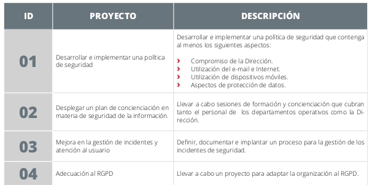
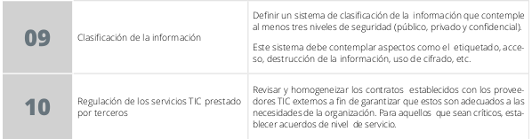

__1\.1 Plan director de seguridad__

#### RA1
a) Se han definido los principios generales de la organización en materia de ciberseguridad, que deben ser conocidos y apoyados por la dirección de la misma.

#### ÍNDICE

| Punto | Slide numero |
| :-: | :-: |
| La información y los sistemas de información | 5 |
| Plan director de seguridad | 8 |
| PDS. Situación actual | 11 |
| PDS. Estrategia de la empresa | 24 |
| PDS. Definir proyectos e iniciativas | 28 |
| PDS. Clasificar y priorizar los proyectos | 29 |
| PDS. Aprobación por la dirección | 30 |
| PDS. Puesta en marcha  | 31 |

#### La información y los sistemas de información

__La información es un activo fundamental para el funcionamiento de las empresas\.__

Las empresas basan su actividad en sistemas de información con soporte tecnológico \(ordenadores\, tabletas\, página web\,…\)

Proteger los sistemas de información es proteger el negocio

¿Qué pasa si nos encontramos antes un incidente?

¿Qué riesgos estamos asumiendo?

¿Sabemos cómo dar respuesta?

__Se necesita llevar a cabo una __  __gestión planificada__  __ __  __de__  __ __  __actuaciones__  __ __  __en materia de Ciberseguridad__

#### Plan director de seguridad

Si las  __herramientas__  tecnológicas y la  __información__

que dan soporte a los servicios y procesos productivos de la organización  _son de gran valor para nuestra organización_ \,

debemos empezar a pensar en poner en práctica un

__Plan Director de Seguridad__ \.

__Definición__  y  __priorización __

de un

_conjunto de proyectos _

en materia de

seguridad de la información con el objetivo de

_reducir los riesgos _

a los que está expuesta la organización hasta unos niveles aceptables\,

a partir de un

_análisis de la situación inicial_

#### Plan
director
de
seguridad

#### Plan director de seguridad

Existen distintos factores que determinan la magnitud y complejidad del PDS\. No obstante la elaboración y puesta en marcha siguen las fases siguientes:

#### PDS. Situación actual

1\.\- Situación actual

Análisis considerando aspectos técnicos\, organizativos\, regulatorios y normativos\, entre otros

1\.1 Actividades previas

Antes de comenzar con el primer paso del análisis\, debemos realizar varias actividades previas:

a\)  __Definir el alcance__ \, qué departamento\, y qué activos y procesos\, teniendo en cuenta los negocios críticos\.

b\) Identificar el responsable de gestión de activos: Identificar los  __activos__  y definir las  __responsabilidades__  sobre los activos

c\) Valoración inicial:  __Valoración preliminar__  de la situación actual de la organización para determinar los  __controles__  \(medidas de todo tipo que implementa para contrarrestar los riesgos de seguridad\) y requisitos que son de aplicación\.

Por lo general\, se puede usar para la evaluación de aspectos normativos y regulatorios el  __estándar 27002:2017\,  diseñada para ser utilizada a la hora de designar controles__  para la selección e implantación de un Sistema de Seguridad de la Información\,

Solo  __aplicar los ámbitos que se crean convenientes__  dependiendo de la magnitud de la empresa\, es decir\, no es necesaria la implementación de todos los controles que se indican en la norma 27002:2017\, sino sólo aquellos que sean de aplicación a la empresa\.\.

Elaborar un documento “ __Documento de Selección de Controles__ ”\, con los controles o medidas de seguridad que se aplican a la organización y su grado de madurez\, es decir\, si están implantados y en qué estado están\.

Norma par identificar los controles implantados\.

Modelo de madurez\.

d\) Análisis de cumplimiento:  __Reuniones con los departamentos__  para evaluar el cumplimiento de los controles de seguridad\.

También se requiere la inspección de la seguridad física\, por tanto es necesario una  __inspección in\-situ de las instalaciones__ \.Es útil para la __ recogida de problemas y evidencias el uso de checklist__  que incluyan los aspectos a revisar y comprobar\.Analizar los resultados\, y  __establecer el cumplimiento de cada control en una escala nivel de o porcentaje madurez__

e\) Establecer objetivo a cumplir en materia de ciberseguridad en la empresa\, determinando los ámbitos a mejorar e identificar los aspectos en los que focalizar esfuerzos

Además de la ISO 27000\, otros estándares:

RGPD: Protección de información y cumplimiento legal

PCI\-DSS: Tarjetas de crédito

COBIT: Buenas prácticas de gobernanza

ENS: Esquema nacional de seguridad\, en la Administración pública

1\.2 Análisis técnico de seguridad

Queda cubierto por la valoración del grado de implantación y madurez de los controles

No obstante  __podemos realizar un trabajo de auditoría__  para valorar el grado de implantación de determinados controles e identificar deficiencias en cortafuegos\, antivirus\, sistema de detección de intrusos\, niveles de parcheado\, políticas de contraseñas\, etc\.

El grado y nivel de esta auditoría dependerá de la empresa y antecedentes\. Muchas veces este trabajo se externaliza\.

1\.3 Análisis de riesgos

A los que está expuesta nuestra organización\, siguiendo las siguientes etapas:

1\.3 Análisis de riesgos

Definir el  __alcance del análisis de riesgos__ \, que vendrá definido por el alcance del PDS\.

__Identificar los activos__ : Aquellos más importantes que guardan relación con el departamento/proceso objeto del estudio\.

__Identificar/seleccionar las amenazas__  a los que están expuestos\.

__Evaluar el riesgo para cada par activo\-amenaza__ \, estimaremos la probabilidad de que la amenaza impacte sobre el negocio: probabilidad x impacto\.

__Identificar vulnerabilidades y salvaguardas__ : Las vulnerabilidades penalizarán a la hora de evaluar el riesgo\, de la misma forma que las salvaguardas aplicadas contribuirán a reducir el riesgo\. Iniciativas para implantar controles o salvaguardas\.

__Tratar el riesgo__ \. Tomar una estrategias y obtener riesgo residual tras aplicar estrategia\.

Elementos que participan durante la gestión del análisis de riesgos\.

Elementos que participan durante la gestión del análisis de riesgos\.

Se tendrá que establecer un nivel de riesgo aceptable\, que será el  __umbral__  que determina los riesgos que deben ser tratados y los riesgos que son asumibles\.

Para cada uno de los riesgos se tendrá que definir una de estrategias principales:

#### PDS. Estrategia de la empresa

Esto implica  __considerar los proyectos en curso y futuros\, cambios\, reorganizaciones__ \, etc\.

También es importante t __ener en cuenta si la organización opta por una estrategia de centralización de servicios\, por la externalización de los servicios TIC__ \, si forma parte de un grupo empresarial mayor o si va a iniciar la actividad en algún sector distinto del actual que pueda generar requisitos legales adicionales\.

Esta fase es fundamental para implantar medidas de seguridad acorde a la naturaleza de nuestra organización\.

__Alinear estrategia de seguridad\, estrategia TIC y __  __estrategia__  __ general del negocio\.__

#### PDS. Definir proyectos e iniciativas

A partir de la información obtenida hasta el momento debemos definir las acciones e iniciativas\.

Los ámbitos tratados son distintos\, por tanto las iniciativas serán diversas

__Definir iniciativas__  dirigidas a mejorar los trabajos actuales para que contemplen los marcos normativos y regulatorios\.

Conjunto de  __acciones__   __relacionadas con los controles técnicos físicos__  cuya  __ausencia o insuficiencia hemos detectado__

__Definir__  la  __estrategia__  a seguir así como los proyectos más adecuados para  __gestionar los riesgos__  por encima del riesgo aceptable\.

__Es clave tener en cuenta la estrategia de la empresa a la hora de indicar las acciones a llevar a cabo\.__

#### PDS. Clasificar y priorizar los proyectos

Clasificar las iniciativas\, por ejemplo en base al criterio de origen de las mismas:

Derivadas de la evaluación del cumplimiento normativo y regulatorio

análisis técnico

análisis de riesgos

El tipo de acción

técnica

organizativa

regulatoria

También en  __base al esfuerzo y coste temporal__ : proyectos a corto\, medio y largo plazo\.

También usar regla parto 20/80\, para con poco esfuerzo producir mejoras sustanciales:  __quick win__ \.

#### PDS. Aprobación por la dirección

Una vez se tenga un  __borrador__ \, debe ser  __revisado y aprobado por la dirección__ \.

Una vez  __aprobada__ \, debe  __trasladarse a todos los empleados__ \.

#### PDS. Puesta en marcha

Implementar la metodología de proyectos para  __llevar a cabo el plan__ \.

Realizar una __ presentación general del proyecto__  a las personas implicadas\.

__Asignar los responsables/coordinadores__  de los proyectos\.

Establecer la  __periodicidad con la que se debe llevar a cabo el seguimiento__ \. Si cambia la estrategia se tendrá que revisar el plan para comprobar si sigue siendo válido\.

Conforme se vayan alcanzando los hitos previstos\,  __confirmar__  que las  __deficiencias__  encontradas en las auditorías y gestión de  __riesgos__  han sido  __subsanadas__ \.

