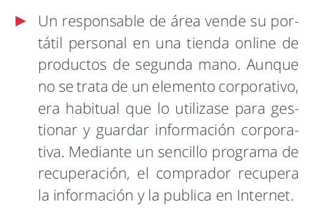
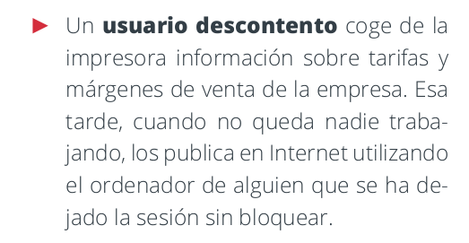

## 1.3.1. Normativa de protección del puesto de trabajo

El puesto de usuario es el lugar donde se realiza el trabajo diario con los sistemas de información. Es el lugar donde se almacena la información y se accede a los sistemas de información. Por tanto, es un lugar crítico en la seguridad de la información.

<figure markdown>
  
  <figcaption>Puesto de trabajo</figcaption>
</figure>

### 1. Introducción

Ya que el puesto de trabajo es el lugar donde se almacena y se accede a la información, es un lugar crítico en la seguridad de la información. Por tanto, es necesario establecer una normativa de protección del puesto de trabajo. Haremos una introducción a lo que es un puesto de trabajo y a la importancia de establecer una normativa de protección del puesto de trabajo.

#### 1.1 Puesto de trabajo

El **puesto de trabajo del usuario** es el lugar desde el cual un empleado común realiza su trabajo diario, accediendo a sistemas, aplicaciones y datos que necesita para cumplir con sus tareas. Este puesto puede ser físico (una computadora de escritorio en la oficina) o remoto (una laptop desde casa o un café). El “usuario” suele ser un empleado no especializado en tecnología, que accede a los recursos de la empresa principalmente para realizar su función laboral, sin responsabilidad directa en el manejo de la infraestructura o la seguridad de TI.

Ejemplo de puesto de usuario: Una asistente administrativa que trabaja en las instalaciones de la empresa, desde una computadora de escritorio, accediendo al sistema de gestión de documentos de la empresa, el correo electrónico y una plataforma de mensajería interna para coordinarse con su equipo.

##### 1.1.1 Elementos de un puesto de trabajo

En el entorno de seguridad informática, el puesto de trabajo es mucho más que el lugar físico donde una persona se sienta a trabajar. Representa el **conjunto de elementos que un empleado utiliza para realizar sus tareas**. Algunos son: dispositivos, software, acceso a redes, instalaciones físicas, acceso a datos y el propio empleado.

Algunos ejemplos de un puesto de trabajo pueden incluir:

* Dispositivos hardware: Computadoras de escritorio, laptops, tabletas y teléfonos inteligentes que usa el empleado.
* Software: Aplicaciones necesarias para realizar tareas, desde procesadores de texto hasta herramientas especializadas.
* Comunicación y acceso a la red: Conexiones a internet, VPNs (Redes Privadas Virtuales) para trabajar de forma remota, y acceso a servidores internos de la organización.
* Instalaciones físicas: Dependencías físicas de la empresa, como oficinas, salas de reuniones o áreas de trabajo compartidas.
* Acceso a datos: Permisos para ver, editar o compartir documentos, bases de datos o aplicaciones internas que contienen información valiosa o sensible.
* Personal: El propio empleado, sus hábitos de trabajo y su conocimiento de las políticas de seguridad.

Cada uno de estos elementos, si no se protege correctamente, puede ser una vía de ataque o de fuga de información, por lo que la protección del puesto de trabajo es esencial para reducir riesgos de seguridad.

#### 1.2. ¿Qué es una normativa y por qué es importante?

Una normativa en lo referente al puesto de trabajo, es un conjunto de reglas y requisitos específicos que deben cumplirse para garantizar un ambiente de trabajo seguro. En el caso de la protección del puesto de trabajo, estas reglas indican cómo debe gestionarse y asegurarse cada aspecto del puesto para proteger tanto la información como los sistemas de la empresa. La normativa de protección del puesto de trabajo tiene en cuenta las amenazas y posibles vulnerabilidades para definir pautas que protejan los elementos comentados anteriormente, ayudando a minimizar riesgos y mejorar la seguridad general de la organización.

Por ejemplo, una normativa de protección del puesto de trabajo incluirá mayoritariamente **medidas preventivas**, dejando las de monitorización y correctivas para otras fases del proceso de seguridad. Algunos ejemplos de medidas que pueden incluirse en una normativa de protección del puesto de trabajo son:

* **Restricciones de acceso**: Especificar quién puede acceder a qué tipo de información o sistema.
* **Medidas de seguridad física y digital**: Uso de cerraduras físicas en escritorios, contraseñas complejas, y autenticación multifactor (MFA).
* **Procedimientos de actualización y parches**: Asegurarse de que todo el software esté al día con las últimas actualizaciones de seguridad.
* **Buenas prácticas de uso diario**: Como bloquear la pantalla al ausentarse, evitar conexiones a redes públicas no seguras, y mantener la información confidencial fuera del alcance de terceros.

##### 1.2.1. ¿Por qué necesitamos una normativa de protección del puesto de trabajo?

En cualquier organización, los empleados interactúan con datos y sistemas sensibles a diario. Si el puesto de trabajo no está protegido adecuadamente, podría convertirse en un punto de entrada para ataques cibernéticos o en un riesgo de fuga de información. La normativa establece las reglas que todos los empleados deben seguir para proteger estos recursos y reducir riesgos, no solo para proteger la información de la organización, sino también la privacidad de los empleados y clientes.

Al implementar una normativa de protección del puesto de trabajo, la organización busca:

1. **Establecer un estándar de seguridad** que todos los empleados deben cumplir.
2. **Proteger los datos y la infraestructura tecnológica** frente a amenazas externas e internas.
3. **Asegurar la continuidad del negocio** al reducir la probabilidad de incidentes de seguridad que puedan interrumpir las operaciones.

#### 1.3. Políticas, normativas y procedimientos

Relacionados con la normativa de protección del puesto de trabajo, es importante entender la diferencia entre políticas, normativas y procedimientos, ya que cada uno juega un papel distinto en la estructura de seguridad de una organización.

##### 1.3.1. Política (Declaración de Intenciones)

Una **política** es una declaración general que define la intención y los principios de una organización respecto a un tema específico. En seguridad, una política marca el rumbo y establece el **marco de referencia** que guía las acciones para proteger los activos.

* **Ejemplo:** Imagina que una empresa crea una **política de seguridad de la información** que dice: "La empresa XYZ se compromete a proteger la confidencialidad, integridad y disponibilidad de toda la información almacenada y procesada en sus sistemas, de acuerdo con los principios de seguridad y las normativas legales".
  * **En la práctica**: Esta política no da detalles específicos ni instrucciones concretas sobre cómo proteger la información, sino que establece el compromiso general de la empresa hacia la seguridad.
* **Importancia de la política:** Sirve como "declaración de intenciones" para la organización. Define las bases sobre las cuales se desarrollarán normativas y procedimientos más detallados.

Por tanto, la política es la visión o intención general, como un "norte" o línea guía que orienta las decisiones sobre seguridad.

##### 1.3.2. Normativa (Qué)

Una **normativa** traduce la política en **reglas y requisitos más concretos** que deben cumplirse para seguir esa política. Es decir, establece **qué** se debe hacer o cumplir para mantener la seguridad, y a veces **quién** es responsable de llevarlo a cabo.

* **Ejemplo:** Siguiendo la política de seguridad de la información, una normativa específica puede ser la **normativa de protección del puesto de trabajo**. Esta normativa podría incluir reglas como:
  * "Todo empleado debe bloquear su pantalla al ausentarse del escritorio".
  * "Se requiere que todas las contraseñas de usuario tengan al menos 10 caracteres e incluyan letras, números y símbolos".
  * "Los empleados deben realizar un curso básico de seguridad informática cada seis meses".
  * **En la práctica**: La normativa detalla requisitos claros que los empleados y los sistemas deben cumplir. No describe cómo hacerlo (ese es el trabajo del procedimiento), sino que define las condiciones que deben cumplirse.
* **Importancia de la normativa:** Proporciona una capa de control y dirección más concreta que la política, ayudando a mantener una estructura de cumplimiento y a reducir riesgos.

Por tanto, la normativa establece reglas específicas y requisitos que deben cumplirse para estar alineados con la política de seguridad.

##### 1.3.3. Procedimiento (Cómo)

Un **procedimiento** detalla los **pasos específicos** que deben seguirse para cumplir con la normativa y, por ende, con la política. Responde a la pregunta de **cómo** hacer algo. Los procedimientos suelen ser detallados y prácticos, y pueden incluir capturas de pantalla, ejemplos o listas paso a paso.

* **Ejemplo:** Si la normativa de protección del puesto de trabajo exige "bloquear la pantalla al ausentarse", el procedimiento explicará cómo hacerlo en diferentes sistemas operativos:
  * **Windows:** “Presiona `Win + L` para bloquear la pantalla”.
  * **MacOS:** “Presiona `Control + Command + Q` o configura el bloqueo automático desde Preferencias del Sistema”.
  * **Linux:** “Configura el bloqueo de pantalla en las preferencias o presiona `Super + L`”.
  * **En la práctica**: Este procedimiento ofrece las instrucciones detalladas de cómo cada usuario puede cumplir con el requisito de la normativa.
* **Importancia del procedimiento:** Los procedimientos eliminan la ambigüedad sobre cómo realizar una tarea específica. Son muy útiles para nuevos empleados, para procesos de auditoría y para asegurar que todos los empleados tengan claridad sobre las acciones que deben seguir.

Por lo tanto, los procedimientos son guías prácticas y detalladas sobre **cómo** realizar acciones específicas para cumplir con la normativa.

##### 1.3.4. Ejemplo Completo:

Cada nivel aporta un grado de especificidad creciente y va dirigido a distintos aspectos de la estructura organizativa de seguridad.

* **Política de Seguridad de la Información**: "XYZ se compromete a proteger la información de acuerdo con altos estándares de seguridad".
* **Normativa de Protección del Puesto de Trabajo**: "Todos los empleados deben bloquear sus equipos al ausentarse".
* **Procedimiento de Bloqueo de Pantalla**: "Para bloquear la pantalla, usa `Win + L` en Windows, `Control + Command + Q` en MacOS, y `Super + L` en Linux".

#### 1.4 Normativas

Cuando hablamos de normativas de protección del puesto de trabajo, es importante tener en cuenta que existen diferentes estándares y regulaciones que pueden influir en la definición de estas normativas, por tanto las compañías deben conocerlas.  Algunas de las normativas más comunes en el ámbito de la seguridad de la información son:

##### 1.4.1. ISO/IEC 27001: Estandarización en la Seguridad del Puesto de Trabajo

La **ISO/IEC 27001** es el estándar internacional para la **gestión de la seguridad de la información**, aplicable a todos los aspectos de la seguridad en la organización, incluidos los puestos de trabajo.

**¿Cómo ayuda con la política del puesto de trabajo?**

* **Estructura de gestión de la seguridad**: ISO/IEC 27001 proporciona una guía para crear un **Sistema de Gestión de Seguridad de la Información (SGSI)**, que asegura la protección de todos los elementos del puesto de trabajo (dispositivos, software, accesos) dentro de un marco estandarizado.
* **Control de acceso y uso seguro**: Dentro de su Anexo A, el estándar incluye controles como la **seguridad en las estaciones de trabajo y el control de accesos**, lo que es fundamental para definir cómo los empleados deben proteger sus dispositivos y datos.
* **Evaluación y mitigación de riesgos**: Este estándar promueve el análisis y gestión de riesgos específicos de cada puesto, permitiendo identificar y tratar amenazas en el puesto de trabajo, como el uso no autorizado de dispositivos, la conexión en redes inseguras o el acceso a información sensible.

**Ejemplo práctico**: Siguiendo ISO 27001, puedes establecer una política que obligue a los usuarios a bloquear sus pantallas al dejar su escritorio o que requiera autenticación multifactor en los dispositivos de trabajo.

##### 1.4.2. GDPR (General Data Protection Regulation): Protección de Datos Personales en el Puesto de Trabajo

El **GDPR** es la regulación de protección de datos de la Unión Europea, centrada en proteger la **privacidad y los datos personales** de los ciudadanos.

**¿Cómo ayuda con la política del puesto de trabajo?**

* **Confidencialidad y seguridad de datos**: El GDPR establece que cualquier puesto de trabajo que maneje datos personales debe protegerlos, lo que implica políticas para limitar el acceso solo a quienes realmente lo necesitan y medidas de seguridad como el cifrado y el uso de contraseñas seguras.
* **Seguridad en el acceso y almacenamiento de datos**: Exige que la información personal se almacene y procese de forma segura, promoviendo políticas que regulen cómo los empleados deben acceder, compartir y proteger la información desde sus puestos.
* **Gestión de incidentes**: Incluye requisitos sobre cómo notificar y responder a incidentes de seguridad que afecten datos personales, lo cual es esencial en la política de uso y protección de los dispositivos de trabajo.

**Ejemplo práctico**: Puedes desarrollar políticas para asegurar que los empleados manejen los datos personales de forma segura, como el uso obligatorio de conexiones VPN para acceder remotamente a los sistemas de la empresa, cumpliendo así con el GDPR.

##### 1.4.3. **LOPDGDD (Ley Orgánica de Protección de Datos y Garantía de Derechos Digitales)**: Cumplimiento en España para el Puesto de Trabajo

La **LOPDGDD** es la ley española que complementa al GDPR y que regula el tratamiento de los datos personales en España, incorporando derechos y regulaciones adicionales.

**¿Cómo ayuda con la política del puesto de trabajo?**

* **Protección de la privacidad del empleado y cliente**: La LOPDGDD establece requisitos para garantizar la privacidad y el manejo seguro de los datos personales tanto de empleados como de clientes, lo cual es crucial para los usuarios en sus puestos de trabajo.
* **Derechos digitales de los empleados**: La LOPDGDD también incluye derechos específicos, como el **derecho a la desconexión digital**, lo que puede traducirse en políticas de horario de acceso y uso de dispositivos de trabajo para respetar el equilibrio laboral y personal.
* **Políticas de acceso a datos sensibles**: Exige políticas claras sobre quién puede acceder a qué tipo de datos personales, lo que se puede aplicar en el puesto de trabajo asegurando que solo quienes tengan autorización accedan a información confidencial.

**Ejemplo práctico**: Con la LOPDGDD, puedes crear políticas para limitar el acceso a datos personales a usuarios específicos según sus funciones, y también definir políticas de desconexión digital para proteger los derechos de los empleados.

### 2. Escenarios de riesgos y medidas de seguridad

Comprender los elementos clave de un puesto de trabajo, nos ayudan a entender los factores vulnerables de un puesto de trabajo y, por tanto, identificar los **escenarios de riesgo** y asi diseñar normativas en base a medidas de seguridad efectivas.

Las **medidas de seguridad** que se establecen en la normativa de protección del puesto de trabajo deben ser proporcionales a los riesgos identificados y deben ser claras y fáciles de seguir para los empleados. Estas estarán formadas por un conjunto de pautas aplicables a los sistemas de la organización y de métodos utilizados para monitorizar su eficacia en la protección de los activos y el cumplimiento por parte de los empleados.

Las medidas de seguridad se pueden clasificar en:    
* **Preventivas**: Aquellas que buscan evitar que ocurran incidentes de seguridad.    
* **Monitorización**: Aquellas que buscan identificar incidentes de seguridad en el momento en que ocurren.     
* **Correctivas**: Aquellas que buscan corregir los incidentes de seguridad una vez que han ocurrido, y restaurar la operatividad normal de los sistemas.     

En el caso de la protección del puesto de trabajo, las medidas de seguridad preventivas son las más comunes, ya que buscan evitar que los incidentes de seguridad ocurran en primer lugar. 

A continuación, desglosaremos estos elementos y mostraremos cómo cada uno se relaciona con los distintos escenarios de riesgo y con la necesidad de establecer políticas, normativas y procedimientos claros.

### 2.1 Dispositivos de Hardware

Los **dispositivos de hardware** son los equipos físicos que los empleados utilizan para realizar su trabajo y acceder a los sistemas de la organización. Dado que son el punto de acceso principal a la información corporativa, representan un componente crítico en la seguridad de la información y un punto vulnerable si no están adecuadamente protegidos.

**Elementos incluidos**: Computadoras de escritorio, laptops, tabletas, teléfonos inteligentes y cualquier otro dispositivo físico utilizado en el entorno de trabajo.

#### Escenarios de Riesgo Asociados

1. **Pérdida o Robo de Dispositivos**
    - **Riesgo**: La pérdida o el robo de un dispositivo físico puede exponer datos confidenciales y credenciales de acceso si cae en manos de personas no autorizadas. Esto es especialmente crítico si el dispositivo se utiliza fuera de las instalaciones de la empresa y no cuenta con medidas de seguridad avanzadas, como el cifrado.
    - **Consecuencias**: Una persona no autorizada con acceso físico al dispositivo puede recuperar información confidencial, acceder a sistemas de la organización o modificar datos importantes.

**Política**: La organización se compromete a proteger todos los dispositivos de trabajo con medidas de seguridad que garanticen la integridad, confidencialidad y disponibilidad de la información almacenada y procesada ante cualquier incidente.

 - **Normativa**:
     - Todos los dispositivos deben estar protegidos mediante autenticación segura, como contraseñas complejas y, cuando sea posible, autenticación multifactor (MFA).
     - Los dispositivos deben configurarse para bloquearse automáticamente tras un periodo de inactividad de 5 minutos.
     - Todo dispositivo de trabajo que contenga datos confidenciales debe contar con cifrado de disco.

 - **Procedimiento**:
     - **Activación del bloqueo automático**: Instrucciones detalladas para configurar el bloqueo automático en dispositivos con diferentes sistemas operativos, como Windows, MacOS y dispositivos móviles.
     - **Configuración del cifrado de disco**: Pasos para activar el cifrado de disco en dispositivos compatibles (Windows BitLocker, MacOS FileVault) y verificar su estado de activación.
     - **Reporte de pérdida o robo de dispositivos**: Proceso para notificar al departamento de TI en caso de pérdida o robo, incluyendo información relevante del dispositivo y las acciones inmediatas que deben seguirse para mitigar el riesgo.

2. **Acceso No Autorizado**
    - **Riesgo**: Si un dispositivo queda desbloqueado cuando el usuario se ausenta o si no cuenta con autenticación robusta, personas no autorizadas pueden acceder a información confidencial o realizar acciones no autorizadas.
    - **Consecuencias**: Esto podría comprometer la confidencialidad y seguridad de la información, permitiendo que personas sin autorización accedan o manipulen datos en el sistema de la organización.

**Política**: La organización se compromete a proteger todos los dispositivos de trabajo con medidas de seguridad que garanticen la integridad, confidencialidad y disponibilidad de la información almacenada y procesada ante cualquier incidente.

 - **Normativa**:
     - Los dispositivos de trabajo deben configurarse para bloquearse automáticamente después de un breve periodo de inactividad.
     - Los usuarios deben autenticar su identidad mediante contraseñas seguras y, siempre que sea posible, activar la autenticación biométrica (como huellas dactilares o reconocimiento facial).

 - **Procedimiento**:
     - **Establecimiento de contraseñas seguras**: Instrucciones para crear contraseñas que cumplan con los requisitos de seguridad, como una longitud mínima y combinación de caracteres especiales.
     - **Configuración de autenticación biométrica**: Guía para activar y utilizar autenticación biométrica en dispositivos compatibles.
     - **Bloqueo manual del dispositivo**: Recordatorio para bloquear manualmente el dispositivo cuando el usuario se ausente, con pasos específicos sobre cómo hacerlo en diferentes sistemas operativos.

3. **Falta de Cifrado en el Dispositivo**
    - **Riesgo**: Si el almacenamiento en el dispositivo no está cifrado, los datos pueden ser fácilmente extraídos o manipulados por cualquier persona con acceso físico al dispositivo en caso de pérdida o robo.
    - **Consecuencias**: La información almacenada sin cifrado queda expuesta y puede ser leída o modificada sin autorización, lo que aumenta el riesgo de fuga de datos confidenciales.

**Política**: La organización se compromete a proteger todos los dispositivos de trabajo con medidas de seguridad que garanticen la integridad, confidencialidad y disponibilidad de la información almacenada y procesada ante cualquier incidente.

 - **Normativa**:
     - Todos los dispositivos de trabajo que almacenen datos sensibles deben estar cifrados completamente.
     - No se permite almacenar información confidencial en dispositivos que no estén cifrados ni en dispositivos personales no autorizados.

 - **Procedimiento**:
     - **Activación de cifrado en diferentes plataformas**: Instrucciones detalladas para activar el cifrado en dispositivos Windows (BitLocker), MacOS (FileVault) y en dispositivos móviles con Android e iOS.
     - **Verificación del cifrado de disco**: Pasos para comprobar que el cifrado esté activado correctamente en cada dispositivo.
     - **Reporte de excepciones**: Procedimiento para informar al departamento de TI si un empleado detecta que el cifrado no está activado en su dispositivo de trabajo.

4. **Infección de Malware o Software Malicioso**
    - **Riesgo**: Los dispositivos de hardware pueden infectarse con malware o software malicioso si el usuario descarga archivos de fuentes inseguras, visita sitios web maliciosos o utiliza medios externos no verificados, como memorias USB.
    - **Consecuencias**: La infección con malware puede comprometer el dispositivo, capturar información confidencial, o incluso propagarse a otros dispositivos dentro de la red corporativa, incrementando los riesgos de seguridad.

**Política**: La organización se compromete a proteger todos los dispositivos de trabajo con medidas de seguridad que garanticen la integridad, confidencialidad y disponibilidad de la información almacenada y procesada ante cualquier incidente.

 - **Normativa**:
     - Todos los dispositivos deben tener un antivirus y firewall activos y actualizados para protección contra malware.
     - No se permite la descarga ni instalación de software que no esté previamente autorizado por el departamento de TI.

 - **Procedimiento**:
     - **Instalación y actualización de antivirus**: Pasos para instalar el antivirus aprobado por la organización y cómo activar las actualizaciones automáticas.
     - **Activación de firewall**: Guía para configurar y activar el firewall en sistemas operativos Windows, MacOS y dispositivos móviles.
     - **Buenas prácticas de navegación segura**: Pautas para evitar hacer clic en enlaces desconocidos, no descargar archivos de fuentes no verificadas y recomendaciones para identificar correos electrónicos sospechosos.

### 2.2 Software y Aplicaciones

El **software y las aplicaciones** son herramientas esenciales para que los empleados realicen sus tareas diarias. Incluyen desde aplicaciones de oficina hasta herramientas de gestión, comunicación, y plataformas específicas de la organización. Debido a que estos programas procesan y almacenan información sensible, es fundamental proteger su uso y mantenimiento.

**Elementos incluidos**: Aplicaciones de oficina (procesadores de texto, hojas de cálculo), software de gestión (CRM, ERP), plataformas de comunicación (correo electrónico, mensajería), navegadores web y herramientas personalizadas.

#### Escenarios de Riesgo Asociados

1. **Descarga o Uso de Software No Autorizado**
    - **Riesgo**: La instalación o uso de software no autorizado puede incluir programas maliciosos que comprometan la seguridad del sistema y expongan los datos de la organización.
    - **Consecuencias**: El uso de software no autorizado aumenta el riesgo de infecciones de malware, pérdida de datos y vulnerabilidades que pueden explotarse para acceder a información sensible.

**Política**: La organización se compromete a garantizar la seguridad y el uso controlado del software y las aplicaciones para proteger la integridad, confidencialidad y disponibilidad de la información en todos los sistemas corporativos.

 - **Normativa**:
     - Solo se permite la instalación de software autorizado y aprobado previamente por el departamento de TI.
     - Los empleados deben obtener la aprobación de TI antes de instalar cualquier aplicación o herramienta en dispositivos de trabajo.

 - **Procedimiento**:
     - **Solicitud de instalación de software**: Pasos para que los empleados soliciten la instalación de software no disponible, enviando la solicitud al departamento de TI y justificando su necesidad.
     - **Verificación del software autorizado**: Instrucciones para que el empleado consulte y verifique qué aplicaciones están aprobadas por TI antes de descargarlas.

2. **Uso de Software Desactualizado**
    - **Riesgo**: El uso de software desactualizado aumenta la posibilidad de que existan vulnerabilidades no parcheadas, que pueden ser explotadas por atacantes para acceder a sistemas o datos de la organización.
    - **Consecuencias**: Las vulnerabilidades en software desactualizado pueden comprometer la seguridad de la información, facilitando ataques como la ejecución remota de código o el robo de datos.

**Política**: La organización se compromete a garantizar la seguridad y el uso controlado del software y las aplicaciones para proteger la integridad, confidencialidad y disponibilidad de la información en todos los sistemas corporativos.

 - **Normativa**:
     - Todo el software utilizado en dispositivos de trabajo debe estar actualizado y contar con los últimos parches de seguridad.
     - Los usuarios deben permitir las actualizaciones automáticas de software, siempre que sea posible.

 - **Procedimiento**:
     - **Proceso de actualización de software**: Instrucciones para realizar actualizaciones periódicas de las aplicaciones y activar la opción de actualización automática.
     - **Notificación de software desactualizado**: Proceso para que los empleados informen al departamento de TI si detectan que una aplicación en su dispositivo necesita actualizarse o tiene problemas de seguridad.

3. **Falta de Control en los Permisos de Acceso a Aplicaciones**
    - **Riesgo**: La falta de un control adecuado de los permisos puede permitir que usuarios no autorizados accedan a funciones o datos confidenciales a través de aplicaciones.
    - **Consecuencias**: Los accesos no controlados pueden exponer la información sensible a personas que no tienen autorización, lo cual representa un riesgo de fugas de datos y de uso indebido de la información.

**Política**: La organización se compromete a garantizar la seguridad y el uso controlado del software y las aplicaciones para proteger la integridad, confidencialidad y disponibilidad de la información en todos los sistemas corporativos.

 - **Normativa**:
     - Los permisos de acceso a aplicaciones deben configurarse y revisarse de acuerdo con los roles y funciones de cada usuario.
     - El acceso a aplicaciones críticas debe estar limitado y controlado por el departamento de TI.

 - **Procedimiento**:
     - **Asignación y revisión de permisos**: Pasos para que el departamento de TI otorgue, revise o revoque permisos de acceso a aplicaciones, asegurándose de que se mantengan los principios de mínimo privilegio.
     - **Solicitud de permisos de acceso**: Proceso para que los empleados soliciten acceso a una aplicación específica, justificando la necesidad y obteniendo la autorización correspondiente.

4. **Riesgo de Fugas de Información a Través de Aplicaciones en la Nube o Compartidas**
    - **Riesgo**: Algunas aplicaciones en la nube o compartidas pueden tener configuraciones de privacidad inadecuadas, lo cual facilita la transferencia o acceso no autorizado a los datos de la organización.
    - **Consecuencias**: Las fugas de información a través de aplicaciones pueden exponer datos sensibles a personas no autorizadas o incluso al público si la configuración de privacidad no está debidamente gestionada.

**Política**: La organización se compromete a garantizar la seguridad y el uso controlado del software y las aplicaciones para proteger la integridad, confidencialidad y disponibilidad de la información en todos los sistemas corporativos.

 - **Normativa**:
     - Las aplicaciones en la nube deben configurarse con controles de acceso adecuados para limitar el acceso a información sensible.
     - La información confidencial no debe compartirse a través de aplicaciones que no cuenten con la aprobación de seguridad del departamento de TI.

 - **Procedimiento**:
     - **Configuración de privacidad y acceso en aplicaciones en la nube**: Instrucciones para configurar la privacidad y los permisos de acceso en las aplicaciones en la nube.
     - **Proceso de revisión de seguridad en aplicaciones compartidas**: Pasos que debe seguir el departamento de TI para revisar y verificar que las aplicaciones en la nube cumplen con los requisitos de seguridad antes de ser utilizadas.

### 2.3 Comunicación y Acceso a la Red

La **comunicación y acceso a la red** incluye todas las conexiones necesarias para que los empleados puedan acceder a internet, intranet, servidores internos y servicios en la nube, tanto desde la oficina como desde ubicaciones remotas. Estos accesos son esenciales para la operatividad diaria, pero también representan riesgos importantes que deben gestionarse adecuadamente.

**Elementos incluidos**: Conexiones a internet, redes de la empresa, VPNs (Redes Privadas Virtuales), aplicaciones en la nube y acceso remoto.

#### Escenarios de Riesgo Asociados

1. **Acceso No Seguro a Redes Públicas**
    - **Riesgo**: Conectar dispositivos de trabajo a redes Wi-Fi públicas o no seguras puede facilitar la interceptación de datos sensibles por parte de terceros.
    - **Consecuencias**: La información transmitida a través de redes inseguras puede ser capturada y utilizada sin autorización, comprometiendo la confidencialidad de los datos de la empresa.

**Política**: La organización se compromete a garantizar la seguridad de la comunicación y acceso a la red, protegiendo la confidencialidad, integridad y disponibilidad de la información en todas las conexiones y puntos de acceso.

 - **Normativa**:
     - Todos los accesos remotos deben realizarse únicamente a través de una VPN (Red Privada Virtual) aprobada por el departamento de TI.
     - Está prohibido el uso de redes públicas o inseguras sin medidas de protección adicionales.

 - **Procedimiento**:
     - **Conexión a la VPN**: Instrucciones detalladas para que los empleados configuren y utilicen la VPN aprobada en dispositivos de trabajo.
     - **Verificación de seguridad de la red**: Pasos para que los empleados comprueben la seguridad de la red antes de conectarse y consejos para identificar redes seguras.

2. **Acceso No Autorizado a la Red Corporativa**
    - **Riesgo**: Sin controles de acceso adecuados, personas no autorizadas podrían intentar conectarse a la red corporativa, exponiendo la red a ataques y posibles accesos a datos internos.
    - **Consecuencias**: El acceso no autorizado puede comprometer la seguridad de la red, permitir la entrada de malware o robo de datos, y facilitar ataques internos.

**Política**: La organización se compromete a garantizar la seguridad de la comunicación y acceso a la red, protegiendo la confidencialidad, integridad y disponibilidad de la información en todas las conexiones y puntos de acceso.

 - **Normativa**:
     - Todo acceso a la red corporativa debe estar protegido por autenticación multifactor (MFA).
     - Solo los dispositivos autorizados por el departamento de TI pueden conectarse a la red interna de la empresa.

 - **Procedimiento**:
     - **Implementación de autenticación multifactor (MFA)**: Instrucciones para activar y usar MFA en todos los dispositivos y accesos a la red corporativa.
     - **Registro y autorización de dispositivos**: Procedimiento para registrar dispositivos en la red corporativa, asegurando que solo los equipos aprobados puedan conectarse.

3. **Fugas de Datos a Través de Aplicaciones en la Nube**
    - **Riesgo**: El uso de aplicaciones en la nube puede facilitar la transferencia de datos fuera de la red segura de la organización, aumentando el riesgo de fuga de información y acceso no autorizado.
    - **Consecuencias**: La información confidencial podría ser expuesta o manipulada por personas sin permisos adecuados si las aplicaciones en la nube no están configuradas con los controles de acceso y seguridad apropiados.

**Política**: La organización se compromete a garantizar la seguridad de la comunicación y acceso a la red, protegiendo la confidencialidad, integridad y disponibilidad de la información en todas las conexiones y puntos de acceso.

 - **Normativa**:
     - El uso de aplicaciones en la nube debe estar aprobado por el departamento de TI y configurado con controles de acceso adecuados.
     - Los empleados deben evitar compartir información sensible a través de aplicaciones en la nube que no cumplan con los estándares de seguridad de la organización.

 - **Procedimiento**:
     - **Configuración de privacidad en aplicaciones en la nube**: Instrucciones para ajustar los permisos de acceso y privacidad en aplicaciones en la nube aprobadas.
     - **Proceso de autorización de aplicaciones en la nube**: Pasos que debe seguir el departamento de TI para revisar y aprobar aplicaciones en la nube antes de su uso en la organización.

4. **Intercepción de Datos Sensibles Durante la Comunicación**
    - **Riesgo**: La información confidencial transmitida sin cifrado, como correos electrónicos o transferencias de archivos, puede ser interceptada y utilizada por personas no autorizadas.
    - **Consecuencias**: La intercepción de datos confidenciales puede llevar a la exposición de información sensible, afectando la seguridad y privacidad de los datos corporativos.

**Política**: La organización se compromete a garantizar la seguridad de la comunicación y acceso a la red, protegiendo la confidencialidad, integridad y disponibilidad de la información en todas las conexiones y puntos de acceso.

 - **Normativa**:
     - Toda la información confidencial transmitida por la red debe estar cifrada, tanto en tránsito como en reposo.
     - Los correos electrónicos que contengan datos sensibles deben enviarse utilizando cifrado de extremo a extremo o una plataforma segura aprobada.

 - **Procedimiento**:
     - **Activación de cifrado en correos y transferencias de archivos**: Guía para que los empleados configuren el cifrado en los correos y archivos que contengan información confidencial.
     - **Uso de plataformas seguras para el envío de datos**: Instrucciones para utilizar las plataformas aprobadas por la organización para enviar datos sensibles y asegurar su protección.

### 2.4 Instalaciones Físicas

Las **instalaciones físicas** comprenden las áreas donde los empleados realizan su trabajo, acceden a sistemas y manejan información confidencial. Las áreas físicas de trabajo representan un componente clave en la seguridad de la información, ya que permiten el acceso directo a documentos, dispositivos y otros recursos críticos.

**Elementos incluidos**: Oficinas, salas de reuniones, áreas de trabajo compartidas, centros de datos y cualquier otro espacio físico de la empresa.

#### Escenarios de Riesgo Asociados

1. **Acceso No Autorizado a Áreas Restringidas**
    - **Riesgo**: Personas no autorizadas podrían entrar en áreas restringidas de la organización, exponiendo dispositivos y documentos confidenciales a riesgos de seguridad.
    - **Consecuencias**: El acceso físico no autorizado puede llevar a la manipulación, robo o destrucción de información o dispositivos sensibles de la organización.

**Política**: La organización se compromete a proteger la seguridad de las instalaciones físicas mediante medidas de control de acceso y vigilancia, para garantizar la integridad, confidencialidad y disponibilidad de los recursos corporativos.

 - **Normativa**:
     - Solo el personal autorizado podrá acceder a áreas restringidas de la empresa, como centros de datos y oficinas de alto nivel.
     - Todo acceso a estas áreas debe ser registrado y monitoreado mediante sistemas de control de acceso y cámaras de seguridad.

 - **Procedimiento**:
     - **Registro de acceso a áreas restringidas**: Instrucciones para el uso adecuado de tarjetas de acceso o credenciales biométricas para ingresar a áreas protegidas.
     - **Monitoreo de cámaras de seguridad**: Procedimiento para que el personal de seguridad revise regularmente los videos de las cámaras y alerte sobre cualquier actividad sospechosa.
     - **Solicitud de acceso autorizado**: Pasos para que los empleados soliciten acceso temporal o permanente a áreas restringidas, incluyendo la autorización de un supervisor o el departamento de seguridad.

2. **Exposición de Información Confidencial en Áreas Compartidas**
    - **Riesgo**: Documentos confidenciales o dispositivos con información sensible pueden quedar expuestos en áreas compartidas, como salas de reuniones o espacios de trabajo abiertos, accesibles a personas no autorizadas.
    - **Consecuencias**: La exposición de información en áreas comunes puede llevar a la fuga de datos confidenciales y al acceso indebido a documentos sensibles de la organización.

**Política**: La organización se compromete a proteger la seguridad de las instalaciones físicas mediante medidas de control de acceso y vigilancia, para garantizar la integridad, confidencialidad y disponibilidad de los recursos corporativos.

 - **Normativa**:
     - Los empleados deben evitar dejar documentos o dispositivos desatendidos en áreas compartidas.
     - La información confidencial debe almacenarse en espacios seguros, como archivadores con llave, cuando no esté en uso.

 - **Procedimiento**:
     - **Almacenamiento seguro de documentos**: Instrucciones para el uso de archivadores y otras áreas de almacenamiento seguras para guardar documentos y dispositivos fuera de las horas de trabajo.
     - **Retiro de documentos de áreas compartidas**: Guía para que los empleados revisen y aseguren sus documentos y dispositivos antes de abandonar cualquier área compartida.
     - **Uso de lockers y armarios**: Proceso para que el personal almacene de manera segura sus objetos personales y documentos en áreas designadas.

3. **Pérdida o Robo de Dispositivos en las Instalaciones**
    - **Riesgo**: Dispositivos de trabajo, como laptops, teléfonos móviles o memorias USB, pueden extraviarse o ser robados dentro de las instalaciones de la empresa.
    - **Consecuencias**: La pérdida o robo de dispositivos en las instalaciones puede exponer la información almacenada en ellos a personas no autorizadas, comprometiendo la seguridad de los datos.

**Política**: La organización se compromete a proteger la seguridad de las instalaciones físicas mediante medidas de control de acceso y vigilancia, para garantizar la integridad, confidencialidad y disponibilidad de los recursos corporativos.

 - **Normativa**:
     - Los dispositivos deben estar asegurados con contraseñas y, cuando sea posible, con cifrado de disco para proteger la información en caso de pérdida o robo.
     - Es obligatorio que los empleados guarden dispositivos portátiles en cajones con llave o lockers cuando no los utilicen.

 - **Procedimiento**:
     - **Cifrado y contraseñas en dispositivos portátiles**: Instrucciones para configurar contraseñas seguras y cifrado de disco en dispositivos portátiles de la organización.
     - **Almacenamiento seguro de dispositivos en las instalaciones**: Pasos para asegurar laptops y otros dispositivos en lugares cerrados con llave o en lockers asignados.
     - **Reporte de dispositivos extraviados o robados**: Proceso para que los empleados notifiquen de inmediato al departamento de TI y de seguridad en caso de pérdida o robo de dispositivos.

4. **Descuido en la Gestión de Residuos de Documentación Confidencial**
    - **Riesgo**: Documentos confidenciales pueden ser desechados sin los procedimientos de destrucción adecuados, exponiendo información sensible a personas no autorizadas que podrían acceder a ellos.
    - **Consecuencias**: La eliminación no segura de documentos confidenciales puede llevar a la fuga de información sensible y comprometer la seguridad de la organización.

**Política**: La organización se compromete a proteger la seguridad de las instalaciones físicas mediante medidas de control de acceso y vigilancia, para garantizar la integridad, confidencialidad y disponibilidad de los recursos corporativos.

 - **Normativa**:
     - Todos los documentos confidenciales que ya no se necesiten deben ser destruidos adecuadamente, utilizando trituradoras de papel o servicios de destrucción de documentos.
     - Está prohibido desechar documentos confidenciales en cestos de basura comunes sin haberlos destruido previamente.

 - **Procedimiento**:
     - **Uso de trituradoras de papel**: Instrucciones para utilizar las trituradoras de papel disponibles en las instalaciones de la organización.
     - **Procedimiento de destrucción de documentos**: Pasos para solicitar la destrucción segura de documentos mediante servicios especializados, si es necesario.
     - **Revisión periódica de residuos de documentación**: Guía para que los empleados revisen y clasifiquen los documentos antes de desecharlos, asegurando la correcta destrucción de los materiales sensibles.

### 2.5 Acceso a Datos

El **acceso a datos** se refiere a los permisos otorgados a los empleados para ver, editar o compartir documentos, bases de datos y aplicaciones internas que contienen información valiosa o sensible de la organización. Una adecuada gestión de los permisos de acceso es fundamental para proteger la información y evitar que personas no autorizadas tengan acceso a datos confidenciales.

**Elementos incluidos**: Documentos electrónicos y físicos, bases de datos, archivos compartidos, aplicaciones internas y cualquier otro recurso de la organización que contenga información sensible.

#### Escenarios de Riesgo Asociados

1. **Permisos Excesivos o Inadecuados**
    - **Riesgo**: Dar a un empleado permisos de acceso que exceden los necesarios para su función laboral puede permitirle acceder a datos o recursos sensibles sin autorización real.
    - **Consecuencias**: Los permisos inadecuados aumentan el riesgo de acceso no autorizado a información sensible, lo que puede llevar a la filtración o modificación indebida de datos confidenciales.

**Política**: La organización se compromete a garantizar el acceso seguro y controlado a los datos, aplicando el principio de mínimo privilegio para proteger la integridad, confidencialidad y disponibilidad de la información.

 - **Normativa**:
     - Los permisos de acceso a datos deben otorgarse según el principio de mínimo privilegio, limitando los accesos al mínimo necesario para cumplir con las responsabilidades del puesto.
     - Los permisos deben revisarse regularmente, especialmente cuando un empleado cambia de rol o función en la organización.

 - **Procedimiento**:
     - **Asignación de permisos mínimos**: Guía para que el departamento de TI configure permisos que se ajusten estrictamente a las necesidades del rol de cada empleado.
     - **Revisión periódica de permisos**: Pasos para realizar revisiones regulares de permisos, asegurando que se ajusten a las responsabilidades actuales del empleado.
     - **Revocación de permisos tras cambio de rol**: Procedimiento para actualizar o revocar permisos cuando un empleado cambia de puesto o función.

2. **Acceso No Autorizado a Información Confidencial**
    - **Riesgo**: Sin un control adecuado de los accesos, personas no autorizadas podrían visualizar o modificar información confidencial de la organización.
    - **Consecuencias**: El acceso no autorizado compromete la confidencialidad y seguridad de la información, exponiéndola a personas sin los permisos adecuados y aumentando el riesgo de fuga o manipulación de datos.

**Política**: La organización se compromete a garantizar el acceso seguro y controlado a los datos, aplicando el principio de mínimo privilegio para proteger la integridad, confidencialidad y disponibilidad de la información.

 - **Normativa**:
     - El acceso a información confidencial debe estar protegido mediante autenticación multifactor (MFA) para verificar la identidad del usuario.
     - Los registros de acceso a información confidencial deben ser monitoreados y auditados regularmente para detectar accesos inusuales o no autorizados.

 - **Procedimiento**:
     - **Activación de autenticación multifactor (MFA)**: Instrucciones para que los empleados configuren y utilicen MFA para acceder a información confidencial.
     - **Monitoreo de registros de acceso**: Procedimiento para que el equipo de TI audite los registros de acceso y detecte actividades sospechosas o no autorizadas.
     - **Proceso de solicitud de acceso a datos sensibles**: Pasos que deben seguir los empleados para solicitar acceso a información confidencial, justificando la necesidad y obteniendo la aprobación correspondiente.

3. **Compartición Insegura de Información Sensible**
    - **Riesgo**: La información sensible puede compartirse de manera insegura, ya sea a través de canales no autorizados o sin las medidas de protección adecuadas, lo cual incrementa el riesgo de fuga de datos.
    - **Consecuencias**: La compartición insegura de información sensible puede llevar a la exposición o manipulación indebida de datos críticos para la organización.

**Política**: La organización se compromete a garantizar el acceso seguro y controlado a los datos, aplicando el principio de mínimo privilegio para proteger la integridad, confidencialidad y disponibilidad de la información.

 - **Normativa**:
     - La información sensible solo debe compartirse a través de canales aprobados y con medidas de protección, como el cifrado.
     - Está prohibido utilizar servicios o plataformas no autorizadas para compartir información confidencial.

 - **Procedimiento**:
     - **Uso de canales seguros para compartición de información**: Instrucciones para que los empleados utilicen canales aprobados para compartir información sensible, como plataformas de transferencia de archivos cifradas.
     - **Activación de cifrado en comunicaciones**: Guía para cifrar documentos y correos electrónicos antes de compartirlos con usuarios autorizados.
     - **Solicitud de acceso compartido**: Proceso para solicitar acceso compartido a información confidencial, especificando los destinatarios y el propósito de la compartición.

4. **Falta de Seguimiento y Auditoría de los Accesos a Datos**
    - **Riesgo**: Sin una auditoría regular de los accesos, puede ser difícil detectar el uso inadecuado o indebido de los permisos de acceso a información sensible.
    - **Consecuencias**: La falta de auditoría de accesos puede permitir que accesos no autorizados o usos indebidos de información confidencial pasen desapercibidos, comprometiendo la seguridad de los datos.

**Política**: La organización se compromete a garantizar el acceso seguro y controlado a los datos, aplicando el principio de mínimo privilegio para proteger la integridad, confidencialidad y disponibilidad de la información.

 - **Normativa**:
     - Los accesos a información sensible deben ser auditados regularmente para identificar y mitigar posibles abusos o accesos no autorizados.
     - Todo acceso a datos confidenciales debe registrarse automáticamente en un sistema de monitoreo.

 - **Procedimiento**:
     - **Revisión periódica de registros de acceso**: Instrucciones para que el equipo de seguridad revise los registros de acceso en busca de patrones inusuales o accesos no autorizados.
     - **Monitoreo automático de accesos**: Configuración de un sistema de monitoreo que registre y alerte sobre intentos de acceso a datos sensibles.
     - **Informe de auditoría de acceso a datos**: Pasos para generar y documentar informes de auditoría de accesos a información confidencial, incluyendo observaciones y acciones correctivas.

### 2.6 Personal

El **personal** de la organización es fundamental para la seguridad de la información, ya que sus hábitos de trabajo y su conocimiento de las políticas de seguridad son factores críticos para proteger los datos y recursos corporativos. La formación y concienciación del empleado en temas de seguridad contribuyen significativamente a reducir los riesgos de incidentes de seguridad.

**Elementos incluidos**: El propio empleado, sus prácticas de trabajo diarias, su familiaridad con las políticas de seguridad y su capacidad para reconocer y actuar frente a amenazas de seguridad.

#### Escenarios de Riesgo Asociados

1. **Falta de Concienciación en Seguridad de la Información**
    - **Riesgo**: La falta de conocimientos de seguridad en el personal puede llevar a errores que comprometan la confidencialidad, integridad y disponibilidad de los datos.
    - **Consecuencias**: Sin una adecuada concienciación, el personal es más vulnerable a ataques como el phishing, la manipulación social y otros tipos de amenazas que pueden comprometer la seguridad de la organización.

**Política**: La organización se compromete a fomentar una cultura de seguridad a través de la capacitación y la concienciación, asegurando que todo el personal tenga el conocimiento necesario para proteger la integridad, confidencialidad y disponibilidad de la información.

 - **Normativa**:
     - Todo el personal debe participar en sesiones de capacitación en seguridad de la información al menos una vez al año.
     - Los empleados deben demostrar conocimiento básico de las políticas de seguridad y los riesgos asociados a sus funciones.

 - **Procedimiento**:
     - **Programación de capacitaciones en seguridad**: Instrucciones para el departamento de recursos humanos y TI sobre la organización de sesiones de capacitación anuales para todo el personal.
     - **Evaluación de conocimientos en seguridad**: Guía para realizar evaluaciones de conocimientos básicos en seguridad de la información tras cada sesión de capacitación.
     - **Registro de asistencia y resultados**: Procedimiento para llevar un registro de la asistencia y resultados de los empleados en las capacitaciones y evaluaciones de seguridad.

2. **Hábitos Inseguros de Trabajo**
    - **Riesgo**: Los empleados pueden desarrollar hábitos de trabajo inseguros, como dejar dispositivos desbloqueados, usar contraseñas débiles o compartir información sensible de manera informal, lo cual aumenta el riesgo de incidentes de seguridad.
    - **Consecuencias**: Los malos hábitos de seguridad pueden resultar en el acceso no autorizado a información confidencial, la filtración de datos sensibles y un mayor riesgo de ataques internos o externos.

**Política**: La organización se compromete a fomentar una cultura de seguridad a través de la capacitación y la concienciación, asegurando que todo el personal tenga el conocimiento necesario para proteger la integridad, confidencialidad y disponibilidad de la información.

 - **Normativa**:
     - Los empleados deben mantener sus dispositivos bloqueados cuando no los estén utilizando activamente.
     - Está prohibido compartir contraseñas o información sensible sin autorización y sin las medidas de seguridad adecuadas.

 - **Procedimiento**:
     - **Bloqueo manual de dispositivos**: Instrucciones para que los empleados bloqueen manualmente sus dispositivos cuando se ausenten, especificando cómo hacerlo en diferentes sistemas operativos.
     - **Uso de contraseñas seguras**: Guía para que los empleados establezcan contraseñas seguras y únicas para cada sistema o aplicación.
     - **Revisión periódica de hábitos de seguridad**: Proceso de auditoría para verificar que los empleados cumplan con los hábitos de seguridad recomendados, y revisión con el supervisor en caso de incumplimiento.

3. **Exposición a Amenazas de Ingeniería Social (Phishing, Vishing, Smishing)**
    - **Riesgo**: Los empleados pueden ser blanco de ataques de ingeniería social, como phishing, vishing (llamadas telefónicas fraudulentas) o smishing (mensajes SMS fraudulentos), que buscan engañarlos para que divulguen información confidencial o realicen acciones no autorizadas.
    - **Consecuencias**: Si los empleados caen en estos ataques, podrían revelar información sensible, comprometer cuentas o permitir la entrada de malware en el sistema de la organización.

**Política**: La organización se compromete a fomentar una cultura de seguridad a través de la capacitación y la concienciación, asegurando que todo el personal tenga el conocimiento necesario para proteger la integridad, confidencialidad y disponibilidad de la información.

 - **Normativa**:
     - Los empleados deben estar capacitados para reconocer correos electrónicos, mensajes y llamadas sospechosas, y seguir los protocolos de reporte en caso de detección.
     - Todo intento de phishing, vishing o smishing debe ser reportado inmediatamente al departamento de TI.

 - **Procedimiento**:
     - **Identificación y reporte de mensajes sospechosos**: Guía para que los empleados reconozcan los signos de ataques de phishing y los reporten al departamento de TI.
     - **Simulaciones de ataques de ingeniería social**: Instrucciones para el departamento de TI sobre cómo realizar pruebas periódicas de phishing y vishing para evaluar la preparación del personal.
     - **Proceso de reporte de intentos de ingeniería social**: Procedimiento para que los empleados notifiquen de manera rápida y segura cualquier intento de ingeniería social, incluyendo detalles del ataque y acciones tomadas.

4. **Desconocimiento o Incumplimiento de Políticas de Seguridad**
    - **Riesgo**: El desconocimiento o incumplimiento de las políticas de seguridad puede llevar a que los empleados tomen decisiones o realicen acciones que expongan a la organización a riesgos de seguridad.
    - **Consecuencias**: El incumplimiento de políticas de seguridad puede resultar en accesos no autorizados, pérdida de datos o errores operativos que afecten la integridad de los sistemas y datos de la organización.

**Política**: La organización se compromete a fomentar una cultura de seguridad a través de la capacitación y la concienciación, asegurando que todo el personal tenga el conocimiento necesario para proteger la integridad, confidencialidad y disponibilidad de la información.

 - **Normativa**:
     - Los empleados deben leer y firmar un compromiso de cumplimiento de las políticas de seguridad de la información al inicio de su contratación y tras cada actualización importante de las políticas.
     - Se realizarán auditorías periódicas para verificar el cumplimiento de las políticas de seguridad en todas las áreas de trabajo.

 - **Procedimiento**:
     - **Firma de compromiso de seguridad**: Pasos para que los nuevos empleados revisen y firmen el compromiso de cumplimiento de las políticas de seguridad.
     - **Actualización de políticas y notificación**: Proceso para que el departamento de TI comunique y capacite a los empleados sobre cualquier cambio importante en las políticas de seguridad.
     - **Auditorías de cumplimiento de políticas**: Procedimiento para realizar auditorías regulares, revisar el cumplimiento y documentar cualquier incidencia o incumplimiento de las políticas de seguridad.

############################################################

__1\.2 Puesto de trabajo__

#### RA1

b) Se ha establecido una normativa de protección del puesto de trabajo.

#### ÍNDICE

#### La información y los sistemas de información

__La información es un activo fundamental para el funcionamiento de las empresas\.__

Las empresas basan su actividad en sistemas de información con soporte tecnológico \(ordenadores\, tabletas\, página web\,…\)

Proteger los sistemas de información es proteger el negocio

#### Puesto de trabajo

La gestión de la información tanto desde dispositivos tecnológicos como no tecnológicos se realiza desde…\.

\.\.\.el  __puesto de trabajo__

¿Cuantos existen?

__Ordenadores de sobremesa__

__Portátiles__

__Teléfonos móviles__

__Tabletas__

__Dispositivos de almacenamiento__

__Impresoras de red__

__Escáneres__

__Documentos no digital__

__Archivadores__

#### ¿Qué elementos nos encontramos en el puesto de trabajo?

#### Puesto de trabajo

A estos  __dispositivos__  le afectan todo tipo de riesgos

Accesos no autorizados

Pérdida de datos

Pérdida/Robo de información confidencial

Infecciones de malware

Además\, riesgos  __no __  __tecnológicos__ :

Información en papel al alcance de personas no autorizadas\.

Falta de confidencialidad en ls medios de comunicación tradicionales

Acceso de terceras personas a zonas de trabajo

Peligro de robo\, extravío de dispositivos extraíbles

__¿Cómo mitigamos/eliminamos estos riesgos?__

Y esto nos suena a…\. RIESGOS\.  Decidir estrategias:

para implantar  __iniciativas y proyectos __  adaptadas a cada puesto de trabajo para actuar sobre los riesgos\.

#### Escenarios de riesgo

#### Puesto de trabajo

Los empleados están en primera línea y son por ello un  __eslabón fundamental de la cadena de protección__  de la información\.

Deben evitar accesos no autorizados a ordenadores y desde ellos a aplicativos de la empresa\, infecciones por malware\, robo y fuga de datos en formato digital y ataques de ingeniería social\, es decir\, engaños para manipular a la víctima para la obtención de credenciales o datos de carácter confidencial o conseguir que realice alguna acción como instalar un programa\, enviar algunos correos hacer algún ingreso etc\.

Para

garantizar un  __uso adecuado __ de los dispositivos y medios del entorno de trabajo

__minimizar el impacto que todos estos riesgos__  vistos anteriormente pueden tener en la empresa\,

debe  __implantarse __ una

__normativa __  __de protección del puesto de trabajo__ \.

#### Normativa de protección del puesto de trabajo

La organización debe facilitar a los empleados las  __obligaciones y buenas prácticas en materia de seguridad que apliquen a su puesto de trabajo__ \.

Esta normativa debe ser  __firmada por los empleados en su incorporación__  a la empresa\, así como estar siempre disponible y recordar su aplicación de manera periódica\.

Las medidas de seguridad que podemos aplicar para proteger el puesto de trabajo son  __innumerables __ y de  __diferente grado de complejidad__ \.

Identificar el conjunto reducido de medidas con un coste de implantación y mantenimiento muy bajo\, que nos aportarán una mejora sustancial en nuestro nivel de seguridad\.

Medidas que se traducen en __ mayores beneficios sobre la seguridad__  del puesto de trabajo: Legales y Buenas prácticas

#### Medidas

Las medidas se clasifican en dos niveles de complejidad:

__Básico \(B\):__  __ el esfuerzo y los recursos necesarios para implantarlo son asumibles\.__

__Se puede aplicar a través del uso de funcionalidades sencillas ya incorporadas en las aplicaciones más comunes\. Se previenen ataques mediante la instalación de herramientas de seguridad elementales\.__

__Avanzado \(A\):__  __ el esfuerzo y los recursos necesarios para implantarlo son__

__considerables\. Se necesitan programas que requieren configuraciones complejas\.__

__Se pueden precisar mecanismos de recuperación ante fallos\.__

Las medidas podrán tener el siguiente alcance:

__Procesos __ \(PRO\): aplica a la dirección o al personal de gestión\.

__Tecnología __ \(TEC\): aplica al personal técnico especializado\.

__Personas __ \(PER\): aplica a todo el personal\.

 __Destrucción avanzada de documentación mediante mecanismos seguros__ 

La información obsoleta debe destruirse siguiendo un procedimiento seguro\. Este suele comprender destructoras de papel a disposición de los empleados así como un servicio externo de destrucción segura\. La empresa debe notificar a los empleados su existencia y obligación de uso\. Además\, hay que tener en cuenta que este servicio externo debe firmar un acuerdo de confidencialidad\.

 __Uso de los medios de almacenamiento__ 

El empleado debe hacer un uso correcto de los dispositivos de almacenamiento y conocer y aplicar la normativa de la empresa referente al almacenamiento local – en el  equipo – en la nube y en los dispositivos extraíbles\.

 __Prohibición de la alteración de configuración del equipo e instalación de aplicaciones no autorizadas__ 

Es un riesgo que el empleado cambie la configuración del equipo\. Por ello\,  si el empleado requiere una configuración o software específico para el desempeño de su trabajo\, siempre deberá solicitarlo por escrito al equipo informático\.

 __Política de mesas limpias__ 

Esta política hace referencia a la obligación de guardar la documentación de trabajo al ausentarse el trabajador de su mesa de trabajo y al terminar su jornada laboral\. El cumplimiento de esta política conlleva:

Mantener el puesto de trabajo limpio y ordenado

Guardar la documentación y los dispositivos extraíbles que no estén siendo usados en ese momento y especialmente al ausentarnos del puesto de trabajo o terminar la jornada laboral

No apuntar las contraseñas en post\-it o similares\.

No abandonar documentación sensible en impresoras o escáneres\.

 __Seguridad de impresoras y equipos auxiliares de oficina__ 

Para evitar que la información acabe en manos no deseadas\, el usuario debe recoger inmediatamente aquellos documentos enviados a imprimir y guardar la documentación una vez escaneada\.

Si las impresoras disponen de mecanismos de impresión segura como contraseña hay que asegurarse de que siempre se cierra la sesión\.

 __No revelar información a usuarios no debidamente identificados__ 

Es posible que alguien intente obtener contraseñas de usuarios o información de cuentas bancarias engañando a alguien de la organización\. Esta práctica se denomina ingeniería social y para ello se emplea una llamada telefónica\, correo electrónico\, redes sociales o mensajes sms o a través de whatsapp\. El empleado debe por ello aceptar un compromiso de confidencialidad relativo a toda la información a la que tiene acceso durante su tiempo en la empresa\.

 __Uso de contraseñas__ 

Respecto al uso de contraseñas\, el usuario debe seguir la política de contraseñas de la organización\. Las credenciales de usuario y contraseñas son confidenciales y no deben ser publicadas ni compartidas y es imprescindible seguir unas buenas pautas que incluyendo\, pero no limitadas a\, las siguientes:

No deben apuntarse en documentos ni en ningún otra parte\.

Deben ser robustas\, de al menos 8 caracteres mezclando números\, mayúsculas y minúsculas y caracteres especiales\.

Deberán renovarse periódicamente\.

 __Evitar el acceso indebido por personal no autorizado al equipo del puesto de trabajo__ 

El trabajador deberá bloquear su equipo cada vez que se ausente del puesto de trabajo y apagarlo al finalizar la jornada laboral\. Deberá\, además\, conocer y aplicar la normativa que regula el uso de internet como herramienta de trabajo\, incluyendo los usos permitidos y prohibidos\. Verificar las URL de destino y la validez de los certificados cuando se trate de conexiones a entornos seguros como webmail\, extranet\, etc\. Además\, ha de comprobar que se cumple el protocolo HPPS en aquellas páginas en las que trabaje con información crítica\.

 __A__    __dvertir de cualquier incidente relacionado con su puesto de trabajo como:__ 

alertas de malware o virus generadas por su antivirus

llamadas sospechosas recibidas pidiendo información sensible de cualquier tipo

correos electrónicos sospechosos de contener virus o malware

pérdida de dispositivos móviles

sospecha de accesos no autorizados a sistemas informáticos o información confidencial por parte de terceros

cualquier actividad sospechosa que pueda detectar en su puesto de trabajo\.

 __Otras obligaciones en materia de seguridad__ 

Además\, el empleado debe conocer y aceptar con su firma la política de uso de dispositivos móviles\, tecnologías criptográficas y la política de clasificación de la información que indica cuál debe ser cifrada\.

#### Bibliografia/Webgrafía

https://www\.incibe\.es/protege\-tu\-empresa/que\-te\-interesa/proteccion\-puesto\-trabajo

