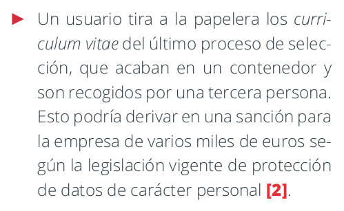

__1\.2 Puesto de trabajo__

#### RA1
b) Se ha establecido una normativa de protección del puesto de trabajo.

#### ÍNDICE

#### La información y los sistemas de información

__La información es un activo fundamental para el funcionamiento de las empresas\.__

Las empresas basan su actividad en sistemas de información con soporte tecnológico \(ordenadores\, tabletas\, página web\,…\)

Proteger los sistemas de información es proteger el negocio

#### Puesto de trabajo

La gestión de la información tanto desde dispositivos tecnológicos como no tecnológicos se realiza desde…\.

\.\.\.el  __puesto de trabajo__

¿Cuantos existen?

__Ordenadores de sobremesa__

__Portátiles__

__Teléfonos móviles__

__Tabletas__

__Dispositivos de almacenamiento__

__Impresoras de red__

__Escáneres__

__Documentos no digital__

__Archivadores__

#### ¿Qué elementos nos encontramos en el puesto de trabajo?

#### Puesto de trabajo

A estos  __dispositivos__  le afectan todo tipo de riesgos

Accesos no autorizados

Pérdida de datos

Pérdida/Robo de información confidencial

Infecciones de malware

Además\, riesgos  __no __  __tecnológicos__ :

Información en papel al alcance de personas no autorizadas\.

Falta de confidencialidad en ls medios de comunicación tradicionales

Acceso de terceras personas a zonas de trabajo

Peligro de robo\, extravío de dispositivos extraíbles

__¿Cómo mitigamos/eliminamos estos riesgos?__

Y esto nos suena a…\. RIESGOS\.  Decidir estrategias:

para implantar  __iniciativas y proyectos __  adaptadas a cada puesto de trabajo para actuar sobre los riesgos\.

#### Escenarios de riesgo

#### Puesto de trabajo

Los empleados están en primera línea y son por ello un  __eslabón fundamental de la cadena de protección__  de la información\.

Deben evitar accesos no autorizados a ordenadores y desde ellos a aplicativos de la empresa\, infecciones por malware\, robo y fuga de datos en formato digital y ataques de ingeniería social\, es decir\, engaños para manipular a la víctima para la obtención de credenciales o datos de carácter confidencial o conseguir que realice alguna acción como instalar un programa\, enviar algunos correos hacer algún ingreso etc\.

Para

garantizar un  __uso adecuado __ de los dispositivos y medios del entorno de trabajo

__minimizar el impacto que todos estos riesgos__  vistos anteriormente pueden tener en la empresa\,

debe  __implantarse __ una

__normativa __  __de protección del puesto de trabajo__ \.

#### Normativa de protección del puesto de trabajo

La organización debe facilitar a los empleados las  __obligaciones y buenas prácticas en materia de seguridad que apliquen a su puesto de trabajo__ \.

Esta normativa debe ser  __firmada por los empleados en su incorporación__  a la empresa\, así como estar siempre disponible y recordar su aplicación de manera periódica\.

Las medidas de seguridad que podemos aplicar para proteger el puesto de trabajo son  __innumerables __ y de  __diferente grado de complejidad__ \.

Identificar el conjunto reducido de medidas con un coste de implantación y mantenimiento muy bajo\, que nos aportarán una mejora sustancial en nuestro nivel de seguridad\.

Medidas que se traducen en __ mayores beneficios sobre la seguridad__  del puesto de trabajo: Legales y Buenas prácticas

#### Medidas

Las medidas se clasifican en dos niveles de complejidad:

__Básico \(B\):__  __ el esfuerzo y los recursos necesarios para implantarlo son asumibles\.__

__Se puede aplicar a través del uso de funcionalidades sencillas ya incorporadas en las aplicaciones más comunes\. Se previenen ataques mediante la instalación de herramientas de seguridad elementales\.__

__Avanzado \(A\):__  __ el esfuerzo y los recursos necesarios para implantarlo son__

__considerables\. Se necesitan programas que requieren configuraciones complejas\.__

__Se pueden precisar mecanismos de recuperación ante fallos\.__

Las medidas podrán tener el siguiente alcance:

__Procesos __ \(PRO\): aplica a la dirección o al personal de gestión\.

__Tecnología __ \(TEC\): aplica al personal técnico especializado\.

__Personas __ \(PER\): aplica a todo el personal\.

 __Destrucción avanzada de documentación mediante mecanismos seguros__ 

La información obsoleta debe destruirse siguiendo un procedimiento seguro\. Este suele comprender destructoras de papel a disposición de los empleados así como un servicio externo de destrucción segura\. La empresa debe notificar a los empleados su existencia y obligación de uso\. Además\, hay que tener en cuenta que este servicio externo debe firmar un acuerdo de confidencialidad\.

 __Uso de los medios de almacenamiento__ 

El empleado debe hacer un uso correcto de los dispositivos de almacenamiento y conocer y aplicar la normativa de la empresa referente al almacenamiento local – en el  equipo – en la nube y en los dispositivos extraíbles\.

 __Prohibición de la alteración de configuración del equipo e instalación de aplicaciones no autorizadas__ 

Es un riesgo que el empleado cambie la configuración del equipo\. Por ello\,  si el empleado requiere una configuración o software específico para el desempeño de su trabajo\, siempre deberá solicitarlo por escrito al equipo informático\.

 __Política de mesas limpias__ 

Esta política hace referencia a la obligación de guardar la documentación de trabajo al ausentarse el trabajador de su mesa de trabajo y al terminar su jornada laboral\. El cumplimiento de esta política conlleva:

Mantener el puesto de trabajo limpio y ordenado

Guardar la documentación y los dispositivos extraíbles que no estén siendo usados en ese momento y especialmente al ausentarnos del puesto de trabajo o terminar la jornada laboral

No apuntar las contraseñas en post\-it o similares\.

No abandonar documentación sensible en impresoras o escáneres\.

 __Seguridad de impresoras y equipos auxiliares de oficina__ 

Para evitar que la información acabe en manos no deseadas\, el usuario debe recoger inmediatamente aquellos documentos enviados a imprimir y guardar la documentación una vez escaneada\.

Si las impresoras disponen de mecanismos de impresión segura como contraseña hay que asegurarse de que siempre se cierra la sesión\.

 __No revelar información a usuarios no debidamente identificados__ 

Es posible que alguien intente obtener contraseñas de usuarios o información de cuentas bancarias engañando a alguien de la organización\. Esta práctica se denomina ingeniería social y para ello se emplea una llamada telefónica\, correo electrónico\, redes sociales o mensajes sms o a través de whatsapp\. El empleado debe por ello aceptar un compromiso de confidencialidad relativo a toda la información a la que tiene acceso durante su tiempo en la empresa\.

 __Uso de contraseñas__ 

Respecto al uso de contraseñas\, el usuario debe seguir la política de contraseñas de la organización\. Las credenciales de usuario y contraseñas son confidenciales y no deben ser publicadas ni compartidas y es imprescindible seguir unas buenas pautas que incluyendo\, pero no limitadas a\, las siguientes:

No deben apuntarse en documentos ni en ningún otra parte\.

Deben ser robustas\, de al menos 8 caracteres mezclando números\, mayúsculas y minúsculas y caracteres especiales\.

Deberán renovarse periódicamente\.

 __Evitar el acceso indebido por personal no autorizado al equipo del puesto de trabajo__ 

El trabajador deberá bloquear su equipo cada vez que se ausente del puesto de trabajo y apagarlo al finalizar la jornada laboral\. Deberá\, además\, conocer y aplicar la normativa que regula el uso de internet como herramienta de trabajo\, incluyendo los usos permitidos y prohibidos\. Verificar las URL de destino y la validez de los certificados cuando se trate de conexiones a entornos seguros como webmail\, extranet\, etc\. Además\, ha de comprobar que se cumple el protocolo HPPS en aquellas páginas en las que trabaje con información crítica\.

 __A__    __dvertir de cualquier incidente relacionado con su puesto de trabajo como:__ 

alertas de malware o virus generadas por su antivirus

llamadas sospechosas recibidas pidiendo información sensible de cualquier tipo

correos electrónicos sospechosos de contener virus o malware

pérdida de dispositivos móviles

sospecha de accesos no autorizados a sistemas informáticos o información confidencial por parte de terceros

cualquier actividad sospechosa que pueda detectar en su puesto de trabajo\.

 __Otras obligaciones en materia de seguridad__ 

Además\, el empleado debe conocer y aceptar con su firma la política de uso de dispositivos móviles\, tecnologías criptográficas y la política de clasificación de la información que indica cuál debe ser cifrada\.

#### Bibliografia/Webgrafía

https://www\.incibe\.es/protege\-tu\-empresa/que\-te\-interesa/proteccion\-puesto\-trabajo

