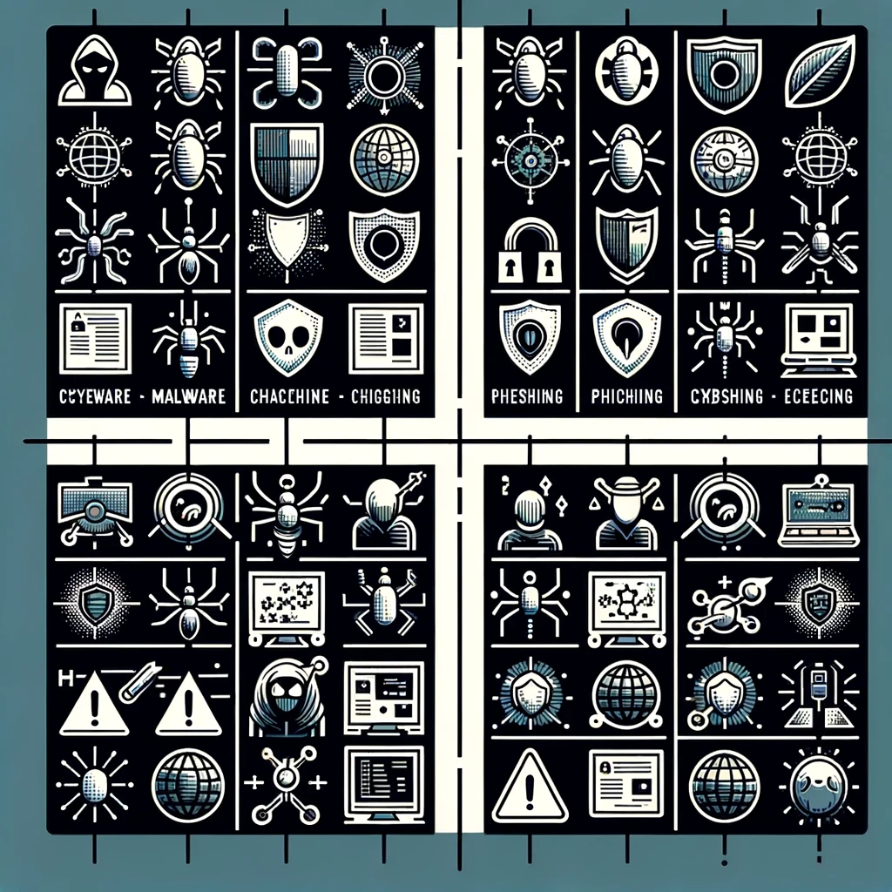

{: .center}

# Taxonomía de incidentes de ciberseguridad

**RA1**

> a) Se ha clasificado y definido la taxonomía de incidentes de ciberseguridad que pueden afectar a la organización.

### 1. Introducciíon

#### 1.1 Motivación

En el mundo de la ciberseguridad, nos enfrentamos a una diversidad asombrosa. No solo en términos de las empresas que operan en distintos sectores y tamaños, sino también en la variedad de ciberincidentes que pueden encontrarse. Al igual que en un ecosistema natural donde cada especie juega un papel único, en el ciberespacio, cada tipo de incidente tiene sus propias características y repercusiones.

Imaginemos que cada organización habla un idioma diferente cuando describe los ciberincidentes. Sin una taxonomía común, el desafío de comunicarse y entenderse entre sí sería abrumador. Esto es precisamente lo que sucede en el ámbito de la ciberseguridad sin una clasificación estándar. Cada empresa podría tener su propia forma de describir y abordar los incidentes, lo que llevaría a confusiones y, en última instancia, a una respuesta menos eficaz.

La taxonomía de incidentes, en este contexto, actúa como un idioma común. Nos permite categorizar y describir los incidentes de ciberseguridad de manera estandarizada. ¿Por qué es esto crucial? Porque cuando todas las organizaciones utilizan la misma clasificación, se facilita enormemente la colaboración, el intercambio de información y, lo más importante, la respuesta rápida y efectiva.

La clasificación uniforme de incidentes permite a las organizaciones no solo identificar rápidamente el tipo de amenaza a la que se enfrentan, sino también aplicar las mejores prácticas y lecciones aprendidas de otros en situaciones similares. Esto es fundamental para una gestión de incidentes efectiva: comprender rápidamente lo que está sucediendo, cómo ha sucedido y qué se puede hacer al respecto.

Por tanto, disponer de una taxonomía común de incidentes de ciberseguridad es como tener un mapa detallado en un terreno desconocido. Nos proporciona la orientación necesaria para abordar, contener y erradicar eficazmente las amenazas, garantizando así una ciberseguridad más robusta y una red más segura para todos.

#### 1.2 Incidente de seguridad

{: .center}

Un incidente de ciberseguridad se refiere a cualquier evento no planificado o no deseado que pueda comprometer la seguridad de la información y afectar la integridad, confidencialidad o disponibilidad de los datos. Estos incidentes pueden tomar muchas formas, desde ataques de malware hasta brechas de seguridad y accesos no autorizados.

La gestión de un ciberincidente implica varias fases críticas, y la clasificación (taxonomía) de estos incidentes es un paso esencial en las etapas iniciales de la gestión. La identificación y clasificación correcta de los incidentes de ciberseguridad son cruciales para las organizaciones. Esto no solo ayuda a comprender la naturaleza y el alcance del ataque, sino que también es fundamental para una respuesta eficaz. Por ejemplo, un ataque de phishing que busca robar credenciales de acceso requiere una respuesta diferente a un ataque de denegación de servicio distribuido (DDoS) que busca interrumpir los servicios.

Comprender los incidentes de ciberseguridad también implica reconocer sus fuentes y métodos. Las fuentes pueden variar desde actores internos (empleados, contratistas) hasta externos (hackers, competidores), y los métodos pueden incluir software malicioso, explotación de vulnerabilidades o ingeniería social.

La gestión eficaz de incidentes de ciberseguridad es un aspecto crucial de la seguridad de la información. Implica no solo la detección y respuesta inmediata a los incidentes, sino también la recuperación y la prevención de futuros ataques. La gestión de incidentes no es solo una cuestión técnica; también requiere una planificación organizativa, incluyendo la formación de empleados, la creación de políticas y procedimientos adecuados, y la implementación de controles de seguridad apropiados.

La gestión de incidentes de ciberseguridad es un proceso continuo que implica aprender de los incidentes anteriores. Cada incidente ofrece una oportunidad para mejorar las defensas y prepararse mejor para los desafíos futuros. Por ello, es esencial mantener registros detallados de los incidentes, realizar análisis post-incidente y actualizar constantemente las estrategias de seguridad.

### 2. Taxonomía

**Definición:** Clasificación u ordenación en grupos de cosas que tienen unas características comunes.

{: .center}

#### 2.1 ¿Qué es una Taxonomía en este contexto?

Es un sistema de clasificación que agrupa incidentes de ciberseguridad en categorías basadas en características comunes.
Categorías Comunes: Por ejemplo, los ataques de malware se clasifican según el tipo de software malicioso (virus, gusanos, troyanos), mientras que los ataques DDoS se categorizan por el volumen de tráfico generado o los recursos específicos atacados.

#### 2.2 ¿Qué es la Taxonomía de Incidentes de Ciberseguridad?

Cuando hablamos de taxonomía en el contexto de la ciberseguridad, nos referimos a un sistema de clasificación estructurado para los incidentes de ciberseguridad. Esta taxonomía es como un marco que nos ayuda a categorizar y describir los diferentes tipos de incidentes de una manera estandarizada y ordenada.

Imagina que estás en una gran biblioteca con miles de libros, pero sin un sistema de clasificación. Encontrar un libro específico sería una tarea desalentadora. La taxonomía actúa como ese sistema de clasificación en la biblioteca, pero en lugar de libros, clasifica los incidentes de ciberseguridad.

#### 2.3 ¿Por qué es importante?

La diversidad y complejidad de los ciberataques son enormes y están en constante evolución. Sin una taxonomía, cada organización podría tener su propio método para describir y responder a estos incidentes, lo que llevaría a confusión, malentendidos y, finalmente, a una respuesta menos eficaz a las amenazas.

Al adoptar una taxonomía común, todas las organizaciones pueden hablar el mismo "idioma" en términos de ciberseguridad. Esto facilita la identificación rápida de los tipos de incidentes, permite compartir información de manera más efectiva y ayuda en la coordinación de respuestas a amenazas entre diferentes entidades.

Aplicaciones Prácticas de la Taxonomía. Una taxonomía bien definida ayuda en varios aspectos:

1. **Identificación Rápida:** Permite a las organizaciones identificar de manera eficiente el tipo de ciberataque al que se enfrentan.
2. **Mejor Comunicación:** Facilita la comunicación clara y precisa entre diferentes departamentos, organizaciones y, en algunos casos, incluso entre países.
3. **Respuesta Efectiva:** Proporciona una base para desarrollar estrategias específicas y efectivas de respuesta y recuperación.
4. **Aprendizaje y Mejora:** Ayuda a las organizaciones a aprender de incidentes anteriores y a mejorar continuamente sus prácticas de ciberseguridad.

Por tanto la taxonomía de incidentes de ciberseguridad es una herramienta esencial para la organización, la comprensión y la respuesta efectiva a las amenazas cibernéticas. Al proporcionar un marco común, simplifica y refuerza nuestras defensas contra los ciberataques.

### 3. Taxonomía de incidentes

La elaboración de una taxonomía no es sencilla, pero puede basarse en modelos de taxonomía diseñados por organismos de referencia, como el CCN-CERT y la ENISA. Deben tener considerarse los siguientes factores a la hora de establecer criterios de clasificación:

* Tipo de amenaza: código dañino, intrusiones, fraude, etc.
* Origen de la amenaza: Interna o externa.
* La categoría de seguridad de los sistemas afectados.
* El perfil de los usuarios afectados, su posición en la estructura organizativa de la entidad y, en su consecuencia, sus privilegios de acceso a información sensible o confidencial.
* El número y tipología de los sistemas afectados.
* El impacto que el incidente puede tener en la organización, desde los puntos de vista de la protección de la información, la prestación de los servicios, la conformidad legal y/o la imagen pública.
* Los requerimientos legales y regulatorios.

La toma en consideración de estos factores determinará la decisión de crear un ciberincidente y, en su caso, su peligrosidad y la prioridad de actuación.

Por ejemplo, en cuanto a la clasificación de Incidentes:

Criterios de Clasificación: Por ejemplo, un ataque puede clasificarse por el método de entrada (correo electrónico, explotación de vulnerabilidades) o por el tipo de datos afectados (datos personales, información financiera). Ejemplo Práctico: Un ataque de phishing dirigido a empleados para obtener credenciales podría clasificarse como un incidente de "Engaño y Manipulación".

#### 3.1 Taxonomía de Referencia para la Clasificación de Incidentes de Seguridad

La taxonomía definida en la **Guía Nacional de Notificación y Gestión de Ciberincidentes**, se basa en la Taxonomía de Referencia para la Clasificación de Incidentes de Seguridad, desarrollada coordinadamente por un grupo internacional de equipos de respuesta a incidentes (clasificación de los ciberincidentes tomando como referencia la incluida en la guía CCN-STIC 817.):

[https://github.com/flosada/RSITaxonomy_ES/blob/master/humanv1.md](https://github.com/flosada/RSITaxonomy_ES/blob/master/humanv1.md)

Se muestra en un primer nivel la clasificación del incidente y, en un segundo nivel los tipos de incidentes dentro de esa clasificación.

##### Contenido abusivo:  
Incidentes que muestren signos evidentes de spam, contengan comentarios ofensivos o inciten a la pederastia, violencia y/o delitos sexuales.   
  
  * **SPAM:** correo electrónico masivo no solicitado. El receptor del contenido no ha otorgado autorización válida para recibir un mensaje colectivo.  
  * **Delito de odio:** contenido difamatorio o discriminatorio. Ejemplos: ciberacoso, racismo, amenazas a una persona o dirigidas contra colectivos.  
  * **Pornografía infantil, contenido sexual o violento inadecuado:** material que represente de manera visual contenido relacionado con pornografía infantil, apología de la violencia, etc.   
  
##### Contenido dañino:  
Problemas relacionados con virus, troyanos, gusanos, spyware, bots e inyección de código   
  
  * **Sistema infectado:** sistema infectado con malware. Ejemplo: sistema, computadora o teléfono móvil infectado con un rootkit.  
  * **Servidor C&C (Mando y Control):** conexión con servidor de Mando y Control (C&C) mediante malware o sistemas infectados.  
  * **Distribución de malware:** recurso usado para distribución de malware. Ejemplo: recurso de una organización empleado para distribuir malware.  
  * **Configuración de malware:** recurso que aloje ficheros de configuración de malware. Ejemplo: ataque de webinjects para troyano.  
  * **Malware dominio DGA:** nombre de dominio generado mediante DGA (Algoritmo de Generación de Dominio), empleado por malware para contactar con un servidor de Mando y Control (C&C).  

##### Obtención de información:  
Los escaneos como reporte más común. También se consideran dentro de esta clasificación aquellos relacionados con los usos de sniffers, ingeniería social o ataques de fuerza bruta.  
  
  * **Escaneo de redes (scanning):** envío de peticiones a un sistema para descubrir posibles debilidades. Se incluyen también procesos de comprobación o testeo para recopilar información de alojamientos, servicios y cuentas. Ejemplos: peticiones DNS, ICMP, SMTP, escaneo de puertos.  
  * **Análisis de paquetes (sniffing):** observación y grabación del tráfico de redes.  
  * **Ingeniería social:** recopilación de información personal sin el uso de la tecnología. Ejemplos: mentiras, trucos, sobornos, amenazas.  

##### Intento de intrusión:  
  * **Explotación de vulnerabilidades conocidas:** intento de compromiso de un sistema o de interrupción de un servicio mediante la explotación de vulnerabilidades con un identificador estandarizado (véase CVE). Ejemplos: desbordamiento de buffer, puertas traseras, cross site scripting (XSS).
  * **Intento de acceso con vulneración de credenciales:** múltiples intentos de vulnerar credenciales. Ejemplos: intentos de ruptura de contraseñas, ataque por fuerza bruta.
  * **Ataque desconocido:** ataque empleando exploit desconocido.

##### Intrusión: 
Incidentes en los que se manifieste el claro acceso a cuentas privilegiadas, no privilegiadas, compromiso de aplicaciones y ataques de 0-day.  
  
  * **Compromiso de cuenta con privilegios:** compromiso de un sistema en el que el atacante ha adquirido privilegios.  
  * **Compromiso de cuenta sin privilegios:** compromiso de un sistema empleando cuentas sin privilegios.  
  * **Compromiso de aplicaciones:** compromiso de una aplicación mediante la explotación de vulnerabilidades de software.  Ejemplo: inyección SQL.  
  * **Robo:** intrusión física. Ejemplo: acceso no autorizado a Centro de Proceso de Datos y sustracción de equipo.  
  
##### Disponibilidad: 
Ataques de denegación de servicio, tales como DoS, DDoS y sabotajes.  
  
  * **DoS (Denegación de Servicio):** ataque de Denegación de Servicio. Ejemplo: envío de peticiones a una aplicación web que provoca la interrupción o ralentización en la prestación del servicio.  
  * **DDoS (Denegación Distribuida de Servicio):** ataque de Denegación Distribuida de Servicio. Ejemplos: inundación de paquetes SYN, ataques de reflexión y amplificación utilizando servicios basados en UDP.  
  * **Sabotaje:** sabotaje físico. Ejemplos: cortes de cableados de equipos o incendios provocados.  
  * **Interrupciones:** interrupciones por causas externas. Ejemplo: desastre natural.  

##### Compromiso de la información:  
Problemas relacionados con el acceso a información y/o modificación no autorizada.  
  
  * **Acceso no autorizado a información:** acceso no autorizado a información. Ejemplos: robo de credenciales de acceso mediante interceptación de tráfico o mediante el acceso a documentos físicos.  
  * **Modificación no autorizada de información:** modificación no autorizada de información. Ejemplos: modificación por un atacante empleando credenciales sustraídas de un sistema o aplicación o encriptado de datos mediante ransomware.  
  * **Pérdida de datos:** pérdida de información. Ejemplos: pérdida por fallo de disco duro o robo físico.   

##### Fraude:  
Reportes que tengan nexo con el uso no autorizado, derechos de autor, suplantación de identidad, phishing y robo de credenciales.  
  
  * **Uso no autorizado de recursos:** uso de recursos para propósitos inadecuados, incluyendo acciones con ánimo de lucro. Ejemplo: uso de correo electrónico para participar en estafas piramidales.  
  * **Derechos de autor:** ofrecimiento o instalación de software carente de licencia u otro material protegido por derechos de autor. Ejemplos: Warez.  
  * **Suplantación:** tipo de ataque en el que una entidad suplanta a otra para obtener beneficios ilegítimos.  
  * **Phishing:** suplantación de otra entidad con la finalidad de convencer al usuario para que revele sus credenciales privadas.  

##### Vulnerable:
  * **Criptografía débil:** servicios accesibles públicamente que pueden presentar criptografía débil. Ejemplo: servidores web susceptibles de ataques POODLE/FREAK.
  * **Amplificador DDoS:** servicios accesibles públicamente que puedan ser empleados para la reflexión o amplificación de ataques DDoS. Ejemplos: DNS open\-resolvers o Servidores NTP con monitorización monlist.
  * **Servicios con acceso potencial no deseado:** servicios accesibles públicamente potencialmente no deseados. Ejemplos: Telnet, RDP o VNC.
  * **Revelación de información:** acceso público a servicios en los que potencialmente pueda revelarse información sensible. Ejemplos: SNMP o Redis.
  * **Sistema vulnerable:** sistema vulnerable. Ejemplos: mala configuración de proxy en cliente (WPAD), versiones desfasadas de sistema.

##### Otros:  
Aquellos incidentes que realicen consultas técnicas, mensajes informativos y peticiones judiciales. Reportes recibidos en el servicio gestionado por el CERT, pero que no se debe tomar acciones puesto que no pertenece a su ámbito de actuación. También se incluirán en esta clasificación aquellas quejas sobre las que no se reporten evidencias o éstas no sean contrastadas.  
  
  * **Otros:** todo aquel incidente que no tenga cabida en ninguna categoría anterior.  
  * **APT:** ataques dirigidos contra organizaciones concretas, sustentados en mecanismos muy sofisticados de ocultación, anonimato y persistencia. Esta amenaza habitualmente emplea técnicas de ingeniería social para conseguir sus objetivos junto con el uso de procedimientos de ataque conocidos o genuinos.  
  * **Ciberterrorismo:** uso de redes o sistemas de información con fines de carácter terrorista.  
  * **Daños informáticos PIC:** borrado, dañado, alteración, supresión o inaccesibilidad de datos, programas informáticos o documentos electrónicos de una infraestructura crítica. Conductas graves relacionadas con los términos anteriores que afecten a la prestación de un servicio esencial.  
  

#### 3.2 Peligrosidad e impacto

Para completar una adecuada clasificación de los ciberincidentes, además de asignarlos a un grupo o tipo, será necesario determinar tanto el grado de **peligrosidad** como el **impacto** que puede tener en la organización.

##### 3.2.1 Grado de gravedad/peligrosidad

El establecimiento de ciertos criterios permitirá asignar el **grado de peligrosidad** en la primera fase de detección.

El indicador de peligrosidad determina la potencial amenaza que supondría la materialización de un incidente en los sistemas de información o comunicación del ente afectado, así como para los servicios prestados o la continuidad de negocio en caso de haberla. Este indicador se fundamenta en las características intrínsecas a la tipología de amenaza y su comportamiento.

{: .center}

En la GUÍA NACIONAL DE NOTIFICACIÓN Y GESTIÓN DE CIBERINCIDENTES, podrás ver una relación entre el tipo de incidente y el nivel de peligrosidad.

##### 3.2.2 Impacto/Alcance del incidente

También tendremos que tener en cuenta el **impacto de los Incidentes** en las Organizaciones. Éste se podrá medir teniendo en cuenta las consecuencias que puede desencadenar el ciberincidente en la operación de la organización, en sus activos o, incluso, en los propios individuos.

El indicador de impacto de un ciberincidente se determinará evaluando las consecuencias que tal ciberincidente ha tenido en las funciones y actividades de la organización afectada, en sus activos o en los individuos afectados. De acuerdo a ello, se tienen en cuenta aspectos como las consecuencias potenciales o materializadas que provoca una determinada amenaza en un sistema de información y/o comunicación, así como en la propia entidad afectada (organismos públicos o privados, y particulares).

Por ejemplo, en lo que se refiere al Impacto Operativo y Financiero, un ataque de ransomware puede causar la pérdida de acceso a datos críticos, lo que resulta en paralización operativa y pérdidas económicas significativas.

{: .center}

En la GUÍA NACIONAL DE NOTIFICACIÓN Y GESTIÓN DE CIBERINCIDENTES, podrás ver una relación entre los parámetros tenidos en cuenta y el nivel de impacto.

#### 3.3 Prioridades

La asignación de prioridad a un incidente podrá variar a lo largo del tiempo en función de la nueva información disponible sobre el mismo. Esta clasificación se podrá obtener a partir de una conjunción de las dos anteriores y puede ayudar a concretar en un único indicador como de prioritario es el incidente..

Por ello, esta relación pretende ser meramente orientativa pudiendo ser alterada en aquellos casos en los que el equipo de operación lo estimen oportuno, atendiendo al alcance/impacto y gravedad/peligrosidad del incidente.

* **Emergencia:** incidentes cuya resolución no admite demora. Los incidentes de este tipo se procesarán en paralelo de haber varios y, en su resolución, se emplearán todos los recursos disponibles. Ejemplos: aquellos que supongan peligro para vidas humanas, para la seguridad nacional, para la infraestructura de Internet. Hasta ahora también se consideran emergencias todos aquellos incidentes que requieran acción inmediata debido a su rapidez y ámbito de difusión.
* **Alta:** aquellos cuyas características requieren que sea atendido antes que otros, aunque sea detectado posteriormente. Se mantienen en una cola independiente de incidentes de alta prioridad, y no se procesarán los de prioridad inferior mientras que estos no estén atendidos. Los incidentes de alta prioridad se procesan en serie.
* **Normal:** por defecto, los incidentes se atienden en serie por orden de llegada, mientras no requiera atención uno de prioridad superior. Un incidente de prioridad normal puede adquirir la categoría de alta prioridad si no recibe atención por un tiempo prolongado. Ejemplos: todos los incidentes no clasificados como alta prioridad o emergencia donde el atacante haya ganado acceso a un sistema informático ajeno. También se incluyen escaneos insistentes de redes.
* **Baja:** los incidentes de baja prioridad se atienden en serie por orden de llegada, mientras no requiera atención uno de prioridad superior. Un incidente de baja prioridad será cerrado automáticamente si no recibe atención por un tiempo prolongado. Ejemplos: incidentes aislados en grado de tentativa, donde el atacante no ha conseguido su propósito y no es probable que lo consiga.

#### 3.4 Respuesta al incidente

Todo lo anterior nos permitirá definir la mejores estrategias de Respuesta a Incidentes:

- Acciones Típicas de Respuesta: En caso de un ataque de malware, la respuesta incluiría la identificación y aislamiento del malware, seguido de la limpieza y recuperación de los sistemas afectados.
- Estrategias de Mitigación: Implementación de copias de seguridad regulares y formación de empleados en la detección de correos electrónicos sospechosos.
- Planificación Ante Incidentes: Desarrollar y mantener un plan de respuesta a incidentes, que incluya protocolos de comunicación y roles específicos durante un incidente.

### 4. Actividades

#### 4.1 Ejemplo

Tarea: Clasificar cada incidente según los criterios de taxonomía.

**Incidentes:**

* **Incidente 1:** Ataque de malware que ha infectado varios sistemas críticos.
* **Incidente 2:** Un ataque de phishing dirigido a empleados de alto nivel.
* **Incidente 3:** Intrusión en la red que resultó en una violación de datos.
* **Incidente 4:** Denegación de servicio distribuida (DDoS) que interrumpió los servicios en línea.
* **Incidente 5:** Un empleado accediendo y divulgando información confidencial.

**Solución Sugerida: ¿En que grupo/tipo cae?**

**Incidente 1:** Malware  
  
  - **Clasificación:** Contenido malicioso  
  - **Prioridad:** Alta  
  - **Justificación:** Afecta sistemas críticos y requiere atención inmediata  

**Incidente 2:** Phishing  
  
  - **Clasificación:** Fraude  
  - **Prioridad:** Normal  
  - **Justificación:** Riesgo de compromiso de información, pero sin acceso directo a sistemas  

**Incidente 3:** Intrusión y violación de datos  
  
  - **Clasificación:** Acceso/Intrusión  
  - **Prioridad:** Alta  
  - **Justificación:** Compromiso de datos sensibles y potencial impacto legal  
  
**Incidente 4:** Ataque DDoS  
  
  - **Clasificación:** Disponibilidad  
  - **Prioridad:** Emergencia  
  - **Justificación:** Interrupción de servicios críticos y necesidad de respuesta inmediata  

**Incidente 5:** Fuga de información por empleado  
  
  - **Clasificación:** Seguridad/Confidencialidad de la información  
  - **Prioridad:** Normal  
  - **Justificación:** Compromiso interno, riesgo de pérdida de confidencialidad  

#### 4.2 actividad

Consulta la moodle.

### 5. Fuente

* [Taxonomia de un incidente](https://globalt4e.com/taxonomia-de-un-incidente/)
* [Taxonomía](https://www.incibe.es/incibe-cert/respuesta-incidentes/rediris/taxonomia)
* [Conoce a tus enemigos](https://www.incibe.es/empresas/blog/incidentes-seguridad-conoce-tus-enemigos)
* [GUÍA NACIONAL DE NOTIFICACIÓN Y GESTIÓN DE CIBERINCIDENTES](https://www.incibe.es/sites/default/files/contenidos/guias/doc/guia_nacional_notificacion_gestion_ciberincidentes.pdf)
