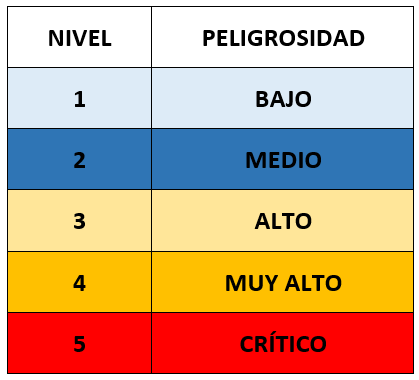
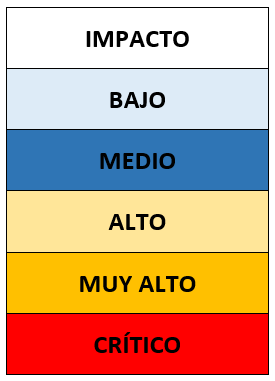

## 2.1.1 Taxonomía de incidentes de ciberseguridad

| Código    | Descripción                                                                                                   |   |
|-----------|---------------------------------------------------------------------------------------------------------------|---|
| RA2       | Analiza incidentes de ciberseguridad utilizando herramientas, mecanismos de detección y alertas de seguridad. |   |
| CEa       | Se ha clasificado y definido la taxonomía de incidentes de ciberseguridad que pueden afectar a la organización.|   |

Durante la unidad anterior, hemos visto cómo las organizaciones pueden prepararse para prevenir los incidentes de ciberseguridad. En esta unidad, nos centraremos en la detección y clasificación de los incidentes de ciberseguridad.

Como vimos, existen numerosas amenazas que, en el caso de materializarse, es decir, afectar al activo vulnerable, provocarán un incidente de seguridad. Estos últimos pueden tener un impacto significativo en las organizaciones, desde la pérdida de datos confidenciales hasta la interrupción de los servicios críticos. Por ello, es fundamental contar con una **taxonomía de incidentes** que permita clasificar y describir los diferentes tipos de amenazas de manera estructurada y coherente.

<figure markdown>
  
  <figcaption>Taxonomía de incidentes de seguridad</figcaption>
</figure>

### 1. Introducciíon

#### 1.1. Motivación

En el mundo de la ciberseguridad, nos enfrentamos a una diversidad asombrosa. No solo en términos de las empresas que operan en distintos sectores y tamaños, sino también en la variedad de ciberincidentes que pueden encontrarse. Al igual que en un ecosistema natural donde cada especie juega un papel único, en el ciberespacio, cada tipo de incidente tiene sus propias características y repercusiones.

Imaginemos que cada organización habla un idioma diferente cuando describe los ciberincidentes. Sin una taxonomía común, el desafío de comunicarse y entenderse entre sí sería abrumador. Esto es precisamente lo que sucede en el ámbito de la ciberseguridad sin una clasificación estándar. Cada empresa podría tener su propia forma de describir y abordar los incidentes, lo que llevaría a confusiones y, en última instancia, a una respuesta menos eficaz.

**La taxonomía de incidentes, en este contexto, actúa como un idioma común**. Nos permite categorizar y describir los incidentes de ciberseguridad de manera estandarizada. ¿Por qué es esto crucial? Porque cuando todas las organizaciones utilizan la misma clasificación, se facilita enormemente la colaboración, el intercambio de información y, lo más importante, la respuesta rápida y efectiva.

La clasificación uniforme de incidentes permite a las organizaciones no solo identificar rápidamente el tipo de amenaza a la que se enfrentan, sino también aplicar las mejores prácticas y lecciones aprendidas de otros en situaciones similares. Esto es fundamental para una gestión de incidentes efectiva: comprender rápidamente lo que está sucediendo, cómo ha sucedido y qué se puede hacer al respecto.

Por tanto, disponer de una taxonomía común de incidentes de ciberseguridad es como tener un mapa detallado en un terreno desconocido. Nos proporciona la orientación necesaria para abordar, contener y erradicar eficazmente las amenazas, es decir adaptar la respuesta a las amenazas, garantizando así una ciberseguridad más robusta.

#### 1.2. Incidente de seguridad

**Un incidente de ciberseguridad se refiere a cualquier evento no planificado o no deseado que pueda comprometer la seguridad de la información y afectar la integridad, confidencialidad o disponibilidad de los datos**. Estos incidentes pueden tomar muchas formas, desde ataques de malware hasta brechas de seguridad y accesos no autorizados.

<figure markdown>
  
  <figcaption>Fases por las que pasa la gestión de un incidente</figcaption>
</figure>

Durante el ciclo de vida de un incidente, se siguen varias fases críticas:     

1. **Preparación:** Implementación de medidas preventivas, es decir, prepararse antes de que ocurra un incidente. Algunas de las medidas preventivas incluyen la formación de empleados, la implementación de controles de seguridad y la realización de pruebas de seguridad, vistas en la unidad anterior.     
2. **Identificación:** Detección y alerta de un incidente de seguridad. Esto puede ser a través de alertas, monitoreo de sistemas o informes de usuarios. En esta fase, es fundamental contar con herramientas y mecanismos de detección de incidentes. Será en está fase en la que pongamos el foco en esta unidad.   
3. **Contención:** Aislar el incidente para evitar que se propague.     
4. **Erradicación:** Eliminar la causa raíz del incidente y restaurar los sistemas afectados.     
5. **Recuperación:** Restaurar los sistemas y datos afectados a un estado operativo normal.    
6. **Lecciones aprendidas:** Analizar el incidente para identificar áreas de mejora y prevenir futuros incidentes.

Aunque esta ciclo de vida puede variar según la organización y el tipo de incidente, es fundamental seguir un enfoque estructurado y sistemático para garantizar una respuesta efectiva y eficiente a los incidentes de ciberseguridad.

Como hemos visto, la gestión de ciberincidentes pasa por varias fases críticas, y la clasificación (taxonomía) de estos incidentes es un paso esencial en las etapas iniciales de este proceso. La identificación y clasificación correcta de los incidentes de ciberseguridad son cruciales para las organizaciones. Esto no solo ayuda a comprender la naturaleza y el alcance del ataque, sino que también es fundamental para una respuesta eficaz. Por ejemplo, un ataque de phishing que busca robar credenciales de acceso requiere una respuesta diferente a un ataque de denegación de servicio distribuido (DDoS) que busca interrumpir los servicios.

Comprender los incidentes de ciberseguridad también implica reconocer sus fuentes y métodos. Las fuentes pueden variar desde actores internos (empleados, contratistas) hasta externos (hackers, competidores), y los métodos pueden incluir software malicioso, explotación de vulnerabilidades o ingeniería social.

La gestión eficaz de incidentes de ciberseguridad es un aspecto crucial de la seguridad de la información. Implica no solo la **detección** y **respuesta inmediata** a los incidentes, sino también la **recuperación** y la **prevención** de futuros ataques. La gestión de incidentes no es solo una cuestión técnica; también requiere una planificación organizativa, incluyendo la formación de empleados, la creación de políticas y procedimientos adecuados, y la implementación de controles de seguridad apropiados.

La gestión de incidentes de ciberseguridad es un proceso continuo que implica aprender de los incidentes anteriores. Cada incidente ofrece una oportunidad para mejorar las defensas y prepararse mejor para los desafíos futuros. Por ello, es esencial mantener registros detallados de los incidentes, realizar análisis post-incidente y actualizar constantemente las estrategias de seguridad.

### 2. ¿Que significa Taxonomía?

**Definición:** Clasificación u ordenación en grupos de cosas que tienen unas características comunes.

<figure markdown>
  
  <figcaption>Taxonomía de incidentes</figcaption>
</figure>

#### 2.1. ¿Qué es una Taxonomía en este contexto?

Es un sistema de clasificación que agrupa incidentes de ciberseguridad en categorías basadas en características comunes.
Categorías Comunes: Por ejemplo, los ataques de malware se clasifican según el tipo de software malicioso (virus, gusanos, troyanos), mientras que los ataques DDoS se categorizan por el volumen de tráfico generado o los recursos específicos atacados.

#### 2.2. ¿Qué es la Taxonomía de Incidentes de Ciberseguridad?

Cuando hablamos de taxonomía en el contexto de la ciberseguridad, nos referimos a un sistema de clasificación estructurado para los incidentes de ciberseguridad. Esta taxonomía es como un marco que nos ayuda a categorizar y describir los diferentes tipos de incidentes de una manera estandarizada y ordenada.

Imagina que estás en una gran biblioteca con miles de libros, pero sin un sistema de clasificación. Encontrar un libro específico sería una tarea desalentadora. La taxonomía actúa como ese sistema de clasificación en la biblioteca, pero en lugar de libros, clasifica los incidentes de ciberseguridad.

#### 2.3. ¿Por qué es importante?

La diversidad y complejidad de los ciberataques son enormes y están en constante evolución. Sin una taxonomía, cada organización podría tener su propio método para describir y responder a estos incidentes, lo que llevaría a confusión, malentendidos y, finalmente, a una respuesta menos eficaz a las amenazas.

Al adoptar una taxonomía común, todas las organizaciones pueden hablar el mismo "idioma" en términos de ciberseguridad. Esto facilita la identificación rápida de los tipos de incidentes, permite compartir información de manera más efectiva y ayuda en la coordinación de respuestas a amenazas entre diferentes entidades.

En definitiva, una taxonomía bien definida ayuda en varios aspectos prácticos:

1. **Identificación rápida:** Permite a las organizaciones identificar de manera eficiente el tipo de ciberataque al que se enfrentan, dándonos información sobre posible origen y métodos utilizados, impacto potencial, peligrosidad y prioridad de respuesta, etc.
2. **Mejor comunicación:** Facilita la comunicación clara y precisa entre diferentes departamentos, organizaciones y, en algunos casos, incluso entre países.
3. **Respuesta efectiva:** Proporciona una base para desarrollar estrategias específicas y efectivas de respuesta y recuperación.
4. **Aprendizaje y mejora:** Ayuda a las organizaciones a aprender de incidentes anteriores y a mejorar continuamente sus prácticas de ciberseguridad.

Por tanto la taxonomía de incidentes de ciberseguridad es una herramienta esencial para la organización, la comprensión y la respuesta efectiva a las amenazas cibernéticas. Al proporcionar un marco común, simplifica y refuerza nuestras defensas contra los ciberataques.

### 3. Taxonomía de incidentes

La elaboración de una taxonomía no es sencilla, pero puede basarse en modelos de taxonomía diseñados por organismos de referencia, como el **CCN-CERT** y la **ENISA**. Por otra parte, durante la clasificación deben considerarse los siguientes factores a la hora de establecer criterios de clasificación.

#### 3.1. Factores a considerar en la clasificación de incidentes
Los incidentes de ciberseguridad pueden variar en su naturaleza, alcance y gravedad. Por ello, es importante tener en cuenta una serie de factores al clasificarlos. Algunos de los factores clave a considerar incluyen:

* **Tipo de amenaza o método:** Determinar la técnica utilizada por los atacantes: código dañino, intrusiones, fraude, etc. Nos permitirá identificar el tipo de incidente y aplicar las medidas de respuesta adecuadas. 
* **Origen de la amenaza:** Interna o externa. Nos permitirá identificar si el ataque proviene de un empleado descontento o de un hacker externo.
* **La [categoria de seguridad de los sistemas de información](https://ens.ccn.cni.es/es/soporte-ens/real-decreto-311-2022/anexo/3) afectados:** Así, por ejemplo, un incidente que afecte a sistemas críticos de información tendrá una prioridad mayor que otro que afecte a sistemas menos críticos.
* **El perfil de los usuarios afectados:** la posición de estos en la estructura organizativa de la entidad y, en su consecuencia, sus privilegios de acceso a información sensible o confidencial.
* **El número y tipología de los sistemas afectados:** Un incidente que afecte a un único sistema puede tener un impacto menor que otro que afecte a toda la red de la organización. La tipología de los sistemas afectados (servidores, estaciones de trabajo, dispositivos móviles) influirá en la gravedad del incidente.
* **El impacto que el incidente puede tener en la organización:** Como impáctará desde el punto de vista de la protección de la información, la prestación de los servicios, la conformidad legal y/o la imagen pública.
* **Los requerimientos legales y regulatorios:** Algunos incidentes pueden requerir notificación a las autoridades competentes o a los afectados. 

La toma en consideración de estos factores determinará la decisión de clasificar un incidente como un tipo u otro y, en su caso, su peligrosidad y la prioridad de actuación. Es decir, un ataque puede clasificarse por el tipo de amenaza (correo electrónico, explotación de vulnerabilidades) o por el impacto en el tipo de datos afectados (acceso a datos personales, robo de información financiera). En esta línea, acerca de como podría variar el tipo de incidente en función de los factores considerados, un ejemplo sería el siguiente: Un ataque de phishing dirigido a empleados de alto nivel podría clasificarse como un incidente de fraude, pero si el atacante logra acceder a información confidencial, en cuyo caso el impacto del incidente es mayor, podría clasificarse como un incidente de acceso no autorizado a información.

#### 3.2. Taxonomía de Referencia para la Clasificación de Incidentes de Seguridad

La taxonomía definida en la **[Guía Nacional de Notificación y Gestión de Ciberincidentes](https://www.incibe.es/sites/default/files/contenidos/guias/doc/guia_nacional_notificacion_gestion_ciberincidentes.pdf)** usada por INCIBE, se basa en la Taxonomía de Referencia para la Clasificación de Incidentes de Seguridad, desarrollada coordinadamente por un grupo internacional de equipos de respuesta a incidentes (clasificación de los ciberincidentes tomando como referencia la incluida en la [guía CCN-STIC 817](https://www.aec.es/wp-media/uploads/DPD-00266.SEG-GUI-004-CCN-STIC-817_Gestion_de_Ciberincidentes_ENS.pdf) y presentada por ENISA):

En este enlace, también puedes acceder a un repositorio de trabajo, en el que se trabaja la taxonomía de referencia para la clasificación de incidentes de seguridad:   

- [https://github.com/flosada/RSITaxonomy_ES/blob/master/humanv1.md](https://github.com/flosada/RSITaxonomy_ES/blob/master/humanv1.md)

A continuación, se muestra en un primer nivel la clasificación del incidente y, en un segundo nivel los tipos de incidentes dentro de esa clasificación.

##### 3.2.1. Contenido abusivo 
Incidentes que muestren signos evidentes de spam, contengan comentarios ofensivos o inciten a la pederastia, violencia y/o delitos sexuales.   
  
  * **SPAM:** correo electrónico masivo no solicitado. El receptor del contenido no ha otorgado autorización válida para recibir un mensaje colectivo.   
     **Ejemplo:** envío de correos electrónicos no solicitados con fines publicitarios.
  * **Delito de odio:** contenido difamatorio o discriminatorio.     
     **Ejemplo:** ciberacoso, racismo, amenazas a una persona o dirigidas contra colectivos, publicación de comentarios ofensivos en redes sociales.
  * **Pornografía infantil, contenido sexual o violento inadecuado:** material que represente de manera visual contenido relacionado con pornografía infantil, apología de la violencia, etc.   
     **Ejemplo:** publicación de imágenes de menores de edad en situaciones de abuso.
  
#####  3.2.2. Contenido dañino o malicioso
Problemas relacionados con virus, troyanos, gusanos, spyware, bots e inyección de código   
  
  * **Sistema infectado:** sistema infectado con malware.    
     **Ejemplo:** sistema, computadora o teléfono móvil infectado con un rootkit.  
  * **Servidor C&C (Mando y Control):** conexión con servidor de Mando y Control (C&C) mediante malware o sistemas infectados.      
     **Ejemplo:** Los botnets son redes de ordenadores infectados que se conectan a un servidor C&C para recibir instrucciones.
  * **Distribución de malware:** recurso usado para distribución de malware.     
     **Ejemplo:** página web que aloje un exploit kit, servidor de descarga de malware, distribuidos a través de spam.
  * **Configuración de malware:** recurso que aloje ficheros de configuración de malware.     
     **Ejemplo:** los archivos de configuración de ransomware, que contienen las instrucciones para cifrar los archivos, nota de rescate, etc.
  * **Malware dominio DGA:** nombre de dominio generado mediante DGA (Algoritmo de Generación de Dominio), empleado por malware para contactar con un servidor de Mando y Control (C&C).     
     **Ejemplo:** malware que genera nombres de dominio de manera aleatoria para contactar con un servidor C&C.

#####  3.2.3.  Obtención de información  
Los escaneos como reporte más común. También se consideran dentro de esta clasificación aquellos relacionados con los usos de sniffers, ingeniería social o ataques de fuerza bruta.  
  
  * **Escaneo de redes (scanning):** envío de peticiones a un sistema para descubrir posibles debilidades, puertos abiertos. Se incluyen también procesos de comprobación o testeo para recopilar información de alojamientos, servicios y cuentas.     
     **Ejemplos**: peticiones DNS, ICMP, SMTP, escaneo de puertos.  
  * **Análisis de paquetes (sniffing):** interceptar, observación y grabación del tráfico de redes, con el objetivo de capturar información confidencial, como nombre de usuarios, contraseñas u otros datos confidenciales.     
     **Ejemplo:** captura de tráfico de red para obtener credenciales de acceso a través del conocido ataque man-in-the-middle (MitM).
  * **Ingeniería social:** recopilación de información personal sin el uso de la tecnología. A través de engaños o uso de técnicas psicológicas para que revele información confidencial o realicen una acción que comprometa la seguridad      
     **Ejemplo:** convencer a un usuario para que revele su contraseña, o para que ejecute un archivo malicioso a través de mentiras, trucos, sobornos, amenazas.   

#####  3.2.4.  Intento de intrusión  
Intentos de acceso no autorizado a sistemas o servicios.

  * **Explotación de vulnerabilidades conocidas:** intento de compromiso de un sistema o de interrupción de un servicio mediante la explotación de vulnerabilidades con un identificador estandarizado (véase CVE).     
     **Ejemplos:** desbordamiento de buffer, puertas traseras, cross site scripting (XSS).
  * **Intento de acceso con vulneración de credenciales:** múltiples intentos de vulnerar credenciales.      
     **Ejemplos:** intentos de ruptura de contraseñas, ataque por fuerza bruta, ataques de diccionario, o intentos de acceso a servicios con credenciales robadas.
  * **Ataque desconocido:** ataque empleando exploit desconocido, Zero Day.     
     **Ejemplo:** ataque que emplea una vulnerabilidad no conocida por el fabricante del software.

#####  3.2.5.  Intrusión 
Incidentes en los que se manifieste el claro acceso a cuentas privilegiadas, no privilegiadas, compromiso de aplicaciones y ataques de 0-day.  
  
  * **Compromiso de cuenta con privilegios:** compromiso de un sistema con privilegios de administración, de la cual el atacante ha adquirido sus credenciales.  
  * **Compromiso de cuenta sin privilegios:** compromiso de un sistema empleando cuentas sin privilegios.  
  * **Compromiso de aplicaciones:** compromiso de una aplicación mediante la explotación de vulnerabilidades de software.  
     **Ejemplo:** inyección SQL en un campo de texto de una aplicación web, para que se ejecute una consulta en la base de datos y obterner información sensible de la base de datos.  
  * **Compromiso de sistemas:** utilizar una vulnerabilidad el sistema para acceder a información sensible o afectar a su disponibilidad.     
     **Ejemplo:** una vulnerabilidad famosa Meltdown que afecto a una gama de procesadores y que permitía acceder a la memoria del sistema durante ciertas fases de la ejecución de instrucciones. 
  * **Robo:** acceder físicamente y de forma fraudulenta a dependencias de una organización para sustraer equipos, documentación o acceder a información sensible.      
     **Ejemplo:** acceso no autorizado a Centro de Proceso de Datos y sustracción de equipo.  

#####  3.2.6.  Disponibilidad
Ataques de denegación de servicio, tales como DoS, DDoS y sabotajes.  
  
  * **DoS (Denegación de Servicio):** ataque a un sistema con el objeto de que los servicios que provee no estén disponibles para los usuarios legítimos.     
     **Ejemplo:** envío de peticiones a una aplicación web que provoca la interrupción o ralentización en la prestación del servicio.  
  * **DDoS (Denegación Distribuida de Servicio):** ataque a un sistema para colapsar sus servicios usando para ello un conjunto de quipos que atacan a la vez al objetivo.      
     **Ejemplos:** uso de una red zombi de botnets para enviar una gran cantidad de tráfico al objetivo.
  * **Mala configuración:** configuración incorrecta de un sistema que provoca la interrupción de un servicio.       
     **Ejemplo:** configuración incorrecta de un firewall que bloquea el tráfico legítimo, o mala configuración en la quota de disco de usuario de un servicio de almacenamiento.
  * **Sabotaje:** realizar actos deliberados para interrumpir la prestación de un servicio.      
     **Ejemplos:** cortes de cableados de equipos o incendios provocados.  
  * **Interrupciones:** interrupciones de los servicios por causas ajenas a la organización.      
     **Ejemplo:** desastre natural, como la caída de un rayo en una central eléctrica que provoca un corte de suministro eléctrico.  

#####  3.2.7.  Compromiso de la información  
Problemas relacionados con el acceso a información y/o modificación no autorizada.  
  
  * **Acceso no autorizado a información:** acceso no autorizado a información. Esto puede ocurrir deliberadamente haciendo uso de las credenciales obtenidas de forma fraudulenta o accidentalmente por fallos en la configuración de los sistemas.      
     **Ejemplos:** acceso a información expuesta a través de un servicio web que permiten acceder desde el exterior a rutas de directorio con información sensible, por personal no autorizado.     
  * **Modificación no autorizada de información:** derivado del incidente anterior, modificación no autorizada de información.      
     **Ejemplos:** modificación de un sistema o contenido de una página web por un atacante, empleando credenciales sustraídas de un sistema o aplicación o encriptado de datos mediante ransomware.       
  * **Pérdida de datos:** pérdida de acceso a la información o eliminación de esta. Puede ocurrir por acciones fraudulentas, como un ataque ransomware en el que no se recupera la información cifrada, o por accidentes, como el fallo de un sistema de almacenamiento.      
     **Ejemplos:** pérdida por fallo de disco duro o robo físico.   
  * **Fuga de información confidencial:** divulgación no autorizada de información confidencial. Esta información puede haber sido obtenida de forma fraudulenta o lícitamente pero no estar autorizada su divulgación.       
     **Ejemplos:** publicación de información confidencial en un sitio web o envío de información confidencial a terceros.

#####  3.2.8.  Fraude  
Reportes que tengan nexo con el uso no autorizado, derechos de autor, suplantación de identidad, phishing y robo de credenciales.  
  
  * **Uso no autorizado de recursos:** uso de recursos (redes, sistemas, aplicaciones o dispositivos) para propósitos inadecuados, incluyendo acciones con ánimo de lucro.     
     **Ejemplo:** uso de correo electrónico para participar en estafas piramidales, o el portátil de trabajo como servidor de un juego online.  
  * **Derechos de autor:** usar de manera no autorizada material protegido por derechos de autor.     
     **Ejemplo:** ofrecimiento o instalación de software carente de licencia u otro material protegido por derechos de autor. 
  * **Suplantación de identidad:** tipo de ataque en el que una entidad suplanta a otra para obtener beneficios ilegítimos, como acceder a información confidencial para el que no se tiene autorización. Son difíciles de detectar porque parecen ser legítimos.       
     **Ejemplo:** suplantación de la identidad de un usuario para acceder a su cuenta bancaria. 
  * **Phishing:** suplantación de otra entidad con la finalidad de convencer al usuario para que revele sus credenciales privadas, como contraseñas o números de tarjeta, información personal o financiera. Usando para ello técnicas de ingeniería social a través de correo electrónico, mensajes de texto o llamadas telefónicas.     
     **Ejemplo:** envío de correos electrónicos que parecen ser de una entidad bancaria solicitando al usuario que introduzca sus credenciales en una página web falsa.  

#####  3.2.9.  Vulnerable    
  * **Criptografía débil:** servicios accesibles públicamente que pueden presentar algoritmos o protocolos criptográficos de manera errónea, obsoletos o vulnerables, o cuando las claves de cifrado son débiles.       
     **Ejemplo:** servidores web susceptibles de ataques POODLE/FREAK; protocolo WEB para redes wifi o algoritmos hash MD5, ambos con vulnerabilidades conocidas.
  * **Amplificador DDoS:** servicios accesibles públicamente que puedan ser empleados para la reflexión o amplificación de ataques DDoS, forzando a un servidor a enviar grandes cantidades de datos a un tercero. 
     **Ejemplo:** servidores DNS abiertos, servidores NTP abiertos.
  * **Servicios con acceso potencial no deseado:** servicios accesibles públicamente potencialmente no deseados. Es decir, dejar sin protección servicios que no deberían estar accesibles desde el exterior.       
     **Ejemplo:** servidores de base de datos sin protección, servidores de correo abiertos, servidores de ficheros sin protección, Telnet, RDP o VNC.
  * **Revelación de información:** Revelar información sensible o confidencial de manera involuntaria a personas no autorizadas.      
     **Ejemplo:** publicación de información sensible en un sitio web, o envío de información confidencial a terceros. Mensaje de error de una aplicación web que revela información sensible.
  * **Sistema vulnerable:** sistema vulnerable a ciertos tipos de ataques, por ejemplo, por no haber sido actualizado con los últimos parches de seguridad. No tiene por qué haber sido comprometido, pero es susceptible de serlo.      
     **Ejemplo:** sistema operativo sin parchear, software desactualizado, configuración incorrecta de un sistema, o vulnerabilidad conocida en un software.

#####  3.2.10.  Otros  
Aquellos incidentes que realicen consultas técnicas, mensajes informativos y peticiones judiciales. Reportes recibidos en el servicio gestionado por el CERT, pero que no se debe tomar acciones puesto que no pertenece a su ámbito de actuación. También se incluirán en esta clasificación aquellas quejas sobre las que no se reporten evidencias o éstas no sean contrastadas.  
  
  * **APT (Advanced Persistent Threats):** ataques dirigidos contra organizaciones concretas, sustentados en mecanismos muy sofisticados de ocultación, anonimato y persistencia. Esta amenaza habitualmente emplea técnicas de ingeniería social para conseguir sus objetivos junto con el uso de procedimientos de ataque conocidos o genuinos.  
  * **Ciberterrorismo:** uso de redes o sistemas de información para atacar deliberadamente infraestructuras críticas, o la seguridad nacional de un país, habitualmente por motivos políticos o ideológicos.
  * **Incidentes relacionados con infraestructuras críticas:** borrado, dañado, alteración, supresión o inaccesibilidad de datos, programas informáticos o documentos electrónicos de una infraestructura crítica. Conductas graves relacionadas con los términos anteriores que afecten a la prestación de un servicio esencial.      
     **Ejemplo:** ataque a una central eléctrica que provoque un corte de suministro eléctrico, redes de comunicaciones, sistemas de transporte, sistemas de agua potable, servicios de salud, etc.
  * **Otros:** todo aquel incidente que no tenga cabida en ninguna categoría anterior.
  

#### 3.2 Peligrosidad e impacto

Para completar una adecuada clasificación de los ciberincidentes, además de asignarlos a un grupo o tipo, hay que valorar tanto el grado de **peligrosidad** como el **impacto** que puede tener en la organización.

##### 3.2.1 Grado de gravedad/peligrosidad

El establecimiento de ciertos criterios permitirá asignar el **grado de peligrosidad** en la primera fase de detección.

El indicador de peligrosidad determina *la potencial amenaza que supondría la materialización de un incidente en los sistemas de información o comunicación del ente afectado, así como para los servicios prestados o la continuidad de negocio* en caso de haberla. Este indicador se fundamenta en las características intrínsecas a la tipología de amenaza y su comportamiento.

Ej: Un ataque de ransomware que cifra los datos de la organización y exige un rescate para su recuperación, se considera de alta peligrosidad debido a su capacidad para causar daños significativos a la organización.

<figure markdown>
  
  <figcaption>Grado de gravedad/peligrosidad</figcaption>
</figure>

En la [GUÍA NACIONAL DE NOTIFICACIÓN Y GESTIÓN DE CIBERINCIDENTES](https://www.incibe.es/sites/default/files/contenidos/guias/doc/guia_nacional_notificacion_gestion_ciberincidentes.pdf), podrás ver una **relación entre el tipo de incidente y el nivel de peligrosidad**.

##### 3.2.2 Impacto/Alcance del incidente

También tendremos que tener en cuenta el **impacto del incidente** en la Organización.

El indicador de impacto de un ciberincidente se determinará *evaluando las consecuencias que tal ciberincidente que puede tener en las funciones y actividades de la organización afectada, en sus activos o en los individuos afectados*. De acuerdo a ello, se tienen en cuenta aspectos como las consecuencias potenciales o materializadas que provoca una determinada amenaza en un sistema de información y/o comunicación, así como en la propia entidad afectada (organismos públicos o privados, y particulares).

Por ejemplo, en lo que se refiere al Impacto Operativo y Financiero, un ataque de ransomware puede causar la pérdida de acceso a datos críticos, lo que resulta en paralización operativa y pérdidas económicas significativas.

Ej: Un ataque de denegación de servicio (DoS) que interrumpe los servicios en línea de una empresa, se considera de alto impacto debido a su capacidad para afectar la disponibilidad de los servicios y la reputación de la empresa.

<figure markdown>
  {: .center}
  <figcaption>Impacto/Alcance del incidente</figcaption>
</figure>

En la [GUÍA NACIONAL DE NOTIFICACIÓN Y GESTIÓN DE CIBERINCIDENTES](https://www.incibe.es/sites/default/files/contenidos/guias/doc/guia_nacional_notificacion_gestion_ciberincidentes.pdf), podrás ver una relación entre los parámetros tenidos en cuenta y el nivel de impacto.

Diferenciar entre peligrosidad e impacto es importante, ya que un incidente puede ser altamente peligroso, pero tener un impacto bajo si se detecta y se responde rápidamente. Por otro lado, un incidente de baja peligrosidad puede tener un impacto significativo si no se detecta a tiempo.

#### 3.3 Prioridades

La asignación de prioridad a un incidente podrá variar a lo largo del tiempo en función de la nueva información disponible sobre el mismo. Esta clasificación se podrá obtener a partir de una conjunción de las dos anteriores y puede ayudar a concretar en un único indicador como de prioritario es el incidente.

Aquí tienes una matriz que cruza los niveles de peligrosidad e impacto para determinar la prioridad. En este caso, se utiliza un enfoque común basado en las mejores prácticas para gestión de incidentes:

| **Peligrosidad/Impacto** | **L1: Bajo**     | **L2: Medio**    | **L3: Alto**     | **L4: Muy Alto** | **L5: Crítico** |
|---------------------------|------------------|------------------|------------------|------------------|-----------------|
| **1: Bajo**              | **Baja**         | **Baja**         | **Media**        | **Media**        | **Alta**        |
| **2: Medio**             | **Baja**         | **Media**        | **Media**        | **Alta**         | **Alta**        |
| **3: Alto**              | **Media**        | **Media**        | **Alta**         | **Alta**         | **Emergencia**  |
| **4: Muy Alto**          | **Media**        | **Alta**         | **Alta**         | **Emergencia**   | **Emergencia**  |
| **5: Crítico**           | **Alta**         | **Alta**         | **Emergencia**   | **Emergencia**   | **Emergencia**  |

Esta relación pretende ser meramente orientativa pudiendo ser alterada en aquellos casos en los que el equipo de operación lo estimen oportuno, atendiendo al alcance/impacto y gravedad/peligrosidad del incidente.

* **Emergencia:** incidentes cuya resolución no admite demora. Los incidentes de este tipo se procesarán en paralelo de haber varios y, en su resolución, se emplearán todos los recursos disponibles. Ejemplos: aquellos que supongan peligro para vidas humanas, para la seguridad nacional, para la infraestructura de Internet. Hasta ahora también se consideran emergencias todos aquellos incidentes que requieran acción inmediata debido a su rapidez y ámbito de difusión.     
* **Alta:** aquellos cuyas características requieren que sea atendido antes que otros, aunque sea detectado posteriormente. Se mantienen en una cola independiente de incidentes de alta prioridad, y no se procesarán los de prioridad inferior mientras que estos no estén atendidos. Los incidentes de alta prioridad se procesan en serie.    
* **Normal:** por defecto, los incidentes se atienden en serie por orden de llegada, mientras no requiera atención uno de prioridad superior. Un incidente de prioridad normal puede adquirir la categoría de alta prioridad si no recibe atención por un tiempo prolongado. Ejemplos: todos los incidentes no clasificados como alta prioridad o emergencia donde el atacante haya ganado acceso a un sistema informático ajeno. También se incluyen escaneos insistentes de redes.      
* **Baja:** los incidentes de baja prioridad se atienden en serie por orden de llegada, mientras no requiera atención uno de prioridad superior. Un incidente de baja prioridad será cerrado automáticamente si no recibe atención por un tiempo prolongado. Ejemplos: incidentes aislados en grado de tentativa, donde el atacante no ha conseguido su propósito y no es probable que lo consiga.

**Ejemplo de Uso:**
1. **Caso:** Un ataque de ransomware (peligrosidad 5: Crítico) afecta sistemas críticos de una organización (impacto L5: Crítico).
     - **Resultado:** Prioridad **Emergencia**.

2. **Caso:** Un incidente de phishing dirigido a empleados de bajo nivel (peligrosidad 2: Medio) con impacto limitado en la organización (impacto L2: Medio).
     - **Resultado:** Prioridad **Media**.

#### 3.4 Respuesta al incidente

Todo lo anterior nos permitirá definir la mejores estrategias de Respuesta a Incidentes:

- Acciones Típicas de Respuesta: En caso de un ataque de malware, la respuesta incluiría la identificación y aislamiento del malware, seguido de la limpieza y recuperación de los sistemas afectados.
- Estrategias de Mitigación: Implementación de copias de seguridad regulares y formación de empleados en la detección de correos electrónicos sospechosos.
- Planificación Ante Incidentes: Desarrollar y mantener un plan de respuesta a incidentes, que incluya protocolos de comunicación y roles específicos durante un incidente.

### 4. Actividades

#### 4.1 Ejemplo

Tarea: Clasificar cada incidente según los criterios de taxonomía.

**Incidentes:**

* **Incidente 1:** Ataque de malware que ha infectado varios sistemas críticos.
* **Incidente 2:** Un ataque de phishing dirigido a empleados de alto nivel.
* **Incidente 3:** Intrusión en la red que resultó en una violación de datos.
* **Incidente 4:** Denegación de servicio distribuida (DDoS) que interrumpió los servicios en línea.
* **Incidente 5:** Un empleado accediendo y divulgando información confidencial.

**Solución Sugerida: ¿En que grupo/tipo cae?**

**Incidente 1:** Malware  
  
  - **Clasificación:** Contenido malicioso  
  - **Prioridad:** Alta  
  - **Justificación:** Afecta sistemas críticos y requiere atención inmediata  

**Incidente 2:** Phishing  
  
  - **Clasificación:** Fraude  
  - **Prioridad:** Normal  
  - **Justificación:** Riesgo de compromiso de información, pero sin acceso directo a sistemas  

**Incidente 3:** Intrusión y violación de datos  
  
  - **Clasificación:** Acceso/Intrusión  
  - **Prioridad:** Alta  
  - **Justificación:** Compromiso de datos sensibles y potencial impacto legal  
  
**Incidente 4:** Ataque DDoS  
  
  - **Clasificación:** Disponibilidad  
  - **Prioridad:** Emergencia  
  - **Justificación:** Interrupción de servicios críticos y necesidad de respuesta inmediata  

**Incidente 5:** Fuga de información por empleado  
  
  - **Clasificación:** Seguridad/Confidencialidad de la información  
  - **Prioridad:** Normal  
  - **Justificación:** Compromiso interno, riesgo de pérdida de confidencialidad  

#### 4.2 actividad

Consulta la moodle.

## Fuente
* [Repositorio de trabajo de taxonomía de incidentes de seguridad](https://github.com/flosada/RSITaxonomy_ES/blob/master/humanv1.md)
* [guía CCN-STIC 817](https://www.aec.es/wp-media/uploads/DPD-00266.SEG-GUI-004-CCN-STIC-817_Gestion_de_Ciberincidentes_ENS.pdf)
* [Taxonomia de un incidente](https://globalt4e.com/taxonomia-de-un-incidente/)
* [Taxonomía](https://www.incibe.es/incibe-cert/respuesta-incidentes/rediris/taxonomia)
* [Conoce a tus enemigos](https://www.incibe.es/empresas/blog/incidentes-seguridad-conoce-tus-enemigos)
* [GUÍA NACIONAL DE NOTIFICACIÓN Y GESTIÓN DE CIBERINCIDENTES](https://www.incibe.es/sites/default/files/contenidos/guias/doc/guia_nacional_notificacion_gestion_ciberincidentes.pdf)
