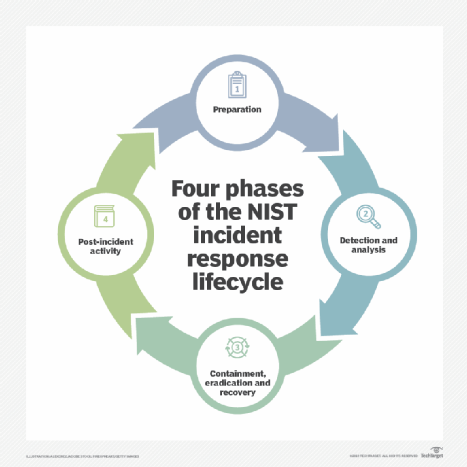
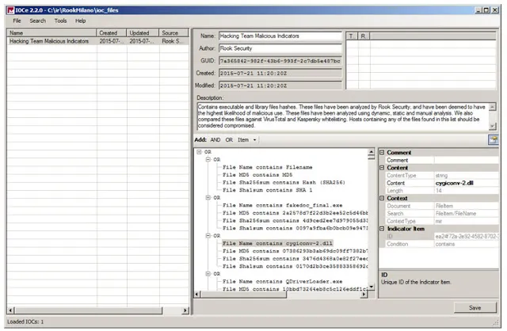
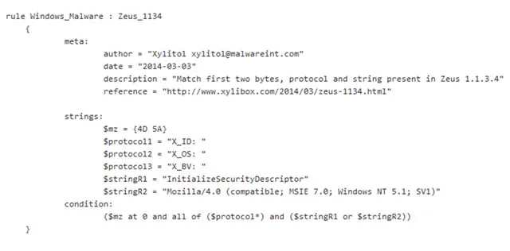
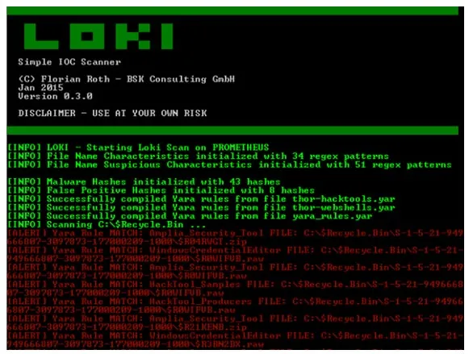

**Detección de incidentes**

#### RA2
b) Se han establecido controles, herramientas y mecanismos de monitorización, identificación, detección y alerta de incidentes

#### ÍNDICE

Indicios

Centro de Operaciones de Seguridad, SOC

IDS, IPS, SIEM

Indicadores de compromiso

#### Indicadores de compromiso

#### Indicios

Básicamente, los indicios de que nos encontramos ante un ciberincidente pueden provenir de dos tipos de fuentes: los precursores y los indicadores.

Un **precursor** es un indicio de que puede ocurrir un incidente en el futuro.

Un **indicador** es un indicio de que un incidente puede haber ocurrido o puede estar ocurriendo ahora.

#### Indicios - Precursores

Algunos ejemplos de precursores son:

Las entradas de log del servidor Web, con los resultados de un escáner de vulnerabilidades.

El anuncio de un nuevo exploit, dirigido a una atacar una vulnerabilidad que podría estar presente en los sistemas de la organización.

Amenazas explícitas provenientes de grupos o entidades concretos, anunciado ataques a organizaciones objetivo.

#### Indicios - Indicadores

Los **indicadores** son muy comunes, tales como:

el sensor de intrusión de una red emitiendo una alerta cuando ha habido un intento de desbordamiento de búfer contra un servidor de base de datos;

las alertas generadas por software antivirus,

la presencia de un nombre de archivo con caracteres inusuales;

Los **indicadores** son muy comunes, tales como:

un registro de log sobre un cambio no previsto en la configuración de un host;

los logs de una aplicación, advirtiendo de reiterados intentos fallidos de login desde un sistema externo desconocido;

la detección de un número importante de correos electrónicos rebotados con contenido sospechoso;

desviación inusual del tráfico de la red interna,

#### Centro de Operaciones de Seguridad, SOC

#### SOC - Definición

**El Centro de Operaciones de Seguridad, SOC, se refiere al equipo responsable de garantizar la seguridad de la información.**

El SOC es una plataforma que permite la _supervisión y administración de la seguridad del sistema de información_ a través de herramientas de recogida, correlación de eventos e intervención remota:

El SIEM (Security Information Event Management) es la principal herramienta del SOC ya que permite gestionar los eventos de un SI.

#### SOC - Objetivo

El objetivo de un SOC es:

Detectar, analizar y corregir incidentes de ciberseguridad utilizando soluciones tecnológicas y enfoques diferentes.

Supervisan y analizan la actividad en redes, servidores, terminales, bases de datos, aplicaciones, sitios web y otros sistemas en busca de señales débiles o comportamientos anormales que puedan indicar un incidente de seguridad o un compromiso.

Debe garantizar que los posibles incidentes de seguridad se identifiquen, analicen, defiendan, investiguen e informen adecuadamente.

#### SOC - Funcionamiento

El DOC trabaja de la siguiente forma:

Estrategia que integre los objetivos específicos de cada departamento.

Definir la infraestructura necesaria para apoyarlo: Cortafuegos, IPS/IDS, soluciones de detección de brechas, sondas y un sistema de gestión de eventos e información de seguridad (SIEM).

Debe existir tecnología de recolección y agregación de información. (flujos de datos, mediciones, entradas de paquetes, syslog, etc)

Supervisa vulnerabilidades de red y puntos finales.

#### SOC - Organización

Organizados según el grado de especialización:

nivel 1: analistas de alertas: Monitorizan alertas, evalúan y se escalan.

nivel 2: determinar si los datos/sistemas se ha visto afectados y recomiendan una respuesta.

nivel 3: profesionales altamente capacitados, se encargan de resolver incidentes y prevenir posibles incidentes.

Suelen ser perfiles multidisciplinares y altamente experimentados y especializados.

un SOC generalmente abarca múltiples aspectos de las operaciones de seguridad, mientras que los CSIRT, CERT y CIRTS se enfocan específicamente en la respuesta a incidentes.

CSIRT y CIRT son casi siempre casi equivalentes, referentes a respuesta de incidentes de seguridad informática.

CERT, aunque muchas compañías usan el término de forma genérica, ha sido una marca registrada de Carnegie Mellon University desde 1997.

El término CERT utilizado de esta manera se enfoca más ampliamente en mejorar la respuesta a incidentes como disciplina que solo en su propia organización

#### CSIRT

significa equipo de respuesta a incidentes de seguridad informática

#### CIRT

puede representar al equipo de respuesta a incidentes informáticos o, con menor frecuencia, al equipo de respuesta a incidentes de ciberseguridad

#### CERT

significa equipo de respuesta (o preparación) para emergencias informáticas

#### 

Los grupos CERT, CSIRT y CIRT pueden existir como un grupo con personal permanente o pueden reunirse en una base ad hoc en respuesta a un evento.

De cualquier manera, su enfoque son casi siempre las cuatro fases de respuesta a incidentes descritas en la «Guía de manejo de incidentes de seguridad informática» del NIST.

#### IDS, IPS, SIEM

#### 

¿Has oído hablar de sistemas IDS, IPS y SIEM?

¿Sabes qué son exactamente y por qué son tan importantes para la seguridad de la red de tu empresa?

Los tres son sistemas de protección de las comunicaciones que actúan monitorizando el tráfico que entra o sale de nuestra red pero cada uno tiene unas características que les confieren ventajas e inconvenientes.

#### IDS (Intrusion Detection System) o sistema de detección de intrusiones

Aplicación usada para **detectar accesos no autorizados a un ordenador o a una red** , es decir, son sistemas que monitorizan el tráfico entrante y lo cotejan con una base de datos actualizada de firmas de ataque conocidas.

Ante cualquier actividad sospechosa, emiten una alerta a los administradores del sistema quienes han de tomar las medidas oportunas.

Estos accesos pueden ser ataques esporádicos realizados por usuarios malintencionados o repetidos cada cierto tiempo, lanzados con herramientas automáticas.

Estos sistemas sólo **detectan** los accesos sospechosos emitiendo alertas anticipatorias de posibles intrusiones, pero **no tratan de mitigar la intrusión. Su actuación es reactiva** .

#### IPS (Intrusion Prevention System) o sistema de prevención de intrusiones

Es un software que se utiliza para proteger a los sistemas de ataques e intrusiones. **Su actuación es preventiva** .

Estos sistemas llevan a cabo un análisis en tiempo real de las conexiones y los protocolos para determinar si se está produciendo o se va a producir un incidente, identificando ataques según patrones, anomalías o comportamientos sospechosos y permitiendo el control de acceso a la red, implementando políticas que se basan en el contenido del tráfico monitorizado, es decir, **el IPS además de lanzar alarmas, puede descartar paquetes y desconectar conexiones** .

Muchos proveedores ofrecen productos mixtos, llamándolos IPS/IDS, integrándose frecuentemente con cortafuegos y UTM (en inglés Unified Threat Management o Gestión Unificada de Amenazas) que controlan el acceso en función de reglas sobre protocolos y sobre el destino u origen del tráfico.

#### SIEM (Security Information and Event Management) o sistema de gestión de eventos e información de seguridad

Para hacer la vida más fácil al personal de ciberseguridad, aparecen también los SIEM, dispositivos que se encargarán de recoger los eventos recogidos por los IDS e IPS, analizarlos y señalizar alertas que estén previamente configuradas en base a reglas que procesan los eventos recibidos, permitiendo su agregación y correlación.

Es una solución híbrida centralizada que engloba la gestión de información de seguridad (Security Information Management) y la gestión de eventos (Security Event Manager).

La tecnología SIEM proporciona un **análisis en tiempo real de las alertas** de seguridad generadas por los distintos dispositivos hardware y software de la red.

Recoge los registros de actividad (logs) de los distintos sistemas, los relaciona y detecta eventos de seguridad, es decir, actividades sospechosas o inesperadas que pueden suponer el inicio de un incidente, descartando los resultados anómalos, también conocidos como falsos positivos y generando respuestas acordes en base a los informes y evaluaciones que registra, es decir, es una herramienta en la que se centraliza la información y se integra con otras herramientas de detección de amenazas

#### Indicadores de compromiso

#### Incidente

confidencialidad

 **Incidente de seguridad: **  evento adverso que compromete o intenta comprometer:

¿Como saber si es anormal?

Analizar variables:

Tráfico de red

Alto consumo

Lentitud en rpta

Eje. prog extraños

Cambios ficheros

**Algo raro está pasando!**

#### Fuentes

La información proviene de diferentes fuentes:

revisiones manuales del sistema

notificaciones de usuarios

alertas

No hay tiempo para este tipo de análisis

Mientras existe una ventana de tiempo en la que el sistema está expuesto.

Puede tratarse de un falso positivo, y mientras se está desgastando injustificadamente el equipo de respuesta a incidentes

#### 

Como resultado de esta primera fase de análisis, se deben iniciar los procesos de contención, erradicación y recuperación asociados. No obstante, si no hay definida una fase metodológica de detección o hay fallos procedimentales, documentales y/o técnicos en el proceso, la respuesta no será efectiva y cualquier acción adicional puede ser contraproducente (destrucción no intencional de evidencia, ejecución de programas maliciosos, etc.). Igual sucederá si el incidente vuelve a ocurrir y no se ha realizado una sesión de lecciones aprendidas y mejora continua que permitan optimizar el plan de respuesta a incidentes en el futuro.

Si ponemos en contexto todos estos elementos, los tiempos de respuesta a incidentes e investigación forense se verían claramente optimizados si se contara con una herramienta automatizada que permitiera una detección y clasificación rápida con base en comportamientos analizados de incidentes (“modus operandi”) involucrando diferentes elementos ya conocidos como direcciones IP, hashes de procesos maliciosos, cookies, cambios en el registro de Windows, controladores de hardware, puertos TCP/UDP, correos electrónicos, procesos en ejecución, ficheros en el disco, etc.

#### Indicadiores de compromiso

Frente a ello, han surgido múltiples iniciativas técnicas, dentro de las cuales resaltan los ** IoC (Indicators of Compromise – Indicadores de Compromiso)** . Se trata de un modelo basado por lo general en metalenguajes que permite registrar, parametrizar, comparar, categorizar y compartir la información conocida del comportamiento de incidentes analizados previamente desde una perspectiva holística, cubriendo todas las variables clave y propiedades que pueden dar pie a una detección y clasificación efectiva, analizando exclusivamente aquellos elementos relacionados sin perder el tiempo en análisis adicionales “a ciegas” que no ofrezcan valor en las conclusiones.

#### 

Contenido

1 Modelos de implementación de IoC

2 Caso de estudio: Hacking Team

3 Uso de IoC en conjunto con otras herramientas de identificación de malware

4 Conclusión

Modelos de implementación de IoC

Desde la perspectiva de la industria han surgido diferentes modelos de implementación del concepto de IoC. A pesar que no existe un estándar de facto, a continuación se presentan algunos de los modelos más importantes que pueden ser empleados dependiendo de las necesidades de la organización:

OASIS Cyber Threat Intelligence (CTI) https://www.oasis-open.org/committees/tc_home.php?wg_abbrev=cti: Esta iniciativa está respaldada por algunos de los principales fabricantes de soluciones de seguridad y está orientada hacia la definición y estandarización de un conjunto de representaciones de información y protocolos para gestionar la necesidad de analizar, modelar y compartir datos de inteligencia contra amenazas informáticas. Está compuesto por tres subcomités: STIX (Structured Threat Information Expression – https://stixproject.github.io), TAXII (Trusted Automated Exchange of Indicator Information) y CybOX (Cyber Observable Expression – https://cybox.mitre.org).

IODEF (Incident Object Description Exchange Format) – RFC 5070 ietf.org/rfc/rfc5070.txt: En diciembre de 2007 se publicó la RFC 5070, que contiene la descripción básica del esquema XML para el registro de variables técnicas relacionadas con incidentes conocidos para ser empleados principalmente por centros de respuesta a incidentes (CSIRT), orientado hacia la automatización en el procesamiento de datos de incidentes y la gestión de un formato común para construir herramientas interoperables para la gestión de incidentes.

The OpenIoC (Open Indicators of Compromise) Framework http://www.openioc.org: OpenIoC es un esquema extensible de XML publicado bajo los términos de la licencia Apache 2, que permite describir las características técnicas que identifican una amenaza conocida, la metodología de un atacante u otra evidencia de compromiso para la detección rápida de brechas de seguridad en un sistema. Esta iniciativa surgió como parte de las estrategias de gestión de incidentes de MANDIANT (http://www.mandiant.com), quienes son reconocidos por sus análisis de casos de ciberespionaje a nivel mundial. Actualmente se encuentra en su versión 1.0 y la versión 1.1 se encuentra en formato DRAFT (https://github.com/mandiant/OpenIOC_1.1).

Caso de estudio: Hacking Team

En Julio de 2015 la compañía italiana Hacking Team (http://www.hackingteam.it/) anunció públicamente que sus sistemas informáticos fueron comprometidos, incluyendo el código fuente de sus herramientas de monitorización y explotación, empleadas por múltiples entidades gubernamentales a nivel mundial. Este software utilizaba vulnerabilidades conocidas y de día cero (“zero day”) para instalarse de forma silenciosa y sin autorización del usuario afectado en los dispositivos objetivo.

Debido a la gran cantidad de atención mediática que recibió este evento, muchos ciudadanos de los países clientes de Hacking Team querían validar si sus sistemas eran monitorizados por esta solución. Una de las alternativas más óptimas para esta revisión estuvo basada en el uso de OpenIoC a través del aplicativo MILANO (https://github.com/RookLabs/milano) provisto por la empresa Rook Security (https://www.rooksecurity.com), que aprovecha las capacidades de los indicadores de compromiso para registrar, comparar y alertar de la existencia de binarios asociados al software de Hacking Team.

Posterior al análisis del código fuente del software de Hacking Team, se identificaron y perfilaron los binarios asociados (40+) y se incluyeron sus nombres y hashes (MD5, SHA1 y SHA256) dentro de un fichero XML siguiendo la estructura de OpenIoC (hackingteam_openIOC1-1.ioc). Para analizar su estructura, se puede emplear el aplicativo MANDIANT IoC Editor (https://www.fireeye.com/services/freeware/ioc-editor.html):

Como se puede observar, el esquema XML establecido por OpenIoC permite la inclusión de múltiples características asociadas a elementos de un sistema que pueden estar afectadas por un incidente en particular. El listado exhaustivo de valores a parametrizar se puede encontrar en http://openioc.org/terms/Current.iocterms y http://schemas.mandiant.com/:

En el caso de MILANO, Rook Security creó su propio XML y desarrolló una herramienta propia para que las variables descritas en el fichero de OpenIoC fueran analizadas en el sistema y se reportaran los hallazgos para que el propio usuario tomara las acciones que considerara prudentes:

No obstante, el mismo fichero XML/IoC puede ser empleado con otras herramientas como MANDIANT IoC Finder (https://www.fireeye.com/services/freeware/ioc-finder.html) o MANDIANT RedLine (https://www.fireeye.com/services/freeware/redline.html), lo cual demuestra la portabilidad del formato, que es uno de los criterios básicos de esta iniciativa. Este mismo concepto se ha utilizado para la identificación de malware como Zeus, Stuxnet y Duqu y ha sido compartido para uso de la comunidad en el sitio de OpenIoC (http://openioc.org) u otros como Flamer (https://www.alienvault.com/open-threat-exchange/blog/flamer-indicators-of-compromise-openioc) y Red October (https://www.alienvault.com/open-threat-exchange/blog/red-october-indicators-of-compromise-and-mitigation-data), provistos por AlienVault, quienes también han integrado el concepto de IoC como base de su plataforma Open Threat Exchange (https://otx.alienvault.com/).

Otros repositorios de IoC se pueden encontrar en OpenIoCDB (https://openiocdb.com/downloads/) y OpenIoC Bucket (https://www.iocbucket.com/), así como integración con plataformas como MISP (www.misp-project.org) y MANTIS (Model-based Analysis of Threat Intelligence Sources) Framework (https://github.com/siemens/django-mantis).

Uso de IoC en conjunto con otras herramientas de identificación de malware

Debido a las características de los IoC, su funcionalidad puede ser complementada con otras herramientas orientadas a la detección de malware como YARA (http://plusvic.github.io/yara/), que permite la identificación de malware con base en la identificación de patrones de texto o binarios y el uso de expresiones booleanas para determinar su lógica:

Un ejemplo de integración entre reglas de IoC y reglas de YARA se puede encontrar en el aplicativo LOKI IOC Scanner (https://github.com/Neo23x0/Loki), que usa la definición de IoC en el uso de hash de binarios y sus nombres y ubicaciones y la lógica de YARA para la identificación de patrones:

Adicionalmente, en OpenIoC se pueden insertar firmas de YARA dentro de la propia definición del formato XML para ser usadas de forma combinada. Esta inserción se puede realizar empleando el paquete openioc_to_yara, incorporado dentro del IoC Writter de MANDIANT (https://github.com/mandiant/ioc_writer/tree/master/examples/openioc_to_yara).

Conclusión

La minimización de la ventana de exposición entre el tiempo de detección de un incidente y su respuesta es un factor clave en el proceso de respuesta a incidentes. Debido a la gran cantidad de información que se requiere para esta detección y la generación se conclusiones y/o inferencias que den paso a acciones de contención, corrección y recuperación, es necesario un procedimiento automatizado que facilite la identificación de incidentes ya analizados y permita compartir dichos hallazgos con la comunidad para una actuación global. Como respuesta a esta necesidad han surgido los IoC (Indicators of Compromise), que permiten perfilar un incidente, crear una línea base para la identificación de diferentes variables asociadas a ese incidente en particular y comparar un dispositivo potencialmente afectado contra dichos parámetros para dar una respuesta rápida y efectiva.

Loki

https://esgeeks.com/loki-ioc-escaner-respuesta-incidentes/

https://github.com/Neo23x0/Loki/releases

Reglas yara

_[https://www.cytomic.ai/es/tendencias/reglas-yara-detectar-malware/](https://www.cytomic.ai/es/tendencias/reglas-yara-detectar-malware/)_

clamAV

_[https://es.bestantiviruspro.org/review/clamav-review/](https://es.bestantiviruspro.org/review/clamav-review/)_

https://jnjsite.com/gnu-linux-el-antivirus-clamav-con-auto-escaneo/

#### Actividad

_[2.b.02 - Detección de incidentes IDS/IPS (Individual)](https://educacionadistancia.juntadeandalucia.es/centros/cadiz/mod/assign/view.php?id=444289)_ _[ (2b)](https://educacionadistancia.juntadeandalucia.es/centros/cadiz/mod/assign/view.php?id=444289)_

