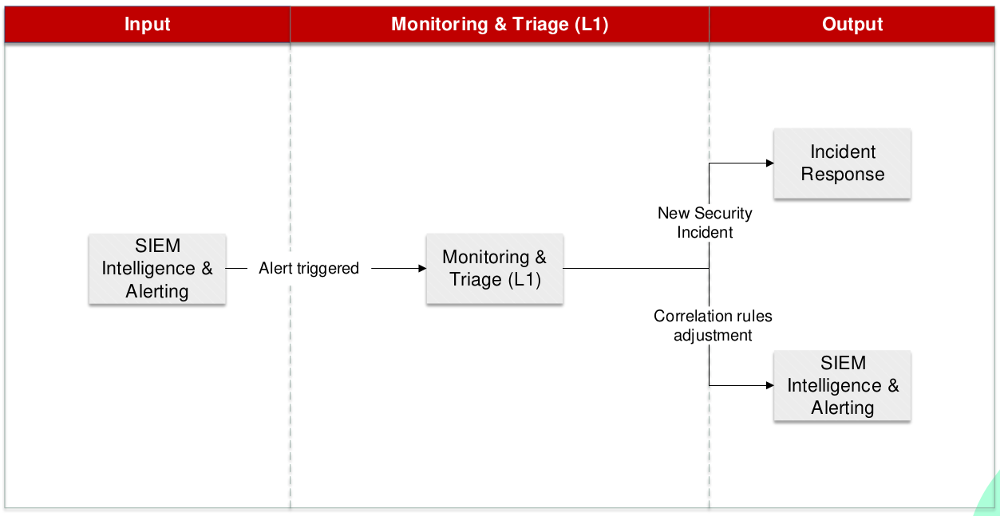
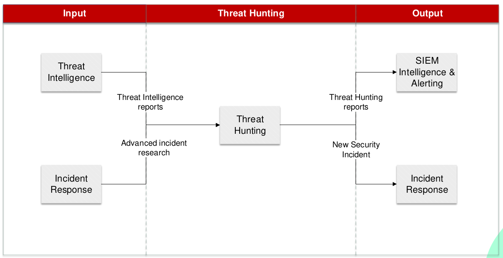

## 2.2.1 Ecosistema de un SOC: Servicios y herramientas

| Código | Descripción                                                                                                                    |
| ------- | ------------------------------------------------------------------------------------------------------------------------------- |
| RA2     | Analiza incidentes de ciberseguridad utilizando herramientas, mecanismos de detección y alertas de seguridad.                  |
| CEb     | Se han establecido controles, herramientas y mecanismos de monitorización, identificación, detección y alerta de incidentes. |

En el punto anterior hemos visto como clasificar y valorar los incidentes de ciberseguridad. En el proceso de detección y respuesta a incidentes de ciberseguridad, es fundamental contar con herramientas y servicios que nos ayuden a detectar y responder a estos incidentes. En este apartado vamos a ver las herramientas y servicios más comunes que se utilizan en un SOC para detectar y responder a incidentes de ciberseguridad.

<figure markdown>
  
  <figcaption>Representación de un SOC</figcaption>
</figure>

### 1. Introducciíon

Los Centros de Operaciones de Seguridad (SOC, por sus siglas en inglés) son el corazón operativo de la ciberseguridad en una organización. Antes de adentrarnos en sus componentes y servicios, es fundamental comprender qué es un SOC, qué objetivos persigue, cómo se diferencia de otras estructuras de seguridad y por qué es crucial en el entorno empresarial moderno.

#### 1.1. ¿Qué es un SOC?

Un SOC es un centro de operaciones centralizado compuesto por profesionales de ciberseguridad, procesos estandarizados y tecnologías avanzadas, diseñado para supervisar, detectar, responder y prevenir amenazas de seguridad.

**Analogía:** Imagina un SOC como un “centro de control aéreo” para la ciberseguridad. Así como los controladores de tráfico aéreo supervisan vuelos y responden a emergencias, los analistas del SOC vigilan el tráfico digital de una organización y reaccionan ante amenazas.

**Funciones principales:**

1. Supervisar continuamente la infraestructura tecnológica (redes, sistemas, aplicaciones), asi como la información de la organización. Estar preparados y actualizados, buscando amenazas y vulnerabilidades.
2. Detectar amenazas o actividades sospechosas.
3. Responder y mitigar incidentes de seguridad.
4. Prevenir futuros ataques mediante el aprendizaje continuo y la mejora de defensas.

#### 1.2. Objetivos principales de un SOC

El SOC tiene como objetivo proteger los activos críticos de la organización (datos, sistemas y reputación) mediante:

1. **Prevención:** Implementar controles y configuraciones para evitar ataques.

   *Ejemplo:* Configurar firewalls para bloquear conexiones no autorizadas. Configurar IDS/IPS para detectar y bloquear ataques.
2. **Detección:** Detectar actividades sospechosas que puedan ser indicativas de un incidente de seguridad.

   *Ejemplo:* Alertas del SIEM que detectan intentos de acceso inusuales, según reglas de detección configuradas.
3. **Respuesta:** Actuar rápidamente para minimizar el impacto de los incidentes.

   *Ejemplo:* Aislar un servidor comprometido para evitar que un malware se propague y eliminar la amenaza.
4. **Recuperación:** Restaurar los sistemas afectados y garantizar que vuelvan a operar normalmente.

   *Ejemplo:* Restaurar datos desde una copia de seguridad tras un ataque de ransomware.

#### 1.3. Diferencias entre SOC, CERT, CIRT y CSIRT

En el mundo de la ciberseguridad, es común encontrar términos como SOC, CERT, CIRT y CSIRT. Aunque están relacionados, tienen enfoques y funciones específicas.

##### 1.3.1. Definición de términos

1. **SOC (Security Operations Center):** Centro de operaciones de seguridad, que se encarga de la **supervisión continua, detección, respuesta y prevención** de amenazas. Su enfoque es amplio y abarca todas las operaciones de seguridad. El SOC es el encargado de la seguridad de la organización y abarca todas las operaciones de seguridad.
2. **CERT (Computer Emergency Response Team):** Equipo especializado en preparar y responder a **emergencias de ciberseguridad**, como ataques DDoS o ransomware. Suele actuar de manera reactiva ante incidentes.
3. **CIRT (Computer Incident Response Team):** Similar al CERT, pero centrado en la gestión de **incidentes de seguridad específicos**, con un enfoque en la contención y erradicación.
4. **CSIRT (Computer Security Incident Response Team):** Variante más amplia del CIRT, que incluye una visión más estratégica y alineada con las políticas de seguridad.

##### 1.3.2. Relación y diferencias clave

**Relación:** Un SOC generalmente abarca múltiples aspectos de las operaciones de seguridad, mientras que los CSIRT, CERT y CIRTS se enfocan específicamente en la respuesta a incidentes. El SOC normalmente incluirá además las funciones de CERT/CIRT/CSIRT como parte de sus operaciones.

Los términos CERT, CIRT y CSIRT suelen utilizarse como sinónimos, aunque pueden tener diferencias sutiles en su alcance y enfoque. En general, estos equipos **se activan ante incidentes críticos** y trabajan para contener, investigar y mitigar los daños.

CSIRT y CIRT son casi siempre casi equivalentes, referentes a respuesta de incidentes de seguridad informática. Respecto al término CERT, aunque muchas compañías lo usan de forma genérica, ha sido una marca registrada de *Carnegie Mellon University* desde 1997, y se enfoca más ampliamente en mejorar la respuesta a incidentes.

**Diferencias:**

* **SOC:** Supervisión continua y gestión integral de las operaciones de seguridad.
* **CERT/CIRT/CSIRT:** Actúan principalmente ante incidentes de ciberseguridad, para contener, eliminar y recuperarse de los mismos.

*Ejemplo:*

* A través de los servicios y herramientas que hay implementadas en el SOC, se detecta un comportamiento sospechoso y genera una alerta.
* El equipo de respuesta a incidentes investiga el incidente y coordina la respuesta: Contener el ataque, eliminar la amenaza.
* Tras contener el ataque, el equipo de respuesta a incidentes continua con la recuperación de los sistemas afectados.

**Analogía:** El SOC es como un hospital completo que incluye áreas de prevención, diagnóstico y tratamiento, mientras que un CERT/CIRT/CSIRT sería como la unidad de emergencias, que se activa solo cuando ocurre un evento crítico.

#### 1.4. Importancia de los SOC en la ciberseguridad empresarial

En un mundo cada vez más digitalizado, las organizaciones dependen de los SOC para protegerse contra un panorama de amenazas en constante evolución.

*Ejemplo:* Imagina una tienda en línea que es víctima de un ataque de ransomware (secuestro de datos). Si no tiene un SOC que monitoree las actividades sospechosas y responda rápidamente, los atacantes podrían paralizar sus operaciones y exigir un rescate para liberar los datos.

##### **1.4.1. Amenazas crecientes**

Las organizaciones enfrentan un aumento en la frecuencia, sofisticación y diversidad de los ciberataques.

*Ejemplo:* En 2023, los ataques de ransomware afectaron a miles de empresas, causando interrupciones y pérdidas millonarias. Un SOC puede ayudar a detectar y bloquear estos ataques antes de que causen daños irreparables.

##### 1.4.2. Beneficios de contar con un SOC

1. **Protección proactiva:** Los SOC no solo reaccionan a amenazas, sino que también trabajan para prevenirlas.
   *Ejemplo:* Un SOC implementa reglas en el SIEM para bloquear intentos de fuerza bruta antes de que comprometan un sistema.
2. **Respuesta rápida:** Los SOC reducen el tiempo de respuesta a incidentes críticos.
   *Ejemplo:* Detectar y contener un ataque en minutos puede evitar una filtración masiva de datos.
3. **Cumplimiento normativo:** Ayudan a las organizaciones a cumplir con regulaciones como GDPR, ISO 27001 o NIST CSF.
   *Ejemplo:* Generar reportes de incidentes detallados para auditorías regulatorias.
4. **Confianza del cliente:** Un SOC demuestra el compromiso de la organización con la seguridad, fortaleciendo la confianza de clientes y socios.
   *Ejemplo:* Mostrar a los clientes que sus datos están protegidos y que la empresa está preparada para enfrentar amenazas.

##### 1.4.3. Relevancia estratégica

En muchas organizaciones, el SOC es considerado un habilitador estratégico, ya que protege la continuidad del negocio y permite a las empresas operar en entornos digitales de forma segura.

*Ejemplo:* Un SOC ayuda a una empresa de servicios financieros a detectar y bloquear un ataque ransomware, evitando la pérdida de datos confidenciales y disponibilidad de servicios. De esta forma, el SOC contribuye a la reputación y sostenibilidad del negocio, de otra manera el impacto podría haber sido catastrófico, no disponibilidad de servicios, pérdida de confianza de los clientes, sanciones regulatorias, etc.

El SOC es mucho más que un equipo técnico; es una estructura estratégica que protege los activos más valiosos de una organización. Al comprender su definición, objetivos y diferencias con estructuras relacionadas como CERT o CSIRT, se puede apreciar su papel crucial en el ecosistema de ciberseguridad actual.

### 2. Componentes de un SOC

Los Centros de Operaciones de Seguridad están compuestos por varios elementos clave que trabajan en conjunto para proteger la infraestructura y los datos de una organización. Estos elementos incluyen personas, procesos, tecnologías y servicios. Cada uno de ellos desempeña un papel único y esencial dentro del funcionamiento de un SOC.

Para entender cómo se estructuran y colaboran estos componentes, abordaremos cada uno de ellos por separado, con ejemplos y descripciones detalladas.

#### 2.1. Personas

Las personas son el núcleo de cualquier SOC. Aunque las tecnologías y los procesos son fundamentales, es el equipo humano quien toma decisiones críticas y actúa frente a los incidentes de seguridad.

A continuación, exploraremos los roles clave en un SOC, la importancia de la formación y desarrollo continuo, y cómo cada miembro del equipo contribuye a la seguridad de la organización.

##### 2.1.1. Roles en un SOC

Un SOC incluye una variedad de roles especializados, diseñados para cubrir distintos aspectos de la seguridad cibernética:

1. **Gerente del SOC:** Supervisa las operaciones y coordina la respuesta a incidentes importantes.
   *Ejemplo:* Coordinar la respuesta a un ataque de ransomware que afecta a múltiples sistemas.
2. **Analistas SOC (Niveles 1, 2, 3):**
   **Nivel 1:** Monitorea eventos y alerta sobre actividades sospechosas.
   *Ejemplo:* Revisión de un intento de inicio de sesión desde ubicaciones inusuales.
   **Nivel 2:** Investiga las alertas generadas por el Nivel 1 para determinar si son incidentes reales.
   *Ejemplo:* Analizar patrones de tráfico para confirmar si un ataque está en curso.
   **Nivel 3:** Maneja incidentes complejos y realiza análisis forenses.
   *Ejemplo:* Determinar cómo un atacante accedió a un sistema y prevenir futuros ataques.
3. **Especialistas en Threat Hunters:** Buscan proactivamente amenazas avanzadas que pueden haber evadido los controles de seguridad de nuestra organización.
   *Ejemplo:* Buscar señales de un malware recién descubierto que afecta a empresas similares.
4. **Especialistas en Threat Intelligence:** Identifican nuevas amenazas que han surgido en el panorama de ciberseguridad y comparten información relevante con el equipo del SOC, por ejemplo actualizando reglas de detección del SIEM.
   *Ejemplo:* Investigar un aumento de ataques phishing en la región y compartir indicadores relevantes, como direcciones IP maliciosas, emails o URLs.
5. **Ingenieros de Seguridad:** Configuran y mantienen las herramientas tecnológicas del SOC.
   *Ejemplo:* Configurar reglas de detección en el SIEM para alertar sobre actividades sospechosas. Estas reglas pueden ser actualizadas por los realizados por los especialistas en Threat Intelligence, por las lecciones aprendidas en incidentes previos, por los trabajos realizados por los Threat Hunters, etc.

##### 2.1.2. Formación y desarrollo

La capacitación continua es crucial en un entorno de ciberseguridad, donde las amenazas evolucionan constantemente.

*Ejemplo:* Los analistas deben aprender regularmente sobre nuevas técnicas de ataque, como el ransomware basado en IA, para adaptar las defensas del SOC.

#### 2.2. Procesos

Para que un SOC funcione eficazmente, debe contar con procesos bien definidos que guíen la gestión de amenazas e incidentes.

Los procesos son los pasos estructurados y repetibles que un SOC sigue para manejar tareas clave como la detección de amenazas, la gestión de incidentes, la recuperación y el análisis post-incidente. Estos procesos están diseñados para:

* **Estandarizar operaciones:** Asegurarse de que cada analista sepa exactamente qué hacer en cada situación.
* **Reducir el tiempo de respuesta:** Minimizar el impacto de los incidentes mediante una actuación rápida y efectiva.
* **Facilitar la comunicación:** Proveer un marco común para que todos los miembros del SOC trabajen en conjunto.
* **Promover la mejora continua:** Analizar cada incidente para aprender y mejorar los procesos.

*Ejemplo:* Supongamos que el SOC recibe una alerta sobre tráfico sospechoso en un servidor web. El proceso estándar indicaría los pasos sobre como verificar la fuente del tráfico, determinar si es legítimo o malicioso, y tomar medidas correctivas.

##### 2.2.1. Procesos en un SOC

Los procesos son fundamentales en un Centro de Operaciones de Seguridad (SOC). Representan la base sobre la que las personas y las tecnologías trabajan en conjunto para proteger a una organización frente a amenazas cibernéticas. Un proceso bien definido no solo asegura eficiencia, sino que también garantiza consistencia y mejora continua en la respuesta a incidentes.

- **Monitoreo continuo:** Supervisión 24/7 de eventos y alertas.

  *Ejemplo:* Utilizar un SIEM para correlacionar eventos de seguridad y detectar patrones sospechosos.
- **Generación de reportes y métricas:** Evaluar la efectividad del SOC y cumplir con requisitos regulatorios.

  *Ejemplo:* Producir un informe mensual que muestre el número de incidentes detectados y mitigados.
- **Gestión del conocimiento:** Documentar y compartir lecciones aprendidas de incidentes pasados.

  *Ejemplo:* Crear una base de datos de incidentes que incluya detalles sobre cómo se detectaron y mitigaron.

##### 2.2.2. Importancia de la estandarización de procesos

La estandarización asegura que todos los analistas trabajen de manera consistente y que el SOC opere según las mejores prácticas de la industria.

**Los marcos más utilizados incluyen:**

1. **NIST Cybersecurity Framework (CSF):** Define cinco funciones clave: Identificar, Proteger, Detectar, Responder y Recuperar.
2. **ISO/IEC 27001:** Proporciona estándares para la gestión de la seguridad de la información.
3. **ITIL (Information Technology Infrastructure Library):** Guía sobre la gestión de servicios de TI.

*Ejemplo:* Implementar el marco NIST permite al SOC estructurar sus operaciones desde la identificación de activos críticos hasta la recuperación post-incidente.

Los procesos en un SOC son el motor que asegura que las amenazas sean gestionadas de manera eficiente y efectiva. Al estandarizar operaciones y apoyarse en marcos reconocidos, el SOC puede garantizar una respuesta consistente, reducir los tiempos de reacción y mejorar continuamente sus defensas.

#### 2.3. Tecnologías

Las tecnologías son un pilar esencial en el funcionamiento de un SOC, ya que proporcionan las herramientas necesarias para monitorear, detectar y responder a amenazas de seguridad de manera eficiente. Estas tecnologías permiten automatizar tareas repetitivas, identificar patrones de ataque y facilitar la colaboración entre los equipos del SOC.

En este apartado exploraremos las tecnologías clave utilizadas en un SOC, su función específica y cómo se integran para formar un ecosistema de seguridad robusto.

##### 2.3.1. Herramientas principales en un SOC

El SOC utiliza una combinación de herramientas que se complementan para proporcionar capacidades de monitoreo, detección, análisis y respuesta. Estas herramientas se agrupan según su función:

###### 2.3.1.1. SIEM (Security Information and Event Management)

El SIEM es el corazón tecnológico del SOC. Su función principal es recopilar y correlacionar datos de múltiples fuentes para identificar eventos de seguridad relevantes.

**Funciones clave:**

1. **Recolección de datos:** Agrupa registros (logs) de sistemas, aplicaciones, firewalls, routers y otros dispositivos.
2. **Correlación:** Analiza patrones en los datos para identificar posibles amenazas.
3. **Generación de alertas:** Notifica al equipo cuando detecta un comportamiento sospechoso.

*Ejemplo:* Si detecta múltiples intentos de acceso fallidos seguidos por un inicio de sesión exitoso desde una ubicación inusual, el SIEM genera una alerta para investigar un posible ataque de fuerza bruta.

**Beneficio adicional:** Los sistemas SIEM modernos incluyen capacidades de inteligencia artificial (IA) para mejorar la precisión de las alertas y reducir los falsos positivos.

**Ejemplo de herramientas SIEM:** Splunk, IBM QRadar, ArcSight (Micro Focus), LogRhythm, Sumo Logic, SolarWinds Security Event Manager, Elastic Security, Microsoft Sentinel, Graylog, ManageEngine Log360.

###### 2.3.1.2. SOAR (Security Orchestration, Automation, and Response)

El SOAR automatiza tareas de respuesta y orquesta las interacciones entre herramientas del SOC.

**Funciones clave:**

1. **Automatización:** Responde automáticamente a amenazas comunes.

 *Ejemplo:* Si un SIEM detecta malware, el SOAR puede ejecutar un script que aísle automáticamente la máquina afectada.   
2. **Orquestación:** Integra múltiples herramientas para que trabajen en conjunto.

   *Ejemplo:* Crear un flujo de trabajo que inicie un análisis forense cuando se detecta un incidente crítico.
3. **Gestión de casos:** Documenta incidentes, asigna tareas y realiza seguimientos.

   *Ejemplo:* Crear un ticket para que un analista investigue un ataque phishing y asignar tareas para mitigar la amenaza.

**Beneficio adicional:** Permite a los analistas centrarse en incidentes complejos, mientras automatiza las tareas repetitivas.

**Ejemplo de herramientas SOAR:** Palo Alto Networks Cortex XSOAR, IBM Resilient, Splunk Phantom, Siemplify, Swimlane, DFLabs IncMan, CyberSponse.

###### 2.3.1.3. Herramientas de Threat Intelligence

Estas herramientas recopilan información sobre amenazas emergentes y la comparten con el SOC. Identifican patrones de ataque, IoCs y TTPs utilizados por actores maliciosos.

**Funciones clave:**

1. **Recopilación de IoCs (Indicadores de Compromiso):** Direcciones IP maliciosas, URLs sospechosas, hashes de archivos.

   *Ejemplo:* Identificar una dirección IP utilizada por un grupo de hackers para lanzar ataques.
2. **Análisis de TTPs (Tácticas, Técnicas y Procedimientos):** Métodos comunes utilizados por actores maliciosos.

   *Ejemplo:* Identificar que un ransomware específico utiliza un puerto poco común para comunicarse con su servidor de control y comando, y bloquear ese tráfico.

**Beneficio adicional:** Ayuda al SOC a anticiparse a nuevas amenazas antes de que impacten a la organización.

**Ejemplo de herramientas de Threat Intelligence:** Recorded Future, ThreatConnect, Anomali, FireEye iSIGHT, IBM X-Force Exchange, AlienVault OTX, VirusTotal, OpenCTI (Open Cyber Threat Intelligence)

###### 2.3.1.4. Herramientas de monitoreo de red y endpoints

Estas herramientas supervisan el tráfico de red y las actividades en dispositivos finales para detectar amenazas. Detectan comportamientos anómalos y responden a incidentes en tiempo real.

**Tipo de herramientas:**

1. **EDR (Endpoint Detection and Response):** Se enfoca en la seguridad de los dispositivos finales, como computadoras y servidores para detectar y responder a amenazas.

   *Ejemplo:* Identificar un archivo sospechoso descargado en un portátil y bloquear su ejecución.
2. **NDR (Network Detection and Response):** Se enfoca en la seguridad de la red, monitorea el tráfico de red para identificar comportamientos anómalos.

   *Ejemplo:* Detectar una transferencia de datos inusualmente grande a un servidor externo.

**Beneficio adicional:** Proporcionan visibilidad en tiempo real de las actividades en la red y los dispositivos finales, enviando alertas cuando se detectan amenazas potenciales. Suministran logs y datos de tráfico para análisis forense.

**Ejemplo de herramientas EDR:** CrowdStrike Falcon, Carbon Black, SentinelOne, Cylance, McAfee ENS, Microsoft Defender for Endpoint.

###### 2.3.1.5. Herramientas IDS/IPS

Los sistemas de detección y prevención de intrusiones (IDS/IPS) monitorean y bloquean actividades maliciosas en la red.

**Funciones clave:**

1. **Detección:** Identificar intentos de intrusión o comportamientos sospechosos.

   *Ejemplo:* Un IDS alerta sobre un escaneo de puertos en un servidor.
2. **Prevención:** Bloquear tráfico malicioso antes de que cause daño.

   *Ejemplo:* Un IPS detecta un escaneo de puertos inusual y bloquea la IP del atacante.

**Beneficio adicional:** Protege la red contra ataques conocidos y desconocidos.

**Ejemplo de herramientas IDS/IPS:** Snort, Suricata, Cisco Firepower, Palo Alto Networks, Fortinet, Check Point.

###### 2.3.1.6. Sistemas de ticketing

Los sistemas de ticketing gestionan y documentan los incidentes dentro del SOC. Permiten asignar tareas, hacer seguimiento de la resolución y documentar las acciones tomadas.

**Funciones clave:**

1. **Registro de incidentes:** Cada incidente se documenta con detalles como la fecha, la gravedad y las acciones tomadas.

   *Ejemplo:* Crear un ticket para un ataque de phishing detectado por el equipo de Threat Intelligence, cualificado por un analista y asignado a un especialista en respuesta a incidentes.
2. **Colaboración:** Permite asignar tareas a diferentes miembros del equipo.

   *Ejemplo:* Cuando se detecta un ataque phishing, se genera un ticket para que un analista investigue los correos afectados.

**Beneficio adicional:** Facilita la comunicación y la colaboración entre los miembros del equipo, asegurando que los incidentes se gestionen de manera eficiente.

**Ejemplo de herramientas de ticketing:** TheHive, IBM Resilient, Splunk SOAR (anteriormente Phantom), Cortex XSOAR (de Palo Alto Networks), DFLabs IncMan SOAR, Siemplify, LogRhythm SOAR, ServiceNow Security Operations, FortiSOAR (Fortinet), MISP (Malware Information Sharing Platform), Jira, ServiceNow, Freshdesk, OTRS.

###### 2.3.1.7. Tecnologías de análisis forense

Estas herramientas permiten a los equipos analizar incidentes después de que han ocurrido para comprender cómo sucedieron.

**Funciones clave:**

1. Recuperar, salvaguardar las evidencias digitales de los sistemas afectados.

   *Ejemplo:* Extraer registros, logs y archivos de un servidor comprometido y dejar una copia forense para análisis.
2. Analizar las evidencias y reconstruir la secuencia de eventos que llevaron al incidente.

   *Ejemplo:* Analizar los logs de un servidor comprometido para determinar si el atacante usó una vulnerabilidad de software específica.

**Beneficio adicional:** Proporciona información valiosa para mejorar las defensas y prevenir futuros incidentes.

**Ejemplo de herramientas de análisis forense:** EnCase Forensic, FTK (Forensic Toolkit by AccessData), Autopsy, Volatility, SIFT (SANS Investigative Forensic Toolkit), OSForensics, X-Ways Forensics, Sleuth Kit, Cellebrite, Magnet AXIOM, BlackLight, Oxygen Forensic Detective, Axiom Cyber, Cyber Triage, etc.

##### 2.3.2. Integración de tecnologías

La verdadera fuerza de un SOC reside en cómo se integran estas herramientas para trabajar en conjunto. Aquí hay algunas consideraciones importantes para la integración:

- **Centralización:** Un SIEM actúa como punto central para recopilar datos de todas las herramientas.
- **Automatización:** SOAR conecta herramientas como el SIEM, EDR y ticketing para agilizar la respuesta.
- **Interoperabilidad:** Las herramientas deben ser compatibles entre sí para maximizar su efectividad.

**Ejemplo de integración:**

1. En el SIEM se recopilan registros de eventos de sistemas y aplicaciones desde múltiples fuentes. Los tipo de fuentes son variadas, desde logs de servidores, firewalls, IDS/IPS, EDR/NDR, hasta logs de aplicaciones y endpoints, etc.
2. El SIEM detecta una actividad sospechosa en un servidor y genera una alerta.
3. El SOAR ejecuta un playbook automatizado que aísla el servidor y genera un ticket.
4. Un analista revisa el ticket, realiza un análisis forense en el servidor y actualiza las reglas del SIEM para detectar actividades similares en el futuro.

##### 2.3.3. Retos en el uso de tecnologías

Aunque las tecnologías son fundamentales, presentan desafíos:

1. **Sobrecarga de alertas:** Un SIEM mal configurado puede generar demasiadas alertas, causando fatiga en los analistas.

   *Solución:* Afinar las reglas de detección y usar inteligencia artificial para priorizar alertas.
2. **Costo:** Las herramientas avanzadas pueden ser costosas de implementar y mantener.

   *Solución:* Evaluar herramientas de código abierto o servicios en la nube.
3. **Falta de habilidades:** Requieren personal capacitado para su configuración y uso.

   *Solución:* Capacitar continuamente al equipo del SOC.

Las tecnologías son el esqueleto que soporta las operaciones de un SOC. Desde herramientas de monitoreo como el SIEM hasta sistemas de automatización como el SOAR, cada tecnología juega un papel crítico en la detección y respuesta a amenazas. Sin embargo, su efectividad depende de una implementación adecuada, una integración robusta y una configuración que equilibre precisión y eficiencia.

#### 2.4. Servicios

Los servicios que ofrece un Centro de Operaciones de Seguridad (SOC) son el resultado del trabajo conjunto de sus personas, procesos y tecnologías. Cada servicio aborda aspectos específicos de la ciberseguridad, desde la identificación temprana de amenazas hasta la recuperación posterior a un incidente. Estos servicios permiten a una organización no solo reaccionar a los incidentes, sino también anticiparse a ellos y aprender de cada evento para fortalecer sus defensas.

### **2.4.1. Servicios principales: Flujo detallado de funcionamiento**

El funcionamiento del SOC se basa en la interacción entre sus servicios principales, que trabajan en conjunto para proteger la infraestructura de la organización. Este flujo describe cómo cada servicio opera de manera independiente y cómo se conectan para formar un ecosistema cohesivo.

#### 2.4.1.1. Threat Intelligence

**Threat Intelligence** se encarga de recopilar y analizar información sobre amenazas externas. Proporciona indicadores de compromiso (IoCs) y tácticas, técnicas y procedimientos (TTPs) que guían la detección y respuesta en el SOC.

* **Funciones principales:**

  * Identificar tendencias y amenazas emergentes.
  * Proveer información que alimente las reglas del SIEM y las hipótesis de Threat Hunting.

**Relación con otros servicios:**

1. Proporciona IoCs y TTPs al servicio de **SIEM Intelligence & Alerting** para configurar reglas de detección.
2. Entrega IoCs, TTPs, Reportes y tendencias de ataque al equipo de **Threat Hunting** para guiar investigaciones proactivas.

*Ejemplo:* Threat Intelligence detecta un ransomware en aumento y actualiza las reglas del SIEM con las direcciones IP utilizadas por los atacantes.

#### 2.4.1.2. SIEM Intelligence & Alerting

**SIEM Intelligence & Alerting** utiliza los datos proporcionados por Threat Intelligence y registros internos para detectar patrones sospechosos en tiempo real. Los registros se obtienen a través de la centralización de las auditorías de los sistemas de la infraestructura tecnológica, y eventos provenientes de diferentes herramientas de seguridad. Para realizar su función, se apoya en la herramienta SIEM, que dispone de capacidades para la creación las reglas predefinidas y correlación de eventos (casos de uso) de múltiples fuentes que propician la detección de amenazas y posterior generación automática de alertas.

* **Funciones principales:**

  * Recopilar y correlacionar eventos de múltiples fuentes (firewalls, endpoints, servidores).
  * Generar alertas para actividades que coincidan con patrones sospechosos.

**Relación con otros servicios:**

1. Recibe IoCs y TTPs de **Threat Intelligence** y Ajustes de los casos de uso desde **Incident Response**, para mejorar las reglas de detección.
2. Proporciona alertas al servicio de **Monitoring & Triage** para su evaluación, y proporciona ajustes de IoCs y TTPs, basados en hallazgos, a **Threat Intelligence**.

*Ejemplo:* El SIEM detecta múltiples intentos de acceso fallidos desde una IP desconocida y genera una alerta.

#### 2.4.1.3. Monitoring & Triage

**Monitoring & Triage** actúa como el primer nivel de análisis, revisando las alertas generadas por el SIEM para determinar si representan incidentes reales o falsos positivos. Este servicio asegura que solo las amenazas verificadas sean escaladas, apoyados en playbooks, que ayudan a priorizar y clasificar los incidentes. Equivale a nivel 1, y suele requerir disponibilidad 24 horas y 7 días a la semana. Se basa en herramientas de ticketing para documentar y gestionar los incidentes, y en el SOAR para automatizar tareas.

**Funciones principales:**

* Validar alertas del SIEM y priorizarlas según su criticidad.
* Escalar incidentes confirmados al servicio de **Incident Response**.

**Relación con otros servicios:**

1. Recibe alertas de **SIEM Intelligence & Alerting**.
2. Escala incidentes confirmados al equipo de **Incident Response**, y envia ajustes de los casos de usos al **SIEM Intelligence & Alerting**.

*Ejemplo:* Monitoring & Triage recibe una alerta de intentos de acceso desde una IP sospechosa, confirma que es un ataque real y lo escala para su contención al segundo nivel, Incident Response.

#### 2.4.1.4. Incident Response

**Incident Response** gestiona incidentes confirmados para contener y mitigar su impacto. Esto incluye acciones como aislar sistemas comprometidos, bloquear direcciones IP maliciosas y coordinar la recuperación. Suele denominarse nivel 2 y nivel 3 y utilizan playbooks para la respuesta a incidentes. Se basan en la herramienta de ticketing para documentar y gestionar los incidentes, y en el SOAR para automatizar tareas.

**Funciones principales:**

* Contener amenazas activas.
* Erradicar la amenaza y restaurar operaciones normales.

**Relación con otros servicios:**

1. Recibe incidentes confirmados de **Monitoring & Triage**, nuevos incidentes de seguridad, con sus IoCs y TTPs de **Threat Hunting** y reportes de **Forensics** sobre incidentes previos.
2. Proporciona datos iniciales para el análisis de **Forensics**, y ajustes de casos de usos, como IoCs y TTPs, a **SIEM Intelligence & Alerting**.

*Ejemplo:* Incident Response aísla un servidor comprometido y coordina la eliminación del malware detectado.

#### 2.4.1.5. Forensics

**Forensics** investiga los incidentes para entender cómo ocurrieron, su impacto y cómo prevenir futuros ataques. Este servicio es esencial para fortalecer las defensas de la organización.

**Funciones principales:**

* Recolectar, salvaguardar y analizar evidencias digitales.
* Producir reportes detallados sobre incidentes ocurridos.

**Relación con otros servicios:**

1. Recibe datos de **Incident Response** para analizar la causa del incidente.
2. Retroalimenta a **Incident Response** con hallazgos para mejorar la respuesta a incidentes.

*Ejemplo:* Forensics descubre que el atacante explotó una vulnerabilidad en un servidor web y recomienda parches de seguridad.

#### **2.4.1.6. Threat Hunting**

**Threat Hunting** busca de manera proactiva amenazas avanzadas que no han sido detectadas por las herramientas automáticas del SOC.

* **Funciones principales:**

  * Formular hipótesis basadas en datos de Threat Intelligence.
  * Investigar proactivamente e identificar actividad sospechosa/amenazas en la red y endpoints.

**Relación con otros servicios:**

1. Utiliza IoCs, TTPs, Reportes y tendencias de ataque provenientes de **Threat Intelligence** para guiar sus búsquedas.
2. Proporciona hallazgos sobre nuevos incidentes a **Incident Response** y reportes y recomendaciones **SIEM Intelligence & Alerting** para mejorar reglas de detección.

*Ejemplo:* Threat Hunting detecta un archivo malicioso que pasó inadvertido por el SIEM, confirmando una amenaza activa en un servidor.

#### **2.4.1.7. Purple Team**

**Purple Team** evalúa la efectividad del SOC mediante simulaciones de ataques y pruebas de las defensas existentes. Este servicio conecta las capacidades del Blue Team (defensivo) y el Red Team (ofensivo).

**Funciones principales:**

* Simular ataques controlados para probar las defensas del SOC.
* Identificar áreas de mejora en los flujos de detección y respuesta.

**Relación con otros servicios:**

1. Utiliza datos de **Forensics** y **Threat Hunting** para diseñar escenarios de ataque.
2. Retroalimenta a todos los servicios con mejoras basadas en los resultados de las simulaciones.

*Ejemplo:* Purple Team simula un ataque de phishing avanzado y detecta que Monitoring & Triage necesita reducir el tiempo de clasificación de alertas críticas.

##### 2.4.2. Interacción entre servicios

Como hemos visto, los servicios de un SOC trabajan en conjunto para proteger a la organización frente a amenazas cibernéticas. Cada servicio cumple un papel único, pero su valor real radica en la interacción constante entre ellos para garantizar una protección integral. Por ejemplo, un Flujo básico de información en el SOC:

1. **Threat Intelligence → SIEM Intelligence & Alerting:** Proporciona IoCs y TTPs para configurar reglas de detección.
2. **SIEM Intelligence & Alerting → Monitoring & Triage:** Genera alertas que son revisadas y priorizadas.
3. **Monitoring & Triage → Incident Response:** Escala incidentes confirmados para contención y mitigación.
4. **Incident Response → Forensics:** Proporciona datos iniciales para el análisis post-incidente.
5. **Forensics → Threat Intelligence & SIEM Intelligence & Alerting:** Retroalimenta con hallazgos para mejorar defensas.
6. **Threat Intelligence → Threat Hunting:** Ofrece hipótesis y guías de búsqueda.
7. **Purple Team → Todos los servicios:** Evalúa su efectividad y retroalimenta con mejoras continuas.

Este flujo asegura que cada servicio funcione de manera independiente, pero interconectada, maximizando la eficacia del SOC en su misión de proteger la organización frente a amenazas cibernéticas.

##### 2.4.3. Retos en la prestación de servicios

1. **Falta de integración:** Si las herramientas y procesos no están alineados, los servicios pueden no ser efectivos.
   *Solución:* Usar plataformas que centralicen la gestión y faciliten la colaboración.
2. **Sobrecarga de alertas:** Un exceso de alertas puede abrumar a los equipos de Monitoring & Triage.
   *Solución:* Afinar las reglas del SIEM y priorizar alertas críticas.
3. **Costos:** Los servicios avanzados como Threat Hunting y Purple Team pueden requerir inversiones significativas.
   *Solución:* Comenzar con servicios esenciales e ir añadiendo capacidades conforme crece la madurez del SOC.

Los servicios de un SOC son necesarios para gestionar la ciberseguridad de manera proactiva y reactiva. Cada servicio cumple un papel único, pero su valor real radica en cómo interactúan para formar una defensa cohesiva contra amenazas. Un SOC bien diseñado no solo responde a incidentes, sino que también aprende y mejora continuamente para anticiparse a los ataques futuros.

Un SOC eficaz requiere una integración armoniosa entre personas capacitadas, procesos definidos, tecnologías avanzadas y servicios bien implementados. Estos componentes trabajan juntos para proteger a las organizaciones frente a amenazas cibernéticas modernas.

### 3. Diseño y estructura de un SOC

El diseño y la estructura de un Centro de Operaciones de Seguridad (SOC) son factores determinantes para su éxito. Un SOC bien diseñado no solo debe cumplir con las necesidades específicas de la organización, sino también adaptarse a su tamaño, presupuesto y objetivos estratégicos. En este apartado, profundizaremos en las decisiones clave que afectan la organización de un SOC y las fases necesarias para su implementación.

#### 3.1. Organización interna vs. SOC tercerizado

Cuando una organización decide establecer un SOC, debe considerar si será una estructura interna o si se contratarán los servicios de un SOC gestionado (MSSP, Managed Security Service Provider). Cada opción tiene ventajas y desafíos que exploraremos a continuación.

##### 3.1.1. Organización interna

Un SOC interno es construido, administrado y operado por la propia organización.

**Ventajas:**

1. **Control total:** La organización tiene control directo sobre las operaciones del SOC y los datos que maneja.
2. **Personalización:** El SOC puede ser adaptado específicamente a las necesidades y riesgos únicos de la organización.
3. **Confidencialidad:** Los datos sensibles permanecen dentro de la organización.

   *Ejemplo:* Una empresa de tecnología con requisitos estrictos de confidencialidad establece un SOC interno para proteger su propiedad intelectual, datos de clientes y secretos comerciales.

**Desafíos:**

1. **Costo:** Implementar y mantener un SOC interno requiere una inversión significativa en personal, tecnología y capacitación.
2. **Tiempo:** Configurar un SOC interno desde cero puede llevar meses o incluso años.

##### 3.1.2. SOC tercerizado (MSSP)

Un SOC tercerizado es operado por un proveedor externo que ofrece servicios de seguridad gestionados.

**Ventajas:**

1. **Reducción de costos:** El MSSP permite a las organizaciones acceder a servicios avanzados sin incurrir en altos costos iniciales.
2. **Expertise especializado:** Los MSSP cuentan con equipos altamente capacitados y tecnologías avanzadas.
3. **Rapidez:** Los servicios pueden ser implementados rápidamente.

   *Ejemplo:* Una pequeña empresa contrata un MSSP para gestionar la detección y respuesta a incidentes debido a su limitado presupuesto.

**Desafíos:**

1. **Menor control:** La organización depende del proveedor para gestionar incidentes.
2. **Riesgos de confidencialidad:** Compartir datos sensibles con un tercero puede ser un desafío para empresas con requisitos estrictos.

##### 3.1.3. Modelos híbridos

Algunas organizaciones optan por un enfoque híbrido, donde ciertas funciones del SOC son internas y otras son tercerizadas.

*Ejemplo:* Una empresa puede mantener un equipo interno para gestionar incidentes críticos mientras utiliza un MSSP para monitorear la red 24/7.

#### 3.2. Relación entre capacidades, servicios y procesos

El SOC es un ecosistema interdependiente donde las capacidades, servicios y procesos trabajan en conjunto para proteger a la organización.

##### 3.2.1. Definición de términos

1. **Capacidades:** Habilidades o competencias del SOC, como detección, respuesta y recuperación.
2. **Servicios:** Funciones específicas que ofrece el SOC, como Threat Intelligence o Incident Response.
3. **Procesos:** Pasos definidos que guían cómo se llevan a cabo las operaciones del SOC.

Un ejemplo en el que se diferencien las distintas partes claramente, sería:

- **Capacidad:** Ser capaz de detectar un ataque de phishing.
- **Servicio:** Ofrecer un servicio de Threat Intelligence que alerte sobre campañas novedosas de pishing, que aunque no hayan sido detectadas por las capacidades del SOC, si han sido detectadas por otros equipos de seguridad.
- **Proceso:** Tener un proceso de respuesta a incidentes que incluya la detección de un ataque de phishing, la contención del mismo, la recuperación de los sistemas afectados y el análisis post-incidente.

##### 3.2.2. Sinergia entre componentes

1. **Capacidades habilitan servicios:** Por ejemplo, la capacidad de detección es esencial para el servicio de SIEM Intelligence.
2. **Procesos garantizan eficiencia:** Procesos bien diseñados aseguran que los servicios sean prestados de manera efectiva.
3. *Ejemplo:*

   - Capacidad: Identificar amenazas avanzadas.
   - Servicio: Threat Hunting, que se apoya en información de Threat Intelligence.
   - Proceso: El equipo de Threat Hunting sigue un flujo estructurado que comienza con la creación de una hipótesis basada en TTPs y termina con un reporte de hallazgos.

##### 3.2.3. Importancia de la integración

Una integración efectiva entre capacidades, servicios y procesos asegura que los flujos de trabajo sean fluidos y reduzcan los tiempos de respuesta.

*Ejemplo:* Si el servicio de Incident Response no está integrado con el proceso de análisis forense, puede haber retrasos en la recuperación de sistemas comprometidos.

#### 3.3. Fases de implementación: Negocio, personas, procesos, tecnologías y servicios

La implementación de un SOC requiere un enfoque estructurado que cubra múltiples áreas críticas. Estas fases son fundamentales para garantizar que el SOC sea efectivo y sostenible.

##### 3.3.1. Negocio

- **Definición de objetivos:** Identificar qué se espera lograr con el SOC.

  *Ejemplo:* Proteger la confidencialidad de los datos de los clientes y cumplir con normativas como GDPR.
- **Gestión de costes:** Determinar el presupuesto y planificar la inversión en tecnología y personal.
- **Documento de constitución:** Formalizar la misión, alcance y estructura del SOC.

##### 3.3.2. Personas

- **Selección de roles:** Identificar los roles necesarios, desde analistas hasta gerentes.

  *Ejemplo:* Contratar analistas SOC con experiencia en herramientas SIEM y Threat Intelligence.
- **Capacitación inicial:** Asegurar que el equipo esté entrenado en los procesos y tecnologías del SOC.

##### 3.3.3. Procesos

- **Definición de flujos de trabajo:** Crear procesos para gestionar incidentes, realizar análisis forenses y actualizar reglas de detección.

  *Ejemplo:* Diseñar un proceso de respuesta a incidentes que incluya fases de detección, contención y recuperación.
- **Estandarización:** Implementar marcos como NIST CSF para estructurar las operaciones.

##### 3.3.4. Tecnologías

- **Selección de herramientas:** Implementar tecnologías como SIEM, SOAR, y EDR.

  *Ejemplo:* Configurar un SIEM para recopilar registros de toda la infraestructura tecnológica.
- **Integración:** Asegurar que las herramientas trabajen en conjunto para maximizar la eficiencia.

##### 3.3.5. Servicios

- **Definición de servicios iniciales:** Comenzar con servicios básicos como monitoreo y respuesta a incidentes, y añadir otros como Threat Hunting a medida que el SOC madura.
- **Establecimiento de métricas:** Medir la efectividad de los servicios para justificar inversiones futuras.

El diseño y estructura de un SOC deben adaptarse a las necesidades específicas de cada organización. Desde decidir entre un SOC interno o tercerizado, hasta integrar capacidades, servicios y procesos, cada decisión afecta directamente la efectividad del SOC. Una implementación bien planificada, que abarque las áreas de negocio, personas, procesos, tecnologías y servicios, garantiza que el SOC sea una pieza clave en la estrategia de ciberseguridad de la organización.

Un SOC eficaz requiere una integración armoniosa entre personas capacitadas, procesos definidos, tecnologías avanzadas y servicios bien implementados. Estos componentes trabajan juntos para proteger a las organizaciones frente a amenazas cibernéticas modernas.

## Anexo I

**¿Qué es un Indicador de compromiso (IoC)?**

Los indicadores de compromiso (IoC, por sus siglas en inglés) son piezas de información que pueden ser utilizadas para detectar actividades maliciosas o sospechosas en una red o sistema. Estos indicadores pueden abarcar una amplia gama de datos, que van desde URL específicas, direcciones IP, hash de archivos, entre otros, y pueden ser utilizados para identificar intrusiones o ataques de ciberseguridad en tiempo real o después de que hayan ocurrido.

**Ejemplos de Indicadores de Compromiso (IoC)**

A continuación se indican algunos ejemplos de indicadores de compromiso:

* **Direcciones IP sospechosas:** Si se encuentran registros de conexión a una dirección IP concreta que ha sido utilizada por software malicioso para establecer un Command and Control, esto es un indicador de compromiso.
* **Hashes de archivos maliciosos:** Los hashes de archivos pueden utilizarse para identificar software malicioso o archivos modificados o comprometidos. Por ejemplo, si un hash de archivo coincide con el hash de un software malicioso, esto es un indicador de compromiso.
* **URLs y dominios maliciosos:** Las URLs y dominios son utilizados a menudo por los atacantes para alojar malware o llevar a cabo ataques de phishing. Los IoCs pueden incluir estas URL y dominios maliciosos para ayudar a identificar y bloquear estas amenazas.
* **Patrón de eventos/logs:** Un patrón de eventos inusual en los registros de un sistema puede indicar una intrusión. Por ejemplo, si se se conoce que un software malicioso concreto realiza ataques de fuerza bruta sobre el login de los usuarios y se identifica en la infraestructura que un usuario intenta iniciar sesión en una cuenta varias veces en un corto periodo de tiempo, esto puede ser un indicador de que estamos comprometidos por el programa malicioso.

**¿Qué es MISP?**

MISP (Malware Information Sharing Platform) es una plataforma abierta que se utiliza para el intercambio, almacenamiento y correlación de indicadores de compromiso. MISP proporciona una estructura para que las organizaciones compartan información de amenazas de manera segura y eficiente.

MISP permite a los equipos de seguridad recopilar, almacenar y compartir IoCs con otras organizaciones. Esto facilita una respuesta más rápida y eficiente a las amenazas, ya que las organizaciones pueden beneficiarse de la información proporcionada por otras entidades que han experimentado las mismas o similares amenazas.

La plataforma MISP también proporciona una serie de características adicionales para apoyar la gestión de amenazas, incluyendo soporte para la taxonomía de amenazas, la capacidad de adjuntar contexto y atribución a los indicadores, y herramientas para la visualización de datos de amenazas.

## Referencias

- [Imágenes del curso de ciberseguirdad defensiva - Santiago Hernández Ramos](https://www.udemy.com/course/curso-completo-de-ciberseguridad-defensiva) 
