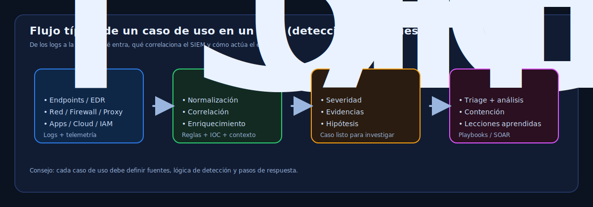

## 2.2.2 Casos de Uso en un SOC

En un mundo digital cada vez más complejo y peligroso, la seguridad cibernética se ha convertido en un pilar
fundamental para la supervivencia de las organizaciones. Los Centros de Operaciones de Seguridad (SOC)
modernos se erigen como una de las últimas líneas de defensa contra amenazas cibernéticas en constante
evolución.

!!! question "Pregunta guía"
    ¿Cómo puede un SOC garantizar la detección y la respuesta efectivas en un panorama en constante cambio?

<figure markdown>   
     
  <figcaption>Flujo típico de un caso de uso en un SOC: de los logs a la respuesta.</figcaption>   
</figure>

### 1. ¿Qué es un caso de uso?

Un caso de uso, en el contexto de un SOC, se refiere a un escenario específico en el que se describe cómo
se utilizarán sus capacidades para detectar, analizar y responder a amenazas de seguridad cibernética.

Los casos de uso son guías detalladas que describen:
- Las acciones.
- Los eventos. 
- Las fuentes de datos. 
- Las respuestas que se esperan del personal del SOC para abordar situaciones específicas de seguridad.

Son esenciales para la operación eficiente y efectiva del SOC, ya que ayudan a los analistas a comprender cómo deben manejar diversas amenazas y escenarios.

### 2. ¿Cómo se crean los casos de uso?

* **Identificación de Amenazas Relevantes:** El primer paso es identificar las amenazas cibernéticas que son relevantes para la organización. Estas amenazas pueden variar según la industria, el tamaño de la empresa y las tendencias de seguridad actuales.    

* **Definición del Escenario de Amenaza:** Para cada amenaza identificada, se debe definir un escenario detallado que describa cómo se llevaría a cabo el ataque. Esto incluye los pasos que seguiría un atacante, las técnicas que podrían utilizar y las posibles señales de alerta.    

* **Identificación de Fuentes de Datos:** Una vez que se comprende el escenario de amenaza, se deben identificar las fuentes de registros/logs que serían relevantes para detectar y analizar dicha amenaza. Estas fuentes pueden incluir registros de sistemas, registros de redes, registros de aplicaciones, registros de autenticación, entre otros.    

* **Definición de Indicadores de Compromiso (IOC):** Se definen los indicadores específicos que podrían indicar la presencia de la amenaza. Estos indicadores pueden incluir direcciones IP, URLs maliciosas, hashes de archivos sospechosos, patrones de tráfico anómalos, entre otros.    

* **Creación de Reglas y Alertas:** Con los indicadores y las fuentes de datos en mente, se crean reglas de detección que permitirán al Sistema de Información y Eventos de Seguridad (SIEM) alertar sobre actividades sospechosas. Estas reglas pueden ser basadas en firmas, patrones de comportamiento o correlación de eventos.    

* **Definición de Procedimientos de Respuesta:** Se establecen los pasos y procedimientos que deben seguir los analistas del SOC en caso de que se active una alerta. Esto incluye cómo se investigará la alerta, qué acciones se tomarán para contener la amenaza y cómo se mitigará el impacto.    

* **Validación y Ajuste:** Los casos de uso recién creados deben ser validados a través de pruebas y simulaciones. Si es necesario, se ajustarán las reglas, los indicadores y los procedimientos en función de los resultados de las pruebas.     

* **Documentación y Capacitación:** Una vez validados, los casos de uso se documentan detalladamente junto con los pasos a seguir en cada etapa. El personal del SOC debe recibir capacitación sobre cómo aplicar los casos de uso en situaciones reales.    

* **Monitorización Continua y Mejora:** Los casos de uso no son estáticos. Deben ser revisados y actualizados regularmente para mantenerse alineados con las amenazas emergentes y los cambios en la infraestructura de TI de la organización.     

!!! note "Idea clave"
    Los casos de uso ayudan a estandarizar la detección y la respuesta en un SOC: permiten anticipar,
    prepararse y actuar de forma coherente ante escenarios repetibles.

### 3. 10 casos de uso que todo servicio SOC moderno debería tener

A continuación comparto 10 casos de uso que son fundamentales para un servicio de Centro de Operaciones de Seguridad (SOC) moderno en términos de detección y respuesta ante amenazas:

1. ***Detección de Malware Avanzado:***

    * Identificación de comportamientos y patrones de actividad sospechosa en endpoints y sistemas para detectar malware avanzado y ataques de día cero.

    * Fuentes de registros/logs: Registros de endpoints, registros de sistemas, registros de cortafuegos, registros de servidores web, registros de aplicaciones.    

2. ***Detección de Actividad de Cuenta Comprometida:***

    * Monitoreo de comportamientos anómalos en las cuentas de usuario para identificar posibles compromisos de cuentas y actividades de intrusos.

    * Fuentes de registros/logs: Registros de autenticación (inicios de sesión), registros de sistemas, registros de bases de datos, registros de aplicaciones, registros de directorios activos.    

3. ***Detección de Movimiento Lateral:*** 

    * Identificación de movimientos inusuales y no autorizados dentro de la red, lo que podría indicar intentos de escalada de privilegios o propagación de amenazas.
   
    * Fuentes de registros/logs: Registros de tráfico de red, registros de firewalls, registros de sistemas, registros de autenticación, registros de acceso a archivos.    

4. ***Detección de Phishing y Ingeniería Social:***
    * Vigilancia de patrones de comunicación y URLs sospechosas para detectar intentos de phishing, suplantación de identidad y ataques de ingeniería social.

    * Fuentes de registros/logs: Registros de correo electrónico (servidor de correo), registros de proxy web, registros de URLs visitadas, registros de autenticación.    

5. ***Detección de Exfiltración de Datos:***

    * Monitoreo de tráfico de red y actividad de endpoints para detectar intentos de exfiltración de datos confidenciales fuera de la organización.

    * Fuentes de registros/logs: Registros de tráfico de red, registros de servidores de archivos, registros de bases de datos, registros de sistemas.    

6. ***Detección de Ataques de Denegación de Servicio (DDoS):***

    * Identificación de patrones de tráfico inusuales que podrían indicar ataques DDoS dirigidos a servicios y aplicaciones.

    * Fuentes de registros/logs: Registros de tráfico de red, registros de cortafuegos, registros de sistemas, registros de balanceadores de carga.     
    
7. ***Detección de Comportamiento Anómalo del Usuario:*** 

    * Monitorización de las actividades de los usuarios para detectar comportamientos anómalos, como accesos fuera de horario o a recursos no autorizados.

    * Fuentes de registros/logs: Registros de autenticación (inicios de sesión), registros de sistemas, registros de aplicaciones, registros de directorios activos.    

8. ***Detección de Vulnerabilidades y Exploits:*** 

    * Identificación de intentos de explotación de vulnerabilidades conocidas en sistemas y aplicaciones.

    * Fuentes de registros/logs: Registros de sistemas, registros de aplicaciones, escaneos de vulnerabilidad, registros de bases de datos.    

9. ***Detección de Ataques de Fuerza Bruta:***

    * Vigilancia de patrones de intentos repetitivos de inicio de sesión y acceso a recursos para identificar ataques de fuerza bruta.

    * Fuentes de registros/logs: Registros de autenticación (intentos fallidos de inicio de sesión), registros de sistemas, registros de aplicaciones.    

10. ***Detección de Ataques Internos y Fugas de Información:***

    * Seguimiento de actividades internas para detectar posibles acciones maliciosas de empleados y fugas de información sensible.
    
    * Fuentes de registros/logs: Registros de acceso a archivos, registros de bases de datos, registros de sistemas, registros de correo electrónico.

Cabe destacar que estos casos de uso son de referencia como línea base y que las necesidades de detección y respuesta pueden variar según la industria, el tamaño de la organización y las amenazas emergentes. Es esencial adaptar estos casos de uso a las circunstancias y requisitos específicos de cada SOC.

Es importante señalar que la efectividad de la detección y respuesta en un SOC se basa en la **capacidad de recopilar, correlacionar y analizar adecuadamente estos registros/logs para identificar patrones** y comportamientos anómalos que indiquen posibles amenazas. **La integración de tecnologías de seguridad, como Sistemas de Información y Eventos de Seguridad (SIEM), es totalmente necesario para este propósito**.

### Como gestionar los casos de uso en un SOC

Una vez comprendido que un **caso de uso** es el artefacto que permite transformar una amenaza teórica en una regla de detección operativa, es fundamental contar con una estructura que permita gestionarlos de manera escalable. Aquí es donde cobra relevancia los frameworks que nos ayudan a realizar este trabajo, como por ejemplo **MaGMa Use Case Framework**.

Desarrollado originalmente por la comunidad financiera holandesa (**FI-ISAC**) a partir de las experiencias de **ABN AMRO Bank**, MaGMa es un acrónimo que representa los tres pilares de la gestión de monitorización: **M**anagement (Gestión), **G**rowth (Crecimiento) y **Ma**trics & assessment (Métricas y evaluación).

Este marco de trabajo aporta un modelo analítico que organiza los casos de uso en **tres capas interconectadas** para asegurar que la tecnología no trabaje de forma aislada:

* **Capa de Negocio:** Conecta la monitorización con las necesidades reales de la empresa y los requisitos de cumplimiento.
* **Capa de Amenaza:** Describe el *modus operandi* de los atacantes y los escenarios que el SOC debe identificar.
* **Capa de Implementación:** Define las reglas técnicas, las fuentes de registros (logs) y los mecanismos de detección específicos en el SIEM.

La implementación de MaGMa permite que un SOC maduro deje de trabajar de manera reactiva o "ad-hoc" y comience a medir su **madurez y capacidad de detección** de forma cuantificable, identificando "puntos ciegos" y alineando cada alerta con los riesgos estratégicos de la organización.

[MaGMa Use Case Framework (UCF)](https://www.betaalvereniging.nl/wp-content/uploads/FI-ISAC-Use-Case-Framework-Full-Documentation.pdf)

!!! info "Referencia útil: MaGMa Use Case Framework (UCF)"
    El marco de **casos de uso de MaGMa** (UCF) es una guía creada por la comunidad financiera holandesa para la **gestión y administración de casos de uso**. Su objetivo es ayudar a las organizaciones a hacer operativa su estrategia de monitorización de ciberseguridad.

### 4. Conclusiones

Contar con casos de uso precisos de detección y respuesta es fundamental para cualquier organización madura en ciberseguridad debido a varios motivos clave:

* **Visibilidad Integral:** Los casos de uso bien definidos proporcionan una visión clara y estructurada de las amenazas y riesgos de ciberseguridad que pueden afectar a la organización. Esto permite identificar las áreas críticas en las que se debe enfocar la detección y respuesta.   

* **Detección Temprana de Amenazas:** Los casos de uso permiten a los equipos de seguridad anticiparse a las amenazas al establecer indicadores de compromiso y reglas de detección. Esto ayuda a identificar actividades maliciosas en etapas tempranas, lo que a su vez reduce el tiempo de exposición a las amenazas.    

* **Estandarización y Coherencia:** Los casos de uso proporcionan un enfoque estandarizado para la detección y respuesta ante amenazas. Esto asegura que los analistas de seguridad sigan procedimientos consistentes y evita respuestas inadecuadas o improvisadas.   

* **Eficiencia en la Respuesta:** Al contar con procedimientos detallados en los casos de uso, los equipos de seguridad pueden responder de manera más eficiente y efectiva cuando ocurren incidentes. Esto minimiza el impacto y acelera la recuperación.    

* **Reducción de Falsos Positivos:** Al basar la detección en casos de uso sólidos, se reduce la probabilidad de generar alertas falsas, lo que permite a los analistas concentrarse en amenazas reales en lugar de perder tiempo en investigaciones innecesarias.    

* **Gestión de Riesgos Mejorada:** Los casos de uso ayudan a priorizar los riesgos y amenazas según su impacto potencial y probabilidad. Esto permite a la organización concentrar recursos en áreas donde el riesgo es más alto.    

* **Adaptación a Amenazas Emergentes:** Al revisar y actualizar regularmente los casos de uso, la organización puede mantenerse al tanto de las nuevas tendencias y tácticas utilizadas por los ciberdelincuentes, asegurando que estén preparados para enfrentar amenazas emergentes.    

* **Cumplimiento y Reporte:** Los casos de uso bien definidos también pueden contribuir al cumplimiento de regulaciones y estándares de seguridad, al proporcionar un enfoque estructurado para la gestión de amenazas.    

!!! success "Conclusión"
    Contar con casos de uso precisos de detección y respuesta ayuda a establecer un enfoque organizado y efectivo de ciberseguridad. Además, permite comprender mejor riesgos y amenazas, tomar medidas
    proactivas y mitigar incidentes con menos improvisación.

## Referencias    

- [Alonso Ramírez](https://www.linkedin.com/in/alonsoramirezcybersecurity/)
- [10 casos de uso para un SOC Moderno](https://www.linkedin.com/pulse/10-casos-de-uso-para-un-soc-moderno-alonso-ram%C3%ADrez/)
- [SIEM Less](https://www.linkedin.com/pulse/qu%25C3%25A9-es-siem-less-alonso-ram%25C3%25ADrez/)
- [Info para implementar casos de uso en un SOC I](https://www.linkedin.com/posts/ram%C3%B3n-carlos-rico-g%C3%B3mez-844174147_ciberseguridad-vulnerabilidades-ldapnightmare-ugcPost-7280505943065325571-MoIk?utm_source=share&utm_medium=member_desktop)
- [Info para implementar casos de uso en un SOC II](https://www.linkedin.com/posts/ram%C3%B3n-carlos-rico-g%C3%B3mez-844174147_cybersecurity-windows11-privilegeescalation-activity-7281953733981130752-JH4j?utm_source=share&utm_medium=member_desktop)
- [Casos de uso en Splunk](https://0xcybery.github.io/blog/Splunk+Use+Cases)
