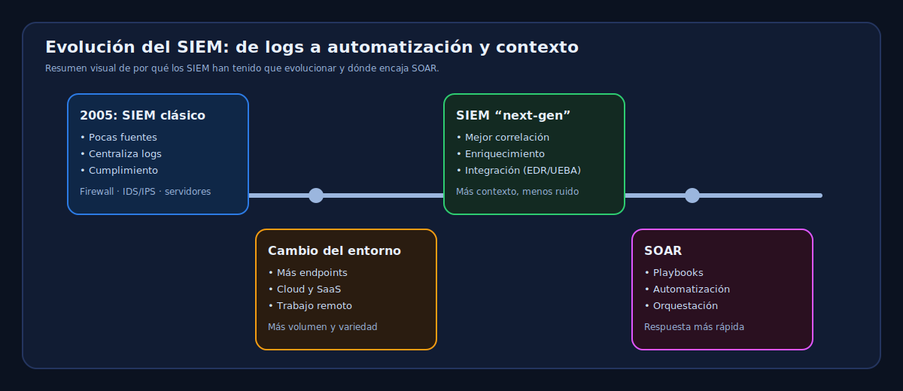
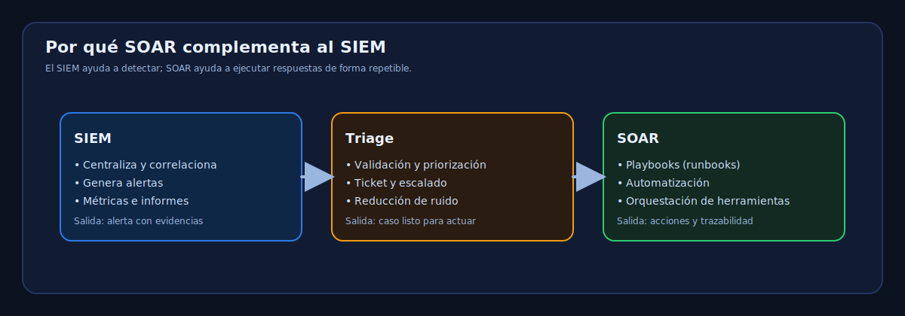

## 2.2.4 Evolución de SIEM y SOAR

Las soluciones SIEM han sido fundamentales para centralizar eventos y mejorar la visibilidad. Aun así, en
muchos contextos modernos se quedan cortas si no van acompañadas de automatización y orquestación.

!!! question "Pregunta guía"
    Si tu SOC recibe cientos (o miles) de alertas al día, ¿qué parte puedes automatizar de forma segura sin
    perder control ni trazabilidad?

<figure markdown>   
     
  <figcaption>Evolución del SIEM y dónde encaja SOAR (imagen generada).</figcaption>   
</figure>

En 2005, el SIEM se popularizó como una forma de ayudar a las organizaciones a monitorizar sus redes y
sistemas TI de manera más efectiva. En aquel momento, el panorama digital era marcadamente diferente:
la adopción cloud era mínima, el trabajo estaba menos distribuido y se usaban muchos menos endpoints.

Cómo cambian los tiempos. La superficie de ataque se ha transformado en la última década y continúa evolucionando a gran velocidad. Al mismo tiempo, las amenazas se han vuelto cada vez más sofisticadas y difíciles de detectar.

Para evitar ser descartados como una solución heredada, **las tecnologías SIEM tienen que mejorar** su estrategia.

!!! note "Idea clave"
    El reto no es solo “recoger más logs”, sino **añadir contexto, correlación y flujo de trabajo** para que el
    equipo pueda responder más rápido y con menos fatiga.

### 1. La evolución del SIEM

El panorama digital cambiante está creando una serie de nuevos desafíos para los desarrolladores de tecnologías SIEM. Si bien SIEM se basó en solo unas pocas fuentes de datos, como firewalls y sistemas de detección de intrusos (IDS / IPS), la '*próxima generación*' de sistemas SIEM debe evolucionar para procesar un mayor volumen y variedad de datos, así como mejorar su capacidad de correlación.

*Las **[amenazas avanzadas](https://ciberseguridad.blog/indicadores-de-deteccion-apt-advanced-persistent-threat/)** (APTs) ahora son [polimórficas](https://es.wikipedia.org/wiki/Polimorfismo_(virus_inform%C3%A1ticos)?ref=ciberseguridad.blog) en lugar de estáticas*, capaces de cambiar constantemente su comportamiento para evadir la detección. Como tal, los [sistemas SIEM](https://ciberseguridad.blog/soluciones-open-source-para-la-gestion-de-logs-en-ciberseguridad/) no solo deben procesar más datos, sino que también deben ser mucho mejores para reconocer nuevos patrones dentro de ellos.

Mejorar la interoperabilidad con nuevas tecnologías de seguridad, como EDR (detección y respuesta en
endpoints) y [**UEBA**](https://ciberseguridad.blog/ueba-user-and-entity-behavior-analytics-deteccion-por-comportamiento/)
(User & Entity Behavior Analytics), así como con plataformas de inteligencia de amenazas, ha sido un foco
para muchos proveedores en los últimos años. Por eso, las soluciones SIEM también tienen que evolucionar
para facilitar la administración de un ecosistema cada vez mayor de herramientas.

A pesar de su capacidad para aumentar la visibilidad de las amenazas, las tecnologías complementarias tienen el potencial de aumentar la **fatiga de alertas** y el tiempo muerto cuando el contexto cambia entre aplicaciones. La mejora del flujo de trabajo, la reducción de la carga de la monitorización de seguridad y la aceleración de la [**respuesta ante incidentes**](https://www.welivesecurity.com/la-es/2015/05/18/que-es-como-trabaja-csirt-respuesta-incidentes/?ref=ciberseguridad.blog) (CSIRT) son áreas que se deben mejorar para que los equipos de seguridad se den cuenta de los beneficios de los sistemas SIEM más inteligentes. Esto es particularmente importante dado los muchos desafíos que a los que se enfrentan las organizaciones para atraer y retener el talento de seguridad que necesitan para ejecutar las operaciones: **el objetivo es trabajar de manera más inteligente**, no más difícil.

!!! warning "Atención: fatiga de alertas"
    Añadir más herramientas no siempre mejora la detección. Si cada herramienta genera alertas sin un
    flujo claro de validación, priorización y respuesta, el equipo se satura y el riesgo aumenta.

### 2. Herramientas SOAR

!!! definition "SOAR"
    **Security Orchestration, Automation and Response (SOAR)** agrupa tecnologías y prácticas para
    **orquestar** herramientas, **automatizar** tareas repetitivas y **estandarizar** la respuesta mediante
    playbooks o runbooks.

Los proveedores de SIEM han aprovechado el crecimiento de SOAR para complementar la detección con
capacidad de respuesta.

Está compuesto por tres mercados tecnológicos distintos:

1. Orquestación y automatización de la seguridad.   
2. Plataformas de respuesta a incidentes de seguridad (SIRP)   
3. Plataformas de inteligencia de amenazas (TIP).    

Su propósito general es ayudar a las organizaciones a mejorar la detección y respuesta de amenazas a través de la agregación y la correlación de datos más ricos y de calidad unida a la automatización de las tareas rutinarias de seguridad.

Mientras que las soluciones SIEM tradicionales dependían en gran medida de una pequeña cantidad de
fuentes de inteligencia de amenazas, las herramientas SOAR están impulsando a las organizaciones a
recopilar mayores volúmenes de datos internos y externos y procesarlos de forma más rápida y precisa.
Esto ayuda a tomar decisiones más rápidas y mejor informadas, y puede reducir falsos positivos si se
aplica bien.

Otra manera clave en la que las **herramientas SOAR** está influenciando los planes de trabajo de los productos SIEM es ayudando a estandarizar los procedimientos de respuesta y análisis de incidentes. El objetivo en esta parte es automatizar parcial o totalmente una serie de actividades para que el personal de seguridad tenga más tiempo para buscar amenazas en lugar de responder a ellas.

A través de la automatización de acciones de respuesta, como bloquear una dirección IP en un firewall o un sistema de detección de intrusos, suspender las cuentas de usuario o poner en cuarentena los puntos finales infectados de una red, las herramientas SOAR pueden ayudar a facilitar una respuesta a incidentes más rápida y, por lo tanto, reducir el daño potencial y las interrupciones que las violaciones pueden provocar.

Playbooks Demisto es un ejemplo de cómo las herramientas SOAR están ayudando a las organizaciones a estandarizar y automatizar las respuestas a incidentes. Los Playbooks son una serie de pasos predefinidos que se pueden ejecutar automáticamente en respuesta a una alerta de seguridad. Estos Playbooks pueden ser personalizados por los equipos de seguridad para adaptarse a las necesidades específicas de su organización, lo que les permite responder a incidentes de manera más rápida y eficiente.

<figure markdown>   
     
  <figcaption>Relación SIEM–SOAR: detección, triage y respuesta (imagen generada).</figcaption>   
</figure>

### 3. El SIEM del futuro

*[Gartner](https://www.gartner.com/en?ref=ciberseguridad.blog) predice que para fines de 2020, el 15% de las organizaciones con un equipo de seguridad de más de cinco personas aprovechará las soluciones SOAR*. Su enorme potencial para mejorar la eficiencia y eficacia de las operaciones de seguridad significa que es probable que desempeñe un papel crucial para ayudar a dar forma al desarrollo del futuro SIEM.

La clave para la adopción de herramientas SOAR por parte de los proveedores de soluciones SIEM será
demostrar que se puede confiar en la [inteligencia artificial](https://es.wikipedia.org/wiki/Inteligencia_artificial?ref=ciberseguridad.blog)
y el [aprendizaje automático](https://es.wikipedia.org/wiki/Aprendizaje_autom%C3%A1tico?ref=ciberseguridad.blog)
para hacer cambios en los sistemas. Aun así, el criterio humano seguirá siendo vital para la detección y la
respuesta ante amenazas.

Aprovechar al máximo el SIEM, para ayudar a enfrentarnos a los crecientes desafíos de seguridad, no solo
dependerá de algoritmos más inteligentes, sino de personal mejor capacitado que pueda usar los sistemas
con eficacia y validar alertas.

La superficie de ataque, que ya se ha transformado drásticamente desde la introducción de SIEM, continuará cambiando a gran velocidad en los próximos años. Las organizaciones solo podrán responder a estos cambios con mejores herramientas y una fuerza laboral más capacitada y eficiente.

### 4. La necesidad de disponer de herramientas SOAR

Por ahora, los beneficios de los sistemas **Security Orchestration, Automation and Response** (**SOAR**) son obvios para casi todos los analistas CISO y de seguridad.

Los beneficios para los Centros de Operaciones de Seguridad (SOC) incluyen:

* Automatización de tareas para ayudar a los SOC con personal limitado, aumentando la productividad de manera exponencial.
* Automatizar la clasificación básica de seguridad, para que las alertas se manejen de manera integral y las alertas importantes nunca se pasen por alto debido a la  carga de trabajo del personal
* Liberar a los analistas de seguridad para trabajar en tareas no repetitivas, como la búsqueda proactiva de amenazas y la colaboración con unidades de negocios, una vez que las operaciones de rutina son automatizadas, lo que mejora la efectividad general del SOC
* Lograr la excelencia operacional al reemplazar los procesos ad hoc con las mejores prácticas documentadas, automatizadas y realizadas de manera consistente

Pero, aunque los SOC reconocen los beneficios de SOAR, también hay obstáculos que pueden limitar la
efectividad de una implantación (o hacerla parecer poco práctica). Quienes trabajamos en tecnología
conocemos los problemas y dolores de cabeza que puede producir introducir una herramienta nueva.

Aquí hay una rápida lista de obstáculos en el despliegue de herramientas SOAR:

* **Muchos sistemas SOAR son demasiado caros**: Las nuevas tecnologías potentes a menudo tienen precios exorbitantes cuándo se presentan. Los automóviles solían ser accesibles solo por los aficionados más ricos. Con el tiempo, se convirtieron en necesidades asequibles para todos los hogares. Muchos sistemas SOAR de hoy solo son asequibles para SOC con grandes presupuestos.
* **Los sistemas SOAR requieren programación, pero la mayoría de los equipos SOC carecen de desarrolladores**: Muchos sistemas SOAR requieren que los usuarios escriban Python para construir Playbooks e integrarlos con otras herramientas y aplicaciones de seguridad. La gran mayoría de los equipos de SOC carecen de las habilidades de programación de Python y el tiempo para asumir un nuevo trabajo de integración, por lo que el requisito de la programación se convierte en un factor decisivo.
* **Las llamadas integraciones listas para usar son demasiado limitadas:** Los SOAR deben integrarse con herramientas de seguridad para las que puedan recopilar alertas y otros datos de ellos y emitir comandos, orquestando las respuestas a las amenazas. Algunos proveedores SOAR ofrecen integraciones, pero los SOC pronto descubren que las integraciones no incluyen funciones para las tareas y características de las que dependen. Con demasiada frecuencia, los SOC se ven obligados a desarrollar integraciones o contratar a expertos externos para crear integraciones no proporcionadas por los proveedores.
* **Las API de las herramientas de seguridad son demasiado limitadas**: Para complicar aún más la
  integración, muchas herramientas ofrecen APIs para operaciones básicas (suficientes para una demo),
  pero no para automatizar bien la operación real. En algunos entornos, el SOC solo integra una parte de
  las funciones disponibles por la limitada disponibilidad de APIs. Sin APIs, la automatización acaba
  dependiendo de acciones manuales en consola o navegador. Por eso es importante definir bien el alcance
  de integración.
* **Los SOC creen que sus procesos son demasiado ad hoc o especializados para ser automatizados**:
  Escuchamos esta objeción de muchos analistas de seguridad. Están convencidos de que lo que hacen es
  demasiado único o complicado de documentar. Y es que, si no se puede documentar, no se puede
  automatizar.
* **Los SOC carecen del tiempo necesario para construir y ajustar automatizaciones por sí solos**: La
  construcción de automatizaciones lleva tiempo. Se necesita atención sostenida y un poco de ensayo y
  error. Desafortunadamente, muchos SOC están tan ocupados luchando contra sus colas de clasificación
  que no pueden disponer de las horas o los días para crear lo que les ahorraría semanas o meses.

## Referencia
- [Herramientas SOAR que revitalizarán el ecosistema SIEM](https://ciberseguridad.blog/por-que-las-herramientas-soar-revitalizaran-el-ecosistema-siem.html)
- [Ruben.Ramiro](https://ciberseguridad.blog/author/ruben-ramiro/)
