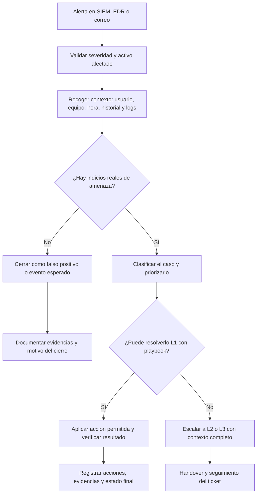

## 2.2.5 SOC: Analista de nivel 1

| Código | Descripción |
| ------- | ----------- |
| RA2 | Analiza incidentes de ciberseguridad utilizando herramientas, mecanismos de detección y alertas de seguridad. |
| CEb | Se han establecido controles, herramientas y mecanismos de monitorización, identificación, detección y alerta de incidentes. |
| CEe | Se han realizado la clasificación, valoración, documentación y seguimiento de los incidentes detectados. |

Cuando hablamos de un SOC solemos pensar en herramientas, paneles llenos de alertas y automatizaciones. Sin embargo, el elemento que convierte toda esa tecnología en una defensa real es el equipo humano. Dentro de ese equipo, el **analista SOC de nivel 1** es quien recibe primero la señal de alarma, separa el ruido de lo importante y decide qué necesita atención inmediata.

Este tema intenta responder a una pregunta muy concreta: **qué hace realmente una persona que trabaja como analista SOC L1 y por qué su trabajo es crítico para el resto del proceso de respuesta a incidentes**. Lo importante aquí es entender que no se trata solo de "mirar alertas", sino de interpretar contexto, documentar con rigor y escalar con criterio.

!!! question "Pregunta guía"
    Si un SIEM genera cientos de alertas al día, ¿cómo decide un analista SOC de nivel 1 cuáles son irrelevantes, cuáles requieren investigación y cuáles deben escalarse de inmediato?

### 1. Qué debe aprender el alumnado en este tema

Al terminar este documento deberías quedarte, al menos, con estas tres ideas:

1. El analista SOC L1 es la **primera línea de defensa operativa** del SOC.
2. Su trabajo consiste en **monitorizar, priorizar, investigar de forma inicial, documentar y escalar**.
3. La calidad de su trabajo afecta directamente al tiempo de respuesta, a la carga del equipo y a la capacidad de aprender de cada incidente.

!!! note "Idea clave"
    Un buen analista L1 no resuelve todos los incidentes complejos, pero sí evita que el SOC se bloquee con ruido, falsos positivos o escalados pobres.

### 2. Qué es un analista SOC de nivel 1

Un **analista SOC de nivel 1** es el perfil que se encarga de la **vigilancia operativa continua** dentro de un Centro de Operaciones de Seguridad. Dicho de forma sencilla, es quien recibe las alertas generadas por las herramientas de seguridad y realiza la primera validación para decidir si estamos ante un falso positivo, un evento legítimo o un posible incidente.

Su papel es especialmente importante porque trabaja justo en el punto donde confluyen tres elementos:

- la tecnología que detecta eventos;
- los procedimientos del SOC;
- y la toma de decisiones rápida.

En la práctica esto significa que el L1 debe moverse con soltura entre paneles de SIEM, EDR, sistemas de tickets, consultas de logs, fuentes de inteligencia y playbooks de respuesta.

!!! definition "Triaje"
    En un SOC, el **triaje** es el proceso de revisar una alerta, darle contexto, valorar su prioridad y decidir la siguiente acción. El objetivo no es investigar todo en profundidad, sino decidir bien y rápido.

### 3. Dónde encaja dentro del SOC

En muchos SOC se trabaja por niveles para repartir el esfuerzo y especializar funciones:

- **Nivel 1:** recibe alertas, hace triaje, recopila contexto y escala cuando procede.
- **Nivel 2:** profundiza en la investigación, confirma el incidente y coordina acciones de respuesta más elaboradas.
- **Nivel 3:** se ocupa de incidentes complejos, análisis avanzados, threat hunting, mejora de casos de uso y apoyo experto.

Esto no significa que el nivel 1 sea un perfil "básico" en el sentido de irrelevante. Significa que su responsabilidad está orientada a la **operación continua y a la primera decisión**. Si esa primera decisión falla, el resto del SOC trabaja peor.

### 4. Flujo de trabajo habitual ante una alerta

El trabajo del analista L1 suele repetirse muchas veces durante un turno, pero no debería hacerse de forma mecánica. Cada alerta obliga a aplicar un proceso claro y consistente.



El diagrama anterior resume una idea fundamental: el trabajo del L1 no termina al detectar una alerta. Termina cuando la alerta queda **justificada, documentada y situada** dentro del flujo del SOC.

### 5. Tareas cotidianas del analista L1

#### 5.1. Monitorización continua

Durante una parte importante del turno, el analista revisa paneles y colas de alertas procedentes de distintas fuentes:

- SIEM
- EDR/XDR
- IDS/IPS
- firewalls
- pasarelas de correo
- herramientas de ticketing o SOAR

Su objetivo no es solo ver qué aparece, sino detectar patrones como estos:

- repeticiones anómalas de un mismo evento;
- actividad fuera de horario habitual;
- alertas sobre activos críticos;
- indicadores que coinciden con campañas conocidas;
- eventos que, por separado, parecen menores, pero juntos apuntan a una intrusión.

#### 5.2. Priorización

No todas las alertas valen lo mismo. Una detección en el portátil de un usuario con baja criticidad no se trata igual que una alerta sobre un controlador de dominio o una cuenta privilegiada.

Para priorizar, normalmente se cruzan varios criterios:

- criticidad del activo;
- tipo de amenaza;
- confianza de la regla de detección;
- número de sistemas afectados;
- impacto potencial en confidencialidad, integridad o disponibilidad;
- acuerdos de nivel de servicio del SOC.

#### 5.3. Investigación inicial

Cuando una alerta parece relevante, el L1 realiza una investigación preliminar. No busca resolver todo el incidente, sino responder preguntas básicas:

- ¿Qué ha ocurrido exactamente?
- ¿Cuándo empezó?
- ¿Qué usuario, equipo o servicio está implicado?
- ¿Hay más eventos relacionados?
- ¿Parece actividad legítima o comportamiento anómalo?

Esta fase suele apoyarse en consultas sobre logs, revisión de procesos, análisis de IPs, dominios o hashes y comparación con comportamientos anteriores.

#### 5.4. Detección de falsos positivos

Una parte muy importante del trabajo consiste en **descartar alertas que parecen peligrosas, pero no lo son**. Esto puede ocurrir por varias razones:

- reglas mal afinadas;
- cambios legítimos en sistemas;
- tareas automáticas del departamento técnico;
- herramientas corporativas que generan actividad similar a la maliciosa.

Detectar falsos positivos no es "perder el tiempo". Es una función clave para que el SOC no se sature.

!!! warning "Riesgo habitual"
    Si el L1 escala todo sin filtrar, el equipo superior pierde tiempo. Si filtra demasiado y cierra alertas sin criterio, un incidente real puede pasar desapercibido.

### 6. Herramientas y fuentes que utiliza

El analista SOC L1 no trabaja con una sola herramienta. Lo habitual es combinar varias, cada una con una función concreta.

| Herramienta o fuente | Para qué se utiliza |
| --- | --- |
| SIEM | Centralizar logs, correlacionar eventos y revisar alertas. |
| EDR/XDR | Ver actividad en endpoints, procesos, archivos y acciones de contención. |
| IDS/IPS | Detectar patrones de tráfico o intentos de intrusión en red. |
| Threat intelligence | Enriquecer IPs, dominios, URLs o hashes con reputación y contexto. |
| Ticketing | Registrar el caso, asignarlo, escalarlo y mantener trazabilidad. |
| Playbooks o runbooks | Guiar la investigación y la respuesta de forma estandarizada. |

En un entorno profesional también es frecuente consultar:

- inventario de activos;
- CMDB o base de configuración;
- directorio corporativo;
- historial de incidentes anteriores;
- ventanas de mantenimiento o cambios aprobados.

### 7. Documentación: parte técnica y parte profesional

Una idea equivocada bastante común es pensar que la documentación es una carga administrativa. En un SOC ocurre justo lo contrario: **sin documentación, el trabajo pierde valor operativo**.

El analista L1 debe dejar constancia de:

- qué alerta recibió;
- qué evidencias revisó;
- qué hipótesis manejó;
- qué acciones realizó;
- por qué cerró o escaló el caso;
- y qué estado deja para el siguiente turno.

#### 7.1. Qué debe aparecer en un buen ticket

Un ticket o caso bien documentado debería incluir, como mínimo:

- fecha y hora de detección;
- identificador de alerta;
- activo o usuario afectado;
- breve resumen del comportamiento observado;
- evidencias relevantes;
- clasificación inicial;
- prioridad;
- acciones realizadas;
- decisión final;
- siguiente paso o estado pendiente.

#### 7.2. Por qué esta documentación importa

Porque permite:

- evitar investigaciones duplicadas;
- justificar decisiones;
- cumplir auditorías y procedimientos;
- mejorar reglas de detección;
- y facilitar el handover entre turnos.

!!! quote "Regla no escrita del SOC"
    Si no está documentado, para el equipo es como si no hubiera ocurrido.

### 8. Handover: continuidad entre turnos

Muchos SOC trabajan 24/7. Eso obliga a que el relevo entre turnos sea claro. El **handover** no consiste en decir "queda esto pendiente", sino en transferir contexto útil para que la otra persona pueda continuar sin empezar desde cero.

Un buen handover incluye:

- tickets abiertos;
- severidad y prioridad;
- acciones ya realizadas;
- datos pendientes de confirmar;
- escalados en curso;
- bloqueos o dependencias externas.

Dicho de forma sencilla, el objetivo es que el siguiente turno sepa **dónde estamos, qué se ha hecho y qué falta por hacer**.

### 9. Ejemplo práctico: alerta de phishing

Veamos un caso sencillo y realista. El SIEM genera una alerta porque varias personas han recibido un correo con un enlace a un dominio recién creado y con reputación dudosa.

Un analista L1 podría seguir esta secuencia:

1. Revisar la alerta y confirmar qué usuarios han recibido el mensaje.
2. Consultar el dominio en una fuente de reputación.
3. Verificar si alguien ha hecho clic en el enlace.
4. Comprobar si el correo ha llegado a más buzones.
5. Clasificar el caso como posible phishing.
6. Escalarlo o ejecutar la acción permitida, por ejemplo solicitar retirada del correo o aislamiento preventivo si hay compromiso confirmado.
7. Documentar evidencias y estado del caso.

Ejemplo de información mínima que podría aparecer en el ticket:

```text
Alerta: Possible phishing campaign
Hora de detección: 08:14
Usuarios afectados: 12
Dominio observado: secure-verification-login[.]com
Reputación: dominio reciente, sin historial legítimo
Acción inicial: búsqueda en pasarela de correo y verificación de clics
Resultado preliminar: 2 usuarios hicieron clic, sin evidencia inicial de descarga
Decisión: escalar a L2 y mantener seguimiento
```

Lo importante aquí es que el L1 no necesita hacer análisis forense completo para aportar valor. Su aportación consiste en **dar contexto fiable y acelerar la siguiente decisión**.

### 10. Habilidades necesarias para desempeñar bien el puesto

#### 10.1. Habilidades técnicas

Para trabajar con soltura como L1 suelen ser necesarios estos fundamentos:

- redes: TCP/IP, DNS, HTTP, correo, puertos y flujos básicos;
- sistemas operativos: Windows y Linux;
- lectura de logs;
- conceptos de autenticación y privilegios;
- uso de SIEM, EDR y herramientas de enriquecimiento;
- nociones de phishing, malware, fuerza bruta, movimiento lateral y exfiltración.

#### 10.2. Habilidades profesionales

También hay competencias no puramente técnicas que marcan la diferencia:

- atención al detalle;
- capacidad de comunicación escrita;
- gestión del estrés;
- disciplina para seguir procedimientos;
- criterio para pedir ayuda o escalar a tiempo;
- y capacidad para explicar hallazgos sin dramatizar ni quedarse corto.

!!! tip "Enfoque profesional"
    En un puesto L1, comunicar bien un hallazgo suele ser casi tan importante como detectarlo.

### 11. Dificultades habituales del puesto

Aunque es una buena puerta de entrada al Blue Team, también es un trabajo exigente. Entre las dificultades más frecuentes están:

- fatiga de alertas;
- turnos rotatorios;
- presión por tiempos de respuesta;
- tareas repetitivas;
- necesidad de aprender de forma continua;
- y exposición constante a situaciones ambiguas.

Eso sí, precisamente por esa exposición continua, es un perfil desde el que se aprende mucho en poco tiempo. Quien aprovecha bien esta etapa suele desarrollar una base muy útil para evolucionar hacia L2, threat hunting, ingeniería de seguridad o respuesta a incidentes.

### 12. Caso guiado: la experiencia de un analista junior

Imagina a una persona que lleva pocos meses en un SOC de un proveedor de servicios gestionados. Su turno está muy pautado, trabaja con una cola continua de alertas y combina tareas técnicas con comunicación a clientes. Al principio cree que lo más difícil será interpretar logs, pero descubre que uno de los mayores retos es **explicar con claridad lo que ha visto, lo que ha hecho y lo que recomienda**.

Este ejemplo sirve para recordar algo importante: el puesto de L1 no solo forma en herramientas. También forma en método, trazabilidad, criterio y comunicación profesional.

### 13. Certificaciones y evolución profesional

No existe una única ruta para llegar a un SOC, pero sí hay certificaciones que suelen aparecer en ofertas junior o de especialización posterior.

- Para entrada o primeros años: `CompTIA Security+`, `Cisco CyberOps Associate`, `EC-Council CSA`.
- Para evolución de análisis: `CompTIA CySA+`, `GSEC`, `CHFI`.
- Para especialización o perfiles más senior: certificaciones cloud, `CISSP` u otras credenciales avanzadas.

Conviene interpretar estas certificaciones como apoyo y no como sustituto de la experiencia. Tener una certificación puede abrir puertas, pero en el trabajo diario lo que realmente se valora es saber **investigar, documentar y decidir con criterio**.


### 14. Te lo cuenta Bohan

¡Hola! Qué bueno que nos sentamos a platicar. Me presento: soy **Bohan**, y aunque apenas llevo unos **ocho meses** trabajando como **analista SOC de Nivel 1** en una empresa llamada Eastern Tire, ha sido una experiencia increíble que me ha enseñado muchísimo sobre la primera línea de defensa.

Mi empresa es un proveedor de servicios de seguridad (MSSP), lo que significa que mis clientes nos confían su protección y yo me encargo de vigilar sus entornos. Deja que te cuente cómo es mi vida ahí dentro y qué te recomiendo si quieres seguir este camino.

#### 14.1. Mi día a día: Entre alertas y cronogramas
Lo primero que debes saber es que mi trabajo se basa en un **entorno de turnos**. Esto significa que mi rutina está **totalmente programada**; cada día, al entrar, sé exactamente qué tareas tengo asignadas en mi bloque de tiempo.

Mis actividades principales son:
*   **Monitoreo constante:** Me paso el turno vigilando las alertas y eventos de seguridad que se disparan en los sistemas de nuestros clientes.
*   **Investigación y Triaje:** Cuando surge algo sospechoso, tengo que profundizar para ver si es una amenaza real o solo ruido.
*   **Escalamiento:** Si detecto algo que requiere una intervención más compleja, realizo el escalamiento adecuado hacia los niveles superiores.
*   **Soporte al cliente:** A veces los clientes tienen solicitudes específicas y yo estoy ahí para ayudarlos con lo que necesiten.

Lo que más me gusta es que es un **entorno de ritmo rápido**; nunca te aburres porque siempre hay algo que hacer. Además, tengo la oportunidad de ver los **ataques más recientes** en tiempo real, lo que expande mi conocimiento constantemente.

#### 14.2. El desafío de la comunicación
Aunque parezca un trabajo puramente técnico, mi mayor reto al empezar no fueron los códigos, sino la **atención al cliente**. Si no tienes experiencia previa tratando con personas, comunicarte de manera efectiva con los clientes para explicarles un hallazgo técnico puede ser difícil. Por eso, ahora dedico tiempo a mi blog y a hacer videos: me ayuda a practicar cómo explicar conceptos complejos de forma sencilla.

#### 14.3. Mi "mochila" de herramientas (Habilidades)
Si quieres entrar a este mundo, te diría que prepares dos tipos de habilidades:

1.  **Habilidades Técnicas:**
    *   **Redes:** Debes entender los protocolos básicos y cómo se ve el tráfico. Aprende a usar **Wireshark** y a analizar archivos **PCAP**.
    *   **Sistemas Operativos:** Tienes que conocer cómo funcionan por dentro.
    *   **La Nube (El "Plus"):** Hoy en día casi todo depende de la nube, así que entender plataformas como AWS o Azure te dará una ventaja enorme.

2.  **Habilidades Blandas (Las más importantes para mí):**
    *   **Comunicación:** Debes ser capaz de hablar con clientes y colegas por teléfono o correo de forma clara.
    *   **Habilidades interpersonales:** Aprender a llevarte bien con tu equipo es vital en un entorno de alta presión.

#### 14.4. Mis recomendaciones para tu carrera
No hay un solo camino para ser analista SOC, pero mi mejor consejo es que **hagas tu propio plan**. No vayas a la deriva:
*   Establece **metas claras** y un **cronograma** con hitos (milestones) que quieras alcanzar. Esto hará que tu proceso sea mucho más rápido.
*   **Pregunta sin miedo:** Si no estás seguro de algo en el trabajo, pide ayuda siempre.
*   **Acepta la crítica:** Estar dispuesto a recibir retroalimentación de tus compañeros es lo que te hará crecer como profesional.

Trabajar en el **Blue Team** (defensa) es muy satisfactorio. No hay nada como la sensación de ver que realmente **detuviste un ataque** y "salvaste" el entorno de tu cliente; es una satisfacción que solo se vive aquí. ¡Anímate, es un campo emocionante!


### 15. Conclusiones

El analista SOC de nivel 1 es el perfil que transforma una detección técnica en una actuación operativa ordenada. Su trabajo consiste en **vigilar, contextualizar, priorizar, documentar y escalar**. Si lo hace bien, el SOC gana tiempo, reduce ruido y responde mejor.

La idea que debes recordar es esta: **un L1 no está para pulsar botones, sino para tomar buenas primeras decisiones apoyadas en evidencias**.

## Referencias y recursos recomendados

- [How to become a SOC Analyst - Bohan Zhang](https://youtu.be/6cYtTzkgbMc?si=i6LnB0luG4VM--Vj)
- NIST. *Computer Security Incident Handling Guide*.
- SANS Institute. Materiales introductorios sobre respuesta a incidentes y operación SOC.
- Documentación del fabricante de la plataforma SIEM o EDR utilizada en el entorno de prácticas.
