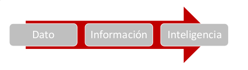
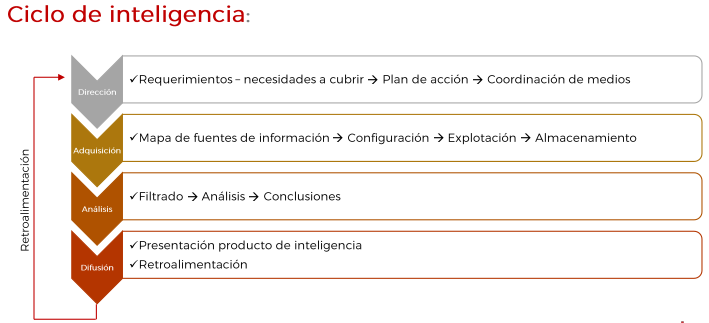
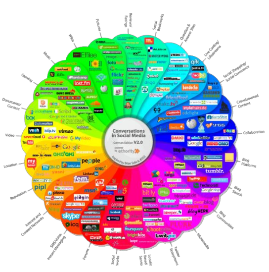
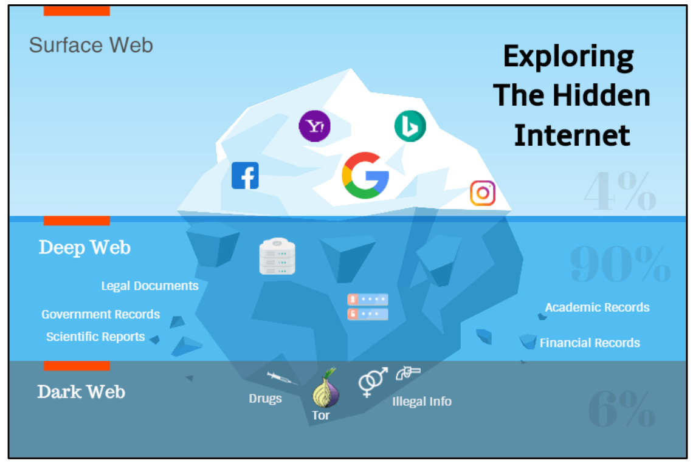
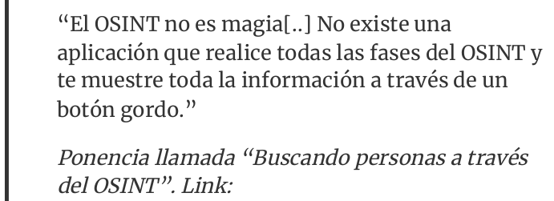
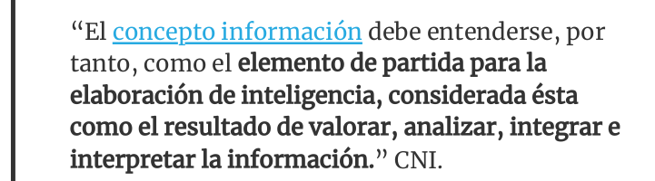
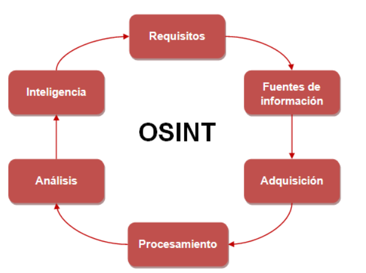
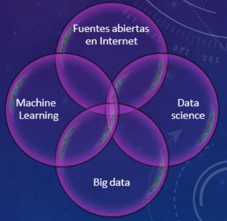
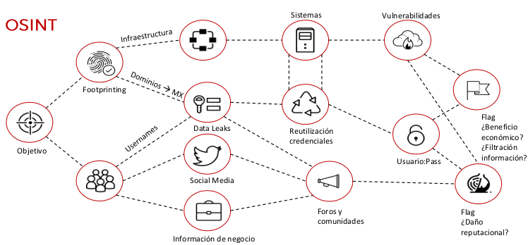

**OSINT: Fuentes abiertas**

#### RA2
d) Se han establecido controles, herramientas y mecanismos de monitorización, identificación, detección y alerta de incidentes a través de la investigación en fuentes abiertas (OSINT: Open Source Intelligence).

#### ÍNDICE

Conceptos

OSINT

Fases

OSINTER

Bibliografía

Actividades

#### Conceptos

Dato: Unidad mínima obtenida, que, adecuadamente procesada, se puede convertir en información

Información: Material sin evaluar, que una vez analizada, tratada y elaborada puede producir inteligencia

Inteligencia: Información transformada en un producto ya analizado

¿Qué es inteligencia?

Producto -> Ciclo de inteligencia

Objetivo final -> toma de decisiones + reducir incertidumbre

Información != inteligencia

¿Qué es ciberinteligencia?

Aplicación inteligencia + ciberespacio

Problemática:

Exceso de información

Fiabilidad de las fuentes

Información errónea o malintencionada

¿Qué es fuente abierta?

Existe controversia, y discusiones sobre el tema…

**No**  solo es internet o soporte tecnológico

Secreta != valor

Fuentes de  **carácter público: ** Independiente comercialización, difusión

**Cualquier contenido** : con independencia del soporte, del medio de transmisión, del modo de acceso: digital o no, puesto a disposición del público.

Ejemplos: agencia de noticias, enciclopedias, blog, anuarios, monografías, conferencias de prensa, publicaciones científicas, canal RSS, legislación, emisiones de radio y televisión...

* OSINT
* Se empezó a usar en el ámbito militar/gubernamental
* Open Source Intelligence -> Inteligencia en fuentes abiertas -> inteligencia generada a partir del análisis de datos obtenidos en fuentes abiertas
* Disciplina
  * HUMINT: Human Intelligence
  * OCMINT: Social Media Intelligence
  * CYBINT: Cyber Intelligence
  * GEOINT: Geospatial Intelligence
  * SIGINT: Signals Intelligence Ingania

#### OSINT

#### 

Qué es OSINT:

_[https://www.incibe-cert.es/blog/osint-la-informacion-es-poder](https://www.incibe-cert.es/blog/osint-la-informacion-es-poder)_

https// _[www.yolandacorral.com/que-es-osint-fases-fuentes-herramientas/](http://www.yolandacorral.com/que-es-osint-fases-fuentes-herramientas/)_

_[https://ciberpatrulla.com/que-es-osint/](https://ciberpatrulla.com/que-es-osint/)_

https//ginseg.com/2020/7688/osint/una-introduccion-a-osint/

Ciclo de inteligencia:

https// _[www.cni.es/es/queescni/ciclo/](http://www.cni.es/es/queescni/ciclo/)_

Libros:

_[https://0xword.com/libros/162-open-source-intelligence-osint-investigar-personas-e-identidades-en-internet.html](https://0xword.com/libros/162-open-source-intelligence-osint-investigar-personas-e-identidades-en-internet.html)_

https:/Avwwv.amazon.es/Manual-ciberinvestigaciC3%B3n-fuentes-abiertas-analistas/dp/1650895747

Usos y aplicaciones del OSINT

Informes geopolíticos o geoestratégicos, riesgo-país, conflictos políticos,socio-económicos,desplazamientos, inversiones, análisis de competencia,prospectiva de negocio...

Informes de ciberinteligencia, vigilancia digital, reputación online, malware...

Ciber Investigación, cibervigilancia, huella digital...

Aplicación en la fase de footprinting en una auditoría de seguridad

Detección, investigación y análisis en incidente de seguridad

... En Casi cualquier ámbito

Quienes emplean OSINT

FFCCSS, Fuerzas Armadas, agencias gubernamentales, abogados, periodistas,investigadores, detectives privados, criminólogos, analistas de inteligencia,ciberinteligencia, ciberseguridad, malware, auditores de seguridad IT...

OSINT genera rechazo por una parte, mientras que detectives y cuerpos de seguridad se han agarrado con fuerza e ilusión

_[https://www.youtube.com/watch?v=JSO51braHNc&t=8s](https://www.youtube.com/watch?v=JSO51braHNc&t=8s)_

De las distintas disciplinas, podemos decir que todas las “Inteligencia de” tienen algo en común:

**obtener información y analizarla.**

_[https://www.cni.es/es/preguntasfrecuentes/pregunta_010.html?pageIndex=10&faq=si&size=15](https://www.cni.es/es/preguntasfrecuentes/pregunta_010.html?pageIndex=10&faq=si&size=15)_

#### Fases

#### 

**Requisitos** . Aquí valoraremos qué hitos y puntos debemos de tener o realizar en nuestro proyecto. Por ejemplo, qué tecnología vamos a usar, qué metodología, qué aplicaciones o herramientas, etc.

**Fuentes de información** . Debemos saber dónde mirar y dónde recoger los datos.

**Adquisición. ** Ya sabemos dónde mirar, ahora debemos saber cómo recogerlo. Es decir, si es un periódico comprarlo todos los días, si es una web, usar scraping

**Procesamientos.**  Debemos estructurar y almacenar los datos para posteriormente analizarlo. Por ejemplo, si vamos a recoger las noticias de un periódico online quizás no toda la información de la web nos interese y tengamos que hacer un proceso de “parseo”.

**Análisis.**  Ya tenemos todos los datos y vamos a procedemos a extraer conclusiones tras implementar algoritmos o diferentes métodos científicos: descriptivo, cualitativo, cuantitativo, etc.

**Inteligencia.**  Muchas personas confunden la inteligencia con crear información. No, la inteligencia no es únicamente crear un informe de “inteligencia”. Es un producto que pretende responder a unas preguntas, tener un conocimiento y contribuir en la toma de decisiones.

#### Habilidades OSINTER

#### 

Lo ideal es tener un equipo  **multidisciplinar** , con diversas cualidades.

Pero si queremos ser un buen OSINTER para realizar investigaciones, unas buenas cualidades podrían ser:

**Programación** . No es necesario saber programar en C o tener 20 años de experiencia, pero saber un lenguaje de programación nos permitirá no depender de las aplicaciones de los demás. Esto nos dará una ventaja enorme con la competencia. Una posibilidad puede ser Python y R, pero existen muchos otros.

**Fuentes** . En este mundo saber dónde encontrar las cosas o qué herramientas usar para la recogida de datos, será determinante para tener éxito o no en nuestra misión. Además, no solo es necesario saber muchas fuentes, también verificar su calidad y origen.

**Ciencia de datos.**  Una de las primeras tareas es EDA (Exploratory Data Analysis) y vislumbrar los datos para estructurarlo, sacar patrones, distribuciones estadísticas, etc. Conocer algoritmos y entornos de trabajo que nos ayuden a crear estadísticas, probabilidades, patrones, mapas, etc de forma gráfica es muy necesario en este trabajo.

**Escraping y big data** . Necesitamos saber cómo recoger la información haciendo web scraping y crear base de datos estructuradas y no estructuradas para posteriormente analizarla toda la información lo más rápido posible.

**Machine Learning** . Si somos capaces de hacer todo lo anterior y sabemos implementar ML para modelos de predicción, series temporales, redes neuronales, árbol de decisión, etc conseguiremos dar un salto de calidad a nuestro trabajo.

#### Bibliografía

#### Conceptos

#### 

Ataques de caja negra o gris (exterior y con escasos datos del objetivo)

1% fase: footprinting, recopilación de información o “Information Gathering” -> recoger todos los datos posibles sobre el objetivo

Internet: principal fuente de información -> fuentes públicas -> OSINT

Fase determinante -> visión total del objetivo

Técnicas activas (interacción directa con el target) - Técnicas pasivas (sin interferir o realizar acciones)

Autorización explícita de cliente/objetivo a auditar

Obtener

Datos de empleados (filiación, número, puestos, datos de contacto...):

Socios tecnológicos (tecnologías empleadas, localización, plataformas informáticas);

Socios de negocio (grado de participación, ubicación, datos sensibles)

Áreas de negocio, inversiones, inversores...

Presencia web (dominios, subdominios, alojamientos);

Ubicaciones (oficinas, centro de datos, delegaciones);

Topología y arquitectura de sistemas, direccionamiento IP público:

¿Qué nos interesa obtener?

Identificar IP's y rangos de red

Identificar dominios para esas IP's

Identificar subdominios

Descubrimiento de puertos y servicios

Análisis e identificación de tecnologías

Vulnerabilidades asociadas a versiones de servicios y tecnologías

Descubrimiento de contenidos: rutas por defecto, usuarios, formularios de login...

Data Leaks

Metadatos

Tecnologías y componentes

Políticas de autenticación de correo

Blacklisting

Empleados

Documentos indexados

#### Bibliografía

_[¿Qué es OSINT? Por Jorge Coronado - QuantiKa14](https://quantika14.com/2021/05/09/que-es-osint-por-jorge-coronado/#page-content)_

_[CiberPatrulla](https://ciberpatrulla.com)_

_[OSINT - La información es poder | INCIBE-CERT](https://www.incibe-cert.es/blog/osint-la-informacion-es-poder)_

_[https://www.youtube.com/watch?v=HWM2m_wDisU](https://www.youtube.com/watch?v=HWM2m_wDisU)_

_[https://start.me/p/b56xX8/osint](https://start.me/p/b56xX8/osint)_

_[https://www.readkong.com/page/osint-cheat-sheet-inteltechniques-com-3762848](https://www.readkong.com/page/osint-cheat-sheet-inteltechniques-com-3762848)_

#### Actividad

Visualiza el video:

_[https://www.youtube.com/watch?v=HWM2m_wDisU](https://www.youtube.com/watch?v=HWM2m_wDisU)_

Resumen de 4 caras máximo en pdf.

