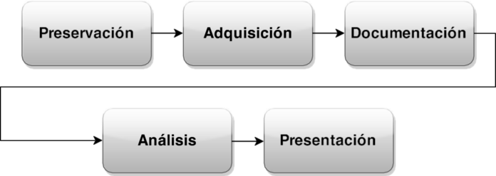

##  3.1.1 Recopilación y almacenamiento de evidencias

| Código | Descripción                                                                                                                |   |
|--------|----------------------------------------------------------------------------------------------------------------------------|---|
| RA3    | Investiga incidentes de ciberseguridad analizando los riesgos implicados y definiendo las posibles medidas a adoptar.      |   |
| CEa    | Se han recopilado y almacenado de forma segura evidencias de incidentes de ciberseguridad que afectan a la organización.   |   |

Se empieza una nueva unidad relacionada con la investigación de incidentes de ciberseguridad. Se empezará por la recopilación y almacenamiento seguro de evidencias. Posteriormente, se verán técnicas y herramientas para analizar las evidencias recopiladas.

### 1. Recopilación de evidencias

**Evidencias**: son los **datos** que se recopilan durante la investigación de un incidente de seguridad. Estos datos pueden ser de **distintos tipos** y **procedencias**, como logs, registros de eventos, capturas de red, imágenes de disco, etc. Esta información, por sí misma, o en combinación con otra información, se utiliza para *probar algo*.

**La recopilación de evidencias**: es un proceso crítico en la gestión de incidentes de seguridad. La **integridad**, **autenticidad** y **admisibilidad** de la evidencia son fundamentales para garantizar que los resultados de la investigación sean válidos y puedan ser utilizados en un juicio. La forma en la que se realiza el proceso de recogida de esta información es clave para una gestión eficaz de un incidente, y toda entidad debe estar lista para ejecutarla en cualquier momento..

Una buena **anticipación** y **entrenamiento previo** es clave para realizar una gestión eficaz de las evidencias, para lo que hace falta tener en cuenta tres pilares fundamentales: las personas, los procedimientos y la tecnología:    

* Personas: contar con personal especializado en la recopilación de evidencias, dentro de un equipo de respuesta a incidentes.
* Procedimientos: tener procedimientos claros y bien definidos para la gestión de incidentes, que incluyan la recopilación de evidencias.
* Herramientas: disponer de las herramientas necesarias para recopilar y analizar las evidencias de un incidente.

### 2. Metodologías de Recopilación y Almacenamiento

En el día a día se dan gran diversidad de incidentes, y de muchos tipos… como hemos visto hasta ahora. No obstante, una vez que se ha detectado un incidente, es necesario preservar y adquirir las evidencias de forma adecuada. Este primer paso forma parte del un conjunto de pasos que se deben seguir para llevar a cabo una investigación forense digital.

- Preservación: **mantener la integridad** de la evidencia.
- Adquisición: **recoger la evidencia** de forma que sea **admitida en un juicio**.
- Documentación: **documentar** el proceso de recogida de evidencias. Debe ser **preciso** y **detallado**.
- Análisis: **analizar** la evidencia de forma **imparcial**, con el objetivo de **extraer información**.
- Presentación: **presentar** la evidencia de forma **clara y comprensible**.

Existen distintas guías y estándares que proporcionan pautas para la recopilación y almacenamiento de evidencias digitales. De las distintas guías que existen, la **RFC 3227** es un estándar ampliamente usado.

- *[RFC 3227](https://www.ietf.org/rfc/rfc3227.txt)*

Aunque, tambien existen otras propuestas:

- *[Guidelines for the best practices in the forensic examination of digital technology](https://enfsi.eu/wp-content/uploads/2016/09/1.*forensic*examination*of*digital*technology*0.pdf)*
- *[Electronic Crime Scene Investigation: A Guide for First Responders](https://www.ncjrs.gov/pdffiles1/nij/187736.pdf)*
- *[Forensic Examination of Digital Evidence: A Guide for Law Enforcement](https://www.ncjrs.gov/pdffiles1/nij/199408.pdf)*
- *[UNE 71506 - Metodología para el análisis forense de las evidencias electrónicas](http://www.aenor.es/aenor/normas/normas/fichanorma.asp?tipo=N&codigo=N0051414&PDF=Si#.UmTshXC8B5H)*
- *[Good Practice Guide for Computer-Based Electronic Evidence ](https://www.7safe.com/docs/default-source/default-document-library/acpo*guidelines*computer*evidence*v4*web.pdf)*

### 3 RFC 3227

El RFC 3227 es un **documento** que recoge las directrices para la **recopilación** de evidencias y su **almacenamiento**.  Puede llegar a servir como **estándar de facto** para la recopilación de información en incidentes de seguridad.

#### 3.1. Principios

Principios durante la recolección de evidencias:

- Capturar una **imagen del sistema tan precisa** como sea posible.
- Realizar **anotaciones detalladas, incluyendo fechas y horas** indicando si se utiliza horario local o UTC (tiempo universal coordinado).
- **Minimizar los cambios en la información** que se está recolectando y eliminar los agentes externos que puedan hacerlo.
- En el caso de enfrentarse a un dilema entre recolección y análisis elegir **primero recolección y después análisis**.
- Recoger la información **según el orden de volatilidad** (de mayor a menor).
- Tener en cuenta que por cada dispositivo **la recogida de información puede realizarse de distinta manera**.

Algunas consideraciones a tener en cuenta:

##### 3.1.1. Orden de volatilidad

Período de **tiempo en el que está accesible cierta información**. Recolectar la de mayor volatilidad, según este orden:

- Registros y contenido de la caché
- Tabla de enrutamiento, caché ARP, tabla de procesos, estadísticas del kernel, memoria.
- Información temporal del sistema.
- Disco. 
- Logs del sistema.
- Configuración física y topología de la red.
- Documentos.

##### 3.1.2. Acciones a evitarse

Deben evitarse las acciones que invaliden el proceso de recolección de información, los resultados deben poder ser utilizados en un juicio si fuera necesario:

- **No apagar el ordenador** hasta que se haya recopilado toda la información.
- **No ejecutar programas** que modifiquen la fecha y hora de acceso de todos los ficheros del sistema.
- **No confiar en la información proporcionada por los programas del sistema**, ya que pueden haberse visto comprometidos.
- Recopilar la información mediante programas desde un **medio protegido**. Es decir, no se debe utilizar el sistema comprometido para recopilar la información.

##### 3.1.3. Consideraciones sobre la privacidad

- Es muy importante **tener en consideración las pautas de la empresa** en lo que a privacidad se refiere:   
   * Es habitual **solicitar una autorización** por escrito de quien corresponda para poder llevar a cabo la recolección de evidencias.
   * Este es un aspecto fundamental, ya que puede darse el caso de que se *trabaje con información confidencial* o de vital importancia para la empresa, o que *la disponibilidad de los servicios se vea afectada*.

* **No hay que entrometerse en la privacidad** de las personas sin una justificación:    
   * No se deben recopilar datos de lugares a los que normalmente no hay razón para acceder, como ficheros personales, a menos que haya suficientes indicios.

#### 3.2. Procedimiento de recolección

Debe de ser lo más detallado posible, procurando que no sea ambiguo y reduciendo al mínimo la toma de decisiones. Por tanto, el método utilizado para recolectar evidencias deben de ser **transparente** y **reproducible**. Se debe estar preparado para reproducir con precisión los métodos usados, y que dichos métodos hayan sido **testados por expertos independientes**.

Hay que tener en cuenta que la información recopilada debe ser **relevante** y **suficiente**.

Pasos para una recolección de evidencias efectiva:

- ¿Dónde está la evidencia? Listar **qué sistemas están involucrados** en el incidente y **de cuáles de ellos se deben tomar evidencias** .
- Establecer **qué es relevante** . En caso de duda es mejor recopilar mucha información que poca.
- Fijar el **orden de volatilidad** para cada sistema.
- **Obtener la información** de acuerdo al orden establecido
- Comprobar el **grado de sincronización del reloj del sistema** .
- Según se vayan realizando los pasos de recolección preguntarse **qué más puede ser una evidencia** .
- **Documentar cada paso**, el no encontrar una evidencia puede ser una evidencia en sí misma. Por tanto, hay que **documentar también lo que no se ha encontrado**.
- No olvidar a la gente involucrada. Tomar notas sobre **qué gente estaba allí, qué estaban haciendo, qué observaron y cómo reaccionaron**.

#### 3.3. Procedimiento de almacenado

La evidencia debe ser almacenada de forma segura para garantizar su integridad y autenticidad. La RFC 3227 proporciona una serie de pautas para el almacenamiento de evidencias, que deben ser seguidas para garantizar que las evidencias se almacenan de forma segura.

##### 3.3.1. Cadena de custodia

Debe estar claramente documentada y se deben detallar los siguientes puntos:

* ¿Dónde?, ¿cuándo? y ¿quién? **descubrió y recolectó la evidencia**.
* ¿Dónde?, ¿cuándo? y ¿quién? **manejó la evidencia**.
* ¿Quién ha custodiado la evidencia?, ¿cuánto tiempo? y ¿cómo la ha almacenado?.
* En el caso de que la evidencia cambie de custodia **indicar cuándo y cómo se realizó el intercambio**, incluyendo número de albarán, etc.

##### 3.3.2. Dónde y cómo almacenarlo

Se debe almacenar la información en dispositivos:

* Cuya **seguridad** haya sido **demostrada**.
* Que permitan el **acceso únicamente a personal autorizado** y **detectar intentos de acceso no autorizados**.
* Que **garanticen la integridad de la información**.

#### 3.4. Herramientas

Más que una lista de herramientas, la RFC 3227 proporciona una serie de **pautas** para la selección de herramientas, para la recolección:

* Herramientas externas al sistema, para evitar que hayan podido ser comprometidas.
* Herramientas que alteren lo mínimo posible el escenario (no GUI, evitar uso excesivo de memoria).
* Deben estar ubicados en un dispositivo de solo lectura. (CDROM, USB).
* Tener un kit básico de herramientas según S.O, que incluyan:    

   * Listar y examinar procesos.
   * Examinar el estado del sistema.
   * Realizar copias bit a bit.

### 4. Ejemplo de recopilación de evidencias
A continuación se muestra un ejemplo muy básico de recopilación de evidencias. 

**INCIDENTE**: Se ha detectado que el servidor web ha dejado de responder y se ha detectado un tráfico anómalo en la red. Se concluye que el servidor web ha sido atacado. Se ha detectado un ataque de denegación de servicio (DoS)

Tras detectar el ataque, se procede a la **recopilación de evidencias**:     

- Se ha identificado el servidor web afectado y se ha aislado de la red.    
- Se ha decidido recopilar evidencia de la memoria, del tráfico de red y del disco duro del servidor web.    

Se ha utilizado:     

- La herramienta `volatility` para la recopilación de evidencias que se encuentran en la memoria.    
- También se ha utilizado `wireshark` para la recopilación de tráfico de red.    
- Por último, para la recopilación de evidencias del disco duro se ha utilizado `dd`, creando una imagen del disco duro.    
 
En cuanto al **almacenamiento de evidencias**:

- Se ha almacenado la evidencia de la memoria en un fichero llamado `memoria.img`.    
- La evidencia del tráfico de red se ha almacenado en un fichero llamado `trafico.pcap`.    
- La evidencia del disco duro en un fichero llamado `disco.img`.    
- Estos ficheros se han almacenado en un dispositivo de almacenamiento seguro, con un sistema de detección de intentos de acceso no autorizados.    
- Se ha etiquetado el dispositivo de almacenamiento con la información de la evidencia almacenada.    

En cuanto a la **documentado la cadena de custodia**, ha quedado constancia de:    

- Quién ha descubierto y recolectado la evidencia.    
- Quién ha manejado la evidencia.    
- Quién ha custodiado la evidencia.    

De esta forma se ha recopilado evidencia de la memoria, del tráfico de red y del disco duro junto con la documentación de los pasos seguidos y la cadena de custodia, se ha recopilado evidencia de forma efectiva.

### 5. Conclusiones
Como hemos visto, la recopilación de evidencias es un proceso fundamental en la gestión de incidentes de seguridad. La RFC 3227 proporciona una serie de pautas para la recopilación de evidencias, que deben ser seguidas para garantizar que la recopilación de evidencias se realiza de forma efectiva. El almacenamiento de evidencias también es un proceso fundamental, y la RFC 3227 proporciona una serie de pautas para el almacenamiento de evidencias, que deben ser seguidas para garantizar que las evidencias se almacenan de forma segura. 
La cadena de custodia es un aspecto fundamental en la recopilación y almacenamiento de evidencias, y debe ser documentada de forma detallada.
Por último, es importante tener en cuenta que la recopilación y almacenamiento de evidencias debe ser realizada por personal cualificado, que siga las pautas proporcionadas por la RFC 3227. 

### 6. Bibliografía

* [https://www.incibe-cert.es/blog/rfc3227](https://www.incibe-cert.es/blog/rfc3227)
* [https://www.ietf.org/rfc/rfc3227.txt](https://www.ietf.org/rfc/rfc3227.txt)*

