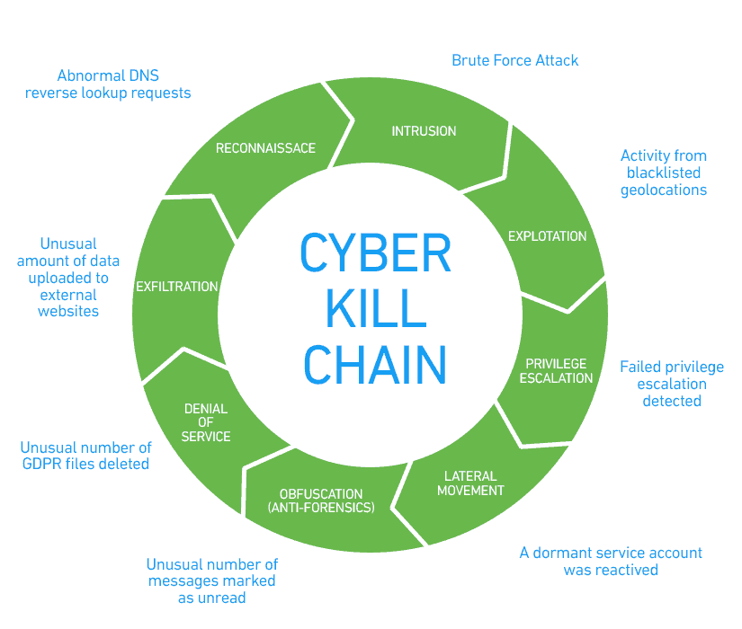
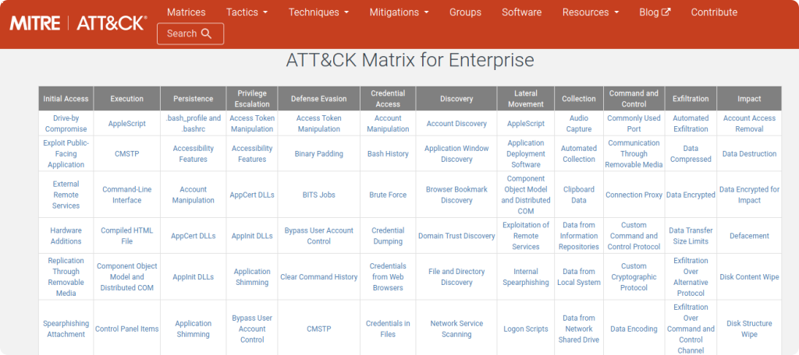
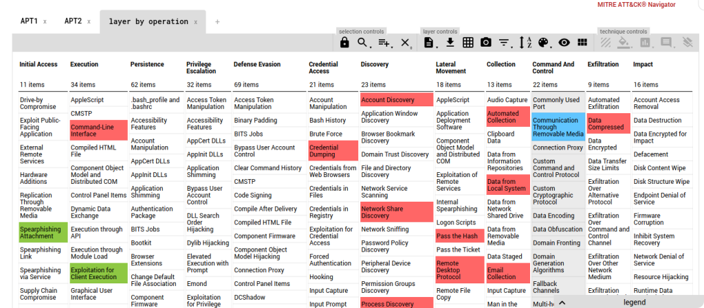
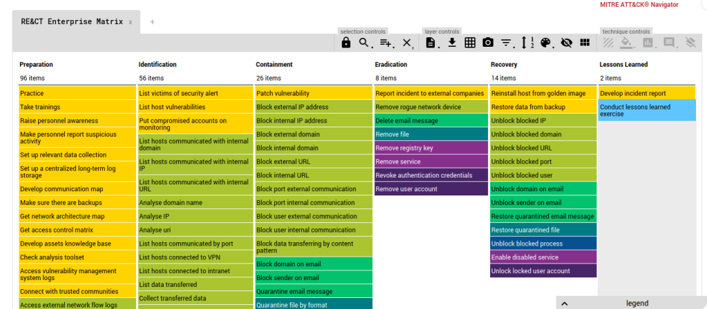
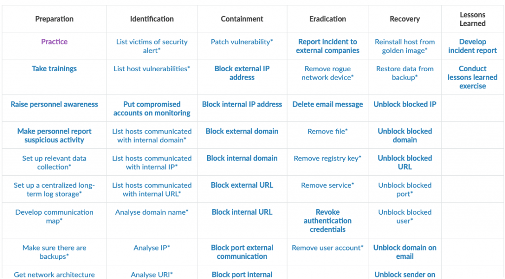
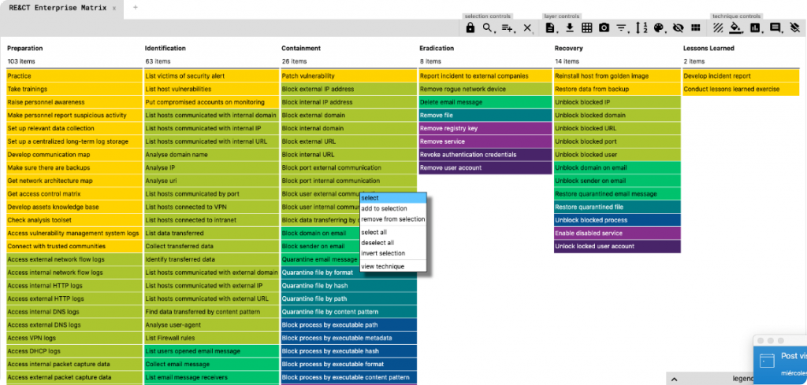
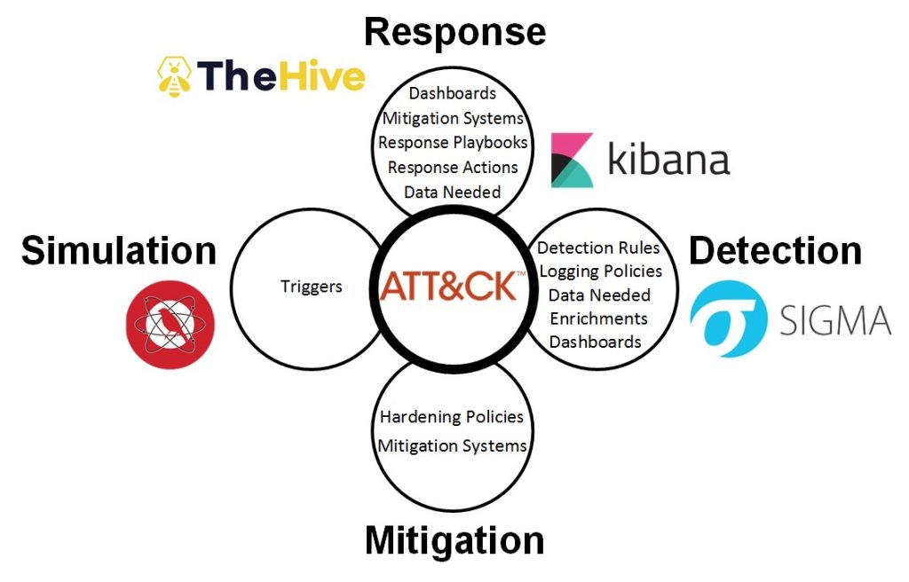

## ATT&CK y RE&CT!

> **RA3**
> a) c) Se ha realizado la investigación de incidentes de ciberseguridad.

### 
# ¿Qué es esto?

Tanto ATT&CK como RE&CT son marcos de trabajo que ayudan a cualquier persona en la industria de la seguridad, sin importar el color de su sombrero, a comprender más sobre cómo proteger o penetrar una infraestructura. Ambos marcos proporcionan un conocimiento colectivo que ayuda a ver de forma general la ciber kill chain desde varios ángulos, tanto en el punto de vista de los atacantes como en el de los defensores.

Básicamente, se trata de una base de datos de tácticas, técnicas y procedimientos (TTP), que está en constante evolución y que se puede utilizar de innumerables formas según el rol del usuario.

Los marcos ATT&CK y RE&CT se pueden explicar con gran detalle durante cientos de páginas, pero el enfoque de este artículo es llevarlo de 0 a 1 y darle un "por qué" para familiarizarse con estos marcos.

Fuente [https://www.exabeam.com/information-security/cyber-kill-chain/](https://www.exabeam.com/information-security/cyber-kill-chain/)

# Más, Mitre ATT&CK

Mitre attack se inició en 2013 y este marco es el origen de las colecciones TTP. Hay algunas características básicas del marco Mitre ATT&CK:

* Tácticas
* Técnicas
* Mitigación
* Grupos
* Software

Aunque estas son 5 categorías diferentes, estas se interconectan creando una malla, lo que hace que ATT&CK sea un arma formidable los contra los grupos APT. Como ejemplo, un threat hunter puede usar este marco de trabajo para formular una metodología para guiar su trabajo aplicando esto al modelo de diamante.

Fuente: [https://attack.mitre.org/matrices/enterprise/](https://attack.mitre.org/matrices/enterprise/)

Algo que no podemos olvidar sobre el marco es el [navegador Mitre ATT&CK](https://mitre-attack.github.io/attack-navigator/), una hoja técnica interactiva que ayuda a enfocar y priorizar ciertos TTP que son aplicables a una determinada infraestructura en lugar de todo el marco. No termina ahí, y el potencial del navegador depende de la imaginación del analista. Por ejemplo, si está investigando una infracción de seguridad de una institución financiera o tratando de asegurar una, sería mucho más fácil centrarse en los grupos APT FinX.

Fuente [https://mitre-attack.github.io/attack-navigator/enterprise/#](https://mitre-attack.github.io/attack-navigator/enterprise/#)

Algunos de los sectores donde  ATT&CK es útil:

* Inteligencia de amenazas
* Detección y análisis de ataques
* Emulación del adversario y formación de red team
* Evaluaciones e ingeniería

# ¿Qué es este RE&CT?

RE&CT deriva de ATT&CK, y se centra completamente en la respuesta a incidentes y sus etapas, en lugar de centrarse en la ciber kill chain. Esto se puede utilizar para:

* Identificación de brechas de seguridad
* Mejores capacidades de respuesta a incidentes

Al igual que ATT&CK, RE&CT también viene con un navegador que se puede utilizar para una mejor priorización de aquello que importa durante el análisis.

Fuente: [https://atc-project.github.io/react-navigator/](https://atc-project.github.io/react-navigator/)

# Profundizando en RE&CT

Con [RE@CT](https://atc-project.github.io/atc-react/), el concepto es similar, una matriz en la que podemos identificar las técnicas empleadas en la respuesta a incidentes. Pero no te quedes con el DFIR, vamos a darle nuestra “visión”.

La matriz identifica las distintas fases en:

* Preparación.
* Identificación.
* Contención.
* Erradicación.
* Recuperación
* Lecciones aprendidas.

En DFIR tendrás definidas estas fases en tus procesos, con estos u otros nombres.

Por ejemplo, la fase de preparación, MUY importante: si no tienes “cámaras de video” luego no me pidas que revise el video…

Las técnicas que nos enumera la matriz son una guía fenomenal para nuestros departamentos de administración de sistemas, de seguridad, nuestro blue team.

Por ejemplo,

RA1006 Set up a centralized long-term log storage. El framework nos está diciendo que tenemos que tener un almacenamiento longevo para nuestros logs. No el que usamos en el SIEM en el mejor de los casos… uno más barato, lento, poco inteligente, pero que nos permita tirar de eventos pasados.

RA1103 y 04, acceso a los logs http. Tenemos los logs del server que hosteamos en nuestra empresa, pero no los la web que tenemos en el proveedor… pero ¿qué pasa si nos hacen un defacement en la web pública? nos quedamos sin poder investigar nada…porque claro… estaba “fuera”…

Logs de DHCP, posiblemente ya los guardas y los exportas de su ubicación por defecto…pero por si acaso, sirva esta guía para tener un control de cuáles son estas medidas.

Si seguimos con la fase de identificación, se encuentrán un montón de ideas que siempre tenemos en mente ¿eres capaz de detectar un fichero borrado? ¿Modificado? Una clave del registro?

Contención, la parte a la que más valor se le suele dar, ¿pero estás preparado? Puedes bloquear un puerto interno ¿ puedes cambiar una ACL en un Switch para una Vlan? Una mac? Todas estas reflexiones las debes hacer antes de tener un incidente, o al menos, tener claro el procedimiento. Nos pasa en muchos clientes que se puede, pero lo lleva “otra empresa” y no se sabe muy bien quien es… se pierde tiempo, que en la contención es primordial.

No creo que haga falta seguir con la enumeración. Lo que si es interesante es que igual que ocurre con Mitre, que tenemos un proyecto de la matriz navegable, con Re@Ct tenemos lo mismo, [un mapa en el que podemos trabajar los ítems](https://atc-project.github.io/react-navigator/), dándole el enfoque que queramos.

En este caso, tenemos una categorización por colores de las técnicas enumeradas, en referencia a si son elementos generales, de red, correo, ficheros, procesos, etc… pero lo bueno del map es que podemos configurarlo de la manera que queramos, por ejemplo, pintando el grado de madurez de nuestra organización, imagina un semáforo, y pintamos para cada técnica, si lo tenemos bien (verde), si lo tenemos en el radar o pendiente (amarillo) o si no tenemos cobertura ninguna de la técnica ( rojo). Me parece muy interesante a la hora de documentar a clientes su estado de madurez ante una respuesta a incidentes.

El proyecto es mucho más ambicioso, ya que contempla la recopilación de playbooks, una comunidad donde podamos crear elementos “accionables” que además, podemos importar en nuestro The Hive/Cortex &MISP como elementos de automatización de tareas…

Pero por si fuera poco, es una pata del proyecto  [Atomic Threat Coverage](https://github.com/atc-project/atomic-threat-coverage), lo que pretende ser el punto de unión de “todo esto” que hablamos de Mitre, reglas Sigma de detección, playbooks para automatizar, lenguaje de marcas para poder documentar mitigaciones, procesos de red team para generar el “ruido”, un proyecto BRUTAL que pone nombre y apellidos a toda la cadena de valor desde la nomenclatura del ataque, hasta la detección, hasta lecciones aprendidas, fortificación…

Si bien esto es un proyecto ambicioso, orientado a la respuesta a incidentes, nos lo podemos llevar a nuestro terreno defensivo.

# ¿ATT&CK o RE&CT?

Y ¿por qué no ambos? Estos dos marcos se crean con diferentes perspectivas de enfoque, según el rol de uso del marco.. Por lo tanto, familiarizarse con estos marcos y utilizarlos le dará una ventaja adicional sobre los adversarios, así como también lo ayudará a ser proactivo para poder prevenir los incidentes por completo.

# Fuente:

* [Should I RE&CT or ATT&CK](https://vidura-supun.github.io/2020/06/08/should-i-rect-or-attck/)
* [No es matrix, es la matriz RE@CT de respuesta a incidentes](https://blogvisionarios.com/articulos-ciberseguridad/no-es-matrix-es-la-matriz-react-respuesta-incidentes/)

# Recursos:

* Mitre ATT&CK: [https://attack.mitre.org/](https://attack.mitre.org/)
* RE&CT: [https://atc-project.github.io/atc-react/](https://atc-project.github.io/atc-react/)
* RE&CT navigator: [https://atc-project.github.io/react-navigator/](https://atc-project.github.io/react-navigator/)
* Charlas: [https://github.com/aboutsecurity/Talks-and-Presentations](https://github.com/aboutsecurity/Talks-and-Presentations) (hay video tb)
* eBook: [https://github.com/Incidentes/Incident-Response-with-Threat-Intelligence](https://github.com/Incidentes/Incident-Response-with-Threat-Intelligence)

**

