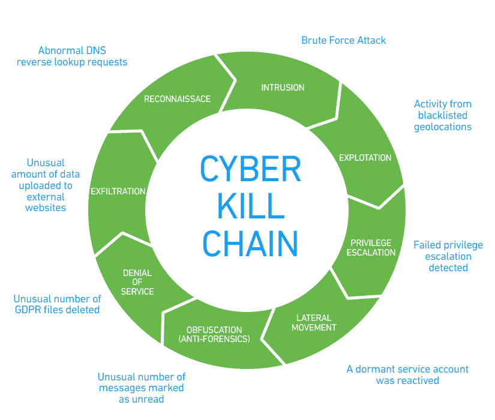
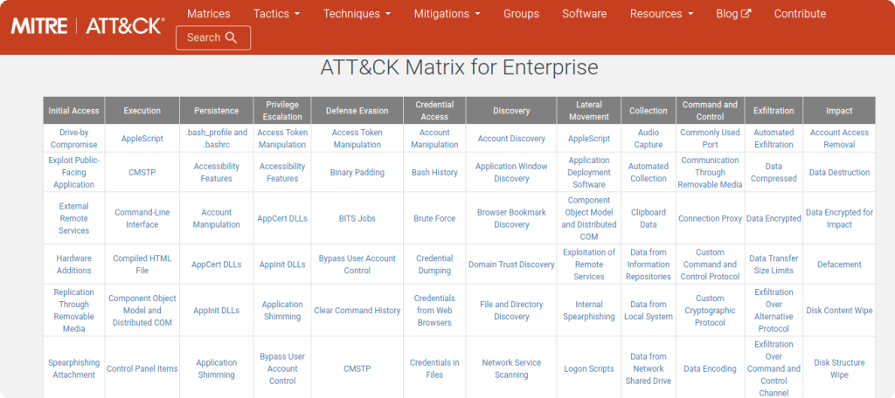
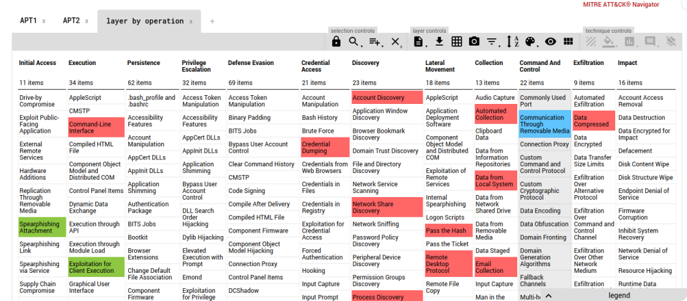
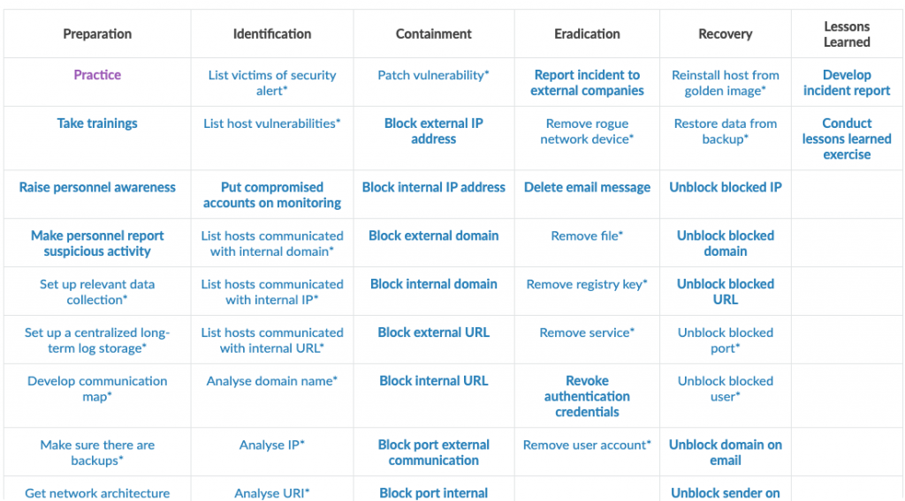
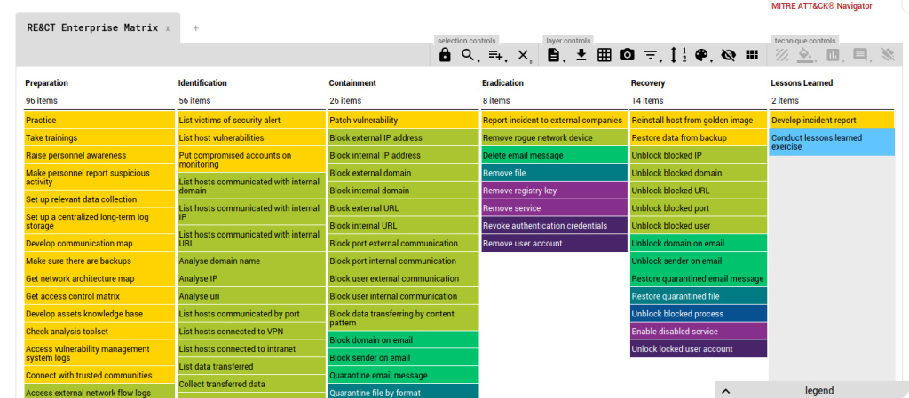
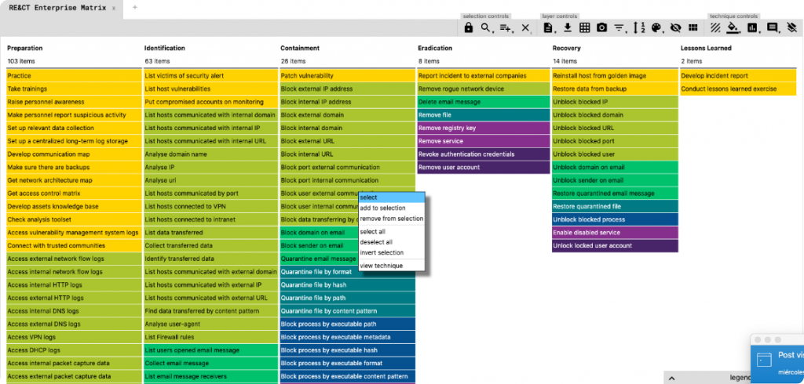

## 3.3.1. MITRE ATT&CK y RE&CT para investigar y responder a incidentes

Cuando se investiga un incidente no basta con mirar logs y alarmas sueltas. Hace
falta un lenguaje común para describir **qué está haciendo el adversario** y,
además, una forma ordenada de decidir **cómo debe responder el equipo**.

Ahí es donde entran dos marcos muy útiles:

- **MITRE ATT&CK**, que ayuda a describir el comportamiento del atacante.
- **RE&CT**, que ayuda a organizar la respuesta ante el incidente.

| Código | Descripción |
| ------- | ----------- |
| RA3 | Investiga incidentes de ciberseguridad analizando los riesgos implicados y definiendo las posibles medidas a adoptar. |
| CEc | Se ha realizado la investigación de incidentes de ciberseguridad. |

!!! definition "Idea base"
    **ATT&CK** sirve para entender y clasificar las tácticas y técnicas del
    adversario. **RE&CT** sirve para decidir qué acciones de respuesta e
    investigación conviene aplicar en cada fase del incidente.

### 1. Por qué estos marcos importan en esta unidad

En una investigación real suelen aparecer preguntas como estas:

- ¿lo que estoy viendo encaja con una técnica conocida?;
- ¿qué puede intentar hacer el atacante después?;
- ¿qué controles o búsquedas conviene activar ahora?;
- ¿cómo organizo la respuesta sin improvisar?;
- ¿qué acciones debo tener preparadas antes de que ocurra el incidente?

ATT&CK y RE&CT ayudan precisamente a responder a esas preguntas.

En términos sencillos:

- **ATT&CK** mira el incidente desde el punto de vista del comportamiento del
  adversario.
- **RE&CT** lo mira desde el punto de vista de la respuesta del equipo
  defensor.

<figure markdown>
  
  <figcaption>Los marcos de análisis ayudan a situar las acciones del atacante y a responder con más criterio.</figcaption>
</figure>

### 2. Qué es MITRE ATT&CK

**MITRE ATT&CK** es una base de conocimiento que recopila **tácticas,
técnicas y sub-técnicas** observadas en ataques reales. Su valor no está en
“poner nombres bonitos”, sino en ofrecer una forma común de describir el
comportamiento del adversario.

Esto es importante porque permite que analistas, equipos SOC, CSIRT, personal
de sistemas y responsables de seguridad hablen del incidente con el mismo
vocabulario.

#### 2.1. Tácticas, técnicas y sub-técnicas

Una de las primeras cosas que hay que entender bien es la diferencia entre
estos conceptos:

| Concepto        | Qué representa                            | Ejemplo sencillo                                                              |
|-----------------|-------------------------------------------|-------------------------------------------------------------------------------|
| **Táctica**     | El objetivo inmediato del atacante        | Persistencia, movimiento lateral, exfiltración                                |
| **Técnica**     | La forma general de alcanzar ese objetivo | Crear una tarea programada, usar credenciales robadas                         |
| **Sub-técnica** | Una variante más concreta de la técnica   | Crear una tarea concreta en Windows, usar un tipo específico de acceso remoto |

!!! tip "Cómo recordarlo"
    Una forma fácil de memorizarlo es esta: la **táctica** responde al
    **para qué**, mientras que la **técnica** responde al **cómo**.

#### 2.2. Qué información aporta ATT&CK

ATT&CK no se limita a listar técnicas. También relaciona:

- grupos o actores que usan esas técnicas;
- software o herramientas asociadas;
- mitigaciones recomendadas;
- detecciones posibles;
- y referencias cruzadas útiles para investigación e inteligencia.

Esto convierte ATT&CK en una herramienta muy útil para:

- **investigar incidentes**;
- **crear detecciones**;
- **hacer threat hunting**;
- **priorizar controles defensivos**;
- y **explicar mejor un incidente**.

<figure markdown>
  
  <figcaption>La matriz MITRE ATT&CK organiza tácticas y técnicas para describir comportamientos observados en ataques reales.</figcaption>
</figure>

### 3. Cómo se usa ATT&CK en investigación de incidentes

En una investigación, ATT&CK ayuda a traducir hechos técnicos en una secuencia
de comportamiento del atacante.

Por ejemplo, imagina este caso:

- un correo sospechoso llega a un buzón;
- la persona usuaria abre el adjunto;
- aparece un proceso de `powershell.exe`;
- después hay una conexión a un dominio no habitual;
- y más tarde se detecta persistencia.

Sin un marco de análisis, esto puede quedarse en una lista de eventos. Con
ATT&CK, el equipo puede empezar a describir lo ocurrido con más contexto:

- **phishing** o entrega por correo;
- **ejecución** de *scripts* o comandos;
- **persistencia**;
- **mando y control**;
- posible **robo de credenciales** o **movimiento lateral**.

Eso no sustituye a la evidencia, pero ayuda a:

- estructurar la investigación;
- anticipar pasos siguientes del adversario;
- buscar otros equipos afectados;
- y comunicar mejor el caso.

!!! example "Ejemplo didáctico"
    Si en un host observas un cambio de registro para persistencia, ATT&CK te
    permite clasificar ese comportamiento dentro de una técnica concreta. A
    partir de ahí, puedes preguntarte qué otras técnicas suelen aparecer junto
    a esa y qué controles o búsquedas defensivas conviene activar.

#### 3.1. Qué aporta ATT&CK Navigator

Además de la matriz general, ATT&CK dispone de una herramienta muy práctica:
**ATT&CK Navigator**.

El Navigator permite trabajar con capas (*layers*) para:

- marcar técnicas observadas en un incidente;
- priorizar técnicas relevantes para una organización;
- reflejar cobertura defensiva;
- comparar qué ve un equipo y qué no ve;
- y documentar el grado de madurez del entorno.

<figure markdown>
  
  <figcaption>ATT&CK Navigator permite resaltar técnicas, priorizarlas y visualizar cobertura o huecos de detección.</figcaption>
</figure>

En clase o en una organización real, esto puede usarse de varias formas:

- para marcar técnicas vistas en un incidente concreto;
- para representar qué tácticas detecta bien el SOC;
- para identificar lagunas de visibilidad;
- o para preparar simulaciones de red team y blue team.

### 4. Qué es RE&CT

Si ATT&CK describe al adversario, **RE&CT** describe mejor la parte defensiva y
de respuesta.

RE&CT es un marco orientado a **respuesta a incidentes y DFIR** (*Digital
Forensics and Incident Response*). Organiza acciones y técnicas relacionadas con
las fases habituales de la respuesta, por ejemplo:

- **preparación**;
- **identificación**;
- **contención**;
- **erradicación**;
- **recuperación**;
- **lecciones aprendidas**.

Su valor práctico está en que ayuda a responder preguntas como estas:

- ¿qué información debería estar recogiendo ya?;
- ¿qué controles necesito tener preparados antes del incidente?;
- ¿qué acciones de contención puedo aplicar en esta fase?;
- ¿qué evidencias debo conservar para no perder contexto?;
- ¿qué playbooks conviene tener definidos?

<figure markdown>
  
  <figcaption>RE&CT organiza técnicas y acciones defensivas alrededor de las fases de la respuesta a incidentes.</figcaption>
</figure>

#### 4.1. RE&CT no sustituye a ATT&CK

Este punto es importante: **RE&CT no compite con ATT&CK**.

Ambos marcos responden a preguntas distintas:

- ATT&CK ayuda a entender **qué hace el atacante**.
- RE&CT ayuda a decidir **cómo debe responder el equipo**.

Por eso RE&CT resulta especialmente útil para:

- definir playbooks;
- revisar preparación técnica y organizativa;
- comprobar qué datos y logs hacen falta;
- valorar si un equipo está realmente preparado para contener e investigar;
- y mejorar la madurez de la respuesta.

#### 4.2. RE&CT Navigator

Igual que ATT&CK tiene su Navigator, RE&CT también cuenta con herramientas para
trabajar visualmente la cobertura de respuesta.

<figure markdown>
  
  <figcaption>El navegador de RE&CT permite priorizar acciones de respuesta y visualizar cobertura por fases.</figcaption>
</figure>

Esto puede ser útil, por ejemplo, para marcar:

- acciones que ya están cubiertas;
- acciones que el equipo puede ejecutar parcialmente;
- acciones que todavía no están preparadas;
- o medidas que dependen de terceros y deberían revisarse antes de un incidente.

### 5. Cómo se complementan ATT&CK y RE&CT

La combinación de ambos marcos es especialmente útil en investigación y
respuesta a incidentes.

| Si necesitas...                           | Te ayuda más...    |
|-------------------------------------------|--------------------|
| Describir técnicas del atacante           | **ATT&CK**         |
| Entender el comportamiento observado      | **ATT&CK**         |
| Construir reglas de detección o *hunting* | **ATT&CK**         |
| Organizar acciones de respuesta           | **RE&CT**          |
| Revisar preparación y playbooks           | **RE&CT**          |
| Coordinar investigación y respuesta       | **ATT&CK + RE&CT** |

#### 5.1. Un ejemplo práctico de uso combinado

Supongamos un incidente de *phishing*:

1. Llega un correo con un enlace malicioso.
2. La persona usuaria pulsa el enlace.
3. El equipo descarga una carga adicional.
4. Se detecta persistencia y tráfico hacia un dominio externo.

Con **ATT&CK**, el equipo puede describir:

- el vector de entrada;
- la ejecución;
- la persistencia;
- y el mando y control.

Con **RE&CT**, el equipo puede decidir:

- qué evidencias recoger primero;
- qué cuentas o equipos aislar;
- qué bloqueos aplicar en DNS, proxy o firewall;
- y qué playbook seguir para contener sin perder evidencia.

!!! note "Idea importante"
    ATT&CK ayuda a **leer el ataque**. RE&CT ayuda a **organizar la respuesta**.
    Usados juntos, mejoran tanto la investigación como la toma de decisiones.

### 6. Ejemplos de uso didácticos en clase o en un SOC

Estos marcos no son solo teoría. Se pueden aplicar de forma muy práctica.

#### 6.1. Uso didáctico de ATT&CK

ATT&CK puede utilizarse en clase para:

- clasificar comportamientos observados en un caso;
- relacionar indicadores con tácticas y técnicas;
- comparar campañas distintas;
- o justificar por qué cierta evidencia es relevante en una investigación.

Por ejemplo, si el alumnado analiza un incidente y detecta:

- un adjunto malicioso;
- ejecución de macros o *scripts*;
- cambios de persistencia;
- y tráfico a un dominio extraño;

puede usar ATT&CK para ordenar la investigación y expresarla con un lenguaje
común.

#### 6.2. Uso de RE&CT

RE&CT puede utilizarse para:

- comprobar si el equipo sabría responder;
- diseñar un playbook mínimo;
- revisar qué logs hacen falta;
- o detectar carencias de preparación antes de que ocurra el incidente real.

Un ejercicio sencillo podría consistir en preguntar:

- ¿tenemos acceso a logs de correo?;
- ¿podemos aislar un endpoint rápidamente?;
- ¿sabemos revocar sesiones o tokens?;
- ¿tenemos forma de conservar evidencias críticas?;
- ¿quién decide qué hacer si el servicio afectado es crítico?

Estas preguntas conectan muy bien con la práctica real, porque muestran que la
respuesta a incidentes no depende solo de herramientas, sino también de
procedimientos y preparación previa.

<figure markdown>
  
  <figcaption>RE&CT también puede emplearse para representar el nivel de madurez o cobertura defensiva de una organización.</figcaption>
</figure>

### 7. Cuándo usar ATT&CK, cuándo usar RE&CT y cuándo usar ambos

La respuesta corta es esta:

- usa **ATT&CK** cuando necesites describir y entender el comportamiento del
  atacante;
- usa **RE&CT** cuando necesites organizar la respuesta y comprobar si el
  equipo está preparado;
- usa **ambos** cuando estés investigando un incidente real y necesites tanto
  entender el ataque como responder con orden.

En la práctica, lo más habitual es combinarlos:

- **ATT&CK** para interpretar el incidente;
- **RE&CT** para convertir esa interpretación en acciones de respuesta.

### 8. Qué debes recordar

- **MITRE ATT&CK** es una base de conocimiento sobre tácticas y técnicas
  observadas en ataques reales.
- La diferencia clave es que la **táctica** indica el objetivo del atacante y
  la **técnica** indica cómo intenta conseguirlo.
- **ATT&CK Navigator** ayuda a visualizar técnicas observadas, priorizarlas y
  medir cobertura.
- **RE&CT** está orientado a la respuesta a incidentes y a la preparación del
  equipo defensor.
- ATT&CK y RE&CT **no compiten**: se complementan.
- En una investigación real, ATT&CK ayuda a entender el ataque y RE&CT ayuda a
  organizar la respuesta.

!!! success "Idea final"
    Si ATT&CK te ayuda a responder **qué está haciendo el adversario**, RE&CT
    te ayuda a responder **qué debe hacer tu equipo ahora**. Ese es el valor de
    usar ambos marcos juntos.

## Recursos y referencias

- MITRE ATT&CK: [https://attack.mitre.org/](https://attack.mitre.org/)
- ATT&CK Navigator: [https://mitre-attack.github.io/attack-navigator/](https://mitre-attack.github.io/attack-navigator/)
- RE&CT: [https://atc-project.github.io/atc-react/](https://atc-project.github.io/atc-react/)
- RE&CT Navigator: [https://atc-project.github.io/react-navigator/](https://atc-project.github.io/react-navigator/)
- Atomic Threat Coverage: [https://github.com/atc-project/atomic-threat-coverage](https://github.com/atc-project/atomic-threat-coverage)
