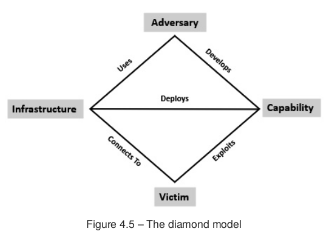
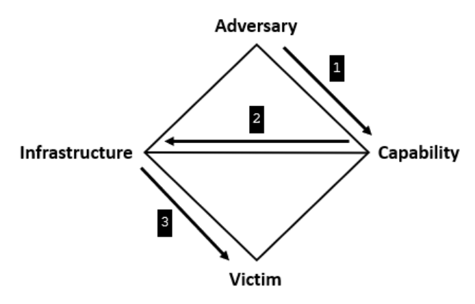
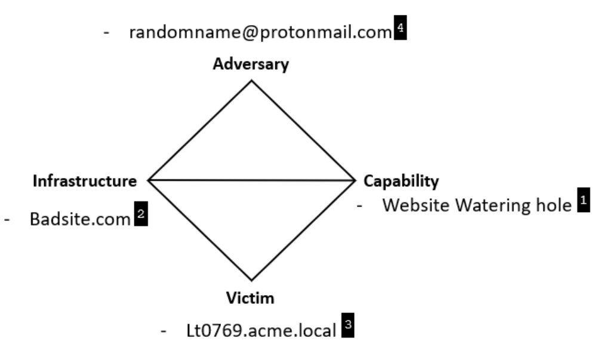

## 3.3.2. Investigación de incidentes de ciberseguridad

Detectar una alerta no equivale a entender un incidente. La investigación empieza
cuando el equipo necesita responder con criterio a preguntas como estas: **qué ha
pasado, cómo ha pasado, qué alcance tiene, qué impacto ha tenido y qué hay que
cambiar para que no vuelva a ocurrir**.


<figcaption>Relación entre forense digital, investigación de incidentes y respuesta a incidentes.</figcaption>
</figure>


En esta parte del tema vamos a centrarnos en cómo se organiza esa investigación.
La idea principal es sencilla: **no se investiga “a ver qué sale”, sino para
confirmar o descartar una hipótesis a partir de evidencias**.

> Este tema está directamente alineado con el RA 3:    
>    - c) se ha realizado la investigación de incidentes de ciberseguridad.

!!! definition "Definición"
    La investigación de incidentes es el proceso ordenado mediante el cual se
    **formula una hipótesis**, se **recopilan evidencias digitales**, se
    **correlacionan los hechos** y se obtiene una explicación técnica útil para
    responder al incidente.

### 1. Para qué sirve investigar un incidente

Una investigación bien hecha no se limita a señalar “el equipo infectado” o “el
fichero malicioso”. Su finalidad real es mucho más amplia:

- **delimitar el alcance**, para saber qué sistemas, cuentas o servicios están
  implicados;
- **identificar la causa raíz**, es decir, la vía de entrada o el fallo que ha
  permitido el incidente;
- **reconstruir la secuencia de hechos**, desde el acceso inicial hasta el
  impacto final;
- **extraer indicadores y TTP**, útiles para contener, buscar más casos y
  mejorar la defensa;
- **documentar conclusiones y recomendaciones**, de forma que la organización
  pueda actuar con criterio.

!!! tip "Idea importante"
    Investigar no es una tarea separada de la respuesta al incidente. Sirve para
    orientar la contención, apoyar la erradicación y justificar las decisiones
    técnicas.

### 2. Tipos de análisis de investigación de incidentes

No todas las investigaciones tienen la misma profundidad. En la práctica, el
tipo de análisis depende del impacto del incidente, del tiempo disponible, de la
evidencia que exista y de los recursos del equipo.

Podemos distinguir cinco niveles habituales:

| Tipo de análisis           | Objetivo principal                                                 | Resultado esperado                         |
|----------------------------|--------------------------------------------------------------------|--------------------------------------------|
| **Análisis de detección**  | Confirmar si una alerta realmente apunta a un incidente            | Validar o descartar el evento              |
| **Análisis preliminar**    | Obtener visibilidad rápida sobre alcance e impacto inicial         | Decidir si hay que escalar y contener      |
| **Análisis de causa raíz** | Explicar cómo empezó el incidente y qué hizo posible el compromiso | Corregir fallos y reducir riesgo futuro    |
| **Análisis de intrusión**  | Reconstruir con detalle el comportamiento del adversario           | Entender TTP, fases y objetivos del ataque |
| **Análisis de atribución** | Relacionar la intrusión con un actor concreto                      | Inteligencia de amenazas avanzada          |

<figure markdown="span">

<figcaption>Tipos de investigación de incidentes según profundidad, tiempo y esfuerzo necesarios.</figcaption>
</figure>

Conviene entender bien qué aporta cada uno:

#### 2.1. Análisis de detección

Es el análisis más básico. Suele empezar con una alerta del SIEM, del EDR, del
antivirus o de otra fuente de telemetría. Su objetivo no es explicarlo todo,
sino responder a una pregunta muy concreta: **¿esto es un falso positivo o puede
ser un incidente real?**

#### 2.2. Análisis preliminar

Cuando el incidente todavía es ambiguo, el equipo necesita una visión rápida de
lo esencial: qué equipo está afectado, si hay persistencia, si existe movimiento
lateral o si el impacto podría extenderse. Este análisis ayuda a **ganar tiempo
para contener sin trabajar completamente a ciegas**.

#### 2.3. Análisis de causa raíz

Aquí la pregunta principal es: **¿cómo ha entrado el atacante y qué ha hecho?**
Es un análisis muy útil porque permite corregir la debilidad que ha hecho
posible el incidente: una mala configuración, una credencial expuesta, un
servicio vulnerable o un correo de *phishing*, por ejemplo.

#### 2.4. Análisis de intrusión

Va más allá de la causa raíz. Intenta reconstruir la intrusión completa y
entender el comportamiento del adversario: qué infraestructura ha usado, qué
capacidades ha desplegado, qué objetivo perseguía y cómo ha ido avanzando por el
entorno. Es un análisis más lento y exigente, pero también mucho más rico.

#### 2.5. Análisis de atribución

Es el nivel más complejo. Su meta es vincular la intrusión con un grupo o actor
concreto. En entornos normales no suele ser responsabilidad directa del CSIRT,
porque requiere mucho tiempo, grandes volúmenes de datos y apoyo de inteligencia
de amenazas.

!!! note "Qué debes recordar"
    En una organización corriente, lo más habitual es trabajar sobre **detección,
    análisis preliminar, causa raíz y análisis de intrusión**. La atribución
    suele quedar para equipos especializados.

### 3. Metodología funcional de informática forense digital

Una investigación útil necesita un método. Si el equipo revisa datos sin orden,
mezcla hipótesis con conclusiones o no documenta lo que hace, el resultado será
confuso incluso aunque haya encontrado evidencias valiosas.

La idea central de la metodología funcional de informática forense digital es
esta: **partir de una hipótesis y ponerla a prueba con evidencias**.

Por ejemplo, una hipótesis inicial podría ser:

- el acceso inicial se produjo por un correo de *phishing*;
- el atacante entró mediante credenciales robadas;
- se explotó un servicio expuesto a internet;
- o se reutilizó una cuenta comprometida para acceder por VPN.

La hipótesis sirve para orientar la investigación, pero **no es la conclusión**.
Si la evidencia no la sostiene, debe cambiarse.

!!! example "Ejemplo"
    Si sospechas que la infección empezó por *phishing*, tendrás que revisar el
    correo original, sus cabeceras, los enlaces o adjuntos, la actividad del
    equipo, los procesos ejecutados y las conexiones posteriores. Si los datos
    apuntan a otra vía de entrada, la hipótesis inicial debe descartarse.

#### 3.1. Las 10 fases de trabajo

Una forma práctica de organizar la investigación es seguir estas diez fases:

1. **Identificación y delimitación del alcance**.
2. **Recopilación de evidencia**.
3. **Análisis inicial de eventos**.
4. **Correlación preliminar**.
5. **Normalización de eventos**.
6. **Desconflicción de eventos**.
7. **Segunda correlación**.
8. **Construcción de la línea temporal**.
9. **Análisis con cadena de ataque y otros modelos**.
10. **Elaboración del informe**.

<figure markdown="span">

<figcaption>Metodología funcional de investigación: de la detección inicial al informe final.</figcaption>
</figure>

Veamos qué aporta cada fase:

#### 3.2. Identificación y delimitación del alcance

La investigación empieza cuando una alerta o una comunicación humana indica que
puede haber un incidente. Aquí se busca responder a dos preguntas:

- **qué ha activado la investigación**;
- **qué activos podrían estar implicados**.

Delimitar bien el alcance evita perder tiempo analizando sistemas que no tienen
relación con el caso.

#### 3.3. Recopilación de evidencia

Una vez delimitado el incidente, toca reunir evidencias. En este punto es clave
tener presente la **volatilidad**: memoria, procesos, conexiones activas o logs
de corta retención pueden desaparecer rápidamente.

Entre las fuentes más habituales están:

- logs del sistema operativo;
- telemetría de EDR, antivirus o SIEM;
- registros de firewall, proxy, DNS y correo;
- artefactos del sistema de ficheros;
- tareas programadas, servicios, procesos y claves de persistencia.

#### 3.4. Análisis inicial de eventos

En esta fase se revisan los datos para localizar eventos sospechosos e
indicadores relevantes. Normalmente aparecen tres tipos de indicadores:

- **atómicos**, como una IP, un dominio o una dirección de correo;
- **computacionales**, como un hash o una firma;
- **de comportamiento**, como una secuencia de acciones que dibuja una técnica.

Todavía puede haber falsos positivos. El objetivo aquí no es cerrar el caso,
sino separar lo que merece atención de lo que probablemente no la merece.

#### 3.5. Correlación preliminar

La correlación consiste en unir hechos que, por separado, dicen poco, pero
juntos explican mejor lo ocurrido. Por ejemplo:

- el correo deja rastro en el servidor de correo;
- la apertura del adjunto deja rastro en el endpoint;
- el *payload* deja rastro en el EDR;
- y la conexión al exterior aparece en proxy, DNS o firewall.

Cuando esos datos se encajan en la misma secuencia, la investigación gana valor.

#### 3.6. Normalización y desconflicción

Normalizar significa describir los eventos con una sintaxis coherente. Aquí
resultan útiles marcos como **MITRE ATT&CK**, porque permiten expresar el
comportamiento observado con un vocabulario común.

Desconflictuar significa eliminar ruido, duplicidades o contradicciones. No todo
lo sospechoso es malicioso, y no todo lo repetido aporta más evidencia.

#### 3.7. Segunda correlación y línea temporal

Una vez depurados los datos, el analista vuelve a correlacionarlos para
construir una **línea temporal** sólida. La cronología es esencial porque ayuda
a responder preguntas como estas:

- qué ocurrió primero;
- qué acciones vinieron después;
- cuánto tiempo estuvo activo el atacante;
- y en qué momento se produjo el impacto principal.

#### 3.8. Análisis con marcos de intrusión

Llegados a este punto, ya no basta con tener eventos ordenados. Ahora hace falta
darles contexto. Para eso se usan modelos como:

- la **Cyber Kill Chain**, que sitúa cada acción dentro de una fase del ataque;
- el **modelo de diamante**, que relaciona adversario, capacidad,
  infraestructura y víctima.

#### 3.9. Elaboración del informe

La investigación termina cuando se puede explicar el incidente con claridad. Un
buen informe técnico debería dejar claro:

- qué ha ocurrido;
- cómo se produjo;
- qué activos se vieron afectados;
- qué evidencias sostienen las conclusiones;
- y qué medidas deben aplicarse después.

!!! warning "Error frecuente"
    Un equipo puede hacer un análisis técnico correcto y perder gran parte de su
    valor si documenta tarde, documenta mal o no deja claras las evidencias que
    sostienen sus conclusiones.

### 4. La cadena de ciberataque (*Cyber Kill Chain*)

La línea temporal nos dice **en qué orden** ocurrieron los hechos, pero no
siempre explica **en qué fase del ataque** se encontraba el adversario. Para
eso resulta útil la **Cyber Kill Chain**, un modelo que organiza la intrusión en
siete fases.

<figure markdown="span">

<figcaption>La Cyber Kill Chain permite situar cada evidencia dentro de la secuencia del ataque.</figcaption>
</figure>

Las siete fases son estas:

| Fase                             | Qué hace el adversario                           | Qué interesa al analista                                       |
|----------------------------------|--------------------------------------------------|----------------------------------------------------------------|
| **Reconocimiento**               | Reúne información sobre la víctima               | Detectar huellas previas, exposición y preparación del ataque  |
| **Armamentización**              | Prepara malware, *exploit* o documento malicioso | Entender la capacidad que se ha construido                     |
| **Entrega**                      | Hace llegar la carga al objetivo                 | Identificar el vector: correo, web, USB, descarga, etc.        |
| **Explotación**                  | Aprovecha una vulnerabilidad técnica o humana    | Confirmar cómo se produjo el compromiso inicial                |
| **Instalación**                  | Establece persistencia                           | Localizar artefactos, cambios de sistema o puertas traseras    |
| **Mando y control**              | Abre un canal para controlar el sistema          | Encontrar comunicaciones C2 y su infraestructura               |
| **Acciones sobre los objetivos** | Ejecuta el objetivo final                        | Medir impacto real: robo, cifrado, sabotaje, fraude, espionaje |

#### 4.1. Qué aporta este modelo

La cadena de ataque es útil porque ayuda a entender que una intrusión no es un
hecho aislado, sino una **secuencia de pasos**. Si el equipo identifica en qué
fase está el adversario, puede orientar mejor la investigación y la respuesta.

Por ejemplo:

- si estamos viendo **Entrega**, interesa revisar correo, URLs o adjuntos;
- si estamos viendo **Instalación**, habrá que buscar persistencia;
- si estamos viendo **Mando y control**, habrá que estudiar tráfico de red,
  dominios e infraestructura externa.

#### 4.2. Un ejemplo sencillo

En una campaña de *phishing*, la secuencia podría ser esta:

1. El atacante identifica a una persona de la organización.
2. Prepara un correo con un documento malicioso.
3. Entrega ese correo.
4. La víctima abre el adjunto y se explota una vulnerabilidad o una macro.
5. Se instala un *payload* con persistencia.
6. El equipo contacta con un servidor C2.
7. El atacante roba credenciales o despliega ransomware.

!!! tip "Qué debes recordar"
    La cadena de ciberataque no sustituye a la evidencia. Sirve para **dar
    contexto** a la evidencia y entender qué parte del ataque estamos viendo.

### 5. El modelo de diamante del análisis de intrusiones

La Cyber Kill Chain explica la secuencia del ataque, pero no muestra bien la
relación entre los distintos elementos que intervienen. Para eso es muy útil el
**modelo de diamante**, que representa la intrusión como la relación entre
cuatro vértices:

- **Adversario**.
- **Capacidad**.
- **Infraestructura**.
- **Víctima**.

<figure markdown="span">

<figcaption>El modelo de diamante relaciona quién ataca, con qué recursos, contra qué víctima y usando qué infraestructura.</figcaption>
</figure>

#### 5.1. Qué significa cada vértice

**Adversario**

Es la persona, grupo u organización que impulsa la intrusión. No siempre podrá
identificarse con nombre y apellidos, pero sí pueden encontrarse rasgos de su
forma de operar.

**Capacidad**

Son las herramientas, técnicas y procedimientos que utiliza para avanzar. Puede
ser un malware, una *web shell*, un documento armado, un *script* o una técnica
de *phishing*.

**Infraestructura**

Es el soporte técnico que hace posible el ataque: dominios, direcciones IP,
servidores C2, servicios en la nube o sitios preparados para entregar malware.

**Víctima**

Es la persona, equipo, servicio u organización contra la que se dirige la
intrusión. Puede analizarse tanto desde el punto de vista humano como desde el
punto de vista técnico.

#### 5.2. Cómo se relacionan los vértices

El valor del modelo no está solo en nombrar cuatro elementos, sino en **mostrar
su relación**. El adversario desarrolla o utiliza una capacidad, la despliega
sobre una infraestructura y la dirige contra una víctima.


<figure markdown="span">

<figcaption>Relación entre adversario, capacidad, infraestructura y víctima dentro de un mismo evento de intrusión.</figcaption>
</figure>

Este enfoque ayuda a transformar datos sueltos en preguntas de análisis más
útiles:

- ¿qué capacidad ha utilizado el atacante?;
- ¿qué infraestructura la soporta?;
- ¿a qué víctima se ha dirigido?;
- ¿qué relación existe entre esos elementos?;
- ¿qué puede deducirse del objetivo perseguido?


#### 5.3. Por qué es útil en la práctica

Supongamos que durante la investigación aparecen estos datos:

- un dominio sospechoso;
- una *web shell* subida a un servidor;
- una cuenta de usuario concreta comprometida;
- y un patrón de comandos repetido.

Si se observan por separado, son datos interesantes. Si se sitúan dentro del
modelo de diamante, el análisis mejora mucho más:

- el dominio encaja como **infraestructura**;
- la *web shell* y los comandos encajan como **capacidad**;
- la cuenta comprometida y el sistema afectado encajan como **víctima**;
- y el conjunto apunta a un mismo **adversario** o a una misma forma de operar.


<figure markdown="span">

<figcaption>Uso del modelo diamante</figcaption>
</figure>

En el ejemplo, el atacante se apoya en una capacidad concreta, en este caso un watering hole, la despliega mediante una infraestructura como Badsite.com, y la orienta contra una víctima concreta, Lt0769.acme.local. Así, el diagrama no solo enumera piezas, sino que muestra cómo se conectan dentro de un mismo evento de intrusión.

Su valor está en que ayuda a pasar de “datos sueltos” a una visión más útil del incidente: quién ataca, con qué medios, usando qué soporte técnico y contra quién.


!!! note "Matiz importante"
    No toda herramienta legítima es, por sí sola, una capacidad maliciosa. Por
    ejemplo, `PowerShell` no es malicioso por definición; lo relevante es **cómo
    se usa**, con qué objetivo y en qué contexto aparece.

### 6. Combinar la cadena de ataque y el modelo de diamante

Estos dos modelos no compiten entre sí. De hecho, se complementan muy bien:

- la **Cyber Kill Chain** ayuda a responder **en qué fase** está el ataque;
- el **modelo de diamante** ayuda a responder **qué elementos intervienen y cómo
  se relacionan**.

Aplicados juntos, permiten un análisis más completo. Por ejemplo, en la fase de
**Entrega** de una campaña de *phishing* podríamos situar:

- como **capacidad**, el documento malicioso o la URL armada;
- como **infraestructura**, el dominio o servidor desde el que se sirve la
  carga;
- como **víctima**, la persona usuaria o el equipo que recibe el correo;
- y como **adversario**, el grupo o actor que está detrás de la campaña.

Después, en la fase de **Instalación** o **Mando y control**, el mismo análisis
puede repetirse con nuevas evidencias: otra capacidad, otra infraestructura o
una ampliación del alcance sobre más víctimas.

### 7. Ejemplo aplicado: investigación guiada de un incidente de *phishing*

La mejor forma de comprobar que la metodología tiene sentido es aplicarla a un
caso concreto. A partir del ejemplo de *phishing* del material de apoyo, vamos
a recorrer una investigación sencilla como lo haría un equipo técnico.

#### 7.1. Escenario e hipótesis inicial

Una persona usuaria comunica que ha recibido un correo aparentemente legítimo
del banco o de un servicio interno, ha abierto el mensaje y ha pulsado un
enlace o ha descargado un adjunto. Poco después, el equipo muestra actividad
anómala o el SOC detecta tráfico sospechoso.

La **hipótesis inicial** podría formularse así:

> El incidente comenzó con un correo de *phishing* que consiguió engañar a la
> víctima y activó una carga maliciosa o el robo de credenciales.

Esta hipótesis todavía no demuestra nada. Solo marca la dirección inicial de la
investigación.

!!! example "Pistas iniciales que justifican la hipótesis"
    Algunas señales típicas de *phishing* son:

    - errores ortográficos o mensajes redactados con poca naturalidad;
    - dominio del remitente distinto del habitual;
    - enlaces cuyo destino real no coincide con el texto visible;
    - sensación de urgencia o petición de datos confidenciales;
    - adjuntos inesperados.

#### 7.2. Aplicación de la metodología paso a paso

En este caso, la metodología explicada antes puede aplicarse así:

| Fase de la investigación | Aplicación al caso de *phishing* |
| --- | --- |
| **Identificación y alcance** | Confirmar qué persona recibió el mensaje, en qué equipo lo abrió y si hay más destinatarios afectados. |
| **Recopilación de evidencia** | Obtener el mensaje original, sus cabeceras, enlaces, adjuntos, eventos del endpoint y registros de correo, proxy, DNS o firewall. |
| **Análisis inicial** | Detectar dominios sospechosos, fallos en SPF/DKIM/DMARC, macros, scripts, descargas o procesos anómalos. |
| **Correlación preliminar** | Relacionar el correo con la ejecución en el equipo y con las comunicaciones posteriores hacia internet. |
| **Normalización y desconflicción** | Describir el comportamiento con un lenguaje común, por ejemplo mediante MITRE ATT&CK, y separar ruido de evidencia útil. |
| **Línea temporal** | Ordenar llegada del correo, apertura, clic o ejecución, descarga, persistencia y conexiones externas. |
| **Análisis con marcos** | Situar la evidencia en la Cyber Kill Chain y en el modelo de diamante para entender mejor la intrusión. |
| **Informe** | Explicar causa raíz, alcance, indicadores observados y medidas de contención o mejora. |

#### 7.3. Obtención del mensaje original y análisis de cabeceras

El primer paso técnico útil es obtener el **mensaje original** y no quedarse
solo con lo que muestra la interfaz del cliente de correo. Lo importante aquí
es conservar:

- el remitente visible y el remitente real;
- la dirección de retorno;
- los servidores por los que ha pasado el mensaje;
- el resultado de controles como **SPF**, **DKIM** y **DMARC**;
- los enlaces incluidos en el cuerpo del correo;
- y los ficheros adjuntos, si existen.

Una cabecera simplificada podría contener pistas como estas:

```text
From: "Soporte bancario" <avisos@banc0-seguro.com>
Return-Path: <envio@mailer-check-security.com>
Reply-To: ayuda@banc0-seguro.com
Received-SPF: fail
Authentication-Results: dmarc=fail; spf=fail; dkim=none
```

Si el dominio visible se parece al legítimo pero no coincide, si la dirección
de retorno es distinta o si fallan los mecanismos de autenticación, la hipótesis
de *phishing* gana fuerza.

#### 7.4. Revisión de enlaces, adjuntos y actividad del equipo

Una vez obtenidos los metadatos del mensaje, toca revisar los elementos que
podrían haber activado el incidente.

Si el correo contiene **enlaces**, conviene comprobar:

- el destino real de la URL;
- si existen redirecciones o acortadores;
- la reputación del dominio;
- y si ese dominio aparece también en proxy, DNS o firewall.

Si el correo contiene **adjuntos**, el análisis debe hacerse en un entorno
controlado. Interesa averiguar si el fichero:

- ejecuta macros o *scripts*;
- descarga una segunda carga;
- crea persistencia;
- o provoca tráfico hacia infraestructura externa.

En paralelo, hay que revisar el **endpoint** para comprobar si aparecen huellas
como estas:

- ejecución de `powershell.exe`, `wscript.exe` o procesos equivalentes;
- creación de tareas programadas;
- cambios en claves de persistencia;
- descargas de nuevos binarios;
- conexiones salientes anómalas.

#### 7.5. Correlación y línea temporal del incidente

Cuando las evidencias del correo, del endpoint y de la red encajan, ya puede
construirse una secuencia razonable de hechos. Un ejemplo sencillo sería este:

1. A las 09:14 llega el correo al buzón de la víctima.
2. A las 09:17 la víctima abre el mensaje.
3. A las 09:18 pulsa un enlace o abre un adjunto.
4. A las 09:18:30 el equipo resuelve un dominio no habitual.
5. A las 09:19 se ejecuta un proceso sospechoso.
6. A las 09:20 aparece una conexión hacia infraestructura externa.

Esta línea temporal permite pasar de una sospecha genérica a una explicación
técnica con evidencias encadenadas.

!!! tip "Qué aporta la correlación"
    El correo por sí solo no siempre demuestra el incidente. El valor aparece
    cuando se relaciona con la actividad del equipo y con la telemetría de red.

#### 7.6. Lectura del caso con la Cyber Kill Chain

En este ejemplo, la secuencia puede interpretarse así:

- **Reconocimiento**: el atacante selecciona a la víctima y prepara el engaño.
- **Armamentización**: crea la URL maliciosa o el documento armado.
- **Entrega**: el correo llega al buzón.
- **Explotación**: la víctima pulsa el enlace o habilita una macro.
- **Instalación**: se descarga o activa una carga con persistencia.
- **Mando y control**: el equipo contacta con infraestructura externa.
- **Acciones sobre los objetivos**: robo de credenciales, descarga adicional o
  preparación de un impacto mayor.

La utilidad de este análisis es clara: permite saber en qué fase se detectó el
incidente y qué evidencias faltan todavía por buscar.

#### 7.7. Lectura del caso con el modelo de diamante

El mismo caso también puede expresarse con el modelo de diamante:

- **Adversario**: actor o campaña que envía el correo fraudulento.
- **Capacidad**: enlace malicioso, adjunto armado o *script* ejecutado.
- **Infraestructura**: dominio de envío, servidor web fraudulento o C2.
- **Víctima**: persona usuaria engañada y equipo comprometido.

Visto así, el análisis no se limita a decir “hubo un correo sospechoso”, sino
que permite relacionar quién ataca, qué usa, dónde lo aloja y contra quién lo
dirige.

#### 7.8. Qué debería recoger el informe final

Si este caso llegara a informe, el documento debería recoger al menos:

- la **hipótesis inicial** y cómo se confirmó o descartó;
- las **evidencias principales** obtenidas del correo, del endpoint y de la
  red;
- la **línea temporal** del incidente;
- la **causa raíz**, por ejemplo apertura de un enlace o adjunto malicioso;
- el **alcance**, indicando si hubo más destinatarios o más equipos;
- y las **medidas recomendadas**, como bloqueo de dominios, reseteo de
  credenciales, refuerzo de filtrado o concienciación.

!!! success "Qué debe aprender el alumnado de este ejemplo"
    Investigar un *phishing* no consiste solo en decir que “el correo era
    falso”. Consiste en **demostrar técnicamente** cómo llegó, qué activó, qué
    evidencias dejó y cómo se conecta todo dentro de una intrusión real.

### 8. Ideas clave para estudio

- Investigar un incidente significa **convertir evidencias dispersas en una
  explicación técnica coherente**.
- No todas las investigaciones requieren la misma profundidad: hay análisis de
  detección, preliminar, causa raíz, intrusión y atribución.
- La metodología funcional de informática forense digital se basa en
  **formular hipótesis y contrastarlas con evidencias**.
- La **Cyber Kill Chain** ayuda a entender la secuencia del ataque.
- El **modelo de diamante** ayuda a relacionar adversario, capacidad,
  infraestructura y víctima.
- Usar ambos modelos a la vez mejora la capacidad del analista para interpretar
  lo ocurrido y comunicarlo con claridad.

!!! success "Idea final"
    Una investigación útil no se basa en intuiciones ni en revisar logs sin
    rumbo. Se basa en **método, evidencias, contexto y capacidad para explicar
    técnicamente lo ocurrido**.

## Presentación

- [IS-U3.3.2.-InvestigacionDeIncidentes](https://revilofe.github.io/slides/section2-is/IS-U3.3.2.-InvestigacionDeIncidentes.html)
