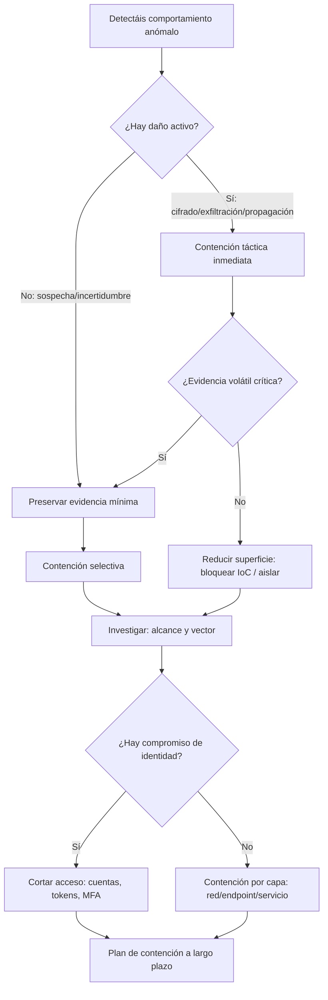

## 3.5.1. Contención de incidentes: medidas y estrategias

En esta parte vamos a centrarnos en **la contención**: el conjunto de acciones que se aplican para **frenar un incidente** y evitar que su impacto aumente.

La contención suele venir **después de identificar un evento** y concluir que hay que actuar para limitar su impacto. A partir de ahí, el objetivo es:

- entender las características del evento (qué está pasando y cómo),
- identificar la población de sistemas y usuarios afectados,
- y poner en cuarentena lo afectado hasta que la situación se resuelva y el negocio vuelva a la normalidad.

Este tema está directamente alineado con:

- **RA3 (CE 3.e)**: iniciar las primeras medidas de contención para limitar daños.

!!! definition "Definición"
    La contención es el conjunto de medidas que **limitan el alcance** de un incidente, reducen su propagación y cortan la capacidad del atacante de seguir actuando, **sin perder de vista la evidencia** y el impacto en negocio.

### 1. Objetivos de la contención

La contención persigue objetivos muy concretos (y evaluables):

1. **Parar el “sangrado”**: detener propagación, exfiltración o cifrado.

    En la practica suele ser lo primero: si el incidente sigue “en marcha”, cada minuto puede aumentar el impacto. Un ejemplo claro es el ransomware: si hay cifrado activo, el objetivo es **pararlo ya** para que no afecte a mas equipos.

2. **Reducir superficie de ataque**: limitar movimiento lateral y accesos.

    Esto implica que el atacante tenga menos “caminos” para avanzar: menos rutas de red, menos privilegios, menos servicios accesibles, menos credenciales validas. Si no reduces superficie, puede que “contengas” un equipo, pero el atacante siga moviendose por otros.

3. **Comprar tiempo** para investigar con rigor.

    La contención **no resuelve** el incidente, pero te permite ganar aire para analizar evidencias, delimitar alcance y preparar erradicación y recuperación sin ir “a ciegas”.

4. **Proteger activos criticos**: identidad, copias de seguridad, servicios esenciales.

    Hay activos que, si caen, empeoran todo: por ejemplo, la identidad (AD/SSO), los repositorios de backups o el plano de gestión (hypervisor, EDR, herramientas de despliegue). Contener también es **blindar** esos puntos.

5. **Preservar evidencia** cuando sea necesario (sobre todo evidencias volatiles).

    En incidentes reales, un cierre brusco puede eliminar conexiones, procesos y datos de memoria que son clave para entender el vector de entrada o la persistencia. Por eso, muchas veces se captura “lo mínimo viable” antes de aislar.

Una idea importante (y muy repetida en guias de respuesta a incidentes) es que la contención sirve para **limitar impacto** y, a la vez, permitir que el equipo trabaje con informacion suficiente para erradicar y recuperar con criterio.

!!! tip "Idea para alumnado"
    Contener no es “arreglar” el incidente. Es **poner el freno** para que el problema no crezca mientras investigáis y preparáis erradicación y recuperación.

### 2. Contención a corto plazo y a largo plazo

Una forma muy práctica (y realista) de explicarlo es separar dos estrategias:

- **Contención a corto plazo (táctica)**: acciones inmediatas para frenar el impacto ya.
- **Contención a largo plazo (estratégica)**: acciones para sostener el control mientras se investiga y evitar recaídas.

| Tipo de contención        | Objetivo                           |     Horizonte | Riesgo típico                               | Ejemplos                                           |
|---------------------------|------------------------------------|--------------:|---------------------------------------------|----------------------------------------------------|
| Corto plazo (táctica)     | Parar el daño inmediatamente       | Minutos-horas | Cortar demasiado y tumbar servicios         | Aislar host, bloquear IoC, deshabilitar cuenta     |
| Largo plazo (estratégica) | Evitar reentrada y mejorar postura |  Días-semanas | Ser demasiado lenta y permitir persistencia | Segmentación, MFA, rotación de secretos, hardening |

!!! example "Ejemplo rápido"
    Si detectas un equipo que hace conexiones a un dominio malicioso:
    
    - Corto plazo: aislas el equipo y bloqueas el dominio en proxy/DNS.
    - Largo plazo: revisas por qué pudo salir esa conexión (reglas de salida, EDR, parches, privilegios) y endureces controles para que no vuelva a pasar.

!!! note "Idea clave"
    Una estrategia basada en **objetivos** guía la contención. Lo habitual es:
    
    - identificar síntomas,
    - poner en cuarentena,
    - y volver a la actividad lo antes posible.
    
    Aun así, algunos enfoques priorizan identificar rápido todos los sistemas afectados para preparar erradicación. Observar al atacante “para aprender” puede tener sentido en casos concretos, pero el riesgo de observar y no actuar suele ser alto.

### 3. Principios de oro antes de “tocar botones”

Hay cinco principios que debéis interiorizar (porque son los que evitan desastres):

- **Evidencia primero (cuando aplique)**: si vais a perder memoria, conexiones o procesos, hay que valorar captura rápida.

    En muchos casos la evidencia más valiosa es volátil: conexiones activas, procesos en ejecución, credenciales en memoria, etc. Por eso, antes de “apagar por si acaso”, pensad: ¿voy a perder datos que necesito para entender el vector de entrada o la persistencia?

- **Rapidez con cabeza**: contención improvisada puede multiplicar el incidente.

    Contener rápido no es “hacer cosas al azar”. Es aplicar un plan: aislar, bloquear, rotar credenciales, registrar acciones y seguir un playbook. Si no, puedes dejar agujeros (por ejemplo, aislas un equipo pero el atacante sigue con las mismas credenciales en otros).

- **Menor impacto posible**: frenar sin romper lo crítico.

    La contención es un equilibrio entre seguridad y continuidad. Si cortas demasiado, puedes tumbar un servicio esencial y crear un incidente “doble”: el de seguridad y el de disponibilidad. Por eso se prioriza: activos criticos primero, y medidas reversibles cuando se pueda.

- **Cortar el acceso del atacante**: si no cortáis credenciales/tokens, el atacante vuelve.

    Un patron muy comun es contener un equipo pero no la identidad: el atacante conserva sesion, token, VPN o una cuenta de servicio, y reentra en cuanto puede. Si hay sospecha de compromiso de credenciales, la contención debe incluir identidad.

- **Comunicación y escalado**: la contención es técnica, pero también organizativa.

    Durante contención, la dirección y el negocio piden respuestas. Es normal. Lo importante es comunicar **hechos y siguientes pasos**, sin especular. Dar una conclusion prematura “para tranquilizar” suele empeorar la situacion mas tarde.

!!! warning "Atención"
    “Apago el servidor y listo” puede ser una contención… pero también puede ser:
    
    - una pérdida de evidencia,
    - una caída de negocio innecesaria,
    - y un examen suspendido por no documentar ni justificar.

### 4. Flujo de decisión: ¿qué contengo y cómo?

“¿Qué hago primero?”. La respuesta correcta es: depende, pero con un flujo claro.



!!! note "Nota"
    En clase, este flujo se puede usar como guion de role-play:
    
    ```
    - un grupo hace de SOC,
    - otro de sistemas,
    - otro de dirección,
    - y alguien (siempre hay alguien) de “usuario que lo abrió todo”.
    ```

#### 4.1. Indicadores, alcance y cuarentena (lo que suele marcar la diferencia)

En contención hay una idea muy potente: **no basta con “ver el sintoma”**, hay que usarlo para descubrir el resto del incidente.

1. **Identificar indicadores (IoC)**.

    Los indicadores de compromiso (IoC) son “pistas” observables: hash de un binario, una clave de registro, un servicio nuevo, una URL maliciosa, conexiones a un dominio concreto, etc. Con una lista inicial de IoC puedes buscar en el resto del entorno para descubrir otros equipos afectados.
    
    !!! tip "Consejo"
        En muchos casos, **la atribución** (quién ha sido) no es lo primero. Lo urgente suele ser: contener, inventariar sistemas afectados y preparar erradicación.

2. **Delimitar la población afectada**.

    El objetivo es responder a: ¿qué equipos, cuentas y servicios están tocados? Si solo aislas el primer equipo detectado (el “paciente 0”) y no buscas mas, es facil que el atacante ya se haya movido lateralmente.

3. **Poner en cuarentena de forma segura**.

    Aislar no siempre significa apagar. Opciones tipicas (segun el escenario) son:
    
    - desconectar red (por ejemplo, cable o puerto switch),
    - aislar con reglas (DNS, firewall, ACL),
    - o cuarentena desde EDR.
    
    Si necesitas evidencia volátil, valora primero una captura rápida y luego aísla.

4. **Preservar evidencia con imagenes cuando aplique**.

    Cuando el objetivo es investigar con rigor, se suelen tomar imagenes (disco y, a veces, memoria) para analizarlas sin “pisar” el sistema original. Esto es mas facil cuando hay playbooks y herramientas listas, porque el tiempo durante un incidente es oro.

### 5. Catálogo de medidas de contención por capas

Para que os resulte aplicable en laboratorio, agrupamos por capas: red, identidad, endpoint y servicios.

#### 5.1. Red

* **Segmentación / cuarentena** (VLAN, ACL, microsegmentación).
* **Bloqueo de IoC** en firewall/proxy/DNS (IPs, dominios, URLs).
* **Corte de rutas** entre segmentos para limitar movimiento lateral.
* **Limitación de egress** (salida a Internet) a lo estrictamente necesario.

La capa de red suele ser la mas rapida para **frenar propagación** y **cortar C2** (comando y control). Si el atacante necesita hablar con fuera (dominios/IP maliciosos) o moverse lateralmente, una buena contención en red puede romperle el plan.

MITRE define la segmentación como control para limitar flujo y restringir movimiento lateral. ([attack.mitre.org][1])

!!! tip "Consejo"
    Cuando bloquees IoC, intenta hacerlo en dos sitios:
    
    - en el perimetro (para cortar salida),
    - y dentro (para evitar que un equipo infectado hable con otros segmentos).

#### 5.2. Identidad

* **Deshabilitar cuentas comprometidas** y cortar sesiones activas.
* **Reset forzado de contraseñas** y rotación de credenciales privilegiadas.
* **Revocar tokens** (SSO/OAuth), claves API y secretos de servicios.
* **Aplicar MFA** (especialmente en cuentas de administración).

La identidad es la “llave maestra” del entorno. Si el atacante tiene credenciales (o tokens), puede volver aunque hayas aislado un equipo. Por eso, en muchos incidentes la contención real se consigue cuando se controla **quien puede autenticarse** y **desde donde**.

#### 5.3. Endpoint (equipos)

* **Aislamiento desde EDR** o cuarentena por red.
* **Bloqueo por hash** / firma / regla (si se dispone).
* **Detención controlada de procesos** maliciosos (si no compromete evidencia).
* **Deshabilitar ejecución** de macros o binarios sospechosos temporalmente.

En endpoint, lo habitual es aislar el equipo para que deje de comunicarse con el resto y, a la vez, conservarlo para análisis. Un detalle importante:

!!! warning "Atención"
    Apagar un equipo puede ser tentador, pero en algunos casos implica **perder memoria volátil** y detalles forenses (sesiones, procesos, conexiones). Si necesitas esa evidencia, captura lo mínimo viable y luego aísla.

#### 5.4. Servicios y aplicaciones

* Poner un servicio en **modo mantenimiento** (siempre coordinado).
* **Rotación de secretos** de despliegue y acceso a base de datos.
* Activación temporal de **reglas WAF** o rate-limiting.
* Deshabilitar funcionalidades expuestas hasta parcheo.

En aplicaciones, muchas medidas de contención son “parches temporales” para ganar tiempo: deshabilitar una funcionalidad vulnerable, endurecer el WAF o limitar peticiones. La clave es coordinarlo con negocio para no romper lo que es crítico sin avisar.

### 6. Contención por escenarios: mini playbooks

Un playbook es un procedimiento predefinido (un guion). En un equipo real (y tambien en el módulo), ayudan a responder con orden: qué se hace, en qué orden, con qué evidencias y quien decide cada cosa.

#### 6.1. Ransomware (cifrado y posible extorsión)

CISA recomienda una combinación de prevención y respuesta, incluyendo aislamiento y checklist de respuesta. ([cisa.gov][2])
NCSC mantiene guías específicas para mitigar malware y ransomware. ([ncsc.gov.uk][3])

**Contención táctica (minutos-horas):**

1. Aislar equipos afectados (EDR / VLAN cuarentena / desconectar red).
2. Proteger backups: evitar acceso desde cuentas comprometidas.
3. Cortar credenciales comprometidas (usuarios y admins).
4. Bloquear IoC conocidos (dominios/IP) si se identifican.
5. Registrar acciones y preservar evidencia mínima si es viable.

!!! note "Nota"
    Antes de bloquear “a lo loco”, confirmad lo básico: que la alerta no sea un falso positivo o un malware antiguo sin impacto. Si tenéis una muestra (hash, fichero, URL), el análisis ayuda a sacar IoC útiles para buscar otros equipos afectados.

!!! warning "Atención"
    Herramientas como VirusTotal son muy útiles, pero tened cuidado: lo que se sube puede quedar almacenado y ser visible para terceros. No subáis documentos internos o ficheros con datos sensibles.

**Contención estratégica (días):**

* Segmentación para frenar movimiento lateral.
* MFA y endurecimiento de accesos remotos.
* Revisión de privilegios y cuentas de servicio.

#### 6.2. Compromiso de credenciales (phishing / password spraying)

**Contención táctica:**

1. Deshabilitar cuentas sospechosas y revocar sesiones.
2. Reset forzado + activar MFA.
3. Revisar reglas de reenvío y accesos a correo (si aplica).
4. Bloquear origen si hay fuerza bruta evidente.

**Contención estratégica:**

* Acceso condicional, PAM, mínimo privilegio, detección de anomalías.

#### 6.3. Web comprometida (webshell / defacement)

**Contención táctica:**

1. Sacar el servicio de Internet o poner mantenimiento (coordinado).
2. Copiar logs, artefactos web y evidencias de integridad.
3. Rotar secretos (API keys, credenciales DB, despliegue).
4. Bloquear rutas, IoC y revisar persistencia.

**Contención estratégica:**

* WAF, hardening, parcheo, pipeline seguro y control de cambios.

#### 6.4. Exfiltración / C2

**Contención táctica:**

1. Bloquear comunicaciones C2 (proxy/firewall/DNS).
2. Aislar hosts implicados.
3. Preservar evidencias de red (logs, proxy, DNS).

**Contención estratégica:**

* Control de salida (egress), DLP si aplica, segmentación y mejora de detecciones.

#### 6.5. DoS / DDoS (caída de servicio)

Este tipo de incidentes son principalmente de **disponibilidad**: el objetivo del atacante es tumbar un servicio. La contención aquí suele implicar red y proveedor.

**Contención táctica:**

1. Identificar el flujo del ataque y activos objetivo (DNS, web, API, etc.).
2. Revisar logs de firewall, balanceadores, routers y servidores para caracterizar tráfico.
3. Bloquear tráfico con dispositivos perimetrales (reglas, rate limit, geo, etc.).
4. Bloquear respuestas salientes si el servicio está amplificando el ataque.
5. Coordinar con ISP/CDN si aplica (mitigación aguas arriba).

**Contención estratégica:**

* Preparar perfiles y runbooks (umbrales, reglas, contactos, escalado).
* Diseñar capacidad de absorción (CDN, caché, autoscaling, balanceo).

#### 6.6. Activo perdido o robado (portátil, móvil, USB)

No todo incidente es “malware”. En perdida/robo, la contención es responder a una pregunta: ¿hay riesgo de datos?

**Contención táctica (preguntas que hay que responder):**

1. ¿Qué tipo de datos había? (PII, datos sensibles, claves, accesos).
2. ¿El disco estaba cifrado y el equipo estaba apagado? (reduce mucho el riesgo).
3. ¿Se puede localizar o borrar en remoto? (MDM, herramientas de gestión).
4. ¿Hay que revocar accesos? (tokens, VPN, sesiones, claves SSH).

**Contención estratégica:**

* Cifrado completo, MDM, bloqueo, borrado remoto y mínimo privilegio.

#### 6.7. Robo de datos (exfiltración)

Contener robo de datos suele ir “a contrarreloj”. Las señales pueden ser muy obvias (transferencias grandes) o mas sutiles (movimientos internos previos a exfiltrar).

**Contención táctica:**

1. Identificar activos con datos sensibles y revisar accesos recientes.
2. Bloquear o limitar canales de salida usados para exfiltrar (proxy, DNS, cloud).
3. Aislar o restringir cuentas/hosts implicados, preservando evidencias de red.
4. Revisar si los datos se han movido a ubicaciones “intermedias” antes de salir.

**Contención estratégica:**

* Egress control, DLP (si aplica), clasificación de datos y alertas por comportamiento.

#### 6.8. Acceso no autorizado o uso indebido de activos

Aquí entran casos como abuso de privilegios, creación de cuentas sin permiso o saltarse controles.

**Indicadores tipicos:**

* accesos fuera de horario,
* muchos fallos de login o bloqueos sin explicación,
* uso de cuentas dormidas,
* creación de cuentas no autorizada,
* reinicios o fallos extraños del sistema.

**Contención táctica:**

1. Confirmar qué cuentas y sistemas están implicados (locales o de directorio).
2. Revocar sesiones, bloquear cuentas sospechosas y revisar privilegios.
3. Aumentar registro/monitorización en los sistemas objetivo (para no ir a ciegas).

**Contención estratégica:**

* PAM, mínimo privilegio, auditoría de cambios y alertas de cuentas privilegiadas.


### 7. Matriz de decisiones: “contener mucho” vs “contener fino”

| Decisión                                   | Ventaja            | Riesgo                           | Cuándo usar                                        |
|--------------------------------------------|--------------------|----------------------------------|----------------------------------------------------|
| Contención agresiva (corte amplio)         | Detiene rápido     | Tumbar negocio, perder evidencia | Daño activo grave (cifrado/exfiltración)           |
| Contención selectiva (quirúrgica)          | Menos impacto      | Puede dejar persistencia         | Incidente localizado, alta criticidad del servicio |
| Contención “por identidad” (cortar acceso) | Corta reentrada    | Impacto en usuarios              | Compromiso de credenciales o sospecha fuerte       |
| Contención “por red” (segmentar)           | Limita lateralidad | Compleja de diseñar              | Entornos medianos/grandes o incidentes recurrentes |

!!! success "Indicador de madurez"
    Una organización madura no improvisa: tiene playbooks, segmentación razonable y un flujo de escalado claro.


### 8. Errores típicos (lo que no debéis hacer)

1. **Formatear o reinstalar sin investigar**: destruye evidencia y no aprendéis nada.
2. **Aislar solo el “paciente 0”** cuando ya hay movimiento lateral.
3. **No cortar credenciales**: el atacante vuelve.
4. **Bloquear IoC a ciegas** y dejar fuera a usuarios o servicios legítimos.
5. **No documentar**: en un incidente real y en el módulo, si no está registrado, no existe.


### 9. Checklist de contención (primeros 30–60 minutos)

1. Identificar alcance inicial (sistemas, cuentas, servicios).
2. Valorar evidencia volátil (si procede): ¿se pierde si apagáis/aisláis?
3. Aislar sistemas afectados con el menor impacto posible.
4. Cortar accesos del atacante (cuentas/tokens/secretos).
5. Bloquear IoC (red/EDR/proxy/DNS) si se conocen.
6. Proteger backups y activos críticos.
7. Escalar y comunicar según procedimiento.
8. Documentar: qué, cuándo, quién, por qué.

CISA publica listas y guías de respuesta para ransomware que incluyen checklist y acciones recomendadas. ([cisa.gov][2])


### 10. Actividades de aula recomendadas

A continuación, actividades pensadas para que alumnos y alumnas practiquéis contención de forma realista:

1. **Caso guiado: aislamiento sin perder evidencia**

    * Objetivo: decidir qué capturar antes de aislar.
    * Evidencias: logs + tabla de acciones.

2. **Diseño de segmentación mínima viable**

    * Objetivo: proponer segmentos, justificar flujos permitidos y prohibidos.
    * Referencia conceptual: segmentación como mitigación. ([attack.mitre.org][1])

3. **Playbook de ransomware**

    * Objetivo: redactar procedimiento corto/largo plazo y roles.
    * Referencia: guía StopRansomware. ([cisa.gov][2])

4. **Simulación de war room**

    * Objetivo: aplicar escalado, comunicación, decisiones y registro.
    * Entrega: acta de decisiones + timeline.


## Glosario mínimo

* **IoC (Indicador de compromiso)**: indicador observable de posible compromiso.
* **EDR**: solución de detección y respuesta en endpoint.
* **C2 (Command & Control)**: infraestructura de mando y control del atacante.
* **Segmentación**: dividir la red en segmentos para limitar movimiento lateral. ([attack.mitre.org][1])
* **Token**: credencial temporal (SSO/OAuth) que permite acceso sin contraseña.

## Referencias y bibliografía

* Normativa del módulo, RA3 (CE 3.e): contención para limitar daños.
* Thompson, E. C. (2018). *Cybersecurity Incident Response*. Capítulo 8: Containment.
* NIST SP 800-61 Rev. 3: recomendaciones de respuesta a incidentes integradas con gestión de riesgo. ([csrc.nist.gov][4])
* CISA #StopRansomware Guide (guía y checklist de respuesta). ([cisa.gov][2])
* UK NCSC: mitigación de malware y ransomware (guía práctica). ([ncsc.gov.uk][3])
* MITRE ATT&CK Mitigation M1030: Network Segmentation. ([attack.mitre.org][1])

## Presentación

Por definir.

## Recursos adicionales

* Plantilla de playbook (para completar en clase): objetivos, pasos, roles, evidencias y checklist.
* Tabla de “acciones vs impacto” para debatir contención selectiva frente a agresiva.


[1]: https://attack.mitre.org/mitigations/M1030/ "Network Segmentation, Mitigation M1030 - Enterprise"
[2]: https://www.cisa.gov/stopransomware/ransomware-guide "StopRansomware Guide"
[3]: https://www.ncsc.gov.uk/guidance/mitigating-malware-and-ransomware-attacks "Mitigating malware and ransomware attacks - NCSC.GOV.UK"
[4]: https://csrc.nist.gov/pubs/sp/800/61/r3/final "SP 800-61 Rev. 3, Incident Response Recommendations and ..."
