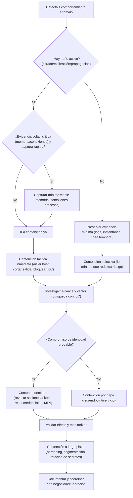
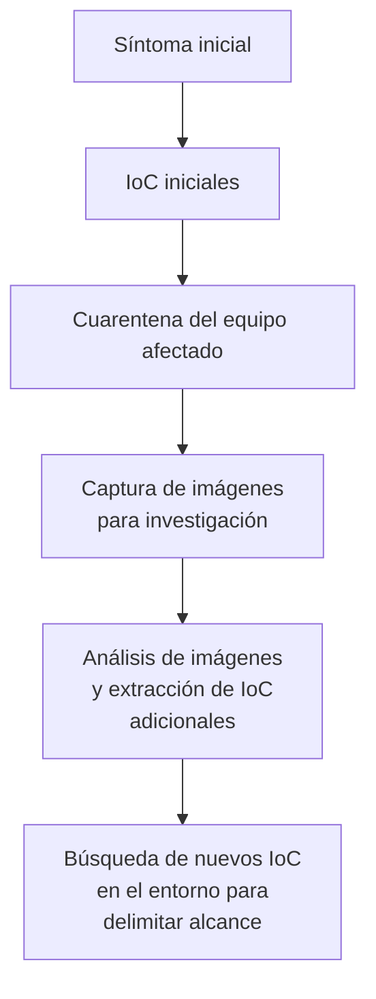

## 3.5.1. Contención de incidentes: medidas y estrategias

En esta parte vamos a centrarnos en **la contención**: el conjunto de acciones que se aplican para **frenar un incidente** y evitar que su impacto aumente.

La contención suele venir **después de identificar un evento** y concluir que hay que actuar para limitar su impacto. A partir de ahí, el objetivo es:

- entender las características del evento (qué está pasando y cómo),
- identificar la población de sistemas y usuarios afectados,
- y poner en cuarentena lo afectado hasta que la situación se resuelva y el negocio vuelva a la normalidad.

Este tema está directamente alineado con:

- **RA3 (CE 3.e)**: iniciar las primeras medidas de contención para limitar daños.

!!! definition "Definición"
    La contención es el conjunto de medidas que **limitan el alcance** de un incidente, reducen su propagación y cortan la capacidad del atacante de seguir actuando, **sin perder de vista la evidencia** y el impacto en negocio.

### 1. Objetivos de la contención

La contención persigue objetivos muy concretos (y evaluables):

1. **Parar el “sangrado”**: detener propagación, exfiltración o cifrado.

    En la práctica suele ser lo primero: si el incidente sigue “en marcha”, cada minuto puede aumentar el impacto. Un ejemplo claro es el ransomware: si hay cifrado activo, el objetivo es **pararlo ya** para que no afecte a más equipos.

2. **Reducir superficie de ataque**: limitar movimiento lateral y accesos.

    Esto implica que el atacante tenga menos “caminos” para avanzar: menos rutas de red, menos privilegios, menos servicios accesibles, menos credenciales válidas. Si no reduces superficie, puede que “contengas” un equipo, pero el atacante siga moviéndose por otros.

3. **Comprar tiempo** para investigar con rigor.

    La contención **no resuelve** el incidente, pero te permite ganar aire para analizar evidencias, delimitar alcance y preparar erradicación y recuperación sin ir “a ciegas”.

4. **Proteger activos críticos**: identidad, copias de seguridad, servicios esenciales.

    Hay activos que, si caen, empeoran todo: por ejemplo, la identidad (AD/SSO), los repositorios de backups o el plano de gestión (hypervisor, EDR, herramientas de despliegue). Contener también es **blindar** esos puntos.

5. **Preservar evidencia** cuando sea necesario (sobre todo evidencias volátiles).

    En incidentes reales, un cierre brusco puede eliminar conexiones, procesos y datos de memoria que son clave para entender el vector de entrada o la persistencia. Por eso, muchas veces se captura “lo mínimo viable” antes de aislar.

Una idea importante (y muy repetida en guías de respuesta a incidentes) es que la contención sirve para **limitar impacto** y, a la vez, permitir que el equipo trabaje con información suficiente para erradicar y recuperar con criterio.

!!! tip "Idea clave"
    Contener no es “arreglar” el incidente. Es **poner el freno** para que el problema no crezca mientras investigáis y preparáis erradicación y recuperación.

### 2. Contención a corto plazo y a largo plazo

Una forma muy práctica (y realista) de explicarlo es separar dos estrategias:

- **Contención a corto plazo (táctica)**: acciones inmediatas para frenar el impacto ya.
- **Contención a largo plazo (estratégica)**: acciones para sostener el control mientras se investiga y evitar recaídas.

| Tipo de contención        | Objetivo                           |     Horizonte | Riesgo típico                               | Ejemplos                                           |
|---------------------------|------------------------------------|--------------:|---------------------------------------------|----------------------------------------------------|
| Corto plazo (táctica)     | Parar el daño inmediatamente       | Minutos-horas | Cortar demasiado y tumbar servicios         | Aislar host, bloquear IoC, deshabilitar cuenta     |
| Largo plazo (estratégica) | Evitar reentrada y mejorar postura |  Días-semanas | Ser demasiado lenta y permitir persistencia | Segmentación, MFA, rotación de secretos, hardening |

!!! example "Ejemplo rápido"
    Si detectas un equipo que hace conexiones a un dominio malicioso:
    
    - Corto plazo: aislas el equipo y bloqueas el dominio en proxy/DNS.
    - Largo plazo: revisas por qué pudo salir esa conexión (reglas de salida, EDR, parches, privilegios) y endureces controles para que no vuelva a pasar.

!!! note "Aclaración"
    Una estrategia basada en **objetivos** guía la contención, en este caso los objetivos de corto y largo plazo. En la práctica, la secuencia suele ser:
    
    - identificar síntomas: conexiones, procesos, cambios, etc. y sacar IoC,
    - poner en cuarentena: aislar el equipo o bloquear la comunicación,
    - y luego investigar: qué ha pasado, qué más está afectado, cómo se ha movido el atacante, etc.
    - y volver a la actividad lo antes posible.
    
    Aun así, algunos enfoques priorizan identificar rápido todos los sistemas afectados para preparar erradicación. Observar al atacante “para aprender” puede tener sentido en casos concretos, pero el riesgo de observar y no actuar suele ser alto.
    
    Con esto en mente, pasamos a los principios de oro: los que evitan que una contención “a lo loco” empeore el incidente.

### 3. Principios de oro antes de “tocar botones”

Hay cinco principios que debéis interiorizar (porque son los que evitan desastres):

- **Evidencia primero (cuando aplique)**: si vais a perder memoria, conexiones o procesos, hay que valorar la captura rápida antes de aislar o apagar.

    En muchos casos la evidencia más valiosa es volátil: conexiones activas, procesos en ejecución, credenciales en memoria, etc. Por eso, antes de “apagar por si acaso”, pensad: ¿voy a perder datos que necesito para entender el vector de entrada o la persistencia?

- **Rapidez con cabeza**: contención improvisada puede multiplicar el incidente.

    Contener rápido no es “hacer cosas al azar”. Es aplicar un plan: aislar, bloquear, rotar credenciales, registrar acciones y seguir un playbook. Si no, puedes dejar agujeros (por ejemplo, aislas un equipo, pero el atacante sigue con las mismas credenciales en otros).

- **Menor impacto posible**: frenar sin romper lo crítico.

    La contención es un equilibrio entre seguridad y continuidad. Si cortas demasiado, puedes tumbar un servicio esencial y crear un incidente “doble”: el de seguridad y el de disponibilidad. Por eso se prioriza: activos críticos primero, y medidas reversibles cuando se pueda, con comunicación clara a negocio.

- **Cortar el acceso del atacante**: si no cortáis credenciales/tokens, el atacante vuelve.

    Un patrón muy común es contener un equipo, pero no la identidad: el atacante conserva una sesión, un token, una VPN o una cuenta de servicio, y reentra en cuanto puede. Si hay sospecha de compromiso de credenciales, la contención debe incluir identidad.

- **Comunicación y escalado**: la contención es técnica, pero también organizativa.

    Durante contención, la dirección y el negocio piden respuestas. Es normal. Lo importante es comunicar **hechos y siguientes pasos**, sin especular. Dar una conclusión prematura “para tranquilizar” suele empeorar la situación más tarde.

!!! warning "Atención"
    “Apago el servidor y listo” puede ser una contención… pero también puede ser:
    
    - una pérdida de evidencia,
    - una caída de negocio innecesaria,
    - y un examen suspendido por no documentar ni justificar.

Con estos principios claros, el siguiente paso es decidir **qué** contienes primero y **cómo** lo haces para frenar el daño sin perder el control del incidente.

### 4. Flujo de decisión: ¿qué contengo y cómo?

“¿Qué hago primero?”. La respuesta correcta es: depende, pero con un flujo claro.

La explicación del flujo (siguiendo el diagrama) es la siguiente. Partimos de un comportamiento anómalo que puede ser un incidente:

1. **Primero decides si hay daño activo**.

    Ejemplos de daño activo: cifrado en curso, exfiltración confirmada, propagación a otros equipos, creación masiva de cuentas/tareas, etc.

2. **Si hay daño activo**, la prioridad es frenar el impacto, pero con un matiz importante:

    - Si hay **evidencia volátil crítica** (por ejemplo, memoria, conexiones de red, procesos) y podéis capturar un **mínimo viable** sin retrasar la contención, se captura primero (rápido y con método).
    - Si capturar evidencia implica perder tiempo mientras el daño sigue ocurriendo, se prioriza la contención inmediata.

3. **Contención táctica inmediata (cuando hay daño activo)**.

    Acciones típicas (según el caso) son:

    - aislar el host desde EDR o a nivel de red,
    - cortar salida a Internet (egress) si hay exfiltración,
    - bloquear IoC (dominios/URLs/IPs/hashes) en DNS, proxy o firewall.

4. **Si no hay daño activo**, pero hay sospecha razonable, la secuencia cambia:

    - primero preservas evidencia mínima (logs relevantes, instantánea (snapshot) si aplica, línea temporal),
    - y luego aplicas una contención selectiva (lo mínimo que reduzca el riesgo sin tirar servicios innecesariamente).

5. **Después de la primera contención (táctica o selectiva), investigas alcance y vector**.

    Aquí el objetivo es no quedarte en el “síntoma”: usas IoC para buscar otros equipos/usuarios/servicios afectados y entender por dónde entró y cómo se movió el atacante.

6. **Decides si hay compromiso de identidad probable**.

    Si lo hay, contienes identidad (revocar sesiones/tokens, reset de credenciales, imponer MFA o endurecer políticas). Si no lo hay, sigues con contención “por capas” (red, endpoint, servicio) según dónde esté el problema.

7. **Validas efecto y monitorizas**.

    Contener también es comprobar que el daño se ha parado y que no hay rutas alternativas (por ejemplo, que no se siguen viendo conexiones a IoC o nuevos endpoints afectados).

8. **Planificas contención a largo plazo y documentas**.

    Aquí entran medidas de días/semanas (hardening, segmentación, rotación de secretos, reglas duraderas, etc.) y el trabajo de coordinación con negocio para la recuperación.

!!! tip "Ideas claves"
    Este flujo no es una autopista de sentido único: es habitual volver atrás (por ejemplo, descubrir un IoC nuevo y reforzar la contención).
    En presencia de daño activo, la prioridad es detener el impacto.    Solo se realiza una captura previa de evidencias volátiles cuando pueda ejecutarse en un tiempo mínimo (minutos), sin retrasar la contención, y cuando dichas evidencias sean irrepetibles (memoria, conexiones, procesos). En caso contrario, se aplica contención inmediata y se preservan evidencias persistentes (logs en disco, imágenes de sistema) en una segunda fase.

En cada paso, la comunicación con negocio y dirección es clave para gestionar expectativas y explicar decisiones. Y, por supuesto, todo debe quedar registrado: qué se hizo, cuándo, por qué y quién lo hizo.

Este flujo es una guía general, pero cada incidente es único. A partir de aquí vamos a aterrizarlo en tres ideas prácticas: IoC y alcance (4.1), estrategia (4.2) y secuencia iterativa (4.3).

#### 4.1. Indicadores, alcance y cuarentena (lo que suele marcar la diferencia)

En contención hay una idea muy potente: **no basta con “ver el síntoma”**, hay que usarlo para descubrir el resto del incidente. Es decir, conviertes el síntoma en indicadores (IoC) y luego buscas esos indicadores en el entorno para delimitar el alcance.

Esto es lo que marca la diferencia entre “contener un equipo” y “contener el incidente”.

1. **Identificar indicadores (IoC)**.

    Los indicadores de compromiso (IoC) son “pistas” observables: hash de un binario, una clave de registro, un servicio nuevo, una URL maliciosa, conexiones a un dominio concreto, etc. Con una lista inicial de IoC puedes buscar en el resto del entorno para descubrir otros equipos afectados.
    
    Ejemplos típicos de IoC que aparecen en incidentes reales:
    
    - firmas o detecciones de malware,
    - cambios en el sistema de archivos (ficheros creados, renombrados o cifrados),
    - cambios en registro/configuración (persistencia, tareas programadas, servicios),
    - conexiones salientes o entrantes hacia/desde URLs o dominios maliciosos conocidos.
    
    !!! info "Información"
        La inteligencia de amenazas (threat intelligence) aporta contexto a la investigación: si un grupo de ataque conocido deja indicadores “muy suyos”, buscarlos en el entorno puede ayudar a detectar rápidamente otros sistemas afectados.
    
    !!! tip "Consejo"
        En muchos casos, **la atribución** (quién ha sido) no es lo primero. Lo urgente suele ser: contener, inventariar sistemas afectados y preparar erradicación.
        
        Si os centráis en “quién” demasiado pronto, podéis perder tiempo mientras el incidente sigue creciendo. En la mayoría de organizaciones, la atribución suele ser lo último que se prioriza.

2. **Delimitar la población afectada**.

    El objetivo es responder a: ¿qué equipos, cuentas y servicios están tocados? Si solo aislas el primer equipo detectado (el “paciente 0”) y no buscas más, es fácil que el atacante ya se haya movido lateralmente.

3. **Poner en cuarentena de forma segura**.

    Aislar no siempre significa apagar. Opciones típicas (según el escenario) son:
    
    - desconectar red (por ejemplo, cable o puerto switch),
    - poner el equipo en suspensión si necesitáis preservar memoria volátil,
    - aislar con reglas (DNS, firewall, ACL),
    - o cuarentena desde EDR.
    
    Si necesitas evidencia volátil, valora primero una captura rápida y luego aísla.

4. **Preservar evidencia con imágenes cuando aplique**.

    Cuando el objetivo es investigar con rigor, se suelen tomar imágenes (disco y, a veces, memoria) para analizarlas sin “pisar” el sistema original. Las imágenes de sistema de archivos y memoria son especialmente útiles para investigación.
    
    A nivel de herramientas, existen opciones open source y comerciales. Por ejemplo, Volatility o Rekall suelen usarse para análisis de memoria, y suites comerciales como EnCase para adquisición/análisis forense, entre otras.
    
    Esto es más fácil cuando hay playbooks y herramientas listas, porque el tiempo durante un incidente es oro.

#### 4.2. Elegir una estrategia de contención (según capacidad y objetivos)

Si el objetivo es identificar, contener y erradicar lo antes posible antes de que haya daño en datos sensibles, la pregunta es: ¿qué estrategia realista puedo ejecutar con lo que tengo?

1. Evaluad capacidades.

    Muchas organizaciones pequeñas y medianas no tienen, de forma interna, todas las habilidades y herramientas para:
    
    - identificar IoC a buen ritmo,
    - buscarlos en el entorno,
    - y tomar imágenes forenses.

2. Apoyaros en terceros si hace falta.

    Es habitual trabajar con entidades externas para reforzar detección e investigación (por ejemplo, DLP, correlación de logs, SIEM, EDR gestionado o un proveedor de respuesta a incidentes).

3. Elegid el enfoque con cabeza.

    - Enfoque “volver al servicio”: aislar lo mínimo imprescindible y restaurar rápido.
    - Enfoque “inventario completo”: identificar la mayor cantidad de sistemas afectados posible y preparar cada uno para erradicación.
    
    Ambos pueden ser válidos, pero no igual de seguros para todos los casos. Si el incidente es activo (por ejemplo, ransomware cifrando), el enfoque “volver al servicio” puede ser arriesgado porque el atacante sigue en marcha. Si el incidente no es activo, pero hay sospecha de movimiento lateral, el enfoque “inventario completo” puede ser más seguro para no dejar nada sin contener.

#### 4.3. Secuencia típica: síntomas, cuarentena, imágenes y correlación

Una secuencia muy común y genérica en contención es:

1. Identificar síntomas e IoC iniciales.
2. Poner en cuarentena sistemas sospechosos.
3. Tomar imágenes (disco y, si procede, memoria) para investigación.
4. Analizar esas imágenes para extraer más IoC.
5. Buscar esos nuevos IoC en el resto del entorno para descubrir más equipos afectados.

Si dispones de EDR, SIEM y/o capturas de tráfico, se suelen usar como “aceleradores” para inventariar dispositivos afectados y detectar patrones (por ejemplo, máquinas que llaman al mismo dominio o que ejecutan el mismo proceso).

A medida que se ponen más sistemas fuera de línea, aparecen problemas de productividad. Por eso, la comunicación con el negocio es parte del trabajo: hay que explicar impacto, alternativas y siguientes pasos.

Una vez que ya sabes “qué está afectado” (o al menos tienes una primera lista razonable), pasas a aplicar medidas de contención **por capas**: red, identidad, endpoint y servicios.

### 5. Catálogo de medidas de contención por capas

Para que os resulte aplicable en laboratorio, agrupamos por capas: red, identidad, endpoint y servicios.

#### 5.1. Red

* **Segmentación / cuarentena** (VLAN, ACL, microsegmentación).
* **Bloqueo de IoC** en firewall/proxy/DNS (IPs, dominios, URLs).
* **Corte de rutas** entre segmentos para limitar movimiento lateral.
* **Limitación de egress** (salida a Internet) a lo estrictamente necesario.

La capa de red suele ser la más rápida para **frenar propagación** y **cortar C2** (comando y control). Si el atacante necesita hablar con fuera (dominios/IP maliciosos) o moverse lateralmente, una buena contención en red puede romperle el plan.

MITRE define la segmentación como control para limitar flujo y restringir movimiento lateral. ([attack.mitre.org][1])

!!! tip "Consejo"
    Cuando bloquees IoC, intenta hacerlo en dos sitios:
    
    - en el perímetro (para cortar salida), ejemplo, en el proxy o firewall,
    - y dentro (para evitar que un equipo infectado hable con otros segmentos), ejemplo, con ACL o microsegmentación.

#### 5.2. Identidad

* **Deshabilitar cuentas comprometidas** y cortar sesiones activas.
* **Reset forzado de contraseñas** y rotación de credenciales privilegiadas.
* **Revocar tokens** (SSO/OAuth), claves API y secretos de servicios.
* **Aplicar MFA** (especialmente en cuentas de administración).

La identidad es la “llave maestra” del entorno. Si el atacante tiene credenciales (o tokens), puede volver aunque hayas aislado un equipo. Por eso, en muchos incidentes la contención real se consigue cuando se controla **qué identidades pueden autenticarse** y **desde qué ubicaciones**.

#### 5.3. Endpoint (equipos)

* **Aislamiento desde EDR** o cuarentena por red.
* **Bloqueo por hash** / firma / regla (si se dispone).
* **Detención controlada de procesos** maliciosos (si no compromete evidencia).
* **Deshabilitar ejecución** de macros o binarios sospechosos temporalmente.

En endpoint, lo habitual es aislar el equipo para que deje de comunicarse con el resto y, a la vez, conservarlo para análisis. Un detalle importante:

!!! warning "Atención"
    Apagar un equipo puede ser tentador, pero en algunos casos implica **perder memoria volátil** y detalles forenses (sesiones, procesos, conexiones). Si necesitas esa evidencia, captura lo mínimo viable y luego aísla.

#### 5.4. Servicios y aplicaciones

* Poner un servicio en **modo mantenimiento** (siempre coordinado).
* **Rotación de secretos** de despliegue y acceso a base de datos.
* Activación temporal de **reglas WAF** o rate-limiting.
* Deshabilitar funcionalidades expuestas hasta parcheo.

En aplicaciones, muchas medidas de contención son “parches temporales” para ganar tiempo: deshabilitar una funcionalidad vulnerable, endurecer el WAF o limitar peticiones. La clave es coordinarlo con negocio para no romper lo que es crítico sin avisar.

### 6. Contención por escenarios: mini playbooks

Después de ver medidas por capas, toca bajarlo a casos reales. Aquí entran los playbooks: procedimientos que os guían cuando hay prisa y presión.

Un playbook es un procedimiento predefinido (un guion). En un equipo real (y también en el módulo), ayudan a responder con orden: qué se hace, en qué orden, qué evidencias se recogen y quién decide cada cosa.

Es importante establecer planes de acción fundamentales con playbooks y checklists. Como mínimo, suele tener sentido cubrir:

- malware y ransomware,
- denegación de servicio (DoS/DDoS),
- pérdida de activos,
- robo de datos,
- uso no autorizado o mal uso de activos.

!!! note "Nota"
    No todos los ataques requieren un playbook “a medida”. Por ejemplo, en un ataque a una aplicación web, puede no existir un procedimiento específico para esa vulnerabilidad concreta. Aun así, suele haber playbooks útiles para piezas del problema (malware, elevación de privilegios, persistencia, uso indebido de cuentas). Una investigación forense suele conducir al origen (la vulnerabilidad) y la remediación completa se termina de cerrar en recuperación.

#### 6.1. Ransomware (cifrado y posible extorsión)

CISA recomienda una combinación de prevención y respuesta, incluyendo aislamiento y checklist de respuesta. ([cisa.gov][2])
NCSC mantiene guías específicas para mitigar malware y ransomware. ([ncsc.gov.uk][3])

**Contención táctica (minutos-horas):**

1. Aislar equipos afectados (EDR / VLAN cuarentena / desconectar red).
2. Proteger backups: evitar acceso desde cuentas comprometidas.
3. Cortar credenciales comprometidas (usuarios y admins).
4. Bloquear IoC conocidos (dominios/IP) si se identifican.
5. Registrar acciones y preservar evidencia mínima si es viable.

!!! note "Nota"
    Antes de bloquear “a lo loco”, confirmad lo básico: que la alerta no sea un falso positivo o un malware antiguo sin impacto. Si tenéis una muestra (hash, fichero, URL), el análisis ayuda a sacar IoC útiles para buscar otros equipos afectados.
    
    Si el análisis revela dominios o IP relacionados, eso puede ayudar a detectar comunicación de mando y control (C2) y a localizar otras máquinas que estén intentando conectar con esos destinos.

!!! warning "Atención"
    Herramientas como VirusTotal son muy útiles, pero tened cuidado: lo que se sube puede quedar almacenado y ser visible para terceros. No subáis documentos internos o ficheros con datos sensibles.

##### 6.1.1. Fuentes prácticas de IoC (sin complicarlo más de la cuenta)

Si tenéis una muestra o indicadores iniciales, las preguntas útiles para contención son:

1. ¿Qué toca el malware?

    - ¿Crea o borra archivos?
    - ¿Cambia el registro?
    - ¿Levanta o para servicios?

2. ¿Intenta comunicarse fuera?

    - ¿A qué dominios/IP?
    - ¿En qué puertos o protocolos?
    - ¿Hay patrones repetitivos (call-backs)?

Herramientas típicas que se usan para observar comportamiento (según permisos y entorno):

| Herramienta               | Para qué ayuda durante contención                         |
|---------------------------|-----------------------------------------------------------|
| Wireshark                 | capturar y analizar tráfico para buscar C2 o exfiltración |
| ProcMon / Process Monitor | ver operaciones en archivos, procesos y servicios         |
| RegShot                   | comparar cambios “antes/después” en el registro           |
| Process Explorer          | revisar procesos/servicios y DLL asociadas                |

!!! note "Nota"
    En un entorno con sandbox, a veces se “detona” la muestra para observar comportamientos. Ojo: algunas muestras detectan que están en un entorno virtual y no ejecutan, así que conviene apoyarse también en IoC de red, logs, EDR y correlación en el entorno.

**Contención estratégica (días):**

* Segmentación para frenar movimiento lateral.
* MFA y endurecimiento de accesos remotos.
* Revisión de privilegios y cuentas de servicio.

#### 6.2. Compromiso de credenciales (phishing / password spraying)

**Contención táctica:**

1. Deshabilitar cuentas sospechosas y revocar sesiones.
2. Reset forzado + activar MFA.
3. Revisar reglas de reenvío y accesos a correo (si aplica).
4. Bloquear origen si hay fuerza bruta evidente.

**Contención estratégica:**

* Acceso condicional, PAM, mínimo privilegio, detección de anomalías.

#### 6.3. Web comprometida (webshell / defacement)

**Contención táctica:**

1. Sacar el servicio de Internet o poner mantenimiento (coordinado).
2. Copiar logs, artefactos web y evidencias de integridad.
3. Rotar secretos (API keys, credenciales DB, despliegue).
4. Bloquear rutas, IoC y revisar persistencia.

**Contención estratégica:**

* WAF, hardening, parcheo, pipeline seguro y control de cambios.

#### 6.4. Exfiltración / C2

**Contención táctica:**

1. Bloquear comunicaciones C2 (proxy/firewall/DNS).
2. Aislar hosts implicados.
3. Preservar evidencias de red (logs, proxy, DNS).

**Contención estratégica:**

* Control de salida (egress), DLP si aplica, segmentación y mejora de detecciones.

#### 6.5. DoS / DDoS (caída de servicio)

Este tipo de incidentes son principalmente de **disponibilidad**: el objetivo del atacante es tumbar un servicio. La contención aquí suele implicar red y proveedor.

**Contención táctica:**

1. Identificar el flujo del ataque y activos objetivo (DNS, web, API, etc.).
2. Revisar logs de firewall, balanceadores, routers y servidores para caracterizar tráfico.
3. Bloquear tráfico con dispositivos perimetrales (reglas, rate limit, geo, etc.).
4. Bloquear respuestas salientes si el servicio está amplificando el ataque.
5. Hacer “blackhole” de IP maliciosas atribuidas al atacante (si aplica).
6. Deshabilitar temporalmente aplicaciones y servicios afectados (coordinado).
7. Añadir servidores y balanceadores de carga, según sea necesario.
8. Coordinar con ISP/CDN si aplica (mitigación aguas arriba).

**Contención estratégica:**

* Preparar perfiles y runbooks (umbrales, reglas, contactos, escalado).
* Diseñar capacidad de absorción (CDN, caché, autoscaling, balanceo).

#### 6.6. Activo perdido o robado (portátil, móvil, USB)

No todo incidente es “malware”. En perdida/robo, la contención es responder a una pregunta: ¿hay riesgo de datos?

**Contención táctica (preguntas que hay que responder):**

1. ¿Qué tipo de datos había? (PII, datos sensibles, claves, accesos).
2. ¿El disco estaba cifrado y el equipo estaba apagado? (reduce mucho el riesgo).
3. ¿Se puede localizar o borrar en remoto? (MDM, herramientas de gestión).
4. ¿Hay que revocar accesos? (tokens, VPN, sesiones, claves SSH).

Si el activo fue robado, puede ser necesario **presentar denuncia** o comunicarlo a fuerzas de seguridad. Y si la empresa no puede confirmar con seguridad qué datos había o qué uso tenía el equipo, lo más realista suele ser monitorizar la situación (internamente y, si procede, externamente).

**Contención estratégica:**

* Cifrado completo, MDM, bloqueo, borrado remoto y mínimo privilegio.

#### 6.7. Robo de datos (exfiltración)

Contener robo de datos suele ir “a contrarreloj”. Las señales pueden ser muy obvias (transferencias grandes) o más sutiles (movimientos internos previos a exfiltrar).

Indicadores útiles (la clave es el contexto):

- Obvios: transferencias grandes desde activos con datos sensibles, exports masivos, consultas inusuales.
- Sutiles: alertas por disco lleno en servidores con datos sensibles (posible “staging”), correos rebotados por tamaño, trabajo fuera de horario, uso de almacenamiento extraíble cuando debería estar restringido.

Se requiere investigación adicional porque, en algunos incidentes, los datos se mueven primero de ubicaciones sensibles a otras menos sensibles antes de salir fuera de la organización.

Si el indicador está ligado a una persona, suele tocar revisar **derechos de acceso**: un usuario con acceso a PII/ePHI/propiedad intelectual suele implicar mayor impacto si su cuenta se compromete o se usa indebidamente.

**Contención táctica:**

1. Identificar activos con datos sensibles y revisar accesos recientes.
2. Bloquear o limitar canales de salida usados para exfiltrar (proxy, DNS, cloud).
3. Aislar o restringir cuentas/hosts implicados, preservando evidencias de red.
4. Revisar si los datos se han movido a ubicaciones “intermedias” antes de salir.

**Contención estratégica:**

* Egress control, DLP (si aplica), clasificación de datos y alertas por comportamiento.

#### 6.8. Acceso no autorizado o uso indebido de activos

Aquí entran casos como abuso de privilegios, creación de cuentas sin permiso o saltarse controles.

**Indicadores típicos:**

* accesos fuera de horario,
* muchos fallos de login o bloqueos sin explicación,
* uso de cuentas dormidas,
* creación de cuentas no autorizada,
* reinicios o fallos extraños del sistema.

**Contención táctica:**

1. Confirmar qué cuentas y sistemas están implicados (locales o de directorio).
2. Revocar sesiones, bloquear cuentas sospechosas y revisar privilegios.
3. Aumentar registro/monitorización en los sistemas objetivo (para no ir a ciegas).

**Contención estratégica:**

* PAM, mínimo privilegio, auditoría de cambios y alertas de cuentas privilegiadas.

### 7. Matriz de decisiones: “contener mucho” vs “contener fino”

| Decisión                                   | Ventaja            | Riesgo                           | Cuándo usar                                        |
|--------------------------------------------|--------------------|----------------------------------|----------------------------------------------------|
| Contención agresiva (corte amplio)         | Detiene rápido     | Tumbar negocio, perder evidencia | Daño activo grave (cifrado/exfiltración)           |
| Contención selectiva (quirúrgica)          | Menos impacto      | Puede dejar persistencia         | Incidente localizado, alta criticidad del servicio |
| Contención “por identidad” (cortar acceso) | Corta reentrada    | Impacto en usuarios              | Compromiso de credenciales o sospecha fuerte       |
| Contención “por red” (segmentar)           | Limita lateralidad | Compleja de diseñar              | Entornos medianos/grandes o incidentes recurrentes |

!!! success "Indicador de madurez"
    Una organización madura no improvisa: tiene playbooks, segmentación razonable y un flujo de escalado claro.

### 8. Errores típicos 

Durante contención, es fácil caer en errores que empeoran el incidente. Aquí tenéis los más comunes:

1. **Formatear o reinstalar sin investigar**: destruye evidencia y no aprendéis nada.

    Es tentador “borrar y empezar de nuevo”, pero si no entendéis qué ha pasado, es fácil que el atacante vuelva a entrar por el mismo agujero o que haya otros sistemas afectados sin contener. Investigar no es solo para “saber quién ha sido”, sino para entender el vector de entrada, la persistencia y el movimiento lateral. Esto te ayuda a cerrar el incidente de forma completa y a mejorar la postura de seguridad para que no vuelva a pasar.

2. **Aislar solo el “paciente 0”** cuando ya hay movimiento lateral.

    Si solo aislas el primer equipo detectado, pero el atacante ya se ha movido a otros, es como poner una venda en un brazo roto: no solucionas el problema real. Es fundamental usar los IoC para buscar en el entorno y delimitar el alcance. De lo contrario, puedes dejar otros sistemas comprometidos sin contener, lo que puede llevar a un incidente más grande o a una recaída.

3. **No cortar credenciales**: el atacante vuelve.

    Si no revocas sesiones, bloqueas cuentas o rotas tokens, el atacante puede volver a entrar aunque hayas aislado un equipo. La identidad es la “llave maestra” del entorno. Si el atacante tiene credenciales, puede reentrar desde otro equipo o incluso desde el mismo si no lo has aislado correctamente. Por eso, en muchos incidentes, la contención real se consigue cuando se controla qué identidades pueden autenticarse y desde dónde.

4. **Bloquear IoC a ciegas** y dejar fuera a usuarios o servicios legítimos.

    Si bloqueas sin confirmar, puedes tumbar servicios críticos o afectar a usuarios legítimos, lo que puede generar un incidente de disponibilidad además del de seguridad. Es importante validar los IoC antes de bloquearlos, por ejemplo, confirmando que la URL o IP es realmente maliciosa y no un falso positivo. Si bloqueas algo legítimo, puedes generar una crisis de negocio que complica aún más la gestión del incidente.

5. **No documentar**: en un incidente real y en el módulo, si no está registrado, no existe.

    Es fundamental documentar cada paso: qué se hizo, cuándo, por qué y quién lo hizo. Esto es clave para la investigación, para aprender y para justificar decisiones ante dirección. No hacerlo es como pelear una batalla sin dejar rastro: no sabrás qué pasó ni cómo mejorar.

### 9. Checklist de contención

Durante los primeros minutos de un incidente (primeros 30–60 minutos), la presión es máxima. Para no perder el control, conviene tener un checklist claro que os guíe en la secuencia de acciones. Aquí tenéis un ejemplo genérico que podéis adaptar a cada escenario:

1. Identificar alcance inicial (sistemas, cuentas, servicios).
2. Valorar evidencia volátil (si procede): ¿se pierde si apagáis/aisláis?
3. Aislar sistemas afectados con el menor impacto posible.
4. Cortar accesos del atacante (cuentas/tokens/secretos).
5. Bloquear IoC (red/EDR/proxy/DNS) si se conocen.
6. Proteger backups y activos críticos.
7. Escalar y comunicar según procedimiento.
8. Documentar: qué, cuándo, quién, por qué.

CISA publica listas y guías de respuesta para ransomware que incluyen checklist y acciones recomendadas. ([cisa.gov][2])

### 10. Evidencia forense y expectativas de dirección

La contención no es solo técnica. Durante un incidente, el equipo de respuesta también tiene que gestionar la evidencia forense y las expectativas de dirección. Esto es clave para no perder el control del incidente y para tomar decisiones informadas.

#### 10.1. Apoyo forense (interno o externo)

Durante la respuesta, el equipo recopila evidencia digital para entender qué ocurrió. Parte de esa evidencia se usa para identificar otros sistemas comprometidos y parte para llegar a la causa raíz. Tomar imágenes de sistemas es un patrón habitual cuando se necesita investigar con rigor.

Como estas habilidades no siempre existen internamente, muchas organizaciones:

- contratan una empresa de respuesta a incidentes antes de que ocurra un incidente,
- definen tiempos de respuesta y niveles de servicio (por ejemplo, presencia en 24h),
- y hacen talleres y simulacros (walkthroughs) para que el equipo sepa qué esperar y qué permisos y despliegues serán necesarios.

!!! note "Nota"
    Cuando se contratan servicios a empresas externas, durante incidentes grandes y simultáneos (por ejemplo, incidentes a gran escala), el término “mejores esfuerzos” en contratos puede significar días o semanas antes de recibir ayuda. Si se puede, conviene tener acuerdos de nivel de servicio (SLA) claros para tiempos de respuesta y presencia en el incidente.

#### 10.2. Expectativas de dirección

Durante contención, la dirección suele querer respuestas rápidas y conclusiones. Es comprensible: hay impacto y presión.

Lo importante es:

- compartir hechos y progreso,
- explicar próximos pasos,
- y resistir la tentación de especular para “cerrar” el tema sin información completa.

La especulación suele causar más daño que beneficio cuando luego hay que rectificar.

### 11. Actividades de aula recomendadas

A continuación, actividades pensadas para que alumnos y alumnas practiquéis contención de forma realista:

1. **Caso guiado: aislamiento sin perder evidencia**

    * Objetivo: decidir qué capturar antes de aislar.
    * Evidencias: logs + tabla de acciones.

2. **Diseño de segmentación mínima viable**

    * Objetivo: proponer segmentos, justificar flujos permitidos y prohibidos.
    * Referencia conceptual: segmentación como mitigación. ([attack.mitre.org][1])

3. **Playbook de ransomware**

    * Objetivo: redactar procedimiento corto/largo plazo y roles.
    * Referencia: guía StopRansomware. ([cisa.gov][2])

4. **Simulación de war room**

    * Objetivo: aplicar escalado, comunicación, decisiones y registro.
    * Entrega: acta de decisiones + timeline.

## Referencias y bibliografía

* Thompson, E. C. (2018). *Cybersecurity Incident Response*. Capítulo 8: Containment.
* NIST SP 800-61 Rev. 3: recomendaciones de respuesta a incidentes integradas con gestión de riesgo. ([csrc.nist.gov][4])
* CISA #StopRansomware Guide (guía y checklist de respuesta). ([cisa.gov][2])
* UK NCSC: mitigación de malware y ransomware (guía práctica). ([ncsc.gov.uk][3])
* MITRE ATT&CK Mitigation M1030: Network Segmentation. ([attack.mitre.org][1])

## Presentación

Por definir.

## Recursos adicionales

* Plantilla de playbook (para completar en clase): objetivos, pasos, roles, evidencias y checklist.
* Tabla de “acciones vs impacto” para debatir contención selectiva frente a agresiva.

[1]: https://attack.mitre.org/mitigations/M1030/ "Network Segmentation, Mitigation M1030 - Enterprise"
[2]: https://www.cisa.gov/stopransomware/ransomware-guide "StopRansomware Guide"
[3]: https://www.ncsc.gov.uk/guidance/mitigating-malware-and-ransomware-attacks "Mitigating malware and ransomware attacks - NCSC.GOV.UK"
[4]: https://csrc.nist.gov/pubs/sp/800/61/r3/final "SP 800-61 Rev. 3, Incident Response Recommendations and ..."
