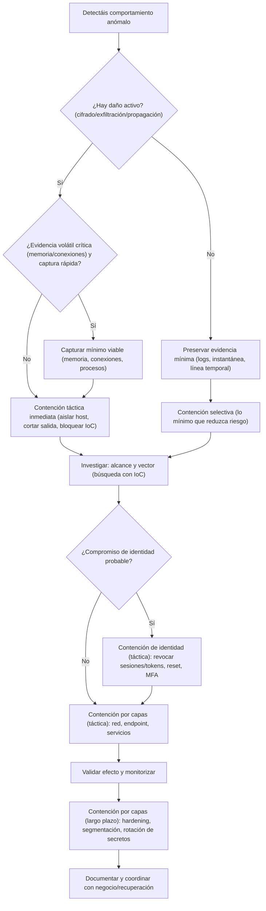
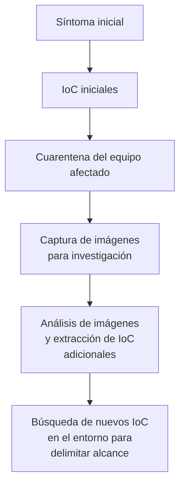

## 3.5.1. Contención de incidentes: medidas y estrategias

Cuando una organización detecta un incidente, una de las primeras preguntas
reales no es "quién ha sido", sino **cómo evitamos que esto vaya a más**. Ahí
entra la contención.

La contención es la fase de la respuesta en la que el equipo intenta
**frenar el daño**, **limitar la propagación** y **ganar tiempo** para seguir
investigando sin que el incidente se descontrole. Dicho de forma sencilla:
si la investigación ayuda a entender el problema, la contención pone el freno
para que el problema no siga creciendo.

> Este tema está directamente alineado con el RA 3:
>    - e) Iniciar las primeras medidas de contención para limitar daños.

!!! definition "Definición"
    La contención es el conjunto de medidas que **limitan el alcance** de un
    incidente, reducen su propagación y cortan la capacidad del atacante de
    seguir actuando, **sin perder de vista la evidencia** ni el impacto en el
    negocio.

En la secuencia lógica de la unidad, la contención **no sustituye a la
investigación** ni resuelve por sí sola el incidente. La investigación ayuda a
decidir **qué conviene contener y por qué**; después, la erradicación elimina
la causa y la recuperación devuelve los servicios a la normalidad.

!!! note "Relación con el resto de la unidad"
    La contención actúa como un puente entre tres momentos del trabajo técnico:

    - **investigar**, para entender alcance, vector de entrada e impacto;
    - **contener**, para frenar el daño y ganar tiempo;
    - **erradicar y recuperar**, para eliminar la causa y volver al servicio con seguridad.

!!! tip "Mapa del tema"
    En este documento vamos a seguir esta línea argumental:

    1. entender **para qué sirve** la contención;
    2. distinguir entre **contención táctica y estratégica**;
    3. aplicar un **flujo de decisión** para saber qué hacer primero;
    4. aterrizarlo en **medidas por capas** y en **escenarios reales**.

### 1. Objetivos de la contención

Contener no significa "hacer algo rápido". Significa actuar con un propósito
claro. En la práctica, la contención persigue cinco objetivos:

1. **Detener el daño activo**: frenar propagación, exfiltración o cifrado.

    Si el incidente sigue "en marcha", cada minuto cuenta. Un ejemplo claro es
    el ransomware: si hay cifrado activo, el primer objetivo es **pararlo ya**
    para que no afecte a más equipos.

2. **Reducir superficie de ataque**: limitar movimiento lateral y accesos.

    Esto implica quitar al atacante caminos para avanzar: menos rutas de red,
    menos privilegios, menos servicios accesibles y menos credenciales válidas.
    Si no reduces superficie, puede que "contengas" un equipo, pero el
    incidente siga vivo en otros.

3. **Comprar tiempo** para investigar con rigor.

    La contención **no resuelve** el incidente, pero permite analizar
    evidencias, delimitar alcance y preparar la erradicación sin trabajar "a
    ciegas".

4. **Proteger activos críticos**: identidad, copias de seguridad, servicios esenciales.

    Hay elementos que, si caen, empeoran todo: la identidad (AD, SSO), las
    copias de seguridad o las herramientas de administración. Contener también
    es **blindar esos puntos**.

5. **Preservar evidencia** cuando sea necesario (sobre todo evidencias volátiles).

    Un cierre brusco puede eliminar conexiones, procesos o datos de memoria
    clave para entender el vector de entrada o la persistencia. Por eso, en
    muchos casos se captura **lo mínimo viable** antes de aislar.

En resumen, contener sirve para **limitar impacto** y, al mismo tiempo, permitir
que el equipo trabaje con información suficiente para erradicar y recuperar con
criterio.

!!! tip "Idea clave"
    Contener no es "arreglar" el incidente. Es **poner el freno** para que el
    problema no crezca mientras investigáis y preparáis la siguiente fase.

### 2. Contención a corto plazo y a largo plazo

Una forma muy útil de entender la contención es distinguir entre lo que hacéis
**para parar el golpe ahora mismo** y lo que hacéis **para sostener el control
del incidente durante los días siguientes**.

- **Contención a corto plazo (táctica)**: acciones inmediatas para frenar el impacto ya.
- **Contención a largo plazo (estratégica)**: acciones para sostener el control mientras se investiga y evitar recaídas.

| Tipo de contención        | Objetivo                           |     Horizonte | Riesgo típico                               | Ejemplos                                           |
|---------------------------|------------------------------------|--------------:|---------------------------------------------|----------------------------------------------------|
| Corto plazo (táctica)     | Parar el daño inmediatamente       | Minutos-horas | Cortar demasiado y tumbar servicios         | Aislar host, bloquear IoC, deshabilitar cuenta     |
| Largo plazo (estratégica) | Evitar reentrada y mejorar postura |  Días-semanas | Ser demasiado lenta y permitir persistencia | Segmentación, MFA, rotación de secretos, hardening |

!!! note "Aclaración importante: tiempo vs. capas"
    En esta unidad vamos a usar dos formas de “ordenar” la contención:

    - **Por tiempo (táctica vs. estratégica)**: responde a *cuándo* y *con qué urgencia* actúas.
    - **Por capas (red, identidad, endpoint, servicios, etc.)**: responde a *dónde* aplicas controles.

    Es decir: **la contención por capas no compite con corto/largo plazo**. Lo normal es hacer contención **táctica por capas** (para frenar ya) y, después, contención **estratégica por capas** (para sostener el control).

!!! example "Ejemplo rápido"
    Si detectas un equipo que hace conexiones a un dominio malicioso:

    - Corto plazo: aislas el equipo y bloqueas el dominio en proxy/DNS.
    - Largo plazo: revisas por qué pudo salir esa conexión (reglas de salida, EDR, parches, privilegios) y endureces controles para que no vuelva a pasar.

!!! note "Aclaración"
    La distinción entre corto y largo plazo ayuda a ordenar las decisiones. En
    la práctica, la secuencia habitual suele ser:

    - detectar síntomas e identificar IoC iniciales;
    - aplicar una cuarentena o bloqueo que frene el riesgo inmediato;
    - investigar alcance, vector y movimiento del atacante;
    - y preparar la vuelta al servicio con seguridad.

    En algunos casos conviene ampliar visibilidad antes de cortar más, pero
    observar al atacante "para aprender" mientras el daño sigue creciendo suele
    ser una mala idea.

    Con esto en mente, pasamos a los principios clave: los que evitan que una contención improvisada empeore el incidente.

### 3. Principios clave antes de actuar

Antes de aplicar medidas concretas, conviene tener claros algunos principios.
Son los que evitan que una contención improvisada empeore el incidente.

- **Evidencia primero (cuando aplique)**: si vais a perder memoria, conexiones o procesos, hay que valorar la captura rápida antes de aislar o apagar.

    En muchos casos la evidencia más valiosa es volátil: conexiones activas,
    procesos en ejecución o credenciales en memoria. Antes de "apagar por si
    acaso", la pregunta correcta es: ¿voy a perder datos necesarios para
    entender lo ocurrido?

- **Rapidez con cabeza**: contención improvisada puede multiplicar el incidente.

    Contener rápido no es "hacer cosas al azar". Es aplicar un plan: aislar,
    bloquear, rotar credenciales, registrar acciones y seguir un playbook. Si
    no, dejas agujeros abiertos.

- **Menor impacto posible**: frenar sin romper lo crítico.

    La contención es un equilibrio entre seguridad y continuidad. Si cortáis
    demasiado, podéis provocar un segundo incidente: el de disponibilidad. Por
    eso se priorizan activos críticos y medidas reversibles cuando sea posible.

- **Cortar el acceso del atacante**: si no cortáis credenciales/tokens, el atacante vuelve.

    Un error muy común es contener un equipo, pero no la identidad. Si el
    atacante conserva una sesión, un token o una cuenta válida, puede reentrar
    en cuanto encuentre otra vía.

- **Comunicación y escalado**: la contención es técnica, pero también organizativa.

    Durante la contención, dirección y negocio piden respuestas. Es normal. Lo
    importante es comunicar **hechos y siguientes pasos**, sin especular.

!!! warning "Atención"
    “Apago el servidor y listo” puede ser una contención… pero también puede ser:

    - una pérdida de evidencia,
    - una caída de negocio innecesaria,
    - y un examen suspendido por no documentar ni justificar.

Con estos principios claros, el siguiente paso es decidir **qué** contienes primero y **cómo** lo haces para frenar el daño sin perder el control del incidente.

### 4. Flujo de decisión: ¿qué contengo y cómo?

La pregunta clásica en un incidente es: **"¿qué hacemos primero?"**. La
respuesta correcta es "depende", pero no depende del azar. Depende de seguir un
flujo de decisión ordenado.

```mermaid
flowchart TD

    A["Detectáis comportamiento anómalo"] --> B{"¿Hay daño activo? (cifrado/exfiltración/propagación)"}

    B -->|Sí| C{"¿Evidencia volátil crítica (memoria/conexiones) y captura rápida?"}
    C -->|Sí| D["Capturar mínimo viable (memoria, conexiones, procesos)"]
    C -->|No| E["Contención táctica inmediata (aislar host, cortar salida, bloquear IoC)"]
    D --> E

    B -->|No| G["Preservar evidencia mínima (logs, instantánea, línea temporal)"]
    G --> H["Contención selectiva (lo mínimo que reduzca riesgo)"]

    E --> I["Investigar: alcance y vector (búsqueda con IoC)"]
    H --> I

    I --> J{"¿Compromiso de identidad probable?"}
    J -->|Sí| K["Contención de identidad (táctica): revocar sesiones/tokens, reset, MFA"]
    J -->|No| L["Contención por capas (táctica): red, endpoint, servicios"]
    K --> L

    L --> M["Validar efecto y monitorizar"]
    M --> N["Contención por capas (largo plazo): hardening, segmentación, rotación de secretos"]
    N --> O["Documentar y coordinar con negocio/recuperación"]
```

La lógica del flujo es esta: partimos de un comportamiento anómalo y decidimos
si la prioridad es **frenar daño ya** o **preservar información antes de actuar**.

1. **Primero decides si hay daño activo**.

    Ejemplos de daño activo son un cifrado en curso, una exfiltración
    confirmada, la propagación a otros equipos o la creación masiva de cuentas
    y tareas.

2. **Si hay daño activo**, la prioridad es frenar el impacto, pero con un matiz importante:

    - Si hay **evidencia volátil crítica** y podéis capturar un **mínimo
      viable** sin retrasar la respuesta, se captura primero.
    - Si capturar evidencia implica perder tiempo mientras el daño sigue ocurriendo, se prioriza la contención inmediata.

3. **Contención táctica inmediata (cuando hay daño activo)**.

    Acciones típicas son:

    - aislar el host desde EDR o a nivel de red,
    - cortar salida a Internet (egress) si hay exfiltración,
    - bloquear IoC en DNS, proxy o firewall.

4. **Si no hay daño activo**, pero hay sospecha razonable, la secuencia cambia:

    - primero preserváis evidencia mínima;
    - después aplicáis una contención selectiva: lo mínimo necesario para
      reducir riesgo sin tirar servicios innecesariamente.

5. **Después de la primera contención (táctica o selectiva), investigas alcance y vector**.

    Aquí el objetivo es no quedarse en el primer síntoma. Usáis IoC para buscar
    otros equipos, cuentas o servicios afectados y entender por dónde entró y
    cómo se movió el atacante.

6. **Decides si hay compromiso de identidad probable**.

    Si la identidad está comprometida, se suele **priorizar esa capa**:
    revocar sesiones y tokens, resetear credenciales y endurecer autenticación.
    Con identidad comprometida, el atacante puede reentrar aunque aisléis
    máquinas.

    Después, o en paralelo si el equipo lo permite, completáis la contención
    **por capas**, empezando por medidas tácticas y preparando las estratégicas.

    - red (segmentación, bloqueo de IoC, corte de rutas, salida a Internet),
    - identidad (cuentas, tokens, sesiones, MFA, privilegios),
    - endpoint (aislamiento, bloqueo de ejecución, cuarentena),
    - servicios (correo, VPN, repositorios, cloud, etc.).

!!! note "Aclaración"
    **Identidad es una “capa” de contención**, igual que red o endpoint. En el flujo se destaca aparte porque, cuando está comprometida, suele ser lo más urgente para evitar reentrada y movimiento lateral.

7. **Validas efecto y monitorizas**.

    Contener también es verificar que el daño se ha frenado y que no aparecen
    rutas alternativas.

8. **Planificas contención a largo plazo y documentas**.

    Aquí entran medidas de días o semanas: hardening, segmentación, rotación de
    secretos, reglas duraderas y coordinación con negocio para recuperar.

!!! tip "Ideas claves"
    Este flujo no es una autopista de sentido único. Es habitual volver atrás,
    descubrir un IoC nuevo y reforzar la contención.

    Si hay daño activo, la prioridad es detenerlo. Solo conviene capturar
    evidencias volátiles antes de actuar cuando esa captura pueda hacerse en
    minutos y sin empeorar el incidente.

En cada paso, la comunicación con negocio y dirección es importante para
gestionar expectativas y explicar decisiones. Y, por supuesto, todo debe quedar
registrado: qué se hizo, cuándo, por qué y quién lo hizo.

Este flujo es una guía general. A partir de aquí vamos a aterrizarlo en tres
ideas prácticas: usar IoC para delimitar alcance, elegir una estrategia realista
y trabajar de forma iterativa.

#### 4.1. Indicadores, alcance y cuarentena

En contención hay una idea clave: **no basta con ver el síntoma**. Hay que usar
ese síntoma para descubrir el resto del incidente. Eso significa convertir lo
observado en indicadores (IoC) y buscarlos en el entorno para delimitar el
alcance.

Esto es lo que marca la diferencia entre “contener un equipo” y “contener el incidente”.

1. **Identificar indicadores (IoC)**.

    Los indicadores de compromiso (IoC) son pistas observables: el hash de un
    binario, una clave de registro, un servicio nuevo, una URL maliciosa o una
    conexión a un dominio concreto. Con una lista inicial de IoC podéis buscar
    otros equipos afectados.

    Ejemplos típicos de IoC que aparecen en incidentes reales:

    - firmas o detecciones de malware,
    - cambios en el sistema de archivos (ficheros creados, renombrados o cifrados),
    - cambios en registro/configuración (persistencia, tareas programadas, servicios),
    - conexiones salientes o entrantes hacia/desde URLs o dominios maliciosos conocidos.

    !!! info "Información"
        La inteligencia de amenazas aporta contexto: si un grupo de ataque deja
        indicadores muy característicos, buscarlos en el entorno puede acelerar
        la detección de otros sistemas afectados.

    !!! tip "Consejo"
        En muchos casos, **la atribución** no es lo primero. Lo urgente suele
        ser contener, inventariar sistemas afectados y preparar la erradicación.

2. **Delimitar la población afectada**.

    El objetivo es responder a una pregunta básica: **qué equipos, cuentas y
    servicios están tocados**. Si solo aisláis el primer equipo detectado y no
    buscáis más, es muy posible que el atacante ya se haya movido lateralmente.

3. **Poner en cuarentena de forma segura**.

    Aislar no siempre significa apagar. Según el escenario, podéis:

    - desconectar red (por ejemplo, cable o puerto switch),
    - poner el equipo en suspensión si necesitáis preservar memoria volátil,
    - aislar con reglas (DNS, firewall, ACL),
    - o cuarentena desde EDR.

    Si necesitáis evidencia volátil, valorad primero una captura rápida y luego
    aisláis.

4. **Preservar evidencia con imágenes cuando aplique**.

    Cuando el objetivo es investigar con rigor, se suelen tomar imágenes de
    disco y, a veces, de memoria para analizar sin "pisar" el sistema original.

    A nivel de herramientas, existen opciones libres y comerciales. Por
    ejemplo, Volatility o Rekall se usan para análisis de memoria, y suites
    como EnCase para adquisición y análisis forense.

    Esto resulta más fácil cuando ya existen playbooks y herramientas listas,
    porque el tiempo durante un incidente es oro.

#### 4.2. Elegir una estrategia de contención según capacidad y objetivos

La estrategia de contención no se elige en abstracto. Se elige según dos
preguntas: **qué objetivo persigo ahora mismo** y **con qué capacidad real
cuento**.

1. Evaluad capacidades.

    Muchas organizaciones pequeñas y medianas no tienen internamente todas las
    habilidades y herramientas para:

    - identificar IoC a buen ritmo,
    - buscarlos en el entorno,
    - y tomar imágenes forenses.

2. Apoyaros en terceros si hace falta.

    Es habitual trabajar con terceros para reforzar detección e investigación:
    SIEM, EDR gestionado, correlación de logs, DLP o proveedores de respuesta a
    incidentes.

3. Elegid el enfoque con cabeza.

    - Enfoque **volver al servicio**: aislar lo mínimo imprescindible y
      restaurar rápido.
    - Enfoque **inventario completo**: identificar el mayor número posible de
      sistemas afectados y preparar cada uno para erradicación.

    Ambos pueden ser válidos, pero no son igual de seguros en todos los casos.
    Si el incidente está activo, "volver al servicio" demasiado pronto puede
    ser arriesgado. Si no hay daño visible, pero sí sospecha de movimiento
    lateral, suele ser más seguro ampliar inventario antes de cerrar el caso.

#### 4.3. Secuencia típica: síntomas, cuarentena, imágenes y correlación

Una secuencia muy habitual en contención es esta:

1. Identificar síntomas e IoC iniciales.
2. Poner en cuarentena sistemas sospechosos.
3. Tomar imágenes (disco y, si procede, memoria) para investigación.
4. Analizar esas imágenes para extraer más IoC.
5. Buscar esos nuevos IoC en el resto del entorno para descubrir más equipos afectados.

```mermaid
flowchart TD
    A["Síntoma inicial"] --> B["IoC iniciales"]
    B --> C["Cuarentena del equipo afectado"]
    C --> D["Captura de imágenes<br/>para investigación"]
    D --> E["Análisis de imágenes<br/>y extracción de IoC<br/>adicionales"]
    E --> F["Búsqueda de nuevos IoC<br/>en el entorno para<br/>delimitar alcance"]
```

Si disponéis de EDR, SIEM o capturas de tráfico, estas herramientas actúan como
"aceleradores" para inventariar dispositivos afectados y detectar patrones.

A medida que se ponen más sistemas fuera de línea, aparecen problemas de
productividad. Por eso, la comunicación con negocio también forma parte de la
contención.

Cuando ya sabéis qué está afectado, o al menos tenéis una primera lista
razonable, pasáis a aplicar medidas de contención **por capas**: red,
identidad, endpoint y servicios.

### 5. Catálogo de medidas de contención por capas

Para que el contenido sea aplicable en laboratorio y en casos reales sencillos,
agrupamos las medidas por capas: red, identidad, endpoint y servicios.

La idea es que, en cada capa, distingáis entre:

- **Medidas tácticas (minutos-horas)**: frenan el incidente *ya*.
- **Medidas estratégicas (días-semanas)**: reducen reentrada y elevan la postura de seguridad.

#### 5.1. Red

**Táctica (minutos-horas):**

* **Cuarentena rápida** (VLAN de aislamiento, ACL temporales, microsegmentación).
* **Bloqueo de IoC** en firewall/proxy/DNS (IPs, dominios, URLs).
* **Corte de rutas** puntuales entre segmentos para limitar movimiento lateral.
* **Limitación de egress** (salida a Internet) a lo estrictamente necesario.

**Estratégica (días-semanas):**

* Rediseño de **segmentación** (zonas, flujos permitidos, “deny by default” donde se pueda).
* Reglas de **egress** duraderas (listas permitidas, proxy obligatorio, inspección).
* Mejora de **monitorización** (NetFlow, logs de firewall/proxy/DNS, alertas por C2).

La capa de red suele ser la más rápida para **frenar propagación** y **cortar C2** (comando y control). Si el atacante necesita hablar con fuera (dominios/IP maliciosos) o moverse lateralmente, una buena contención en red puede romperle el plan.

MITRE define la segmentación como control para limitar flujo y restringir movimiento lateral. ([attack.mitre.org][1])

!!! tip "Consejo"
    Cuando bloquees IoC, intenta hacerlo en dos sitios:

    - en el perímetro (para cortar salida), ejemplo, en el proxy o firewall,
    - y dentro (para evitar que un equipo infectado hable con otros segmentos), ejemplo, con ACL o microsegmentación.

#### 5.2. Identidad

**Táctica (minutos-horas):**

* **Deshabilitar cuentas comprometidas** y cortar sesiones activas.
* **Reset forzado de contraseñas** (usuarios afectados y, si procede, admins).
* **Revocar tokens** (SSO/OAuth), sesiones y credenciales de acceso remoto.
* **Rotar secretos expuestos** (claves API, credenciales de servicio, llaves SSH) si hay indicios.

**Estratégica (días-semanas):**

* Implantar o endurecer **MFA** (especialmente admins, VPN, correo y SSO).
* Aplicar **mínimo privilegio** y revisión de roles/grupos (incluye cuentas de servicio).
* Controles de **acceso condicional** (origen, dispositivo, riesgo, horario) si existen.
* Preparar **PAM** / cuentas “just-in-time” para administración, si aplica al entorno.

La identidad es la “llave maestra” del entorno. Si el atacante tiene credenciales (o tokens), puede volver aunque hayas aislado un equipo. Por eso, en muchos incidentes la contención real se consigue cuando se controla **qué identidades pueden autenticarse** y **desde qué ubicaciones**.

#### 5.3. Endpoint (equipos)

**Táctica (minutos-horas):**

* **Aislamiento desde EDR** o cuarentena por red.
* **Cuarentena/bloqueo** por hash, firma o regla (si se dispone).
* **Detención controlada de procesos** maliciosos (si no compromete evidencia).
* **Deshabilitar temporalmente** macros o ejecución de binarios sospechosos si el vector apunta ahí.

**Estratégica (días-semanas):**

* Endurecer **políticas de ejecución** (allowlisting, reglas anti-macro, control de scripts).
* Mejorar **parcheo** y hardening de SO/aplicaciones (vector inicial y escalado).
* Ajustar **políticas EDR** (aislamiento, tamper protection, exclusiones revisadas).

En endpoint, lo habitual es aislar el equipo para que deje de comunicarse con el resto y, a la vez, conservarlo para análisis. Un detalle importante:

!!! warning "Atención"
    Apagar un equipo puede ser tentador, pero en algunos casos implica **perder memoria volátil** y detalles forenses (sesiones, procesos, conexiones). Si necesitas esa evidencia, captura lo mínimo viable y luego aísla.

#### 5.4. Servicios y aplicaciones

**Táctica (minutos-horas):**

* Poner un servicio en **modo mantenimiento** (siempre coordinado).
* **Rotación urgente de secretos** de despliegue y acceso a base de datos, si hay sospecha.
* Activación temporal de **reglas WAF** o rate-limiting.
* Deshabilitar funcionalidades expuestas hasta parcheo (feature flag, bloqueo de rutas).

**Estratégica (días-semanas):**

* Corregir **causa raíz** (parcheo, hardening, configuración segura por defecto).
* Refuerzo del **pipeline** (control de cambios, escaneo, despliegue seguro, firmas).
* Gestión de **secretos** (vault, rotación periódica, mínimos permisos, auditoría).

En aplicaciones, muchas medidas de contención son “parches temporales” para ganar tiempo: deshabilitar una funcionalidad vulnerable, endurecer el WAF o limitar peticiones. La clave es coordinarlo con negocio para no romper lo que es crítico sin avisar.

### 6. Contención por escenarios: mini playbooks

Después de ver medidas por capas, toca llevarlas a casos concretos. Aquí entran
los playbooks: procedimientos que os guían cuando hay prisa, presión y poco
tiempo para improvisar.

Un playbook es un procedimiento predefinido. En un equipo real, y también en el
módulo, ayuda a responder con orden: qué se hace, en qué secuencia, qué
evidencias se recogen y quién toma cada decisión.

Como mínimo, suele tener sentido disponer de playbooks para:

- malware y ransomware,
- denegación de servicio (DoS/DDoS),
- pérdida de activos,
- robo de datos,
- uso no autorizado o mal uso de activos.

!!! note "Nota"
    No todos los ataques requieren un playbook “a medida”. Por ejemplo, en un ataque a una aplicación web, puede no existir un procedimiento específico para esa vulnerabilidad concreta. Aun así, suele haber playbooks útiles para piezas del problema (malware, elevación de privilegios, persistencia, uso indebido de cuentas). Una investigación forense suele conducir al origen (la vulnerabilidad) y la remediación completa se termina de cerrar en recuperación.

#### 6.1. Ransomware (cifrado y posible extorsión)

CISA recomienda una combinación de prevención y respuesta, incluyendo aislamiento y checklist de respuesta. ([cisa.gov][2])
NCSC mantiene guías específicas para mitigar malware y ransomware. ([ncsc.gov.uk][3])

**Contención táctica (minutos-horas):**

1. Aislar equipos afectados (EDR / VLAN cuarentena / desconectar red).
2. Proteger backups: evitar acceso desde cuentas comprometidas.
3. Cortar credenciales comprometidas (usuarios y admins).
4. Bloquear IoC conocidos (dominios/IP) si se identifican.
5. Registrar acciones y preservar evidencia mínima si es viable.

!!! note "Nota"
    Antes de bloquear de forma masiva, conviene confirmar lo básico: que la alerta no sea un falso positivo o un malware antiguo sin impacto. Si se dispone de una muestra (hash, fichero o URL), el análisis ayuda a extraer IoC útiles para buscar otros equipos afectados.

    Si el análisis revela dominios o IP relacionados, eso puede ayudar a detectar comunicación de mando y control (C2) y a localizar otras máquinas que estén intentando conectar con esos destinos.

!!! warning "Atención"
    Herramientas como VirusTotal son muy útiles, pero tened cuidado: lo que se sube puede quedar almacenado y ser visible para terceros. No subáis documentos internos o ficheros con datos sensibles.

##### 6.1.1. Fuentes prácticas de IoC (sin complicarlo más de la cuenta)

Si tenéis una muestra o indicadores iniciales, las preguntas útiles para contención son:

1. ¿Qué toca el malware?

    - ¿Crea o borra archivos?
    - ¿Cambia el registro?
    - ¿Levanta o para servicios?

2. ¿Intenta comunicarse fuera?

    - ¿A qué dominios/IP?
    - ¿En qué puertos o protocolos?
    - ¿Hay patrones repetitivos (call-backs)?

Herramientas típicas que se usan para observar comportamiento (según permisos y entorno):

| Herramienta               | Para qué ayuda durante contención                         |
|---------------------------|-----------------------------------------------------------|
| Wireshark                 | capturar y analizar tráfico para buscar C2 o exfiltración |
| ProcMon / Process Monitor | ver operaciones en archivos, procesos y servicios         |
| RegShot                   | comparar cambios “antes/después” en el registro           |
| Process Explorer          | revisar procesos/servicios y DLL asociadas                |

!!! note "Nota"
    En un entorno con sandbox, a veces se “detona” la muestra para observar comportamientos. Ojo: algunas muestras detectan que están en un entorno virtual y no ejecutan, así que conviene apoyarse también en IoC de red, logs, EDR y correlación en el entorno.

**Contención estratégica (días):**

* Segmentación para frenar movimiento lateral.
* MFA y endurecimiento de accesos remotos.
* Revisión de privilegios y cuentas de servicio.

#### 6.2. Compromiso de credenciales (phishing / password spraying)

**Contención táctica:**

1. Deshabilitar cuentas sospechosas y revocar sesiones.
2. Reset forzado + activar MFA.
3. Revisar reglas de reenvío y accesos a correo (si aplica).
4. Bloquear origen si hay fuerza bruta evidente.

**Contención estratégica:**

* Acceso condicional, PAM, mínimo privilegio, detección de anomalías.

#### 6.3. Web comprometida (webshell / defacement)

**Contención táctica:**

1. Sacar el servicio de Internet o poner mantenimiento (coordinado).
2. Copiar logs, artefactos web y evidencias de integridad.
3. Rotar secretos (API keys, credenciales DB, despliegue).
4. Bloquear rutas, IoC y revisar persistencia.

**Contención estratégica:**

* WAF, hardening, parcheo, pipeline seguro y control de cambios.

#### 6.4. Exfiltración / C2

**Contención táctica:**

1. Bloquear comunicaciones C2 (proxy/firewall/DNS).
2. Aislar hosts implicados.
3. Preservar evidencias de red (logs, proxy, DNS).

**Contención estratégica:**

* Control de salida (egress), DLP si aplica, segmentación y mejora de detecciones.

#### 6.5. DoS / DDoS (caída de servicio)

Este tipo de incidentes son principalmente de **disponibilidad**: el objetivo del atacante es tumbar un servicio. La contención aquí suele implicar red y proveedor.

**Contención táctica:**

1. Identificar el flujo del ataque y activos objetivo (DNS, web, API, etc.).
2. Revisar logs de firewall, balanceadores, routers y servidores para caracterizar tráfico.
3. Bloquear tráfico con dispositivos perimetrales (reglas, rate limit, geo, etc.).
4. Bloquear respuestas salientes si el servicio está amplificando el ataque.
5. Hacer “blackhole” de IP maliciosas atribuidas al atacante (si aplica).
6. Deshabilitar temporalmente aplicaciones y servicios afectados (coordinado).
7. Añadir servidores y balanceadores de carga, según sea necesario.
8. Coordinar con ISP/CDN si aplica (mitigación aguas arriba).

**Contención estratégica:**

* Preparar perfiles y runbooks (umbrales, reglas, contactos, escalado).
* Diseñar capacidad de absorción (CDN, caché, autoscaling, balanceo).

#### 6.6. Activo perdido o robado (portátil, móvil, USB)

No todo incidente es "malware". En una pérdida o robo, la contención consiste
en responder a una pregunta: ¿hay riesgo de datos?

**Contención táctica (preguntas que hay que responder):**

1. ¿Qué tipo de datos había? (PII, datos sensibles, claves, accesos).
2. ¿El disco estaba cifrado y el equipo estaba apagado? (reduce mucho el riesgo).
3. ¿Se puede localizar o borrar en remoto? (MDM, herramientas de gestión).
4. ¿Hay que revocar accesos? (tokens, VPN, sesiones, claves SSH).

Si el activo fue robado, puede ser necesario **presentar denuncia** o comunicarlo a fuerzas de seguridad. Y si la empresa no puede confirmar con seguridad qué datos había o qué uso tenía el equipo, lo más realista suele ser monitorizar la situación (internamente y, si procede, externamente).

**Contención estratégica:**

* Cifrado completo, MDM, bloqueo, borrado remoto y mínimo privilegio.

#### 6.7. Robo de datos (exfiltración)

Contener robo de datos suele ir “a contrarreloj”. Las señales pueden ser muy obvias (transferencias grandes) o más sutiles (movimientos internos previos a exfiltrar).

Indicadores útiles (la clave es el contexto):

- Obvios: transferencias grandes desde activos con datos sensibles, exports masivos, consultas inusuales.
- Sutiles: alertas por disco lleno en servidores con datos sensibles (posible “staging”), correos rebotados por tamaño, trabajo fuera de horario, uso de almacenamiento extraíble cuando debería estar restringido.

Se requiere investigación adicional porque, en algunos incidentes, los datos se mueven primero de ubicaciones sensibles a otras menos sensibles antes de salir fuera de la organización.

Si el indicador está ligado a una persona, suele tocar revisar **derechos de acceso**: un usuario con acceso a PII/ePHI/propiedad intelectual suele implicar mayor impacto si su cuenta se compromete o se usa indebidamente.

**Contención táctica:**

1. Identificar activos con datos sensibles y revisar accesos recientes.
2. Bloquear o limitar canales de salida usados para exfiltrar (proxy, DNS, cloud).
3. Aislar o restringir cuentas/hosts implicados, preservando evidencias de red.
4. Revisar si los datos se han movido a ubicaciones “intermedias” antes de salir.

**Contención estratégica:**

* Egress control, DLP (si aplica), clasificación de datos y alertas por comportamiento.

#### 6.8. Acceso no autorizado o uso indebido de activos

Aquí entran casos como abuso de privilegios, creación de cuentas sin permiso o saltarse controles.

**Indicadores típicos:**

* accesos fuera de horario,
* muchos fallos de login o bloqueos sin explicación,
* uso de cuentas dormidas,
* creación de cuentas no autorizada,
* reinicios o fallos extraños del sistema.

**Contención táctica:**

1. Confirmar qué cuentas y sistemas están implicados (locales o de directorio).
2. Revocar sesiones, bloquear cuentas sospechosas y revisar privilegios.
3. Aumentar registro/monitorización en los sistemas objetivo (para no ir a ciegas).

**Contención estratégica:**

* PAM, mínimo privilegio, auditoría de cambios y alertas de cuentas privilegiadas.

### 7. Matriz de decisiones de contención

No existe una única forma correcta de contener. La decisión depende del impacto,
de la criticidad del servicio y del riesgo de perder evidencia. Esta tabla
resume las opciones más habituales:

| Decisión                                   | Ventaja            | Riesgo                           | Cuándo usar                                        |
|--------------------------------------------|--------------------|----------------------------------|----------------------------------------------------|
| Contención agresiva (corte amplio)         | Detiene rápido     | Tumbar negocio, perder evidencia | Daño activo grave (cifrado/exfiltración)           |
| Contención selectiva (quirúrgica)          | Menos impacto      | Puede dejar persistencia         | Incidente localizado, alta criticidad del servicio |
| Contención “por identidad” (cortar acceso) | Corta reentrada    | Impacto en usuarios              | Compromiso de credenciales o sospecha fuerte       |
| Contención “por red” (segmentar)           | Limita lateralidad | Compleja de diseñar              | Entornos medianos/grandes o incidentes recurrentes |

!!! success "Indicador de madurez"
    Una organización madura no improvisa: tiene playbooks, segmentación razonable y un flujo de escalado claro.

### 8. Errores frecuentes en contención

Durante la contención es fácil tomar decisiones rápidas que parecen lógicas,
pero empeoran el incidente. Estos son los errores más comunes:

1. **Formatear o reinstalar sin investigar**: destruye evidencia y no aprendéis nada.

    Es tentador "borrar y empezar de nuevo", pero si no entendéis qué ha
    pasado, es fácil que el atacante vuelva a entrar por el mismo agujero o
    que haya otros sistemas afectados sin contener.

2. **Aislar solo el primer sistema detectado** cuando ya hay movimiento lateral.

    Si solo aisláis el primer equipo detectado, pero el atacante ya se ha
    movido a otros, no solucionáis el problema real. Por eso es fundamental
    usar IoC para buscar en el resto del entorno.

3. **No cortar credenciales**: el atacante vuelve.

    Si no revocáis sesiones, bloqueáis cuentas o rotáis tokens, el atacante
    puede volver a entrar aunque hayáis aislado un equipo.

4. **Bloquear IoC a ciegas** y dejar fuera a usuarios o servicios legítimos.

    Si bloqueáis sin confirmar, podéis tumbar servicios críticos o afectar a
    usuarios legítimos. La validación previa evita convertir un incidente de
    seguridad en otro de disponibilidad.

5. **No documentar**: en un incidente real y en el módulo, si no está registrado, no existe.

    Es fundamental registrar qué se hizo, cuándo, por qué y quién lo hizo. Si
    no queda documentado, luego es mucho más difícil investigar, justificar
    decisiones y aprender del caso.

### 9. Checklist de contención

Durante los primeros 30 a 60 minutos de un incidente, la presión suele ser
máxima. Para no perder el control, conviene tener un checklist breve y claro.
Este ejemplo es genérico y se puede adaptar a cada escenario:

1. Identificar alcance inicial (sistemas, cuentas, servicios).
2. Valorar evidencia volátil (si procede): ¿se pierde si apagáis/aisláis?
3. Aislar sistemas afectados con el menor impacto posible.
4. Cortar accesos del atacante (cuentas/tokens/secretos).
5. Bloquear IoC (red/EDR/proxy/DNS) si se conocen.
6. Proteger backups y activos críticos.
7. Escalar y comunicar según procedimiento.
8. Documentar: qué, cuándo, quién, por qué.

CISA publica listas y guías de respuesta para ransomware que incluyen checklist y acciones recomendadas. ([cisa.gov][2])

### 10. Evidencia forense y expectativas de dirección

La contención no es solo técnica. Durante un incidente, el equipo también tiene
que gestionar la evidencia forense y las expectativas de dirección.

#### 10.1. Apoyo forense (interno o externo)

Durante la respuesta, el equipo recopila evidencia digital para entender qué
ocurrió. Parte de esa evidencia sirve para identificar otros sistemas
comprometidos y parte para llegar a la causa raíz.

Como estas habilidades no siempre existen internamente, muchas organizaciones:

- contratan una empresa de respuesta a incidentes antes de que ocurra un incidente,
- definen tiempos de respuesta y niveles de servicio (por ejemplo, presencia en 24h),
- y hacen talleres y simulacros (walkthroughs) para que el equipo sepa qué esperar y qué permisos y despliegues serán necesarios.

!!! note "Nota"
    Cuando se contratan servicios a empresas externas, durante incidentes grandes y simultáneos (por ejemplo, incidentes a gran escala), el término “mejores esfuerzos” en contratos puede significar días o semanas antes de recibir ayuda. Si se puede, conviene tener acuerdos de nivel de servicio (SLA) claros para tiempos de respuesta y presencia en el incidente.

#### 10.2. Expectativas de dirección

Durante contención, la dirección suele querer respuestas rápidas y conclusiones. Es comprensible: hay impacto y presión.

Lo importante es:

- compartir hechos y progreso,
- explicar próximos pasos,
- y resistir la tentación de especular para “cerrar” el tema sin información completa.

La especulación suele causar más daño que beneficio cuando luego hay que rectificar.

### 11. Actividades de aula recomendadas

Para cerrar el tema, estas actividades ayudan a practicar la contención no como
una lista de medidas aisladas, sino como una secuencia de decisiones justificadas.

A continuación, actividades pensadas para que alumnos y alumnas practiquéis contención de forma realista:

1. **Caso guiado: aislamiento sin perder evidencia**

    * Objetivo: decidir qué capturar antes de aislar.
    * Evidencias: logs + tabla de acciones.

2. **Diseño de segmentación mínima viable**

    * Objetivo: proponer segmentos, justificar flujos permitidos y prohibidos.
    * Referencia conceptual: segmentación como mitigación. ([attack.mitre.org][1])

3. **Playbook de ransomware**

    * Objetivo: redactar procedimiento corto/largo plazo y roles.
    * Referencia: guía StopRansomware. ([cisa.gov][2])

4. **Simulación de war room**

    * Objetivo: aplicar escalado, comunicación, decisiones y registro.
    * Entrega: acta de decisiones + timeline.

## Referencias y bibliografía

* Thompson, E. C. (2018). *Cybersecurity Incident Response*. Capítulo 8: Containment.
* NIST SP 800-61 Rev. 3: recomendaciones de respuesta a incidentes integradas con gestión de riesgo. ([csrc.nist.gov][4])
* CISA #StopRansomware Guide (guía y checklist de respuesta). ([cisa.gov][2])
* UK NCSC: mitigación de malware y ransomware (guía práctica). ([ncsc.gov.uk][3])
* MITRE ATT&CK Mitigation M1030: Network Segmentation. ([attack.mitre.org][1])

## Presentación

- [IS-U3.5.1.-Contencion](https://revilofe.github.io/slides/section2-is/IS-U3.5.1.-Contencion.html)

## Recursos adicionales

* Plantilla de playbook (para completar en clase): objetivos, pasos, roles, evidencias y checklist.
* Tabla de “acciones vs impacto” para debatir contención selectiva frente a agresiva.

[1]: https://attack.mitre.org/mitigations/M1030/ "Network Segmentation, Mitigation M1030 - Enterprise"
[2]: https://www.cisa.gov/stopransomware/ransomware-guide "StopRansomware Guide"
[3]: https://www.ncsc.gov.uk/guidance/mitigating-malware-and-ransomware-attacks "Mitigating malware and ransomware attacks - NCSC.GOV.UK"
[4]: https://csrc.nist.gov/pubs/sp/800/61/r3/final "SP 800-61 Rev. 3, Incident Response Recommendations and ..."
