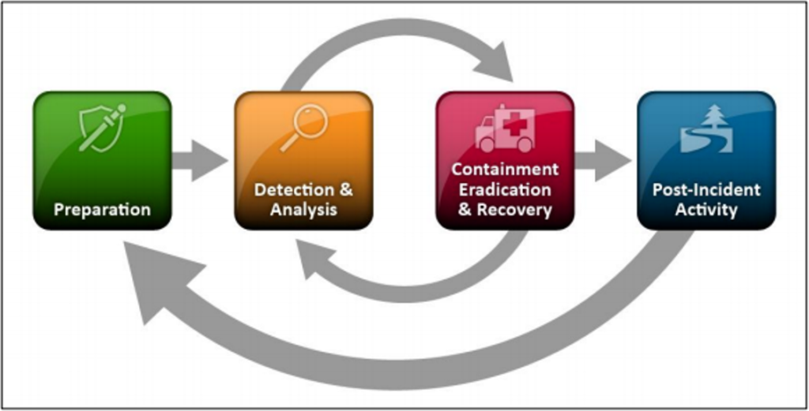
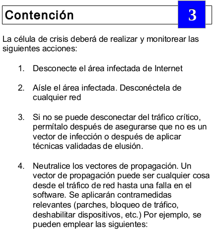
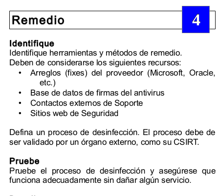

__Planes de respuesta__

#### RA4
a) Se han desarrollado procedimientos de actuación detallados para dar respuesta, mitigar, eliminar o contener los tipos de incidentes de ciberseguridad más habituales.
b) Se han preparado respuestas ciberresilientes ante incidentes que permitan seguir prestando los servicios de la organización y fortaleciendo las capacidades de identificación, detección, prevención, contención, recuperación y cooperación con terceros.

#### RA4
c) Se ha establecido un flujo de toma de decisiones y escalado de incidentes interno y/o externo adecuados.
d) Se han llevado a cabo las tareas de restablecimiento de los servicios afectados por un incidente hasta confirmar la vuelta a la normalidad.

#### RA4
e) Se han documentado las acciones realizadas y las conclusiones que permitan mantener un registro de “lecciones aprendidas”.
f) Se ha realizado un seguimiento adecuado del incidente para evitar que una situación similar se vuelva a repetir.

| Contenidos I | Slide |
| :-: | :-: |
| RA4 | 2 |
| Marco de Ciberseguridad | 7 |
| NIST - Marco de Ciberseguridad del NIST | 8 |
| Planes de respuesta | 14 |
| Respuesta a incidentes: ISO/IEC 27035 | 15 |
| Respuesta a incidentes: SP800-61 | 16 |
| Respuesta a incidentes: SP800-61 1. Preparación | 17 |
| Respuesta a incidentes: SP800-61 2. Detección | 21 |
| Respuesta a incidentes: SP800-61 3. Análisis | 25 |

| Contenidos II | Slide |
| :-: | :-: |
| Respuesta a incidentes: SP800-61 4. Contención | 31 |
| Respuesta a incidentes: SP800-61 5. Erradicación | 38 |
| Respuesta a incidentes: SP800-61 6. Recuperación | 41 |
| Respuesta a incidentes: SP800-61 7. Post-incidente (Lecciones aprendidas) | 45 |
| Playbook | 52 |
| Ejemplo Playbook | 58 |
| Bibliografía | 66 |
| Actividad | 68 |

#### Marco de Ciberseguridad

#### NIST - Marco de Ciberseguridad del NIST

NIST es el acrónimo de Instituto Nacional de Estándares y Tecnología \(National Institute of Standards and Technology\,en inglés\) dependiente del Departamento de Comercio de EE\.UU\.

El  __Marco de Ciberseguridad del NIST__  ayuda a los negocios de todo tamaño a comprender mejor sus riesgos de ciberseguridad\, administrar y reducir sus riesgos\, y proteger sus redes y datos\.

La implementación se realiza\, siguiendo estas cinco fáses:  __identificación protección\, detección\, respuesta y recuperación__ \.

Identificación\.

Identifica equipos\, software y en general activos\.

Políticas de seguridad en la que se identifique funciones y responsabilidades\, de personal con acceso a datos delicados\.

Pasos a seguir para protegerse y limitar daño ante ataques\.

2\. Protección

Implementar medidas de control\,

\- acceso a dispositivos

\- codificar datos delicados

\- copias de seguridad

\- formación

3\. Detección

Monitorizar sistemas y dispositivos

Investigar actividades inusual\.

4\. Respuesta

Notificar a clientes\, empleados en riesgo

Mantener funcionando operaciones de negocio e investigar ataques

5\. Recuperación

Reparar y restaurar los sistemas afectados por ataques\.

Mantener informados a empleados y clientes\.

#### Planes de respuesta

#### Respuesta a incidentes: ISO/IEC 27035

Tomando como referencia la ISO/IEC 27035\.

1\. Planificación y preparación

2\. Identificar\, detección y reporte

3\. Valoración y decisión

4\. Respuesta

5\. Lecciones aprendidas

_6\. Cierre del incidente_

__Information security incident management guide__

#### Respuesta a incidentes: SP800-61

Tomando como referencia el NIST\.

1\. Preparación

2\. Detección

3\. Análisis

4\. Contención

5\. Erradicación

6\. Recuperación

7\. Actividad post\-incidente

__SP800\-61 Guide__

#### Respuesta a incidentes: SP800-61
1. Preparación

El objetivo principal de esta fase es que  __la organización se encuentre preparada para responder y actuar frente a un ciberataqu__ e\, tomando en cuenta medidas de prevención y aseguramiento de los sistemas para reducir la superficie de ataque\.

1\.  __Tener conformado un equipo de respuesta a incidentes__ \, con la preparación y experiencia para poder atender\, dar seguimiento y solución a cualquier incidente de seguridad\.

2\.  __Contar con un Plan de Respuesta ante Incidentes\,__  que defina de manera clara y secuencial \(se recomienda hacerlo a manera de checklist\)\, los pasos a seguir ante un incidente de seguridad\.

3\.  __Tener preparado Hardware y Software para análisis de incidentes__ \, tal como:

_Software_  \(como EDR\) y/o Hardware para la  __recolección de datos forenses __ digitales y respaldo de información\.

_Equipos_  para tareas de  __análisis de datos\, análisis de tráfico de red__ \, redacción de reportes\.

Analizadores de paquetes y protocolos de red\.

4\. __ __  __Tener identificada y documentada la infraestructura de TI __ de la organización:

Diagramas de red y tener  __identificados los activos más importantes __ \(como servidores críticos\)\.

Tener clara y documentada la  __forma normal actual de operar __ \(Baseline\) de la red y aplicaciones\.

Tener identificada la  __lista de puertos utilizados __ en la red\.

__Hashes__  criptográficos de archivos críticos\.

#### Respuesta a incidentes: SP800-61
2. Detección

En esta fase juega un papel muy importante contar con una  __herramienta de monitorización y detección__ \, que sea capaz de realizar correlación de eventos\, Machine Learning y análisis de comportamientos para alertar cualquier comportamiento inusual y sospechoso sobre la red\.

Implementar en estas herramientas los casos que tienen que darse en esas herramientas para detectar un determinado incidente\.

1\.  __Determinar si se trata de solo un evento__  \(sin malas consecuencias para la organización\)   __o en realidad es un incidente__  \(con malas consecuencias para la organización\, como violación de políticas o estándares de seguridad\)\.

2\. Algunos de los  __indicadores__  o comportamientos más comunes que pueden ser  __señal de un incidente__  son:

Existencia de usuarios desconocidos\.

Procesos o conexiones de red extrañas\.

Conexiones de red a la escucha\.

Llaves de registro inusuales\.

Tareas agendadas desconocidas\, o servicios corriendo\.

3\. Tener en cuenta __ los vectores de ataque__ \, tales como \(se mencionan los más comunes\):

Dispositivos externos/removibles \(usb’s\)\.

Ataques de fuerza bruta \(Attrition\)\.

Navegación\, Email \(Spear phishing\, Bussiness Email Compromise\)\.

Explotación de vulnerabilidades \(de sistema operativo\, aplicaciones\)\.

Pérdida o robo de equipo\.

Ataques Man in the Middle \(MIM\)\.

Dependerán del tipo de incidente para el que nos estemos preparando\.

4\. Las fuentes más comunes de  __indicadores de incidentes__  son:

Sistemas SIEM\.

Software Antimalware y Antispam\.

Soluciones de File Integrity Checking\.

Servicios de monitoreo e información de seguridad y amenazas de terceros\, Open Source \(OSINT\)\, Comerciales\, Gubernamentales \(como CERT’s\, ISAC’s\, Data Feeds\)\.

Logs de sistemas operativos\, así como dispositivos de red \(como UTM’s \(IDS e IPS\)\, routers\, switches\)\.

Personas dentro y fuera de la organización\, afines al área de Ciberseguridad\.

#### Respuesta a incidentes: SP800-61
3. Análisis

Contar con  __personal__  altamente calificado para __ analizar\, investigar y determinar las acciones correctas __ a tomar frente un ciberataque de cualquier categoría\.

El equipo de respuesta a incidentes debe trabajar rápido para analizar y validar cada incidente\,  _siguiendo un proceso predefinido y documentado cada paso realizado_ \.

El análisis inicial debe proveer información suficiente para priorizar \(triage\) actividades subsecuentes\, como la contención del incidente y análisis más profundo de los efectos y alcance del incidente\.

Las siguientes son recomendaciones para hacer el análisis de incidentes más fáciles y efectivas:

__Entender comportamientos normales:__  El equipo de respuesta a incidentes debe analizar las redes\, sistemas y aplicaciones de la organización\, para entender cuál es su comportamiento normal \(Baseline\)\, de tal manera\, cuando se presente un comportamiento anormal\, sea más fácil de identificar\.

__Crear una política de retención de logs__ : Crear e implementar esta política que especifique por cuanto tiempo  los logs deben de mantenerse es de gran utilidad en el análisis porque principalmente los incidentes pueden ser descubiertos después de varios días\, semanas o meses después de haber ocurrido \(UTM’s\, Antimalware\, Sistemas\)\.

Las siguientes son recomendaciones para hacer el análisis de incidentes más fáciles y efectivas:

__Realizar correlación de eventos__ : La evidencia de un incidente puede ser registrada en logs de varios sistemas \(UTM’s\, Antimalware\, Sistemas operativos\, aplicaciones\)\. Recomendado uso de solución SIEM\.

__Mantener todos los relojes de los sistemas sincronizados:__  Hacer uso de protocolos como NTP\, con el fin de mantener la sincronización entre hosts y evitar que los eventos sean inconsistentes en lo que respecta a su hora de ocurrencia\, lo que dificulta en gran medida en análisis de incidentes\.

Las siguientes son recomendaciones para hacer el análisis de incidentes más fáciles y efectivas:

__Hacer uso de motores de búsqueda en internet  para investigar incidentes\.__

__Uso de analizadores de tráfico de red para la recolección de datos adicionales __ \(como Wireshark\)\.

__Filtrado de datos/logs__ : Una estrategia efectiva es filtrar categorías de datos significativos como eventos críticos e ir avanzando paulatinamente al análisis de datos menos relevantes \(aunque en muchas ocasiones este tipo de eventos revelan información importante sobre el incidente\)\.

Las siguientes son recomendaciones para hacer el análisis de incidentes más fáciles y efectivas:

__Priorización del incidente__ : La priorización en el manejo del incidente es quizás\, es el punto más crítico en la toma de decisiones en el proceso del manejo de incidentes\.

Este debe ser priorizado en basandose en datos relevantes\, tales como:

Impacto  __funcional__  del incidente: Ninguno\, Bajo\, Medio\, Alto\.

Impacto del incidente en la  __información de la organización__ : Ninguno\, Violación de Propiedad\, Perdida de Integirdad\.

__Recuperabilidad__  del incidente: Regular\, No Recuperable\.

Las siguientes son recomendaciones para hacer el análisis de incidentes más fáciles y efectivas:

__Notificación de incidentes:__  Definir los contactos y los medios por los cuales el personal debe reportar cualquier incidente de seguridad\.

#### Respuesta a incidentes: SP800-61
4. Contención

1\. Una parte esencial de esta etapa es la  __toma de las decisiones__  \(por ejemplo\, apagar un sistema\, desconectarlo de la red\, deshabilitar ciertas funciones\, etc\)\. El principal objetivo es  __prevenir un mayor daño y a su vez mantener las evidencias intactas__ \.

_Las estrategias de contención varían de acuerdo al tipo de incidente_ \. Las organizaciones deben  _crear estrategias de contención por separado\, para cada tipo de incidente_  mayor\, con criterios documentados y claros\, para facilitar la toma de decisiones\.

_Las estrategias de contención varían de acuerdo al tipo de incidente_ \.

| Incidente | Ejemplo | Estrategia de contención |
| :-: | :-: | :-: |
| Acceso no autorizado | Sucesivos intentos fallidos de login | Bloqueo de cuenta |
| Código Malicioso | Infección con virus | Desconexión de la red del equipo afectado |
| Acceso no autorizado | Compromiso del Root | Apagado del sistema |
| Reconocimiento | Scanning de puertos | Incorporación de reglas de filtrado en el firewall |

Criterios para determinar una estrategia apropiada incluyen:

Daño potencial y robo de recursos\.

Necesidad de preservación de evidencia\. \(Apago o no la máquina?\)

Disponibilidad de servicios \(por ejemplo\, conectividad de red\, servicios proveídos a terceros\)\.

Tiempo y recursos necesarios para implementar la estrategia\.

Criterios para determinar una estrategia apropiada incluyen:

Efectividad de la estrategia\.

Duración de la solución \(workaround de emergencia a llevar a cabo por 4 horas\, workaround temporal a borrar en 2 semanas\, solución permanente\)\.

En algunos casos se recomienda redirigir al atacante a un sandbox o honeynet\, para que la organización pueda monitorear las actividades del atacante\, usualmente para reunir evidencia adicional\.

2\. Recolección y manejo de  __evidencias__

a\) Es importante  __documentar claramente como toda la evidencia__ \, incluyendo sistemas comprometidos\,  __ha sido preservada__ \. Para esto es necesario instrumentar una Cadena de Custodia\, que documente cuando cualquier evidencia pase de una persona a otra y que incluya detalle y firmas de cada parte involucrada\.

2\. Recolección y manejo de  __evidencias__

b\) La  __evidencia debe ser conservada a detall__ e\, incluyendo los siguientes datos:

Información de identificación \(ubicación\, números seriales\, modelo\, Hostname\, IP\, MAC del equipo\)\.

Nombre\, cargo\, no\. Telefónico de cada individuo involucrado en la recolección o manejo de evidencia durante la investigación\.

Fecha y hora de cada manipulación de evidencia\.

Ubicaciones de donde fue guardada la evidencia\.

2\. Recolección y manejo de  __evidencias__

c\) __ __  __Identificación de los hosts atacados\.__  Los siguientes componentes describen las actividades más comunes para la identificación de hosts atacados:

Validar la dirección IP del host atacante\.

Investigación del host atacante a través de motores de búsqueda \(search engines\)\.

Uso de bases de datos de incidentes: IOC\, Threat Intelligence Platforms

Monitorear los canales de comunicación del atacante\.

#### Respuesta a incidentes: SP800-61
5. Erradicación

Posterior a la contención de un incidente\,  __la erradicación es necesaria__  \(aunque no siempre o se realiza en la etapa de recuperación\) y es importante  __identificar todos los hosts afectados__  dentro de la organización para que puedan ser recuperados\.

Algunas de las acciones a realizar en esta etapa son:

Eliminar malware\.

Eliminar usuarios maliciosos o vulnerados\.

Parcheo de sistemas para mitigar vulnerabilidades utilizadas\.

Crear nuevas reglas en las soluciones de seguridad\.

Aplicar un análisis de vulnerabilidades a los sistemas y la red \(Pen test\)\.

__Dependerán del tipo de incidente\.__

Las acciones a realizar en esta etapa  __d__  __ependerán del tipo de incidente\.__  Algunas estrategias de erradicación de incidentes:

| Incidente | Ejemplo | Estrategia de erradicación |
| :-: | :-: | :-: |
| DoS (denegación de servicio) | SYN Flood | Restitución del servicio caído |
| Virus | Gusano en la red | Corrección de efectos producidos. Restauración de backups |
| Vandalismo | Defacement a un sitio web | Reparar el sitio web |
| Intrusión | Instalación de un rootkit | Reinstalación del equipo y recuperación de datos |

#### Respuesta a incidentes: SP800-61
6. Recuperación

En esta etapa\, los administradores:

_restauran_  __ los __  _sistemas_  __ a su operación normal__ \,

_confirman_  __ si están __  _funcionando_  __ de manera correcta__  y

\(si aplica\) se  _remedian vulnerabilidades_  para prevenir incidentes similares\.

Recuperación incluye acciones tales como:

Restaurar sistemas desde respaldos limpios\.

Restaurar sistemas desde cero\.

Instalación de parches\.

Cambiar contraseñas en sistemas locales y recursos de red\.

Recuperación incluye acciones tales como:

Administradores deben monitorear sistemas para asegurarse de su funcionamiento normal\.

Continuar probando los sistemas restaurados\.

Documentar los pasos llevados a cabo\.

Recuperación permite a la contención empezar de nuevo\, si la actividad maliciosa es detectada de nueva cuenta\.

Las estrategias de recuperación dependerán del incidente

| Incidente | Ejemplo | Estrategia de recuperación |
| :-: | :-: | :-: |
| DoS (denegación de servicio) | SYN Flood | Restitución del servicio caído |
| Virus | Gusano en la red | Corrección de efectos producidos. Restauración de Backups |
| Vandalismo | Defacement a un sitio web | Reparar el sitio web |
| Intrusión | Instalación de un Rootkit | Reinstalación del equipo y recuperación de datos |

#### Respuesta a incidentes: SP800-61
7. Post-incidente (Lecciones aprendidas)

Una de las partes más importantes de la Respuesta a Incidentes es también comúnmente omitida:  __aprender y mejorar__ \. El equipo de respuesta a incidentes debe evolucionar\, tomando conciencia y conocimiento de las nuevas amenazas\, tecnologías y lecciones aprendidas\.

Mantener una reunión de “Lecciones Aprendidas”\, con todas las partes involucradas en un incidente\, puede ayudar en gran medida a mejorar las medidas de seguridad y el propio proceso de respuesta a incidentes\.

Preguntas a ser respondidas en estas reuniones son:

¿Qué sucedió exactamente y en qué momento \(fechas y horas\)?

¿Cómo realizó su trabajo el equipo en la atención del incidente? ¿Se siguieron los procesos documentados? ¿Fueron los adecuados?

¿Qué información fue necesitada en primera instancia?

¿Se tomaron pasos o acciones que pudieron haber inhibido la recuperación?

Preguntas a ser respondidas en estas reuniones son:

¿Qué podría hacer el equipo de manera diferente la próxima vez que ocurra un incidente similar?

¿Cómo podría ser mejorado el mecanismo de compartición de información con otras organizaciones?

¿Qué acciones correctivas se pueden aplicar para prevenir incidentes similares futuros?

¿Qué indicadores deben ser observados en el futuro para detectar incidentes similares?

Preguntas a ser respondidas en estas reuniones son:

¿Qué herramientas o recursos adicionales se necesitan para detectar\, analizar y mitigar futuros incidentes?

Otra actividad importante en esta etapa es crear un  __“Informe de seguimiento del Incidente“__ \. Este informe podrá ser usado como referencia para ayudar al manejo de futuros incidentes similares\.

Preguntas a ser respondidas en estas reuniones son:

__Uso de la información recolectada__ : El estudio de las características del incidente puede revelar la existencia de vulnerabilidades y amenazas sistemáticas\, así como cambios en las tendencias de incidentes\. Esta información puede ser tomada en cuenta para la realización del proceso de análisis de riesgos\, lo que a su vez llevará a selección e implementación de controles adicionales\.

Las organizaciones deben focalizarse en recolectar información accionable\, en lugar de recabar información simplemente porque está disponible\.

Preguntas a ser respondidas en estas reuniones son:

__Métricas sugeridas para la recolección de incidentes son:__

Número de incidentes atendidos: Se recomienda enfocarse en los incidentes de mayor relevancia o que necesitaron de un mayor esfuerzo por parte del equipo de respuesta a incidentes para su resolución\.

Tiempo utilizado por cada incidente\.

Análisis objetivo de cada incidente: Con esto se puede determinar qué tan efectiva fue la respuesta y resolución del mismo\.

Preguntas a ser respondidas en estas reuniones son:

__Retención de la evidencia__ : Las organizaciones deben establecer una política para definir por cuanto tiempo se resguardará la evidencia de un incidente\. GRS \(General Records Schedule\)\, especifica que los registros de incidentes deben resguardarse por un periodo de 3 años\.

#### Playbook

__Playbook__ :  Hace referencia a un documento de instrucciones elaborado por un cuerpo técnico\, en el que se describen las distintas jugadas que se van a utilziar\. Tiene sentido\, si consideramos la respuesta a incidentes como un conjunto de acciones a realizar como respuesta al incidente\, las cuales\, por cierto\, deben estar en perfecta sincronización dentro de la organización\. Estas acciones están centradas en dar respuesta a un incidente concreto\.

Un  __SOC__  con un  __playbook__  tiene la ventaja de poder centrarse solo en las alertas que importan\, y en las  _acciones muy dirigidas a solucionar el problema_ \.

El propósito de un playbook es proporcionar a todos los miembros de una organización una  _clara comprensión de sus responsabilidades_  respecto de las normas de ciberseguridad y las prácticas aceptadas antes\, durante y después de un incidente de seguridad\.

Todas las organizaciones tienen planes para diferentes incidentes que podrían afectar la resistencia del negocio si no están preparados\.

Una vez que el equipo de respuesta a incidentes está definido y es consciente de su posición\, es necesario poner en marcha  __los pasos clave de acción de un incidente de ciberseguridad__ \. Estos incluyen

Detección de incidentes

Acciones de respuesta

Comunicación

Es unánime en distintos organismos internacionales la necesidad de al menos  __contar Playbook para los casos más conocidos de Ciberataques__ \.

__Preparación__ : “Todo lo necesario para ejecutar el playbook”

__Identificación__ : “Recopilación y análisis de toda la información relativa al incidente”

__Contención__ : “Acciones inmediata para contener el incidente ej: Aislar de la red el equipo”

__Remedio__ : “Acciones que reparar el daño y eviten su repetición”

__Recuperación__ : “Acciones para restablecer el servicio”

__Repercusiones__ : “Debería de redactarse un informe de crisis que será distribuido entre todos los stakeholders”

__Mejora continua__ : “Como respondemos mejor”

¿Qué playbook necesita mi empresa?\, básicamente deben conversar con su matriz de riesgos que contemple Ciberriesgos y esté acorde al giro del negocio\.

#### Ejemplo Playbook

#### Ejemplo Playbook: Ejemplo de infección de gusanos

#### Bibliografía

_[https://www\.avsoftware\.com\.mx/respuesta\-a\-incidentes\-de\-ciberseguridad\-guia\-de\-nist/\#1603043331556\-26ebd2a3\-9ac2](https://www.avsoftware.com.mx/respuesta-a-incidentes-de-ciberseguridad-guia-de-nist/#1603043331556-26ebd2a3-9ac2)_

_[https://blog\.netdatanetworks\.com/que\-hacer\-en\-caso\-de\-un\-ciberataque](https://blog.netdatanetworks.com/que-hacer-en-caso-de-un-ciberataque)_

https://playbooks\.flexibleir\.com/

#### Actividad

#### Actividad I

Traducir la plantilla en castellano:

https://github\.com/IES\-Rafael\-Alberti/incident\-response\-plan\-plantilla

Crear un plan de respuesta a incidentes partiendo de la plantilla\.

Crear e incorporar un conjunto de playbook básicos\.

