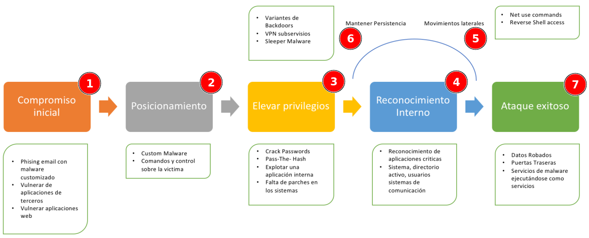
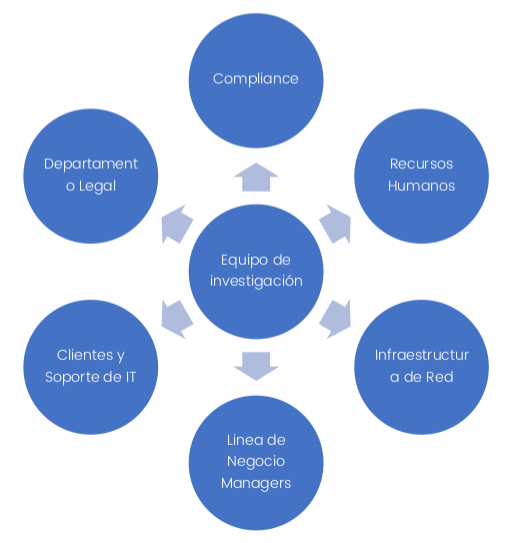
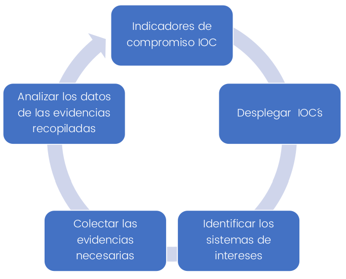

<!--  -->

# Planes de respuesta

> RA4

## 1. Introducción

El curso se trabaja sobre los problemas que debe de hacer frente un profesional que desarrolle su carrera en un equipo de CSIRT con objeto de dar respuesta a un incidente de seguridad (IR). Cuando se produce un incidente de seguridad desde el CIO de la organización hasta la persona que está recolectando las evidencias deben de estar coordinadas durante todo el proceso. Una respuesta ante un incidente hoy requiere que todos los recursos y empleados de la organización, medios de comunicaciones, marketing estén alineados. Durante el curso se verán y se darán respuesta a las siguientes premisas:

- Entender que es un proceso IR
- Como construir un equipo de respuesta de forma satisfactoria
- Que tipo de infraestructura necesita un equipo de respuesta de incidentes
- Casos prácticos de ataques en tiempo real bajo la plataforma de iHackLabs
- Liderar la investigación de los incidentes
- Recolectar y manejar las evidencias
- Analizar Evidencias en Windows y MAC
- Observar y analizar Malware
- Escribir reportes

Un cambio está sucediendo en toda la industria de la ciberseguridad tanto en la parte de pentesters como los especialistas en ciberseguridad. Desde el punto de vista de ciberseguridad la respuesta de incidentes se ha  convertido en un componente importante de la tecnología de la información IT. Los ataques se han vuelto no solo más numerosos y diversos, sino que además son cada vez más peligrosos y dañinos aumentando su frecuencia de forma preocupante.

_Es importante entender que no todos los incidentes pueden ser prevenidos, pero disponer de la capacidad de detectar
incidentes de forma rápida y minimizar la perdida y destrucción de los datos de una organización mitigando de esta
manera las debilidades que han sido explotadas son tareas que se desarrollan en un grupo CSIRT_.

Podremos ver el correcto desarrollo de las pautas para dar una respuesta clara y adecuada a cada incidente de seguridad.

Debido a que la respuesta de incidentes es un proceso complejo se requiere de practicar y simular incidentes de
ciberseguridad dentro de las organizaciones. Además, los equipos de incidentes de repuesta requieren una vigilancia
constante de los procesos internos y externos de la organización. Del mismo es vital diseñar un plan de comunicación
interno que agilice el proceso y la toma de decisiones ante un incidente. El centro de Recursos y seguridad de las
computadoras CSRC del instituto de estándares y tecnologías NIST ha desarrollado una serie de guías sobre estos eventos.

Un gran número de gobiernos, agencias, socios de otras organizaciones, contractos dan soporte a la guía 800-61r2 de
NIST.

## 2. ¿Qué es un incidente?

Para entender que es un incidente, es necesario explicar que es un evento.

#### ¿Qué es un evento?

Cualquier ocurrencia detectada o informada que indique una posible violación o falla en un sistema. Un evento es una situación de interés en cuanto a la seguridad y podría señalar o indicar que algo de importancia está o puede suceder en el sistema.

Ejemplos de eventos:

* Servicios mal configurados.
* Sistemas con claves conocidas.
* Conexiones no autorizadas a un sistema.
* Fallas en el funcionamiento de un servicio.
* Notificación de accesos no autorizados.

#### ¿Qué es un incidente?

Un incidente es un evento inesperado o no deseado que puede impactar o impacta a la red o los sistemas de una institución de forma que pueda comprometer la **confidencialidad** de la información, la **estabilidad** del servicio o la **integridad** de estos.

Ejemplos de incidentes

* Amenazas a la seguridad física de seres humanos.
* Ataques a Sistemas de manejo de información o cualquier parte de la infraestructura de red del backbone del CEDIA.
* Ataques a cualquier gran equipo de servicio público, sea multiusuario o con propósito dedicado.
* Compromiso de información en cuentas restringidas confidenciales o instalaciones de software, en particular aquellas usadas para sistemas de administración que contengan información confidencial, o aquellos usuarios para administración del sistema.
* Ataques de negación de servicio sobre cualquiera de los 3 puntos anteriores.
* Ataques en gran escala de cualquier tipo.
* Amenazas, acoso y cualquier otra ofensa criminal en el que estén involucradas cuentas de usuario.
* Compromiso de cuentas de usuarios individuales en sistemas multiusuarios.
* Compromiso de sistemas de escritorio.
* Falsificación y suplantación y cualquier otra violación de reglas locales y regulaciones.
* Negación de servicio en cuentas de usuario individuales.

Otra forma de ver que es un incidente se establece en base al alcance de lo que el personal de la organización es capaz de realizar y de las medidas que se toman para ello. Desde el punto de vista de definición se establece la premisa de que el personal entienden y saben cuáles son las responsabilidades de cada equipo. Para ello, la organización dispondrá de una política que defina cuáles son las responsabilidades de cada equipo, y si no existe, se debería de crear una a la mayor brevedad. Es importante entender que no existe una política universal, pero deberíamos de considerar los siguientes puntos cuando diseñemos una:

* Intento de causar daño.
* Fue realizado por una persona.
* Implica un recurso informático.

Los dos primeros son consistentes con muchos tipos de incidentes que no tienen que ver con la tecnología, tales como asaltos, robos o incendios provocados, aunque si no hay intento de causar daño, también se consideran incidente. Por ejemplo, y algo más tecnológico, sería un análisis de vulnerabilidades que no tienen como intención hacer daño, sin embargo, aunque no intencionado, podría provocar un incidente en algún sistema.

El tercer punto requiere de una persona evalué y excluya todos los eventos que son fallos aleatorios y que están fuera de nuestro control. Por ejemplo, un firewall se apague de forma inmediata por un fallo de corriente y deje sin servicio a varias aplicaciones críticas de la organización.

Algunos de los incidentes que están relacionados con ordenadores o dispositivos tecnológicos serian los siguientes:

* Datos robados, incluyendo datos sensibles, email y documentos.
* Robo de fondos, incluyendo datos de acceso, tarjetas de crédito.
* Extorsión.
* Accesos no autorizados a ordenadores o servidores.
* Presencia de malware, incluyendo acceso remoto o spyware.
* Posesión ilegal o no autorizados de materiales.

El impacto de estos incidentes podría ir desde tener que reconfigurar algunos dispositivos o reemplazarlos, hasta tener que gastar una gran cantidad de dinero en remediar el problema, hasta incluso que la empresa tenga que disolverse. Las decisiones que tome, antes, durante y después de que ocurra un incidente afectarán directamente el impacto global.

## 3. Contexto de la respuesta a un incidente

### 3.1 ¿Qué es la respuesta a incidente?

La respuesta de incidentes es la coordinación, estructuración y resolución de un incidente detectado. A modo resumido podríamos definirlo en los siguientes puntos de más abajo:

- Confirmar dónde y cómo ha sucedido el incidente y si este realmente ha sucedido o se trata de un falso positivo.
- Proveer de una rápida detección y sobre todo contención.
- Determinar y documentar el alcance del incidente (si se han producido daños, de que tipo, si se han producido perdidas monetarias etc.)
- Prevenir una respuesta sin sentido o que no esté bien documentada.
- Determinar y promover los hechos que se han producido y actuar en consecuencia con la información obtenida.
- Minimizar la perdida de negocio y las operaciones normales de una organización.
- Restaurar las operaciones normales.
- Minimizar los daños ocasiones sobre los componentes que fueron comprometidos.
- Administrar la percepción del incidente públicamente en caso de ser necesario, para no impactar en la credibilidad y confianza de nuestros clientes.
- Tomar acciones criminales o acciones civiles contra los autores que provocaron el incidente.
- Formar y realizar ejercicios de simulación con los equipos de respuesta de incidentes

Por lo general la respuesta de incidentes consiste en investigar que ha ocurrido y evaluar los daños producidos. Un equipo de remediación elimina las amenazas de un atacante sobre el entorno y gestiona las comunicaciones a empleados de la compañía, socios, publicas etc.

Todas las respuestas a un incidente se gestionan a través de una metodología que envuelve el tiempo de los ataques, los daños ocasionados, el grado de compromiso que ha sufrido la organización entre otros puntos.

### 3.2 ¿Objetivos de la respuesta de incidentes?

El primer objetivo de una respuesta ante un incidente es eliminar de forma efectiva la amenaza de la organización y del entorno, del mismo modo minimizar los daños y restaurar las operaciones lo más rápido posible. Este objetivo se realiza a través de las siguientes actividades:

#### Investigación.

* Determinar el vector de ataque inicial.
* Determinar el malware y las herramientas a utilizar.
* Determinar qué sistemas fueron infectados y cómo.
* Determinar qué tipo de ataque sofisticado se ha sufrido y los daños producidos.
* Determinar si el incidente continúa abierto.
* Establecer un tiempo de inicio y final del incidente.

#### Remediación.

Usando la información obtenida de la investigación, desarrollar e implementar un plan de remediación.

### 3.2 ¿Cómo se produce un incidente?

Aunque trabajamos en ayudar a las organizaciones a través de pentest continuos en detectar las brechas de seguridad en sus infraestructuras este tipo de test tienen una carencia frente a un atacante real debido a que este último dispone de un tiempo infinito para buscar, localizar e incluso explotar una vulnerabilidad con éxito. Todos los sectores conectados a internet sufren hoy en día ataques constantes independientemente del sector que sean o se dediquen.

Todos los criminales que se dedican a extorsionar o robar información a través de ataques cibernéticos se exponen poco o apenas asumen riesgos. Debemos recordar que se produzcan incidentes es algo inevitable, pero sin embargo podemos aplicar las lecciones aprendidas sobre los casos que se van produciendo para evitar que vuelvan a ocurrir o incluso actuar con mayor agilidad frente al incidente.

##### CASO PRACTICO

De modo que sea más fácil de entender como se produce un incidente de seguridad analizaremos y comentaremos el siguiente caso práctico.

> Durante varios meses el atacante obtuvo información confidencial de diferentes recursos suplementando a los usuarios internos a través de sus propias cuentas de usuarios que habían sido comprometidas. El atacante rompió el cifrado del HASH LM de las cuentas del dominio debido a que la compañía no usaba una política fuerte de contraseñas, además de que los administradores del domino no habían deshabilitado un sistema de cifrado que se considera inseguro como LM.
>
> Al cabo del tiempo la compañía detecto un volcado de los datos en pastebin y del mismo modo una copia de la base de datos, momento en el que la empresa fue consciente del ataque. Según los análisis forenses el atacante estuvo dentro de la organización aproximadamente durante 4 semanas sin ser detectado y sin alertar que se producía un comportamiento anómalo en la red.

### 3.3 Concepto del ciclo de vida de un ataque

El ciclo de vida de un ataque consiste en siete etapas. Aunque se menciona que sean siete pasos o etapas no siempre es así y en ocasiones dependiendo del ataque las etapas puedes variar, sin embargo, como proceso natural un incidente se adapta y debe de ser detectado en las etapas tempranas de un ataque.

Este concepto se ha incluido a modo resumen porque es importante entender como un atacante realiza los ataques y porque diferentes fases o etapas podría pasar de modo que según el momento se detecte el incidente sepamos el grado o no de compromiso de la organización y del mismo modo su impacto. Está información es muy interesante cuando estas en la fase de remediación



1. **Compromiso Inicial**: Un atacante logra con éxito ejecutar código malicioso en uno o más sistemas de la organización. Lo habitual es que este primer paso se inicie debido a ingeniera social sobre algún usuario de la organización a través de phishing o que haya logrado de forma satisfactoria explotar alguna vulnerabilidad de un portal web. Del mismo modo es posible que el atacante haya logrado explotar con éxito una vulnerabilidad de software de terceros.
2. **Posicionamiento**: El atacante logra establecer conexión remota sobre el sistema comprometido, esta fase ocurre inmediatamente después de la fase de compromiso inicial. Lo habitual es que un atacante establezca una persistencia a través de una puerta trasera o ejecutando código binario en el sistema comprometido.
3. **Escalar privilegios**: El atacante obtiene la manera de elevar los privilegios en los sistemas y por lo tanto dispone de acceso a datos más sensibles. En este paso el atacante realiza diferentes técnicas con el objetivo de lograr acceder a todos los sistemas.
4. **Reconocimiento interno**: El atacante reconoce el entorno y analiza la configuración interna de la organización para entender mejor su funcionamiento y como lograr acceder a los datos sensibles de los mismos.
5. **Movimientos laterales**: El atacante salta y pivota en la red buscando sistemas mas críticos evadiendo de esta manera las medidas de seguridad de FW o redes en DMZ. Del mismo modo las técnicas más habituales es través de RDP, VNC, tareas
   programadas etc.
6. **Mantener Persistencia**: El objetivo es instalar servicios ocultos en los sistemas para retomar las conexiones en caso de ser necesario. La persistencia se suele conseguir a través de VPN, puertas traseras o implementar malware en software legitimo.
7. **Ataque exitoso**: El atacante ha logrado su objetivo y ha robado los datos de la compañía, ha provocado perdidas internas de información o problemas internos. Incluso mantiene un acceso interno para volver a realizar ataques después de un tiempo.

## 4. El proceso que envuelve la respuesta a incidentes

En un proceso IR intervienen varios factores. Las capacidades y recursos de las organizaciones se miden según el número de
unidades que intervienen en el proceso. Durante un proceso de IR son muchas las compañías que ensamblan equipos compuestos por miembros específicos de la organización. Siempre se recomienda que sea un miembro quien dirija y coordine durante la respuesta de un incidente. El director habitualmente suele ser un CIO o CISO de la organización, esta persona sería el punto de conexión entre todas las investigaciones.



De cualquier modo, es bueno que los miembros que componen un equipo de incidentes durante su intervención dispongan de las siguientes características:

* Tener capacidad de análisis.
* Buena comunicación.
* Atención a los detalles.
* Ser estructurados y organizados.
* Demostrar liderazgo y gran resolución de problemas.

### 4.1 Respuesta inicial

Los objetivos principales en este paso incluyen reunir al equipo de respuesta, revisar los datos basados en la red y otros datos fácilmente disponibles, determinar el tipo de incidente y evaluar el impacto potencial. El objetivo es reunir suficiente información inicial para permitir que el equipo determine la respuesta adecuada.

Típicamente, este paso no implicará recopilar datos directamente del sistema afectado. Los datos examinados durante esta fase usualmente involucran el análisis de la red, el registro y otra evidencia histórica y contextual. Esta información le brindará el contexto necesario para ayudar a decidir la respuesta adecuada. Por ejemplo, si se encuentra un troyano bancario en la portátil del CEO, su respuesta probablemente será bastante diferente de si se encuentra en el sistema de una recepcionista. Además, se requiere una investigación completa, esta información será parte de las pistas iniciales.

Algunas tareas comunes que puede realizar durante este paso son:

* Entrevistar a la persona que reportó el problema y recopilar y almacenar todos los posibles detalles que ellos puedan proveerte.
* Intervenir los equipos de IT, de modo que se revisen los detalles técnicos.
* Intervenir al personal de negocio y reportar el evento en su contexto y dependiendo de la gravedad.
* Revisar la red, logs, e identificar qué datos son necesarios para el soporte y la revisión posterior.
* Documentar todo el procedimiento y detalles recogidos de diferentes fuentes.

### 4.2 Investigación

El objetivo de una investigación es determinar los hechos que describen qué sucedió, cómo sucedió, y en algunos casos, quién fue el responsable, aunque este punto puede ser difícil de conseguir. En este momento puede ser interesante plantearse contratar ayuda externa.

Sin conocer los hechos de lo ocurrido tales como qué acceso obtuvo el atacante o lo que hizo, el equipo no está en una buena posición para pasar a la fase de remediación.

#### Indicadores de compromiso

Una investigación sin pistas es un proceso perdido. Por lo tanto, la colección de pistas iniciales es un paso crítico en cualquier investigación. Un error de investigación común en muchas organizaciones es enfocarse solo en encontrar malware.

Es poco probable que solo un atacante tenga como objetivo instalar malware, lo más probable es que el atacante tenga en mente robar información confidencial, correos o documentos internos o incluso alterar datos.

Una vez que el atacante accede a la red y tiene credenciales válidas no es necesario que use malware para acceder a sistemas adicionales. Centrarse solo en el malware probablemente cause que se pierdan hallazgos críticos. Recuerde, el foco de cualquier investigación debe estar en las pistas.

{: height="50%"  width="50%"}

<!-- {: style="height:50%;width:50%"} -->

La creación de **indicadores de compromiso (IOCs)** (pronunciado eye-oh-cee) es el proceso de documentar las características y detalles de un incidente de una manera estructurada. Esto incluye todo, desde ambas perspectivas tanto desde el punto de vista de servidor como de red: cosas que van más allá del simple malware. Piense en detalles tales eventos de inicio de sesión, mecanismos de persistencia detectados, nombres de dominio e incluso firmas de protocolo de red de malware.

El objetivo de los indicadores de compromiso (IOCs) es ayudar a describir, comunicar y encontrar indicios relacionados con un incidente. Debido a que un COI es solo una definición, no proporciona el mecanismo real para encontrar coincidencias.

El uso de indicadores de compromiso (IOC) para documentar incidentes es excelente, pero su poder real está en habilitar equipos de RI. El éxito de una investigación depende de su capacidad para buscar IOC en toda la empresa e informar sobre ellos de manera automática, a esto se le llama **despliegue de IOC**.

Después de implementar los indicadores de compromiso IOC, comenzará a obtener lo que se conoce como **detección**. La detección se produce cuando una herramienta de indicadores de compromiso encuentra una coincidencia para una regla dada.

Antes de actuar se debe de revisar la información para determinar si no se trata de un falso positivo.

Una vez que se identifican los sistemas y tienen indicadores de compromiso activos, el próximo paso es recopilar datos adicionales para el análisis. El equipo RI creará un plan para recolectar y preservar las evidencias. El factor prioritario es preservar las evidencias y para ello se utilizan procesos que minimicen los cambios del sistema, minimizamos el tiempo de interacción con los equipos y sistemas, sin olvidar de crear la documentación necesaria. Puede recopilar evidencias del sistema en ejecución o decidir apagar el sistema y tomar las evidencias con el sistema apagado.

**La respuesta en vivo** es el proceso de recolección de evidencia más común. Una respuesta en vivo es el proceso de usar una herramienta automatizada para recopilar un conjunto estándar de datos sobre un sistema en ejecución. Los datos incluye tanto información volátil como no volátil que proporcionará rápidamente respuestas a preguntas de investigación. La información típica recopilada incluye elementos tales como una lista de procesos, conexiones de red activas, registros de eventos, una lista de objetos en un sistema de archivos y el contenido del registro. También podemos recoger el contenido de archivos específicos, como archivos de registro o malware sospechoso. Ya que el proceso estará automatizado y el tamaño de los datos no es demasiado grande, realizamos este tipo de paso en todos los sistemas de interés. Un análisis de respuesta en vivo usualmente será capaz de confirmar aún más un compromiso, proporcionar detalles adicionales sobre lo que atacante hizo en el sistema y revela pistas adicionales para investigar.

#### Preservar la evidencia

* **Recolección de memoria**: La recolección de memoria es más útil en los casos en que se sospecha que el atacante está utilizando un mecanismo para ocultar sus actividades, tales como un rootkit, y no puede obtener una imagen de disco. La memoria también es útil para casos donde la actividad maliciosa solo reside en la memoria, o deja muy pocos rastros en el disco. En la mayoría de los sistemas a los que respondemos, la memoria no es recogida, sin embargo. Aunque algunos pueden encontrar esto sorprendente, hemos encontrado que analizar la memoria tiene beneficios limitados para una investigación que tienen que ser complementados con otros datos, ya que no proporciona datos suficientes para responder preguntas de alto nivel. Aunque es posible que puedas identificar que el malware se está ejecutando en un sistema, es probable que no pueda explicar cómo llegó allí, o qué ha estado haciendo el atacante en ese sistema.
* **Imagen de disco**: Las imágenes de disco forense son duplicaciones completas de discos duros en un sistema. Durante una respuesta a un incidente, es común para nosotros recoger imágenes en un modo "en vivo", donde el sistema no se desconecta y nosotros creamos una imagen en medios externos. Debido a que las imágenes de disco son grandes y pueden tomar mucho tiempo para analizar, normalmente los recopilamos solo para situaciones donde cree que una imagen de disco es necesaria para proporcionar beneficios a la investigación. Las imágenes del disco forense son útiles en los casos en que un atacante realizó muchas acciones durante un largo tiempo, cuando hay preguntas sin respuesta que otras evidencias no concluyeron, o donde esperamos recuperar información que creemos que solo estará disponible desde una imagen de disco.

#### Analizar los datos

El análisis de datos es el proceso de tomar la evidencia preservada en el paso anterior y realizar un examen que se centra en responder las preguntas de investigación. Los resultados del análisis normalmente se documentan en un informe formal.

Este paso en el ciclo de vida de respuesta de incidente es donde solemos pasar la mayor parte de nuestro tiempo. La organización debe decidir qué análisis realizará usted mismo y qué porciones, o valorar subcontratar si no se posee los conocimientos para ello.

Hay tres áreas principales dentro del análisis de datos:

1. **Análisis de malware**: Durante la mayoría de las investigaciones, encontramos archivos que son sospecha de malware. Lo habitual es que un equipo dedicado de analistas de malware examina estos archivos. Realicen informes que incluyen indicadores de compromiso y una descripción detallada de la funcionalidad. Aunque disponer de un equipo de malware especializado no se ajusta a la mayoría de los presupuestos, las organizaciones deberían considerar invertir en una capacidad básica para clasificar malware sospechoso.
2. **Análisis de respuesta en vivo**: El examen de los datos de respuesta en vivo es uno de los pasos de análisis más críticos durante una investigación. Si estás viendo en vivo datos de respuesta, normalmente es porque hay algún indicio de actividad sospechosa en un sistema, pero hay detalles limitados. Durante el análisis se debe de intentar encontrar el origen y explicar qué sucedió. Si se pierden detalles en esta etapa, podría ser que se pase por alto una parte de la actividad del atacante en el resultado final. Los resultados del análisis de respuesta en vivo deberían ayudar a comprender el impacto que tiene el incidente.
3. **Examen forense**: Capturar imágenes de disco durante una respuesta a incidentes es una tarea muy enfocada y sensible al
   tiempo. Normalmente deseamos dar resultados un puñado de preguntas realistas que queremos responder, por lo tanto, se
   debe de decidir sobre un enfoque que pueda descubrir información que responder y luego ejecutar. Si no obtenemos
   respuestas, podemos usar un enfoque personal, pero eso depende de cuánto tiempo hay y qué esperamos obtener de ello

#### Remediar el problema

Los planes de remediación variarán enormemente, dependiendo de las circunstancias del incidente y el potencial impacto. El plan deberá tener en cuenta diversos factores, tales como situaciónes legales, comerciales, políticas y técnicas. El plan también debería incluir un protocolo de comunicación que defina quién en la organización dirá qué, y cuándo.

#### Seguimiento de la investigación

Debe estar definido y ser un procedimiento claro. Durante la fase de investigacion se debe tener mecanismos que permitan rastrear fácilmente la información crítica, asi como compartirla con otros equipos auxiliares y el resto de la organización, de modo claro y con liderazgo.

Debe de haber un sistema que permita, a traves de un identificador, referirse a un incidente específico, del mismo modo debe permitir  documentar cualquier información y evidencia relacionada con un incidente especifico.

* Lista de evidencias recolectadas.
* Lista de sistemas afectados.
* Lista de todos los ficheros que son de interes.
* Lista de los datos que se han accedido o robado.
* Lista de la actividad del atacante.
* Lista de la red basada en indicadores de compromiso.
* Lista de host basados en indicadores de compromiso.
* Lista de cuentas comprometidas.
* Lista de tareas y quien las ha respondido durante el incidente.

#### Reporting

Como consultores, nuestros informes son fundamentales para nuestros clientes. El desarrollo y la creación de un informe requiere de tiempo, no es algo trivial y es algo que debemos tener en cuenta durante todo el proceso de investigación, ya que durante esta fase se descubrirán muchos hechos que deberán quedar reflejados en el informe.

Durante las investigaciones, los hallazgos se basan en numerosos hechos técnicos que, sin la documentación adecuada, puede ser difícil de comunicar. Por tanto, hay que considerar los informes como un entregable final que los equipos de respuesta de incidentes tienen que desarrollar. Los informes no solo proporcionan los resultados documentados consecuencia del esfuerzo realizado, sino que también ayudan a focalizar el proceso de investigacion y a realizar investigaciones de calidad. Los informes obligan a reducir la velocidad del proceso de investigacion, documentar los hallazgos en formato estructurado, verificando las evidencias y repasando en lo que sucedió.

#### Preparando la gestion de los incidentes

Si la organización no dispone de la infraestructura necesaria para responder a los incidentes, la tasa de éxito es baja o nula. Por tanto, durante la fase de preparacion, la organización debera dotar de los recursos necesarios a los equipos de respuesta.

Desde un punto de vista técnico debemos de abordar las siguientes preguntas.

* ¿Que pasó exactamente? ¿Cuál es el daño y cómo entraron los atacantes?
* ¿El incidente está en curso?
* ¿Qué información fue robada o accedida?
* ¿Qué recursos se vieron afectados por el incidente?
* ¿Cuáles son las responsabilidades en cuanto a notificación y divulgación?
* ¿Qué pasos se deben realizar para remediar la situación?
* ¿Qué acciones se pueden tomar para proteger a la empresa de incidentes similares?

Aunque en si responder a todas las preguntas parece un desafío, es posible siempre y cuando consigamos extraer todos los datos necesarios de los sistemas de información, de las comunicaciones etc. Para ello, como comentaremos, es importante que durante el proceso de preparacion, los equipos de respueta tenga definidos los procedimientos adecuados para realizar este trabajo, asi como los recursos neceasrios que para que proceso sea agil y eficiente.

##### ¿Qué áreas son necesarias cubrir?

* **Entrenamiento**: Esta área incluye temas tales como la identificación de riesgos, políticas para llevar acabo una respuesta de incidentes, definicion de cómo trabajar con servicios IT contratados, tipo de infraestructura, formación del usuario.
* **Entrenamiento especifico al equipo de IR**: Esta área incluye procedimientos de comunicación y recursos tales como hardware, software, capacitación y documentación.
* **Preparación de la infraestructura**: Esta área incluye la administración de activos, instrumentación, documentación, herramientas de investigación, segmentación y red servicios.
* **Plataformas de simulación**: Es importante realizar ciber ejercicios que valúen a los equipos de respuestas a través de plataformas de simulación que ayudan a medir los tiempos de respuesta y cualificar el estado de madurez de los equipos.

##### ¿Dónde estamos?

Si deseamos enfrentarnos a un incidente con éxito y llevar acabo una respuesta eficiente, el primer paso que deberíamos cubrir es conocer dónde estamos y disponer de una foto del riesgo que supone para la organización. Para ello se deben de valorar los siguientes puntos que nombramos a continuación:

* ¿Cuáles son los activos críticos?.
* ¿Cuáles pueden ser las amenazas?.
* ¿Grado de exposición existe?.
* Requisitos regulatorios que debemos de cumplir.
* ¿Qué recursos necesitamos para estar preparados ante un incidente?.

##### Activos críticos

Como activo críticos podríamos encuadrar las siguientes opciones:

* Mantener y proteger la reputación de la organización.
* Proteger la información secreta, tales como patentes, código fuente, propiedad intelectual etc.
* Proteger la información personal de la organización.
* Proteger los métodos de pago y como se procesan en la organización.

Los activos críticos son los que generan mayor responsabilidad, pues son los que pueden dar luegar a las mayores pérdidas para la organización. Una de las principales causas de pérdidas de informacion y fallos de seguridad se produce a través de filtraciones. Considere que las filtraciones pueden venir desde personas, procesos mal definidos o tecnologías que han sido dañadas y como resultado contribuyen a la pérdida de información o de imagen corporativa.

Algunos ejemplos habituales en las organizaciones que exponen sus sistemas a riesgos serian los siguientes puntos:

* Servidores web que no han sido actualizados con los parches de seguridad adecuados u otros sistemas orientados a Internet, empleados descontentos y empleados no entrenados o concienciados.

Otro factor a tener en cuenta es la identificacion de quienes pueden exponer los sistemas de la organizacion:

* ¿Cualquier persona conectado a Internet?
* ¿Alguien con acceso físico a un edificio corporativo?
* ¿Solamente individuos físicamente dentro de un área segura?

Combinar estos factores nos permiten priorizar el riesgo. Por ejemplo, los activos más críticos que tienen exposiciones accesibles solo para personas de confianza y para personas dentro de un entorno físico controlado pueden presentar menos riesgos que los activos con exposiciones accesibles en Internet. La identificación del riesgo es crítica porque nos permite gestionar y medir el gasto de recursos necesario para eliminar/mitigar el riesto.

Políticas

Es importante desde un punto de vista lógico implementar una política que promueva que la investigación realizada durante la respuesta a los incidentes llegará a buen término. Una política adecuada, indicará cuál es el comportamiento esperado para cada usuario:

* La política de seguridad, que establece qué se espera en cuanto a la protección de los datos confidenciales y recursos dentro de la organización. Las subsecciones de esta política pueden abordar asuntos de seguridad física, electrónica y de datos.
* La política de acceso remoto, en la que se establece quién puede conectarse a la organización, a qué recursos y qué controles se colocan en las conexiones.
* La política de uso de internet, en la que se establece el uso apropiado de Internet, incluida la gestion de la privacidad y la notificación de la monitorizacion de la navegacion por parte de la organización.

Las políticas de los equipos de IR deberían estar centradas y abordar lo que se espera sobre búsquedas y los recursos que son necesarios y propiedad de la empresa junto con la interceptación de tráfico de red. Si se cubren estos dos asuntos, el IR debería ser capaz de realizar la mayoría de las acciones de investigación.

```
Ejemplos de Políticas: SANS sans.org/security-resources/policies
```

Proveedores externos

Es una práctica habitual en muchas organizaciones que algunos servicios de IT estén subcontratados. En este punto, si la investigación de un incidente requiere una tarea que debe de realizarse en un proveedor subcontratado, podemos encontrarnos con problemas a la hora de obtener la informacion que se requiere para la investigacion. Por lo general, existirán procedimientos para solicitar la informacion deseada, aunque pueden requerir aprobaciones previas u otra burocracia que ralentiza la ejecucion de la tarea.

También puede tener un coste adicional, por ejemplo, a veces se cobra por sistema, para pequeños cambios de configuración, tales como basado en host, reglas de firewall. Toda organización deberá trabajar con sus proveedores para garantizar que estos acuerdos se han tenido en cuenta antes de la contratacion de los servicios, y por tanto, estos procedimientos se incluyen dentro de los acuerdos de nivel de servicio (SLA), por lo que se medirá la capacidad de respuesta a solicitudes. Sino se realizan estas gestiones previamente y no se tiene en cuenta antes de la firma del contrato, nos encontraremos con problemas que requerían de soluciones de emergencia, y que normalmente tendrán asociados costes adicionales.

Problemas habituales en una organización

* Privacidad y Regularizaciones: Como investigadores debemos de ver la red de una organización como una gran fuente de datos esperando a ser analizada. Pero realizar este analisis no es tan fail, ya que hay que tener en cuenta que la red podría abarcar diferentes áreas geográficas y por lo tanto diferentes países, cada uno con sus propias leyes y regulaciones de privacidad. No tener esto en cuenta, podria llevanos a problemas si decidimos buscar indicadores de compromiso usando métodos que violan las leyes de privacidad y regulaciones locales. Por tanto, si debemos de investigar un incidente que involucra a varios países, debido a que la red es global, deberíamos realizar algunos ejercicios previos para cada país, informandonos de qué tipo de acciones se pueden realizar, y cuales no estarian permitidas.
* Coordinación de Equipos: Un reto importante que conlleva los incidentes que abarcan varios países en el mundo es la coordinación. Ya que tanto el personal como los recursos tecnológicos se distribuirán por distintas zonas geográficas, y mantenerse organizado requerirá una planificación cuidadosa y un esfuerzo constante para garantizar que todos están sincronizados. Debemos de tener en cuenta además que programar una reunión podría llevar días porque los participantes están en diferentes zonas horarias.
* Datos:Durante una investigación, se recopilan cantidades masivas de datos para su análisis. A menudo, se presenta en forma de conjuntos de datos singularmente grandes, como imágenes de disco duro. Cuando el núcleo del equipo es responsable de realizar la mayoría de las tareas de análisis, hay que encontrar una forma de transferir de manera eficiente esta información a los miembros del equipo de análisis forense.
  Un factor muy importante a tener en cuenta es cuando se envía dicha información a otros países de modo que se debe de tener en cuenta la documentación necesaria en aduana o las posibles restricciones en los países de origen y de destino.
* Entrenamiento a los usuarios: Los usuarios o empleados juegan un papel fundamental en la seguridad de una organización, conocido como el eslabón más débil. Por lo tanto, la entrenamiento del usuario debe ser parte de preparación previa al incidente. Los usuarios deben saber qué tipos de acciones deben y no deben tomar sobre sus sistemas, desde una perspectiva de seguridad informática y de respuesta a incidentes.
  Los usuarios deben de ser conscientes de los métodos más comunes que usan los atacantes para aprovecharse y comprometer la red. Por lo general, nos interesará que los usuarios notifiquen inmediatamente a un superior sobre un incidente de seguridad. Lo habitual es preparar ciber ejercicios que ayuden a concienciar y entrenar a los usuarios.
  Un problema específico que debe abordar es el peligro inherente al software de servidor instalado por los usuarios, ya que pueden instalar sus propios servidores web o FTP sin autorización, poniendo en peligro la seguridad general de su organización. Por lo tanto es muy importante disponer de reglas y políticas que regulen qué pueden y qué no pueden hacer los usuarios respecto a los sistemas de la organización.

Preparando el equipo de respuesta de incidentes

En este apartado se trata de definir la misión, los sistemas de comunicación, los entregables y todos los recursos necesarios
para que el equipo de respuesta de incidentes este preparado.

Misión

Definir los objetivos de un equipo de respuesta de incidentes, que consistirá en ayudar a mantener al equipo con el foco en la incidencia y del mismo modo establecerá las expectativas con el resto de su organización. Todas las acciones y tomas decisiones deben de estar respaldadas por la gerencia de lo contrario el equipo IR no será capaz de tomar decisiones y por lo tanto la organización sufrirá un impacto importante. La misión de un equipos es la siguiente:

* Responda a todos los incidentes de seguridad o incidentes sospechosos usando un proceso de investigación formal.
* Llevar a cabo una investigación imparcial completa.
* Confirmar rápidamente si una intrusión o incidente de seguridad realmente ocurrió.
* Evaluar el daño y el alcance de un incidente.
* Controlar y contener el incidente.
* Recolectar y documentar toda la evidencia relacionada con un incidente.
* Seleccionar el soporte adicional que ayude durante el incidente, cuando sea necesario.
* Proteger los derechos de privacidad establecidos por la ley y / o la política corporativa.
* Proporcionar un enlace a las autoridades legales y de aplicación de la ley apropiadas.
* Mantener la confidencialidad apropiada del incidente para proteger la organización de una exposición innecesaria.
* Proporcionar testimonio a expertos.
* Proporcionar a la administración recomendaciones que estén completamente respaldadas por hechos.

Comunicación interna

Durante un incidente, tendrá varios equipos trabajando simultáneamente: el equipo que actúa como núcleo de la investigación, equipos auxiliares, equipos legales y administradores de sistemas. Una buena comunicación es primordial y definir como un incidente comienza es primordial.
Cosas a tener en cuenta en la comunicación Interna:

* Cifrado de Email: Se recomienda antes de que ocurra un incidente que todos los equipos dispongan de los certificados S/MIME para el equipo que actúa como núcleo, investigadores y equipos auxiliares.
* Etiquetado de los documentos: Es importante etiquetar los documentos con frases como confidencial, dirección, publico, es recomendable asesoría legal en este asunto.
* Revisar: que solo los integrantes de los equipos están revisando y monitorizando, el resto deben de ser desconectados de la investigación
* Identificador del incidente: Use nombres de casos o numeración para identificar el proyecto asociado al incidente.

Cuanto menos personas conozcan el posible fallo en la seguridad mejor.

Comunicación externa

Si el impacto de una intrusión no requerirá notificación o consulta con entidades externas perfecto, sin embargo en caso de tener que hacerlo se debe de tener en cuenta, tanto al gobierno y legislación, sin mencionar el lenguaje de divulgación de incidente. Es muy probable que su organización necesitará determinar cómo se comunica con terceros.
La planificación de una divulgación potencial es un proceso que debería involucrar a un abogado, oficinas de cumplimiento, así como ¿personal de nivel C?.
No se puede proporcionar mucha orientación sobre este tema, excepto gestionarlo bien. Utilizar canales aprobados, como sus relaciones públicas (RP) u oficina legal. Una vez revelado que ocurre, puede perder el control de la investigación. Otras entidades pueden usar lso contratos para demandar y reclamar acciones o pasos de investigación que están destinados a proteger sus intereses sobre el intereses de su organización.

Algunas preguntas a considerar al determinar el contenido y el tiempo de cualquier notificación son:

* ¿Cuándo se tiene que comunicar un incidente? ¿Inmediatamente después de ser detectado? ¿Después de que el incidente ha sido confirmado?
* ¿Cómo se notifica a un tercero? ¿Qué lenguaje usar para proteger la confidencialidad?
* Si el incidente justifica una divulgación pública, ¿quién es responsable de los contenidos? y ¿Cuáles son los tiempos de la comunicación? ¿Cómo se hará la divulgación?
* ¿Qué sanciones o multas pueden aplicar a la organización después de la divulgación?
* ¿Qué restricciones sufrirá la investigación después de la divulgación?
* ¿Cómo afecta la divulgación?

Entregables

La parte más crítica de un entregable para los equipos IR son los informes detallados, los cuales pueden variar desde simples actualizaciones de estado de una página hasta informes detallados que contengan más de 30 páginas, como podría ser el ejemplo de un forense. Del mismo modo se deben definir claramente los tiempos e incluir los plazos de finalización de cada uno de los objetivos. A continuación se muestra un ejemplo de entregables.


| Nombre                               | Proposito                                                                                                 | Tiempo de entrega                                                |
| -------------------------------------- | ----------------------------------------------------------------------------------------------------------- | ------------------------------------------------------------------ |
| Reporte de estado del caso           | Actualizar a las partes interesadas sobre el progreso de un caso individual.                              | Recurrente: Diariamente.                                         |
| Informe de respuesta en vivo         | Documentar las evidencias desde el inicio incluso de un sistema aislado.                                  | Borrador: Un día de trabajo. Final: Dos días de trabajo.       |
| Informe Forense                      | Documento que detallas las evidencias encontradas en el análisis forenses.                               | Borrador: Cuatro días de trabajo. Final: Seis días de trabajo. |
| Informe análisis de Malware         | Documento que detallas las evidencias encontradas en el análisis de malware.                             | Borrador: Tres días de trabajo. Final: Cinco días de trabajo.  |
| Informe investigación de Intrusión | Documento que detallas las evidencias encontradas en la investigación sobre la intrusión en el sistema. | Borrador: Cinco días de trabajo. Final: Ocho días de trabajo.  |

Equipo forense, recursos:

El software que habitualmente se usa durante las investigaciones generalmente se categoriza en ocho categorías. El equipo de IR debe  inventariar lo que tiene, y analizar si necesita alguna herramienta adicional basada en algunos de los siguientes criterios.

* Boot Disk.
* Sistemas Operativos.
* Herramientas para hacer imágenes de Discos.
* Capturar memoria y análisis.
* Capturas en vivo y análisis.
* Indicadores de compromiso.
* Suites de Forense.
* Herramientas para el análisis de log.

Recursos Públicos

* [awesome-csirt](https://github.com/shrekts/awesome-csirt)
* [awesome-incident-response](https://github.com/meirwah/awesome-incident-response)

<<< voy por aqui >>>

DOCUMENTACIÓN Y TRATAMIENTO

La evidencia es la fuente de cualquier investigación y debe manejarse de manera apropiada. La atención al detalle y el
estricto cumplimiento son obligatorios con respecto al manejo de las evidencias. Si se cuestiona la integridad de la
evidencia, los hallazgos de una investigación pueden dejar de brindarle valor a su organización. Para evitar que esto suceda,
le recomendamos que implemente políticas y procedimientos de gestión de pruebas adecuados. Por lo general, incluirán
orientación sobre la recopilación de pruebas, la documentación, el almacenamiento y el envío.
Como mínimo, debe crear procedimientos para hacer cumplir la integridad y prever autenticación y verificación. La
integridad se logra a través de lo que llamamos control positivo. El control positivo significa que la evidencia siempre debe
estar bajo la supervisión directa del personal autorizado o asegurada en un ambiente o contenedor controlado, como una
caja fuerte.
Al enviar evidencia, debe enviarse a través de un proveedor trazable y empaquetarse para que sea invulnerable y esté
protegida contra los elementos. La autenticación se logra a través de la documentación, que incluye una etiqueta de
evidencia y una cadena de custodia. Proporcionamos una etiqueta de evidencia de muestra en el Apéndice B.
La validación se realiza a través de una suma de comprobación criptográfica, como MD5, que se calcula en el momento de
la recopilación y se puede validar en cualquier momento. La validación demuestra que la evidencia no ha cambiado desde
el momento de la recopilación. Puede leer más sobre las reglas de evidencia y las pautas de recopilación de evidencia del
Departamento de Justicia de cada país.

REPOSITORIO DE CONOCIMIENTO

A medida que su equipo de IR realiza investigaciones e interactúa con otros departamentos de su organización, acumularán
conocimientos que deberían documentarse en una ubicación central.
Parte de la información solo puede estar relacionada con un solo incidente y se puede almacenar en el sistema de gestión
de expedientes o expedientes que utiliza el equipo de IR.
Otra información puede estar relacionada con la organización como un todo, y debe estar documentada en un repositorio
de conocimientos que el equipo de IR mantiene.
El repositorio de conocimiento debe estar lógicamente organizado y accesible para que el equipo pueda ubicar
efectivamente la información relevante.
Video – Construir tu WIKI

PREPARANDO LA INFRAESTRUCTURA PARA RESPUESTA DE INCIDENTES

Principalmente la infraestructura que necesita un equipo de incidentes suele esta compuesta por las siguientes áreas:

* Configuración del dispositivo
* Gestión de activos
* Realizando una encuesta / Inventario de dispositivos
* Instrumentación
* Pasos adicionales para mejorar la seguridad
* Configuración de la red
* Segmentación de red y control de acceso
* Documentación
* Instrumentación
* Servicios de red

CONFIGURACIÓN DEL DISPOSITIVO

Los dispositivos tales como servidores, pc de escritorio y portátiles, en su empresa albergan la mayoría de la evidencias
relevantes para una investigación, y la manera en que estos sistemas están configurados pueden afectar drásticamente el
resultado.
Por lo tanto, la organización debe configurar todos los sistemas de una manera que facilite una investigación efectiva. Un
enfoque común que muchas organizaciones toman es centrar su atención en los sistemas que ellos perciben como
importantes. Sin embargo, ese enfoque supone que un atacante realizará acciones que pueden detectarse en el sistema
crítico únicamente.
En nuestra experiencia, es común para un atacante logre usar sistemas no relacionados como el core y por lo tanto cree
cientos de evidencias en numerosos sistemas que nos son críticos. Un atacante también es probable que use credenciales
validas para acceder a los sistemas críticos de forma coherente con la actividad normal. Si esas evidencias no se capturan
ni conservan, muchas preguntas sobre el incidente no podrán ser respondidas
Para ayudar a garantizar que cubra todos los aspecto tenga en cuenta los dos pasos siguientes:

GESTIÓN DE ACTIVOS

Cuando los profesionales de seguridad informática piensan en formas de preparar su entorno para un incidente, la
administración de activos generalmente no es uno de ellos. La clave es entender cómo acceder a la información cuando la
necesite. Debe evaluar la capacidad de su organización para proporcionar la siguiente información sobre un sistema:

* Aprovisionamiento de datos: Imagine una situación en la que encuentre evidencia de sospecha actividad que ocurrió
  hace dos meses en un sistema específico. Usted busca el host nombre en su sistema de administración de activos y
  descubre que es un servidor que fue reemplazado la semana pasada. En base a esa información, usted sabe que el
  sistema actual no contendrá evidencia asociada con la actividad hace dos meses
* Propiedad: Muchas organizaciones subcontratan servicios. Si un sistema no es en realidad propiedad de su organización,
  puede afectar la forma en que responde. El inventario debe indicar claramente a quién pertenece el hardware
* Unidad de negocio: Conocer que tipo de negocio existe dentro de su organización puede ayudar a los investigadores a
  construir contexto y hacer una mejor investigación
* Ubicación física: Si necesita obtener una imagen de disco duro, o tomar otra acción que requiere acceso físico al sistema, necesitará saber dónde está localizado
* Información de contacto: Coordinar la respuesta y ganar acceso a ciertas áreas es primordial por lo tanto disponer de los contactos es importante
* Servicios y Roles: Todo investigador debe de conocer los roles y servicios de cada activo de la organización
* Configuración de la red: Conocer el estado de la red, el tipo de tipología y direccionamiento es importante

ENCUESTA / INVENTARIO

La construcción de un sistema estándar de una organización, los inventarios de software y otra documentación rara vez
proporcionarán la imagen completa de la infraestructura de TI. Durante el curso de una investigación, encontramos que es
común encontrar software, hardware o sistemas operativos que la organización no conocía previamente. Recomendamos
realizar una encuesta práctica (automática o de otro tipo) para recopilar y verificar la siguiente información.
Asegúrese de incluir el fabricante, el producto y la información de la versión para cada artículo en uso en su organización:

* Sistemas operativos (Windows, Mac OS X, Linux, HP-UX)
* Hardware ( portátiles, PC escritorio, servidores, dispositivos móviles)
* Tecnologías de red (conmutadores, puntos de acceso inalámbrico, firewalls, IDS, proxies)
* Diagrama de Red
* Software de seguridad (AV, HIPS, lista blanca)
* Software de gestión de TI (parche, configuración y gestión de activos, supervisión del rendimiento)
* Endpoints (procesamiento de texto, gráficos, ingeniería, Internet navegadores)
* Aplicaciones comerciales (mantenimiento de tiempo, gestión de documentos, pago tratamiento)

INSTRUMENTACIÓN

Aunque creamos que contamos con toda la información almacenada en nuestros sistemas es bueno considerar cómo
mejorar la configuración del sistema para facilitar una investigación, piense en las dos fases iniciales: desarrollo y
seguimientos. Por lo tanto es conveniente contestar a las siguientes preguntas.
¿Qué se puede registrar, capturar o registrar de otro modo que pueda ayudar a determinar qué sucedió en un sistema
afectado?
Piense en los mecanismos de instrumentación que ya tiene instalados (medición de software, supervisión del rendimiento y
firewalls basados en host o AV) y cómo podría mejorar su configuración.

* Eventos, errores en logs y logs de acceso
* Antivirus y sistemas de intrusión
* Herramientas de investigación

Adicionalmente es conveniente mejorar la seguridad con algunas recomendaciones tales como:

* Establezca una solución de parcheo para ambos sistemas operativos y aplicaciones.
* Considere el uso de la autenticación de dos factores y aplique una buena contraseña complejidad.
* Eliminar el acceso administrativo local de los usuarios.
* Asegurar que los sistemas tengan firewall y soluciones AV implementadas y configuradas adecuadamente.
* Retirar los sistemas al final de la vida útil.
* Establecer un sistema de gestión de configuración.
* Considere la inclusión de listas blancas de aplicaciones.
* Cumple con DISA STIGs: iase.disa.

CONFIGURACIÓN DE RED

En la primera parte hemos cubierto la parte de dispositivos en cuanto a la preparación de la infraestructura para IR. Ahora cubriremos la parte de red, configuración de red de área.

Existen numerosas guías y ubicaciones sobre el proceso de diseño de un entorno de red seguro. Por lo tanto vamos a
comentar algunas prácticas comunes pueden mejorar enormemente la capacidad de un equipo de IR para realizar
investigaciones. Podríamos centrarnos en cuatro puntos principalmente.

* Segmentación de red y controles

  * Filtadro por niveles
  * Web, chat y proxys de transferencia
  * Doble factor de autenticación
  * Control de acceso
  * Limitar las conexiones de las estaciones
* Documentación
* Instrumentación

  * Firewall
  * Sistemas de intrusión
  * Capturas completas de red
  * Emisores de NetfLow
  * Proxy servers
* Servicios de red

  * Implementación DNS blackhole

COMENZAR LA INVESTIGACIÓN

Cuando se detecta un evento, hemos visto que muchas organizaciones tienden directamente a realizar una investigación. En
algunos casos, los detalles del evento pueden justificar que se requiera de una investigación rápida. En la mayoría de los
casos, sin embargo, creemos que un paso adicional es necesario para iniciar la investigación de forma correcta.
Se han observado muchas investigaciones que comienzan antes de la confirmación de los hechos básicos. Al igual que con
cualquier escenario de la vida real, a medida que recibe nueva información, debe siempre evaluarlo de una perspectiva
lógica, sentido común y tu propia experiencia.
Los sistemas de detección pueden tergiversar u omitir eventos o detalles de los mismos. Ningún sistema es completamente
exacto. Debes actuar como guardián, deteniéndote entre eventos e investigaciones.
Para hacer eso, se debe construir una imagen general del incidente y luego recolectar y verificar los hechos iniciales. Esto
permitirá desarrollar el contexto adecuadamente. A continuación, se debe determinar lo que es apropiado, y posible, para el
investigación.
Finalmente, este proceso necesita moverse rápidamente, porque su la seguridad de la organización, los datos electrónicos y
la reputación están en juego.

RECOGIDA DE HECHOS INCIALES

Los hechos iniciales sobre un evento son todo lo que una investigación necesita para empezar así que es una buena idea
hacerlo bien.
También es importante recopilar información adicional sobre esos hechos para que pueda establecer el contexto. Por
ejemplo, una dirección IP es más útil si usted sabe a qué sistema pertenece y qué papel desempeña ese sistema.
Sin ese contexto, es fácil saltar a las conclusiones que con casi toda seguridad sean erróneas. Es también compresible
entender que algunos posean mas experiencia con esto, sin embargo otros pueden necesitar algunos consejos para
mejorar sus habilidades.
Para ayudar, vamos a tocar áreas que creemos que son beneficiosas para el aprendizaje. Las siguientes secciones cubren
una cantidad de listas de verificación que han sido desarrolladas por profesionales, algunos consejos sobre casos y la
importancia de desarrollar una línea de tiempo del ataque sufrido.

CHECKLIST

Cubrimos cinco listas de verificación en esta sección: el resumen del incidente, cómo fue el incidente detalles de sistema individual detectado, detalles de red y detalles del malware.

Existen sin duda, otras áreas para las podríamos hacer listas de verificación, pero hemos encontrado que estas son las más comunes y útiles para una investigación de respuesta a incidentes. Además, estas listas de verificación no son definitivas y es posible que necesite agregar, eliminar o cambiar elementos más apropiadas para su organización.

La primera lista de verificación que debe completar se utiliza para recopilar los datos vitales básicos de un incidente; se
llama
Video – Desarrollar una Lista de verificación del Incidente

El propósito de esta lista de verificación es registrar información de alto nivel sobre el incidente. La información recopilada
debería proporcionarle con un sentido general de lo que sucedió, y debería ayudar a identificar las áreas donde el protocolo
de respuesta puede necesitar atención.
Fecha y hora en que se informó el incidente: Registre la fecha y la hora en que sistema individual o automático inicialmente
trajo el problema al equipo del IR atención.
La fecha y hora en que se detectó el incidente: Normalmente, el momento en que ocurre un incidente informado es más
reciente que el tiempo de detección real. Asegúrese de rastrear y registrar cuando el problema fue realmente detectado

* Información de contacto de la persona que documenta la información
* Información de contacto de la persona que reportó el incidente
* Información de contacto de la persona que detectó el incidente
* Si la organización fue notificado por una fuente externa, asegúrese de que se hayan registrado todos los detalles y seconserva la comunicación original y escrita
* La naturaleza del incidente
* Proporcionar una categorización del tipo de malware detectado, intento de spear phishing, inicios de sesión fallidos, acceso no autorizado,etc
* El tipo de recursos afectados. A veces, la detección o notificación da detalles sobre los datos o recursos que pueden haber sido afectados
* Cómo se detectó el incidente. Proporcione un breve resumen del método utilizado para la detección, como una alerta de antivirus, una alerta de IDS, o que un usuario informó comportamientos sospechosos
* El identificador único y la ubicación de los equipos afectados por el incidente. Asegúrese de obtener un identificador único: la dirección IP puede no ser única, debido usemos sistemas como DHCP
* ¿Quién accedió a los sistemas desde la detección?

Es importante registrar quién accedió al sistema desde la detección, en caso de que los investigadores necesiten información sobre que hicieron. A veces, el personal de TI u otros pueden tomar medidas que perciben como "útil", pero son difíciles de diferenciar de la actividad maliciosa.

* ¿Quién conoce el incidente?
* Si el incidente está actualmente en curso.
* Si existe un requisito para mantener incidente abierto y de comunicar sobre ello
  Una vez que haya completado la Lista de verificación del incidente, puede pasar a obtener más detalles sobre áreas
  específicas. El orden de finalización de las siguientes listas de verificación debe basarse en las necesidades de la situación.
  También puede solicitar ayuda y completar más de una a la vez.1

RECOGER DATOS ADICIONALES

Si los detalles de la detección parecen precisos y consistentes, el siguiente paso es pasar a recopilar información adicional
sobre elementos específicos relacionados con la detección. En este caso se debe de bajar un nivel y recopilar detalles sobre
los sistemas individuales, la o las redes, y archivos potencialmente maliciosos.
Además, siéntase libre de profundizar en otros puntos de datos que hayan sido recolectados en la lista de verificación o
checklist que vimos anteriormente.
Detalles del sistema individual: Para cada sistema involucrado, considere recolectar la siguiente información. Debe evitar
agrupar sistemas en un solo documento, porque es fácil pasar por alto los detalles si no se toma el tiempo necesario para
preguntar preguntas sobre cada sistema individual.

* Localización física
* Etiqueta del servidor
* Sistema y modelo
* Sistema instalado
* Función del sistema
* Responsable o administrador del sistema
* Dirección IP
* Nombre y si pertenece aun dominio
* Si almacena información critica
* Si dispone de backups
* Si el sistema continua conectado a la red
* Lista de malware y recolección de datos de log
* Lista de todos los pasos que han sido tomados
* Si algún datos ha sido preservado, el proceso por el cual se almaceno

Detalles de Red: Documentar los detalles sobre la red es tan importante, incluso en casos donde los detalles de la red inicialmente no parecen ser importantes. A lo mínimo, considere los siguientes puntos:

* Una lista de todas las direcciones IP maliciosas externas o nombres de dominio involucrados
* Si la supervisión de la red se está llevando a cabo
* Una lista de los pasos de remediación que se han tomado
* Si se conservan datos, qué proceso se está utilizando y dónde se encuentra almacenado
* Actualizaciones de diagramas y configuraciones de red
* Nombre y si pertenece aun dominio
* Si almacena información critica
* Si dispone de backups
* Si el sistema continua conectado a. la red
* Lista de malware y recolección de datos de log
* Lista de todos los pasos que han sido tomados
* Si algún datos ha sido preservado, el proceso por el cual se almaceno

Detalles de Malware: Para cada archivo malicioso relacionado con el incidente, deberá documentar los siguientes elementos:

* Una lista de todas las direcciones IP maliciosas externas o nombres de dominio involucrados
* Si la supervisión de la red se está llevando a cabo
* Una lista de los pasos de remediación que se han tomado
* Si se conservan datos, qué proceso se está utilizando y dónde se encuentra almacenado
* Actualizaciones de diagramas y configuraciones de red
* La fecha y hora de la detección
* Cómo se detectó el malware
* La lista de sistemas donde se encontró el malware
* El nombre del archivo malicioso y en qué directorio estaba presente
* Qué determinó el mecanismo de detección, como el nombre y la familia del archivo malicioso
* Si el malware está activo durante el IR y si las conexiones de red continúan activas
* Si se conserva una copia del malware, ya sea manualmente o mediante un proceso de cuarentena
* El estado de cualquier análisis
* ¿Ha sido analizado el malware en la red y el host indicadores de compromiso?
  Si el malware fue enviado a terceros, ya sea a través de un sistema automatizado o por acción directa de un empleado

LÍNEA DE TIEMPO

En cada investigación que realizamos, es nuestro deber mantener una línea de tiempo de los eventos. Las líneas de tiempo
nos mantienen organizados, brindan contexto, ayudan a identificar inconsistencias y brindan una imagen general de lo que
sucedió. Es importante darse cuenta de que los eventos no serán necesariamente ingresados en orden cronológico. Lo que
queremos decir es que ingresemos eventos a medida que los revisamos, no cuando ocurren (o ocurrieron).
Comparar información nueva en una línea de tiempo puede ayudar a validar nuevos clientes potenciales. Por ejemplo, si
descubre información que sugiere que el ataque inicial ocurrió seis meses antes de la fecha más antigua que registró
actualmente, o bien tiene un gran avance en el caso o está buscando información no relacionada.
Otro ejemplo podría ser con secuencias de eventos. Imagine un escenario en el que descubre que un atacante creó un
archivo y luego lo transfirió fuera de la red. Después de poner la información en una línea de tiempo, observa que la marca
de tiempo de que su servidor proxy el cual registra la transferencia se encuentra antes de la fecha de creación del archivo.
Debido a que el archivo debe existir antes de la transferencia, algo está mal con los datos que está mirando o cómo lo está
interpretando. La línea de tiempo del ataque se centra en actividades significativas de los atacantes. Registre detalles tales
como cuándo un atacante accedió a un sistema, cuándo se crearon los archivos, cuándo se transfirieron los datos y cuándo
se ejecutaron las herramientas. También es importante registrar la fuente de los datos en la línea de tiempo. Por ejemplo, si
realiza una entrada que un atacante accedió a un sistema, incluya dónde encontró esa información. Finalmente, no olvide
registrar el identificador del sistema en el que ocurrió el evento

ALCANCE DEL INCIDENTE

En esta sección, analizaremos algunos conceptos básicos que puede utilizar en las primeras etapas de su investigación que
ayudaran a descubrir el alcance y decidir qué pasos dar a continuación. Cuando decimos "alcance", nos referimos a obtener
una mejor idea de lo que hizo el atacante.

* Examinar datos iniciales
* Recolección y revisión preliminar de la evidencia
* Determinar las acciones en curso

DATOS INICIALES

Durante la fase inicial de detección debemos de tener inicios de que se ha producido un acceso no autorizado o bien se
debe tener alguna información inicial sobre la detección. Por ejemplo, si el evento fue una inyección estructurada de
lenguaje de consulta (SQL), debe tener una fecha, hora y las direcciones IP de origen y destino.
También querrá hablar con el personal que administra el sistema de detección para ver si hay otros detalles disponibles. De
modo que debe de preguntar i puede ver los detalles de la alerta, si puede observar que información adicional existe y si es
útil para la investigación.
Pregunte acerca de otros sistemas de detección y si han detectado algo o una actividad sospechosa; es posible que haya
sistemas implementados que podrían proporcionar información adicional. Debe reunir hechos que proporcionen un mejor
contexto del evento de detección. Como hemos visto anteriormente las respuestas a preguntas pueden tener un gran
impacto en la forma en que decida continuar.
Ahora que ha examinado los datos iniciales, analicemos cómo decidirá qué evidencia preliminar reunir y qué hará con ella.

RECOLECCIÓN Y REVISIÓN PRELIMINAR

En esta fase, se debe determinar qué fuentes preliminares pueden ser útiles para capturar evidencias y luego decidir cuales
se usaran en la realidad. Finalmente, recopilaremos y revisaremos cada evidencia. Necesitaremos encontrar fuentes de
evidencias que nos proporcionen rápidamente respuestas iniciales.
Idealmente, debemos de identificar las fuentes de evidencia que provienen de varias categorías y requieren poco esfuerzo a
la hora de analizarlas. Por ejemplo, si una pregunta de investigación es determinar si el malware se ejecutó en un sistema,
podríamos considerar las siguientes fuentes de evidencia:

* Artefactos que el malware crea directamente en el sistema, como archivos o claves de registro
* Artefactos del sistema operativo, como el visor de eventos de Windows
* Artefactos de aplicaciones, como el historial del navegador de Internet
* Artefactos de red, como los registros de firewall

Esas fuentes son lo que llamamos "fuentes de evidencia independientes". Por ejemplo, la existencia de registros de firewall
que pueden mostrar las conexiones de red del malware no depende de la presencia de una clave de registro, y viceversa.
De tal modo que podríamos llegar a conclusiones que son más confiables si usamos múltiples fuentes de evidencia
independientes.
Si usamos fuentes independientes, la probabilidad de que detecte la ejecución, si está sucedió, es mucho mayor. Hay una
serie de razones que justifican lo explicado ya que será más difícil para un atacante eliminar o modificar la evidencia de
todas las fuentes de evidencia independientes.
También es menos probable que un proceso de rutina sobrescriba o descarte la evidencia en todas las fuentes. Y con
múltiples fuentes independientes, puede verificar información cruzada, como la hora exacta en que ocurrió un evento, de tal
manera que si los datos coinciden los hallazgos serán mas convincentes.
Si las fuentes dependen unas de otras o caen dentro de una sola categoría, como la revisión de los eventos de Windows, la
posibilidad de detección es menor.

Video utilizar NetworkMiner
Video utilizar NetWitness
Video utilizar Wireshark

DETERMINAR UNA ACCIÓN

Una vez que que hemos reunido y hemos revisados las evidencias preliminares debemos de tomar decisiones son las actividades que debemos de crear, como repartirlas y como catalogarlas. Esas actividades normalmente incluyen preservar la evidencia, pero también podrían ser acciones de postura o contención. Al igual que con cualquier decisión, hay una serie de factores que podemos pensar que nos ayudaran en la toma de decisiones de modo que nos resulta más útil responder a las mismas a través de las siguientes preguntas.

* ¿La acción ayudará a responder una pregunta de investigación?
* ¿La acción responderá mis preguntas rápidamente?
* ¿Estamos siguiendo la evidencia?
* ¿Estamos poniendo demasiado esfuerzo en una sola teoría?
* ¿Estamos usando múltiples fuentes independientes de evidencias?
* ¿Entendemos el nivel de esfuerzo?
* ¿Nos mantenemos sobre el objetivo?
* ¿Estamos rastreando las evidencias más tempranas y recientes de compromiso?
* ¿Hemos descubierto algo que requiere de una reparación inmediata?

Video Cazando una Shell
