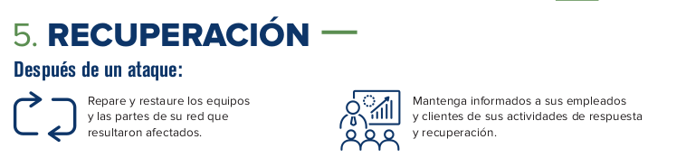

__Ciberresiliencia__

#### RA4
b) Se han preparado respuestas ciberresilientes ante incidentes que permitan seguir prestando los servicios de la organización y fortaleciendo las capacidades de identificación, detección,   prevención, contención, recuperación y cooperación con terceros.

 __working in progress__ 

#### ÍNDICE

#### Planes de respuesta

#### Ciberresiliencia

__Resiliencia__  __\, según RAE__ : En psicología\, capacidad que tiene una persona para superar circunstancias traumáticas como la muerte de un ser querido\, un accidente\, etc\.

__Resiliencia empresarial__ : se trata de la capacidad de una empresa para afrontar adversidades y recuperar su estado inicial\. Esto pone de manifiesto la fortaleza de una organización para adaptarse a los cambios\.

Cuando la empresa entra en el terreno digital\, surge la  __ciberresiliencia__

Tal y como define el Instituto Nacional de Ciberseguridad \(INCIBE\)\, la  __ciberresiliencia__  es:

_ "La capacidad para resistir\, proteger y defender el uso del ciberespacio de los atacantes"\._

Es muy común confundir conceptos como ciberseguridad y ciberresiliencia\. Aunque el enfoque es similar\, los procesos difieren entre sí\. Estas son las principales diferencias:

__Ciberseguridad__ : conjunto de tecnologías informáticas y medidas preventivas destinadas a  _proteger la empresa ante cualquier brecha de seguridad_ \, ya sea robo de datos o acceso a la red corporativa\. Por ejemplo\, el cifrado de datos\.

__Ciberresiliencia__ : este concepto unifica la tecnología de ciberseguridad y la resiliencia empresarial con el objetivo de gestionar un ciberataque sin fallos y\, sobre todo\,  _ofrecer continuidad del negocio ante un ataque_ \.

 _“_    _El mundo nos rompe a todos\.\.\. _ 

 _después algunos son fuertes en los lugares rotos\._ 

[Ernest Hemingway](https://www.frasess.net/frases-de-ernest-hemingway-470.html)

¿Causas por las que una empresa no es todo lo resiliente que desearía ante un ciberatque?

Las empresas\, en general  _están poco preparadas_  para resistir frente a este tipo de ataques\, debido principalmente a:

__Falta de medida__ s técnicas para mitigarlos\,

__Poca preparación__  de los sistemas para detener este tipo de ataques\,

__Falta de formación o de recursos__  para hacerles frente o

__Falta de pruebas__  para evaluar la capacidad real de la organización ante cualquier tipo de ataque externo\.

La mayoría de organizaciones no están cien por cien preparadas para afrontar ataques informáticos\. Esto puede ser por diversas razones:

Una  __cultura__  organizacional que no se centra en la ciberseguridad\.

Falta de  __inversión__  en tecnologías específicas para la detección y prevención de malwares\.

Falta de  __formación__  en ciberseguridad\.

¿Que necesitamos para conseguir ser resilientes?

Las organizaciones deben estar  __preparadas para__

dar respuestas rápidas a este tipo de ataques\, permitiendo que los servicios que prestan no se vean interrumpidos\,

__fortaleciendo sus capacidades __ de

identificación\, detección\, prevención\, contención\, recuperación\, cooperación y mejora continua contra las ciberamenazas\.

#### Pasos

#### Implementar la ciberresiliencia

¿Cómo implementar la ciberresiliencia?

Dada la diversidad de las organizaciones\, su complejidad interna y las interdependencias entre ellas\, no se puede generalizar una forma de implementar la ciberresiliencia\.

En cualquier caso\, es fundamental iniciar un proceso de adaptación y considerar que se debe extender a todo nuestro ecosistema \(partners\, proveedores\, clientes\,…\)\.

Se deben establecer los siguientes pasos:

__Priorizar__  los  __servicios__ \, según el  __impacto__  \(económico\, medioambiental\, público y social\, personas afectadas\) que su pérdida o deterioro pueda ocasionar\.

__Conocer y priorizar__  según su  __criticidad__  las  __amenazas__  que afectan a los servicios\.

Implementar  __acciones preventivas__  contra actuales y futuras amenazas\.

Desarrollar  __procesos de remediación__  para minimizar el daño que pueden producir los incidentes\.

__Detectar vulnerabilidades __ continuamente y remediarlas para reducir la superficie de ataque\.

__Desarrollar y mantener procesos de comunicación__  dentro de la empresa\.

Ejecutar constantemente  __acciones de mejora __ que minimicen los riesgos\, y repetir el ciclo de pasos para la mejora continua\.

#### Análisis de evidencias e investigación del incidente

5\. Recuperación

Tomando como referencia la ISO/IEC 27035\.

1\. Planificación y preparación

2\. Detección y reporte

3\. Valoración y decisión

4\. Respuesta

5\. Lecciones aprendidas

_6\. Cierre del incidente_

#### Pasos

#### Identificación de activos

Un método de clasificación de activos que simplifica el proceso consiste en dividirlos en 6 categorías diferentes\, tal y como se muestra en la imagen\.

#### Bibliografía

https://www\.incibe\.es/protege\-tu\-empresa/blog/ciberresiliencia\-marco\-medicion

_[https://www\.incibe\.es/extfrontinteco/img/File/Estudios/int\_ciber\_resiliencia\_marco\_medicion\.pdf](https://www.incibe.es/extfrontinteco/img/File/Estudios/int_ciber_resiliencia_marco_medicion.pdf)_

_[https://www\.incibe\-cert\.es/blog/ciberresiliencia\-clave\-sobreponerse\-los\-incidentes](https://www.incibe-cert.es/blog/ciberresiliencia-clave-sobreponerse-los-incidentes)_

https://agenciab12\.com/noticia/que\-es\-ciberresiliencia\-como\-influye\-seguridad

https://agenciab12\.com/noticia/medidas\-prevencion\-ciberataque

#### Actividad

#### Actividad II

Recopilación y análisis de evidencias sobre un incidente:

 _[3\.abc\.01 \- Recolección\, almacenamiento y análisis](https://educacionadistancia.juntadeandalucia.es/centros/cadiz/mod/assign/view.php?id=542235)_ 

#### 

