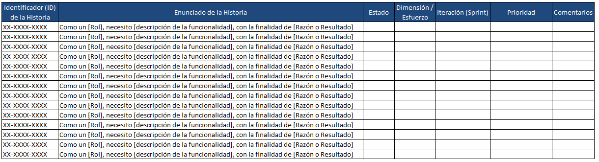
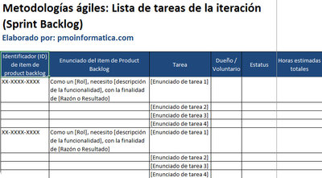

## Relación 1.2

### Descripción

Suponiendo que trabajas en un equipo siguiendo el marco de trabajo scrum, en el que se quiere construir un juego simulando un bingo:  

- Construye un product backlog muy básico que resuman todas las funcionalidades necesarias para crear el juego. 
  

[Fuente PMOInformatica.com](http://www.pmoinformatica.com/2013/11/plantillas-scrum-pila-producto-product.html)

- Simula la reunión de planificañción del sprint (Sprint planning). En ella, define el objetivo del sprint y elige los PBI (product backlog items) para llevarlo a cabo. Define las tareas asociadas a la realización de los PBI, y que constituirán el Sprint backlog. 

[Fuente PMOInformatica.com](http://www.pmoinformatica.com/2016/11/plantillas-scrum-sprint-backlog.html)

Ten en cuenta que debeis simular los diferentes roles que participan en el framework scrum.  

#### Incluir en la entrega

1. El producto backlog, con los items. 
2. El sprint backlog y el objetivo.

### Evaluación

| Criterio | Valor 1                                                                                                  | Valor 2                                                               | Valor 3                                                                                   |
| ---------- | ---------------------------------------------------------------------------------------------------------- | ----------------------------------------------------------------------- | ------------------------------------------------------------------------------------------- |
|
| RA1.g    | Realiza un slice confuso de las funcionalidades y de las tareas del sprint backlog.                                  |Realiza un slice adecuado de las funcionalidades y de las tareas del sprint backlog. | Realiza un slice completo y de las funcionalidades y de las tareas del sprint backlog, superando las expectativas del trabajo.  |

### Condiciones de entrega

El trabajo tiene las siguientes condiciones de entrega:

* Es un trabajo es en grupo..
* Se realiza en un documento de google drive, con los formatos suministrados en la presentación del ejercicio.
* El trabajo tiene que estar correctamente identificado:
    * Tu nombre
    * Identificación del ciclo y grupo.
    * Fecha
    * Identificación del módulo, unidad y ejercicio.
* Si no tiene nombre asignado, el trabajo tendrá por nombre `DAW1A_id_iniciales` donde:
    * `id`: es el identificador de la actividad, por ejemplo 1_1
    * `iniciales`: son tus iniciales por ejemplo `EFO` las mías.

### Apoyo

* https://revilofe.github.io
* [Product Backlog PMOInformatica.com](http://www.pmoinformatica.com/2013/11/plantillas-scrum-pila-producto-product.html)
* [Sprint Backlog PMOInformatica.com](http://www.pmoinformatica.com/2016/11/plantillas-scrum-sprint-backlog.html)
